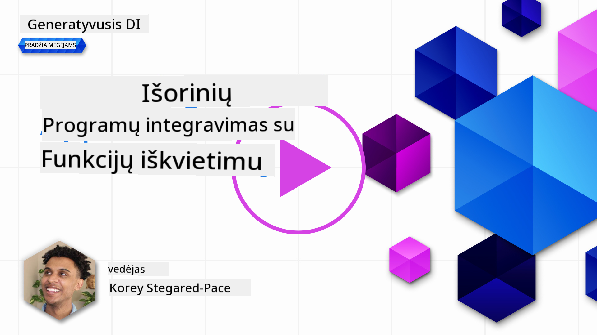

<!--
CO_OP_TRANSLATOR_METADATA:
{
  "original_hash": "77a48a201447be19aa7560706d6f93a0",
  "translation_date": "2025-08-25T12:37:17+00:00",
  "source_file": "11-integrating-with-function-calling/README.md",
  "language_code": "lt"
}
-->
# Integracija su funkcijų iškvietimu

[](https://aka.ms/gen-ai-lesson11-gh?WT.mc_id=academic-105485-koreyst)

Iki šiol jau nemažai išmokote ankstesnėse pamokose. Tačiau galime dar patobulinti savo sprendimą. Galime pasirūpinti, kad atsakymų formatas būtų nuoseklesnis, kad būtų lengviau juos apdoroti vėliau. Taip pat galime pridėti duomenų iš kitų šaltinių, kad mūsų programa būtų dar naudingesnė.

Šiame skyriuje ir bus sprendžiamos šios problemos.

## Įvadas

Šioje pamokoje sužinosite:

- Kas yra funkcijų iškvietimas ir kokiais atvejais jis naudingas.
- Kaip sukurti funkcijų iškvietimą naudojant Azure OpenAI.
- Kaip integruoti funkcijų iškvietimą į programą.

## Mokymosi tikslai

Pamokos pabaigoje gebėsite:

- Paaiškinti, kodėl verta naudoti funkcijų iškvietimą.
- Nustatyti funkcijų iškvietimą naudojant Azure OpenAI Service.
- Sukurti efektyvius funkcijų iškvietimus pagal savo programos poreikius.

## Scenarijus: Tobuliname savo pokalbių robotą su funkcijomis

Šioje pamokoje kursime funkciją savo švietimo startuoliui, kuri leis naudotojams per pokalbių robotą rasti techninius kursus. Rekomenduosime kursus pagal jų įgūdžių lygį, dabartinį vaidmenį ir dominančias technologijas.

Šiam scenarijui įgyvendinti naudosime:

- `Azure OpenAI` – pokalbių patirčiai sukurti.
- `Microsoft Learn Catalog API` – padės naudotojams rasti kursus pagal jų užklausą.
- `Function Calling` – naudotojo užklausai perduoti funkcijai, kuri atliks API užklausą.

Pradėkime nuo to, kodėl apskritai verta naudoti funkcijų iškvietimą:

## Kodėl verta naudoti funkcijų iškvietimą

Prieš atsirandant funkcijų iškvietimui, LLM atsakymai buvo nestruktūruoti ir nenuoseklūs. Kūrėjams tekdavo rašyti sudėtingą validavimo kodą, kad galėtų apdoroti įvairius atsakymų variantus. Naudotojai negalėjo gauti atsakymų į klausimus, pvz., „Koks dabar oras Stokholme?“. Taip yra todėl, kad modeliai buvo apriboti tik tuo laikotarpiu, kai buvo apmokyti.

Funkcijų iškvietimas Azure OpenAI Service padeda įveikti šiuos apribojimus:

- **Nuoseklus atsakymų formatas**. Jei galime geriau kontroliuoti atsakymų formatą, lengviau integruoti atsakymus į kitas sistemas.
- **Išoriniai duomenys**. Galimybė naudoti duomenis iš kitų programos šaltinių pokalbio kontekste.

## Problemos iliustravimas per scenarijų

> Rekomenduojame naudoti [pridėtą užrašų knygelę](python/aoai-assignment.ipynb?WT.mc_id=academic-105485-koreyst), jei norite patys išbandyti žemiau aprašytą scenarijų. Taip pat galite tiesiog skaityti toliau – norime parodyti, kaip funkcijos gali padėti spręsti tam tikras problemas.

Pažiūrėkime į pavyzdį, kuris parodo atsakymų formato problemą:

Tarkime, norime sukurti studentų duomenų bazę, kad galėtume jiems pasiūlyti tinkamus kursus. Žemiau turime du labai panašius studentų aprašymus.

1. Sukuriame ryšį su savo Azure OpenAI resursu:

   ```python
   import os
   import json
   from openai import AzureOpenAI
   from dotenv import load_dotenv
   load_dotenv()

   client = AzureOpenAI(
   api_key=os.environ['AZURE_OPENAI_API_KEY'],  # this is also the default, it can be omitted
   api_version = "2023-07-01-preview"
   )

   deployment=os.environ['AZURE_OPENAI_DEPLOYMENT']
   ```

   Žemiau pateiktas Python kodas, kaip sukonfigūruoti ryšį su Azure OpenAI, kur nustatome `api_type`, `api_base`, `api_version` ir `api_key`.

1. Sukuriame du studentų aprašymus, naudodami kintamuosius `student_1_description` ir `student_2_description`.

   ```python
   student_1_description="Emily Johnson is a sophomore majoring in computer science at Duke University. She has a 3.7 GPA. Emily is an active member of the university's Chess Club and Debate Team. She hopes to pursue a career in software engineering after graduating."

   student_2_description = "Michael Lee is a sophomore majoring in computer science at Stanford University. He has a 3.8 GPA. Michael is known for his programming skills and is an active member of the university's Robotics Club. He hopes to pursue a career in artificial intelligence after finishing his studies."
   ```

   Norime šiuos studentų aprašymus nusiųsti LLM, kad išskirtų duomenis. Šiuos duomenis vėliau galėsime naudoti savo programoje, siųsti į API ar saugoti duomenų bazėje.

1. Sukuriame du identiškus raginimus, kuriuose nurodome LLM, kokia informacija mus domina:

   ```python
   prompt1 = f'''
   Please extract the following information from the given text and return it as a JSON object:

   name
   major
   school
   grades
   club

   This is the body of text to extract the information from:
   {student_1_description}
   '''

   prompt2 = f'''
   Please extract the following information from the given text and return it as a JSON object:

   name
   major
   school
   grades
   club

   This is the body of text to extract the information from:
   {student_2_description}
   '''
   ```

   Šie raginimai nurodo LLM išskirti informaciją ir grąžinti atsakymą JSON formatu.

1. Sukonfigūravę raginimus ir ryšį su Azure OpenAI, siunčiame raginimus LLM naudodami `openai.ChatCompletion`. Raginimą saugome kintamajame `messages` ir priskiriame rolę `user`. Taip imituojame naudotojo žinutę pokalbių robote.

   ```python
   # response from prompt one
   openai_response1 = client.chat.completions.create(
   model=deployment,
   messages = [{'role': 'user', 'content': prompt1}]
   )
   openai_response1.choices[0].message.content

   # response from prompt two
   openai_response2 = client.chat.completions.create(
   model=deployment,
   messages = [{'role': 'user', 'content': prompt2}]
   )
   openai_response2.choices[0].message.content
   ```

Dabar galime išsiųsti abi užklausas LLM ir pažiūrėti, kokį atsakymą gauname, pvz., taip: `openai_response1['choices'][0]['message']['content']`.

1. Galiausiai galime konvertuoti atsakymą į JSON formatą, iškviesdami `json.loads`:

   ```python
   # Loading the response as a JSON object
   json_response1 = json.loads(openai_response1.choices[0].message.content)
   json_response1
   ```

   1 atsakymas:

   ```json
   {
     "name": "Emily Johnson",
     "major": "computer science",
     "school": "Duke University",
     "grades": "3.7",
     "club": "Chess Club"
   }
   ```

   2 atsakymas:

   ```json
   {
     "name": "Michael Lee",
     "major": "computer science",
     "school": "Stanford University",
     "grades": "3.8 GPA",
     "club": "Robotics Club"
   }
   ```

   Nors raginimai vienodi, o aprašymai panašūs, matome, kad `Grades` savybės reikšmės formatuojamos skirtingai – kartais gauname `3.7`, o kartais `3.7 GPA`.

   Taip nutinka todėl, kad LLM gauna nestruktūruotus duomenis (rašytinį raginimą) ir grąžina taip pat nestruktūruotus duomenis. Mums reikia struktūruoto formato, kad žinotume, ko tikėtis saugant ar naudojant šiuos duomenis.

Kaip išspręsti formatavimo problemą? Naudodami funkcijų iškvietimą, galime užtikrinti, kad gausime struktūruotus duomenis. Naudojant funkcijų iškvietimą, LLM iš tikrųjų neiškviečia ir nevykdo jokių funkcijų. Vietoj to, mes sukuriame struktūrą, kurios LLM laikosi atsakymuose. Tada pagal šiuos struktūruotus atsakymus žinome, kokią funkciją paleisti savo programoje.


Tada galime paimti tai, ką grąžina funkcija, ir nusiųsti atgal LLM. LLM tada atsakys natūralia kalba į naudotojo užklausą.

## Funkcijų iškvietimo panaudojimo atvejai

Yra daug skirtingų atvejų, kur funkcijų iškvietimas gali pagerinti jūsų programą, pavyzdžiui:

- **Išorinių įrankių iškvietimas**. Pokalbių robotai puikiai atsako į naudotojų klausimus. Naudodami funkcijų iškvietimą, pokalbių robotai gali naudotojų žinutes paversti konkrečiais veiksmais. Pavyzdžiui, studentas gali paprašyti roboto: „Išsiųsk el. laišką mano dėstytojui, kad man reikia daugiau pagalbos su šia tema“. Tai gali iškviesti funkciją `send_email(to: string, body: string)`

- **API ar duomenų bazės užklausų kūrimas**. Naudotojai gali rasti informaciją natūralia kalba, kuri paverčiama suformatuota užklausa ar API užklausa. Pavyzdžiui, mokytojas gali paklausti: „Kas iš studentų atliko paskutinę užduotį?“, o tai gali iškviesti funkciją `get_completed(student_name: string, assignment: int, current_status: string)`

- **Struktūruotų duomenų kūrimas**. Naudotojai gali paimti teksto bloką ar CSV ir naudoti LLM, kad ištrauktų svarbią informaciją. Pavyzdžiui, studentas gali konvertuoti Vikipedijos straipsnį apie taikos sutartis į AI atmintines. Tai galima padaryti naudojant funkciją `get_important_facts(agreement_name: string, date_signed: string, parties_involved: list)`

## Pirmojo funkcijos iškvietimo kūrimas

Funkcijos iškvietimo kūrimo procesą sudaro 3 pagrindiniai žingsniai:

1. **Išsiųsti** Chat Completions API užklausą su savo funkcijų sąrašu ir naudotojo žinute.
2. **Perskaityti** modelio atsakymą ir atlikti veiksmą, pvz., paleisti funkciją ar API užklausą.
3. **Išsiųsti** dar vieną užklausą Chat Completions API su funkcijos atsakymu, kad naudotumėte tą informaciją kuriant atsakymą naudotojui.


### 1 žingsnis – žinučių kūrimas

Pirmiausia reikia sukurti naudotojo žinutę. Tai galima priskirti dinamiškai, paėmus reikšmę iš teksto įvesties, arba priskirti čia. Jei pirmą kartą dirbate su Chat Completions API, turime apibrėžti žinutės `role` ir `content`.

`role` gali būti `system` (kuriant taisykles), `assistant` (modelis) arba `user` (galutinis naudotojas). Funkcijų iškvietimui priskirsime `user` ir pateiksime pavyzdinį klausimą.

```python
messages= [ {"role": "user", "content": "Find me a good course for a beginner student to learn Azure."} ]
```

Priskirdami skirtingas roles, LLM aiškiai supranta, ar tai sistemos, ar naudotojo žinutė, o tai padeda kurti pokalbio istoriją, kurią LLM gali plėtoti.

### 2 žingsnis – funkcijų kūrimas

Toliau apibrėšime funkciją ir jos parametrus. Čia naudosime tik vieną funkciją – `search_courses`, bet galite sukurti ir daugiau.

> **Svarbu**: Funkcijos įtraukiamos į sistemos žinutę LLM ir bus įskaičiuotos į turimų žetonų kiekį.

Žemiau funkcijas aprašome kaip masyvą. Kiekvienas elementas yra funkcija ir turi savybes `name`, `description` ir `parameters`:

```python
functions = [
   {
      "name":"search_courses",
      "description":"Retrieves courses from the search index based on the parameters provided",
      "parameters":{
         "type":"object",
         "properties":{
            "role":{
               "type":"string",
               "description":"The role of the learner (i.e. developer, data scientist, student, etc.)"
            },
            "product":{
               "type":"string",
               "description":"The product that the lesson is covering (i.e. Azure, Power BI, etc.)"
            },
            "level":{
               "type":"string",
               "description":"The level of experience the learner has prior to taking the course (i.e. beginner, intermediate, advanced)"
            }
         },
         "required":[
            "role"
         ]
      }
   }
]
```

Detaliau apie kiekvieną funkcijos aprašą:

- `name` – Funkcijos, kurią norime iškviesti, pavadinimas.
- `description` – Funkcijos veikimo aprašymas. Svarbu būti aiškiam ir konkrečiam.
- `parameters` – Reikšmių ir formato sąrašas, kurį norite, kad modelis pateiktų atsakyme. Parametrų masyvas susideda iš elementų, kurių savybės:
  1.  `type` – Duomenų tipas, kuriame bus saugomos savybės.
  1.  `properties` – Konkretūs raktai, kuriuos modelis naudos atsakyme
      1. `name` – Raktas – savybės pavadinimas, kurį modelis naudos formatuotame atsakyme, pvz., `product`.
      1. `type` – Šios savybės duomenų tipas, pvz., `string`.
      1. `description` – Konkrečios savybės aprašymas.

Taip pat yra neprivaloma savybė `required` – būtina, kad funkcijos iškvietimas būtų įvykdytas.

### 3 žingsnis – funkcijos iškvietimas

Apibrėžę funkciją, dabar turime ją įtraukti į Chat Completion API užklausą. Tai darome pridėdami `functions` prie užklausos. Šiuo atveju `functions=functions`.

Taip pat galima nustatyti `function_call` į `auto`. Tai reiškia, kad leisime LLM pačiam nuspręsti, kurią funkciją iškviesti pagal naudotojo žinutę, o ne priskirsime ją patys.

Žemiau pateiktas kodas, kuriame kviečiame `ChatCompletion.create`, atkreipkite dėmesį, kaip nustatome `functions=functions` ir `function_call="auto"`, taip suteikdami LLM galimybę pačiam pasirinkti, kada kviesti mūsų pateiktas funkcijas:

```python
response = client.chat.completions.create(model=deployment,
                                        messages=messages,
                                        functions=functions,
                                        function_call="auto")

print(response.choices[0].message)
```

Gautas atsakymas atrodo taip:

```json
{
  "role": "assistant",
  "function_call": {
    "name": "search_courses",
    "arguments": "{\n  \"role\": \"student\",\n  \"product\": \"Azure\",\n  \"level\": \"beginner\"\n}"
  }
}
```

Čia matome, kad buvo iškviesta funkcija `search_courses` ir kokie argumentai perduoti, kaip nurodyta `arguments` savybėje JSON atsakyme.

LLM sugebėjo rasti duomenis, atitinkančius funkcijos argumentus, nes juos ištraukė iš `messages` parametro reikšmės pokalbio užklausoje. Žemiau priminimas apie `messages` reikšmę:

```python
messages= [ {"role": "user", "content": "Find me a good course for a beginner student to learn Azure."} ]
```

Kaip matote, `student`, `Azure` ir `beginner` buvo ištraukta iš `messages` ir perduota funkcijai kaip įvestis. Tokiu būdu naudojant funkcijas galima ne tik išgauti informaciją iš raginimo, bet ir suteikti LLM struktūrą bei turėti daugkartinio naudojimo funkcionalumą.

Toliau pažiūrėsime, kaip tai pritaikyti savo programoje.

## Funkcijų iškvietimo integravimas į programą

Išbandę LLM grąžinamą suformatuotą atsakymą, galime integruoti tai į savo programą.

### Srauto valdymas

Norėdami integruoti tai į savo programą, atlikime šiuos veiksmus:

1. Pirmiausia išsiųskime užklausą OpenAI paslaugai ir saugokime žinutę kintamajame `response_message`.

   ```python
   response_message = response.choices[0].message
   ```

1. Dabar apibrėšime funkciją, kuri iškvies Microsoft Learn API ir gaus kursų sąrašą:

   ```python
   import requests

   def search_courses(role, product, level):
     url = "https://learn.microsoft.com/api/catalog/"
     params = {
        "role": role,
        "product": product,
        "level": level
     }
     response = requests.get(url, params=params)
     modules = response.json()["modules"]
     results = []
     for module in modules[:5]:
        title = module["title"]
        url = module["url"]
        results.append({"title": title, "url": url})
     return str(results)
   ```

   Atkreipkite dėmesį, kad dabar kuriame tikrą Python funkciją, kuri atitinka funkcijų, aprašytų `functions` kintamajame, pavadinimus. Taip pat atliekame tikras išorines API užklausas, kad gautume reikiamus duomenis. Šiuo atveju naudojame Microsoft Learn API, kad ieškotume mokymų modulių.

Gerai, sukūrėme `functions` kintamuosius ir atitinkamą Python funkciją, bet kaip pasakyti LLM, kaip juos susieti, kad būtų iškviesta mūsų Python funkcija?

1. Norėdami patikrinti, ar reikia kviesti Python funkciją, turime pažiūrėti į LLM atsakymą ir patikrinti, ar jame yra `function_call`, ir iškviesti nurodytą funkciją. Štai kaip galite atlikti šį patikrinimą:

   ```python
   # Check if the model wants to call a function
   if response_message.function_call.name:
    print("Recommended Function call:")
    print(response_message.function_call.name)
    print()

    # Call the function.
    function_name = response_message.function_call.name

    available_functions = {
            "search_courses": search_courses,
    }
    function_to_call = available_functions[function_name]

    function_args = json.loads(response_message.function_call.arguments)
    function_response = function_to_call(**function_args)

    print("Output of function call:")
    print(function_response)
    print(type(function_response))


    # Add the assistant response and function response to the messages
    messages.append( # adding assistant response to messages
        {
            "role": response_message.role,
            "function_call": {
                "name": function_name,
                "arguments": response_message.function_call.arguments,
            },
            "content": None
        }
    )
    messages.append( # adding function response to messages
        {
            "role": "function",
            "name": function_name,
            "content":function_response,
        }
    )
   ```

   Šios trys eilutės užtikrina, kad ištraukiame funkcijos pavadinimą, argumentus ir iškviečiame funkciją:

   ```python
   function_to_call = available_functions[function_name]

   function_args = json.loads(response_message.function_call.arguments)
   function_response = function_to_call(**function_args)
   ```

   Žemiau pateiktas mūsų kodo rezultatas:

   **Rezultatas**

   ```Recommended Function call:
   {
     "name": "search_courses",
     "arguments": "{\n  \"role\": \"student\",\n  \"product\": \"Azure\",\n  \"level\": \"beginner\"\n}"
   }

   Output of function call:
   [{'title': 'Describe concepts of cryptography', 'url': 'https://learn.microsoft.com/training/modules/describe-concepts-of-cryptography/?
   WT.mc_id=api_CatalogApi'}, {'title': 'Introduction to audio classification with TensorFlow', 'url': 'https://learn.microsoft.com/en-
   us/training/modules/intro-audio-classification-tensorflow/?WT.mc_id=api_CatalogApi'}, {'title': 'Design a Performant Data Model in Azure SQL
   Database with Azure Data Studio', 'url': 'https://learn.microsoft.com/training/modules/design-a-data-model-with-ads/?
   WT.mc_id=api_CatalogApi'}, {'title': 'Getting started with the Microsoft Cloud Adoption Framework for Azure', 'url':
   'https://learn.microsoft.com/training/modules/cloud-adoption-framework-getting-started/?WT.mc_id=api_CatalogApi'}, {'title': 'Set up the
   Rust development environment', 'url': 'https://learn.microsoft.com/training/modules/rust-set-up-environment/?WT.mc_id=api_CatalogApi'}]
   <class 'str'>
   ```

1. Dabar išsiųsime atnaujintą žinutę, `messages`, LLM, kad gautume atsakymą natūralia kalba, o ne API JSON formatu.

   ```python
   print("Messages in next request:")
   print(messages)
   print()

   second_response = client.chat.completions.create(
      messages=messages,
      model=deployment,
      function_call="auto",
      functions=functions,
      temperature=0
         )  # get a new response from GPT where it can see the function response


   print(second_response.choices[0].message)
   ```

   **Rezultatas**

   ```python
   {
     "role": "assistant",
     "content": "I found some good courses for beginner students to learn Azure:\n\n1. [Describe concepts of cryptography] (https://learn.microsoft.com/training/modules/describe-concepts-of-cryptography/?WT.mc_id=api_CatalogApi)\n2. [Introduction to audio classification with TensorFlow](https://learn.microsoft.com/training/modules/intro-audio-classification-tensorflow/?WT.mc_id=api_CatalogApi)\n3. [Design a Performant Data Model in Azure SQL Database with Azure Data Studio](https://learn.microsoft.com/training/modules/design-a-data-model-with-ads/?WT.mc_id=api_CatalogApi)\n4. [Getting started with the Microsoft Cloud Adoption Framework for Azure](https://learn.microsoft.com/training/modules/cloud-adoption-framework-getting-started/?WT.mc_id=api_CatalogApi)\n5. [Set up the Rust development environment](https://learn.microsoft.com/training/modules/rust-set-up-environment/?WT.mc_id=api_CatalogApi)\n\nYou can click on the links to access the courses."
   }

   ```

## Užduotis

Norėdami toliau gilinti žinias apie Azure OpenAI funkcijų iškvietimą, galite:

- Pridėti daugiau funkcijos parametrų, kurie padėtų besimokantiems rasti daugiau kursų.
- Sukurti dar vieną funkcijos iškvietimą, kuris paimtų daugiau informacijos iš besimokančiojo, pvz., jo gimtąją kalbą.
- Sukurti klaidų valdymą, kai funkcijos ar API užklausa negrąžina tinkamų kursų.
Patarimas: Sekite [Learn API nuorodų dokumentaciją](https://learn.microsoft.com/training/support/catalog-api-developer-reference?WT.mc_id=academic-105485-koreyst), kad sužinotumėte, kaip ir kur šie duomenys yra prieinami.

## Puikus darbas! Tęskite kelionę

Baigę šią pamoką, peržiūrėkite mūsų [Generatyvinio DI mokymosi kolekciją](https://aka.ms/genai-collection?WT.mc_id=academic-105485-koreyst), kad toliau gilintumėte žinias apie generatyvinį dirbtinį intelektą!

Eikite į 12 pamoką, kurioje aptarsime, kaip [kurti UX dirbtinio intelekto programoms](../12-designing-ux-for-ai-applications/README.md?WT.mc_id=academic-105485-koreyst)!

---

**Atsakomybės atsisakymas**:  
Šis dokumentas buvo išverstas naudojant dirbtinio intelekto vertimo paslaugą [Co-op Translator](https://github.com/Azure/co-op-translator). Nors siekiame tikslumo, prašome atkreipti dėmesį, kad automatiniai vertimai gali turėti klaidų ar netikslumų. Originalus dokumentas jo gimtąja kalba turėtų būti laikomas autoritetingu šaltiniu. Svarbios informacijos atveju rekomenduojame profesionalų žmogaus vertimą. Mes neatsakome už nesusipratimus ar neteisingą interpretavimą, kilusį dėl šio vertimo naudojimo.