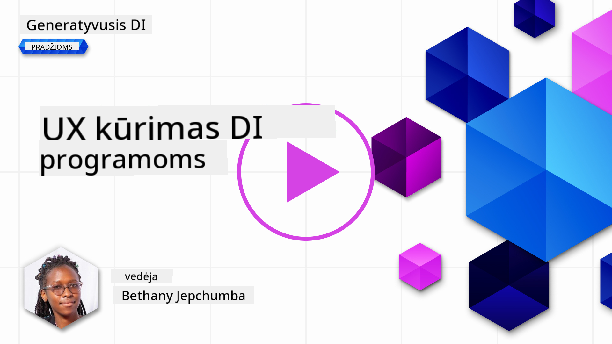
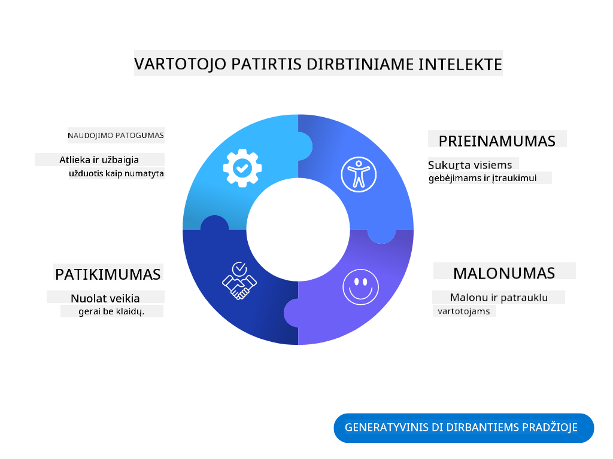
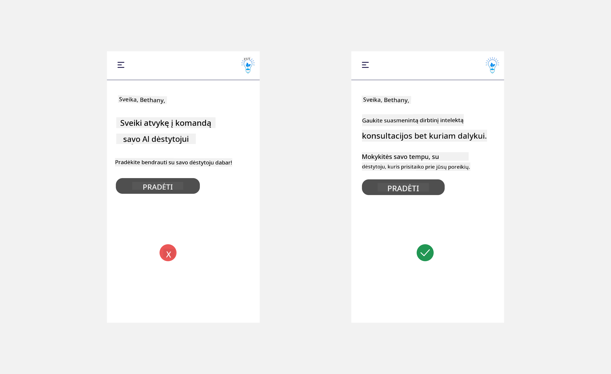
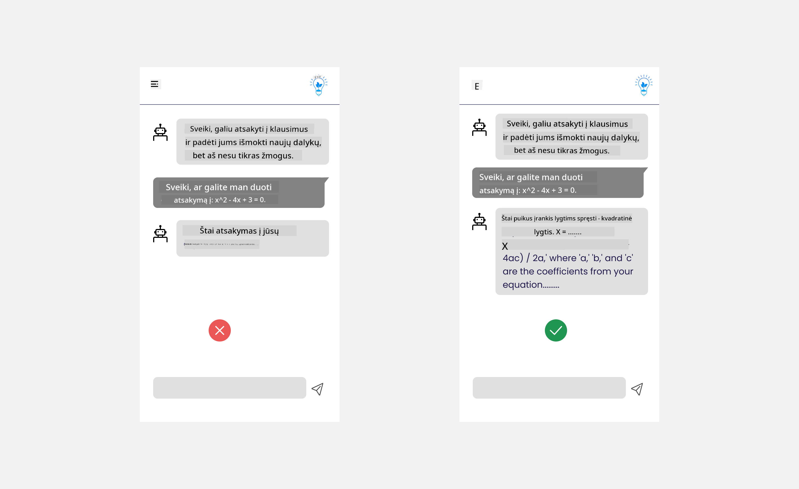
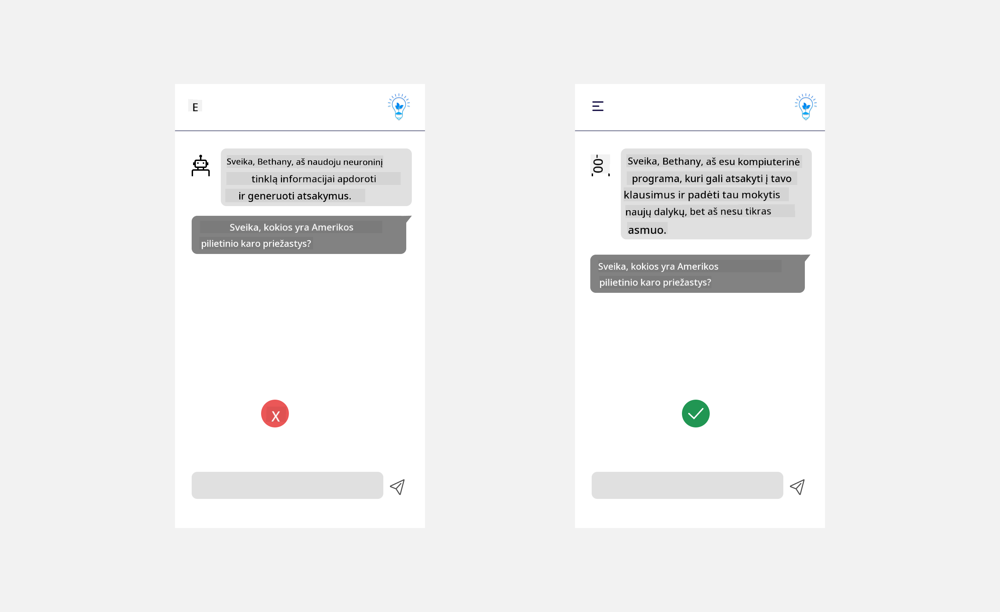
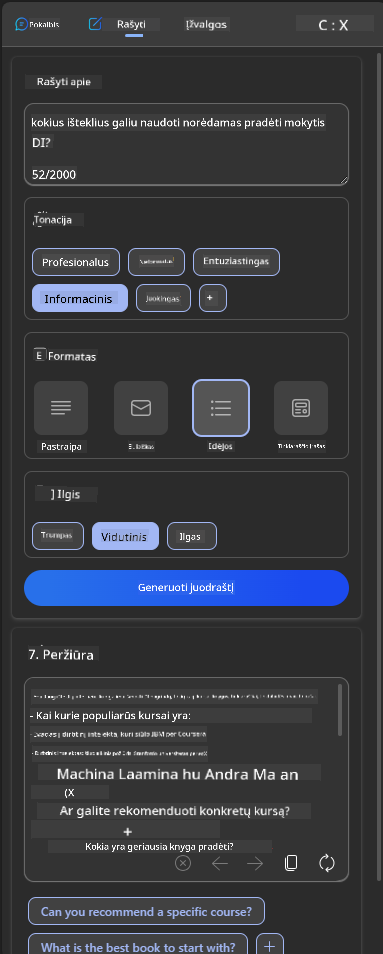
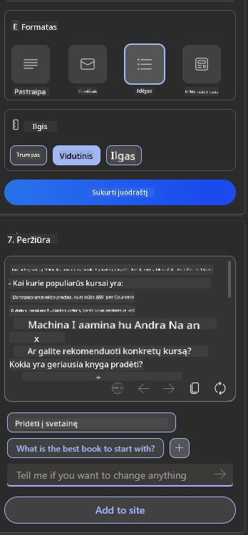
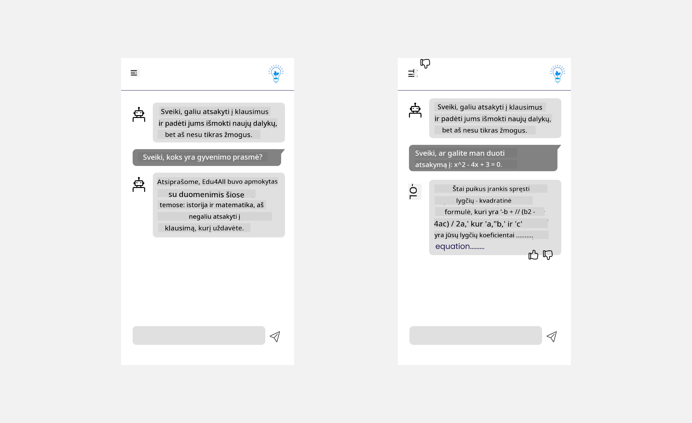

<!--
CO_OP_TRANSLATOR_METADATA:
{
  "original_hash": "747668e4c53d067369f06e9ec2e6313e",
  "translation_date": "2025-08-26T20:21:17+00:00",
  "source_file": "12-designing-ux-for-ai-applications/README.md",
  "language_code": "lt"
}
-->
# UX kūrimas AI programoms

> _(Spustelėkite paveikslėlį aukščiau, kad peržiūrėtumėte šios pamokos vaizdo įrašą)_

Vartotojo patirtis yra labai svarbi kuriant programas. Vartotojai turi galėti naudotis jūsų programa efektyviai, kad galėtų atlikti užduotis. Efektyvumas yra svarbu, tačiau taip pat reikia kurti programas taip, kad jomis galėtų naudotis visi – kad jos būtų _prieinamos_. Šiame skyriuje bus nagrinėjama ši sritis, kad galų gale sukurtumėte programą, kurią žmonės gali ir nori naudoti.

## Įvadas

Vartotojo patirtis – tai, kaip vartotojas sąveikauja su konkrečiu produktu ar paslauga, nesvarbu, ar tai sistema, įrankis ar dizainas. Kuriant AI programas, kūrėjai rūpinasi ne tik tuo, kad vartotojo patirtis būtų efektyvi, bet ir etiška. Šioje pamokoje aptarsime, kaip kurti dirbtinio intelekto (AI) programas, kurios atitiktų vartotojų poreikius.

Pamokoje bus aptariamos šios sritys:

- Vartotojo patirties įvadas ir vartotojų poreikių supratimas
- AI programų kūrimas pasitikėjimui ir skaidrumui
- AI programų kūrimas bendradarbiavimui ir grįžtamajam ryšiui

## Mokymosi tikslai

Išklausę šią pamoką, galėsite:

- Suprasti, kaip kurti AI programas, atitinkančias vartotojų poreikius.
- Kurti AI programas, kurios skatina pasitikėjimą ir bendradarbiavimą.

### Būtinos žinios

Skirkite laiko ir pasiskaitykite daugiau apie [vartotojo patirtį ir dizaino mąstymą.](https://learn.microsoft.com/training/modules/ux-design?WT.mc_id=academic-105485-koreyst)

## Vartotojo patirties įvadas ir vartotojų poreikių supratimas

Mūsų išgalvotoje švietimo startuolio įmonėje turime du pagrindinius vartotojus – mokytojus ir mokinius. Kiekvienas iš jų turi savitų poreikių. Į vartotoją orientuotas dizainas prioritetą teikia vartotojui, užtikrindamas, kad produktai būtų aktualūs ir naudingi tiems, kam jie skirti.

Programa turi būti **naudinga, patikima, prieinama ir maloni**, kad užtikrintų gerą vartotojo patirtį.

### Naudojamumas

Naudinga programa – tai tokia, kurios funkcionalumas atitinka jos paskirtį, pavyzdžiui, automatizuoja vertinimo procesą ar generuoja korteles kartojimui. Programa, kuri automatizuoja vertinimą, turi gebėti tiksliai ir efektyviai priskirti balus mokinių darbams pagal iš anksto nustatytus kriterijus. Panašiai, programa, kuri generuoja korteles, turi sukurti aktualius ir įvairius klausimus pagal turimus duomenis.

### Patikimumas

Patikima programa – tai tokia, kuri nuolat ir be klaidų atlieka savo užduotį. Tačiau AI, kaip ir žmonės, nėra tobula ir gali klysti. Programos gali susidurti su klaidomis ar netikėtomis situacijomis, kurioms reikia žmogaus įsikišimo ar pataisymo. Kaip tvarkytis su klaidomis? Paskutinėje šios pamokos dalyje aptarsime, kaip AI sistemos ir programos kuriamos bendradarbiavimui ir grįžtamajam ryšiui.

### Prieinamumas

Prieinama programa – tai tokia, kurią gali naudoti įvairių gebėjimų vartotojai, įskaitant turinčius negalią, kad niekas neliktų nuošalyje. Vadovaujantis prieinamumo gairėmis ir principais, AI sprendimai tampa labiau įtraukiantys, patogūs ir naudingi visiems vartotojams.

### Malonumas

Maloni programa – tai tokia, kuria naudotis yra smagu. Patraukli vartotojo patirtis gali turėti teigiamą poveikį vartotojui, paskatinti jį sugrįžti prie programos ir padidinti verslo pajamas.

Ne kiekvieną iššūkį galima išspręsti su AI. AI padeda pagerinti vartotojo patirtį – ar tai būtų rankinių užduočių automatizavimas, ar vartotojo patirties personalizavimas.

## AI programų kūrimas pasitikėjimui ir skaidrumui

Pasitikėjimo kūrimas yra labai svarbus kuriant AI programas. Pasitikėjimas užtikrina, kad vartotojas bus tikras, jog programa atliks darbą, nuosekliai pateiks rezultatus ir tie rezultatai bus tokie, kokių reikia vartotojui. Šioje srityje kyla rizika dėl nepasitikėjimo ir per didelio pasitikėjimo. Nepasitikėjimas atsiranda, kai vartotojas mažai arba visai nepasitiki AI sistema – tuomet vartotojas atmeta jūsų programą. Per didelis pasitikėjimas atsiranda, kai vartotojas pervertina AI sistemos galimybes ir pernelyg ja pasitiki. Pavyzdžiui, automatizuota vertinimo sistema, jei ja per daug pasitikima, gali paskatinti mokytoją neperžiūrėti kai kurių darbų, kad įsitikintų, ar sistema veikia gerai. Tai gali lemti neteisingus ar netikslius įvertinimus mokiniams arba praleistas galimybes grįžtamajam ryšiui ir tobulėjimui.

Du būdai, kaip užtikrinti, kad pasitikėjimas būtų dizaino centre – paaiškinamumas ir kontrolė.

### Paaiškinamumas

Kai AI padeda priimti sprendimus, pavyzdžiui, perduodant žinias ateities kartoms, labai svarbu, kad mokytojai ir tėvai suprastų, kaip AI priima sprendimus. Tai ir yra paaiškinamumas – supratimas, kaip AI programos priima sprendimus. Kuriant paaiškinamumą, reikia pridėti detalių, kurios parodo, kaip AI pasiekė rezultatą. Auditorija turi žinoti, kad rezultatas sukurtas AI, o ne žmogaus. Pavyzdžiui, vietoj „Pradėkite pokalbį su savo mokytoju dabar“ sakykite „Naudokite AI mokytoją, kuris prisitaiko prie jūsų poreikių ir padeda mokytis jūsų tempu.“

Kitas pavyzdys – kaip AI naudoja vartotojo ir asmeninius duomenis. Pavyzdžiui, vartotojas su mokinio persona gali turėti apribojimų pagal savo rolę. AI galbūt negalės atskleisti atsakymų į klausimus, bet gali padėti vartotojui pagalvoti, kaip išspręsti problemą.

Dar vienas svarbus paaiškinamumo aspektas – paaiškinimų supaprastinimas. Mokiniai ir mokytojai gali būti ne AI ekspertai, todėl paaiškinimai, ką programa gali ar negali padaryti, turi būti paprasti ir lengvai suprantami.

### Kontrolė

Generatyvusis AI sukuria bendradarbiavimą tarp AI ir vartotojo, kai, pavyzdžiui, vartotojas gali keisti užklausas, kad gautų skirtingus rezultatus. Be to, kai rezultatas jau sugeneruotas, vartotojai turėtų galėti jį keisti, taip suteikiant jiems kontrolės jausmą. Pavyzdžiui, naudojant Bing, galite pritaikyti užklausą pagal formatą, toną ir ilgį. Taip pat galite keisti rezultatą, kaip parodyta žemiau:

Kita Bing funkcija, leidžianti vartotojui valdyti programą, yra galimybė pasirinkti, ar leisti AI naudoti duomenis, ar ne. Mokyklos programoje mokinys gali norėti naudoti savo užrašus ir mokytojo pateiktus išteklius kaip kartojimo medžiagą.

> Kuriant AI programas, labai svarbu sąmoningai užtikrinti, kad vartotojai nepervertintų AI galimybių ir nesusidarytų nerealistiškų lūkesčių. Vienas būdas tai padaryti – sukurti tam tikrą „trintį“ tarp užklausų ir rezultatų. Priminkite vartotojui, kad tai AI, o ne žmogus.

## AI programų kūrimas bendradarbiavimui ir grįžtamajam ryšiui

Kaip jau minėta, generatyvusis AI sukuria bendradarbiavimą tarp vartotojo ir AI. Dažniausiai vartotojas įveda užklausą, o AI sugeneruoja rezultatą. O kas, jei rezultatas neteisingas? Kaip programa tvarkosi su klaidomis, jei jos įvyksta? Ar AI kaltina vartotoją, ar paaiškina klaidą?

AI programos turi būti sukurtos taip, kad galėtų priimti ir teikti grįžtamąjį ryšį. Tai padeda ne tik tobulinti AI sistemą, bet ir stiprina pasitikėjimą vartotojais. Dizaino procese turi būti įtrauktas grįžtamojo ryšio ciklas – pavyzdžiui, paprastas „patinka“ arba „nepatinka“ mygtukas prie rezultato.

Kitas būdas – aiškiai komunikuoti sistemos galimybes ir ribas. Kai vartotojas padaro klaidą, prašydamas kažko, ko AI negali, turi būti būdas tai tvarkyti, kaip parodyta žemiau.

Sistemos klaidos dažnos programose, kai vartotojui gali prireikti informacijos, kuri neįeina į AI galimybių ribas, arba programa gali turėti apribojimų, kiek klausimų ar temų vartotojas gali sugeneruoti santraukas. Pavyzdžiui, AI programa, apmokyta tik su ribotų dalykų duomenimis, pavyzdžiui, istorijos ir matematikos, gali nesugebėti atsakyti į geografijos klausimus. Tokiu atveju AI sistema gali atsakyti: „Atsiprašome, mūsų produktas apmokytas su šių dalykų duomenimis....., negaliu atsakyti į jūsų klausimą.“

AI programos nėra tobulos, todėl jos neišvengiamai darys klaidų. Kurdami savo programas, turėtumėte užtikrinti, kad būtų galimybė vartotojams pateikti grįžtamąjį ryšį ir kad klaidos būtų tvarkomos paprastai ir aiškiai.

## Užduotis

Paimkite bet kurią iki šiol sukurtą AI programą ir apsvarstykite, kaip galėtumėte įgyvendinti šiuos žingsnius:

- **Malonumas:** Pagalvokite, kaip galite padaryti savo programą malonesnę. Ar visur pateikiate paaiškinimus? Ar skatinate vartotoją tyrinėti? Kaip formuluojate klaidų pranešimus?

- **Naudojamumas:** Kuriate internetinę programą. Įsitikinkite, kad jūsų programa galima naudotis tiek pele, tiek klaviatūra.

- **Pasitikėjimas ir skaidrumas:** Nepasitikėkite AI ir jos rezultatais aklai – pagalvokite, kaip galėtumėte įtraukti žmogų rezultatų patikrinimui. Taip pat apsvarstykite ir įgyvendinkite kitus būdus pasitikėjimui ir skaidrumui užtikrinti.

- **Kontrolė:** Suteikite vartotojui galimybę valdyti duomenis, kuriuos jis pateikia programai. Įgyvendinkite būdą, kaip vartotojas galėtų sutikti ar atsisakyti duomenų rinkimo AI programoje.

## Tęskite mokymąsi!

Išklausę šią pamoką, peržiūrėkite mūsų [Generatyvaus AI mokymosi kolekciją](https://aka.ms/genai-collection?WT.mc_id=academic-105485-koreyst), kad dar labiau pagilintumėte žinias apie generatyvųjį AI!

Eikite į 13 pamoką, kurioje aptarsime, kaip [apsaugoti AI programas](../13-securing-ai-applications/README.md?WT.mc_id=academic-105485-koreyst)!

---

**Atsakomybės atsisakymas**:  
Šis dokumentas buvo išverstas naudojant dirbtinio intelekto vertimo paslaugą [Co-op Translator](https://github.com/Azure/co-op-translator). Nors siekiame tikslumo, atkreipkite dėmesį, kad automatiniai vertimai gali turėti klaidų ar netikslumų. Originalus dokumentas jo gimtąja kalba turėtų būti laikomas autoritetingu šaltiniu. Svarbiai informacijai rekomenduojame profesionalų žmogaus vertimą. Mes neprisiimame atsakomybės už bet kokius nesusipratimus ar neteisingą interpretavimą, kilusį naudojantis šiuo vertimu.