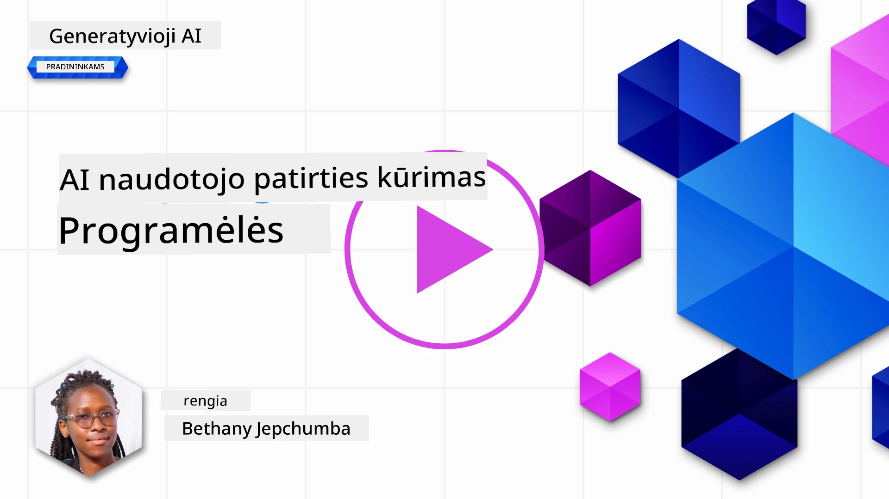
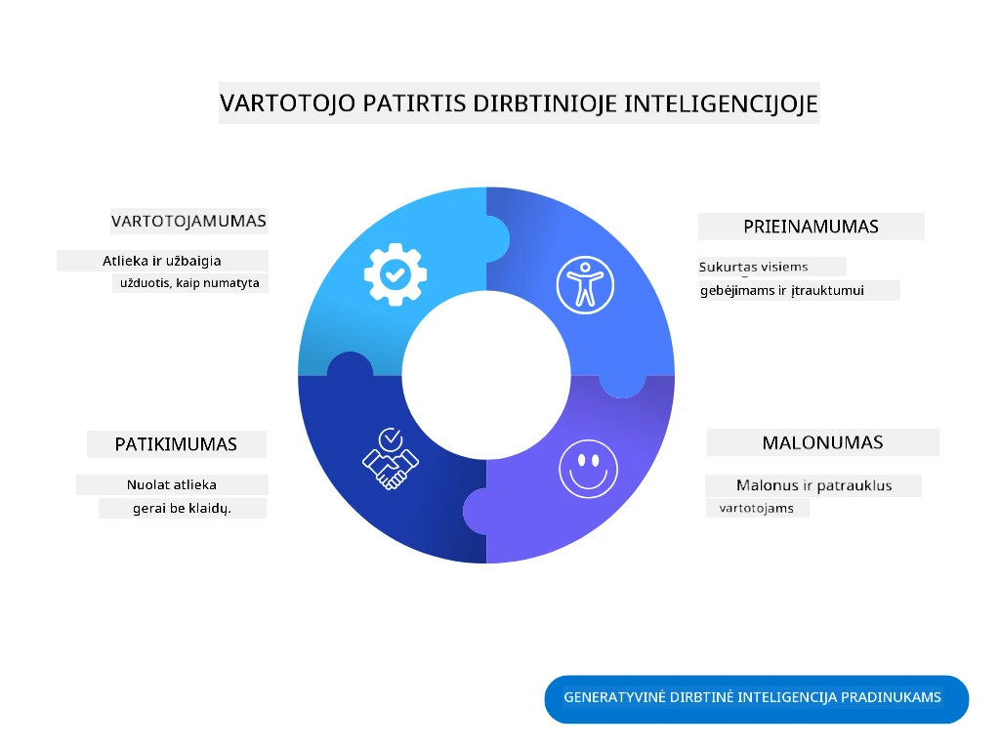
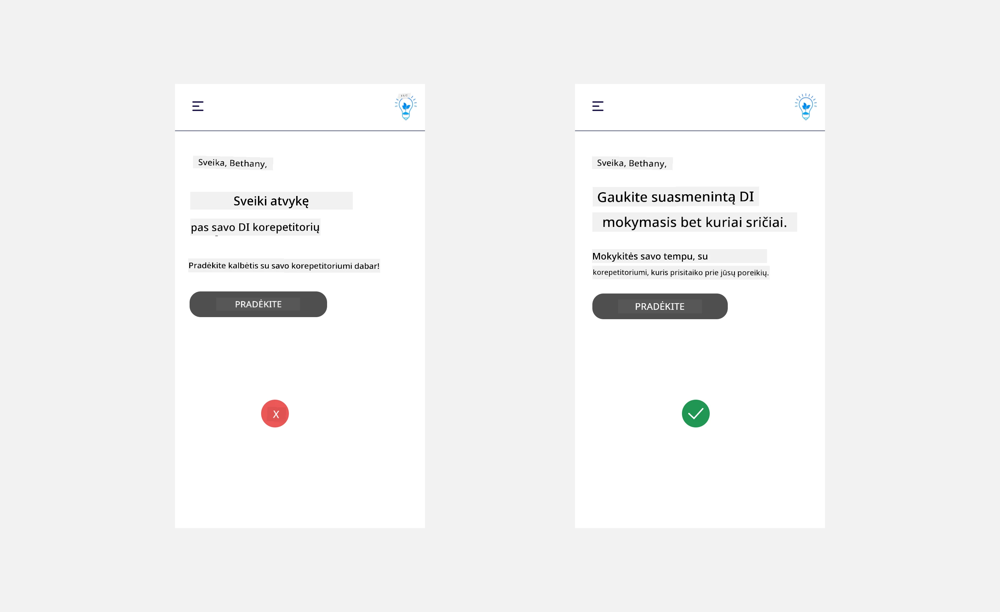
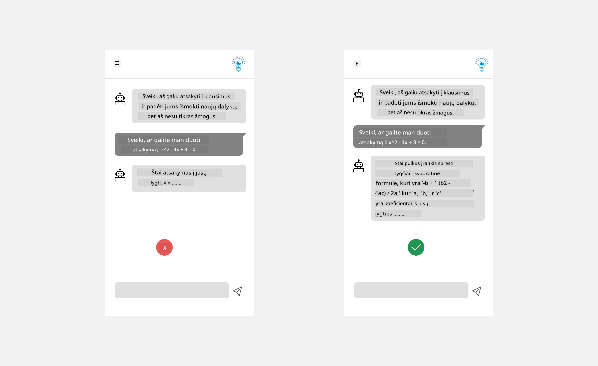
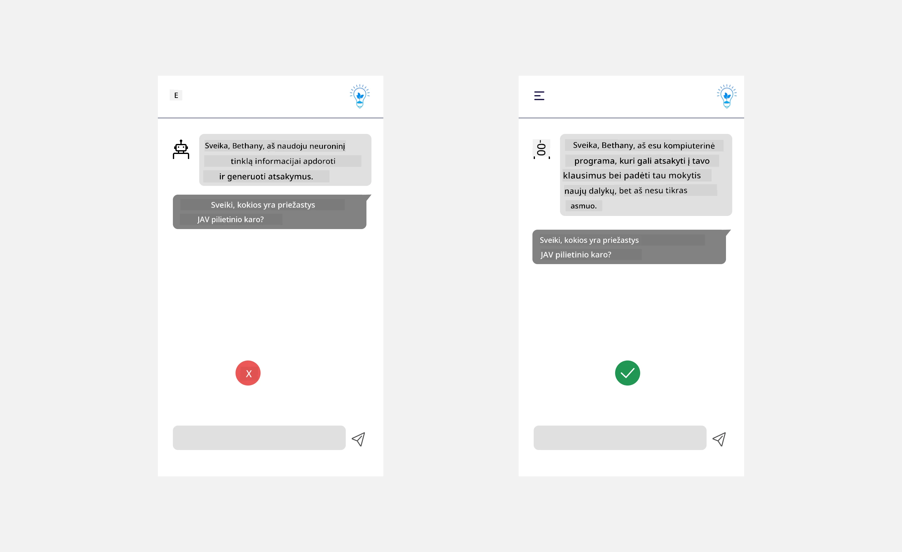
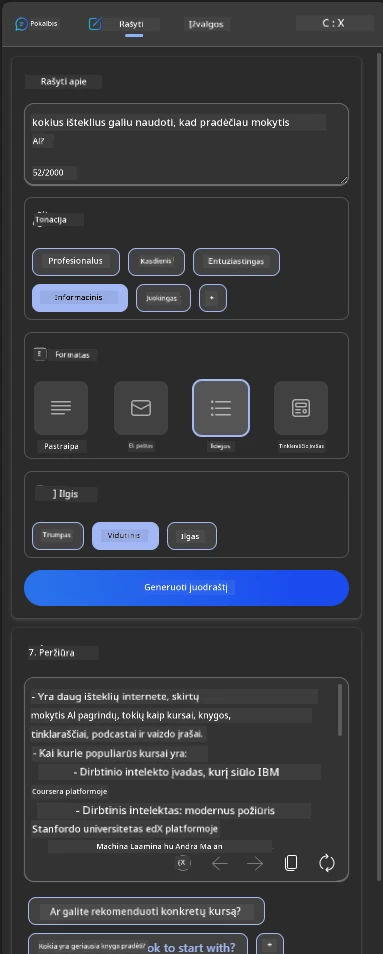
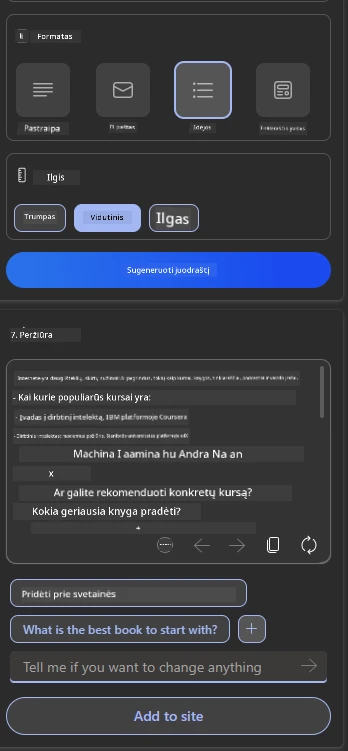
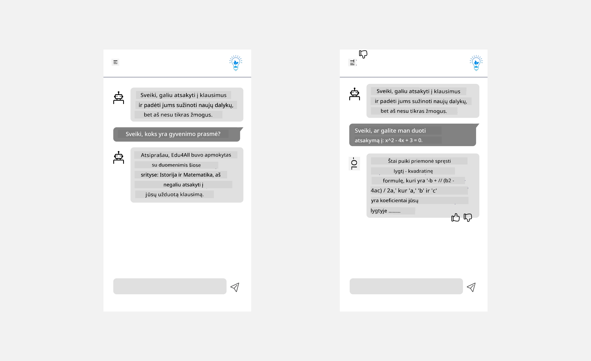

# Dirbant UX dizainą AI programoms

> _(Spustelėkite aukščiau esantį paveikslėlį, kad peržiūrėtumėte šios pamokos vaizdo įrašą)_

Naudotojo patirtis yra labai svarbus aspektas kuriant programas. Vartotojai turi galėti efektyviai naudotis jūsų programa atlikdami užduotis. Efektyvumas yra svarbus dalykas, tačiau taip pat turite projektuoti programas taip, kad jas galėtų naudoti visi, t. y. kad jos būtų _prieinamos_. Šiame skyriuje bus sutelktas dėmesys į šį aspektą, kad tikėtina prieš pabaigą sukurtumėte programą, kurią žmonės gali ir nori naudoti.

## Įvadas

Naudotojo patirtis reiškia, kaip naudotojas sąveikauja su tam tikru produktu ar paslauga, tai gali būti sistema, įrankis ar dizainas. Kuriant AI programas, kūrėjai orientuojasi ne tik į tai, kad naudotojo patirtis būtų efektyvi, bet ir į tai, kad ji būtų etiška. Šioje pamokoje aptarsime, kaip kurti dirbtinio intelekto (DI) programas, kurios atitinka naudotojų poreikius.

Pamoka aprėps šias sritis:

- Įvadas į naudotojo patirtį ir naudotojų poreikių suvokimas
- AI programų kūrimas patikimumui ir skaidrumui užtikrinti
- AI programų kūrimas bendradarbiavimui ir grįžtamajam ryšiui skatinti

## Mokymosi tikslai

Po šios pamokos galėsite:

- Suprasti, kaip kurti AI programas, atitinkančias naudotojų poreikius.
- Kurti AI programas, kurios skatina pasitikėjimą ir bendradarbiavimą.

### Išankstinis pasiruošimas

Skirkite šiek tiek laiko ir perskaitykite daugiau apie [naudotojo patirtį ir dizaino mąstymą.](https://learn.microsoft.com/training/modules/ux-design?WT.mc_id=academic-105485-koreyst)

## Įvadas į naudotojo patirtį ir naudotojų poreikių suvokimas

Mūsų fiktyviame švietimo startuolyje yra du pagrindiniai naudotojai – mokytojai ir mokiniai. Kiekvienas iš jų turi unikalius poreikius. Vartotojams orientuotas dizainas pirmajame plane laiko naudotoją, užtikrindamas, kad produktai būtų aktualūs ir naudingi tiems, kam jie skirti.

Programa turėtų būti **naudinga, patikima, prieinama ir maloni** norint suteikti gerą naudotojo patirtį.

### Naudojamumas

Būti naudinga reiškia, kad programa turi funkcionalumą, atitinkantį jos paskirtį, pavyzdžiui, automatizuoti vertinimo procesą ar generuoti korteles peržiūrai. Programa, automatizuojanti vertinimo procesą, turėtų tiksliai ir efektyviai priskirti įvertinimus mokinių darbams pagal iš anksto nustatytus kriterijus. Panašiai programa, generuojanti peržiūros korteles, turėtų sukurti aktualius ir įvairius klausimus pagal turimus duomenis.

### Patikimumas

Būti patikima reiškia, kad programa gali nuosekliai ir be klaidų atlikti savo užduotį. Visgi DI, kaip ir žmonės, nėra tobulas ir gali klysti. Programos gali susidurti su klaidomis ar netikėtomis situacijomis, reikalaujančiomis žmogaus įsikišimo ar pataisymo. Kaip jūs tvarkotės su klaidomis? Šios pamokos paskutinėje dalyje aptarsime, kaip AI sistemos ir programos yra sukuriamos bendradarbiavimui ir grįžtamajam ryšiui.

### Prieinamumas

Būti prieinama reiškia išplėsti naudotojo patirtį vartotojams su įvairiomis galimybėmis, įskaitant tuos, kurie turi negalią, užtikrinant, kad niekas nebūtų paliktas nuošalyje. Laikantis prieinamumo gairių ir principų, DI sprendimai tampa labiau įtraukiantys, naudingi ir naudotojams patogūs.

### Malonumas

Būti maloniu reiškia, kad programa yra maloni naudoti. Patraukli naudotojo patirtis gali turėti teigiamą poveikį naudotojui, skatindama jį sugrįžti į programą ir didinant verslo pajamas.

Ne kiekvieną iššūkį galima išspręsti su DI. DI skirtas papildyti jūsų naudotojo patirtį, pvz., automatizuoti rankinius darbus ar suasmeninti naudotojo patirtį.

## AI programų kūrimas pasitikėjimui ir skaidrumui užtikrinti

Pasitikėjimo kūrimas yra esminis AI programų kūrimo aspektas. Pasitikėjimas užtikrina, kad naudotojas yra įsitikinęs, kad programa atliks užduotį, nuosekliai pateiks rezultatus, o rezultatai atitiks naudotojo poreikius. Rizika šioje srityje yra nepasitikėjimas ir perdėtas pasitikėjimas. Nepasitikėjimas atsiranda, kai naudotojas praktiškai netiki DI sistema, todėl atmeta jūsų programą. Perdėtas pasitikėjimas – kai naudotojas pervertina DI sistemos galimybes, todėl per daug pasitiki DI sistema. Pavyzdžiui, automatizuota vertinimo sistema perdėto pasitikėjimo atveju gali lemti, kad mokytojas neperžiūri kai kurių darbų, kad įsitikintų, jog vertinimo sistema veikia tinkamai. Tai gali lemti neteisingus ar netikslius įvertinimus mokiniams ar praleistas galimybes suteikti grįžtamąjį ryšį ir tobulėjimą.

Du būdai įsitikinti, kad pasitikėjimas yra dizaino centre, yra aiškumas ir kontrolė.

### Aiškumas

Kai DI padeda priimti sprendimus, pavyzdžiui, perduoti žinias ateities kartoms, mokytojams ir tėvams yra labai svarbu suprasti, kaip DI priima sprendimus. Tai yra aiškumas – supratimas, kaip AI programos priima sprendimus. Kuriant aiškumo dizainą, įtraukiamos detalės, parodančios, kaip DI priėjo prie rezultato. Auditorija turi žinoti, kad rezultatas yra sugeneruotas DI, o ne žmogaus. Pavyzdžiui, vietoje sakinio "Pradėkite kalbėtis su savo mokytoju dabar" sakykite "Naudokite DI mokytoją, kuris prisitaiko prie jūsų poreikių ir padeda mokytis savo tempu."

Dar vienas pavyzdys, kaip DI naudoja naudotojo ir asmens duomenis. Pavyzdžiui, naudotojas su studento personaže gali turėti apribojimų, priklausomai nuo savo personos. DI gali negalėti atskleisti atsakymų į klausimus, tačiau gali padėti vartotojui mąstyti, kaip spręsti problemą.

Paskutinė svarbi aiškumo dalis yra paaiškinimų supaprastinimas. Mokiniai ir mokytojai gali būti ne DI ekspertai, todėl paaiškinimai, ką programa gali ar negali daryti, turėtų būti supaprastinti ir lengvai suprantami.

### Kontrolė

Generatyvinis DI sukuria bendradarbiavimą tarp DI ir naudotojo, kai, pavyzdžiui, naudotojas gali modifikuoti užklausas skirtingiems rezultatams gauti. Be to, kai rezultatas yra sugeneruotas, naudotojai turėtų galėti jį keisti, suteikiant jiems kontrolės jausmą. Pavyzdžiui, naudodami Microsoft Copilot (anksčiau Bing Chat) galite pritaikyti savo užklausą pagal formatą, toną ir ilgį. Be to, galite pridėti pakeitimus prie savo rezultato ir modifikuoti rezultatą, kaip parodyta žemiau:

Kita Microsoft Copilot funkcija, leidžianti naudotojui kontroliuoti programą, yra galimybė pasirinkti, ar naudoti, ar atsisakyti DI naudojamų duomenų. Mokyklos programoje mokinys gali norėti naudotis savo užrašais ir mokytojų šaltiniais kaip peržiūros medžiaga.

> Kuriant AI programas, ketinimai yra labai svarbūs, kad naudotojai nepervertintų programos galimybių ir nesitikėtų nerealių rezultatų. Vienas būdas tai pasiekti yra sukurti kliūtis tarp užklausų ir rezultatų. Priminti naudotojui, kad tai yra DI, o ne tikras žmogus.

## AI programų kūrimas bendradarbiavimui ir grįžtamajam ryšiui skatinti

Kaip minėta anksčiau, generatyvinis DI sukuria bendradarbiavimą tarp naudotojo ir DI. Dauguma sąveikų vyksta taip, kad naudotojas įveda užklausą, o DI sugeneruoja rezultatą. Ką daryti, jei rezultatas neteisingas? Kaip programa tvarko klaidas, jei jos atsiranda? Ar DI kaltina naudotoją, ar skiria laiko paaiškinti klaidą?

AI programos turėtų būti sukurtos taip, kad priimtų ir teiktų grįžtamąjį ryšį. Tai ne tik padeda DI sistemai tobulėti, bet ir kuria pasitikėjimą tarp naudotojų. Dizainui turėtų būti įtrauktas grįžtamojo ryšio ciklas, pavyzdžiui, paprastas žyminimas „patinka“ ar „nepatinka“ rezultatui.

Kita klaidų tvarkymo priemonė yra aiškiai komunikuoti sistemos galimybes ir ribotumus. Kai naudotojas padaro klaidą, paprašęs kažko, kas viršija DI galimybes, turėtų būti ir būdas tai tvarkyti, kaip parodyta žemiau.

Sistemos klaidos yra dažnos programose, kuriose naudotojui gali prireikti informacijos, kurios nėra DI kompetencijos ribose, arba programoje gali būti apribotas klausimų/temų skaičius, kuriems naudotojas gali generuoti santraukas. Pavyzdžiui, DI programa, apmokyta su duomenimis tik apie ribotas temas, pvz., istoriją ir matematiką, gali nesugebėti atsakyti į klausimus apie geografiją. Norint tai išspręsti, DI sistema gali atsakyti taip: „Atsiprašome, mūsų produktas apmokytas su duomenimis šiose temose..., aš negaliu atsakyti į jūsų užduotą klausimą.“

AI programos nėra tobulos, todėl jos neišvengiamai klysta. Kuriant savo programas, turėtumėte užtikrinti, kad suteiktumėte naudotojams galimybę teikti grįžtamąjį ryšį ir paprastą, lengvai paaiškinamą klaidų valdymą.

## Užduotis

Pažvelkite į bet kurias AI programas, kurias iki šiol sukūrėte, ir apsvarstykite galimybę įgyvendinti šiuos veiksmus savo programoje:

- **Malonumas:** Pagalvokite, kaip galite padaryti savo programą malonesnę. Ar visur pridedate paaiškinimus? Ar skatinote naudotoją tyrinėti? Kaip suformuluoti klaidų pranešimus?

- **Naudojamumas:** Kuriate žiniatinklio programą. Užtikrinkite, kad programa būtų valdyta tiek pelės, tiek klaviatūros.

- **Pasitikėjimas ir skaidrumas:** Nepasitikėkite DI ir jo rezultatais visiškai, apsvarstykite, kaip pridėti žmogų procesui patikrinti rezultatą. Taip pat apsvarstykite ir įgyvendinkite kitus būdus pasiekti pasitikėjimą ir skaidrumą.

- **Kontrolė:** Suteikite naudotojams kontrolę dėl duomenų, kuriuos jie pateikia programai. Įgyvendinkite galimybę naudotojui pasirinkti, ar sutinka dalintis duomenimis DI programoje.

<!-- ## [Paskaitos pabaigos testas](../../../12-designing-ux-for-ai-applications/quiz-url) -->

## Tęskite mokymąsi!

Baigę šią pamoką, peržiūrėkite mūsų [Generatyvinio DI mokymosi kolekciją](https://aka.ms/genai-collection?WT.mc_id=academic-105485-koreyst), kad toliau gilintumėte savo žinias apie Generatyvinį DI!

Nukelkite į 13 pamoką, kur apžvelgsime, kaip [užtikrinti AI programų saugumą](../13-securing-ai-applications/README.md?WT.mc_id=academic-105485-koreyst)!

---

<!-- CO-OP TRANSLATOR DISCLAIMER START -->
**Atsakomybės apribojimas**:
Šis dokumentas buvo išverstas naudojant dirbtinio intelekto vertimo paslaugą [Co-op Translator](https://github.com/Azure/co-op-translator). Nors siekiame tikslumo, prašome atkreipti dėmesį, kad automatiniai vertimai gali turėti klaidų ar netikslumų. Originalus dokumentas jo gimtąja kalba laikomas autoritetingu šaltiniu. Svarbiai informacijai rekomenduojama naudoti profesionalų žmogiškąjį vertimą. Mes neatsakome už jokius nesusipratimus ar neteisingą interpretaciją, kilusią naudojantis šiuo vertimu.
<!-- CO-OP TRANSLATOR DISCLAIMER END -->