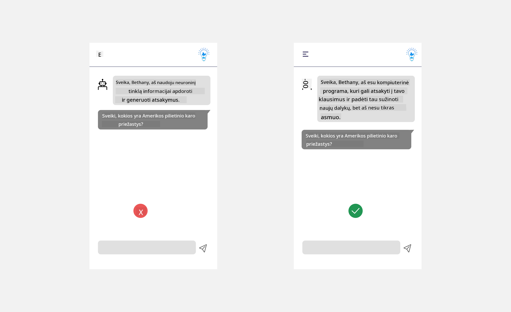

<!--
CO_OP_TRANSLATOR_METADATA:
{
  "original_hash": "5570d29237cd7928baa23abf503ad778",
  "translation_date": "2025-08-25T12:38:30+00:00",
  "source_file": "12-designing-ux-for-ai-applications/README.md",
  "language_code": "lt"
}
-->
# UX kūrimas dirbtinio intelekto programoms

> _(Spustelėkite paveikslėlį aukščiau, kad peržiūrėtumėte šios pamokos vaizdo įrašą)_

Vartotojo patirtis yra labai svarbi kuriant programas. Vartotojai turi galėti naudotis jūsų programa efektyviai, kad galėtų atlikti užduotis. Efektyvumas yra svarbu, tačiau taip pat reikia kurti programas taip, kad jomis galėtų naudotis visi – kad jos būtų _prieinamos_. Šiame skyriuje bus nagrinėjama ši sritis, kad galų gale sukurtumėte programą, kurią žmonės gali ir nori naudoti.

## Įvadas

Vartotojo patirtis – tai kaip vartotojas sąveikauja su konkrečiu produktu ar paslauga, nesvarbu, ar tai sistema, įrankis, ar dizainas. Kuriant DI programas, kūrėjai rūpinasi ne tik tuo, kad vartotojo patirtis būtų efektyvi, bet ir etiška. Šioje pamokoje aptarsime, kaip kurti dirbtinio intelekto (DI) programas, kurios atitiktų vartotojų poreikius.

Pamokoje bus aptariamos šios sritys:

- Vartotojo patirties įvadas ir vartotojų poreikių supratimas
- DI programų kūrimas pasitikėjimui ir skaidrumui užtikrinti
- DI programų kūrimas bendradarbiavimui ir grįžtamajam ryšiui

## Mokymosi tikslai

Baigę šią pamoką, galėsite:

- Suprasti, kaip kurti DI programas, atitinkančias vartotojų poreikius.
- Kurti DI programas, kurios skatina pasitikėjimą ir bendradarbiavimą.

### Būtinos žinios

Skirkite laiko ir pasiskaitykite daugiau apie [vartotojo patirtį ir dizaino mąstyseną.](https://learn.microsoft.com/training/modules/ux-design?WT.mc_id=academic-105485-koreyst)

## Vartotojo patirties įvadas ir vartotojų poreikių supratimas

Mūsų išgalvotoje švietimo startuolio įmonėje turime du pagrindinius vartotojus – mokytojus ir mokinius. Kiekvienas iš jų turi unikalių poreikių. Į vartotoją orientuotas dizainas prioritetą teikia vartotojui, užtikrindamas, kad produktai būtų aktualūs ir naudingi tiems, kam jie skirti.

Programa turi būti **naudinga, patikima, prieinama ir maloni**, kad užtikrintų gerą vartotojo patirtį.

### Naudojamumas

Naudinga programa – tai tokia, kuri turi funkcionalumą, atitinkantį jos paskirtį, pavyzdžiui, automatizuojanti vertinimo procesą ar kurianti kartotekas mokymuisi. Programa, kuri automatizuoja vertinimą, turi gebėti tiksliai ir efektyviai priskirti balus mokinių darbams pagal iš anksto nustatytus kriterijus. Panašiai, programa, kuri kuria kartotekas, turi gebėti generuoti aktualius ir įvairius klausimus pagal turimus duomenis.

### Patikimumas

Patikima programa – tai tokia, kuri nuolat ir be klaidų atlieka savo užduotis. Tačiau DI, kaip ir žmonės, nėra tobulas ir gali klysti. Programos gali susidurti su klaidomis ar netikėtomis situacijomis, kurioms reikia žmogaus įsikišimo ar pataisymo. Kaip tvarkytis su klaidomis? Paskutinėje šios pamokos dalyje aptarsime, kaip DI sistemos ir programos kuriamos bendradarbiavimui ir grįžtamajam ryšiui.

### Prieinamumas

Prieinama programa – tai tokia, kuri užtikrina vartotojo patirtį įvairių gebėjimų žmonėms, įskaitant turinčius negalią, kad niekas neliktų nuošalyje. Vadovaujantis prieinamumo gairėmis ir principais, DI sprendimai tampa labiau įtraukiantys, patogūs ir naudingi visiems vartotojams.

### Malonumas

Maloni programa – tai tokia, kuria naudotis yra smagu. Patraukli vartotojo patirtis gali turėti teigiamą poveikį vartotojui, paskatinti jį sugrįžti prie programos ir padidinti verslo pajamas.

Ne kiekvieną iššūkį galima išspręsti DI. DI padeda pagerinti vartotojo patirtį – ar tai būtų rankinių užduočių automatizavimas, ar vartotojo patirties personalizavimas.

## DI programų kūrimas pasitikėjimui ir skaidrumui užtikrinti

Pasitikėjimo kūrimas yra labai svarbus kuriant DI programas. Pasitikėjimas užtikrina, kad vartotojas bus tikras, jog programa atliks darbą, nuolat pateiks rezultatus ir tie rezultatai bus tokie, kokių reikia vartotojui. Šioje srityje kyla rizika dėl nepasitikėjimo ir per didelio pasitikėjimo. Nepasitikėjimas atsiranda, kai vartotojas mažai arba visai nepasitiki DI sistema – tuomet vartotojas atmeta jūsų programą. Per didelis pasitikėjimas atsiranda, kai vartotojas pervertina DI sistemos galimybes ir pernelyg pasitiki DI. Pavyzdžiui, automatizuota vertinimo sistema, jei ja per daug pasitikima, gali paskatinti mokytoją neperžiūrėti kai kurių darbų, kad įsitikintų, ar sistema veikia gerai. Tai gali lemti neteisingus ar netikslius mokinių įvertinimus arba praleistas galimybes grįžtamajam ryšiui ir tobulėjimui.

Du būdai, kaip užtikrinti, kad pasitikėjimas būtų dizaino centre – paaiškinamumas ir kontrolė.

### Paaiškinamumas

Kai DI padeda priimti sprendimus, pavyzdžiui, perduodant žinias ateities kartoms, labai svarbu, kad mokytojai ir tėvai suprastų, kaip priimami DI sprendimai. Tai ir yra paaiškinamumas – supratimas, kaip DI programos priima sprendimus. Kuriant paaiškinamumą, svarbu pateikti detales, kurios parodo, kaip DI pasiekė rezultatą. Auditorija turi žinoti, kad rezultatas sukurtas DI, o ne žmogaus. Pavyzdžiui, vietoj „Pradėkite pokalbį su savo mokytoju dabar“ sakykite „Naudokite DI mokytoją, kuris prisitaiko prie jūsų poreikių ir padeda mokytis jūsų tempu.“

Kitas pavyzdys – kaip DI naudoja vartotojo ir asmeninius duomenis. Pavyzdžiui, vartotojas su mokinio persona gali turėti apribojimų pagal savo rolę. DI galbūt negalės atskleisti atsakymų į klausimus, bet gali padėti vartotojui pagalvoti, kaip išspręsti problemą.

Dar vienas svarbus paaiškinamumo aspektas – paaiškinimų supaprastinimas. Mokiniai ir mokytojai gali būti ne DI ekspertai, todėl paaiškinimai, ką programa gali ar negali padaryti, turi būti paprasti ir lengvai suprantami.

### Kontrolė

Generatyvusis DI sukuria bendradarbiavimą tarp DI ir vartotojo, kai, pavyzdžiui, vartotojas gali keisti užklausas, kad gautų skirtingus rezultatus. Be to, kai rezultatas jau sugeneruotas, vartotojai turi galėti jį keisti, taip suteikiant jiems kontrolės jausmą. Pavyzdžiui, naudojant Bing, galite pritaikyti užklausą pagal formatą, toną ir ilgį. Taip pat galite keisti rezultatą, kaip parodyta žemiau:

Kita Bing funkcija, leidžianti vartotojui kontroliuoti programą, yra galimybė pasirinkti, ar leisti DI naudoti duomenis. Mokyklos programoje mokinys gali norėti naudoti savo užrašus ir mokytojo pateiktus išteklius kaip mokymosi medžiagą.

> Kuriant DI programas, labai svarbu sąmoningai užtikrinti, kad vartotojai nepervertintų DI galimybių ir nesusidarytų nerealistiškų lūkesčių. Vienas būdas tai pasiekti – sukurti tam tikrą „trintį“ tarp užklausų ir rezultatų. Priminkite vartotojui, kad tai DI, o ne žmogus.

## DI programų kūrimas bendradarbiavimui ir grįžtamajam ryšiui

Kaip jau minėta, generatyvusis DI sukuria bendradarbiavimą tarp vartotojo ir DI. Dažniausiai vartotojas įveda užklausą, o DI sugeneruoja rezultatą. O kas, jei rezultatas neteisingas? Kaip programa tvarkosi su klaidomis, jei jos įvyksta? Ar DI kaltina vartotoją, ar paaiškina klaidą?

DI programos turi būti sukurtos taip, kad galėtų priimti ir teikti grįžtamąjį ryšį. Tai padeda ne tik tobulinti DI sistemą, bet ir stiprina pasitikėjimą vartotojais. Grįžtamojo ryšio ciklas turi būti įtrauktas į dizainą – pavyzdžiui, paprastas „patinka/nepatinka“ mygtukas prie rezultato.

Kitas būdas – aiškiai komunikuoti sistemos galimybes ir ribas. Kai vartotojas padaro klaidą, prašydamas kažko, kas viršija DI galimybes, turi būti būdas tai tvarkyti, kaip parodyta žemiau.

Sisteminės klaidos dažnos programose, kai vartotojui gali prireikti informacijos, kuri neapima DI galimybių, arba programa gali turėti ribojimą, kiek klausimų ar temų vartotojas gali sugeneruoti santraukas. Pavyzdžiui, DI programa, apmokyta tik su ribotų temų duomenimis, pavyzdžiui, istorijos ir matematikos, negalės atsakyti į geografijos klausimus. Tokiu atveju DI sistema gali atsakyti: „Atsiprašome, mūsų produktas apmokytas su šių temų duomenimis....., negaliu atsakyti į jūsų klausimą.“

DI programos nėra tobulos, todėl jos neišvengiamai darys klaidų. Kurdami savo programas, turite užtikrinti, kad būtų galimybė vartotojams pateikti grįžtamąjį ryšį ir kad klaidos būtų tvarkomos paprastai ir aiškiai.

## Užduotis

Paimkite bet kurią iki šiol sukurtą DI programą ir apsvarstykite, kaip galėtumėte įgyvendinti šiuos žingsnius:

- **Malonumas:** Pagalvokite, kaip galite padaryti savo programą malonesnę. Ar visur pateikiate paaiškinimus? Ar skatinate vartotoją tyrinėti? Kaip formuluojate klaidų pranešimus?

- **Naudojamumas:** Kuriate žiniatinklio programą. Įsitikinkite, kad jūsų programa galima naudotis tiek pele, tiek klaviatūra.

- **Pasitikėjimas ir skaidrumas:** Nepasitikėkite DI ir jo rezultatais aklai – pagalvokite, kaip galėtumėte įtraukti žmogų rezultatų patikrinimui. Taip pat apsvarstykite ir įgyvendinkite kitus būdus pasitikėjimui ir skaidrumui užtikrinti.

- **Kontrolė:** Suteikite vartotojui galimybę valdyti duomenis, kuriuos jis pateikia programai. Įgyvendinkite būdą, kaip vartotojas galėtų sutikti ar atsisakyti duomenų rinkimo DI programoje.

## Tęskite mokymąsi!

Baigę šią pamoką, peržiūrėkite mūsų [Generatyvaus DI mokymosi kolekciją](https://aka.ms/genai-collection?WT.mc_id=academic-105485-koreyst), kad dar labiau pagilintumėte žinias apie generatyvųjį DI!

Eikite į 13 pamoką, kurioje aptarsime, kaip [apsaugoti DI programas](../13-securing-ai-applications/README.md?WT.mc_id=academic-105485-koreyst)!

---

**Atsakomybės atsisakymas**:  
Šis dokumentas buvo išverstas naudojant dirbtinio intelekto vertimo paslaugą [Co-op Translator](https://github.com/Azure/co-op-translator). Nors siekiame tikslumo, prašome atkreipti dėmesį, kad automatiniai vertimai gali turėti klaidų ar netikslumų. Originalus dokumentas jo gimtąja kalba turėtų būti laikomas autoritetingu šaltiniu. Kritinei informacijai rekomenduojame profesionalų žmogaus vertimą. Mes neatsakome už nesusipratimus ar neteisingą interpretavimą, kilusį naudojantis šiuo vertimu.