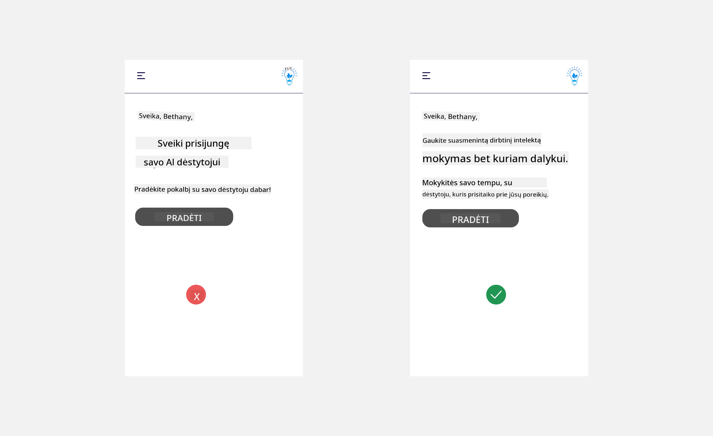
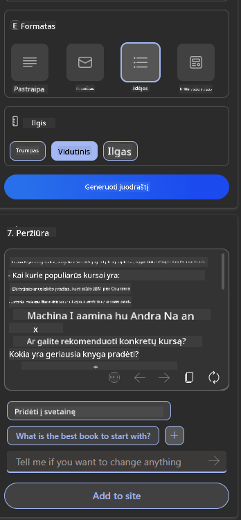

<!--
CO_OP_TRANSLATOR_METADATA:
{
  "original_hash": "78bbeed50fd4dc9fdee931f5daf98cb3",
  "translation_date": "2025-10-18T02:22:47+00:00",
  "source_file": "12-designing-ux-for-ai-applications/README.md",
  "language_code": "lt"
}
-->
# UX kūrimas AI programoms

> _(Spustelėkite aukščiau esančią nuotrauką, kad peržiūrėtumėte šios pamokos vaizdo įrašą)_

Vartotojo patirtis yra labai svarbus aspektas kuriant programas. Vartotojai turi galėti efektyviai naudotis jūsų programa, kad atliktų užduotis. Efektyvumas yra svarbus, tačiau taip pat būtina kurti programas, kurios būtų prieinamos visiems, kad jos būtų _prieinamos_. Šiame skyriuje bus nagrinėjama ši sritis, kad galėtumėte sukurti programą, kurią žmonės galėtų ir norėtų naudoti.

## Įvadas

Vartotojo patirtis – tai būdas, kaip vartotojas sąveikauja su konkrečiu produktu ar paslauga, nesvarbu, ar tai sistema, įrankis, ar dizainas. Kurdami AI programas, kūrėjai ne tik siekia užtikrinti efektyvią vartotojo patirtį, bet ir etinį požiūrį. Šioje pamokoje aptarsime, kaip kurti dirbtinio intelekto (AI) programas, kurios atitiktų vartotojų poreikius.

Pamokoje bus aptartos šios sritys:

- Vartotojo patirties įvadas ir vartotojų poreikių supratimas
- AI programų kūrimas, skatinantis pasitikėjimą ir skaidrumą
- AI programų kūrimas bendradarbiavimui ir grįžtamajam ryšiui

## Mokymosi tikslai

Po šios pamokos galėsite:

- Suprasti, kaip kurti AI programas, atitinkančias vartotojų poreikius.
- Kurti AI programas, kurios skatina pasitikėjimą ir bendradarbiavimą.

### Būtinos žinios

Skirkite laiko ir daugiau sužinokite apie [vartotojo patirtį ir dizaino mąstymą.](https://learn.microsoft.com/training/modules/ux-design?WT.mc_id=academic-105485-koreyst)

## Vartotojo patirties įvadas ir vartotojų poreikių supratimas

Mūsų išgalvotoje švietimo startuolyje turime du pagrindinius vartotojus – mokytojus ir mokinius. Kiekvienas iš šių vartotojų turi unikalius poreikius. Vartotojo orientuotas dizainas prioritetą teikia vartotojui, užtikrindamas, kad produktai būtų aktualūs ir naudingi tiems, kam jie skirti.

Programa turėtų būti **naudinga, patikima, prieinama ir maloni**, kad užtikrintų gerą vartotojo patirtį.

### Naudingumas

Būti naudingu reiškia, kad programa turi funkcionalumą, atitinkantį jos paskirtį, pavyzdžiui, automatizuoti vertinimo procesą arba generuoti mokymosi korteles peržiūrai. Programa, automatizuojanti vertinimo procesą, turėtų galėti tiksliai ir efektyviai priskirti balus mokinių darbams pagal iš anksto nustatytus kriterijus. Panašiai programa, generuojanti mokymosi korteles, turėtų sukurti aktualius ir įvairius klausimus pagal savo duomenis.

### Patikimumas

Būti patikimu reiškia, kad programa gali nuosekliai ir be klaidų atlikti savo užduotį. Tačiau AI, kaip ir žmonės, nėra tobula ir gali būti linkusi į klaidas. Programos gali susidurti su klaidomis ar netikėtomis situacijomis, kurioms reikia žmogaus įsikišimo ar pataisymo. Kaip spręsti klaidas? Paskutinėje šios pamokos dalyje aptarsime, kaip AI sistemos ir programos yra kuriamos bendradarbiavimui ir grįžtamajam ryšiui.

### Prieinamumas

Būti prieinamu reiškia išplėsti vartotojo patirtį vartotojams su įvairiais gebėjimais, įskaitant neįgaliuosius, užtikrinant, kad niekas nebūtų paliktas nuošalyje. Laikantis prieinamumo gairių ir principų, AI sprendimai tampa labiau įtraukiantys, naudingi ir naudingi visiems vartotojams.

### Malonumas

Būti maloniu reiškia, kad programa yra maloni naudoti. Patraukli vartotojo patirtis gali turėti teigiamą poveikį vartotojui, paskatindama jį grįžti prie programos ir padidindama verslo pajamas.

Ne kiekvieną iššūkį galima išspręsti naudojant AI. AI padeda pagerinti vartotojo patirtį, pavyzdžiui, automatizuojant rankinius darbus ar personalizuojant vartotojo patirtį.

## AI programų kūrimas, skatinantis pasitikėjimą ir skaidrumą

Pasitikėjimo kūrimas yra labai svarbus kuriant AI programas. Pasitikėjimas užtikrina, kad vartotojas pasitiki programa, jog ji atliks darbą, nuosekliai pateiks rezultatus ir kad rezultatai atitiks vartotojo poreikius. Šioje srityje kyla rizika dėl nepasitikėjimo ir per didelio pasitikėjimo. Nepasitikėjimas atsiranda, kai vartotojas mažai arba visai nepasitiki AI sistema, dėl to vartotojas atmeta jūsų programą. Per didelis pasitikėjimas atsiranda, kai vartotojas pervertina AI sistemos galimybes, dėl to vartotojai per daug pasitiki AI sistema. Pavyzdžiui, automatizuota vertinimo sistema per didelio pasitikėjimo atveju gali paskatinti mokytoją neperžiūrėti kai kurių darbų, kad įsitikintų, jog vertinimo sistema veikia gerai. Tai gali lemti neteisingus ar netikslius mokinių įvertinimus arba praleistas galimybes gauti grįžtamąjį ryšį ir tobulėti.

Du būdai užtikrinti, kad pasitikėjimas būtų pagrindinis dizaino elementas, yra paaiškinamumas ir kontrolė.

### Paaiškinamumas

Kai AI padeda priimti sprendimus, pavyzdžiui, perduoti žinias ateities kartoms, labai svarbu, kad mokytojai ir tėvai suprastų, kaip priimami AI sprendimai. Tai yra paaiškinamumas – supratimas, kaip AI programos priima sprendimus. Dizainas, orientuotas į paaiškinamumą, apima detalių pridėjimą, kurios parodo, kaip AI pasiekė rezultatą. Auditorija turi žinoti, kad rezultatas yra sukurtas AI, o ne žmogaus. Pavyzdžiui, vietoj „Pradėkite pokalbį su savo mokytoju dabar“ sakykite „Naudokite AI mokytoją, kuris prisitaiko prie jūsų poreikių ir padeda mokytis jūsų tempu.“

Kitas pavyzdys – kaip AI naudoja vartotojo ir asmeninius duomenis. Pavyzdžiui, vartotojas su studento persona gali turėti apribojimų, susijusių su jų persona. AI gali negalėti atskleisti atsakymų į klausimus, tačiau gali padėti vartotojui apmąstyti, kaip jie gali išspręsti problemą.

Dar vienas svarbus paaiškinamumo aspektas yra paaiškinimų supaprastinimas. Studentai ir mokytojai gali nebūti AI ekspertai, todėl paaiškinimai apie tai, ką programa gali ar negali padaryti, turėtų būti supaprastinti ir lengvai suprantami.

### Kontrolė

Generatyvinis AI sukuria bendradarbiavimą tarp AI ir vartotojo, kur, pavyzdžiui, vartotojas gali keisti užklausas, kad gautų skirtingus rezultatus. Be to, kai rezultatas yra sukurtas, vartotojai turėtų galėti keisti rezultatus, suteikdami jiems kontrolės jausmą. Pavyzdžiui, naudojant Bing, galite pritaikyti savo užklausą pagal formatą, toną ir ilgį. Be to, galite keisti savo rezultatą ir jį koreguoti, kaip parodyta žemiau:

Kita Bing funkcija, leidžianti vartotojui kontroliuoti programą, yra galimybė pasirinkti, ar leisti, ar neleisti naudoti AI duomenis. Mokyklos programoje studentas gali norėti naudoti savo užrašus, taip pat mokytojų išteklius kaip mokymosi medžiagą.

> Kuriant AI programas, svarbu užtikrinti, kad vartotojai nepervertintų AI galimybių, nustatydami nerealistinius lūkesčius. Vienas iš būdų tai pasiekti – sukurti trintį tarp užklausų ir rezultatų. Priminkite vartotojui, kad tai yra AI, o ne žmogus.

## AI programų kūrimas bendradarbiavimui ir grįžtamajam ryšiui

Kaip jau minėta, generatyvinis AI sukuria bendradarbiavimą tarp vartotojo ir AI. Dauguma sąveikų vyksta, kai vartotojas įveda užklausą, o AI generuoja rezultatą. O kas, jei rezultatas yra neteisingas? Kaip programa sprendžia klaidas, jei jos įvyksta? Ar AI kaltina vartotoją, ar skiria laiko klaidai paaiškinti?

AI programos turėtų būti sukurtos taip, kad galėtų priimti ir teikti grįžtamąjį ryšį. Tai ne tik padeda AI sistemai tobulėti, bet ir stiprina pasitikėjimą vartotojais. Grįžtamojo ryšio ciklas turėtų būti įtrauktas į dizainą, pavyzdžiui, paprastas nykščio aukštyn arba žemyn mygtukas prie rezultato.

Kitas būdas spręsti šią problemą – aiškiai komunikuoti sistemos galimybes ir apribojimus. Kai vartotojas padaro klaidą, prašydamas kažko, kas viršija AI galimybes, turėtų būti būdas tai spręsti, kaip parodyta žemiau.

Sistemos klaidos yra dažnos programose, kur vartotojui gali prireikti informacijos už AI ribų arba programa gali turėti apribojimų, kiek klausimų/temų vartotojas gali generuoti santraukas. Pavyzdžiui, AI programa, apmokyta duomenimis apie ribotas temas, pavyzdžiui, istoriją ir matematiką, gali nesugebėti atsakyti į geografijos klausimus. Norint tai spręsti, AI sistema gali pateikti atsakymą, pavyzdžiui: „Atsiprašome, mūsų produktas buvo apmokytas duomenimis apie šias temas....., negaliu atsakyti į jūsų užduotą klausimą.“

AI programos nėra tobulos, todėl jos neišvengiamai daro klaidų. Kurdami savo programas turėtumėte užtikrinti, kad būtų sukurtos galimybės vartotojų grįžtamajam ryšiui ir klaidų sprendimui paprastu ir lengvai suprantamu būdu.

## Užduotis

Paimkite bet kurią AI programą, kurią jau sukūrėte, ir apsvarstykite galimybę įgyvendinti šiuos žingsnius savo programoje:

- **Malonumas:** Pagalvokite, kaip galite padaryti savo programą malonesnę. Ar visur pridedate paaiškinimus? Ar skatinat vartotoją tyrinėti? Kaip formuluojate savo klaidų pranešimus?

- **Naudingumas:** Kurkite internetinę programą. Įsitikinkite, kad jūsų programa yra naviguojama tiek pele, tiek klaviatūra.

- **Pasitikėjimas ir skaidrumas:** Ne visiškai pasitikėkite AI ir jo rezultatais, apsvarstykite, kaip galėtumėte įtraukti žmogų į procesą, kad patikrintų rezultatus. Taip pat apsvarstykite ir įgyvendinkite kitus būdus, kaip pasiekti pasitikėjimą ir skaidrumą.

- **Kontrolė:** Suteikite vartotojui galimybę kontroliuoti duomenis, kuriuos jis pateikia programai. Įgyvendinkite būdą, kaip vartotojas galėtų pasirinkti, ar leisti, ar neleisti rinkti duomenis AI programoje.

<!-- ## [Po paskaitos testas](../../../12-designing-ux-for-ai-applications/quiz-url) -->

## Tęskite mokymąsi!

Baigę šią pamoką, peržiūrėkite mūsų [Generatyvinio AI mokymosi kolekciją](https://aka.ms/genai-collection?WT.mc_id=academic-105485-koreyst), kad toliau gilintumėte savo žinias apie generatyvinį AI!

Eikite į 13 pamoką, kurioje aptarsime, kaip [užtikrinti AI programų saugumą](../13-securing-ai-applications/README.md?WT.mc_id=academic-105485-koreyst)!

---

**Atsakomybės apribojimas**:  
Šis dokumentas buvo išverstas naudojant AI vertimo paslaugą [Co-op Translator](https://github.com/Azure/co-op-translator). Nors siekiame tikslumo, prašome atkreipti dėmesį, kad automatiniai vertimai gali turėti klaidų ar netikslumų. Originalus dokumentas jo gimtąja kalba turėtų būti laikomas autoritetingu šaltiniu. Kritinei informacijai rekomenduojama profesionali žmogaus vertimo paslauga. Mes neprisiimame atsakomybės už nesusipratimus ar neteisingus aiškinimus, kylančius dėl šio vertimo naudojimo.