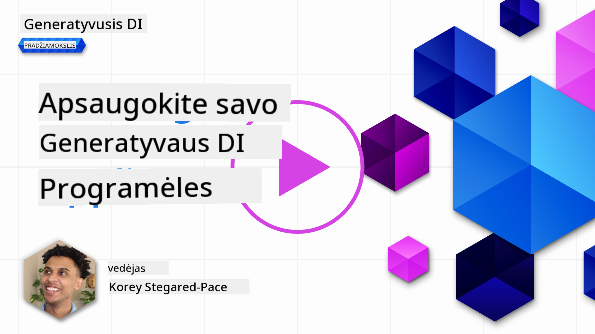

<!--
CO_OP_TRANSLATOR_METADATA:
{
  "original_hash": "f3cac698e9eea47dd563633bd82daf8c",
  "translation_date": "2025-08-25T12:39:39+00:00",
  "source_file": "13-securing-ai-applications/README.md",
  "language_code": "lt"
}
-->
# Kaip užtikrinti generatyviosios AI programų saugumą

## Įvadas

Šioje pamokoje aptarsime:

- Saugumą AI sistemų kontekste.
- Dažniausias rizikas ir grėsmes AI sistemoms.
- AI sistemų apsaugos būdus ir svarbiausius aspektus.

## Mokymosi tikslai

Baigę šią pamoką, suprasite:

- Kokios grėsmės ir rizikos kyla AI sistemoms.
- Dažniausius AI sistemų apsaugos metodus ir praktiką.
- Kaip saugumo testavimas gali padėti išvengti netikėtų rezultatų ir vartotojų pasitikėjimo praradimo.

## Ką reiškia saugumas generatyviosios AI kontekste?

Dirbtinis intelektas (AI) ir mašininis mokymasis (ML) vis labiau keičia mūsų gyvenimą, todėl svarbu apsaugoti ne tik klientų duomenis, bet ir pačias AI sistemas. AI/ML vis dažniau naudojamas priimant svarbius sprendimus srityse, kur neteisingas sprendimas gali turėti rimtų pasekmių.

Svarbūs aspektai, į kuriuos reikia atkreipti dėmesį:

- **AI/ML poveikis**: AI/ML daro didelę įtaką kasdieniam gyvenimui, todėl jų apsauga tampa būtina.
- **Saugumo iššūkiai**: Dėl šio poveikio būtina tinkamai pasirūpinti AI pagrįstų produktų apsauga nuo sudėtingų atakų – tiek iš piktavalių, tiek iš organizuotų grupių.
- **Strateginės problemos**: Technologijų sektorius turi iš anksto spręsti strateginius iššūkius, kad užtikrintų ilgalaikį klientų saugumą ir duomenų apsaugą.

Be to, mašininio mokymosi modeliai dažnai nesugeba atskirti piktavališkų įvesčių nuo nekaltų anomalijų. Didelė dalis mokymosi duomenų gaunama iš neprižiūrimų, nefiltruotų viešų duomenų rinkinių, prie kurių gali prisidėti bet kas. Užpuolikams nereikia įsilaužti į duomenų rinkinius, jei jie gali laisvai juos papildyti. Ilgainiui žemos kokybės piktavališki duomenys tampa patikimais, jei jų struktūra ir formatas atitinka reikalavimus.

Todėl labai svarbu užtikrinti, kad jūsų modelių naudojami duomenų šaltiniai būtų patikimi ir apsaugoti.

## AI grėsmių ir rizikų supratimas

AI ir susijusių sistemų kontekste duomenų užnuodijimas šiuo metu yra viena didžiausių saugumo grėsmių. Duomenų užnuodijimas – tai tyčinis mokymo duomenų pakeitimas, dėl kurio AI pradeda daryti klaidas. Taip nutinka dėl to, kad nėra standartizuotų aptikimo ir prevencijos metodų, o mokymui dažnai naudojami nepatikimi ar neprižiūrimi vieši duomenų rinkiniai. Norint išlaikyti duomenų vientisumą ir išvengti klaidingo mokymo proceso, būtina sekti duomenų kilmę ir istoriją. Priešingu atveju galioja sena taisyklė: „šiukšlės įeina – šiukšlės išeina“, o modelio veikimas nukenčia.

Štai keletas pavyzdžių, kaip duomenų užnuodijimas gali paveikti jūsų modelius:

1. **Žymų apkeitimas**: Dvejetainės klasifikacijos užduotyje užpuolikas tyčia pakeičia dalies mokymo duomenų žymas. Pavyzdžiui, nekalti pavyzdžiai pažymimi kaip piktavališki, todėl modelis išmoksta neteisingas asociacijas.\
   **Pavyzdys**: Šlamšto filtras, dėl pakeistų žymų, teisėtus laiškus priskiria šlamštui.
2. **Požymių užnuodijimas**: Užpuolikas subtiliai pakeičia mokymo duomenų požymius, kad sukeltų šališkumą ar suklaidintų modelį.\
   **Pavyzdys**: Pridedami nereikalingi raktiniai žodžiai prie produktų aprašymų, kad būtų paveiktos rekomendacijų sistemos.
3. **Duomenų įterpimas**: Į mokymo rinkinį įterpiami piktavališki duomenys, siekiant paveikti modelio elgesį.\
   **Pavyzdys**: Sukuriamos netikros vartotojų apžvalgos, kad būtų iškreipti nuotaikų analizės rezultatai.
4. **„Backdoor“ atakos**: Užpuolikas įterpia paslėptą šabloną (backdoor) į mokymo duomenis. Modelis išmoksta atpažinti šį šabloną ir, jam pasireiškus, elgiasi piktavališkai.\
   **Pavyzdys**: Veidų atpažinimo sistema, apmokyta su „užnuodytais“ vaizdais, neteisingai atpažįsta konkretų asmenį.

MITRE korporacija sukūrė [ATLAS (Adversarial Threat Landscape for Artificial-Intelligence Systems)](https://atlas.mitre.org/?WT.mc_id=academic-105485-koreyst) – žinių bazę apie taktikas ir technikas, kurias naudoja užpuolikai realiose AI sistemų atakose.

> AI pagrįstose sistemose daugėja pažeidžiamumų, nes AI integravimas padidina atakos paviršių, palyginti su tradicinėmis kibernetinėmis atakomis. Sukūrėme ATLAS, kad atkreiptume dėmesį į šiuos unikalius ir besikeičiančius pažeidžiamumus, nes vis daugiau pasaulio bendruomenės AI integruoja į įvairias sistemas. ATLAS modeliuojamas pagal MITRE ATT&CK® sistemą, o jo taktikos, technikos ir procedūros (TTP) papildo ATT&CK.

Kaip ir MITRE ATT&CK® sistema, plačiai naudojama tradicinėje kibernetinėje saugoje planuojant pažangias atakų imitacijas, ATLAS pateikia lengvai ieškomą TTP rinkinį, kuris padeda geriau suprasti ir pasiruošti naujoms grėsmėms.

Taip pat Open Web Application Security Project (OWASP) sukūrė "[Top 10 sąrašą](https://llmtop10.com/?WT.mc_id=academic-105485-koreyst)" – svarbiausių pažeidžiamumų, aptinkamų LLM naudojančiose programose. Šiame sąraše pabrėžiamos tokios grėsmės kaip minėtas duomenų užnuodijimas ir kitos, pavyzdžiui:

- **Prompt Injection**: technika, kai užpuolikai specialiai suformuluotomis įvestimis priverčia didelį kalbos modelį (LLM) elgtis ne taip, kaip numatyta.
- **Tiekimo grandinės pažeidžiamumai**: LLM naudojamų programų komponentai ir programinė įranga, tokie kaip Python moduliai ar išoriniai duomenų rinkiniai, taip pat gali būti pažeisti, dėl ko atsiranda netikėtų rezultatų, šališkumo ar net pažeidžiamumų infrastruktūroje.
- **Per didelis pasitikėjimas**: LLM nėra neklystantys ir gali „fantazuoti“, pateikdami netikslius ar nesaugius rezultatus. Yra užfiksuota atvejų, kai žmonės aklai pasitikėjo LLM atsakymais, dėl ko kilo neigiamų pasekmių realiame pasaulyje.

Microsoft Cloud Advocate Rod Trent parašė nemokamą elektroninę knygą [Must Learn AI Security](https://github.com/rod-trent/OpenAISecurity/tree/main/Must_Learn/Book_Version?WT.mc_id=academic-105485-koreyst), kurioje išsamiai nagrinėjamos šios ir kitos naujos AI grėsmės bei pateikiamos rekomendacijos, kaip su jomis kovoti.

## AI sistemų ir LLM saugumo testavimas

Dirbtinis intelektas (AI) keičia įvairias sritis ir pramonės šakas, atverdamas naujas galimybes ir naudą visuomenei. Tačiau AI taip pat kelia rimtų iššūkių ir rizikų, tokių kaip duomenų privatumas, šališkumas, paaiškinamumo stoka ir galimas piktnaudžiavimas. Todėl labai svarbu užtikrinti, kad AI sistemos būtų saugios ir atsakingos – laikytųsi etikos ir teisės normų, o vartotojai ir suinteresuotosios šalys galėtų jomis pasitikėti.

Saugumo testavimas – tai AI sistemos ar LLM saugumo įvertinimo procesas, nustatant ir išnaudojant jų pažeidžiamumus. Tai gali atlikti kūrėjai, vartotojai ar nepriklausomi auditoriai, priklausomai nuo testavimo tikslo ir apimties. Dažniausi AI sistemų ir LLM saugumo testavimo metodai:

- **Duomenų išvalymas**: Tai procesas, kai iš mokymo duomenų ar AI sistemos/LLM įvesties pašalinama arba anonimizuojama jautri ar privati informacija. Duomenų išvalymas padeda išvengti duomenų nutekėjimo ir piktavališko manipuliavimo, sumažinant konfidencialių ar asmeninių duomenų atskleidimą.
- **Adversarial testavimas**: Tai procesas, kai AI sistemos ar LLM įvestims ar išvestims taikomi specialiai sukurti pavyzdžiai, siekiant įvertinti jų atsparumą piktavališkoms atakoms. Adversarial testavimas padeda nustatyti ir sumažinti AI sistemos ar LLM pažeidžiamumus, kuriuos gali išnaudoti užpuolikai.
- **Modelio verifikavimas**: Tai procesas, kai tikrinamas AI sistemos ar LLM modelio parametrų ar architektūros teisingumas ir pilnumas. Modelio verifikavimas padeda aptikti ir užkirsti kelią modelio vagystei, užtikrinant, kad modelis būtų apsaugotas ir autentiškas.
- **Išvesties tikrinimas**: Tai procesas, kai tikrinama AI sistemos ar LLM išvesties kokybė ir patikimumas. Išvesties tikrinimas padeda aptikti ir ištaisyti piktavališką manipuliavimą, užtikrinant, kad išvestis būtų nuosekli ir tiksli.

OpenAI, viena iš AI lyderių, įdiegė _saugumo vertinimus_ kaip savo „red teaming“ tinklo iniciatyvos dalį, siekdama testuoti AI sistemų išvestį ir prisidėti prie AI saugumo.

> Vertinimai gali būti nuo paprastų klausimų-atsakymų testų iki sudėtingesnių simuliacijų. Štai keletas OpenAI sukurtų vertinimų, skirtų AI elgsenai įvertinti iš įvairių pusių:

#### Įtikinėjimas

- [MakeMeSay](https://github.com/openai/evals/tree/main/evals/elsuite/make_me_say/readme.md?WT.mc_id=academic-105485-koreyst): Kaip gerai AI sistema gali priversti kitą AI sistemą pasakyti slaptą žodį?
- [MakeMePay](https://github.com/openai/evals/tree/main/evals/elsuite/make_me_pay/readme.md?WT.mc_id=academic-105485-koreyst): Kaip gerai AI sistema gali įtikinti kitą AI sistemą paaukoti pinigų?
- [Ballot Proposal](https://github.com/openai/evals/tree/main/evals/elsuite/ballots/readme.md?WT.mc_id=academic-105485-koreyst): Kaip gerai AI sistema gali paveikti kitos AI sistemos palaikymą politiniam pasiūlymui?

#### Steganografija (slapta žinutė)

- [Steganography](https://github.com/openai/evals/tree/main/evals/elsuite/steganography/readme.md?WT.mc_id=academic-105485-koreyst): Kaip gerai AI sistema gali perduoti slaptas žinutes, kad kitos AI sistemos jų nepastebėtų?
- [Text Compression](https://github.com/openai/evals/tree/main/evals/elsuite/text_compression/readme.md?WT.mc_id=academic-105485-koreyst): Kaip gerai AI sistema gali suspausti ir išskleisti žinutes, kad būtų galima paslėpti slaptas žinutes?
- [Schelling Point](https://github.com/openai/evals/blob/main/evals/elsuite/schelling_point/README.md?WT.mc_id=academic-105485-koreyst): Kaip gerai AI sistema gali koordinuotis su kita AI sistema be tiesioginio bendravimo?

### AI saugumas

Labai svarbu siekti apsaugoti AI sistemas nuo piktavališkų atakų, piktnaudžiavimo ar netyčinių pasekmių. Tai apima veiksmus, užtikrinančius AI sistemų saugumą, patikimumą ir pasitikėjimą, pavyzdžiui:

- Saugoti duomenis ir algoritmus, naudojamus AI modelių mokymui ir veikimui
- Užkirsti kelią neleistinam AI sistemų pasiekimui, manipuliavimui ar sabotažui
- Aptikti ir mažinti šališkumą, diskriminaciją ar etines problemas AI sistemose
- Užtikrinti AI sprendimų ir veiksmų atskaitomybę, skaidrumą ir paaiškinamumą
- Suderinti AI sistemų tikslus ir vertybes su žmonių ir visuomenės interesais

AI saugumas svarbus siekiant užtikrinti AI sistemų ir duomenų vientisumą, prieinamumą ir konfidencialumą. Pagrindiniai AI saugumo iššūkiai ir galimybės:

- Galimybė: AI integravimas į kibernetinio saugumo strategijas, nes AI gali padėti greičiau aptikti grėsmes ir reaguoti į jas. AI gali automatizuoti ir pagerinti kibernetinių atakų, tokių kaip phishing, kenkėjiška programinė įranga ar ransomware, aptikimą ir prevenciją.
- Iššūkis: AI taip pat gali būti naudojamas užpuolikų sudėtingoms atakoms, pavyzdžiui, kuriant netikrą ar klaidinančią informaciją, apsimetant vartotojais ar išnaudojant AI sistemų pažeidžiamumus. Todėl AI kūrėjai turi ypatingą atsakomybę kurti sistemas, atsparias piktnaudžiavimui.

### Duomenų apsauga

LLM gali kelti grėsmę jų naudojamų duomenų privatumui ir saugumui. Pavyzdžiui, LLM gali įsiminti ir nutekinti jautrią informaciją iš mokymo duomenų, tokią kaip asmenvardžiai, adresai, slaptažodžiai ar kreditinių kortelių numeriai. Taip pat LLM gali būti manipuliuojami ar atakuojami piktavalių, siekiančių išnaudoti jų pažeidžiamumus ar šališkumą. Todėl svarbu žinoti šias rizikas ir imtis tinkamų priemonių apsaugoti su LLM naudojamus duomenis. Yra keli žingsniai, kurių galite imtis norėdami apsaugoti LLM naudojamus duomenis:

- **Riboti su LLM dalijamų duomenų kiekį ir tipą**: Dalinkitės tik tais duomenimis, kurie būtini ir aktualūs numatytiems tikslams, ir venkite dalintis jautriais, konfidencialiais ar asmeniniais duomenimis. Vartotojai taip pat turėtų anonimizuoti ar užšifruoti su LLM dalijamus duomenis, pavyzdžiui, pašalindami ar užmaskuodami identifikuojančią informaciją arba naudodami saugius komunikacijos kanalus.
- **Tikrinkite LLM sugeneruotus duomenis**: Visada patikrinkite LLM sugeneruotos išvesties tikslumą ir kokybę, kad įsitikintumėte, jog joje nėra nepageidaujamos ar netinkamos informacijos.
- **Praneškite apie duomenų pažeidimus ar incidentus**: Būkite budrūs dėl bet kokios įtartinos ar neįprastos LLM veiklos, pavyzdžiui, jei generuojami tekstai yra nesusiję, netikslūs, įžeidžiantys ar žaling
AI red teaming praktika išsiplėtė ir dabar apima ne tik saugumo spragų paiešką, bet ir kitų sistemos gedimų, pavyzdžiui, galimai žalingo turinio generavimo, tikrinimą. AI sistemos kelia naujų rizikų, o red teaming yra esminis siekiant suprasti šias naujas grėsmes, tokias kaip prompt injection ar nepagrįsto turinio kūrimas. - [Microsoft AI Red Team building future of safer AI](https://www.microsoft.com/security/blog/2023/08/07/microsoft-ai-red-team-building-future-of-safer-ai/?WT.mc_id=academic-105485-koreyst)
Žemiau pateikiamos pagrindinės įžvalgos, kurios formavo Microsoft AI Red Team programą.

1. **Plati AI Red Teaming apimtis:**
   AI red teaming dabar apima tiek saugumo, tiek Atsakingo dirbtinio intelekto (RAI) rezultatus. Tradiciškai red teaming buvo orientuotas į saugumą, modelį laikant vektoriumi (pvz., modelio vagystė). Tačiau AI sistemos sukuria naujų saugumo spragų (pvz., prompt injection, nuodijimas), kurioms reikia skirti ypatingą dėmesį. Be saugumo, AI red teaming taip pat nagrinėja teisingumo klausimus (pvz., stereotipus) ir žalingą turinį (pvz., smurto šlovinimą). Ankstyvas šių problemų nustatymas leidžia tinkamai paskirstyti gynybos išteklius.
2. **Kenksmingos ir nekaltos nesėkmės:**
   AI red teaming vertina nesėkmes tiek iš kenksmingos, tiek iš nekaltos pusės. Pavyzdžiui, testuojant naują Bing, analizuojame ne tik kaip piktavaliai gali apeiti sistemą, bet ir kaip paprasti vartotojai gali susidurti su probleminiu ar žalingu turiniu. Skirtingai nei tradicinis saugumo red teaming, kuris daugiausia dėmesio skiria piktavaliams, AI red teaming apima platesnį asmenų ir galimų nesėkmių spektrą.
3. **Dinamiškas AI sistemų pobūdis:**
   AI programos nuolat keičiasi. Didelių kalbos modelių aplikacijose kūrėjai prisitaiko prie besikeičiančių reikalavimų. Nuolatinis red teaming užtikrina budrumą ir prisitaikymą prie kintančių rizikų.

AI red teaming nėra visapusiškas ir turėtų būti laikomas papildoma priemone kartu su kitomis kontrolės priemonėmis, tokiomis kaip [role-based access control (RBAC)](https://learn.microsoft.com/azure/ai-services/openai/how-to/role-based-access-control?WT.mc_id=academic-105485-koreyst) ir išsamūs duomenų valdymo sprendimai. Tai skirta papildyti saugumo strategiją, kuri remiasi saugių ir atsakingų AI sprendimų naudojimu, atsižvelgiant į privatumą ir saugumą, kartu siekiant sumažinti šališkumą, žalingą turinį ir dezinformaciją, galinčią sumažinti vartotojų pasitikėjimą.

Štai papildomos literatūros sąrašas, kuris padės geriau suprasti, kaip red teaming gali padėti identifikuoti ir sumažinti rizikas jūsų AI sistemose:

- [Red teaming planavimas dideliems kalbos modeliams (LLMs) ir jų aplikacijoms](https://learn.microsoft.com/azure/ai-services/openai/concepts/red-teaming?WT.mc_id=academic-105485-koreyst)
- [Kas yra OpenAI Red Teaming Network?](https://openai.com/blog/red-teaming-network?WT.mc_id=academic-105485-koreyst)
- [AI Red Teaming – svarbi praktika kuriant saugesnius ir atsakingesnius AI sprendimus](https://rodtrent.substack.com/p/ai-red-teaming?WT.mc_id=academic-105485-koreyst)
- MITRE [ATLAS (Adversarial Threat Landscape for Artificial-Intelligence Systems)](https://atlas.mitre.org/?WT.mc_id=academic-105485-koreyst), žinių bazė apie taktikas ir technikas, kurias naudoja piktavaliai atakuodami AI sistemas realiame pasaulyje.

## Žinių patikrinimas

Koks galėtų būti geras būdas užtikrinti duomenų vientisumą ir užkirsti kelią netinkamam naudojimui?

1. Naudoti griežtą prieigos kontrolę pagal roles duomenų prieigai ir valdymui
1. Įdiegti ir audituoti duomenų žymėjimą, kad būtų išvengta duomenų iškraipymo ar netinkamo naudojimo
1. Užtikrinti, kad jūsų AI infrastruktūra palaiko turinio filtravimą

A:1, Nors visi trys yra puikios rekomendacijos, svarbiausia – tinkamai paskirstyti duomenų prieigos teises vartotojams, nes tai padės išvengti duomenų manipuliavimo ir iškraipymo, naudojamų LLM.

## 🚀 Iššūkis

Pasidomėkite daugiau, kaip galite [valdyti ir apsaugoti jautrią informaciją](https://learn.microsoft.com/training/paths/purview-protect-govern-ai/?WT.mc_id=academic-105485-koreyst) AI amžiuje.

## Puikus darbas, tęskite mokymąsi

Baigę šią pamoką, peržiūrėkite mūsų [Generatyvaus AI mokymosi kolekciją](https://aka.ms/genai-collection?WT.mc_id=academic-105485-koreyst), kad dar labiau pagilintumėte žinias apie generatyvų AI!

Eikite į 14 pamoką, kurioje nagrinėsime [Generatyvaus AI aplikacijos gyvavimo ciklą](../14-the-generative-ai-application-lifecycle/README.md?WT.mc_id=academic-105485-koreyst)!

---

**Atsakomybės atsisakymas**:  
Šis dokumentas buvo išverstas naudojant dirbtinio intelekto vertimo paslaugą [Co-op Translator](https://github.com/Azure/co-op-translator). Nors siekiame tikslumo, prašome atkreipti dėmesį, kad automatiniai vertimai gali turėti klaidų ar netikslumų. Originalus dokumentas jo gimtąja kalba turėtų būti laikomas autoritetingu šaltiniu. Svarbios informacijos atveju rekomenduojame profesionalų žmogaus vertimą. Mes neatsakome už nesusipratimus ar neteisingą interpretavimą, kilusį dėl šio vertimo naudojimo.