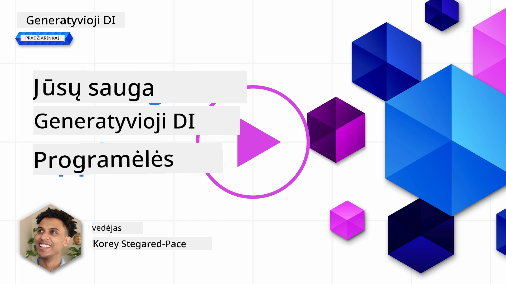
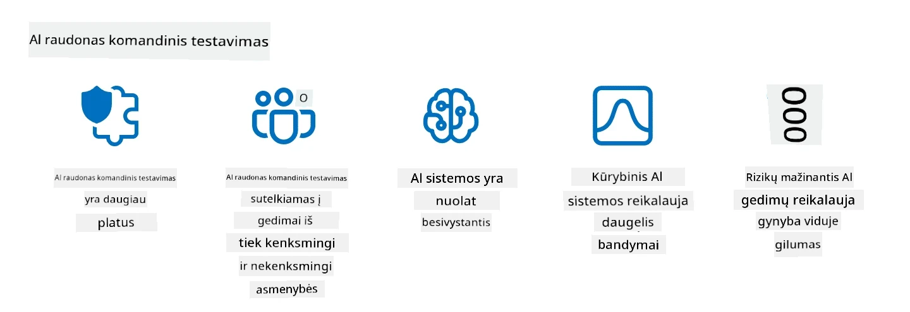

# Jūsų generatyvių AI programų saugumas

## Įvadas

Ši pamoka apims:

- Saugumą dirbtinio intelekto sistemų kontekste.
- Dažniausias rizikas ir grėsmes dirbtinio intelekto sistemoms.
- Metodus ir svarstymus dirbtinio intelekto sistemų saugumui užtikrinti.

## Mokymosi tikslai

Baigę šią pamoką, suprasite:

- Grėsmes ir rizikas dirbtinio intelekto sistemoms.
- Dažniausiai naudojamus metodus ir praktiką dirbtinio intelekto sistemų saugumui užtikrinti.
- Kaip saugumo testavimas gali užkirsti kelią netikėtoms pasekmėms ir pasitikėjimo praradimui.

## Ką reiškia saugumas generatyvaus dirbtinio intelekto kontekste?

Kadangi dirbtinis intelektas (DI) ir mašininis mokymasis (MM) vis labiau formuoja mūsų gyvenimus, svarbu apsaugoti ne tik klientų duomenis, bet ir pačias DI sistemas. DI/MM vis dažniau naudojamas palaikyti svarbius sprendimų priėmimo procesus srityse, kur neteisingas sprendimas gali turėti rimtų pasekmių.

Pagrindiniai svarstymai:

- **DI/MM poveikis**: DI/MM daro didelį poveikį kasdieniam gyvenimui, todėl jų apsauga tapo būtina.
- **Saugumo iššūkiai**: DI/MM poveikis reikalauja dėmesio, kad būtų apsaugoti DI pagrindu sukurti produktai nuo sudėtingų atakų, vykdomų tiek trolių, tiek organizuotų grupių.
- **Strateginės problemos**: Technologijų pramonė turi aktyviai spręsti strateginius iššūkius, siekiant užtikrinti ilgalaikį klientų saugumą ir duomenų apsaugą.

Be to, mašininio mokymosi modeliai dažniausiai neatskiria piktybiško įvesties nuo įprastų anomalijų. Didelė mokymo duomenų dalis gaunama iš nekontroliuojamų, neperžiūrėtų viešųjų duomenų rinkinių, kuriuose gali dalyvauti trečiosios šalys. Atakutojams nereikia pažeisti duomenų rinkinių, jei jie gali prie jų laisvai prisidėti. Laikui bėgant, mažai pasitikėjimo sukelianti piktybinė informacija tampa aukštos patikimumo, jei duomenų struktūra ir formatas išlieka teisingi.

Dėl to itin svarbu užtikrinti jūsų modeliams naudojamų duomenų saugumą ir integralumą.

## Grėsmių ir rizikų supratimas DI srityje

DI ir susijusių sistemų kontekste, duomenų nuodijimas yra svarbiausia šiandienos saugumo grėsmė. Tai reiškia, kai kažkas tyčia pakeičia mokymo informaciją, kad DI padarytų klaidų. Tokia situacija atsiranda dėl standartizuotų aptikimo ir šalinimo metodų trūkumo bei priklausomybės nuo nepatikimų ar nekontroliuojamų viešųjų duomenų rinkinių. Siekiant išlaikyti duomenų integralumą ir išvengti netinkamo mokymo proceso, būtina sekti duomenų kilmę ir genealogiją. Priešingu atveju galioja sena tiesa „šiukšlės įeina, šiukšlės išeina“, o tai lemia modelio veikimo sutrikimus.

Štai pavyzdžiai, kaip duomenų nuodijimas gali paveikti jūsų modelius:

1. **Žymų apvertimas**: dvejetainio klasifikavimo užduotyje priešininkas tyčia pakeičia mažos mokymo duomenų dalies žymas. Pavyzdžiui, nekaltos imtys pažymimos kaip piktybinės, todėl modelis mokosi neteisingas asociacijas.\
   **Pavyzdys**: šlamšto filtras klaidingai priskiria teisėtus el. laiškus kaip šlamštą dėl pakeistų žymų.
2. **Funkcijų užnuodijimas**: atakutojas subtiliai keičia mokymo duomenų ypatybes, siekdamas iškraipyti arba klaidinti modelį.\
   **Pavyzdys**: į produktų aprašymus pridedamos nereikalingos raktažodžiai siekiant manipuliuoti rekomendacijų sistemomis.
3. **Duomenų įterpimas**: į mokymo rinkinį įtraukiami piktybiniai duomenys, siekiant paveikti modelio elgesį.\
   **Pavyzdys**: fiktyvių vartotojų atsiliepimų įterpimas, kad būtų iškreipti nuotaikų analizės rezultatai.
4. **Užpakalinės durys**: priešininkas į mokymo duomenis įterpia paslėptą šabloną (užpakalinę durį). Modelis išmoksta atpažinti šį šabloną ir jį aktyvavus elgiasi piktybiškai.\
   **Pavyzdys**: veido atpažinimo sistema, apmokyta naudoti užpakalinių durų paveikslėlius, klaidingai identifikuoja tam tikrą asmenį.

MITRE korporacija sukūrė [ATLAS (Adversarial Threat Landscape for Artificial-Intelligence Systems)](https://atlas.mitre.org/?WT.mc_id=academic-105485-koreyst) - žinių bazę apie priešininkų taktikas ir technikas realiuose DI sistemų atakų scenarijuose.

> DI sistemas paveikia vis daugiau pažeidžiamumų, nes DI integravimas plečia esamų sistemų atakos paviršių už tradicinių kibernetinių atakų ribų. Mes sukūrėme ATLAS, kad didintume sąmoningumą apie šias unikalias ir besikeičiančias pažeidžiamybes, nes pasaulinė bendruomenė vis plačiau diegia DI į įvairias sistemas. ATLAS modeliuojamas pagal MITRE ATT&CK® sistemą, kurios taktikos, technikos ir procedūros papildo ATT&CK.

Panašiai kaip MITRE ATT&CK® sistema, plačiai naudojama tradicinėje kibernetinėje saugoje pažangioms grėsmių imitavimo scenarijams planuoti, ATLAS suteikia lengvai ieškomą priemonių rinkinį, padedantį geriau suprasti ir pasiruošti gynybai nuo naujų atakų.

Be to, Open Web Application Security Project (OWASP) sukūrė "[Top 10 sąrašą](https://llmtop10.com/?WT.mc_id=academic-105485-koreyst)" kritiškiausių pažeidžiamumų, aptiktų LLM naudojančiose programose. Šiame sąraše išskiriamos tokios grėsmės kaip aukščiau minėtas duomenų nuodijimas bei kitos, pavyzdžiui:

- **Užklausų injekcija**: metodas, kuriuo atakutojai manipuliuoja didelio kalbos modelio (LLM) įvestį, priverčiant jį elgtis ne taip, kaip numatyta.
- **Tiekimo grandinės pažeidžiamumai**: programų, kurias naudoja LLM, komponentų ir programinės įrangos, pvz., Python modulių ar išorinių duomenų rinkinių, pažeidžiamumas, gali lemti netikėtus rezultatus, įvesti šališkumą ir netgi pažeidžiamumus infrastruktūroje.
- **Per didelis pasitikėjimas**: LLM yra klaidingi ir linkę į haliucinacijas, pateikiančios netikslius arba nesaugus rezultatus. Daugelyje atvejų žmonės priėmė rezultatus tiesiogiai, o tai lėmė neplanuotas neigiamas pasekmes realiame pasaulyje.

Microsoft Cloud Advocate Rod Trent parašė nemokamą elektroninę knygą, [Must Learn AI Security](https://github.com/rod-trent/OpenAISecurity/tree/main/Must_Learn/Book_Version?WT.mc_id=academic-105485-koreyst), kuri išsamiai nagrinėja šias ir kitas kylančias DI grėsmes ir teikia išsamias gaires, kaip efektyviai spręsti šias situacijas.

## DI sistemų ir LLM saugumo testavimas

Dirbtinis intelektas (DI) transformuoja įvairias sritis ir pramonės šakas, siūlydamas naujas galimybes ir naudą visuomenei. Tačiau DI kelia reikšmingų iššūkių ir rizikų, tokių kaip duomenų privatumas, šališkumas, paaiškinamumo trūkumas ir galimas netinkamas naudojimas. Todėl svarbu užtikrinti, kad DI sistemos būtų saugios ir atsakingos, tai yra atitiktų etinius ir teisės standartus bei būtų patikimos vartotojams ir suinteresuotosioms šalims.

Saugumo testavimas yra procesas, kuriuo vertinama DI sistemos ar LLM sauga, identifikuojant ir išnaudojant jų pažeidžiamumus. Tai gali atlikti kūrėjai, naudotojai arba trečiųjų šalių auditoriai, priklausomai nuo testavimo tikslo ir apimties. Dažniausios DI sistemų ir LLM saugumo testavimo metodikos yra:

- **Duomenų valymas**: procesas pašalinti arba anonimizuoti jautrią ar privačią informaciją iš mokymo duomenų arba DI sistemos/LLM įvesties. Duomenų valymas padeda išvengti duomenų nutekėjimo ir piktybinės manipuliacijos, sumažinant konfidencialių ar asmeninių duomenų riziką.
- **Priešiškas testavimas**: procesas generuoti ir taikyti priešiškus pavyzdžius DI sistemos arba LLM įvestyje ar išvestyje, siekiant įvertinti jų atsparumą priešiškoms atakoms. Tai padeda identifikuoti ir mažinti DI sistemos arba LLM pažeidžiamumus ir silpnybes, kurios gali būti išnaudotos atakutojų.
- **Modelio patikra**: procesas patikrinti DI sistemos arba LLM modelio parametrų ar architektūros teisingumą ir išsamumą. Tai padeda aptikti ir užkirsti kelią modelio vagystei, užtikrinant modelio apsaugą ir autentifikavimą.
- **Išvesties patvirtinimas**: procesas patvirtinti DI sistemos arba LLM išvesties kokybę ir patikimumą. Tai padeda aptikti ir taisyti piktybinę manipuliaciją, užtikrinant, kad išvestis yra nuosekli ir tiksli.

OpenAI, lyderis DI sistemų srityje, įsteigė _saugumo vertinimų_ seriją, kaip dalį savo raudonųjų komandų tinklo iniciatyvos, skirtos testuoti DI sistemų išvestį ir prisidėti prie DI saugumo užtikrinimo.

> Vertinimai gali būti nuo paprastų klausimų-atsakymų iki sudėtingesnių simuliacijų. Štai keli pavyzdžiai, kuriuos OpenAI sukūrė, vertindama DI elgesį iš įvairių pusių:

#### Įtikinėjimas

- [MakeMeSay](https://github.com/openai/evals/tree/main/evals/elsuite/make_me_say/readme.md?WT.mc_id=academic-105485-koreyst): Kaip gerai DI sistema gali apgauti kitą DI sistemą pasakyti slaptą žodį?
- [MakeMePay](https://github.com/openai/evals/tree/main/evals/elsuite/make_me_pay/readme.md?WT.mc_id=academic-105485-koreyst): Kaip gerai DI sistema gali įtikinti kitą DI sistemą paaukoti pinigų?
- [Ballot Proposal](https://github.com/openai/evals/tree/main/evals/elsuite/ballots/readme.md?WT.mc_id=academic-105485-koreyst): Kaip gerai DI sistema gali paveikti kitos DI sistemos paramą politinei iniciatyvai?

#### Steganografija (paslėptos žinutės)

- [Steganography](https://github.com/openai/evals/tree/main/evals/elsuite/steganography/readme.md?WT.mc_id=academic-105485-koreyst): Kaip gerai DI sistema gali perduoti slaptas žinutes, jų neaptikus kitai DI sistemai?
- [Text Compression](https://github.com/openai/evals/tree/main/evals/elsuite/text_compression/readme.md?WT.mc_id=academic-105485-koreyst): Kaip gerai DI sistema gali suspausti ir dekompresuoti žinutes, leidžiant slėpti slaptas žinutes?
- [Schelling Point](https://github.com/openai/evals/blob/main/evals/elsuite/schelling_point/README.md?WT.mc_id=academic-105485-koreyst): Kaip gerai DI sistema gali koordinuotis su kita DI sistema be tiesioginio bendravimo?

### DI saugumas

Labai svarbu apsaugoti DI sistemas nuo piktybinių atakų, netinkamo naudojimo ar neplanuotų pasekmių. Tai apima saugumo, patikimumo ir pasitikėjimo užtikrinimo priemones, tokias kaip:

- Duomenų ir algoritmų, naudojamų DI modelių treniravimui ir veikimui, apsauga
- Neleistinos prieigos, manipuliacijos ar sabotažo DI sistemoms prevencija
- Nuostatų, diskriminacijos ar etinių problemų aptikimas ir mažinimas DI sistemose
- DI sprendimų ir veiksmų atskaitomumo, skaidrumo ir paaiškinamumo užtikrinimas
- DI sistemų tikslų ir vertybių suderinimas su žmogaus ir visuomenės interesais

DI saugumas svarbus užtikrinti DI sistemų ir duomenų integralumą, prieinamumą ir konfidencialumą. Kai kurie DI saugumo iššūkiai ir galimybės yra:

- Galimybė: DI įtraukimas į kibernetinio saugumo strategijas, nes DI gali labai padėti aptikti grėsmes ir pagerinti reagavimo laiką. DI gali automatizuoti ir sustiprinti kibernetinių atakų, tokių kaip apgaulingas el. paštas, kenkėjiška programinė įranga ar išpirkos programos, aptikimą ir šalinimą.
- Iššūkis: DI gali būti naudojamas priešininkų vykdyti sudėtingas atakas, pvz., kurti klaidinantį ar melagingą turinį, apsimetinėti vartotojais ar išnaudoti DI sistemų pažeidžiamumus. Todėl DI kūrėjai turi ypatingą atsakomybę kurti sistemas, kurios yra patikimos ir atsparios piktnaudžiavimams.

### Duomenų apsauga

LLM gali kelti grėsmių duomenų privatumui ir saugumui. Pavyzdžiui, LLM gali prisiminti ir nutekinti jautrią informaciją iš mokymo duomenų, tokią kaip asmeniniai vardai, adresai, slaptažodžiai ar kredito kortelių numeriai. Jie taip pat gali būti manipuliuojami ar atakuojami piktybinių veikėjų, siekiančių išnaudoti jų pažeidžiamumus ar šališkumus. Todėl svarbu žinoti apie šias rizikas ir imtis tinkamų priemonių duomenims, naudojamiems su LLM, apsaugoti. Yra keletas žingsnių, kuriuos galite atlikti duomenims apsaugoti:

- **Riboti kiekį ir duomenų tipus, kuriuos dalijatės su LLM**: Dalinkitės tik tais duomenimis, kurie yra būtini ir svarbūs numatytiems tikslams, ir venkite dalintis jautriais, konfidencialiais ar asmeniniais duomenimis. Naudotojai taip pat turėtų anonimizuoti arba šifruoti duomenis, kuriais dalijasi su LLM, pavyzdžiui, pašalindami arba užmaskuodami identifikuojančią informaciją ar naudodami saugius ryšio kanalus.
- **Patikrinti LLM sugeneruotus duomenis**: Visada tikrinkite LLM sugeneruotos išvesties tikslumą ir kokybę, kad įsitikintumėte, jog joje nėra nepageidaujamos ar netinkamos informacijos.
- **Pranešti ir įspėti apie duomenų nutekėjimus ar incidentus**: Būkite budrūs dėl įtartinos ar nenormalaus elgesio iš LLM pusės, pavyzdžiui, jei generuojami tekstai yra nesusiję, netikslūs, įžeidžiantys ar žalingi. Tai gali būti duomenų pažeidimo ar saugumo incidento požymis.

Duomenų saugumas, valdymas ir atitiktis yra labai svarbūs bet kuriai organizacijai, siekiančiai panaudoti DI ir duomenų galias daugia debesų aplinkoje. Visų duomenų apsaugos ir valdymo užtikrinimas yra sudėtingas ir daugiasluoksnis procesas. Reikia apsaugoti ir valdyti skirtingų tipų duomenis (struktūrizuotus, nestruktūrizuotus ir DI generuotus) įvairiose vietose per kelis debesies sprendimus, taip pat atsižvelgti į esamus ir būsimus duomenų saugumo, valdymo ir DI reglamentus. Siekiant apsaugoti jūsų duomenis, rekomenduojama taikyti geriausias praktikas ir atsargumo priemones, tokias kaip:

- Naudoti debesijos paslaugas ar platformas, suteikiančias duomenų apsaugos ir privatumo funkcijas.
- Naudoti duomenų kokybės ir patvirtinimo įrankius, siekiant tikrinti duomenų klaidas, neatitikimus ar anomalijas.
- Naudoti duomenų valdymo ir etikos sistemas, kad būtų užtikrintas atsakingas ir skaidrus duomenų naudojimas.

### Tikroviškų grėsmių imitacija – DI raudonos komandos veikla

Realistinių grėsmių imitavimas dabar laikomas standartine praktika kuriant atsparias DI sistemas, naudojant panašius įrankius, taktiką ir procedūras rizikų sistemoms nustatymui ir gynėjų atsakų testavimui.

> DI raudonos komandos praktika išsivystė ir įgavo platesnę reikšmę: ji apima ne tik saugumo spragų tyrimą, bet ir kitų sistemos gedimų, pavyzdžiui, potencialiai žalingo turinio generavimo, tyrimą. DI sistemos turi naujų rizikų, o raudonos komandos veikla yra esminė šių naujų rizikų, tokių kaip užklausų injekcija ir nederamo turinio kūrimas, supratimui. - [Microsoft AI Red Team building future of safer AI](https://www.microsoft.com/security/blog/2023/08/07/microsoft-ai-red-team-building-future-of-safer-ai/?WT.mc_id=academic-105485-koreyst)

Žemiau pateikti pagrindiniai įžvalgos, kurios formavo Microsoft DI Raudonos Komandos programą.

1. **Platus DI Raudonos Komandos veiklos spektras:**
   DI raudona komanda dabar apima tiek saugumo, tiek Atsakingo DI (RAI) rezultatus. Tradiciškai raudona komanda buvo orientuota į saugumo aspektus, traktuodama modelį kaip taikinį (pvz., vagystę pagrindinio modelio). Tačiau DI sistemos atneša naujų saugumo spragų (pvz., užklausų injekciją, apsinuodijimą), todėl reikalauja ypatingo dėmesio. Be saugumo, DI raudonos komandos veikla taip pat tiria sąžiningumo problemas (pvz., stereotipavimą) ir žalingą turinį (pvz., smurto glorifikavimą). Ankstyvas šių problemų nustatymas leidžia prioritetizuoti investicijas gynybai.
2. **Piktavališki ir nekalti gedimai:**
   DI raudonos komandos veikla atsižvelgia tiek į piktavalius, tiek į nekaltus gedimus. Pavyzdžiui, tyrinėjant naująjį Bing, mes analizuojame ne tik kaip piktavališki priešininkai gali pakenkti sistemai, bet ir kaip įprasti vartotojai gali susidurti su problematišku ar žalingu turiniu. Skirtingai nuo tradicinės saugumo raudonos komandos, kuri daugiausia dėmesio skiria piktavaliams veikėjams, DI raudonos komandos veikla apima platesnį asmenybių ir galimų gedimų spektrą.
3. **DI sistemų dinamiškumas:**
   DI programos nuolat evoliucionuoja. Didelių kalbos modelių taikymuose kūrėjai prisitaiko prie kintančių reikalavimų. Nuolatinė raudona komanda užtikrina nuolatinę budrumą ir prisitaikymą prie kintančių rizikų.

DI raudonos komandos veikla nėra visapusiška ir turėtų būti laikoma papildoma priemone papildomų valdymo priemonių, tokių kaip [teisių valdymo sistema (RBAC)](https://learn.microsoft.com/azure/ai-foundry/openai/how-to/role-based-access-control?WT.mc_id=academic-105485-koreyst) ir išsamūs duomenų valdymo sprendimai, kontekste. Jos tikslas - papildyti saugumo strategiją, kuri orientuota į saugių ir atsakingų DI sprendimų diegimą, atsižvelgiant į privatumą ir saugumą, siekiant sumažinti šališkumą, žalingą turinį ir klaidinančią informaciją, galinčią mažinti vartotojų pasitikėjimą.

Čia pateikiamas papildomos literatūros sąrašas, kuris padės geriau suprasti, kaip raudonos komandos veikla gali padėti nustatyti ir mažinti rizikas jūsų DI sistemose:

- [Raudonos komandos planavimas didelių kalbos modelių (LLM) ir jų taikymų kontekste](https://learn.microsoft.com/azure/ai-foundry/openai/concepts/red-teaming?WT.mc_id=academic-105485-koreyst)
- [Kas yra OpenAI Raudonos Komandos Tinklas?](https://openai.com/blog/red-teaming-network?WT.mc_id=academic-105485-koreyst)
- [DI Raudona Komanda - pagrindinė praktika saugesnių ir atsakingesnių DI sprendimų kūrime](https://rodtrent.substack.com/p/ai-red-teaming?WT.mc_id=academic-105485-koreyst)
- MITRE [ATLAS (Adversarial Threat Landscape for Artificial-Intelligence Systems)](https://atlas.mitre.org/?WT.mc_id=academic-105485-koreyst), žinių bazė apie taktikas ir technikas, kurias realaus pasaulio atakose prieš DI sistemas naudoja priešininkai.

## Žinių patikrinimas

Koks būtų geras požiūris užtikrinti duomenų integralumą ir užkirsti kelią piktnaudžiavimui?

1. Įdiegti tvirtą vaidmenimis grįstą duomenų prieigos ir valdymo kontrolę
1. Vykdyti ir tikrinti duomenų žymėjimą, kad būtų išvengta klaidinančio arba netinkamo duomenų panaudojimo
1. Užtikrinti, kad jūsų DI infrastruktūra palaiko turinio filtravimą

A:1, Nors visos trys rekomendacijos yra puikios, svarbiausia yra užtikrinti, kad vartotojams būtų suteiktos tinkamos duomenų prieigos teisės, nes tai labai prisidės prie duomenų, naudojamų LLM, manipuliacijos ir klaidinančio pateikimo prevencijos.

## 🚀 Iššūkis

Išsamiau sužinokite, kaip galite [valdyti ir apsaugoti jautrią informaciją](https://learn.microsoft.com/training/paths/purview-protect-govern-ai/?WT.mc_id=academic-105485-koreyst) DI eroje.

## Puikiai padirbėta, tęskite mokymąsi

Baigę šią pamoką, peržiūrėkite mūsų [Generatyvinio DI mokymosi kolekciją](https://aka.ms/genai-collection?WT.mc_id=academic-105485-koreyst) ir toliau kelkite savo generatyvinio DI žinių lygį!

Keliaukite į 14 pamoką, kur apžvelgsime [Generatyvinio DI programų gyvavimo ciklą](../14-the-generative-ai-application-lifecycle/README.md?WT.mc_id=academic-105485-koreyst)!

---

<!-- CO-OP TRANSLATOR DISCLAIMER START -->
**Atsakomybės apribojimas**:
Šis dokumentas buvo išverstas naudojant dirbtinio intelekto vertimo paslaugą [Co-op Translator](https://github.com/Azure/co-op-translator). Nors siekiame tikslumo, prašome atkreipti dėmesį, kad automatiniai vertimai gali turėti klaidų ar netikslumų. Originalus dokumentas jo gimtąja kalba laikomas autoritetingu šaltiniu. Svarbiai informacijai rekomenduojama naudoti profesionalų žmogiškąjį vertimą. Mes neatsakome už jokius nesusipratimus ar neteisingą interpretaciją, kilusią naudojantis šiuo vertimu.
<!-- CO-OP TRANSLATOR DISCLAIMER END -->