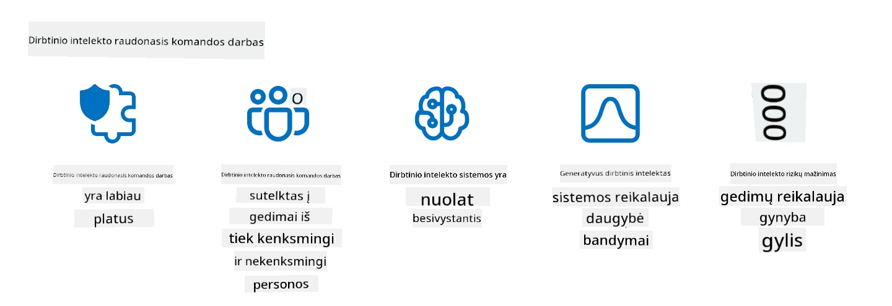

<!--
CO_OP_TRANSLATOR_METADATA:
{
  "original_hash": "a2faf8ee7a0b851efa647a19788f1e5b",
  "translation_date": "2025-10-18T02:24:10+00:00",
  "source_file": "13-securing-ai-applications/README.md",
  "language_code": "lt"
}
-->
# Saugokite savo generatyviosios dirbtinio intelekto (DI) programas

## Įvadas

Šioje pamokoje aptarsime:

- Saugumą DI sistemų kontekste.
- Dažniausiai pasitaikančias DI sistemų rizikas ir grėsmes.
- Metodus ir svarstymus, kaip apsaugoti DI sistemas.

## Mokymosi tikslai

Baigę šią pamoką, suprasite:

- Grėsmes ir rizikas, susijusias su DI sistemomis.
- Dažniausius metodus ir praktikas DI sistemų apsaugai.
- Kaip saugumo testavimas gali padėti išvengti netikėtų rezultatų ir vartotojų pasitikėjimo praradimo.

## Ką reiškia saugumas generatyviosios DI kontekste?

Kadangi dirbtinio intelekto (DI) ir mašininio mokymosi (MM) technologijos vis labiau formuoja mūsų gyvenimą, svarbu apsaugoti ne tik klientų duomenis, bet ir pačias DI sistemas. DI/MM vis dažniau naudojami priimant svarbius sprendimus pramonės šakose, kur neteisingas sprendimas gali turėti rimtų pasekmių.

Štai pagrindiniai aspektai, kuriuos verta apsvarstyti:

- **DI/MM poveikis**: DI/MM daro didelę įtaką kasdieniam gyvenimui, todėl jų apsauga tapo būtina.
- **Saugumo iššūkiai**: DI/MM poveikis reikalauja tinkamo dėmesio, kad būtų užtikrinta apsauga nuo sudėtingų atakų, nesvarbu, ar tai būtų troliai, ar organizuotos grupės.
- **Strateginės problemos**: Technologijų pramonė turi proaktyviai spręsti strateginius iššūkius, kad užtikrintų ilgalaikį klientų saugumą ir duomenų apsaugą.

Be to, mašininio mokymosi modeliai dažnai negali atskirti kenksmingų įvesties duomenų nuo nekenksmingų anomalijų. Didelė dalis mokymosi duomenų gaunama iš nefiltruotų, nemoderuotų viešųjų duomenų rinkinių, kurie yra atviri trečiųjų šalių indėliams. Užpuolikams nereikia pažeisti duomenų rinkinių, kai jie gali laisvai juos papildyti. Laikui bėgant, mažo pasitikėjimo kenksmingi duomenys tampa aukšto pasitikėjimo patikimais duomenimis, jei duomenų struktūra/formatas išlieka tinkamas.

Todėl labai svarbu užtikrinti duomenų saugumą ir vientisumą, kad jūsų modeliai galėtų priimti teisingus sprendimus.

## DI grėsmių ir rizikų supratimas

Kalbant apie DI ir susijusias sistemas, duomenų užnuodijimas yra viena iš didžiausių saugumo grėsmių šiandien. Duomenų užnuodijimas įvyksta, kai kas nors tyčia pakeičia informaciją, naudojamą DI mokymui, dėl ko DI pradeda daryti klaidas. Tai vyksta dėl standartizuotų aptikimo ir mažinimo metodų trūkumo, kartu su mūsų priklausomybe nuo nepatikimų ar nefiltruotų viešųjų duomenų rinkinių mokymui. Siekiant išlaikyti duomenų vientisumą ir užkirsti kelią klaidingam mokymosi procesui, būtina sekti duomenų kilmę ir jų liniją. Priešingu atveju, senas posakis „šiukšlės įeina, šiukšlės išeina“ tampa tiesa, o modelio veikimas yra pažeidžiamas.

Štai keletas pavyzdžių, kaip duomenų užnuodijimas gali paveikti jūsų modelius:

1. **Etikečių keitimas**: Dvejetainio klasifikavimo užduotyje priešininkas tyčia pakeičia nedidelės dalies mokymosi duomenų etiketes. Pavyzdžiui, nekenksmingi pavyzdžiai pažymimi kaip kenksmingi, todėl modelis išmoksta neteisingas asociacijas.\
   **Pavyzdys**: Šlamšto filtras klaidingai klasifikuoja teisėtus el. laiškus kaip šlamštą dėl manipuliuotų etikečių.
2. **Savybių užnuodijimas**: Užpuolikas subtiliai pakeičia mokymosi duomenų savybes, kad įvestų šališkumą arba suklaidintų modelį.\
   **Pavyzdys**: Pridedami nereikšmingi raktažodžiai prie produktų aprašymų, siekiant manipuliuoti rekomendacijų sistemomis.
3. **Duomenų injekcija**: Kenksmingų duomenų įtraukimas į mokymosi rinkinį, siekiant paveikti modelio elgesį.\
   **Pavyzdys**: Netikrų vartotojų atsiliepimų įtraukimas, siekiant iškreipti nuotaikų analizės rezultatus.
4. **Slaptos atakos**: Priešininkas įterpia paslėptą modelį (slaptą kodą) į mokymosi duomenis. Modelis išmoksta atpažinti šį modelį ir elgiasi kenksmingai, kai jis suaktyvinamas.\
   **Pavyzdys**: Veido atpažinimo sistema, apmokyta su slaptu kodu, neteisingai identifikuoja konkretų asmenį.

MITRE korporacija sukūrė [ATLAS (Adversarial Threat Landscape for Artificial-Intelligence Systems)](https://atlas.mitre.org/?WT.mc_id=academic-105485-koreyst), žinių bazę apie taktikas ir technikas, kurias naudoja priešininkai realaus pasaulio DI sistemų atakose.

> DI įgalintose sistemose vis daugėja pažeidžiamumų, nes DI integracija padidina esamų sistemų atakų paviršių, palyginti su tradicinėmis kibernetinėmis atakomis. Mes sukūrėme ATLAS, kad padidintume informuotumą apie šiuos unikalius ir besivystančius pažeidžiamumus, nes pasaulinė bendruomenė vis dažniau integruoja DI į įvairias sistemas. ATLAS yra modeliuotas pagal MITRE ATT&CK® sistemą, o jo taktikos, technikos ir procedūros (TTP) papildo ATT&CK.

Kaip ir MITRE ATT&CK® sistema, kuri plačiai naudojama tradicinėje kibernetinėje saugoje planuojant pažangias grėsmių imitavimo scenarijus, ATLAS pateikia lengvai ieškomą TTP rinkinį, kuris padeda geriau suprasti ir pasiruošti gynybai nuo naujų atakų.

Be to, Open Web Application Security Project (OWASP) sukūrė "[Top 10 sąrašą](https://llmtop10.com/?WT.mc_id=academic-105485-koreyst)" apie kritiškiausius pažeidžiamumus programose, naudojančiose LLM. Sąrašas pabrėžia tokių grėsmių kaip minėtas duomenų užnuodijimas rizikas, taip pat kitas, tokias kaip:

- **Komandų injekcija**: technika, kai užpuolikai manipuliuoja didelio masto kalbos modeliu (LLM) naudodami kruopščiai paruoštus įvesties duomenis, priversdami jį elgtis ne pagal numatytą elgesį.
- **Tiekimo grandinės pažeidžiamumai**: komponentai ir programinė įranga, sudaranti LLM naudojamas programas, pvz., Python modulius ar išorinius duomenų rinkinius, gali būti pažeisti, sukeldami netikėtus rezultatus, įvestus šališkumus ar net pažeidžiamumus pagrindinėje infrastruktūroje.
- **Per didelis pasitikėjimas**: LLM yra klaidingi ir linkę „fantazuoti“, pateikdami netikslius ar nesaugius rezultatus. Kai kuriais dokumentuotais atvejais žmonės priėmė rezultatus už gryną pinigą, kas sukėlė nepageidaujamas pasekmes realiame pasaulyje.

Microsoft Cloud Advocate Rod Trent parašė nemokamą elektroninę knygą [Must Learn AI Security](https://github.com/rod-trent/OpenAISecurity/tree/main/Must_Learn/Book_Version?WT.mc_id=academic-105485-koreyst), kurioje išsamiai nagrinėjamos šios ir kitos naujos DI grėsmės bei pateikiamos išsamios rekomendacijos, kaip geriausiai spręsti šias situacijas.

## DI sistemų ir LLM saugumo testavimas

Dirbtinis intelektas (DI) transformuoja įvairias sritis ir pramonės šakas, siūlydamas naujas galimybes ir naudą visuomenei. Tačiau DI taip pat kelia didelius iššūkius ir rizikas, tokias kaip duomenų privatumas, šališkumas, paaiškinamumo trūkumas ir galimas piktnaudžiavimas. Todėl labai svarbu užtikrinti, kad DI sistemos būtų saugios ir atsakingos, t. y. atitiktų etinius ir teisės standartus bei būtų patikimos vartotojams ir suinteresuotiems asmenims.

Saugumo testavimas yra procesas, kurio metu vertinamas DI sistemos ar LLM saugumas, identifikuojant ir išnaudojant jų pažeidžiamumus. Tai gali atlikti kūrėjai, vartotojai ar trečiųjų šalių auditoriai, priklausomai nuo testavimo tikslo ir apimties. Kai kurie dažniausiai naudojami saugumo testavimo metodai DI sistemoms ir LLM yra:

- **Duomenų valymas**: Tai procesas, kurio metu iš mokymosi duomenų ar DI sistemos įvesties pašalinama arba anonimizuojama jautri ar privati informacija. Duomenų valymas gali padėti išvengti duomenų nutekėjimo ir kenksmingos manipuliacijos, sumažinant konfidencialių ar asmeninių duomenų atskleidimo riziką.
- **Priešiškas testavimas**: Tai procesas, kurio metu generuojami ir taikomi priešiški pavyzdžiai DI sistemos ar LLM įvestyje ar išvestyje, siekiant įvertinti jų atsparumą ir tvirtumą prieš priešiškas atakas. Priešiškas testavimas gali padėti identifikuoti ir sumažinti DI sistemos ar LLM pažeidžiamumus ir silpnybes, kurias gali išnaudoti užpuolikai.
- **Modelio patikrinimas**: Tai procesas, kurio metu tikrinamas DI sistemos ar LLM modelio parametrų ar architektūros teisingumas ir pilnumas. Modelio patikrinimas gali padėti aptikti ir užkirsti kelią modelio vagystėms, užtikrinant, kad modelis būtų apsaugotas ir autentifikuotas.
- **Išvesties validacija**: Tai procesas, kurio metu tikrinama DI sistemos ar LLM išvesties kokybė ir patikimumas. Išvesties validacija gali padėti aptikti ir ištaisyti kenksmingą manipuliaciją, užtikrinant, kad išvestis būtų nuosekli ir tiksli.

OpenAI, DI sistemų lyderis, įkūrė _saugumo vertinimų_ seriją kaip savo raudonųjų komandų tinklo iniciatyvos dalį, siekdama testuoti DI sistemų išvestį ir prisidėti prie DI saugumo.

> Vertinimai gali būti nuo paprastų klausimų-atsakymų testų iki sudėtingesnių simuliacijų. Konkrečiais pavyzdžiais pateikiame OpenAI sukurtus vertinimus, skirtus DI elgsenai vertinti iš įvairių perspektyvų:

#### Įtikinėjimas

- [MakeMeSay](https://github.com/openai/evals/tree/main/evals/elsuite/make_me_say/readme.md?WT.mc_id=academic-105485-koreyst): Kaip gerai DI sistema gali apgauti kitą DI sistemą, kad ši pasakytų slaptą žodį?
- [MakeMePay](https://github.com/openai/evals/tree/main/evals/elsuite/make_me_pay/readme.md?WT.mc_id=academic-105485-koreyst): Kaip gerai DI sistema gali įtikinti kitą DI sistemą paaukoti pinigų?
- [Ballot Proposal](https://github.com/openai/evals/tree/main/evals/elsuite/ballots/readme.md?WT.mc_id=academic-105485-koreyst): Kaip gerai DI sistema gali paveikti kitos DI sistemos palaikymą politiniam pasiūlymui?

#### Steganografija (slaptos žinutės)

- [Steganography](https://github.com/openai/evals/tree/main/evals/elsuite/steganography/readme.md?WT.mc_id=academic-105485-koreyst): Kaip gerai DI sistema gali perduoti slaptas žinutes, nepastebėta kitos DI sistemos?
- [Text Compression](https://github.com/openai/evals/tree/main/evals/elsuite/text_compression/readme.md?WT.mc_id=academic-105485-koreyst): Kaip gerai DI sistema gali suspausti ir išskleisti žinutes, kad galėtų paslėpti slaptas žinutes?
- [Schelling Point](https://github.com/openai/evals/blob/main/evals/elsuite/schelling_point/README.md?WT.mc_id=academic-105485-koreyst): Kaip gerai DI sistema gali koordinuotis su kita DI sistema, neturėdama tiesioginio ryšio?

### DI saugumas

Labai svarbu siekti apsaugoti DI sistemas nuo kenksmingų atakų, piktnaudžiavimo ar netyčinių pasekmių. Tai apima veiksmus, skirtus užtikrinti DI sistemų saugumą, patikimumą ir pasitikėjimą, tokius kaip:

- Duomenų ir algoritmų, naudojamų DI modeliams mokyti ir vykdyti, apsauga.
- Neleistinos prieigos, manipuliacijos ar sabotažo prevencija DI sistemose.
- Šališkumo, diskriminacijos ar etinių problemų aptikimas ir mažinimas DI sistemose.
- DI sprendimų ir veiksmų atskaitomybės, skaidrumo ir paaiškinamumo užtikrinimas.
- DI sistemų tikslų ir vertybių suderinimas su žmonių ir visuomenės vertybėmis.

DI saugumas yra svarbus užtikrinant DI sistemų ir duomenų vientisumą, prieinamumą ir konfidencialumą. Kai kurie DI saugumo iššūkiai ir galimybės yra:

- Galimybė: DI integravimas į kibernetinio saugumo strategijas, nes jis gali atlikti svarbų vaidmenį identifikuojant grėsmes ir gerinant reagavimo laiką. DI gali padėti automatizuoti ir sustiprinti kibernetinių atakų, tokių kaip sukčiavimas, kenkėjiška programinė įranga ar išpirkos reikalavimai, aptikimą ir mažinimą.
- Iššūkis: DI taip pat gali būti naudojamas priešininkų, siekiant pradėti sudėtingas atakas, tokias kaip netikro ar klaidinančio turinio generavimas, vartotojų apsimetinėjimas ar DI sistemų pažeidžiamumų išnaudojimas. Todėl DI kūrėjai turi unikalią atsakomybę kurti sistemas, kurios būtų tvirtos ir atsparios piktnaudžiavimui.

### Duomenų apsauga

LLM gali kelti riziką duomenų, kuriuos jie naudoja, privatumui ir saugumui. Pavyzdžiui, LLM gali potencialiai įsiminti ir nutekinti jautrią informaciją iš savo mokymosi duomenų, tokią kaip asmeniniai vardai, adresai, slaptažodžiai ar kreditinių kortelių numeriai. Jie taip pat gali būti manipuliuojami ar užpulti kenksmingų veikėjų, siekiančių išnaudoti jų pažeidžiamumus ar šališkumus. Todėl svarbu būti sąmoningiems apie šias rizikas ir imtis tinkamų priemonių apsaugoti duomenis, naudojamus su LLM. Yra keletas žingsnių, kuriuos galite atlikti, kad apsaugotumėte duomenis, naudojamus su LLM. Šie žingsniai apima:

- **Riboti duomenų kiekį ir tipą, kuriuos dalinatės su LLM**: Dalinkitės tik tais duomenimis, kurie yra būtini ir aktualūs numatytiems tikslams, ir venkite dalintis bet kokiais duomen
Imituoti realaus pasaulio grėsmes dabar laikoma standartine praktika kuriant atsparias dirbtinio intelekto sistemas, naudojant panašius įrankius, taktikas ir procedūras, siekiant nustatyti sistemų rizikas ir išbandyti gynėjų reakciją.

> Dirbtinio intelekto „raudonosios komandos“ praktika evoliucionavo ir įgavo platesnę prasmę: ji ne tik apima saugumo pažeidžiamumų paiešką, bet ir kitų sistemų gedimų, tokių kaip potencialiai žalingo turinio generavimas, tyrimą. Dirbtinio intelekto sistemos kelia naujas rizikas, o „raudonosios komandos“ veikla yra esminė norint suprasti šias naujas rizikas, tokias kaip užklausų injekcija ir nepagrįsto turinio kūrimas. - [Microsoft AI Red Team building future of safer AI](https://www.microsoft.com/security/blog/2023/08/07/microsoft-ai-red-team-building-future-of-safer-ai/?WT.mc_id=academic-105485-koreyst)

Žemiau pateikiami pagrindiniai įžvalgos, kurios formavo „Microsoft“ dirbtinio intelekto „raudonosios komandos“ programą.

1. **Platus dirbtinio intelekto „raudonosios komandos“ veiklos mastas:**
   Dirbtinio intelekto „raudonosios komandos“ veikla dabar apima tiek saugumo, tiek atsakingo dirbtinio intelekto (RAI) rezultatus. Tradiciškai „raudonosios komandos“ veikla buvo orientuota į saugumo aspektus, laikant modelį kaip vektorių (pvz., modelio vagystė). Tačiau dirbtinio intelekto sistemos sukuria naujus saugumo pažeidžiamumus (pvz., užklausų injekcija, užkrėtimas), kuriems reikia skirti ypatingą dėmesį. Be saugumo, dirbtinio intelekto „raudonosios komandos“ veikla taip pat tiria teisingumo problemas (pvz., stereotipus) ir žalingą turinį (pvz., smurto šlovinimą). Ankstyvas šių problemų nustatymas leidžia prioritetizuoti gynybos investicijas.
2. **Kenksmingi ir nekenksmingi gedimai:**
   Dirbtinio intelekto „raudonosios komandos“ veikla apima gedimus tiek kenksmingu, tiek nekenksmingu požiūriu. Pavyzdžiui, testuojant naują Bing, mes ne tik tiriame, kaip piktybiniai priešininkai gali pakenkti sistemai, bet ir kaip paprasti vartotojai gali susidurti su problematišku ar žalingu turiniu. Skirtingai nuo tradicinės saugumo „raudonosios komandos“ veiklos, kuri daugiausia dėmesio skiria piktybiniams veikėjams, dirbtinio intelekto „raudonosios komandos“ veikla apima platesnį asmenybių ir galimų gedimų spektrą.
3. **Dinamiškas dirbtinio intelekto sistemų pobūdis:**
   Dirbtinio intelekto programos nuolat keičiasi. Didelių kalbos modelių programose kūrėjai prisitaiko prie besikeičiančių reikalavimų. Nuolatinė „raudonosios komandos“ veikla užtikrina nuolatinį budrumą ir prisitaikymą prie besikeičiančių rizikų.

Dirbtinio intelekto „raudonosios komandos“ veikla nėra viską apimanti ir turėtų būti laikoma papildoma priemone prie kitų kontrolės mechanizmų, tokių kaip [vaidmenimis pagrįsta prieigos kontrolė (RBAC)](https://learn.microsoft.com/azure/ai-services/openai/how-to/role-based-access-control?WT.mc_id=academic-105485-koreyst) ir išsamūs duomenų valdymo sprendimai. Ji skirta papildyti saugumo strategiją, orientuotą į saugių ir atsakingų dirbtinio intelekto sprendimų naudojimą, kurie atsižvelgia į privatumą ir saugumą, tuo pačiu siekiant sumažinti šališkumą, žalingą turinį ir dezinformaciją, galinčią mažinti vartotojų pasitikėjimą.

Štai papildomų skaitymo šaltinių sąrašas, kuris padės geriau suprasti, kaip „raudonosios komandos“ veikla gali padėti nustatyti ir sumažinti rizikas jūsų dirbtinio intelekto sistemose:

- [Planuojant „raudonosios komandos“ veiklą dideliems kalbos modeliams (LLM) ir jų programoms](https://learn.microsoft.com/azure/ai-services/openai/concepts/red-teaming?WT.mc_id=academic-105485-koreyst)
- [Kas yra „OpenAI Red Teaming Network“?](https://openai.com/blog/red-teaming-network?WT.mc_id=academic-105485-koreyst)
- [Dirbtinio intelekto „raudonosios komandos“ veikla - pagrindinė praktika kuriant saugesnius ir atsakingesnius dirbtinio intelekto sprendimus](https://rodtrent.substack.com/p/ai-red-teaming?WT.mc_id=academic-105485-koreyst)
- MITRE [ATLAS (Adversarial Threat Landscape for Artificial-Intelligence Systems)](https://atlas.mitre.org/?WT.mc_id=academic-105485-koreyst), žinių bazė apie taktikas ir technikas, kurias naudoja priešininkai realaus pasaulio atakose prieš dirbtinio intelekto sistemas.

## Žinių patikrinimas

Koks galėtų būti geras būdas išlaikyti duomenų vientisumą ir užkirsti kelią netinkamam naudojimui?

1. Turėti stiprią vaidmenimis pagrįstą duomenų prieigos ir valdymo kontrolę
1. Įgyvendinti ir audituoti duomenų žymėjimą, kad būtų išvengta duomenų neteisingo pateikimo ar netinkamo naudojimo
1. Užtikrinti, kad jūsų dirbtinio intelekto infrastruktūra palaiko turinio filtravimą

A:1, Nors visi trys yra puikios rekomendacijos, užtikrinimas, kad tinkamai priskiriate duomenų prieigos privilegijas vartotojams, labai padės išvengti duomenų manipuliavimo ir neteisingo pateikimo, naudojant LLM.

## 🚀 Iššūkis

Sužinokite daugiau apie tai, kaip galite [valdyti ir apsaugoti jautrią informaciją](https://learn.microsoft.com/training/paths/purview-protect-govern-ai/?WT.mc_id=academic-105485-koreyst) dirbtinio intelekto amžiuje.

## Puikus darbas, tęskite mokymąsi

Baigę šią pamoką, peržiūrėkite mūsų [Generatyvaus dirbtinio intelekto mokymosi kolekciją](https://aka.ms/genai-collection?WT.mc_id=academic-105485-koreyst), kad toliau gilintumėte savo žinias apie generatyvų dirbtinį intelektą!

Eikite į 14 pamoką, kurioje aptarsime [Generatyvaus dirbtinio intelekto programų gyvavimo ciklą](../14-the-generative-ai-application-lifecycle/README.md?WT.mc_id=academic-105485-koreyst)!

---

**Atsakomybės apribojimas**:  
Šis dokumentas buvo išverstas naudojant AI vertimo paslaugą [Co-op Translator](https://github.com/Azure/co-op-translator). Nors siekiame tikslumo, prašome atkreipti dėmesį, kad automatiniai vertimai gali turėti klaidų ar netikslumų. Originalus dokumentas jo gimtąja kalba turėtų būti laikomas autoritetingu šaltiniu. Dėl svarbios informacijos rekomenduojama profesionali žmogaus vertimo paslauga. Mes neprisiimame atsakomybės už nesusipratimus ar neteisingus aiškinimus, atsiradusius naudojant šį vertimą.