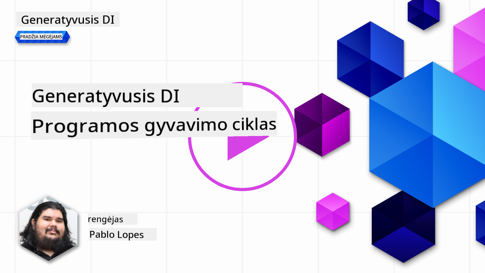
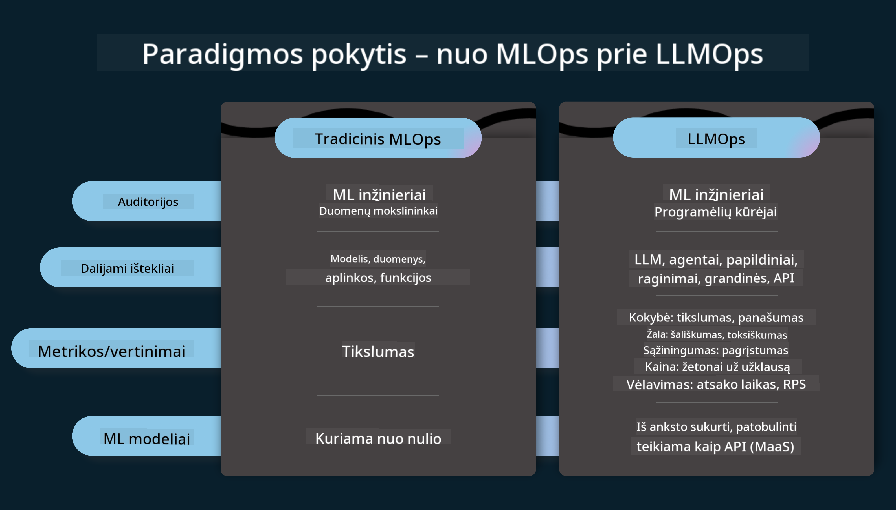
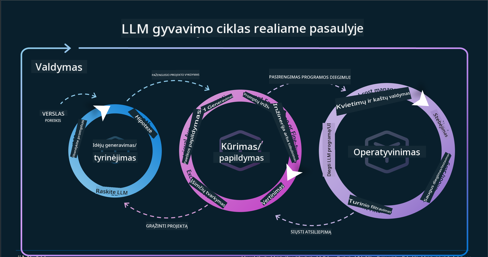
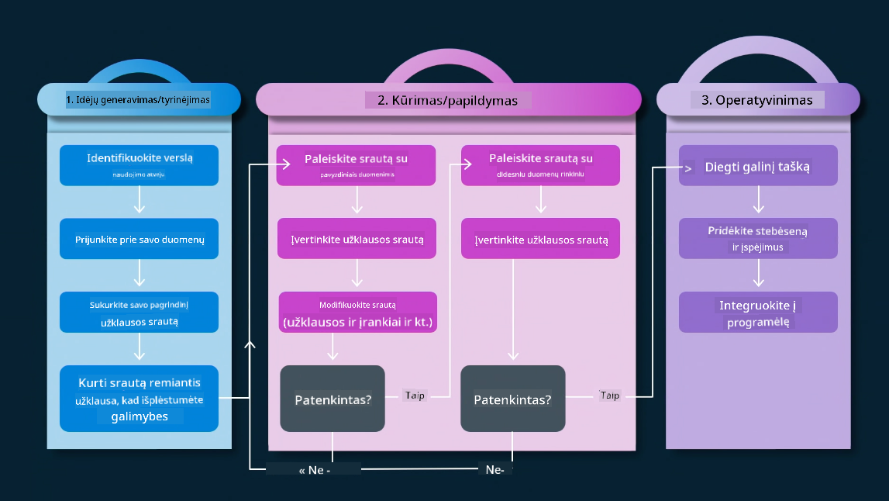
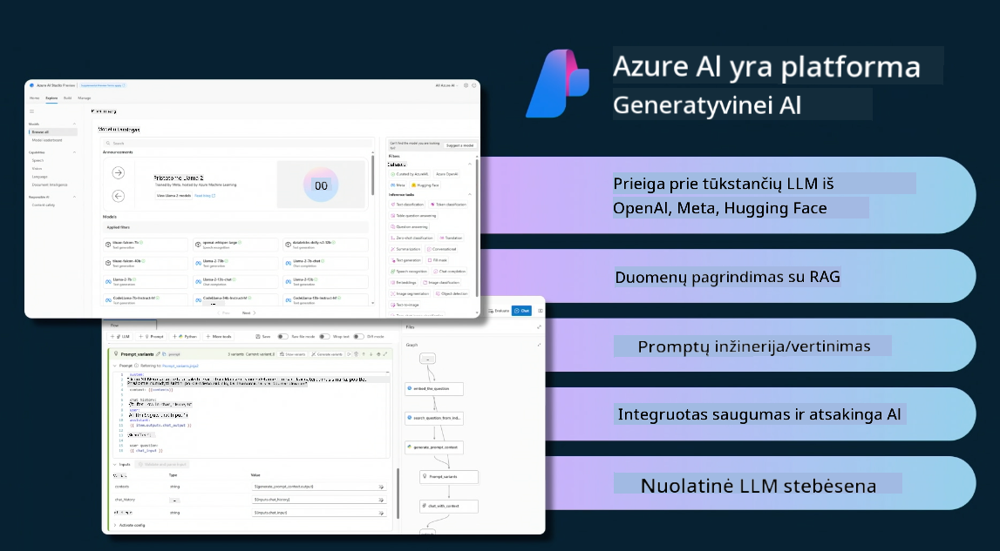
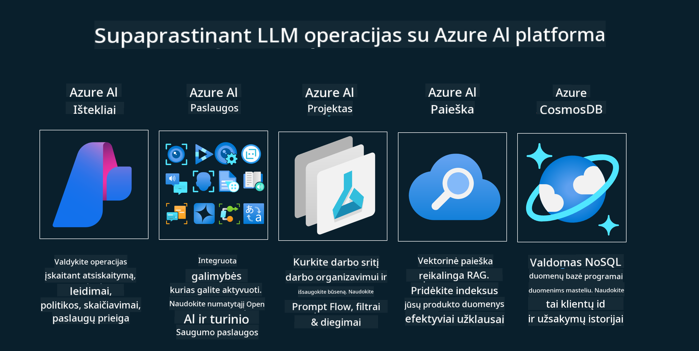
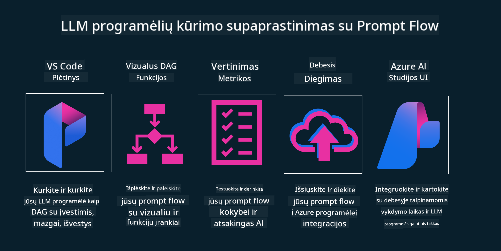

<!--
CO_OP_TRANSLATOR_METADATA:
{
  "original_hash": "27a5347a5022d5ef0a72ab029b03526a",
  "translation_date": "2025-08-25T12:41:07+00:00",
  "source_file": "14-the-generative-ai-application-lifecycle/README.md",
  "language_code": "lt"
}
-->

# Generatyvinės AI programos gyvavimo ciklas

Svarbus klausimas visoms AI programoms – AI funkcijų aktualumas, nes AI sritis sparčiai vystosi. Kad jūsų programa išliktų aktuali, patikima ir tvirta, ją reikia nuolat stebėti, vertinti ir tobulinti. Tam ir skirtas generatyvinės AI gyvavimo ciklas.

Generatyvinės AI gyvavimo ciklas – tai struktūra, padedanti pereiti visus generatyvinės AI programos kūrimo, diegimo ir palaikymo etapus. Ji padeda aiškiai apibrėžti tikslus, matuoti rezultatus, identifikuoti iššūkius ir įgyvendinti sprendimus. Taip pat padeda užtikrinti, kad programa atitiktų etinius ir teisės reikalavimus, taikomus jūsų sričiai ir suinteresuotoms šalims. Vadovaudamiesi generatyvinės AI gyvavimo ciklu, galite užtikrinti, kad jūsų programa nuolat teiktų vertę ir tenkintų vartotojų poreikius.

## Įvadas

Šiame skyriuje:

- Sužinosite apie paradigmos pokytį nuo MLOps prie LLMOps
- Susipažinsite su LLM gyvavimo ciklu
- Aptarsite gyvavimo ciklo įrankius
- Sužinosite apie gyvavimo ciklo metrikas ir vertinimą

## Supraskite paradigmos pokytį nuo MLOps prie LLMOps

LLM – tai naujas dirbtinio intelekto įrankis, itin galingas analizei ir generavimui programose, tačiau ši galia keičia, kaip optimizuojame AI ir klasikinio mašininio mokymosi užduotis.

Todėl reikia naujos paradigmos, kad šį įrankį galėtume pritaikyti dinamiškai ir su tinkamais paskatinimais. Senesnes AI programas galime vadinti „ML programomis“, o naujesnes – „GenAI programomis“ arba tiesiog „AI programomis“, atspindint naudojamas technologijas ir metodus. Tai keičia mūsų požiūrį įvairiais aspektais, pažiūrėkite į šį palyginimą.

Pastebėkite, kad LLMOps labiau orientuota į programų kūrėjus, integracijos tampa svarbia dalimi, naudojami „Modeliai kaip paslauga“, o metrikos apima šiuos aspektus:

- Kokybė: atsakymų kokybė
- Žala: atsakingas AI
- Sąžiningumas: atsakymų pagrįstumas (ar logiška? ar teisinga?)
- Kaina: sprendimo biudžetas
- Vėlavimas: vidutinis laikas iki atsakymo

## LLM gyvavimo ciklas

Norėdami suprasti gyvavimo ciklą ir jo pokyčius, pažiūrėkime į šią infografiką.

Kaip matote, tai skiriasi nuo įprastų MLOps gyvavimo ciklų. LLM turi daug naujų reikalavimų: promptų kūrimas, įvairios kokybės gerinimo technikos (Fine-Tuning, RAG, Meta-Promptai), kitoks vertinimas ir atsakomybė už atsakingą AI, naujos vertinimo metrikos (kokybė, žala, sąžiningumas, kaina ir vėlavimas).

Pavyzdžiui, pažiūrėkite, kaip generuojame idėjas. Naudojame promptų inžineriją, eksperimentuojame su įvairiais LLM, kad išbandytume, ar mūsų hipotezė gali būti teisinga.

Atkreipkite dėmesį, kad tai nėra linijinis procesas, o integruoti, iteratyvūs ciklai.

Kaip galėtume išnagrinėti šiuos žingsnius? Pažvelkime detaliau, kaip galime sukurti gyvavimo ciklą.

Tai gali atrodyti sudėtinga, todėl pirmiausia susitelkime į tris pagrindinius žingsnius.

1. Idėjų generavimas / tyrinėjimas: čia ieškome sprendimų pagal verslo poreikius. Prototipavimas, [PromptFlow](https://microsoft.github.io/promptflow/index.html?WT.mc_id=academic-105485-koreyst) kūrimas ir testavimas, ar tai efektyvu mūsų hipotezei.
1. Kūrimas / tobulinimas: įgyvendinimas, vertiname su didesniais duomenų rinkiniais, taikome technikas, tokias kaip Fine-tuning ir RAG, tikriname sprendimo tvirtumą. Jei neveikia, perdirbame, pridedame naujų žingsnių arba pertvarkome duomenis. Ištestavus srautą ir mastelį, jei veikia ir atitinka metrikas, pereiname prie kito etapo.
1. Operacionalizavimas: integracija, pridedame stebėsenos ir įspėjimų sistemas, diegiame ir integruojame programą.

Be to, yra bendras valdymo ciklas, orientuotas į saugumą, atitiktį ir valdymą.

Sveikiname, jūsų AI programa paruošta ir veikia! Norėdami išbandyti praktiškai, pažiūrėkite [Contoso Chat Demo.](https://nitya.github.io/contoso-chat/?WT.mc_id=academic-105485-koreys)

Kokius įrankius galime naudoti?

## Gyvavimo ciklo įrankiai

Įrankiams Microsoft siūlo [Azure AI Platformą](https://azure.microsoft.com/solutions/ai/?WT.mc_id=academic-105485-koreys) ir [PromptFlow](https://microsoft.github.io/promptflow/index.html?WT.mc_id=academic-105485-koreyst), kurie palengvina gyvavimo ciklo įgyvendinimą.

[Azure AI Platforma](https://azure.microsoft.com/solutions/ai/?WT.mc_id=academic-105485-koreys) leidžia naudoti [AI Studio](https://ai.azure.com/?WT.mc_id=academic-105485-koreys). AI Studio – tai interneto portalas, kuriame galite tyrinėti modelius, pavyzdžius ir įrankius. Valdyti resursus, kurti UI, naudoti SDK/CLI galimybes programuojant.

Azure AI leidžia naudoti įvairius resursus, valdyti operacijas, paslaugas, projektus, vektorinę paiešką ir duomenų bazes.

Kurkite nuo Proof-of-Concept (POC) iki didelio masto programų su PromptFlow:

- Kurkite ir projektuokite programas iš VS Code, naudodami vizualius ir funkcinius įrankius
- Testuokite ir tobulinkite programas, kad AI būtų kokybiškas ir lengvai valdomas
- Naudokite Azure AI Studio integracijai ir iteracijai su debesimi, greitam diegimui

## Puiku! Tęskite mokymąsi!

Puiku, dabar sužinokite daugiau apie tai, kaip struktūruoti programą, kad galėtumėte pritaikyti šias koncepcijas su [Contoso Chat App](https://nitya.github.io/contoso-chat/?WT.mc_id=academic-105485-koreyst), ir pamatykite, kaip Cloud Advocacy demonstruoja šias idėjas. Daugiau turinio rasite mūsų [Ignite breakout sesijoje!
](https://www.youtube.com/watch?v=DdOylyrTOWg)

Dabar pereikite prie 15 pamokos, kad suprastumėte, kaip [Retrieval Augmented Generation ir vektorinės duomenų bazės](../15-rag-and-vector-databases/README.md?WT.mc_id=academic-105485-koreyst) keičia generatyvinį AI ir padeda kurti įtraukiančias programas!

---

**Atsakomybės atsisakymas**:  
Šis dokumentas buvo išverstas naudojant dirbtinio intelekto vertimo paslaugą [Co-op Translator](https://github.com/Azure/co-op-translator). Nors siekiame tikslumo, prašome atkreipti dėmesį, kad automatiniai vertimai gali turėti klaidų ar netikslumų. Originalus dokumentas jo gimtąja kalba turėtų būti laikomas autoritetingu šaltiniu. Kritinei informacijai rekomenduojamas profesionalus žmogaus vertimas. Mes neatsakome už nesusipratimus ar neteisingą interpretaciją, kylančią dėl šio vertimo naudojimo.