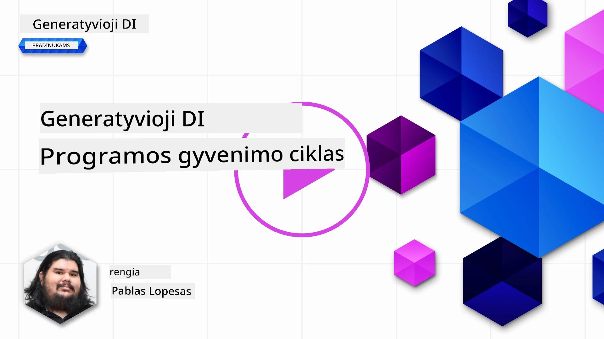
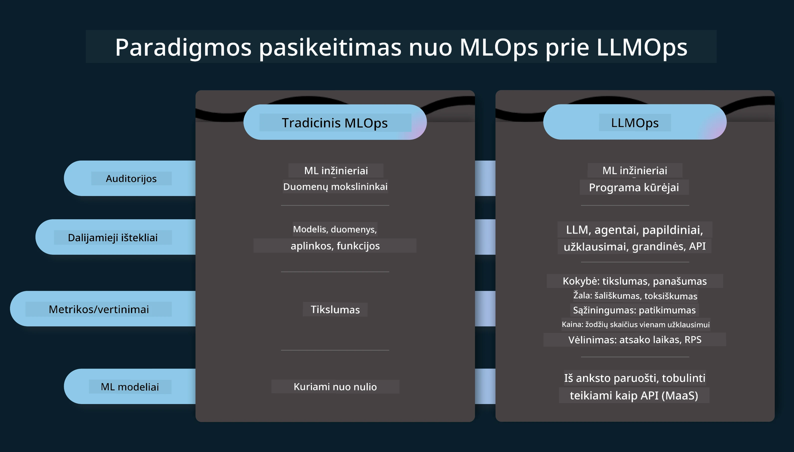
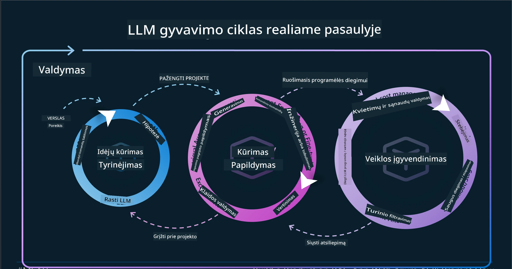
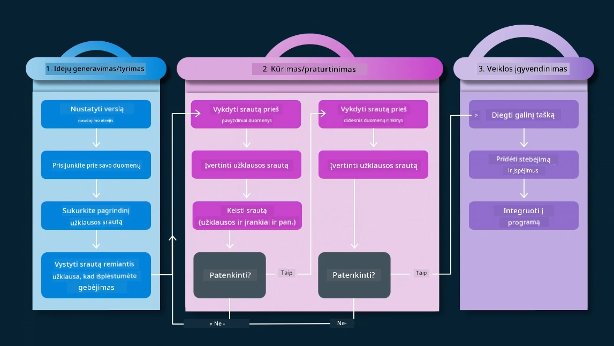
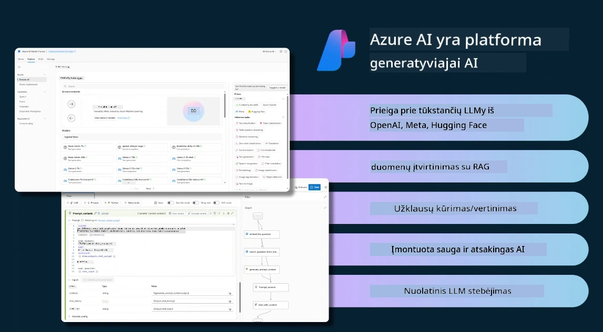
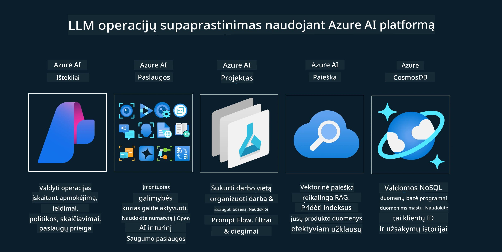
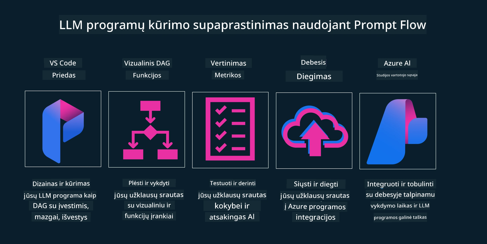

# Generatyvinės DI taikymo ciklas

Svarbus klausimas visoms DI programoms – DI funkcijų aktualumas, kadangi DI yra greitai besivystanti sritis, siekiant užtikrinti, kad jūsų programa išliktų aktuali, patikima ir tvirta, ją reikia nuolat stebėti, vertinti ir tobulinti. Čia ir įsijungia generatyvinio DI ciklas.

Generatyvinio DI ciklas yra sistema, kuri nukreipia jus per generatyvinės DI programos kūrimo, diegimo ir palaikymo etapus. Ji padeda apibrėžti jūsų tikslus, matuoti našumą, identifikuoti iššūkius ir įgyvendinti sprendimus. Taip pat padeda suderinti jūsų programą su etikos ir teisės standartais jūsų srityje bei suinteresuotosiomis šalimis. Sekdami generatyvinio DI ciklą, galite užtikrinti, kad jūsų programa visuomet teiks vertę ir tenkins vartotojus.

## Įvadas

Šiame skyriuje jūs:

- Suprasite paradigmų pasikeitimą nuo MLOps iki LLMOps
- Sužinosite apie LLM ciklą
- Išmoksite apie įrankius ciklui valdyti
- Susipažinsite su ciklo metrika ir vertinimu

## Paradigmos pasikeitimo nuo MLOps iki LLMOps supratimas

LLM yra naujas dirbtinio intelekto arsenalas įrankis, jie yra neįtikėtinai galingi analizės ir generavimo užduotims programose, tačiau ši galia turi pasekmių tam, kaip optimizuojame DI ir tradicinio mašininio mokymosi užduotis.

Dėl to mums reikia naujos paradigmos, kad šį įrankį pritaikytume dinamiškai, su tinkamomis paskatomis. Galime senesnes DI programas vadinti „ML programomis“, o naujesnes – „GenDI programomis“ arba tiesiog „DI programomis“, atspindinčiomis tuo metu naudojamas pagrindines technologijas ir metodus. Tai keičia mūsų naratyvą keliais aspektais, pažvelkite į šį palyginimą.

Pastebėkite, jog LLMOps esame labiau fokusuoti į programų kūrėjus, naudodami integracijas kaip pagrindinį tašką, naudojame „Modelius kaip paslaugą“ ir mąstome šiais pagrindiniais metrikų aspektais.

- Kokybė: atsakymo kokybė
- Žala: atsakingas DI
- Sąžiningumas: atsakymo pagrįstumas (Ar prasminga? Ar teisinga?)
- Kaina: sprendimo biudžetas
- Vėlavimas: vidutinis žodžių atsako laikas

## LLM ciklas

Pirmiausia, norint suprasti ciklą ir pakeitimus, pažvelkime į kitą infografiką.

Kaip matote, tai skiriasi nuo įprastinių MLOps ciklų. LLM turi daug naujų reikalavimų, tokių kaip prašymų konstravimas, įvairios kokybės gerinimo technikos (tikslinis tobulinimas, RAG, meta-prašymai), kitoks atsakingo DI įvertinimas, galiausiai naujos vertinimo metrikos (kokybė, žala, sąžiningumas, kaina ir vėlavimas).

Pavyzdžiui, pažvelkite, kaip mes generuojame idėjas. Naudojant prašymų inžineriją eksperimentuoti su įvairiomis LLM, siekiant ištirti galimybes ir patikrinti, ar jų hipotezė gali būti teisinga.

Atkreipkite dėmesį, jog tai nėra linijinis procesas, o integruoti ciklai, cikliškas ir turintis bendrą ciklą.

Kaip galėtume nagrinėti šiuos etapus? Pažvelkime į detales, kaip sudaryti ciklą.

Tai gali atrodyti šiek tiek komplikuota, pradėkime nuo trijų didelių etapų.

1. Idėjų generavimas/tyrimasis: Tyrinėjimas, čia galime tirti pagal verslo poreikius. Prototipavimas, kuriame kuriame [PromptFlow](https://microsoft.github.io/promptflow/index.html?WT.mc_id=academic-105485-koreyst) ir testuojame, ar jis pakankamai efektyvus mūsų hipotezei.
1. Kūrimas/praplėtimas: Įgyvendinimas, dabar pradedame vertinti didesnius duomenų rinkinius ir taikyti technikas, tokias kaip tikslingas tobulinimas ir RAG, kad patikrintume sprendimo patvarumą. Jei ne, perdaryti, pridėjus naujų žingsnių ar pertvarkius duomenis, gali padėti. Išbandę srautą ir mastą, jei tai veikia ir metrikos teigiamos, jis pasiruošęs kitam žingsniui.
1. Operavimo fazė: Integracija, dabar pridedame stebėjimo ir įspėjimų sistemas, diegiame ir sujungiame su programa.

Tada turime bendrą valdymo ciklą, kuris sutelkia dėmesį į saugumą, atitiktį ir valdymą.

Sveikiname, dabar jūsų DI programa paruošta veikti ir eksploatuoti. Norint praktiškai patirti, pažvelkite į [Contoso pokalbių demonstraciją.](https://nitya.github.io/contoso-chat/?WT.mc_id=academic-105485-koreyst)

O kokius įrankius galime naudoti?

## Ciklo įrankiai

Įrankiams Microsoft siūlo [Azure DI platformą](https://azure.microsoft.com/solutions/ai/?WT.mc_id=academic-105485-koreyst) ir [PromptFlow](https://microsoft.github.io/promptflow/index.html?WT.mc_id=academic-105485-koreyst), kurie palengvina ir leidžia lengvai įgyvendinti savo ciklą.

[Azure DI Platforma](https://azure.microsoft.com/solutions/ai/?WT.mc_id=academic-105485-koreyst) leidžia naudotis [AI Studio](https://ai.azure.com/?WT.mc_id=academic-105485-koreyst). AI Studio yra internetinė portalas, leidžiantis tyrinėti modelius, pavyzdžius ir įrankius. Valdyti išteklius, kūrimo srautus bei SDK/CLI parinktis programavimui pirmiausia kodo kalba.

Azure DI leidžia naudotis įvairiais ištekliais, valdyti operacijas, paslaugas, projektus, vektorinės paieškos ir duomenų bazių poreikius.

Kurkite nuo koncepcijos patvirtinimo (POC) iki didelės apimties programų su PromptFlow:

- Kurkite ir projektuokite programas VS Code aplinkoje, su vizualiniais ir funkciniais įrankiais
- Testuokite ir tikslinkite savo programas, kad gautumėte kokybišką DI, paprastai
- Naudokite Azure AI Studio integracijai ir iteracijoms su debesija, greitam diegimui ir prijungimui

## Puiku! Tęskite mokymąsi!

Nuostabu, dabar sužinokite daugiau apie tai, kaip struktūruojame programą, kad panaudotume koncepcijas su [Contoso pokalbių programa](https://nitya.github.io/contoso-chat/?WT.mc_id=academic-105485-koreyst), patikrinkite, kaip Cloud Advocacy pristato šias koncepcijas demonstracijose. Daugiau turinio rasite mūsų [Ignite pristatyme!
](https://www.youtube.com/watch?v=DdOylyrTOWg)

Dabar pereikite prie 15-os pamokos, kad suprastumėte, kaip [Retrieval Augmented Generation ir vektorinės duomenų bazės](../15-rag-and-vector-databases/README.md?WT.mc_id=academic-105485-koreyst) veikia generatyvinį DI ir kaip kurti dar patrauklesnes programas!

---

<!-- CO-OP TRANSLATOR DISCLAIMER START -->
**Atsakomybės apribojimas**:  
Šis dokumentas buvo išverstas naudojant dirbtinio intelekto vertimo paslaugą [Co-op Translator](https://github.com/Azure/co-op-translator). Nors siekiame tikslumo, atkreipkite dėmesį, kad automatiniai vertimai gali turėti klaidų ar netikslumų. Originalus dokumentas jo gimtąja kalba laikomas autoritetingu šaltiniu. Svarbiai informacijai rekomenduojama naudoti profesionalų žmogaus atliktą vertimą. Mes neatsakome už jokius nesusipratimus ar klaidingus interpretavimus, kylančius dėl šio vertimo naudojimo.
<!-- CO-OP TRANSLATOR DISCLAIMER END -->