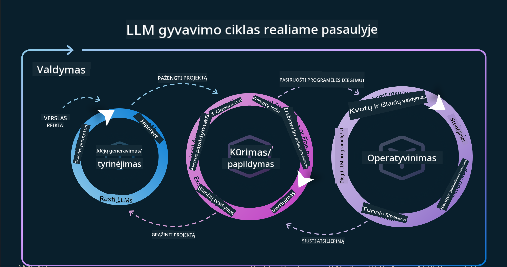

<!--
CO_OP_TRANSLATOR_METADATA:
{
  "original_hash": "df44972d5575ea8cef3c52ee31696d04",
  "translation_date": "2025-12-19T17:53:44+00:00",
  "source_file": "14-the-generative-ai-application-lifecycle/README.md",
  "language_code": "lt"
}
-->

# Generatyviosios DI programos gyvavimo ciklas

Svarbus klausimas visoms DI programoms yra DI funkcijų aktualumas, nes DI yra sparčiai besivystanti sritis, norint užtikrinti, kad jūsų programa išliktų aktuali, patikima ir tvirta, ją reikia nuolat stebėti, vertinti ir tobulinti. Čia į pagalbą ateina generatyviosios DI gyvavimo ciklas.

Generatyviosios DI gyvavimo ciklas yra sistema, kuri jus veda per generatyviosios DI programos kūrimo, diegimo ir palaikymo etapus. Ji padeda apibrėžti jūsų tikslus, matuoti našumą, identifikuoti iššūkius ir įgyvendinti sprendimus. Taip pat padeda suderinti jūsų programą su etiniais ir teisės standartais jūsų srityje ir suinteresuotųjų šalių lūkesčiais. Vadovaudamiesi generatyviosios DI gyvavimo ciklu, galite užtikrinti, kad jūsų programa visada teiktų vertę ir patenkintų vartotojus.

## Įvadas

Šiame skyriuje jūs:

- Suprasite perėjimą nuo MLOps prie LLMOps
- Susipažinsite su LLM gyvavimo ciklu
- Sužinosite apie gyvavimo ciklo įrankius
- Suprasite gyvavimo ciklo metriką ir vertinimą

## Suprasti perėjimą nuo MLOps prie LLMOps

LLM yra naujas įrankis dirbtinio intelekto arsenale, jie yra nepaprastai galingi analizės ir generavimo užduotyse programoms, tačiau ši galia turi tam tikrų pasekmių, kaip mes optimizuojame DI ir klasikinio mašininio mokymosi užduotis.

Dėl to mums reikia naujo paradigma, kad šį įrankį pritaikytume dinamiškai, su tinkamomis paskatomis. Galime senesnes DI programas vadinti „ML programomis“, o naujesnes DI programas – „GenAI programomis“ arba tiesiog „DI programomis“, atspindinčiomis tuo metu naudojamą pagrindinę technologiją ir metodus. Tai keičia mūsų pasakojimą keliais būdais, pažvelkite į šį palyginimą.

Atkreipkite dėmesį, kad LLMOps mes labiau orientuojamės į programų kūrėjus, naudojame integracijas kaip pagrindinį tašką, naudojame „Modelius kaip paslaugą“ ir galvojame apie šiuos metrikų aspektus.

- Kokybė: atsakymo kokybė
- Žala: atsakingas DI
- Sąžiningumas: atsakymo pagrįstumas (Ar tai prasminga? Ar tai teisinga?)
- Kaina: sprendimo biudžetas
- Vėlavimas: vidutinis laikas atsakymui į tokeną

## LLM gyvavimo ciklas

Pirmiausia, norint suprasti gyvavimo ciklą ir jo pakeitimus, pažvelkime į šią infografiką.

Kaip matote, tai skiriasi nuo įprastų MLOps gyvavimo ciklų. LLM turi daug naujų reikalavimų, tokių kaip užklausų kūrimas, įvairios kokybės gerinimo technikos (Fine-Tuning, RAG, Meta-Prompts), skirtingas vertinimas ir atsakomybė su atsakingu DI, galiausiai naujos vertinimo metrikos (kokybė, žala, sąžiningumas, kaina ir vėlavimas).

Pavyzdžiui, pažvelkite, kaip mes generuojame idėjas. Naudojame užklausų inžineriją, kad eksperimentuotume su įvairiais LLM ir ištirtume galimybes patikrinti, ar jų hipotezė gali būti teisinga.

Atkreipkite dėmesį, kad tai nėra linijinis procesas, o integruoti ciklai, iteratyvūs ir su bendru ciklu.

Kaip galėtume išnagrinėti šiuos žingsnius? Pažvelkime detaliau, kaip galėtume sukurti gyvavimo ciklą.

Tai gali atrodyti šiek tiek sudėtinga, pirmiausia sutelkime dėmesį į tris didelius žingsnius.

1. Idėjų generavimas / tyrinėjimas: Tyrinėjimas, čia galime tirti pagal mūsų verslo poreikius. Prototipavimas, kuriame kuriame [PromptFlow](https://microsoft.github.io/promptflow/index.html?WT.mc_id=academic-105485-koreyst) ir tikriname, ar jis pakankamai efektyvus mūsų hipotezei.
1. Kūrimas / papildymas: Įgyvendinimas, dabar pradedame vertinti didesnius duomenų rinkinius, taikyti technikas, tokias kaip Fine-tuning ir RAG, kad patikrintume mūsų sprendimo tvirtumą. Jei ne, pakartotinai įgyvendinti, pridėti naujų žingsnių į mūsų srautą arba pertvarkyti duomenis gali padėti. Išbandę mūsų srautą ir mastelį, jei viskas veikia ir metrikos atitinka, esame pasiruošę kitam žingsniui.
1. Operacionalizavimas: Integracija, dabar pridedame stebėjimo ir įspėjimų sistemas, diegiame ir integruojame programą į mūsų sistemą.

Tada turime bendrą valdymo ciklą, orientuotą į saugumą, atitiktį ir valdymą.

Sveikiname, dabar jūsų DI programa paruošta veikti ir yra operatyvi. Norėdami praktiškai išbandyti, pažvelkite į [Contoso Chat demonstraciją.](https://nitya.github.io/contoso-chat/?WT.mc_id=academic-105485-koreys)

O kokius įrankius galime naudoti?

## Gyvavimo ciklo įrankiai

Įrankiams Microsoft siūlo [Azure AI platformą](https://azure.microsoft.com/solutions/ai/?WT.mc_id=academic-105485-koreys) ir [PromptFlow](https://microsoft.github.io/promptflow/index.html?WT.mc_id=academic-105485-koreyst), kurie palengvina ir leidžia lengvai įgyvendinti jūsų ciklą.

[Azure AI platforma](https://azure.microsoft.com/solutions/ai/?WT.mc_id=academic-105485-koreys) leidžia naudoti [AI Studio](https://ai.azure.com/?WT.mc_id=academic-105485-koreys). AI Studio yra internetinis portalas, leidžiantis tyrinėti modelius, pavyzdžius ir įrankius. Valdyti savo išteklius, kurti vartotojo sąsajos srautus ir naudoti SDK/CLI parinktis kodui kurti.

Azure AI leidžia naudoti daugybę išteklių, valdyti savo operacijas, paslaugas, projektus, vektorinę paiešką ir duomenų bazes.

Kurkite nuo Proof-of-Concept (POC) iki didelio masto programų su PromptFlow:

- Kurkite ir projektuokite programas iš VS Code, naudodami vizualius ir funkcinius įrankius
- Testuokite ir tobulinkite savo programas, kad pasiektumėte kokybišką DI, lengvai.
- Naudokite Azure AI Studio integracijai ir iteracijai su debesija, greitam diegimui ir integracijai.

## Puiku! Tęskite mokymąsi!

Nuostabu, dabar sužinokite daugiau apie tai, kaip struktūruojame programą, kad naudotumėte šias sąvokas su [Contoso Chat programa](https://nitya.github.io/contoso-chat/?WT.mc_id=academic-105485-koreyst), kad pamatytumėte, kaip Cloud Advocacy pritaiko šias sąvokas demonstracijose. Daugiau turinio rasite mūsų [Ignite pranešime!](https://www.youtube.com/watch?v=DdOylyrTOWg)

Dabar peržiūrėkite 15 pamoką, kad suprastumėte, kaip [Retrieval Augmented Generation ir vektorinės duomenų bazės](../15-rag-and-vector-databases/README.md?WT.mc_id=academic-105485-koreyst) veikia generatyviąją DI ir kaip kurti patrauklesnes programas!

---

<!-- CO-OP TRANSLATOR DISCLAIMER START -->
**Atsakomybės apribojimas**:
Šis dokumentas buvo išverstas naudojant dirbtinio intelekto vertimo paslaugą [Co-op Translator](https://github.com/Azure/co-op-translator). Nors siekiame tikslumo, prašome atkreipti dėmesį, kad automatiniai vertimai gali turėti klaidų ar netikslumų. Originalus dokumentas gimtąja kalba turėtų būti laikomas autoritetingu šaltiniu. Svarbiai informacijai rekomenduojamas profesionalus žmogaus vertimas. Mes neatsakome už bet kokius nesusipratimus ar neteisingus aiškinimus, kilusius dėl šio vertimo naudojimo.
<!-- CO-OP TRANSLATOR DISCLAIMER END -->