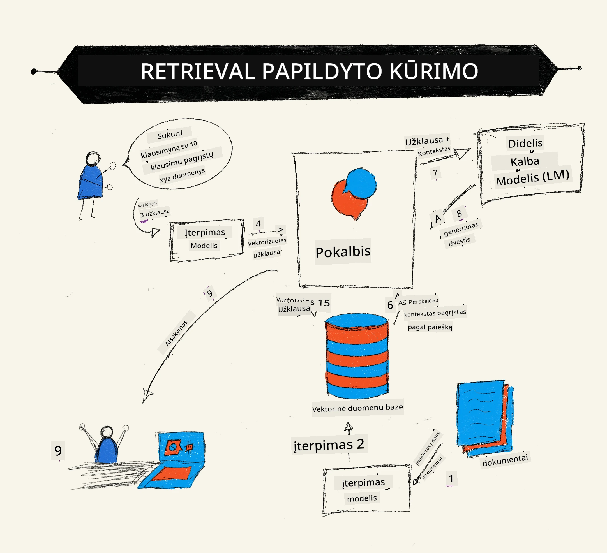
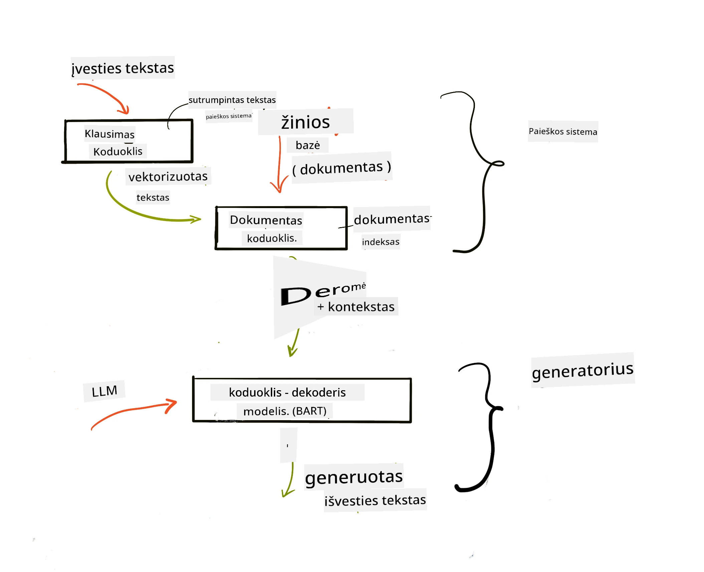
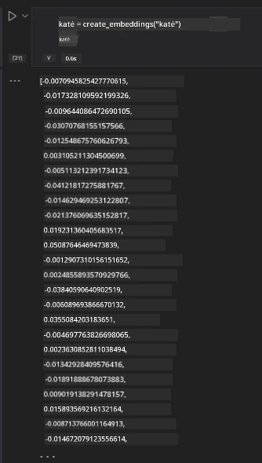

# Paieškos plėtinio generavimas (RAG) ir vektorinės duomenų bazės

[](https://youtu.be/4l8zhHUBeyI?si=BmvDmL1fnHtgQYkL)

Paieškos taikomųjų programų pamokoje trumpai sužinojome, kaip integruoti savo duomenis į didelius kalbos modelius (LLM). Šioje pamokoje gilinsimės į jūsų duomenų pagrindimą jūsų LLM programoje, proceso mechaniką ir duomenų saugojimo metodus, įskaitant tiek vektorius, tiek tekstą.

> **Vaizdo įrašas netrukus**

## Įvadas

Šioje pamokoje aptarsime:

- Įvadą į RAG, kas tai yra ir kodėl jis naudojamas dirbtiniame intelekte (AI).

- Supratimą, kas yra vektorinės duomenų bazės, ir vienos jų sukūrimą mūsų programai.

- Praktinį pavyzdį, kaip integruoti RAG į programą.

## Mokymosi tikslai

Baigus šią pamoką, galėsite:

- Paaiškinti RAG reikšmę duomenų gavimui ir apdorojimui.

- Nustatyti RAG programą ir pagrįsti savo duomenis LLM.

- Efektyviai integruoti RAG ir vektorines duomenų bazes LLM programose.

## Mūsų scenarijus: LLM patobulinimas su mūsų pačių duomenimis

Šiai pamokai norime pridėti savo užrašus į švietimo startuolį, kuris leidžia pokalbių robotui gauti daugiau informacijos apie įvairias temas. Naudodamiesi turimais užrašais, mokiniai galės geriau mokytis ir suprasti skirtingas temas, palengvindami pasiruošimą egzaminams. Scenarijui kurti naudosime:

- `Azure OpenAI:` LLM, kurį naudosime pokalbių robotui kurti

- `AI pradedantiesiems: neuroninių tinklų pamoka`: tai bus duomenys, ant kurių pagrįsime mūsų LLM

- `Azure AI Search` ir `Azure Cosmos DB:` vektorinių duomenų bazė mūsų duomenims saugoti ir paieškos indeksui kurti

Vartotojai galės kurti praktinius klausimynus iš savo užrašų, pakartojimo korteles ir apibendrinti juos glaustais aprašymais. Pradėkime nuo to, kas yra RAG ir kaip jis veikia:

## Paieškos plėtinio generavimas (RAG)

LLM pagrįstas pokalbių robotas apdoroja vartotojo užklausas, kad sukurtų atsakymus. Jis sukurtas būti interaktyvus ir bendrauti su vartotojais įvairiomis temomis. Tačiau jo atsakymai yra ribojami pateiktos konteksto ir pagrindinių mokymo duomenų. Pavyzdžiui, GPT-4 žinių ribojimas yra 2021 m. rugsėjis, reiškiantis, kad jis neturi žinių apie įvykius po šio laikotarpio. Be to, LLM mokymams naudojami duomenys neapima konfidencialios informacijos, kaip asmeniniai užrašai ar įmonės produktų vadovai.

### Kaip veikia RAG (paieškos plėtinio generavimas)



Tarkime, norite įdiegti pokalbių robotą, kuris kuria klausimynus iš jūsų užrašų, jums reikės jungties prie žinių bazės. Štai kur RAG padeda. RAG veikia taip:

- **Žinių bazė:** Prieš ieškant, šie dokumentai turi būti įkelti ir išankstinai apdoroti, dažniausiai suskaidant didelius dokumentus į mažesnius segmentus, transformuojant juos į tekstinius įterpimus ir saugant duomenų bazėje.

- **Vartotojo užklausa:** vartotojas užduoda klausimą

- **Paieška:** Kai vartotojas užduoda klausimą, įterpimo modelis suranda susijusią informaciją mūsų žinių bazėje, kad pateiktų daugiau konteksto, kuris bus įtrauktas į užklausą.

- **Plėstinis generavimas:** LLM pagerina savo atsakymą remdamasis gautais duomenimis. Tai leidžia atsakymui būti pagrįstam ne tik iš anksto apmokytais duomenimis, bet ir papildoma informacija iš pridėto konteksto. Gauti duomenys naudojami LLM atsakymams papildyti. LLM tada pateikia atsakymą vartotojo klausimui.



RAG architektūra įgyvendinama naudojant transformerius, sudarytus iš dviejų dalių: kodavimo ir dekodavimo. Pavyzdžiui, kai vartotojas užduoda klausimą, įvestas tekstas yra „užkoduojamas“ į vektorius, kurie fiksuoja žodžių reikšmę, o vektoriai yra „iškoduojami“ į mūsų dokumentų indeksą ir generuoja naują tekstą, remiantis vartotojo užklausa. LLM naudoja abu – kodavimo-dekodavimo modelį, kad sugeneruotų rezultatą.

Yra du RAG įgyvendinimo metodai pagal siūlomą straipsnį: [Retrieval-Augmented Generation for Knowledge intensive NLP (natural language processing software) Tasks](https://arxiv.org/pdf/2005.11401.pdf?WT.mc_id=academic-105485-koreyst):

- **_RAG-Sequence_** naudoja surinktus dokumentus, kad prognozuotų geriausią atsakymą vartotojo užklausai

- **RAG-Token** generuoja kitą žodžio vienetą, naudodama dokumentus, tada juos surenka, kad atsakytų į vartotojo klausimą

### Kodėl verta naudoti RAG? 

- **Informacijos turtingumas:** užtikrina, kad tekstiniai atsakymai būtų atnaujinti ir aktualūs. Todėl pagerina našumą srityse, reikalaujančiose specifinių žinių, pasiekiant vidinę žinių bazę.

- Mažina klaidingą informaciją naudodamas **patikimus duomenis** žinių bazėje, kad pateiktų kontekstą vartotojų užklausoms.

- Tai **ekonomiška**, nes yra pigesnė alternatyva nei LLM perkvalifikavimas (fine-tuning)

## Žinių bazės kūrimas

Mūsų programa remiasi mūsų asmeniniais duomenimis, t.y. neuroninių tinklų pamoka AI pradedantiesiems mokyme.

### Vektorinės duomenų bazės

Vektorinė duomenų bazė, skirtingai nei tradicinės duomenų bazės, yra specializuota duomenų bazė, sukurta saugoti, valdyti ir ieškoti įterptus vektorius. Joje saugomos dokumentų skaitmeninės reprezentacijos. Duomenų skaidymas į skaitmeninius įterpimus leidžia mūsų DI sistemai lengviau suprasti ir apdoroti duomenis.

Mes saugome savo įterpimus vektorinėse duomenų bazėse, nes LLM turi apribojimą, kiek žodžių (token’ų) gali priimti kaip įvestį. Kadangi negalite perduoti visų įterpimų vienu metu LLM, turėsime juos suskaidyti į segmentus ir kai vartotojas užduoda klausimą, grąžinami segmentai, kurie geriausiai atitinka užklausą kartu su užklausa. Segmentavimas taip pat mažina sąnaudas dėl perduodamų žodžių skaičiaus LLM.

Populiarios vektorinės duomenų bazės yra Azure Cosmos DB, Clarifyai, Pinecone, Chromadb, ScaNN, Qdrant ir DeepLake. Galite sukurti Azure Cosmos DB modelį naudodami Azure CLI šia komanda:

```bash
az login
az group create -n <resource-group-name> -l <location>
az cosmosdb create -n <cosmos-db-name> -r <resource-group-name>
az cosmosdb list-keys -n <cosmos-db-name> -g <resource-group-name>
```

### Iš teksto į įterpimus

Prieš saugodami duomenis, turime juos konvertuoti į vektorių įterpimus prieš saugojant duomenų bazėje. Dirbdami su dideliais dokumentais ar ilgu tekstu, galite juos suskaidyti pagal numatomas užklausas. Skirstyti galima pagal sakinius arba pastraipas. Kadangi segmentavimas gilinasi į žodžių aplinką, galite pridėti papildomą kontekstą, pvz., dokumento pavadinimą arba prieš ar po segmento esantį tekstą. Duomenis galite suskaidyti taip:

```python
def split_text(text, max_length, min_length):
    words = text.split()
    chunks = []
    current_chunk = []

    for word in words:
        current_chunk.append(word)
        if len(' '.join(current_chunk)) < max_length and len(' '.join(current_chunk)) > min_length:
            chunks.append(' '.join(current_chunk))
            current_chunk = []

    # Jei paskutinė dalis nepasiekė minimalaus ilgio, vis tiek ją pridėkite
    if current_chunk:
        chunks.append(' '.join(current_chunk))

    return chunks
```

Suskaidžius, galime naudoti įvairius įterpimo modelius tekstui įterpti. Kai kurie modeliai yra: word2vec, ada-002 iš OpenAI, Azure Computer Vision ir daugelis kitų. Modelio pasirinkimas priklauso nuo kalbų, kurias naudojate, koduojamo turinio tipo (tekstai/vaizdai/garsas), įvesties dydžio ir įterpimo išvesties ilgio.

Pavyzdys, kaip atrodo tekstas su OpenAI `text-embedding-ada-002` modeliu:


## Paieška ir vektorinė paieška

Kai vartotojas užduoda klausimą, paieškos modulis paverčia jį vektoriumi naudodamas užklausų kodavimo modelį, tada ieško dokumentų paieškos indekse vektorių, susijusių su įvestimi. Pabaigoje abi įvesties ir dokumentų vektorius konvertuoja į tekstą ir perduoda į LLM.

### Paieška

Paieška vyksta, kai sistema bando greitai rasti dokumentus indekse, kurie atitinka paieškos kriterijus. Paieškos modulio tikslas yra gauti dokumentus, kurie bus naudojami kontekstui pateikti ir pagrįsti LLM jūsų duomenimis.

Duomenų bazėje paiešką atlikti galima įvairiais būdais, pavyzdžiui:

- **Raktinių žodžių paieška** - skirta tekstinėms paieškoms

- **Vektorinė paieška** - konvertuoja dokumentus iš teksto į vektorius naudodama įterpimo modelius, leidžiančius atlikti **semantinę paiešką** pagal žodžių prasmę. Paieška vykdoma ieškant dokumentų, kurių vektorinės reprezentacijos yra arčiausiai vartotojo užklausos.

- **Hibridinis** - derinys tarp raktinių žodžių ir vektorinių paieškų.

Problema, kylanti su paieška, yra tada, kai duomenų bazėje nėra panašaus atsakymo į užklausą, sistema grąžins geriausią turimą informaciją, tačiau galite naudoti taktiką, pavyzdžiui, nustatyti maksimalų aktualumo atstumą arba naudoti hibridinę paiešką, kuri jungia raktinius žodžius ir vektorinę paiešką. Šioje pamokoje naudosime hibridinę paiešką, derinį tarp vektorinės ir raktinių žodžių paieškos. Duomenis saugosime duomenų lentelėje su stulpeliais, kuriuose bus segmentai ir įterpimai.

### Vektorinė panašumas

Paieškos modulis ieškos žinių bazėje įterpimų, kurie yra arti vienas kito, artimiausių kaimynų principu, nes jie yra panašūs tekstai. Kai vartotojas užduoda užklausą, ji pirmiausia paverčiama įterpimu, tada lyginama su panašiais įterpimais. Dažniausiai naudojamas panašumo matas yra kosinusinė panašumo reikšmė, kuri remiasi kampu tarp dviejų vektorių.

Panašumui matuoti galima naudoti kitas alternatyvas, pvz., Euklido atstumą, kuris yra trumpiausia linija tarp vektorių galinių taškų, arba skaliarinę sandaugą, kuri matuoja atitinkamų dviejų vektorių elementų sandaugų sumą.

### Paieškos indeksas

Atlikdami paiešką, turime sukurti paieškos indeksą mūsų žinių bazei prieš pradėdami paiešką. Indeksas saugos mūsų įterpimus ir gali greitai rasti artimiausius segmentus net didelėje duomenų bazėje. Indeksą galime sukurti lokaliai naudojant:

```python
from sklearn.neighbors import NearestNeighbors

embeddings = flattened_df['embeddings'].to_list()

# Sukurkite paieškos indeksą
nbrs = NearestNeighbors(n_neighbors=5, algorithm='ball_tree').fit(embeddings)

# Norėdami klausti indekso, galite naudoti metodą kneighbors
distances, indices = nbrs.kneighbors(embeddings)
```

### Pakartotinis rūšiavimas

Pateikus užklausą į duomenų bazę, galbūt reikės išrūšiuoti rezultatus pagal aktualumą. Pakartotinį rūšiavimą atlieka LLM, kuris naudoja mašininį mokymąsi, kad pagerintų paieškos rezultatų aktualumą, rūšiuodamas juos nuo svarbiausių. Naudojant Azure AI Search, pakartotinis rūšiavimas atliekamas automatiškai naudojant semantinį perrūšiavimą. Pavyzdys, kaip veikia perrūšiavimas, naudojant artimiausius kaimynus:

```python
# Raskite labiausiai panašius dokumentus
distances, indices = nbrs.kneighbors([query_vector])

index = []
# Išspausdinkite labiausiai panašius dokumentus
for i in range(3):
    index = indices[0][i]
    for index in indices[0]:
        print(flattened_df['chunks'].iloc[index])
        print(flattened_df['path'].iloc[index])
        print(flattened_df['distances'].iloc[index])
    else:
        print(f"Index {index} not found in DataFrame")
```

## Viskas kartu

Paskutinis žingsnis – įtraukti mūsų LLM, kad galėtume gauti atsakymus, pagrįstus mūsų duomenimis. Galime įgyvendinti taip:

```python
user_input = "what is a perceptron?"

def chatbot(user_input):
    # Paversti klausimą į užklausos vektorių
    query_vector = create_embeddings(user_input)

    # Rasti labiausiai panašius dokumentus
    distances, indices = nbrs.kneighbors([query_vector])

    # pridėti dokumentus prie užklausos, kad suteiktų kontekstą
    history = []
    for index in indices[0]:
        history.append(flattened_df['chunks'].iloc[index])

    # sujungti istoriją ir vartotojo įvestį
    history.append(user_input)

    # sukurti žinutės objektą
    messages=[
        {"role": "system", "content": "You are an AI assistant that helps with AI questions."},
        {"role": "user", "content": "\n\n".join(history) }
    ]

    # naudoti pokalbio užbaigimą atsakymui generuoti
    response = openai.chat.completions.create(
        model="gpt-4",
        temperature=0.7,
        max_tokens=800,
        messages=messages
    )

    return response.choices[0].message

chatbot(user_input)
```

## Programos vertinimas

### Vertinimo metrika

- Atsakymų kokybė: užtikrinant, kad jie skambėtų natūraliai, sklandžiai ir žmogiškai

- Duomenų pagrindimas: vertinant, ar atsakymas pateiktas remiantis papildytais dokumentais

- Aktualumas: vertinant, ar atsakymas atitinka ir susijęs su užduotu klausimu

- Sklandumas – ar atsakymas yra prasmingas gramatiniu požiūriu

## RAG (paieškos plėtinio generavimas) ir vektorinių duomenų bazių naudojimo scenarijai

Yra daugybė įvairių atvejų, kur funkcijų iškvietimai gali pagerinti jūsų programą, pavyzdžiui:

- Klausimų ir atsakymų sistema: pagrindžiant jūsų įmonės duomenis pokalbių robotui, kurį darbuotojai gali naudoti klausimams užduoti.

- Rekomendacijų sistemos: kur galima sukurti sistemą, kuri parenka panašiausias reikšmes, pvz., filmus, restoranus ir kt.

- Pokalbių robotų paslaugos: galite saugoti pokalbių istoriją ir pritaikyti pokalbį pagal vartotojo duomenis.

- Vaizdų paieška, pagrįsta vektoriniais įterpimais, naudinga atliekant vaizdų atpažinimą ir anomalijų aptikimą.

## Santrauka

Mes apžvelgėme pagrindines RAG sritis nuo mūsų duomenų pridėjimo į programą, vartotojo užklausos iki atsakymo. Norėdami palengvinti RAG kūrimą, galite naudoti tokias sistemas kaip Semantic Kernel, Langchain ar Autogen.

## Užduotis

Norėdami toliau gilinti žinias apie paieškos plėtinio generavimą (RAG), sukurkite:

- Programos sąsajos priekinę dalį naudodami jums patinkančią sistemą

- Naudokite sistemą, pvz., LangChain arba Semantic Kernel, ir atkurkite savo programą

Sveikiname baigus pamoką 👏.

## Mokymasis čia nesibaigia, tęskite kelionę

Baigę šią pamoką, peržiūrėkite mūsų [Generatyviojo DI mokymosi kolekciją](https://aka.ms/genai-collection?WT.mc_id=academic-105485-koreyst), kad toliau keltumėte savo generatyviojo DI žinias!

---

<!-- CO-OP TRANSLATOR DISCLAIMER START -->
**Atsakomybės apribojimas**:
Šis dokumentas buvo išverstas naudojant dirbtinio intelekto vertimo paslaugą [Co-op Translator](https://github.com/Azure/co-op-translator). Nors stengiamės užtikrinti tikslumą, prašome atkreipti dėmesį, kad automatiniai vertimai gali turėti klaidų ar netikslumų. Originalus dokumentas jo gimtąja kalba turėtų būti laikomas autoritetingu šaltiniu. Svarbiai informacijai rekomenduojamas profesionalus žmogaus vertimas. Mes neatsakome už bet kokius nesusipratimus ar klaidingus vertimus, kilusius naudojant šį vertimą.
<!-- CO-OP TRANSLATOR DISCLAIMER END -->