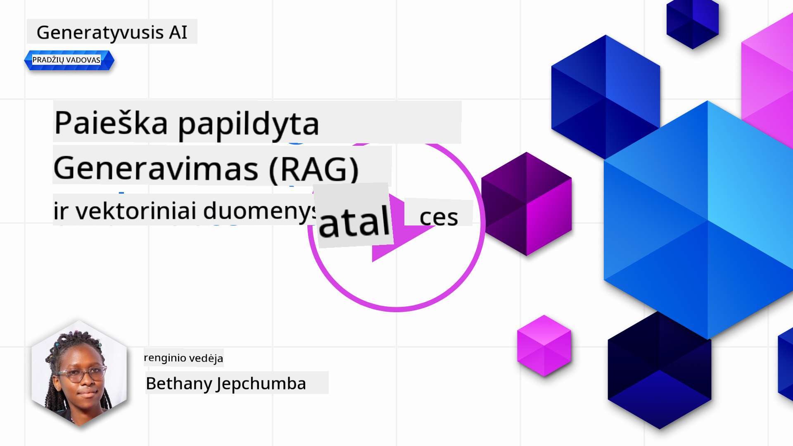
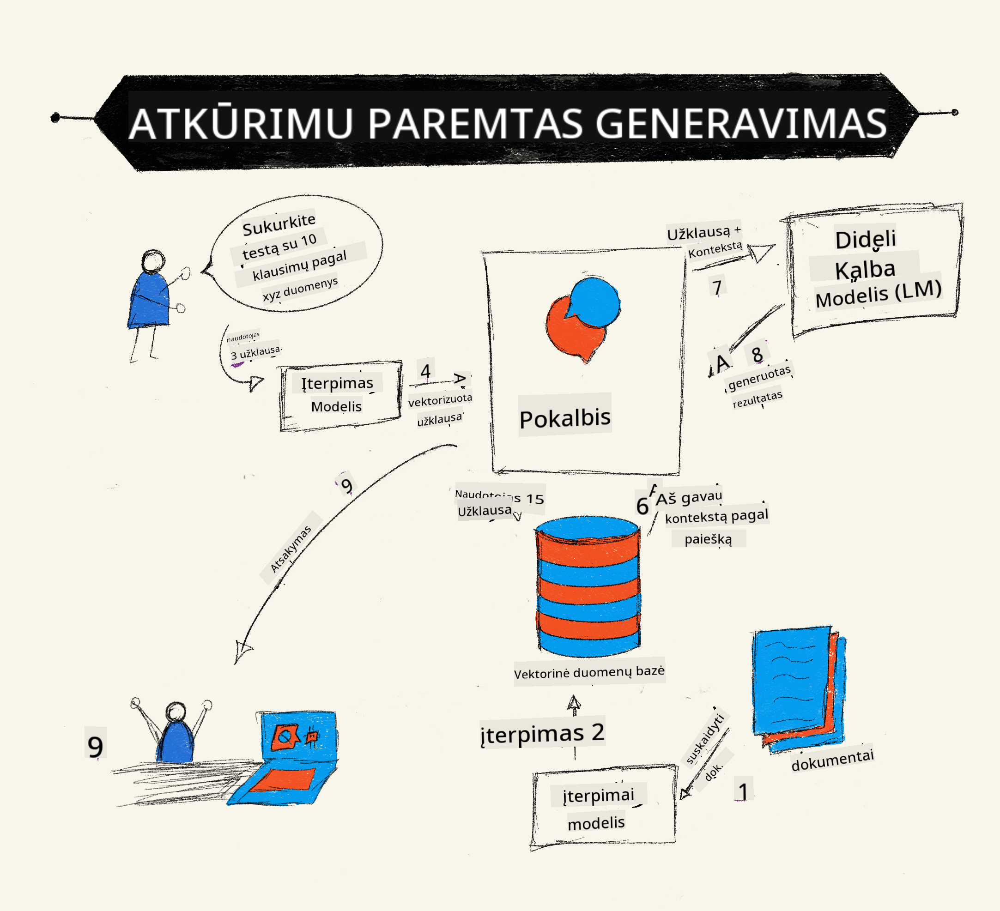
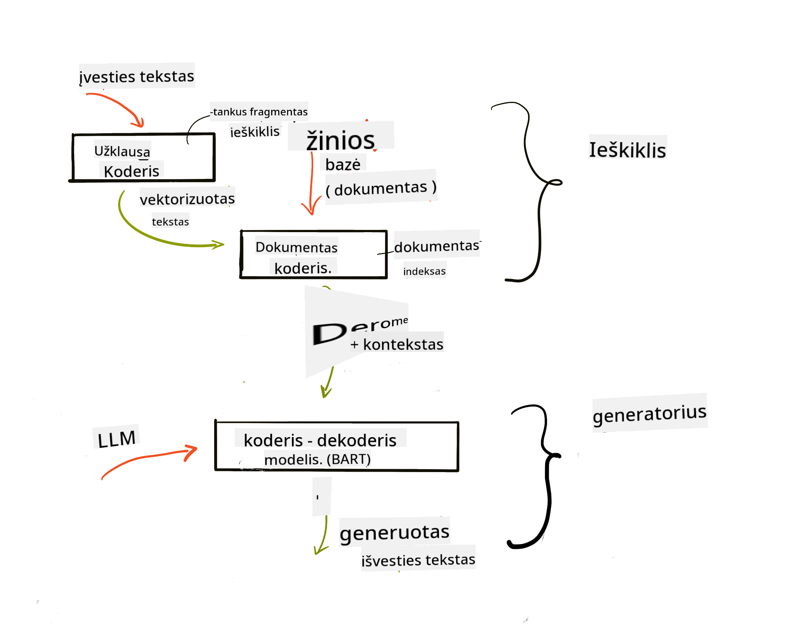
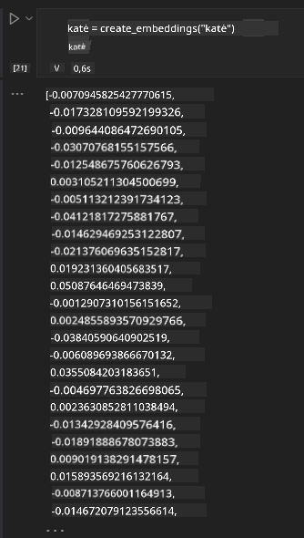

<!--
CO_OP_TRANSLATOR_METADATA:
{
  "original_hash": "e2861bbca91c0567ef32bc77fe054f9e",
  "translation_date": "2025-08-25T12:41:28+00:00",
  "source_file": "15-rag-and-vector-databases/README.md",
  "language_code": "lt"
}
-->
# Duomenų paieška su generavimu (RAG) ir vektorinės duomenų bazės

[](https://aka.ms/gen-ai-lesson15-gh?WT.mc_id=academic-105485-koreyst)

Pamokoje apie paieškos programas trumpai susipažinome, kaip integruoti savo duomenis į didelius kalbos modelius (LLM). Šioje pamokoje gilinsimės į duomenų pagrindimą LLM programoje, proceso mechaniką ir duomenų saugojimo būdus, įskaitant tiek embeddingus, tiek tekstą.

> **Vaizdo įrašas netrukus**

## Įvadas

Šioje pamokoje aptarsime:

- Įvadas į RAG: kas tai yra ir kodėl naudojama dirbtiniame intelekte.

- Supratimas, kas yra vektorinės duomenų bazės ir kaip sukurti vieną savo programai.

- Praktinis pavyzdys, kaip integruoti RAG į programą.

## Mokymosi tikslai

Baigę šią pamoką, galėsite:

- Paaiškinti, kodėl RAG svarbus duomenų paieškai ir apdorojimui.

- Paruošti RAG programą ir pagrįsti savo duomenis LLM modeliui

- Efektyviai integruoti RAG ir vektorines duomenų bazes į LLM programas.

## Mūsų scenarijus: kaip praturtinti LLM savo duomenimis

Šioje pamokoje norime pridėti savo užrašus į edukacinį startuolį, kad pokalbių robotas galėtų gauti daugiau informacijos apie įvairias temas. Naudodami turimus užrašus, mokiniai galės geriau mokytis ir suprasti skirtingas temas, o pasiruošimas egzaminams taps lengvesnis. Scenarijui naudosime:

- `Azure OpenAI:` LLM, kurį naudosime pokalbių robotui sukurti

- `AI for beginners' pamoka apie neuroninius tinklus`: duomenys, kuriais pagrįsime LLM

- `Azure AI Search` ir `Azure Cosmos DB:` vektorinė duomenų bazė, kurioje saugosime duomenis ir kursime paieškos indeksą

Vartotojai galės kurti praktinius testus iš savo užrašų, kartojimo korteles ir gauti trumpas santraukas. Pradėkime nuo to, kas yra RAG ir kaip jis veikia:

## Duomenų paieška su generavimu (RAG)

LLM pagrįstas pokalbių robotas apdoroja vartotojo užklausas ir generuoja atsakymus. Jis sukurtas interaktyviai bendrauti įvairiomis temomis. Tačiau jo atsakymai apsiriboja turima konteksto informacija ir pradiniu mokymo duomenų rinkiniu. Pavyzdžiui, GPT-4 žinių riba yra 2021 m. rugsėjis, todėl jis nežino apie vėliau įvykusius įvykius. Be to, LLM mokymo duomenyse nėra konfidencialios informacijos, pvz., asmeninių užrašų ar įmonės produktų vadovo.

### Kaip veikia RAG (Duomenų paieška su generavimu)



Tarkime, norite sukurti pokalbių robotą, kuris sudaro testus iš jūsų užrašų – tam reikės ryšio su žinių baze. Čia ir praverčia RAG. RAG veikia taip:

- **Žinių bazė:** Prieš paiešką dokumentai turi būti įkelti ir apdoroti – paprastai dideli dokumentai suskaidomi į mažesnes dalis, paverčiami tekstiniais embeddingais ir saugomi duomenų bazėje.

- **Vartotojo užklausa:** vartotojas užduoda klausimą

- **Paieška:** Kai vartotojas užduoda klausimą, embeddingų modelis suranda aktualią informaciją žinių bazėje, kad pateiktų daugiau konteksto, kuris bus įtrauktas į užklausą.

- **Papildytas generavimas:** LLM pagerina atsakymą remdamasis surinktais duomenimis. Tai leidžia generuoti atsakymus ne tik pagal iš anksto išmoktas žinias, bet ir pagal aktualią informaciją iš papildyto konteksto. Surinkti duomenys naudojami LLM atsakymams papildyti. LLM grąžina atsakymą į vartotojo klausimą.



RAG architektūra įgyvendinama naudojant transformerius, sudarytus iš dviejų dalių: enkoderio ir dekoderio. Pavyzdžiui, kai vartotojas užduoda klausimą, įvestas tekstas „užkoduojamas“ į vektorius, kurie atspindi žodžių prasmę, o vektoriai „atkoduojami“ į dokumentų indeksą ir generuoja naują tekstą pagal užklausą. LLM naudoja tiek enkoderį, tiek dekoderį rezultatui generuoti.

Pagal siūlomą straipsnį: [Retrieval-Augmented Generation for Knowledge intensive NLP Tasks](https://arxiv.org/pdf/2005.11401.pdf?WT.mc_id=academic-105485-koreyst) yra du RAG įgyvendinimo būdai:

- **_RAG-Sequence_** – naudojami surinkti dokumentai, kad būtų nuspėtas geriausias atsakymas į vartotojo užklausą

- **RAG-Token** – naudojami dokumentai generuoti kitam tokenui, tada jie surenkami atsakymui į vartotojo klausimą

### Kodėl verta naudoti RAG?

- **Informacijos gausa:** užtikrina, kad tekstiniai atsakymai būtų aktualūs ir nauji. Tai pagerina našumą specifinėse srityse, nes pasiekiama vidinė žinių bazė.

- Sumažina išgalvotų atsakymų skaičių, nes naudoja **patikimus duomenis** žinių bazėje, kad pateiktų kontekstą vartotojo užklausoms.

- **Ekonomiškas** – pigesnis nei LLM modelio papildomas mokymas

## Žinių bazės kūrimas

Mūsų programa remiasi asmeniniais duomenimis, t. y. pamoka apie neuroninius tinklus iš AI For Beginners kurso.

### Vektorinės duomenų bazės

Vektorinė duomenų bazė, skirtingai nei tradicinės, yra specializuota duomenų bazė, skirta saugoti, valdyti ir ieškoti embeddingų vektorių. Ji saugo dokumentų skaitmeninius atvaizdus. Duomenų pavertimas skaitmeniniais embeddingais leidžia AI sistemai lengviau suprasti ir apdoroti informaciją.

Embeddingus saugome vektorinėse duomenų bazėse, nes LLM modeliai turi ribotą priimamų tokenų skaičių. Kadangi negalima perduoti visų embeddingų LLM modeliui, reikia juos suskaidyti į dalis, o kai vartotojas užduoda klausimą, embeddingai, labiausiai panašūs į klausimą, grąžinami kartu su užklausa. Suskaidymas taip pat sumažina išlaidas, nes sumažėja perduodamų tokenų kiekis.

Populiarios vektorinės duomenų bazės: Azure Cosmos DB, Clarifyai, Pinecone, Chromadb, ScaNN, Qdrant ir DeepLake. Azure Cosmos DB modelį galite sukurti naudodami Azure CLI su šia komanda:

```bash
az login
az group create -n <resource-group-name> -l <location>
az cosmosdb create -n <cosmos-db-name> -r <resource-group-name>
az cosmosdb list-keys -n <cosmos-db-name> -g <resource-group-name>
```

### Nuo teksto iki embeddingų

Prieš saugodami duomenis, turime juos paversti vektoriniais embeddingais. Jei dirbate su dideliais dokumentais ar ilgais tekstais, galite juos suskaidyti pagal numatomas užklausas. Suskaidyti galima pagal sakinius arba pastraipas. Kad suskaidymas būtų prasmingesnis, galite pridėti papildomą kontekstą, pvz., dokumento pavadinimą ar tekstą prieš/po dalies. Duomenis galite suskaidyti taip:

```python
def split_text(text, max_length, min_length):
    words = text.split()
    chunks = []
    current_chunk = []

    for word in words:
        current_chunk.append(word)
        if len(' '.join(current_chunk)) < max_length and len(' '.join(current_chunk)) > min_length:
            chunks.append(' '.join(current_chunk))
            current_chunk = []

    # If the last chunk didn't reach the minimum length, add it anyway
    if current_chunk:
        chunks.append(' '.join(current_chunk))

    return chunks
```

Suskaidžius, tekstą galima paversti embeddingais naudojant įvairius modelius. Galimi modeliai: word2vec, ada-002 iš OpenAI, Azure Computer Vision ir kt. Modelio pasirinkimas priklauso nuo naudojamų kalbų, užkoduojamo turinio tipo (tekstas/vaizdas/garso įrašas), įvesties dydžio ir embeddingo ilgio.

Pavyzdys, kaip atrodo embeddingas naudojant OpenAI `text-embedding-ada-002` modelį:


## Paieška ir vektorinė paieška

Kai vartotojas užduoda klausimą, paieškos sistema paverčia jį vektoriumi naudodama užklausos enkoderį, tada ieško dokumentų paieškos indekse aktualių vektorių, susijusių su įvestimi. Baigus, tiek įvesties, tiek dokumentų vektoriai paverčiami tekstu ir perduodami LLM modeliui.

### Paieška

Paieška vyksta, kai sistema greitai suranda dokumentus iš indekso, kurie atitinka paieškos kriterijus. Paieškos tikslas – gauti dokumentus, kurie bus naudojami kontekstui suteikti ir pagrįsti LLM jūsų duomenimis.

Duomenų bazėje paiešką galima atlikti keliais būdais:

- **Raktinių žodžių paieška** – naudojama tekstui ieškoti

- **Semantinė paieška** – naudoja žodžių semantinę prasmę

- **Vektorinė paieška** – dokumentai paverčiami iš teksto į vektorius embeddingų modeliais. Paieška vykdoma ieškant dokumentų, kurių vektoriai yra arčiausiai vartotojo klausimo.

- **Hibridinė** – raktinių žodžių ir vektorinės paieškos derinys.

Iššūkis kyla, kai duomenų bazėje nėra panašaus atsakymo į užklausą – sistema grąžins geriausią galimą informaciją. Galite taikyti taktiką, pvz., nustatyti maksimalų atstumą aktualumui arba naudoti hibridinę paiešką, kuri derina raktinius žodžius ir vektorinę paiešką. Šioje pamokoje naudosime hibridinę paiešką – vektorinės ir raktinių žodžių paieškos derinį. Duomenis saugosime duomenų rėmelyje, kur stulpeliai bus chunkai ir embeddingai.

### Vektorinė panašumo analizė

Paieškos sistema ieškos embeddingų, kurie yra arti vienas kito žinių bazėje – artimiausi kaimynai, nes tai panašūs tekstai. Kai vartotojas užduoda užklausą, ji pirmiausia paverčiama embeddingu, tada lyginama su panašiais embeddingais. Dažniausiai panašumui matuoti naudojama kosinusinė panašumo metrika, kuri remiasi kampu tarp dviejų vektorių.

Galima naudoti ir kitus panašumo matavimo būdus: Euklido atstumą (tiesi linija tarp vektorių galų) ir skaliarinį sandaugą (atitinkamų vektorių elementų sandaugų suma).

### Paieškos indeksas

Atliekant paiešką, reikia sukurti žinių bazės paieškos indeksą prieš pradedant paiešką. Indeksas saugos embeddingus ir leis greitai rasti panašiausius chunkus net didelėje duomenų bazėje. Indeksą galima sukurti lokaliai taip:

```python
from sklearn.neighbors import NearestNeighbors

embeddings = flattened_df['embeddings'].to_list()

# Create the search index
nbrs = NearestNeighbors(n_neighbors=5, algorithm='ball_tree').fit(embeddings)

# To query the index, you can use the kneighbors method
distances, indices = nbrs.kneighbors(embeddings)
```

### Rezultatų perrikiavimas

Kai užklausiate duomenų bazės, gali tekti surikiuoti rezultatus pagal aktualumą. Perrikiavimo LLM naudoja mašininį mokymąsi, kad pagerintų paieškos rezultatų aktualumą, surikiuodamas juos nuo aktualiausių. Naudojant Azure AI Search, perrikiavimas atliekamas automatiškai naudojant semantinį perrikiavimą. Pavyzdys, kaip veikia perrikiavimas naudojant artimiausius kaimynus:

```python
# Find the most similar documents
distances, indices = nbrs.kneighbors([query_vector])

index = []
# Print the most similar documents
for i in range(3):
    index = indices[0][i]
    for index in indices[0]:
        print(flattened_df['chunks'].iloc[index])
        print(flattened_df['path'].iloc[index])
        print(flattened_df['distances'].iloc[index])
    else:
        print(f"Index {index} not found in DataFrame")
```

## Kaip viską sujungti

Paskutinis žingsnis – pridėti LLM, kad gautume atsakymus, pagrįstus mūsų duomenimis. Galime įgyvendinti taip:

```python
user_input = "what is a perceptron?"

def chatbot(user_input):
    # Convert the question to a query vector
    query_vector = create_embeddings(user_input)

    # Find the most similar documents
    distances, indices = nbrs.kneighbors([query_vector])

    # add documents to query  to provide context
    history = []
    for index in indices[0]:
        history.append(flattened_df['chunks'].iloc[index])

    # combine the history and the user input
    history.append(user_input)

    # create a message object
    messages=[
        {"role": "system", "content": "You are an AI assistant that helps with AI questions."},
        {"role": "user", "content": history[-1]}
    ]

    # use chat completion to generate a response
    response = openai.chat.completions.create(
        model="gpt-4",
        temperature=0.7,
        max_tokens=800,
        messages=messages
    )

    return response.choices[0].message

chatbot(user_input)
```

## Programos vertinimas

### Vertinimo metrikos

- Atsakymų kokybė: ar jie skamba natūraliai, sklandžiai ir žmogiškai

- Duomenų pagrįstumas: ar atsakymas gautas iš pateiktų dokumentų

- Aktualumas: ar atsakymas atitinka ir susijęs su užduotu klausimu

- Sklandumas – ar atsakymas gramatiškai taisyklingas

## RAG ir vektorinių duomenų bazių naudojimo atvejai

Yra daug skirtingų atvejų, kur funkcijų iškvietimai gali pagerinti jūsų programą, pvz.:

- Klausimų ir atsakymų sistema: pagrįskite įmonės duomenis pokalbių robotui, kurį darbuotojai gali naudoti klausimams užduoti.

- Rekomendacijų sistemos: galite sukurti sistemą, kuri suranda panašiausias vertes, pvz., filmus, restoranus ir kt.

- Pokalbių robotų paslaugos: galite saugoti pokalbių istoriją ir personalizuoti pokalbį pagal vartotojo duomenis.

- Vaizdų paieška pagal vektorinius embeddingus, naudinga vaizdų atpažinimui ir anomalijų aptikimui.

## Santrauka

Aptarėme pagrindinius RAG aspektus: nuo duomenų pridėjimo į programą, vartotojo užklausos iki rezultato. Norėdami supaprastinti RAG kūrimą, galite naudoti tokias sistemas kaip Semantic Kernel, Langchain ar Autogen.

## Užduotis

Norėdami toliau mokytis apie duomenų paiešką su generavimu (RAG), galite:

- Sukurti programos sąsają naudodami pasirinktą sistemą

- Naudoti LangChain arba Semantic Kernel sistemą ir atkurti savo programą.

Sveikiname baigus pamoką 👏.

## Mokymasis nesibaigia čia – tęskite kelionę

Baigę šią pamoką, apsilankykite mūsų [Generatyvaus DI mokymosi kolekcijoje](https://aka.ms/genai-collection?WT.mc_id=academic-105485-koreyst), kad toliau gilintumėte žinias apie generatyvų DI!

---

**Atsakomybės atsisakymas**:  
Šis dokumentas buvo išverstas naudojant dirbtinio intelekto vertimo paslaugą [Co-op Translator](https://github.com/Azure/co-op-translator). Nors siekiame tikslumo, prašome atkreipti dėmesį, kad automatiniai vertimai gali turėti klaidų ar netikslumų. Originalus dokumentas jo gimtąja kalba turėtų būti laikomas autoritetingu šaltiniu. Kritinei informacijai rekomenduojamas profesionalus žmogaus vertimas. Mes neatsakome už nesusipratimus ar neteisingą interpretavimą, kilusį dėl šio vertimo naudojimo.