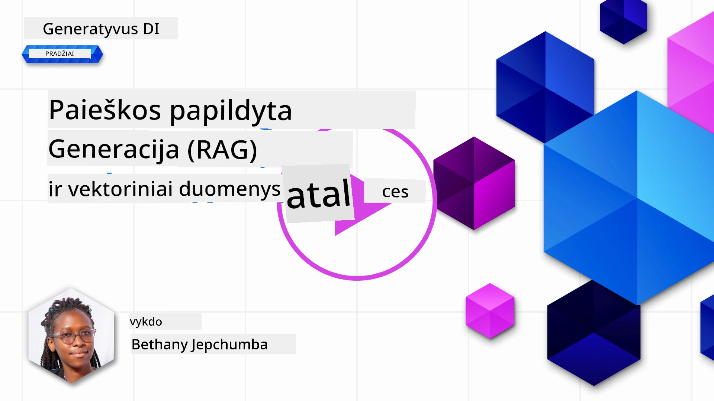
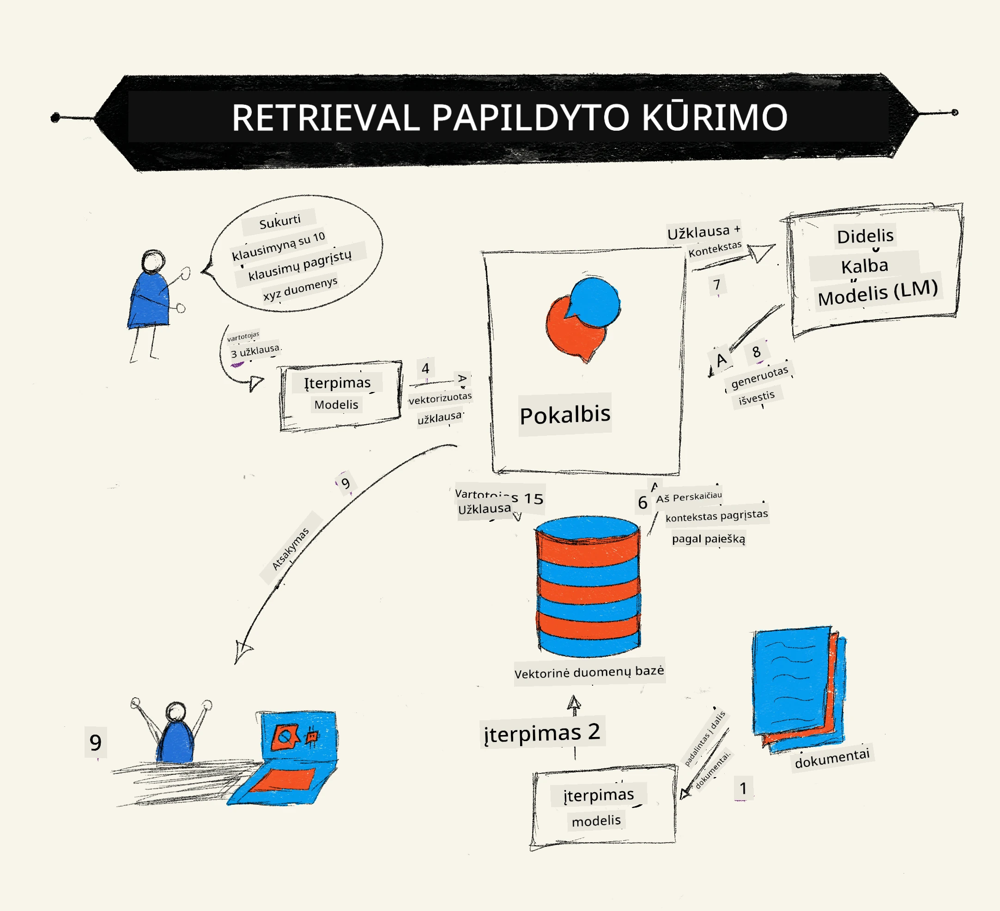
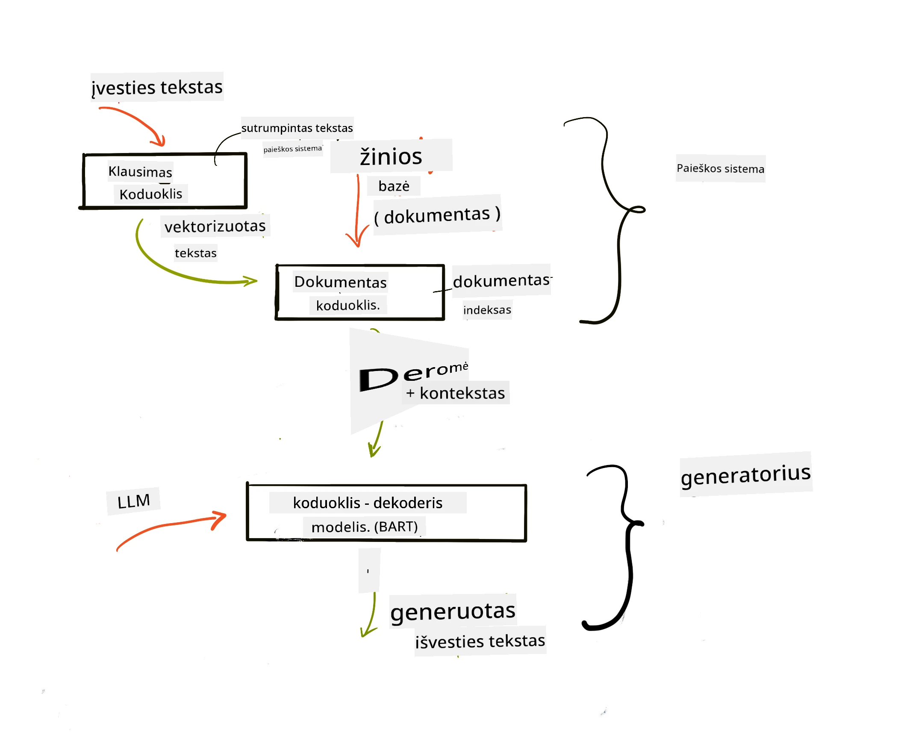
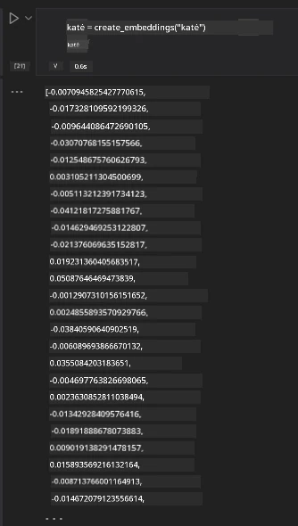

# Išgavimo didinamoji generacija (RAG) ir vektorinių duomenų bazės

[](https://youtu.be/4l8zhHUBeyI?si=BmvDmL1fnHtgQYkL)

Paieškos taikymų pamokoje trumpai sužinojome, kaip integruoti savo duomenis į didelius kalbos modelius (LLM). Šioje pamokoje gilinsimės į savo duomenų pagrindimą LLM taikymuose, proceso mechaniką ir duomenų saugojimo metodus, įskaitant įdėklų (embedding) ir tekstų saugojimą.

> **Vaizdo įrašas netrukus**

## Įvadas

Šioje pamokoje aptarsime:

- Įvadas į RAG, kas tai yra ir kodėl jis naudojamas dirbtiniame intelekte (DI).

- Suprasti, kas yra vektorinių duomenų bazės ir kaip sukurti vieną mūsų taikymui.

- Praktinis pavyzdys, kaip integruoti RAG į taikomąją programą.

## Mokymosi tikslai

Baigę šią pamoką galėsite:

- Paaiškinti RAG svarbą duomenų gavime ir apdorojime.

- Sukonfigūruoti RAG taikymą ir pagrįsti savo duomenis LLM

- Efektyviai integruoti RAG ir vektorines duomenų bazes LLM taikymuose.

## Mūsų scenarijus: patobulinti mūsų LLM savo duomenimis

Šiai pamokai norime pridėti savo užrašus į švietimo startuolį, kuris leidžia pokalbių robotui gauti daugiau informacijos apie skirtingas temas. Naudojant turimus užrašus, mokiniai galės geriau mokytis ir suprasti įvairias temas, todėl lengviau pasiruošti egzaminams. Scenarijui sukurti naudodami:

- `Azure OpenAI:` LLM, kurį naudosime kurdami savo pokalbių robotą

- `Dirbtinis intelektas pradedantiesiems: neuroniniai tinklai` pamoka`: tai bus duomenys, ant kurių pagrįsime savo LLM

- `Azure AI Search` ir `Azure Cosmos DB:` vektorinių duomenų bazė mūsų duomenims saugoti ir paieškos indeksui kurti

Vartotojai galės kurti praktikos testus iš savo užrašų, kartojimo korteles ir apibendrinti jas trumpais apžvalgomis. Pradėkime nuo to, kas yra RAG ir kaip jis veikia:

## Išgavimo didinamoji generacija (RAG)

LLM pagrįstas pokalbių robotas apdoroja vartotojo užklausas ir generuoja atsakymus. Jis skirtas būti interaktyvus ir bendrauti su vartotojais įvairiomis temomis. Tačiau jo atsakymai yra riboti pagal pateiktą kontekstą ir pagrindinius mokymo duomenis. Pavyzdžiui, GPT-4 žinių galiojimo terminas yra 2021 m. rugsėjis, todėl jis nežino apie vėliau įvykusius įvykius. Be to, mokymui naudoti duomenys neapima konfidencialios informacijos, pvz., asmeninių užrašų ar įmonės produkto vadovo.

### Kaip veikia RAG (Išgavimo didinamoji generacija)



Tarkime, norite diegti pokalbių robotą, kuris kuria testus iš jūsų užrašų, tada reikės prisijungimo prie žinių bazės. Čia RAG ateina į pagalbą. RAG veikia taip:

- **Žinių bazė:** Prieš išgavimą šie dokumentai turi būti įkelti ir paruošti, dažniausiai suskaidant didelius dokumentus į mažesnes dalis, paverčiant juos tekstiniais įdėklais ir saugant duomenų bazėje.

- **Vartotojo užklausa:** vartotojas užduoda klausimą

- **Išgavimas:** kai vartotojas užduoda klausimą, įdėklų modelis surenka aktualią informaciją iš žinių bazės, kad suteiktų daugiau konteksto, kuris bus įtrauktas į užklausą.

- **Didinamoji generacija:** LLM papildo savo atsakymą remdamasis surinktais duomenimis. Tai leidžia atsakymui būti ne tik grindžiamam iš anksto apmokytais duomenimis, bet ir aktualia informacija iš pridėto konteksto. Surinkti duomenys naudojami LLM atsakymams papildyti. LLM grąžina atsakymą į vartotojo klausimą.



RAG architektūra įgyvendinama naudojant transformerius, sudarytus iš dviejų dalių: koduotojo (encoder) ir dekoderio (decoder). Pavyzdžiui, kai vartotojas užduoda klausimą, įvestas tekstas yra „užkoduojamas“ į vektorius, kurie fiksuoja žodžių prasmę, tada vektoriai „atkoduojami“ mūsų dokumentų indekse ir generuojamas naujas tekstas remiantis vartotojo užklausa. LLM naudoja tiek koduotojo-dekoderio modelį, kad sugeneruotų išvestį.

RAG įgyvendinimui pagal pasiūlytą straipsnį: [Retrieval-Augmented Generation for Knowledge intensive NLP Tasks](https://arxiv.org/pdf/2005.11401.pdf?WT.mc_id=academic-105485-koreyst) yra du požiūriai:

- **_RAG-Sequence_** naudoja surinktus dokumentus geriausiam atsakymui į vartotojo užklausą numatyti

- **RAG-Token** naudoja dokumentus generuoti kitam žodžiui, tada išgauna juos vartotojo užklausai atsakyti

### Kodėl verta naudoti RAG? 

- **Informacijos gausa:** užtikrina, kad tekstiniai atsakymai yra atnaujinti ir aktualūs. Tai pagerina našumą sritinėse užduotyse, pasiekiant vidinę žinių bazę.

- Mažina išgalvojimus, naudodamas **patikimus duomenis** žinių bazėje, kad pateiktų kontekstą vartotojo užklausoms.

- Tai yra **ekonomiška**, nes pigiau nei tobulinti LLM per specialų mokymą.

## Žinių bazės kūrimas

Mūsų taikymas pagrįstas asmeniniais duomenimis, t. y., dirbtinio intelekto pradedančiųjų neuroninių tinklų pamoka.

### Vektorinių duomenų bazės

Vektorinių duomenų bazė, skirtingai nuo tradicinių duomenų bazių, yra specializuota duomenų bazė, skirta saugoti, valdyti ir ieškoti įdėtų vektorių. Ji saugo dokumentų skaitmenines reprezentacijas. Duomenų suskaidymas į skaitmeninius įdėklus leidžia mūsų DI sistemai lengviau suprasti ir apdoroti duomenis.

Savo įdėklus saugome vektorinių duomenų bazėse, nes LLM riboja žodžių, kuriuos jis gali priimti kaip įvestį, skaičių. Kadangi negalite perduoti visų įdėklų LLM, turėsime juos suskaidyti į dalis, o kai vartotojas užduos klausimą, bus pateikti įdėklai, labiausiai atitinkantys klausimą, kartu su užklausa. Dalijimasis taip pat sumažina žodžių skaičių, kuriuos reikia perduoti per LLM, todėl mažina išlaidas.

Kai kurios populiarios vektorinių duomenų bazės yra Azure Cosmos DB, Clarifyai, Pinecone, Chromadb, ScaNN, Qdrant ir DeepLake. Galite sukurti Azure Cosmos DB modelį naudodami Azure CLI su šia komanda:

```bash
az login
az group create -n <resource-group-name> -l <location>
az cosmosdb create -n <cosmos-db-name> -r <resource-group-name>
az cosmosdb list-keys -n <cosmos-db-name> -g <resource-group-name>
```

### Iš teksto į įdėklus

Prieš saugodami duomenis, turėsime juos konvertuoti į vektorinius įdėklus. Jei dirbate su ilgais dokumentais ar tekstais, galite juos suskaidyti pagal numatomas užklausas. Dalinimas gali būti sakinio ar pastraipos lygiu. Kadangi dalys semantiškai remiasi aplinkiniais žodžiais, galite pridėti papildomą kontekstą prie dalies, pavyzdžiui, pridėti dokumento pavadinimą arba šiek tiek teksto prieš ar po dalies. Duomenis galite dalinti taip:

```python
def split_text(text, max_length, min_length):
    words = text.split()
    chunks = []
    current_chunk = []

    for word in words:
        current_chunk.append(word)
        if len(' '.join(current_chunk)) < max_length and len(' '.join(current_chunk)) > min_length:
            chunks.append(' '.join(current_chunk))
            current_chunk = []

    # Jei paskutinė dalis nepasiekė minimalaus ilgio, vis tiek ją pridėkite
    if current_chunk:
        chunks.append(' '.join(current_chunk))

    return chunks
```

Vieną kartą suskaidę, galime įdėti tekstą naudodami skirtingus įdėklų modelius. Kai kurie modeliai, kuriuos galite naudoti: word2vec, OpenAI ada-002, Azure Computer Vision ir daugelis kitų. Modelio pasirinkimas priklausys nuo naudojamų kalbų, koduojamo turinio tipo (tekstai/vaizdai/garsas), įvesties dydžio ir įdėklo išvesties ilgio.

Pavyzdys teksto įdėklų naudojant OpenAI `text-embedding-ada-002` modelį:


## Išgavimas ir vektorinė paieška

Kai vartotojas užduoda klausimą, išgaunamasis transformuoja jį į vektorių naudodamas užklausų koduotoją, tada ieško mūsų dokumentų paieškos indekse atitinkančių vektorių. Baigus, paverčia tiek įvesties, tiek dokumentų vektorius į tekstą ir perduoda LLM.

### Išgavimas

Išgavimas vyksta tada, kai sistema bando greitai rasti dokumentus indekse, atitinkančius paieškos kriterijus. Išgaunančiojo tikslas – gauti dokumentus, kurie suteikia kontekstą ir pagrindžia LLM jūsų duomenimis.

Paiešką mūsų duomenų bazėje galima atlikti keliais būdais:

- **Raktinių žodžių paieška** – naudojama tekstinėse paieškose

- **Vektorinė paieška** – dokumentus paverčia iš tekstų į vektorių reprezentacijas naudodama įdėklų modelius, leidžianti atlikti **semantinę paiešką** remiantis žodžių prasmėmis. Išgavimas atliekamas ieškant dokumentų, kurių vektorinės reprezentacijos būtų artimiausios vartotojo klausimui.

- **Hibridinė** – raktinių žodžių ir vektorinė paieškos kombinacija.

Išgavimas susiduria su iššūkiu, kai duomenų bazėje nėra panašaus atsakymo į užklausą; sistema pateikia geriausią galimą informaciją. Tačiau galite naudoti taktikų, pvz., nustatyti maksimalią atstumą reikšmingumui arba naudoti hibridinę paiešką, derinančią raktinius žodžius ir vektorinę paiešką. Šioje pamokoje naudosime hibridinę paiešką, derindami vektorines ir raktinių žodžių paieškas. Mūsų duomenis saugosime duomenų skiltyje su dalimis ir įdėklais.

### Vektorinė panašumo funkcija

Išgaunamasis ieškos žinių bazėje įdėklų, kurie būtų artimi, t. y. artimiausių kaimynų, nes jie yra panašūs tekstai. Vartotojo užklausa pirmiausia užkoduojama, tada lyginama su panašiais įdėklais. Bendras naudojamas panašumo matas yra kosinuso panašumas, kuris remiasi kampu tarp dviejų vektorių.

Galime matuoti panašumą ir kitais būdais, pvz., Euklido atstumu, kuris yra tiesi linija tarp vektorių galų, arba skaliariniu daugybu, kuris matuoja atitinkamų elementų sandaugų sumą dviejuose vektoriuose.

### Paieškos indeksas

Atlikdami išgavimą turime sukurti paieškos indeksą mūsų žinių bazei prieš pradedant paiešką. Indeksas saugos mūsų įdėklus ir galės greitai pateikti artimiausias dalis net didelėje duomenų bazėje. Galime sukurti savo indeksą vietoje naudodami:

```python
from sklearn.neighbors import NearestNeighbors

embeddings = flattened_df['embeddings'].to_list()

# Sukurkite paieškos indeksą
nbrs = NearestNeighbors(n_neighbors=5, algorithm='ball_tree').fit(embeddings)

# Norėdami užklausti indeksą, galite naudoti metodą kneighbors
distances, indices = nbrs.kneighbors(embeddings)
```

### Perreitingavimas

Pateikus užklausą duomenų bazei, gali prireikti rūšiuoti rezultatus nuo svarbiausių. Perreitingavimo LLM naudoja mašininį mokymąsi paieškos rezultatų aktualumo gerinimui jų tvarkant nuo svarbiausių. Naudojant Azure AI Search, perreitingavimas atliekamas automatiškai naudojant semantinį perreitingavimo įrankį. Pavyzdys, kaip veikia perreitingavimas naudojant artimiausių kaimynų metodą:

```python
# Raskite labiausiai panašius dokumentus
distances, indices = nbrs.kneighbors([query_vector])

index = []
# Išspausdinkite labiausiai panašius dokumentus
for i in range(3):
    index = indices[0][i]
    for index in indices[0]:
        print(flattened_df['chunks'].iloc[index])
        print(flattened_df['path'].iloc[index])
        print(flattened_df['distances'].iloc[index])
    else:
        print(f"Index {index} not found in DataFrame")
```

## Visumoje

Paskutinis žingsnis – pridėti mūsų LLM, kad galėtume gauti atsakymus, pagrįstus mūsų duomenimis. Galime įgyvendinti taip:

```python
user_input = "what is a perceptron?"

def chatbot(user_input):
    # Paverskite klausimą į užklausos vektorių
    query_vector = create_embeddings(user_input)

    # Raskite labiausiai panašius dokumentus
    distances, indices = nbrs.kneighbors([query_vector])

    # pridėkite dokumentus prie užklausos, kad suteiktumėte kontekstą
    history = []
    for index in indices[0]:
        history.append(flattened_df['chunks'].iloc[index])

    # sujunkite istoriją ir naudotojo įvestį
    history.append(user_input)

    # sukurkite pranešimo objektą
    messages=[
        {"role": "system", "content": "You are an AI assistant that helps with AI questions."},
        {"role": "user", "content": "\n\n".join(history) }
    ]

    # naudokite „Responses API“, kad sugeneruotumėte atsakymą
    response = client.responses.create(
        model="gpt-4o-mini",
        temperature=0.7,
        max_output_tokens=800,
        input=messages,
        store=False,
    )

    return response.output_text

chatbot(user_input)
```

## Mūsų taikymo įvertinimas

### Vertinimo metrika

- Atsakymų kokybė – užtikrinant, kad skambėtų natūraliai, sklandžiai ir žmoniškai

- Duomenų pagrįstumas: vertinant, ar atsakymas atsirado iš pateiktų dokumentų

- Aktualumas: vertinant, ar atsakymas atitinka užduotą klausimą

- Sklandumas – ar atsakymas yra gramatiškai prasmingas

## RAG ir vektorinių duomenų bazių panaudojimo atvejai

Yra daug atvejų, kai funkcijų iškvietimai gali pagerinti jūsų programą, pavyzdžiui:

- Klausimų ir atsakymų sistema: pagrindžiant įmonės duomenis pokalbių robotu, kurį darbuotojai gali naudoti klausimams užduoti.

- Rekomendacijų sistemos: kur galite sukurti sistemą, siejančią panašiausias reikšmes, pvz., filmus, restoranus ir kt.

- Pokalbių robotų paslaugos: galite saugoti pokalbių istoriją ir suasmeninti pokalbį pagal vartotojo duomenis.

- Vaizdų paieška, pagrįsta vektorinių įdėklų panaudojimu, naudinga atliekant vaizdų atpažinimą ir anomalijų nustatymą.

## Santrauka

Aptarėme pagrindines RAG sritis nuo duomenų pridėjimo prie taikymo, vartotojo užklausą iki atsakymo. Norint supaprastinti RAG kūrimą, galite naudoti sistemas kaip Semanti Kernel, Langchain ar Autogen.

## Užduotis

Toliau tobulinant savo žinias apie Išgavimo didinamąją generaciją (RAG), galite sukurti:

- Sukurti vartotojo sąsają taikymui, naudodamiesi pasirinktu karkasu

- Pasinaudoti karkasu, pvz., LangChain ar Semantic Kernel, ir atkurti savo taikymą.

Sveikiname baigus pamoką 👏.

## Mokymasis čia nesibaigia – tęskite kelionę

Baigę šią pamoką peržiūrėkite mūsų [Generatyvinio DI mokymosi kolekciją](https://aka.ms/genai-collection?WT.mc_id=academic-105485-koreyst) ir toliau gilinkite savo žinias generatyviojo DI srityje!

---

<!-- CO-OP TRANSLATOR DISCLAIMER START -->
**Atsakomybės apribojimas**:
Šis dokumentas buvo išverstas naudojant dirbtinio intelekto vertimo paslaugą [Co-op Translator](https://github.com/Azure/co-op-translator). Nors siekiame tikslumo, prašome atkreipti dėmesį, kad automatiniai vertimai gali turėti klaidų ar netikslumų. Originalus dokumentas jo gimtąja kalba laikomas autoritetingu šaltiniu. Svarbiai informacijai rekomenduojama naudoti profesionalų žmogiškąjį vertimą. Mes neatsakome už jokius nesusipratimus ar neteisingą interpretaciją, kilusią naudojantis šiuo vertimu.
<!-- CO-OP TRANSLATOR DISCLAIMER END -->