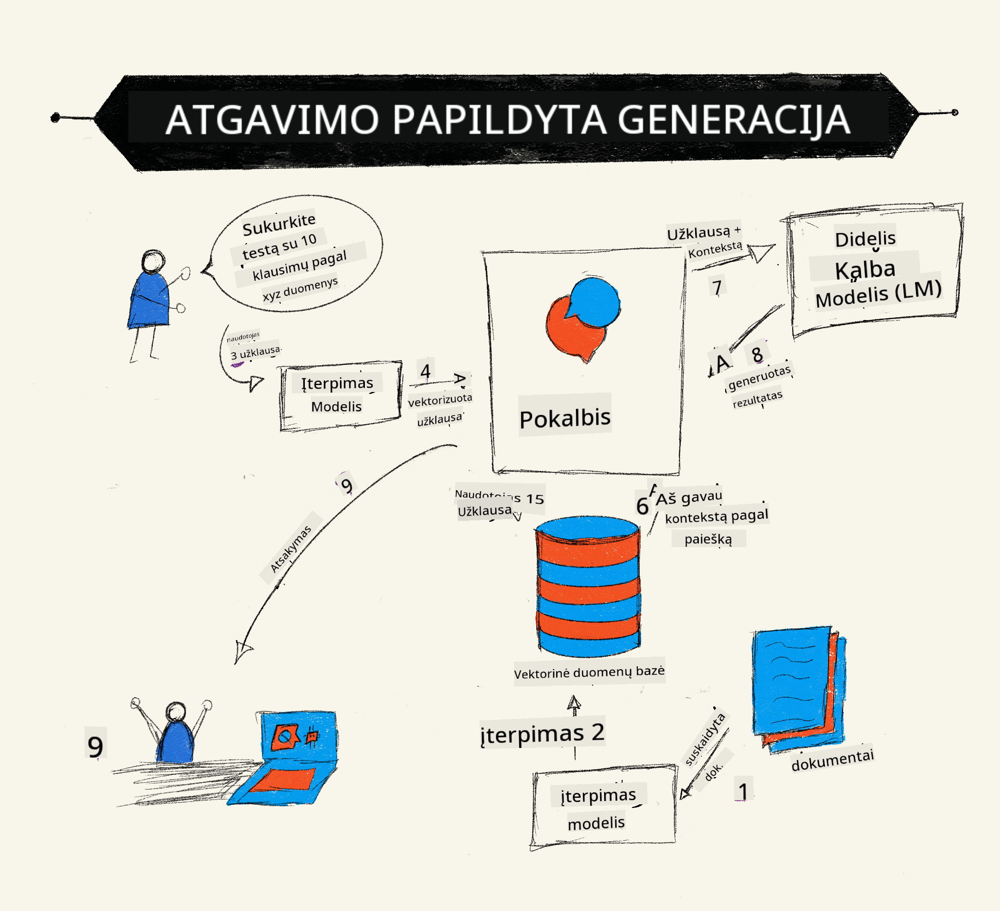
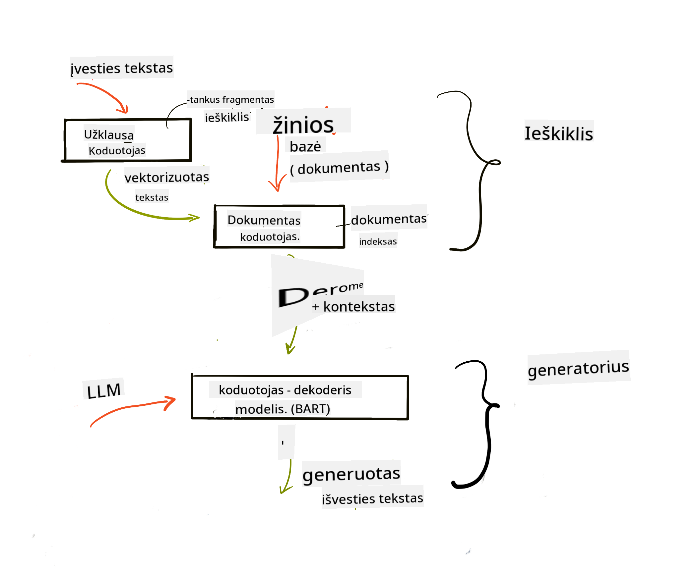

<!--
CO_OP_TRANSLATOR_METADATA:
{
  "original_hash": "b4b0266fbadbba7ded891b6485adc66d",
  "translation_date": "2025-10-18T02:25:45+00:00",
  "source_file": "15-rag-and-vector-databases/README.md",
  "language_code": "lt"
}
-->
# Duomenų paieškos papildyta generacija (RAG) ir vektorinės duomenų bazės

[](https://youtu.be/4l8zhHUBeyI?si=BmvDmL1fnHtgQYkL)

Pamokoje apie paieškos programas trumpai aptarėme, kaip integruoti savo duomenis į didelius kalbos modelius (LLM). Šioje pamokoje gilinsimės į duomenų pagrindimo jūsų LLM programoje koncepcijas, proceso mechaniką ir duomenų saugojimo metodus, įskaitant tiek įterpimus, tiek tekstą.

> **Vaizdo įrašas netrukus**

## Įvadas

Šioje pamokoje aptarsime:

- Įvadas į RAG, kas tai yra ir kodėl jis naudojamas dirbtiniame intelekte (DI).

- Supratimas, kas yra vektorinės duomenų bazės, ir kaip sukurti vieną savo programai.

- Praktinis pavyzdys, kaip integruoti RAG į programą.

## Mokymosi tikslai

Baigę šią pamoką, galėsite:

- Paaiškinti RAG svarbą duomenų paieškoje ir apdorojime.

- Nustatyti RAG programą ir pagrįsti savo duomenis LLM.

- Efektyviai integruoti RAG ir vektorines duomenų bazes į LLM programas.

## Mūsų scenarijus: patobulinti mūsų LLM su mūsų pačių duomenimis

Šioje pamokoje norime pridėti savo užrašus į švietimo startuolį, kuris leidžia pokalbių robotui gauti daugiau informacijos apie įvairias temas. Naudodamiesi mūsų turimais užrašais, mokiniai galės geriau mokytis ir suprasti įvairias temas, todėl jiems bus lengviau pasiruošti egzaminams. Norėdami sukurti šį scenarijų, naudosime:

- `Azure OpenAI:` LLM, kurį naudosime pokalbių robotui sukurti

- `AI pradedantiesiems pamoka apie neuroninius tinklus:` tai bus duomenys, kuriais pagrįsime savo LLM

- `Azure AI Search` ir `Azure Cosmos DB:` vektorinė duomenų bazė, skirta saugoti mūsų duomenis ir sukurti paieškos indeksą

Vartotojai galės kurti praktinius testus iš savo užrašų, peržiūros korteles ir apibendrinti juos į glaustus aprašymus. Norėdami pradėti, pažvelkime, kas yra RAG ir kaip jis veikia:

## Duomenų paieškos papildyta generacija (RAG)

LLM pagrįstas pokalbių robotas apdoroja vartotojo užklausas, kad generuotų atsakymus. Jis sukurtas būti interaktyvus ir bendrauti su vartotojais įvairiomis temomis. Tačiau jo atsakymai yra riboti kontekstu, kuris jam pateikiamas, ir pagrindiniais mokymo duomenimis. Pavyzdžiui, GPT-4 žinių ribos yra 2021 m. rugsėjo mėn., tai reiškia, kad jis neturi žinių apie įvykius, įvykusius po šio laikotarpio. Be to, duomenys, naudojami LLM mokymui, neapima konfidencialios informacijos, tokios kaip asmeniniai užrašai ar įmonės produktų vadovas.

### Kaip veikia RAG (Duomenų paieškos papildyta generacija)



Tarkime, norite paleisti pokalbių robotą, kuris kuria testus iš jūsų užrašų, jums reikės ryšio su žinių baze. Čia į pagalbą ateina RAG. RAG veikia taip:

- **Žinių bazė:** Prieš paiešką šiuos dokumentus reikia įkelti ir apdoroti, paprastai suskaidant didelius dokumentus į mažesnes dalis, paverčiant juos tekstiniais įterpimais ir saugant juos duomenų bazėje.

- **Vartotojo užklausa:** vartotojas užduoda klausimą.

- **Paieška:** Kai vartotojas užduoda klausimą, įterpimo modelis suranda atitinkamą informaciją iš mūsų žinių bazės, kad pateiktų daugiau konteksto, kuris bus įtrauktas į užklausą.

- **Papildyta generacija:** LLM patobulina savo atsakymą remdamasis gautais duomenimis. Tai leidžia generuoti atsakymus ne tik remiantis iš anksto apmokytais duomenimis, bet ir atitinkama informacija iš pridėto konteksto. Gauti duomenys naudojami LLM atsakymams papildyti. Tada LLM pateikia atsakymą į vartotojo klausimą.



RAG architektūra įgyvendinama naudojant transformatorius, susidedančius iš dviejų dalių: koduotojo ir dekoderio. Pavyzdžiui, kai vartotojas užduoda klausimą, įvestas tekstas yra „užkoduojamas“ į vektorius, kurie atspindi žodžių reikšmę, o vektoriai yra „dekoduojami“ į mūsų dokumentų indeksą ir generuoja naują tekstą pagal vartotojo užklausą. LLM naudoja tiek koduotojo, tiek dekoderio modelį, kad sugeneruotų atsakymą.

Du požiūriai, kai įgyvendinamas RAG, remiantis siūlomu straipsniu: [Retrieval-Augmented Generation for Knowledge intensive NLP (natural language processing software) Tasks](https://arxiv.org/pdf/2005.11401.pdf?WT.mc_id=academic-105485-koreyst) yra:

- **_RAG-Sequence_** naudojant gautus dokumentus, kad būtų numatytas geriausias galimas atsakymas į vartotojo užklausą.

- **RAG-Token** naudojant dokumentus generuoti kitą žodį, tada juos gauti, kad atsakytų į vartotojo užklausą.

### Kodėl verta naudoti RAG? 

- **Informacijos gausa:** užtikrina, kad tekstiniai atsakymai būtų aktualūs ir naujausi. Todėl jis pagerina našumą specifinėse srityse, pasiekdamas vidinę žinių bazę.

- Sumažina klaidingos informacijos pateikimą, naudodamas **patikimus duomenis** žinių bazėje, kad pateiktų kontekstą vartotojo užklausoms.

- Tai **ekonomiška**, nes jie yra pigesni, palyginti su LLM pritaikymu.

## Žinių bazės kūrimas

Mūsų programa yra pagrįsta mūsų asmeniniais duomenimis, t. y. pamoka apie neuroninius tinklus iš AI pradedantiesiems mokymo programos.

### Vektorinės duomenų bazės

Vektorinė duomenų bazė, skirtingai nei tradicinės duomenų bazės, yra specializuota duomenų bazė, skirta saugoti, valdyti ir ieškoti įterptų vektorių. Ji saugo dokumentų skaitines reprezentacijas. Duomenų suskaidymas į skaitinius įterpimus leidžia mūsų DI sistemai lengviau suprasti ir apdoroti duomenis.

Mes saugome savo įterpimus vektorinėse duomenų bazėse, nes LLM turi ribotą priimamų įvesties žodžių skaičių. Kadangi negalime perduoti visų įterpimų LLM, turėsime juos suskaidyti į dalis, o kai vartotojas užduoda klausimą, įterpimai, labiausiai panašūs į klausimą, bus grąžinti kartu su užklausa. Suskaidymas taip pat sumažina išlaidas, susijusias su perduodamų žodžių skaičiumi per LLM.

Kai kurios populiarios vektorinės duomenų bazės yra Azure Cosmos DB, Clarifyai, Pinecone, Chromadb, ScaNN, Qdrant ir DeepLake. Galite sukurti Azure Cosmos DB modelį naudodami Azure CLI su šia komanda:

```bash
az login
az group create -n <resource-group-name> -l <location>
az cosmosdb create -n <cosmos-db-name> -r <resource-group-name>
az cosmosdb list-keys -n <cosmos-db-name> -g <resource-group-name>
```

### Nuo teksto iki įterpimų

Prieš saugodami savo duomenis, turėsime juos konvertuoti į vektorinius įterpimus prieš saugodami duomenų bazėje. Jei dirbate su dideliais dokumentais ar ilgais tekstais, galite juos suskaidyti pagal tikėtinas užklausas. Suskaidymas gali būti atliekamas sakinio lygiu arba pastraipos lygiu. Kadangi suskaidymas išgauna reikšmes iš aplinkinių žodžių, galite pridėti kitą kontekstą prie dalies, pavyzdžiui, pridėdami dokumento pavadinimą arba įtraukdami tekstą prieš arba po dalies. Duomenis galite suskaidyti taip:

```python
def split_text(text, max_length, min_length):
    words = text.split()
    chunks = []
    current_chunk = []

    for word in words:
        current_chunk.append(word)
        if len(' '.join(current_chunk)) < max_length and len(' '.join(current_chunk)) > min_length:
            chunks.append(' '.join(current_chunk))
            current_chunk = []

    # If the last chunk didn't reach the minimum length, add it anyway
    if current_chunk:
        chunks.append(' '.join(current_chunk))

    return chunks
```

Kai duomenys suskaidyti, galime juos įterpti naudodami skirtingus įterpimo modelius. Kai kurie modeliai, kuriuos galite naudoti, yra: word2vec, ada-002 iš OpenAI, Azure Computer Vision ir daugelis kitų. Modelio pasirinkimas priklausys nuo naudojamų kalbų, koduojamo turinio tipo (tekstas/vaizdai/garso įrašai), įvesties dydžio, kurį jis gali užkoduoti, ir įterpimo išvesties ilgio.

Pavyzdys, kaip tekstas įterpiamas naudojant OpenAI modelį `text-embedding-ada-002`:


## Paieška ir vektorinė paieška

Kai vartotojas užduoda klausimą, paieškos sistema paverčia jį vektoriumi naudodama užklausos koduotoją, tada ieško mūsų dokumentų paieškos indekse atitinkamų vektorių, susijusių su įvestimi. Baigus, ji konvertuoja tiek įvesties vektorių, tiek dokumentų vektorius į tekstą ir perduoda jį per LLM.

### Paieška

Paieška vyksta, kai sistema bando greitai rasti dokumentus iš indekso, kurie atitinka paieškos kriterijus. Paieškos tikslas yra gauti dokumentus, kurie bus naudojami kontekstui suteikti ir pagrįsti LLM jūsų duomenimis.

Yra keletas būdų, kaip atlikti paiešką mūsų duomenų bazėje, pavyzdžiui:

- **Raktinių žodžių paieška** - naudojama tekstinėms paieškoms.

- **Semantinė paieška** - naudoja žodžių semantinę reikšmę.

- **Vektorinė paieška** - konvertuoja dokumentus iš teksto į vektorines reprezentacijas, naudojant įterpimo modelius. Paieška atliekama užklausant dokumentus, kurių vektorinės reprezentacijos yra artimiausios vartotojo klausimui.

- **Hibridinė** - raktinių žodžių ir vektorinės paieškos derinys.

Paieškos iššūkis kyla, kai duomenų bazėje nėra panašaus atsakymo į užklausą, tada sistema grąžins geriausią turimą informaciją. Tačiau galite naudoti tokius metodus kaip nustatyti maksimalų atitikties atstumą arba naudoti hibridinę paiešką, kuri sujungia tiek raktinių žodžių, tiek vektorinę paiešką. Šioje pamokoje naudosime hibridinę paiešką, raktinių žodžių ir vektorinės paieškos derinį. Duomenis saugosime duomenų rėmelyje su stulpeliais, kuriuose bus dalys ir įterpimai.

### Vektorinė panašumo paieška

Paieškos sistema ieškos žinių duomenų bazėje įterpimų, kurie yra arti vienas kito, artimiausio kaimyno, nes tai yra tekstai, kurie yra panašūs. Jei vartotojas užduoda užklausą, ji pirmiausia įterpiama, tada suderinama su panašiais įterpimais. Dažniausiai naudojamas matavimo metodas, skirtas nustatyti, kaip panašūs yra skirtingi vektoriai, yra kosinusinis panašumas, kuris grindžiamas kampu tarp dviejų vektorių.

Galime matuoti panašumą naudodami kitus alternatyvius metodus, tokius kaip Euklido atstumas, kuris yra tiesi linija tarp vektorių galų, ir taškinis sandauga, kuri matuoja dviejų vektorių atitinkamų elementų sandaugos sumą.

### Paieškos indeksas

Atliekant paiešką, prieš atliekant paiešką, turėsime sukurti paieškos indeksą savo žinių bazei. Indeksas saugos mūsų įterpimus ir galės greitai rasti panašiausias dalis net didelėje duomenų bazėje. Galime sukurti savo indeksą vietoje, naudodami:

```python
from sklearn.neighbors import NearestNeighbors

embeddings = flattened_df['embeddings'].to_list()

# Create the search index
nbrs = NearestNeighbors(n_neighbors=5, algorithm='ball_tree').fit(embeddings)

# To query the index, you can use the kneighbors method
distances, indices = nbrs.kneighbors(embeddings)
```

### Rezultatų perrikiavimas

Kai užklausiate duomenų bazės, gali prireikti surūšiuoti rezultatus pagal jų aktualumą. Perrikiavimo LLM naudoja mašininį mokymąsi, kad pagerintų paieškos rezultatų aktualumą, juos surikiuodamas nuo svarbiausių. Naudojant Azure AI Search, perrikiavimas atliekamas automatiškai naudojant semantinį perrikiavimo mechanizmą. Pavyzdys, kaip veikia perrikiavimas, naudojant artimiausius kaimynus:

```python
# Find the most similar documents
distances, indices = nbrs.kneighbors([query_vector])

index = []
# Print the most similar documents
for i in range(3):
    index = indices[0][i]
    for index in indices[0]:
        print(flattened_df['chunks'].iloc[index])
        print(flattened_df['path'].iloc[index])
        print(flattened_df['distances'].iloc[index])
    else:
        print(f"Index {index} not found in DataFrame")
```

## Viskas kartu

Paskutinis žingsnis yra pridėti mūsų LLM, kad galėtume gauti atsakymus, pagrįstus mūsų duomenimis. Galime tai įgyvendinti taip:

```python
user_input = "what is a perceptron?"

def chatbot(user_input):
    # Convert the question to a query vector
    query_vector = create_embeddings(user_input)

    # Find the most similar documents
    distances, indices = nbrs.kneighbors([query_vector])

    # add documents to query  to provide context
    history = []
    for index in indices[0]:
        history.append(flattened_df['chunks'].iloc[index])

    # combine the history and the user input
    history.append(user_input)

    # create a message object
    messages=[
        {"role": "system", "content": "You are an AI assistant that helps with AI questions."},
        {"role": "user", "content": history[-1]}
    ]

    # use chat completion to generate a response
    response = openai.chat.completions.create(
        model="gpt-4",
        temperature=0.7,
        max_tokens=800,
        messages=messages
    )

    return response.choices[0].message

chatbot(user_input)
```

## Mūsų programos vertinimas

### Vertinimo kriterijai

- Atsakymų kokybė, užtikrinant, kad jie skambėtų natūraliai, sklandžiai ir žmogiškai.

- Duomenų pagrįstumas: vertinant, ar atsakymas buvo gautas iš pateiktų dokumentų.

- Aktualumas: vertinant, ar atsakymas atitinka ir yra susijęs su užduotu klausimu.

- Sklandumas - ar atsakymas gramatiškai prasmingas.

## RAG (Duomenų paieškos papildyta generacija) ir vektorinių duomenų bazių naudojimo atvejai

Yra daugybė skirtingų naudojimo atvejų, kur funkcijų iškvietimai gali pagerinti jūsų programą, pavyzdžiui:

- Klausimų ir atsakymų sistema: pagrindžiant jūsų įmonės duomenis pokalbių robotui, kurį darbuotojai gali naudoti klausimams užduoti.

- Rekomendacijų sistemos: kur galite sukurti sistemą, kuri atitiktų panašiausias vertes, pvz., filmus, restoranus ir daug daugiau.

- Pokalbių robotų paslaugos: galite saugoti pokalbių istoriją ir suasmeninti pokalbį pagal vartotojo duomenis.

- Vaizdų paieška pagal vektorinius įterpimus, naudinga atliekant vaizdų atpažinimą ir anomalijų aptikimą.

## Santrauka

Aptarėme pagrindines RAG sritis, nuo duomenų pridėjimo prie programos, vartotojo užklausos iki išvesties. Norėdami supaprastinti RAG kūrimą, galite naudoti tokias sistemas kaip Semantic Kernel, Langchain arba Autogen.

## Užduotis

Norėdami tęsti mokymąsi apie Duomenų paieškos papildytą generaciją (RAG), galite:

- Sukurti programos vartotojo sąsają, naudodami pasirinktą sistemą.

- Naudoti sistemą, pvz., LangChain arba Semantic Kernel, ir atkurti savo programą.

Sveikiname baigus pamoką 👏.

## Mokymasis nesibaigia čia, tęskite kelionę

Baigę šią pamoką, apsilankykite mūsų [Generatyvaus DI mokymosi kolekcijoje](https://aka.ms/genai-collection?WT.mc_id=academic-105485-koreyst), kad toliau gilintumėte savo žinias apie generatyvų DI!

---

**Atsakomybės atsisakymas**:  
Šis dokumentas buvo išverstas naudojant AI vertimo paslaugą [Co-op Translator](https://github.com/Azure/co-op-translator). Nors siekiame tikslumo, prašome atkreipti dėmesį, kad automatiniai vertimai gali turėti klaidų ar netikslumų. Originalus dokumentas jo gimtąja kalba turėtų būti laikomas autoritetingu šaltiniu. Dėl svarbios informacijos rekomenduojama profesionali žmogaus vertimo paslauga. Mes neprisiimame atsakomybės už nesusipratimus ar neteisingus interpretavimus, atsiradusius naudojant šį vertimą.