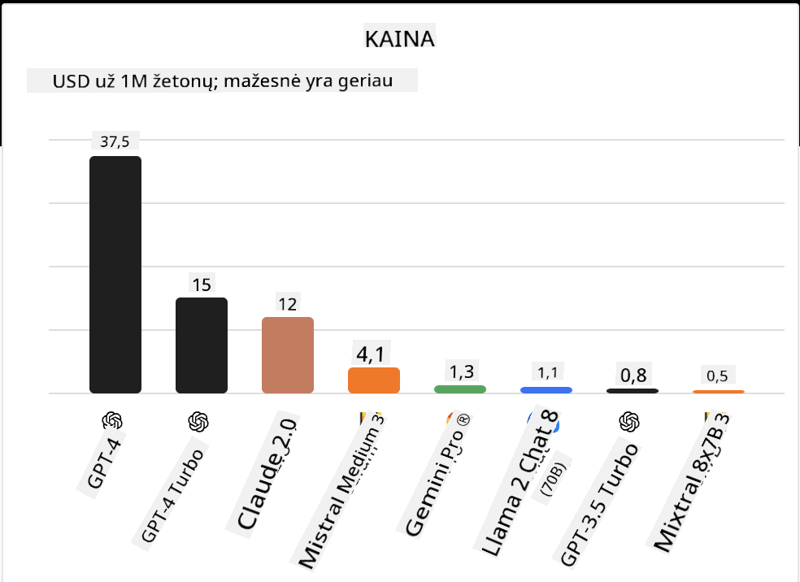
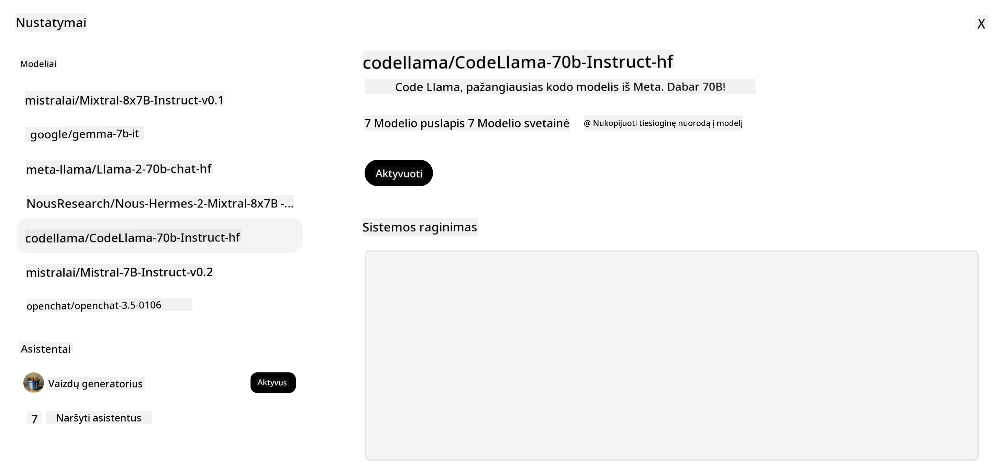
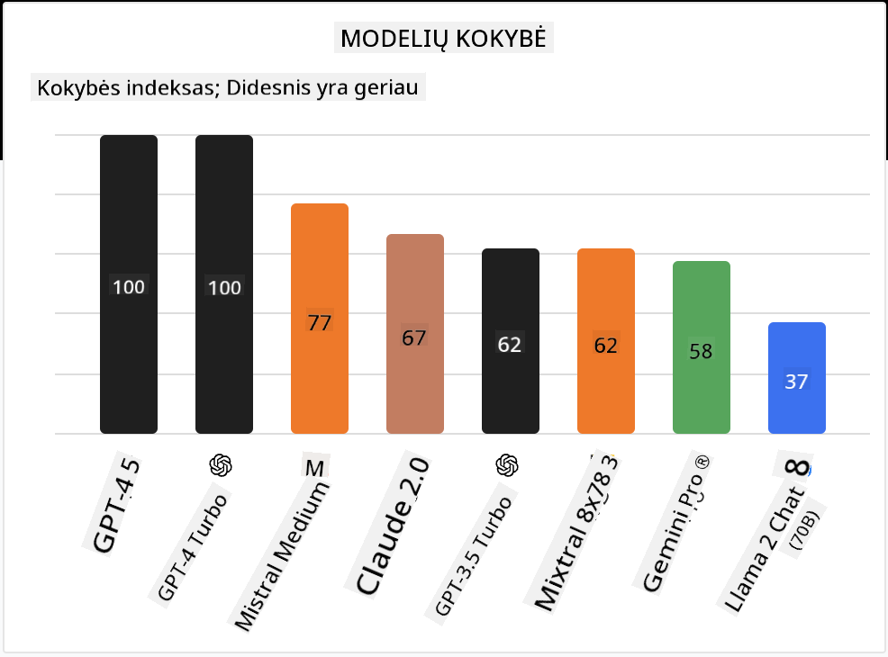

<!--
CO_OP_TRANSLATOR_METADATA:
{
  "original_hash": "0bba96e53ab841d99db731892a51fab8",
  "translation_date": "2025-08-25T12:42:12+00:00",
  "source_file": "16-open-source-models/README.md",
  "language_code": "lt"
}
-->
## Įvadas

Atvirojo kodo LLM pasaulis yra įdomus ir nuolat besikeičiantis. Šioje pamokoje siekiama išsamiai apžvelgti atvirojo kodo modelius. Jei ieškote informacijos, kaip nuosavybiniai modeliai lyginami su atvirojo kodo modeliais, apsilankykite pamokoje ["Įvairių LLM tyrimas ir palyginimas"](../02-exploring-and-comparing-different-llms/README.md?WT.mc_id=academic-105485-koreyst). Šioje pamokoje taip pat bus aptariamas modelių pritaikymas (fine-tuning), tačiau išsamesnį paaiškinimą rasite pamokoje ["LLM pritaikymas"](../18-fine-tuning/README.md?WT.mc_id=academic-105485-koreyst).

## Mokymosi tikslai

- Suprasti, kas yra atvirojo kodo modeliai
- Sužinoti, kokią naudą teikia darbas su atvirojo kodo modeliais
- Susipažinti su atvirais modeliais, prieinamais Hugging Face ir Azure AI Studio

## Kas yra atvirojo kodo modeliai?

Atvirojo kodo programinė įranga labai prisidėjo prie technologijų plėtros įvairiose srityse. Open Source Initiative (OSI) apibrėžė [10 kriterijų programinei įrangai](https://web.archive.org/web/20241126001143/https://opensource.org/osd?WT.mc_id=academic-105485-koreyst), kad ji būtų laikoma atvirojo kodo. Programos kodas turi būti viešai prieinamas pagal OSI patvirtintą licenciją.

Nors LLM kūrimas turi panašumų su programinės įrangos kūrimu, procesas nėra visiškai toks pat. Dėl to bendruomenėje kyla daug diskusijų apie atvirojo kodo apibrėžimą LLM kontekste. Kad modelis atitiktų tradicinį atvirojo kodo apibrėžimą, viešai turi būti prieinama ši informacija:

- Duomenų rinkiniai, naudoti modelio mokymui.
- Pilni modelio svoriai kaip mokymo dalis.
- Vertinimo kodas.
- Pritaikymo (fine-tuning) kodas.
- Pilni modelio svoriai ir mokymo metrikos.

Šiuo metu tik keli modeliai atitinka šiuos kriterijus. [OLMo modelis, sukurtas Allen Institute for Artificial Intelligence (AllenAI)](https://huggingface.co/allenai/OLMo-7B?WT.mc_id=academic-105485-koreyst) yra vienas iš jų.

Šioje pamokoje toliau modelius vadinsime „atvirais modeliais“, nes jie gali neatitikti visų aukščiau išvardintų kriterijų rašymo metu.

## Atvirų modelių privalumai

**Labai pritaikomi** – Kadangi atviri modeliai pateikiami su išsamia mokymo informacija, tyrėjai ir kūrėjai gali keisti modelio vidinę struktūrą. Tai leidžia kurti labai specializuotus modelius, pritaikytus konkrečiai užduočiai ar sričiai. Pavyzdžiui, kodų generavimas, matematinės operacijos ar biologija.

**Kaina** – Naudojimo ir diegimo kaina už žodį (token) yra mažesnė nei nuosavybinių modelių. Kuriant generatyvios AI programas, verta įvertinti našumo ir kainos santykį, kai dirbate su šiais modeliais savo atveju.

Šaltinis: Artificial Analysis

**Lankstumas** – Dirbant su atvirais modeliais, galite lanksčiai rinktis skirtingus modelius ar juos derinti. Pavyzdžiui, [HuggingChat Assistants](https://huggingface.co/chat?WT.mc_id=academic-105485-koreyst), kur vartotojas gali pasirinkti naudojamą modelį tiesiogiai vartotojo sąsajoje:

## Įvairių atvirų modelių apžvalga

### Llama 2

[LLama2](https://huggingface.co/meta-llama?WT.mc_id=academic-105485-koreyst), sukurtas Meta, yra atviras modelis, optimizuotas pokalbių programoms. Taip yra dėl jo pritaikymo metodo, kuriame naudota daug dialogų ir žmonių grįžtamojo ryšio. Dėl to modelis pateikia rezultatus, labiau atitinkančius žmonių lūkesčius, kas pagerina vartotojo patirtį.

Kai kurie Llama pritaikytų versijų pavyzdžiai: [Japanese Llama](https://huggingface.co/elyza/ELYZA-japanese-Llama-2-7b?WT.mc_id=academic-105485-koreyst), skirtas japonų kalbai, ir [Llama Pro](https://huggingface.co/TencentARC/LLaMA-Pro-8B?WT.mc_id=academic-105485-koreyst), patobulinta bazinio modelio versija.

### Mistral

[Mistral](https://huggingface.co/mistralai?WT.mc_id=academic-105485-koreyst) yra atviras modelis, orientuotas į aukštą našumą ir efektyvumą. Jis naudoja Mixture-of-Experts metodą, kai keli specializuoti ekspertų modeliai sujungiami į vieną sistemą, o priklausomai nuo įvesties, parenkami tam tikri modeliai. Tai leidžia efektyviau atlikti skaičiavimus, nes modeliai sprendžia tik tas užduotis, kuriose yra stipriausi.

Kai kurie Mistral pritaikytų versijų pavyzdžiai: [BioMistral](https://huggingface.co/BioMistral/BioMistral-7B?text=Mon+nom+est+Thomas+et+mon+principal?WT.mc_id=academic-105485-koreyst), skirtas medicinos sričiai, ir [OpenMath Mistral](https://huggingface.co/nvidia/OpenMath-Mistral-7B-v0.1-hf?WT.mc_id=academic-105485-koreyst), skirtas matematinėms užduotims.

### Falcon

[Falcon](https://huggingface.co/tiiuae?WT.mc_id=academic-105485-koreyst) yra LLM, sukurtas Technology Innovation Institute (**TII**). Falcon-40B buvo apmokytas su 40 milijardų parametrų ir, kaip rodo rezultatai, veikia geriau nei GPT-3, naudodamas mažiau skaičiavimo resursų. Taip yra dėl FlashAttention algoritmo ir multiquery attention, kurie sumažina atminties poreikius prognozavimo metu. Dėl trumpesnio prognozavimo laiko Falcon-40B tinka pokalbių programoms.

Kai kurie Falcon pritaikytų versijų pavyzdžiai: [OpenAssistant](https://huggingface.co/OpenAssistant/falcon-40b-sft-top1-560?WT.mc_id=academic-105485-koreyst), asistentas, sukurtas ant atvirų modelių, ir [GPT4ALL](https://huggingface.co/nomic-ai/gpt4all-falcon?WT.mc_id=academic-105485-koreyst), kuris veikia geriau nei bazinis modelis.

## Kaip pasirinkti

Nėra vieno teisingo atsakymo, kaip pasirinkti atvirą modelį. Geras pradžios taškas – naudoti Azure AI Studio užduočių filtravimo funkciją. Tai padės suprasti, kokioms užduotims modelis buvo apmokytas. Hugging Face taip pat turi LLM Leaderboard, kur matysite geriausiai veikiančius modelius pagal tam tikrus rodiklius.

Norint palyginti LLM skirtingų tipų modelius, [Artificial Analysis](https://artificialanalysis.ai/?WT.mc_id=academic-105485-koreyst) yra dar vienas puikus šaltinis:

Šaltinis: Artifical Analysis

Jei dirbate su konkrečiu atveju, verta ieškoti pritaikytų versijų, orientuotų į tą pačią sritį. Eksperimentavimas su keliais atvirais modeliais ir jų testavimas pagal jūsų ir vartotojų lūkesčius – taip pat gera praktika.

## Ką daryti toliau

Geriausia, kad su atvirais modeliais galite pradėti dirbti labai greitai. Peržiūrėkite [Azure AI Studio Model Catalog](https://ai.azure.com?WT.mc_id=academic-105485-koreyst), kur rasite specialią Hugging Face kolekciją su čia aptartais modeliais.

## Mokymasis nesibaigia čia – tęskite kelionę

Baigę šią pamoką, apsilankykite mūsų [Generatyvios AI mokymosi kolekcijoje](https://aka.ms/genai-collection?WT.mc_id=academic-105485-koreyst), kad toliau gilintumėte žinias apie generatyvią AI!

---

**Atsakomybės atsisakymas**:  
Šis dokumentas buvo išverstas naudojant dirbtinio intelekto vertimo paslaugą [Co-op Translator](https://github.com/Azure/co-op-translator). Nors siekiame tikslumo, prašome atkreipti dėmesį, kad automatiniai vertimai gali turėti klaidų ar netikslumų. Originalus dokumentas jo gimtąja kalba turėtų būti laikomas autoritetingu šaltiniu. Kritinei informacijai rekomenduojamas profesionalus žmogaus vertimas. Mes neatsakome už nesusipratimus ar neteisingą interpretavimą, kilusį dėl šio vertimo naudojimo.