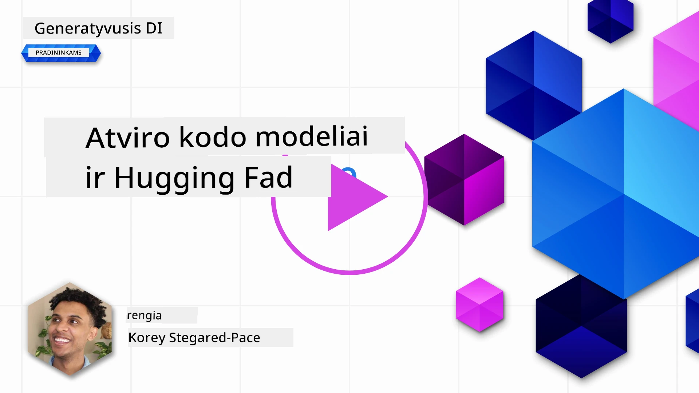
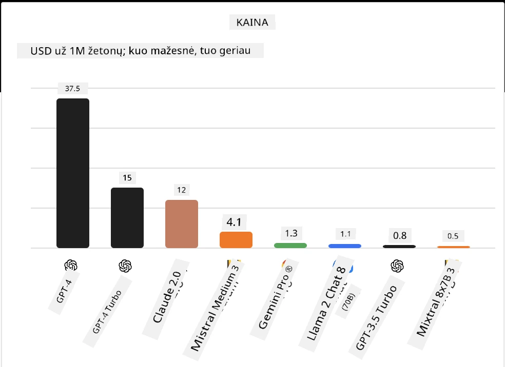
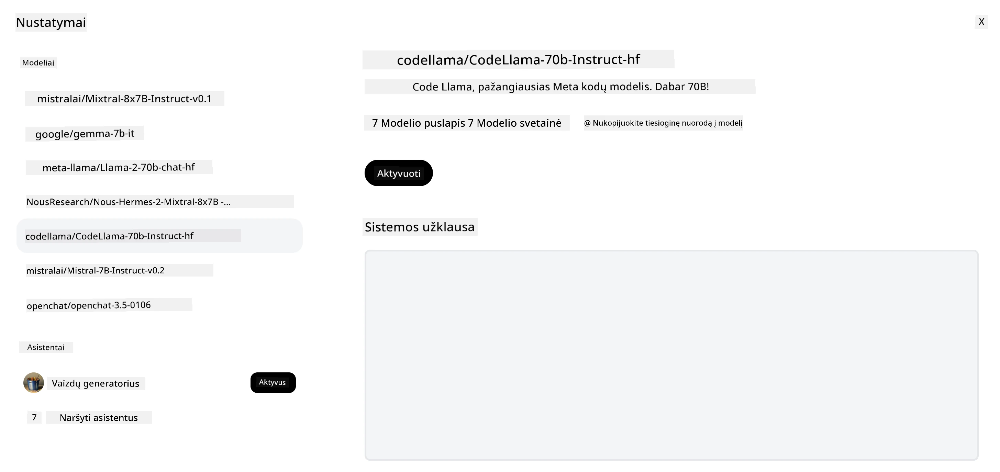
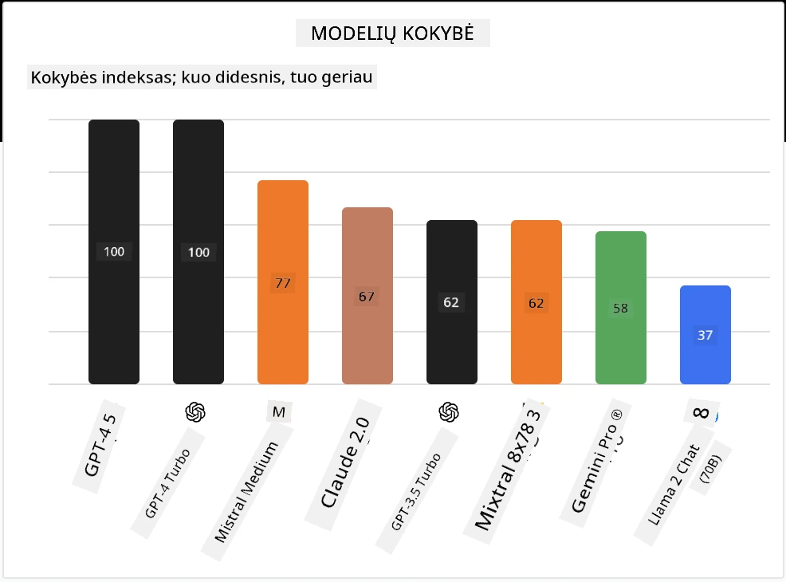

## Įvadas

Atvirojo kodo dideli kalbos modeliai (LLM) yra įdomi ir nuolat besivystanti sritis. Šios pamokos tikslas – išsamiai pažvelgti į atvirojo kodo modelius. Jei ieškote informacijos apie tai, kaip savininkiški modeliai lyginami su atvirojo kodo modeliais, eikite į pamoką ["Skirtingų LLM tyrinėjimas ir palyginimas"](../02-exploring-and-comparing-different-llms/README.md?WT.mc_id=academic-105485-koreyst). Šioje pamokoje taip pat bus aptariama smulkiojo reguliavimo (fine-tuning) tema, tačiau išsamesnį paaiškinimą rasite pamokoje ["LLM smulkusis reguliavimas"](../18-fine-tuning/README.md?WT.mc_id=academic-105485-koreyst).

## Mokymosi tikslai

- Suprasti atvirojo kodo modelius
- Suprasti naudą dirbant su atvirojo kodo modeliais
- Ištirti atvirus modelius, prieinamus Hugging Face ir Microsoft Foundry modelių kataloge

## Kas yra atvirojo kodo modeliai?

Atvirojo kodo programinė įranga atliko svarbų vaidmenį technologijų plėtroje įvairiose srityse. Open Source Initiative (OSI) apibrėžė [10 kriterijų programinei įrangai](https://web.archive.org/web/20241126001143/https://opensource.org/osd?WT.mc_id=academic-105485-koreyst), kad ji būtų laikoma atvirojo kodo. Šaltinio kodas turi būti viešai dalijamasi pagal OSI patvirtintą licenciją.

Nors LLM kūrimas turi panašumų su programinės įrangos kūrimu, procesas nėra visiškai tas pats. Tai sukėlė daug diskusijų bendruomenėje apie atvirojo kodo apibrėžtį LLM kontekste. Kad modelis atitiktų tradicinį atvirojo kodo apibrėžimą, turėtų būti viešai prieinama ši informacija:

- Duomenų rinkiniai, naudoti modeliui treniruoti.
- Visos modelio svorio reikšmės kaip treniruotės dalis.
- Vertinimo kodas.
- Smulkiojo reguliavimo kodas.
- Visos modelio svorio reikšmės ir treniravimo metrika.

Šiuo metu yra tik keletas modelių, atitinkančių šiuos kriterijus. Vienas iš tokių yra [OLMo modelis, sukurtas Allenio dirbtinio intelekto institute (AllenAI)](https://huggingface.co/allenai/OLMo-7B?WT.mc_id=academic-105485-koreyst).

Šioje pamokoje modelius toliau vadinsime „atvirais modeliais“, nes jie šiuo metu gali neatitikti aukščiau išvardytų kriterijų.

## Atvirų modelių privalumai

**Labai pritaikomi** – Kadangi atviri modeliai yra išleidžiami su išsamia mokymo informacija, tyrėjai ir kūrėjai gali keisti modelio vidinę struktūrą. Tai leidžia kurti labai specializuotus modelius, kurie yra smulkiai reguliuojami konkrečiam uždaviniui ar mokslo sričiai. Tai gali būti, pavyzdžiui, kodo generavimas, matematinių operacijų atlikimas ar biologija.

**Kaina** – Naudojimo ir diegimo kaina už žodį šių modelių yra mažesnė nei savininkiškų modelių. Kuriant generatyvias DI programas, verta įvertinti našumą ir kainą pagal savo atvejo naudojimą.

Šaltinis: Artificial Analysis

**Lankstumas** – Dirbant su atvirais modeliais galima lanksčiai naudoti skirtingus modelius arba juos derinti. Pavyzdys yra [HuggingChat Asistentai](https://huggingface.co/chat?WT.mc_id=academic-105485-koreyst), kuriuose vartotojas gali tiesiogiai naudotojo sąsajoje pasirinkti naudojamą modelį:

## Skirtingų atvirų modelių tyrinėjimas

### Llama 2

[LLama2](https://huggingface.co/meta-llama?WT.mc_id=academic-105485-koreyst), sukurtas Meta, yra atviras modelis, optimizuotas pokalbių programoms. Tai pasiekiama dėl smulkaus reguliavimo metodo, kuriame naudojama daug dialogų ir žmogiškojo grįžtamojo ryšio. Šiuo metodu modelis generuoja rezultatus, labiau atitinkančius žmogaus lūkesčius, suteikdamas geresnę naudotojo patirtį.

Kai kurie Llama smulkaus reguliavimo pavyzdžiai yra [Japonų Llama](https://huggingface.co/elyza/ELYZA-japanese-Llama-2-7b?WT.mc_id=academic-105485-koreyst), specializuojasi japonų kalboje, ir [Llama Pro](https://huggingface.co/TencentARC/LLaMA-Pro-8B?WT.mc_id=academic-105485-koreyst), kuris yra patobulinta pagrindinio modelio versija.

### Mistral

[Mistral](https://huggingface.co/mistralai?WT.mc_id=academic-105485-koreyst) yra atviras modelis, orientuotas į aukštą našumą ir efektyvumą. Jis naudoja mišrių ekspertų (Mixture-of-Experts) požiūrį, apjungiantį grupę specializuotų ekspertų modelių į vieną sistemą, kurioje priklausomai nuo įvesties, parenkami tam tikri modeliai. Tai leidžia efektyviau atlikti skaičiavimus, nes modeliai dirba tik su tomis įvestimis, kuriose jie specializuoti.

Kai kurie Mistral smulkaus reguliavimo pavyzdžiai yra [BioMistral](https://huggingface.co/BioMistral/BioMistral-7B?text=Mon+nom+est+Thomas+et+mon+principal?WT.mc_id=academic-105485-koreyst), orientuotas į medicinos sritį, ir [OpenMath Mistral](https://huggingface.co/nvidia/OpenMath-Mistral-7B-v0.1-hf?WT.mc_id=academic-105485-koreyst), atliekantis matematinius skaičiavimus.

### Falcon

[Falcon](https://huggingface.co/tiiuae?WT.mc_id=academic-105485-koreyst) yra LLM, sukurtas Technologijų inovacijų instituto (**TII**). Falcon-40B buvo treniruojamas su 40 milijardų parametrų, ir parodyta, kad jis veikia geriau už GPT-3 su mažesnėmis skaičiavimo sąnaudomis. Tai pasiekiama naudojant FlashAttention algoritmą ir multiquery dėmesį, kurie sumažina atminties reikalavimus modelio veikimo metu. Dėl sumažėjusio veikimo laiko Falcon-40B yra tinkamas pokalbių programoms.

Kai kurie Falcon smulkaus reguliavimo pavyzdžiai yra [OpenAssistant](https://huggingface.co/OpenAssistant/falcon-40b-sft-top1-560?WT.mc_id=academic-105485-koreyst), asistentas, sukurtas ant atvirų modelių, ir [GPT4ALL](https://huggingface.co/nomic-ai/gpt4all-falcon?WT.mc_id=academic-105485-koreyst), kuris pasižymi geresne veikla nei bazinis modelis.

## Kaip pasirinkti

Nėra vieno atsakymo, kaip pasirinkti atvirą modelį. Geras pradžios taškas yra Microsoft Foundry modelių katalogo filtro pagal užduotį funkcija. Tai padės suprasti, kokiems uždaviniams modelis buvo treniruotas. Hugging Face taip pat palaiko LLM lyderių lentelę, kurioje rodomi geriausiai veikiančių modelių rezultatai pagal tam tikrus rodiklius.

Norint palyginti LLM pagal įvairius tipus, [Artificial Analysis](https://artificialanalysis.ai/?WT.mc_id=academic-105485-koreyst) yra dar viena puiki priemonė:

Šaltinis: Artificial Analysis

Jei dirbate su konkrečiu atveju, efektyvu ieškoti smulkiai reguliuotų versijų, orientuotų į tą pačią sritį. Eksperimentavimas su keliais atvirais modeliais, norint įvertinti, kaip jie veikia pagal jūsų ir vartotojų lūkesčius, yra gera praktika.

## Tolimesni žingsniai

Geriausia atvirų modelių dalis yra ta, kad su jais galite pradėti dirbti gana greitai. Pažvelkite į [Microsoft Foundry modelių katalogą](https://ai.azure.com?WT.mc_id=academic-105485-koreyst), kuriame yra specifinė Hugging Face kolekcija su modeliais, apie kuriuos čia kalbėjome.

## Mokymasis čia nesibaigia, tęskite kelionę

Baigę šią pamoką, pakurkite mūsų [Generatyvios DI mokymosi kolekciją](https://aka.ms/genai-collection?WT.mc_id=academic-105485-koreyst), kad toliau keltumėte savo generatyvios DI žinias!

---

<!-- CO-OP TRANSLATOR DISCLAIMER START -->
**Atsakomybės apribojimas**:
Šis dokumentas buvo išverstas naudojant dirbtinio intelekto vertimo paslaugą [Co-op Translator](https://github.com/Azure/co-op-translator). Nors siekiame tikslumo, prašome atkreipti dėmesį, kad automatiniai vertimai gali turėti klaidų ar netikslumų. Originalus dokumentas jo gimtąja kalba laikomas autoritetingu šaltiniu. Svarbiai informacijai rekomenduojama naudoti profesionalų žmogiškąjį vertimą. Mes neatsakome už jokius nesusipratimus ar neteisingą interpretaciją, kilusią naudojantis šiuo vertimu.
<!-- CO-OP TRANSLATOR DISCLAIMER END -->