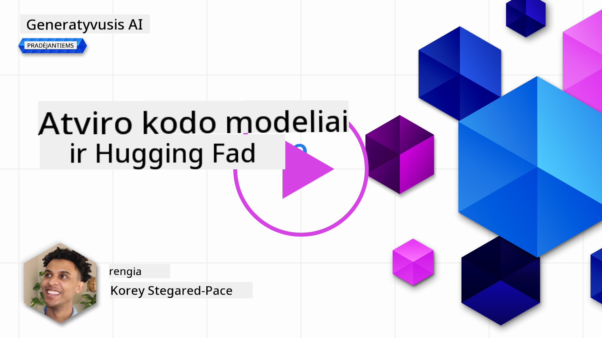

<!--
CO_OP_TRANSLATOR_METADATA:
{
  "original_hash": "a2a83aac52158c23161046cbd13faa2b",
  "translation_date": "2025-10-18T02:33:28+00:00",
  "source_file": "16-open-source-models/README.md",
  "language_code": "lt"
}
-->

## Įvadas

Atvirojo kodo LLM pasaulis yra įdomus ir nuolat besikeičiantis. Ši pamoka siekia išsamiai apžvelgti atvirojo kodo modelius. Jei ieškote informacijos apie tai, kaip patentuoti modeliai lyginami su atvirojo kodo modeliais, apsilankykite pamokoje ["Skirtingų LLM tyrinėjimas ir palyginimas"](../02-exploring-and-comparing-different-llms/README.md?WT.mc_id=academic-105485-koreyst). Šioje pamokoje taip pat bus aptarta modelių pritaikymo tema, tačiau išsamesnį paaiškinimą rasite pamokoje ["LLM pritaikymas"](../18-fine-tuning/README.md?WT.mc_id=academic-105485-koreyst).

## Mokymosi tikslai

- Suprasti atvirojo kodo modelius
- Suprasti atvirojo kodo modelių privalumus
- Tyrinėti atvirus modelius, prieinamus Hugging Face ir Azure AI Studio platformose

## Kas yra atvirojo kodo modeliai?

Atvirojo kodo programinė įranga atliko svarbų vaidmenį technologijų plėtroje įvairiose srityse. Atvirojo kodo iniciatyva (OSI) apibrėžė [10 kriterijų programinei įrangai](https://web.archive.org/web/20241126001143/https://opensource.org/osd?WT.mc_id=academic-105485-koreyst), kad ji būtų klasifikuojama kaip atvirojo kodo. Programos kodas turi būti viešai dalijamas pagal OSI patvirtintą licenciją.

Nors LLM kūrimas turi panašumų su programinės įrangos kūrimu, procesas nėra visiškai toks pats. Dėl to bendruomenėje kyla daug diskusijų apie atvirojo kodo apibrėžimą LLM kontekste. Kad modelis atitiktų tradicinį atvirojo kodo apibrėžimą, turėtų būti viešai prieinama ši informacija:

- Duomenų rinkiniai, naudoti modelio mokymui.
- Pilni modelio svoriai kaip mokymo dalis.
- Vertinimo kodas.
- Pritaikymo kodas.
- Pilni modelio svoriai ir mokymo metrikos.

Šiuo metu yra tik keli modeliai, atitinkantys šiuos kriterijus. [OLMo modelis, sukurtas Allen Institute for Artificial Intelligence (AllenAI)](https://huggingface.co/allenai/OLMo-7B?WT.mc_id=academic-105485-koreyst) yra vienas iš jų.

Šioje pamokoje toliau modelius vadinsime "atvirais modeliais", nes jie gali neatitikti aukščiau nurodytų kriterijų šio teksto rašymo metu.

## Atvirų modelių privalumai

**Labai pritaikomi** - Kadangi atviri modeliai pateikiami su išsamia mokymo informacija, tyrėjai ir kūrėjai gali keisti modelio vidinę struktūrą. Tai leidžia kurti labai specializuotus modelius, pritaikytus konkrečiai užduočiai ar studijų sričiai. Kai kurie pavyzdžiai yra kodo generavimas, matematinės operacijos ir biologija.

**Kaina** - Kaina už vieną tokeną naudojant ir diegiant šiuos modelius yra mažesnė nei patentuotų modelių. Kuriant generatyviosios AI programas, verta įvertinti našumą ir kainą, dirbant su šiais modeliais pagal jūsų naudojimo atvejį.

  
Šaltinis: Artificial Analysis

**Lankstumas** - Darbas su atvirais modeliais leidžia būti lankstiems naudojant skirtingus modelius arba juos derinant. Pavyzdys yra [HuggingChat Asistentai](https://huggingface.co/chat?WT.mc_id=academic-105485-koreyst), kur vartotojas gali tiesiogiai vartotojo sąsajoje pasirinkti naudojamą modelį:

## Skirtingų atvirų modelių tyrinėjimas

### Llama 2

[LLama2](https://huggingface.co/meta-llama?WT.mc_id=academic-105485-koreyst), sukurtas Meta, yra atviras modelis, optimizuotas pokalbių programoms. Tai pasiekta naudojant pritaikymo metodą, kuris apėmė didelį kiekį dialogų ir žmonių atsiliepimų. Šis metodas leidžia modeliui generuoti rezultatus, labiau atitinkančius žmonių lūkesčius, taip užtikrinant geresnę vartotojo patirtį.

Kai kurie pritaikyti Llama versijų pavyzdžiai yra [Japanese Llama](https://huggingface.co/elyza/ELYZA-japanese-Llama-2-7b?WT.mc_id=academic-105485-koreyst), kuris specializuojasi japonų kalboje, ir [Llama Pro](https://huggingface.co/TencentARC/LLaMA-Pro-8B?WT.mc_id=academic-105485-koreyst), kuris yra patobulinta bazinio modelio versija.

### Mistral

[Mistral](https://huggingface.co/mistralai?WT.mc_id=academic-105485-koreyst) yra atviras modelis, orientuotas į aukštą našumą ir efektyvumą. Jis naudoja Mixture-of-Experts metodą, kuris sujungia grupę specializuotų ekspertų modelių į vieną sistemą, kurioje, priklausomai nuo įvesties, pasirenkami tam tikri modeliai. Tai daro skaičiavimus efektyvesnius, nes modeliai sprendžia tik tas įvestis, kuriose jie specializuojasi.

Kai kurie pritaikyti Mistral versijų pavyzdžiai yra [BioMistral](https://huggingface.co/BioMistral/BioMistral-7B?text=Mon+nom+est+Thomas+et+mon+principal?WT.mc_id=academic-105485-koreyst), kuris orientuotas į medicinos sritį, ir [OpenMath Mistral](https://huggingface.co/nvidia/OpenMath-Mistral-7B-v0.1-hf?WT.mc_id=academic-105485-koreyst), kuris atlieka matematinius skaičiavimus.

### Falcon

[Falcon](https://huggingface.co/tiiuae?WT.mc_id=academic-105485-koreyst) yra LLM, sukurtas Technology Innovation Institute (**TII**). Falcon-40B buvo apmokytas naudojant 40 milijardų parametrų, kurie parodė geresnį našumą nei GPT-3 su mažesniu skaičiavimo biudžetu. Tai pasiekta naudojant FlashAttention algoritmą ir multiquery attention, kurie leidžia sumažinti atminties poreikius prognozavimo metu. Dėl sumažinto prognozavimo laiko Falcon-40B yra tinkamas pokalbių programoms.

Kai kurie pritaikyti Falcon versijų pavyzdžiai yra [OpenAssistant](https://huggingface.co/OpenAssistant/falcon-40b-sft-top1-560?WT.mc_id=academic-105485-koreyst), asistentas, sukurtas remiantis atvirais modeliais, ir [GPT4ALL](https://huggingface.co/nomic-ai/gpt4all-falcon?WT.mc_id=academic-105485-koreyst), kuris užtikrina geresnį našumą nei bazinis modelis.

## Kaip pasirinkti

Nėra vieno teisingo atsakymo, kaip pasirinkti atvirą modelį. Geras pradžios taškas yra naudoti Azure AI Studio funkciją, leidžiančią filtruoti pagal užduotį. Tai padės suprasti, kokioms užduotims modelis buvo apmokytas. Hugging Face taip pat palaiko LLM lyderių lentelę, kurioje pateikiami geriausiai veikiantys modeliai pagal tam tikrus metrikos rodiklius.

Norint palyginti LLM skirtingų tipų modelius, [Artificial Analysis](https://artificialanalysis.ai/?WT.mc_id=academic-105485-koreyst) yra dar vienas puikus šaltinis:

  
Šaltinis: Artificial Analysis

Jei dirbate su konkrečiu naudojimo atveju, efektyvu ieškoti pritaikytų versijų, orientuotų į tą pačią sritį. Eksperimentavimas su keliais atvirais modeliais, siekiant pamatyti, kaip jie veikia pagal jūsų ir jūsų vartotojų lūkesčius, yra dar viena gera praktika.

## Kiti žingsniai

Geriausia atvirų modelių dalis yra ta, kad galite pradėti dirbti su jais gana greitai. Peržiūrėkite [Azure AI Foundry Model Catalog](https://ai.azure.com?WT.mc_id=academic-105485-koreyst), kuriame yra speciali Hugging Face kolekcija su šiais modeliais, kuriuos aptarėme čia.

## Mokymasis nesibaigia čia, tęskite kelionę

Baigę šią pamoką, apsilankykite mūsų [Generatyviosios AI mokymosi kolekcijoje](https://aka.ms/genai-collection?WT.mc_id=academic-105485-koreyst), kad toliau gilintumėte savo žinias apie generatyviąją AI!

---

**Atsakomybės apribojimas**:  
Šis dokumentas buvo išverstas naudojant AI vertimo paslaugą [Co-op Translator](https://github.com/Azure/co-op-translator). Nors siekiame tikslumo, prašome atkreipti dėmesį, kad automatiniai vertimai gali turėti klaidų ar netikslumų. Originalus dokumentas jo gimtąja kalba turėtų būti laikomas autoritetingu šaltiniu. Dėl svarbios informacijos rekomenduojama profesionali žmogaus vertimo paslauga. Mes neprisiimame atsakomybės už nesusipratimus ar neteisingus aiškinimus, atsiradusius naudojant šį vertimą.