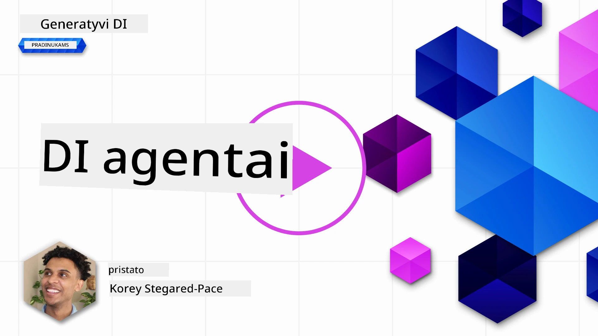
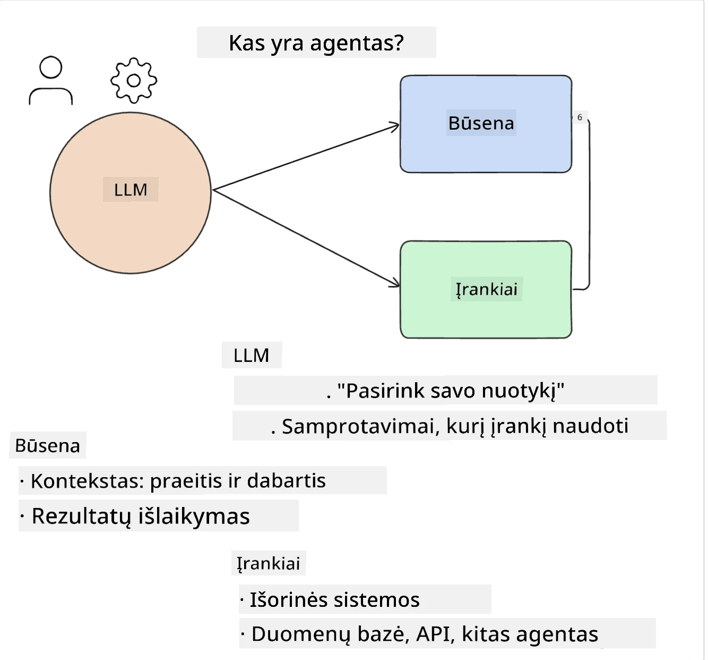
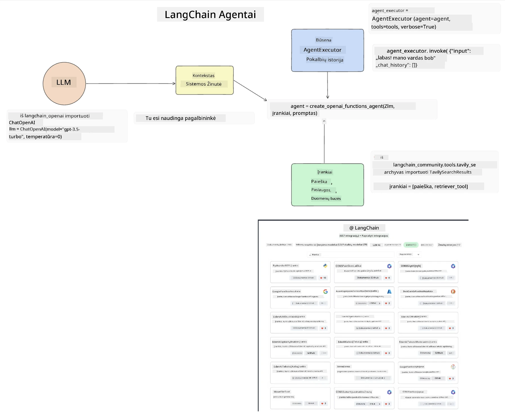
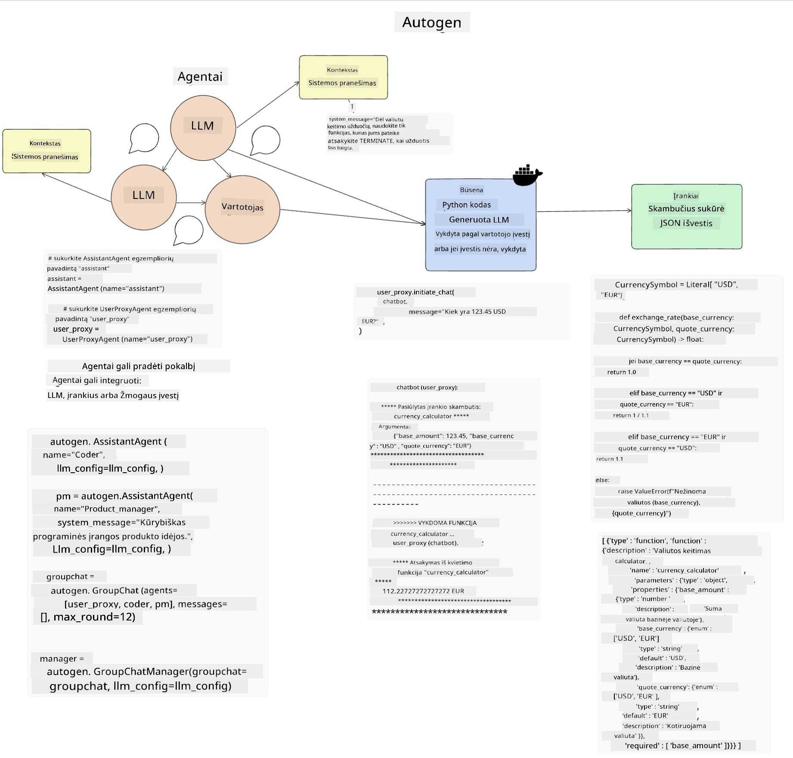
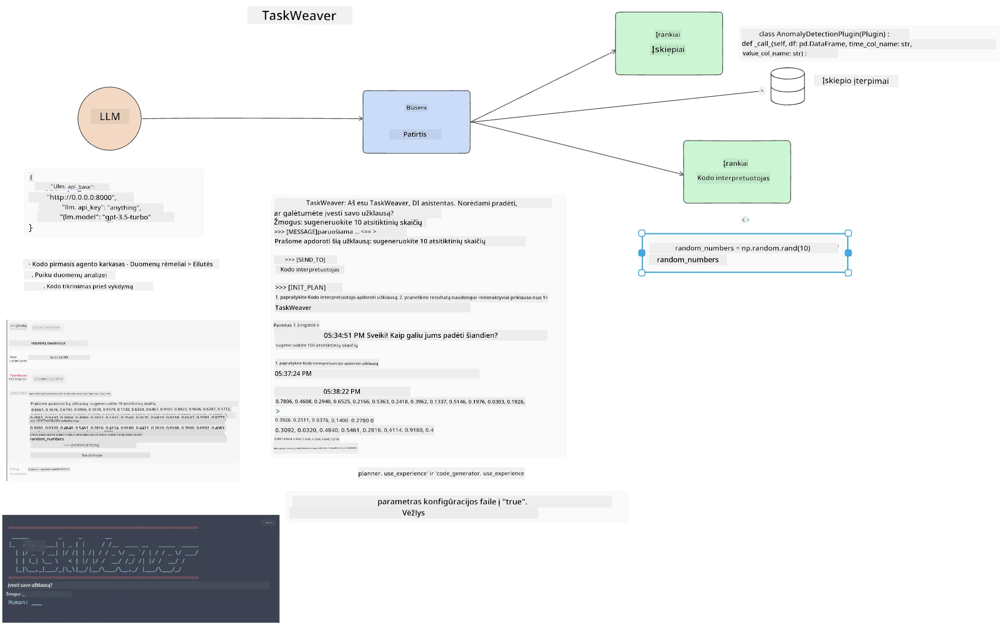
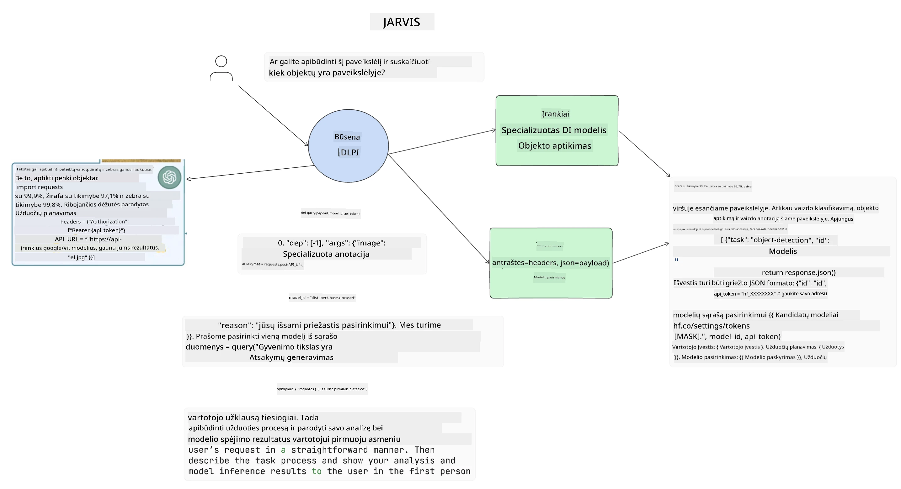

[](https://youtu.be/yAXVW-lUINc?si=bOtW9nL6jc3XJgOM)

## Įvadas

DI agentai yra įdomi generatyvinio DI pažanga, leidžianti dideliems kalbos modeliams (LLM) evoliucionuoti iš asistentų į agentus, galinčius imtis veiksmų. DI agentų karkasai leidžia kūrėjams kurti programas, suteikdami LLM prieigą prie įrankių ir būsenos valdymo. Šie karkasai taip pat pagerina matomumą, leidžiant vartotojams ir kūrėjams stebėti LLM suplanuotus veiksmus, taip gerinant patirties valdymą.

Pamokoje bus aptariamos šios sritys:

- Kas yra DI agentas - Kas iš tiesų yra DI agentas?
- Keturi skirtingi DI agentų karkasai - Kuo jie unikalūs?
- DI agentų taikymas skirtinguose scenarijuose - Kada turėtume naudoti DI agentus?

## Mokymosi tikslai

Baigę šią pamoką galėsite:

- Paaiškinti, kas yra DI agentai ir kaip juos galima naudoti.
- Suprasti populiarių DI agentų karkasų skirtumus ir kuo jie skiriasi.
- Suprasti, kaip veikia DI agentai, kad galėtumėte kurti su jais programas.

## Kas yra DI agentai?

DI agentai yra labai įdomi generatyvinio DI sritis. Su šiuo susižavėjimu kartais atsiranda painiava dėl terminų ir jų taikymo. Kad būtų paprasčiau ir apimtume daugumą įrankių, kurie vadinami DI agentais, naudosime šią apibrėžtį:

DI agentai leidžia dideliems kalbos modeliams (LLM) atlikti užduotis suteikiant jiems prieigą prie **būsenos** ir **įrankių**.



Apibrėžkime šiuos terminus:

**Dideli kalbos modeliai** – tai šio kurso metu minimi modeliai, tokie kaip GPT-3.5, GPT-4, Llama-2 ir kt.

**Būsena** – tai kontekstas, kuriame veikia LLM. LLM naudoja savo ankstesnių veiksmų ir esamą kontekstą, kuris nukreipia jo sprendimų priėmimą tolimesniems veiksmams. DI agentų karkasai leidžia kūrėjams lengviau palaikyti šį kontekstą.

**Įrankiai** – kad užduotis, kurią vartotojas paprašė ir kuri buvo suplanuota LLM, būtų įvykdyta, LLM reikalinga prieiga prie įrankių. Pavyzdžiui, tai gali būti duomenų bazė, API, išorinė programa ar net kitas LLM!

Šie apibrėžimai tikimės suteiks jums tvirtą pagrindą, kai eisime gilintis, kaip jie įgyvendinami. Pažvelkime į keletą skirtingų DI agentų karkasų:

## LangChain agentai

[LangChain agentai](https://python.langchain.com/docs/how_to/#agents?WT.mc_id=academic-105485-koreyst) įgyvendina aukščiau pateiktus apibrėžimus.

Būsenai valdyti naudojama integruota funkcija `AgentExecutor`. Ji gauna apibrėžtą `agent` ir prieinamus `tools`.

`AgentExecutor` taip pat saugo pokalbio istoriją, kad būtų užtikrintas pokalbio kontekstas.



LangChain siūlo [įrankių katalogą](https://integrations.langchain.com/tools?WT.mc_id=academic-105485-koreyst), kurį galite importuoti į savo programą, kad LLM gautų prieigą prie jų. Šiuos įrankius kuria bendruomenė ir LangChain komanda.

Tada galite apibrėžti šiuos įrankius ir perduoti juos `AgentExecutor` funkcijai.

Matomumas yra dar vienas svarbus aspektas kalbant apie DI agentus. Programų kūrėjams svarbu suprasti, kurį įrankį LLM naudoja ir kodėl. Tam LangChain komanda sukūrė LangSmith.

## AutoGen

Kitas DI agentų karkasas, apie kurį kalbėsime, yra [AutoGen](https://microsoft.github.io/autogen/?WT.mc_id=academic-105485-koreyst). AutoGen pagrindinis dėmesys skiriamas pokalbiams. Agentai yra tiek **pokalbių palaikantys**, tiek **pritaikomi**.

**Pokalbių palaikymas** – LLM gali pradėti ir tęsti pokalbį su kitu LLM, kad atliktų užduotį. Tai atliekama kuriant `AssistantAgents` ir suteikiant jiems konkretų sistemos pranešimą.

```python

autogen.AssistantAgent( name="Coder", llm_config=llm_config, ) pm = autogen.AssistantAgent( name="Product_manager", system_message="Creative in software product ideas.", llm_config=llm_config, )

```

**Pritaikomumas** – Agentai gali būti apibrėžti ne tik kaip LLM, bet ir kaip vartotojas ar įrankis. Kaip kūrėjas galite apibrėžti `UserProxyAgent`, kuris atsako už vartotojo sąveiką siekiant surinkti atsiliepimų užduoties vykdymui. Šie atsiliepimai gali tęsti užduoties vykdymą arba jį sustabdyti.

```python
user_proxy = UserProxyAgent(name="user_proxy")
```

### Būsena ir įrankiai

Būsenos keitimui ir valdymui pagalbos agentas generuoja Python kodą, kad užbaigtų užduotį.

Štai pavyzdys, kaip vyksta procesas:



#### LLM apibrėžtas sistemos pranešimu

```python
system_message="For weather related tasks, only use the functions you have been provided with. Reply TERMINATE when the task is done."
```

Šis sistemos pranešimas nukreipia konkretų LLM, kokios funkcijos yra svarbios jo užduočiai. Atminkite, kad AutoGen leidžia turėti kelis apibrėžtus AssistantAgents su skirtingais sistemos pranešimais.

#### Pokalbis pradedamas vartotojo

```python
user_proxy.initiate_chat( chatbot, message="I am planning a trip to NYC next week, can you help me pick out what to wear? ", )

```

Šis žinutė iš user_proxy (žmogaus) pradės agento procesą tyrinėti galimas funkcijas, kurias jis turėtų vykdyti.

#### Funkcija įvykdoma

```bash
chatbot (to user_proxy):

***** Suggested tool Call: get_weather ***** Arguments: {"location":"New York City, NY","time_periond:"7","temperature_unit":"Celsius"} ******************************************************** --------------------------------------------------------------------------------

>>>>>>>> EXECUTING FUNCTION get_weather... user_proxy (to chatbot): ***** Response from calling function "get_weather" ***** 112.22727272727272 EUR ****************************************************************

```

Kai pradinė pokalbio žinutė apdorojama, agentas pasiūlo įrankį, kurį reikia iškviesti. Šiuo atveju tai funkcija `get_weather`. Priklausomai nuo konfigūracijos, ši funkcija gali būti automatiškai įvykdyta ir perskaityta agento arba vykdoma pagal vartotojo įvestį.

Galite rasti [AutoGen kodo pavyzdžių](https://microsoft.github.io/autogen/docs/Examples/?WT.mc_id=academic-105485-koreyst) tolesniam susipažinimui ir pradžiai kurti.

## Taskweaver

Kitas agentų karkasas, kurį nagrinėsime, yra [Taskweaver](https://microsoft.github.io/TaskWeaver/?WT.mc_id=academic-105485-koreyst). Jis žinomas kaip „kodo pirmas“ agentas, nes vietoj griežto darbo su `strings` gali dirbti su Python DataFrame objektais. Tai labai naudinga duomenų analizės ir generavimo užduotyse, pavyzdžiui, kuriant grafikus, diagramas arba generuojant atsitiktinius skaičius.

### Būsena ir įrankiai

Būsenai valdyti TaskWeaver naudoja `Planner` sąvoką. `Planner` yra LLM, kuris gauna vartotojų užklausą ir suplanuoja užduotis, kurias reikia atlikti, kad būtų įvykdyta užklausa.

Užduotims atlikti `Planner` turi prieigą prie įrankių rinkinio, vadinamo `Plugins`. Tai gali būti Python klasės arba bendras kodo interpretatorius. Šie papildiniai saugomi kaip embeddingai, kad LLM galėtų efektyviau ieškoti tinkamo papildinio.



Štai pavyzdys, kaip atrodo papildinys anomalijų aptikimui:

```python
class AnomalyDetectionPlugin(Plugin): def __call__(self, df: pd.DataFrame, time_col_name: str, value_col_name: str):
```

Kodas yra patvirtinamas prieš vykdymą. Kita Taskweaver konteksto valdymo funkcija yra `experience`. Ji leidžia ilgalaikėje YAML bylų saugoti pokalbio kontekstą. Tai gali būti sukonfigūruota taip, kad LLM laikui bėgant tobulėtų tam tikrose užduotyse, jei jis turėjo prieigą prie ankstesnių pokalbių.

## JARVIS

Paskutinis agentų karkasas, kurį apžvelgsime, yra [JARVIS](https://github.com/microsoft/JARVIS?tab=readme-ov-file&WT.mc_id=academic-105485-koreyst). JARVIS unikalus tuo, kad naudoja LLM pokalbio `būsenai` valdyti, o `įrankiai` yra kiti dirbtinio intelekto modeliai. Kiekvienas DI modelis yra specializuotas tam tikroms užduotims atlikti, pvz., objektų atpažinimas, transkribavimas ar paveikslėlių aprašymas.



LLM, kaip bendros paskirties modelis, gauna vartotojo užklausą ir identifikuoja konkrečią užduotį bei bet kokius argumentus/duomenis, reikalingus užduočiai įvykdyti.

```python
[{"task": "object-detection", "id": 0, "dep": [-1], "args": {"image": "e1.jpg" }}]
```

LLM tada suformuoja užklausą tokiu formatu, kad specializuotas DI modelis galėtų ją interpretuoti, pavyzdžiui, JSON formatu. Kai DI modelis pateikia prognozę pagal užduotį, LLM gauna atsakymą.

Jei užduočiai įvykdyti reikalingi keli modeliai, LLM taip pat interpretuoja jų atsakymus, kol sujungia rezultatus ir sugeneruoja atsakymą vartotojui.

Žemiau pateiktas pavyzdys, kaip tai veiktų, kai vartotojas prašo aprašymo ir objektų skaičiaus nuotraukoje:

## Užduotis

Toliau gilinkitės į DI agentų mokymąsi su AutoGen:

- Sukurkite programą, kuri simuliuoja verslo susitikimą su skirtingais edukacinio startuolio skyriais.
- Sukurkite sistemos pranešimus, kurie nukreiptų LLM suprasti skirtingas asmenybes ir prioritetus bei leistų vartotojui pristatyti naują produkto idėją.
- LLM turi generuoti kiekvieno skyriaus papildomus klausimus, kad patobulintų pristatymą ir produkto idėją.

## Mokymasis čia nesibaigia, tęskite kelionę

Baigę šią pamoką, peržiūrėkite mūsų [Generatyvinio DI mokymosi kolekciją](https://aka.ms/genai-collection?WT.mc_id=academic-105485-koreyst), kad toliau keltumėte savo generatyvinio DI žinias!

---

<!-- CO-OP TRANSLATOR DISCLAIMER START -->
**Atsakomybės apribojimas**:  
Šis dokumentas buvo išverstas naudojant dirbtinio intelekto vertimo paslaugą [Co-op Translator](https://github.com/Azure/co-op-translator). Nors siekiame tikslumo, atkreipkite dėmesį, kad automatizuoti vertimai gali turėti klaidų arba netikslumų. Originalus dokumentas jo gimtąja kalba turėtų būti laikomas autoritetingu šaltiniu. Svarbiai informacijai rekomenduojame naudoti profesionalų žmogaus atliktą vertimą. Mes neatsakome už bet kokius nesusipratimus ar klaidingus interpretavimus, kylančius dėl šio vertimo naudojimo.
<!-- CO-OP TRANSLATOR DISCLAIMER END -->