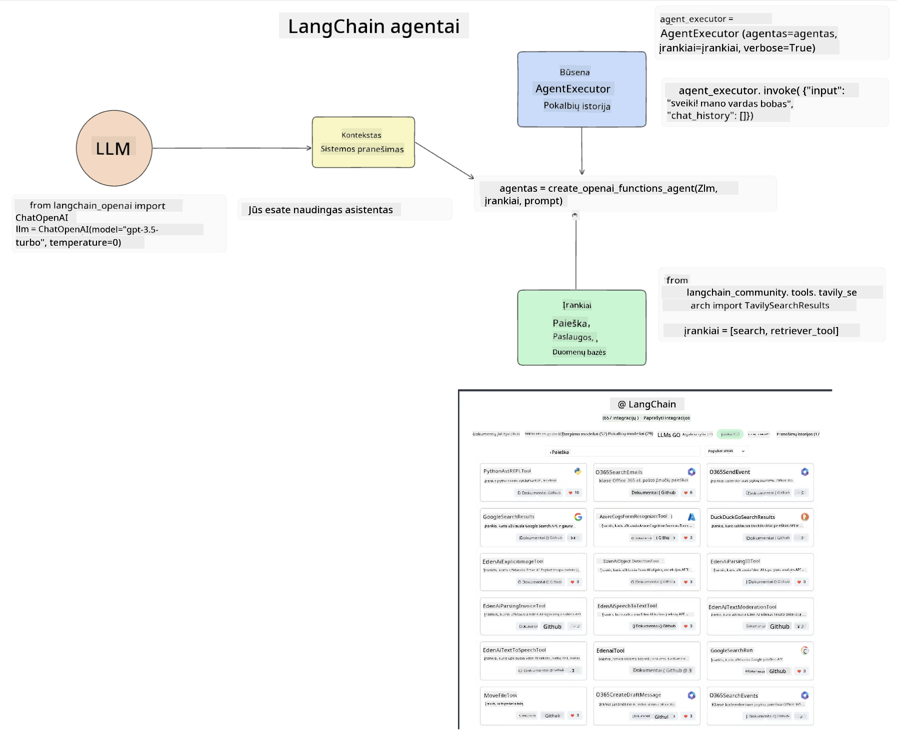

<!--
CO_OP_TRANSLATOR_METADATA:
{
  "original_hash": "8e8d1f6a63da606af7176a87ff8e92b6",
  "translation_date": "2025-10-18T02:33:07+00:00",
  "source_file": "17-ai-agents/README.md",
  "language_code": "lt"
}
-->
[](https://youtu.be/yAXVW-lUINc?si=bOtW9nL6jc3XJgOM)

## Įvadas

Dirbtinio intelekto agentai yra įdomi Generatyvaus DI srities naujovė, leidžianti dideliems kalbos modeliams (LLM) pereiti nuo asistentų prie agentų, galinčių atlikti veiksmus. DI agentų sistemos suteikia galimybę kūrėjams kurti programas, kurios leidžia LLM naudotis įrankiais ir valdyti būseną. Šios sistemos taip pat pagerina matomumą, leidžiant vartotojams ir kūrėjams stebėti LLM planuojamus veiksmus, taip gerinant patirties valdymą.

Pamokoje bus aptariamos šios sritys:

- Suprasti, kas yra DI agentas - kas tiksliai yra DI agentas?
- Išnagrinėti keturias skirtingas DI agentų sistemas - kuo jos unikalios?
- Taikyti šiuos DI agentus skirtingiems naudojimo atvejams - kada turėtume naudoti DI agentus?

## Mokymosi tikslai

Po šios pamokos galėsite:

- Paaiškinti, kas yra DI agentai ir kaip jie gali būti naudojami.
- Suprasti kai kurių populiarių DI agentų sistemų skirtumus ir jų ypatybes.
- Suprasti, kaip veikia DI agentai, kad galėtumėte kurti programas su jais.

## Kas yra DI agentai?

DI agentai yra labai įdomi Generatyvaus DI sritis. Su šiuo susidomėjimu kartais kyla terminų ir jų taikymo painiava. Kad viskas būtų paprasta ir apimtų daugumą įrankių, susijusių su DI agentais, mes naudosime šį apibrėžimą:

DI agentai leidžia dideliems kalbos modeliams (LLM) atlikti užduotis, suteikdami jiems prieigą prie **būsenos** ir **įrankių**.


Apibrėžkime šiuos terminus:

**Dideli kalbos modeliai** - Tai modeliai, apie kuriuos kalbama viso kurso metu, tokie kaip GPT-3.5, GPT-4, Llama-2 ir kt.

**Būsena** - Tai kontekstas, kuriame dirba LLM. LLM naudoja savo ankstesnių veiksmų ir dabartinio konteksto informaciją, kad galėtų priimti sprendimus dėl tolesnių veiksmų. DI agentų sistemos leidžia kūrėjams lengviau išlaikyti šį kontekstą.

**Įrankiai** - Norėdamas atlikti vartotojo prašomą užduotį, kurią LLM suplanavo, LLM turi turėti prieigą prie įrankių. Kai kurie įrankių pavyzdžiai gali būti duomenų bazė, API, išorinė programa ar net kitas LLM!

Šie apibrėžimai turėtų suteikti jums gerą pagrindą, kai toliau nagrinėsime, kaip jie įgyvendinami. Pažvelkime į keletą skirtingų DI agentų sistemų:

## LangChain agentai

[LangChain agentai](https://python.langchain.com/docs/how_to/#agents?WT.mc_id=academic-105485-koreyst) yra mūsų pateiktų apibrėžimų įgyvendinimas.

Norint valdyti **būseną**, naudojama įmontuota funkcija, vadinama `AgentExecutor`. Ji priima apibrėžtą `agent` ir jam prieinamus `tools`.

`AgentExecutor` taip pat saugo pokalbių istoriją, kad pateiktų pokalbio kontekstą.



LangChain siūlo [įrankių katalogą](https://integrations.langchain.com/tools?WT.mc_id=academic-105485-koreyst), kurį galima importuoti į jūsų programą, kad LLM galėtų jais naudotis. Šiuos įrankius kuria bendruomenė ir LangChain komanda.

Tuomet galite apibrėžti šiuos įrankius ir perduoti juos `AgentExecutor`.

Matomumas yra dar vienas svarbus aspektas, kalbant apie DI agentus. Programų kūrėjams svarbu suprasti, kokį įrankį LLM naudoja ir kodėl. Tam LangChain komanda sukūrė LangSmith.

## AutoGen

Kita DI agentų sistema, kurią aptarsime, yra [AutoGen](https://microsoft.github.io/autogen/?WT.mc_id=academic-105485-koreyst). Pagrindinis AutoGen dėmesys skiriamas pokalbiams. Agentai yra tiek **pokalbūs**, tiek **pritaikomi**.

**Pokalbūs -** LLM gali pradėti ir tęsti pokalbį su kitu LLM, kad atliktų užduotį. Tai daroma sukuriant `AssistantAgents` ir suteikiant jiems specifinę sistemos žinutę.

```python

autogen.AssistantAgent( name="Coder", llm_config=llm_config, ) pm = autogen.AssistantAgent( name="Product_manager", system_message="Creative in software product ideas.", llm_config=llm_config, )

```

**Pritaikomi** - Agentai gali būti apibrėžti ne tik kaip LLM, bet ir kaip vartotojas ar įrankis. Kaip kūrėjas, galite apibrėžti `UserProxyAgent`, kuris yra atsakingas už sąveiką su vartotoju, siekiant gauti atsiliepimus apie užduoties atlikimą. Šie atsiliepimai gali tęsti užduoties vykdymą arba jį sustabdyti.

```python
user_proxy = UserProxyAgent(name="user_proxy")
```

### Būsena ir įrankiai

Norėdamas keisti ir valdyti būseną, asistentas agentas generuoja Python kodą, kad atliktų užduotį.

Štai proceso pavyzdys:


#### LLM apibrėžtas su sistemos žinute

```python
system_message="For weather related tasks, only use the functions you have been provided with. Reply TERMINATE when the task is done."
```

Ši sistemos žinutė nurodo konkrečiam LLM, kurios funkcijos yra svarbios jo užduočiai. Atminkite, kad su AutoGen galite turėti kelis apibrėžtus AssistantAgents su skirtingomis sistemos žinutėmis.

#### Pokalbį inicijuoja vartotojas

```python
user_proxy.initiate_chat( chatbot, message="I am planning a trip to NYC next week, can you help me pick out what to wear? ", )

```

Ši žinutė iš user_proxy (Žmogaus) yra tai, kas pradės agento procesą ieškoti galimų funkcijų, kurias jis turėtų vykdyti.

#### Funkcija vykdoma

```bash
chatbot (to user_proxy):

***** Suggested tool Call: get_weather ***** Arguments: {"location":"New York City, NY","time_periond:"7","temperature_unit":"Celsius"} ******************************************************** --------------------------------------------------------------------------------

>>>>>>>> EXECUTING FUNCTION get_weather... user_proxy (to chatbot): ***** Response from calling function "get_weather" ***** 112.22727272727272 EUR ****************************************************************

```

Kai pradinė žinutė yra apdorota, agentas pasiūlys įrankį, kurį reikia iškviesti. Šiuo atveju tai yra funkcija, vadinama `get_weather`. Priklausomai nuo jūsų konfigūracijos, ši funkcija gali būti automatiškai vykdoma ir skaitoma agento arba vykdoma pagal vartotojo įvestį.

Galite rasti [AutoGen kodo pavyzdžių sąrašą](https://microsoft.github.io/autogen/docs/Examples/?WT.mc_id=academic-105485-koreyst), kad galėtumėte toliau tyrinėti, kaip pradėti kurti.

## Taskweaver

Kita agentų sistema, kurią nagrinėsime, yra [Taskweaver](https://microsoft.github.io/TaskWeaver/?WT.mc_id=academic-105485-koreyst). Ji vadinama "kodo pirmumo" agentu, nes vietoj darbo tik su `strings`, ji gali dirbti su DataFrames Python kalboje. Tai tampa ypač naudinga duomenų analizės ir generavimo užduotims, tokioms kaip grafikai, diagramos ar atsitiktinių skaičių generavimas.

### Būsena ir įrankiai

Norėdamas valdyti pokalbio būseną, TaskWeaver naudoja `Planner` koncepciją. `Planner` yra LLM, kuris priima vartotojų prašymą ir sudaro užduočių planą, reikalingą šiam prašymui įvykdyti.

Norėdamas atlikti užduotis, `Planner` turi prieigą prie įrankių rinkinio, vadinamo `Plugins`. Tai gali būti Python klasės arba bendras kodo interpretatorius. Šie įskiepiai saugomi kaip įterpiniai, kad LLM galėtų geriau ieškoti tinkamo įskiepio.


Štai įskiepio pavyzdys, skirtas anomalijų aptikimui:

```python
class AnomalyDetectionPlugin(Plugin): def __call__(self, df: pd.DataFrame, time_col_name: str, value_col_name: str):
```

Kodas yra patikrinamas prieš vykdymą. Kita funkcija, skirta valdyti kontekstą Taskweaver, yra `experience`. Patirtis leidžia pokalbio kontekstą saugoti ilgalaikėje perspektyvoje YAML faile. Tai galima sukonfigūruoti taip, kad LLM laikui bėgant tobulėtų tam tikrose užduotyse, atsižvelgiant į ankstesnius pokalbius.

## JARVIS

Paskutinė agentų sistema, kurią nagrinėsime, yra [JARVIS](https://github.com/microsoft/JARVIS?tab=readme-ov-file?WT.mc_id=academic-105485-koreyst). JARVIS išsiskiria tuo, kad naudoja LLM pokalbio būsenai valdyti, o `tools` yra kiti DI modeliai. Kiekvienas DI modelis yra specializuotas tam tikroms užduotims, tokioms kaip objektų atpažinimas, transkripcija ar vaizdų aprašymas.


LLM, būdamas bendros paskirties modelis, gauna vartotojo prašymą ir nustato konkrečią užduotį bei bet kokius argumentus/duomenis, reikalingus užduočiai atlikti.

```python
[{"task": "object-detection", "id": 0, "dep": [-1], "args": {"image": "e1.jpg" }}]
```

LLM tada suformuoja prašymą taip, kad specializuotas DI modelis galėtų jį interpretuoti, pavyzdžiui, JSON formatu. Kai DI modelis grąžina savo prognozę pagal užduotį, LLM gauna atsakymą.

Jei užduočiai atlikti reikia kelių modelių, LLM taip pat interpretuos šių modelių atsakymus prieš sujungdamas juos į galutinį atsakymą vartotojui.

Žemiau pateiktas pavyzdys parodo, kaip tai veiktų, kai vartotojas prašo aprašymo ir objektų skaičiaus paveikslėlyje:

## Užduotis

Norėdami tęsti mokymąsi apie DI agentus, galite kurti su AutoGen:

- Programą, kuri simuliuoja verslo susitikimą su skirtingais švietimo startuolio departamentais.
- Sukurkite sistemos žinutes, kurios padėtų LLM suprasti skirtingas asmenybes ir prioritetus, ir leistų vartotojui pristatyti naujo produkto idėją.
- LLM turėtų generuoti tolesnius klausimus iš kiekvieno departamento, kad patobulintų ir pagerintų pristatymą bei produkto idėją.

## Mokymasis nesibaigia čia, tęskite kelionę

Baigę šią pamoką, apsilankykite mūsų [Generatyvaus DI mokymosi kolekcijoje](https://aka.ms/genai-collection?WT.mc_id=academic-105485-koreyst), kad toliau gilintumėte savo žinias apie Generatyvų DI!

---

**Atsakomybės apribojimas**:  
Šis dokumentas buvo išverstas naudojant AI vertimo paslaugą [Co-op Translator](https://github.com/Azure/co-op-translator). Nors siekiame tikslumo, prašome atkreipti dėmesį, kad automatiniai vertimai gali turėti klaidų ar netikslumų. Originalus dokumentas jo gimtąja kalba turėtų būti laikomas autoritetingu šaltiniu. Dėl svarbios informacijos rekomenduojama profesionali žmogaus vertimo paslauga. Mes neprisiimame atsakomybės už nesusipratimus ar neteisingus aiškinimus, atsiradusius naudojant šį vertimą.