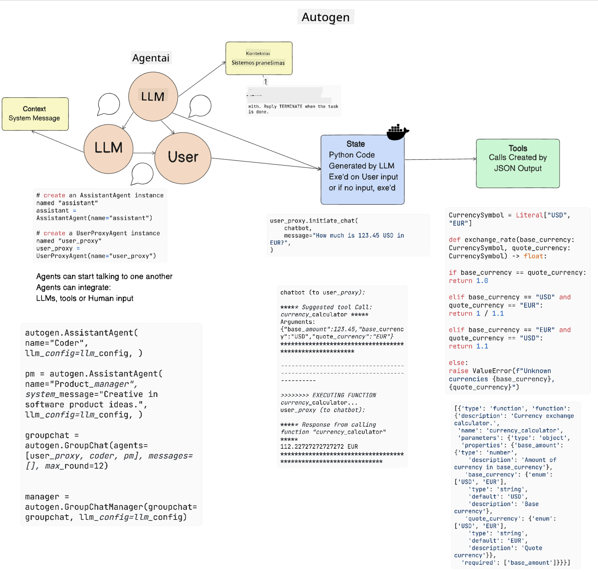
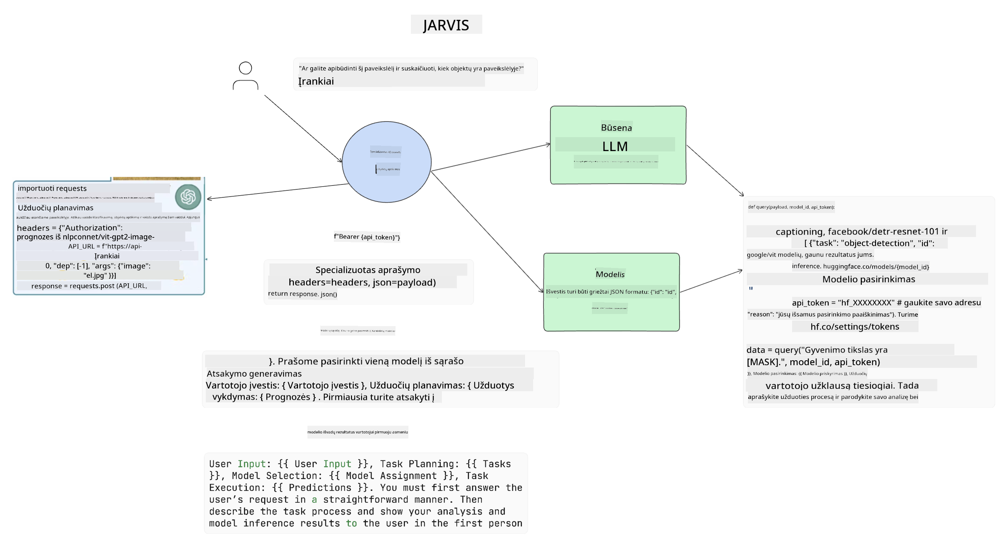

<!--
CO_OP_TRANSLATOR_METADATA:
{
  "original_hash": "11f03c81f190d9cbafd0f977dcbede6c",
  "translation_date": "2025-08-25T12:42:32+00:00",
  "source_file": "17-ai-agents/README.md",
  "language_code": "lt"
}
-->
[](https://aka.ms/gen-ai-lesson17-gh?WT.mc_id=academic-105485-koreyst)

## Įvadas

Dirbtinio intelekto agentai yra įdomi generatyvaus DI sritis, leidžianti dideliems kalbos modeliams (LLM) pereiti nuo asistentų prie agentų, galinčių atlikti veiksmus. DI agentų karkasai leidžia kūrėjams kurti programas, kurios suteikia LLM prieigą prie įrankių ir būsenos valdymo. Šie karkasai taip pat pagerina matomumą, leidžiant vartotojams ir kūrėjams stebėti LLM planuojamus veiksmus, taip gerinant patirties valdymą.

Šioje pamokoje aptarsime šias temas:

- Kas yra DI agentas – ką tiksliai reiškia DI agentas?
- Keturi skirtingi DI agentų karkasai – kuo jie išsiskiria?
- DI agentų taikymas įvairiose situacijose – kada verta juos naudoti?

## Mokymosi tikslai

Po šios pamokos galėsite:

- Paaiškinti, kas yra DI agentai ir kaip juos galima naudoti.
- Suprasti kai kurių populiarių DI agentų karkasų skirtumus ir ypatybes.
- Suprasti, kaip veikia DI agentai, kad galėtumėte kurti programas su jais.

## Kas yra DI agentai?

DI agentai – tai labai įdomi generatyvaus DI sritis. Dėl šio susidomėjimo kartais kyla painiava dėl terminų ir jų taikymo. Kad būtų paprasčiau ir apimtume daugumą įrankių, vadinamų DI agentais, naudosime šį apibrėžimą:

DI agentai leidžia dideliems kalbos modeliams (LLM) atlikti užduotis, suteikiant jiems prieigą prie **būsenos** ir **įrankių**.


Paaiškinkime šiuos terminus:

**Dideli kalbos modeliai** – tai modeliai, apie kuriuos kalbame viso kurso metu, tokie kaip GPT-3.5, GPT-4, Llama-2 ir kt.

**Būsena** – tai kontekstas, kuriame LLM veikia. LLM naudoja ankstesnių veiksmų ir dabartinį kontekstą, kad priimtų sprendimus dėl kitų veiksmų. DI agentų karkasai leidžia kūrėjams lengviau išlaikyti šį kontekstą.

**Įrankiai** – norint įvykdyti vartotojo prašomą užduotį, kurią LLM suplanavo, jam reikia prieigos prie įrankių. Įrankiai gali būti duomenų bazė, API, išorinė programa ar net kitas LLM!

Šie apibrėžimai padės geriau suprasti, kaip agentai veikia. Pažvelkime į keletą skirtingų DI agentų karkasų:

## LangChain agentai

[LangChain Agents](https://python.langchain.com/docs/how_to/#agents?WT.mc_id=academic-105485-koreyst) – tai mūsų apibrėžimų įgyvendinimas.

Norint valdyti **būseną**, naudojama integruota funkcija `AgentExecutor`. Ji priima apibrėžtą `agent` ir jam prieinamus `tools`.

`Agent Executor` taip pat saugo pokalbio istoriją, kad būtų išlaikytas pokalbio kontekstas.


LangChain siūlo [įrankių katalogą](https://integrations.langchain.com/tools?WT.mc_id=academic-105485-koreyst), kurį galima importuoti į savo programą ir prie kurio LLM gali gauti prieigą. Įrankius kuria bendruomenė ir LangChain komanda.

Galite apibrėžti šiuos įrankius ir perduoti juos `Agent Executor`.

Matomumas yra dar vienas svarbus aspektas kalbant apie DI agentus. Programų kūrėjams svarbu suprasti, kokį įrankį LLM naudoja ir kodėl. Tam LangChain komanda sukūrė LangSmith.

## AutoGen

Kitas DI agentų karkasas, kurį aptarsime, yra [AutoGen](https://microsoft.github.io/autogen/?WT.mc_id=academic-105485-koreyst). AutoGen pagrindinis dėmesys – pokalbiai. Agentai yra ir **bendraujantys**, ir **pritaikomi**.

**Bendraujantys –** LLM gali pradėti ir tęsti pokalbį su kitu LLM, kad įvykdytų užduotį. Tam kuriami `AssistantAgents` ir jiems suteikiama konkreti sistemos žinutė.

```python

autogen.AssistantAgent( name="Coder", llm_config=llm_config, ) pm = autogen.AssistantAgent( name="Product_manager", system_message="Creative in software product ideas.", llm_config=llm_config, )

```

**Pritaikomi** – agentai gali būti ne tik LLM, bet ir vartotojas ar įrankis. Kūrėjas gali apibrėžti `UserProxyAgent`, kuris atsakingas už sąveiką su vartotoju, siekiant gauti grįžtamąjį ryšį užduočiai atlikti. Šis grįžtamasis ryšys gali tęsti užduoties vykdymą arba jį sustabdyti.

```python
user_proxy = UserProxyAgent(name="user_proxy")
```

### Būsena ir įrankiai

Norint keisti ir valdyti būseną, asistentas agentas generuoja Python kodą užduočiai atlikti.

Štai pavyzdys, kaip tai vyksta:



#### LLM apibrėžtas su sistemos žinute

```python
system_message="For weather related tasks, only use the functions you have been provided with. Reply TERMINATE when the task is done."
```

Ši sistemos žinutė nurodo konkrečiam LLM, kokios funkcijos yra svarbios jo užduočiai. Atminkite, kad su AutoGen galite turėti kelis AssistantAgents su skirtingomis sistemos žinutėmis.

#### Pokalbį inicijuoja vartotojas

```python
user_proxy.initiate_chat( chatbot, message="I am planning a trip to NYC next week, can you help me pick out what to wear? ", )

```

Ši žinutė iš user_proxy (žmogaus) pradeda agento procesą, kad jis ieškotų, kokias funkcijas turėtų vykdyti.

#### Funkcija vykdoma

```bash
chatbot (to user_proxy):

***** Suggested tool Call: get_weather ***** Arguments: {"location":"New York City, NY","time_periond:"7","temperature_unit":"Celsius"} ******************************************************** --------------------------------------------------------------------------------

>>>>>>>> EXECUTING FUNCTION get_weather... user_proxy (to chatbot): ***** Response from calling function "get_weather" ***** 112.22727272727272 EUR ****************************************************************

```

Kai pradinė žinutė apdorojama, agentas pasiūlo, kokį įrankį kviesti. Šiuo atveju – funkciją `get_weather`. Priklausomai nuo jūsų konfigūracijos, ši funkcija gali būti automatiškai vykdoma ir perskaitoma agento arba vykdoma pagal vartotojo įvestį.

Daugiau [AutoGen kodų pavyzdžių](https://microsoft.github.io/autogen/docs/Examples/?WT.mc_id=academic-105485-koreyst) rasite, jei norite giliau susipažinti su kūrimu.

## Taskweaver

Kitas agentų karkasas, kurį aptarsime, yra [Taskweaver](https://microsoft.github.io/TaskWeaver/?WT.mc_id=academic-105485-koreyst). Jis vadinamas „code-first“ agentu, nes vietoj darbo tik su `strings` gali dirbti su Python DataFrame. Tai labai naudinga duomenų analizei ir generavimui, pavyzdžiui, kuriant grafikus, diagramas ar generuojant atsitiktinius skaičius.

### Būsena ir įrankiai

Norint valdyti pokalbio būseną, Taskweaver naudoja `Planner` koncepciją. `Planner` – tai LLM, kuris priima vartotojo užklausą ir suplanuoja užduotis, kurias reikia atlikti, kad užklausa būtų įvykdyta.

Užduotims atlikti `Planner` turi prieigą prie įrankių kolekcijos, vadinamos `Plugins`. Tai gali būti Python klasės arba bendras kodo interpretatorius. Šie papildiniai saugomi kaip embedding'ai, kad LLM galėtų lengviau rasti tinkamą pluginą.


Štai pavyzdys pluginui, skirtam anomalijų aptikimui:

```python
class AnomalyDetectionPlugin(Plugin): def __call__(self, df: pd.DataFrame, time_col_name: str, value_col_name: str):
```

Kodas patikrinamas prieš vykdymą. Dar viena funkcija, padedanti valdyti kontekstą Taskweaver, yra `experience`. Experience leidžia pokalbio kontekstą išsaugoti ilgam laikui YAML faile. Tai galima konfigūruoti, kad LLM laikui bėgant tobulėtų tam tikrose užduotyse, remdamasis ankstesniais pokalbiais.

## JARVIS

Paskutinis agentų karkasas, kurį aptarsime, yra [JARVIS](https://github.com/microsoft/JARVIS?tab=readme-ov-file?WT.mc_id=academic-105485-koreyst). JARVIS išskirtinumas – jis naudoja LLM pokalbio būsenai valdyti, o `tools` yra kiti DI modeliai. Kiekvienas DI modelis yra specializuotas tam tikrai užduočiai, pavyzdžiui, objektų atpažinimui, transkripcijai ar paveikslėlių aprašymui.



LLM, būdamas universaliu modeliu, gauna vartotojo užklausą ir nustato konkrečią užduotį bei reikalingus argumentus/duomenis jai atlikti.

```python
[{"task": "object-detection", "id": 0, "dep": [-1], "args": {"image": "e1.jpg" }}]
```

LLM tada suformuoja užklausą taip, kad specializuotas DI modelis ją suprastų, pavyzdžiui, JSON formatu. Kai DI modelis grąžina prognozę pagal užduotį, LLM gauna atsakymą.

Jei užduočiai atlikti reikia kelių modelių, LLM taip pat interpretuos jų atsakymus, prieš sujungdamas juos ir pateikdamas vartotojui galutinį atsakymą.

Žemiau pateiktas pavyzdys rodo, kaip tai veiktų, kai vartotojas prašo aprašymo ir objektų skaičiaus paveikslėlyje:

## Užduotis

Norėdami toliau mokytis apie DI agentus, galite kurti su AutoGen:

- Programą, kuri simuliuoja verslo susitikimą tarp skirtingų švietimo startuolio skyrių.
- Sukurkite sistemos žinutes, kurios padeda LLM suprasti skirtingas personas ir prioritetus, ir leidžia vartotojui pristatyti naują produkto idėją.
- LLM turėtų sugeneruoti papildomus klausimus iš kiekvieno skyriaus, kad patikslintų ir pagerintų pristatymą bei produkto idėją.

## Mokymasis nesibaigia čia – tęskite kelionę

Baigę šią pamoką, peržiūrėkite mūsų [Generatyvaus DI mokymosi kolekciją](https://aka.ms/genai-collection?WT.mc_id=academic-105485-koreyst), kad toliau gilintumėte žinias apie generatyvų DI!

---

**Atsakomybės atsisakymas**:  
Šis dokumentas buvo išverstas naudojant dirbtinio intelekto vertimo paslaugą [Co-op Translator](https://github.com/Azure/co-op-translator). Nors siekiame tikslumo, prašome atkreipti dėmesį, kad automatiniai vertimai gali turėti klaidų ar netikslumų. Originalus dokumentas jo gimtąja kalba turėtų būti laikomas autoritetingu šaltiniu. Kritinei informacijai rekomenduojame profesionalų žmogaus vertimą. Mes neatsakome už nesusipratimus ar neteisingą interpretaciją, kylančią dėl šio vertimo naudojimo.