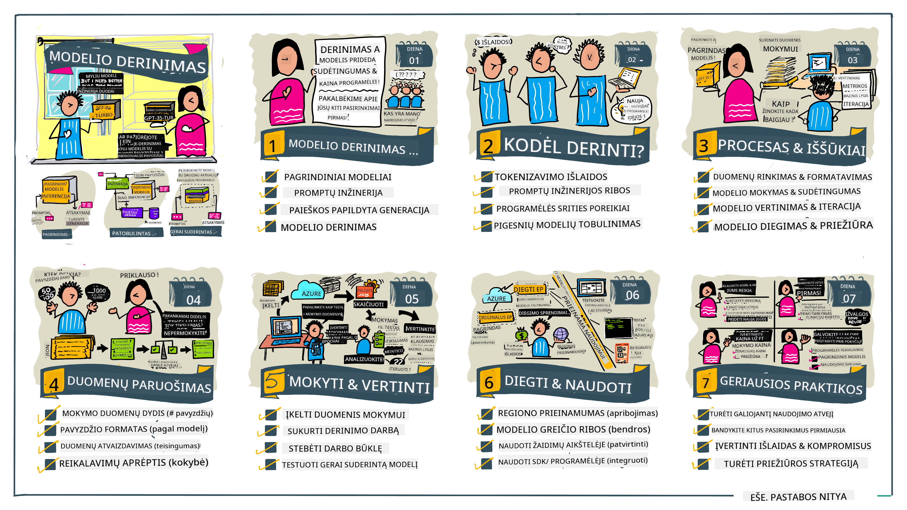

<!--
CO_OP_TRANSLATOR_METADATA:
{
  "original_hash": "68664f7e754a892ae1d8d5e2b7bd2081",
  "translation_date": "2025-08-25T12:43:06+00:00",
  "source_file": "18-fine-tuning/README.md",
  "language_code": "lt"
}
-->

# LLM modelio pritaikymas (Fine-Tuning)

Naudojant didelius kalbos modelius generatyviajai dirbtiniam intelektui kurti, kyla naujų iššūkių. Vienas pagrindinių – užtikrinti atsakymų kokybę (tikslumą ir aktualumą), kai modelis generuoja turinį pagal vartotojo užklausą. Ankstesnėse pamokose aptarėme tokias technikas kaip promptų inžinerija ir paieška paremta generacija (retrieval-augmented generation), kurios sprendžia šią problemą _modifikuojant prompto įvestį_ esamam modeliui.

Šiandienos pamokoje aptarsime trečią techniką – **pritaikymą (fine-tuning)**, kuri siekia išspręsti šį iššūkį _pertreniruojant patį modelį_ su papildomais duomenimis. Panagrinėkime detaliau.

## Mokymosi tikslai

Šioje pamokoje supažindinsime su pritaikymo (fine-tuning) sąvoka iš anksto apmokytiems kalbos modeliams, aptarsime šio metodo privalumus ir iššūkius, bei pateiksime rekomendacijas, kada ir kaip naudoti pritaikymą, norint pagerinti generatyvaus DI modelių veikimą.

Pamokos pabaigoje galėsite atsakyti į šiuos klausimus:

- Kas yra kalbos modelių pritaikymas (fine-tuning)?
- Kada ir kodėl verta taikyti pritaikymą?
- Kaip galima pritaikyti iš anksto apmokytą modelį?
- Kokie yra pritaikymo ribojimai?

Pasiruošę? Pradėkime.

## Iliustruotas gidas

Norite iš anksto pamatyti, ką aptarsime? Peržvelkite šį iliustruotą gidą, kuris aprašo mokymosi kelią šioje pamokoje – nuo pagrindinių sąvokų ir motyvacijos pritaikymui, iki proceso ir geriausių praktikų supratimo, kaip atlikti pritaikymą. Tai įdomi tema, todėl nepamirškite peržiūrėti [Resursų](./RESOURCES.md?WT.mc_id=academic-105485-koreyst) puslapio, kuriame rasite papildomų nuorodų savarankiškam mokymuisi!

## Kas yra kalbos modelių pritaikymas (fine-tuning)?

Pagal apibrėžimą, dideli kalbos modeliai yra _iš anksto apmokyti_ su dideliais tekstų kiekiais, surinktais iš įvairių šaltinių, įskaitant internetą. Kaip jau sužinojome ankstesnėse pamokose, norint pagerinti modelio atsakymų kokybę į vartotojo klausimus („promptus“), reikia tokių technikų kaip _promptų inžinerija_ ar _paieška paremta generacija_.

Viena populiari promptų inžinerijos technika – suteikti modeliui daugiau nurodymų, ko tikimasi atsakyme, pateikiant _instrukcijas_ (aiškūs nurodymai) arba _kelis pavyzdžius_ (netiesioginiai nurodymai). Tai vadinama _few-shot learning_, tačiau ši technika turi du ribojimus:

- Modelio ženkliukų (tokenų) limitai gali apriboti, kiek pavyzdžių galite pateikti, ir sumažinti efektyvumą.
- Modelio ženkliukų (tokenų) kaina gali padidėti, jei prie kiekvieno prompto reikia pridėti pavyzdžių, o tai riboja lankstumą.

Pritaikymas (fine-tuning) – tai įprasta mašininio mokymosi praktika, kai paimamas iš anksto apmokytas modelis ir pertreniruojamas su naujais duomenimis, kad pagerėtų jo veikimas konkrečioje užduotyje. Kalbos modelių kontekste galime pritaikyti iš anksto apmokytą modelį _su specialiai atrinktais pavyzdžiais konkrečiai užduočiai ar taikymo sričiai_, taip sukuriant **individualų modelį**, kuris gali būti tikslesnis ir aktualesnis tam tikrai užduočiai ar sričiai. Papildomas pritaikymo privalumas – sumažėja pavyzdžių poreikis few-shot mokymuisi, todėl sumažėja ženkliukų (tokenų) naudojimas ir susijusios išlaidos.

## Kada ir kodėl verta pritaikyti modelius?

Šiame kontekste, kalbėdami apie pritaikymą, turime omenyje **prižiūrimą** pritaikymą, kai pertreniruojama **pridedant naujų duomenų**, kurie nebuvo pradinėje mokymo duomenų aibėje. Tai skiriasi nuo neprižiūrimo pritaikymo, kai modelis pertreniruojamas su tais pačiais duomenimis, bet su kitais hiperparametrais.

Svarbu atsiminti, kad pritaikymas – pažangi technika, reikalaujanti tam tikros patirties, norint pasiekti norimų rezultatų. Jei pritaikymas atliekamas netinkamai, jis gali ne tik nesuteikti laukiamų patobulinimų, bet ir pabloginti modelio veikimą jūsų pasirinktoje srityje.

Todėl prieš mokantis „kaip“ pritaikyti kalbos modelius, reikia žinoti „kodėl“ verta rinktis šį kelią ir „kada“ pradėti pritaikymo procesą. Užduokite sau šiuos klausimus:

- **Naudojimo atvejis**: Koks jūsų _naudojimo atvejis_ pritaikymui? Kurią dabartinio iš anksto apmokyto modelio savybę norite pagerinti?
- **Alternatyvos**: Ar bandėte _kitas technikas_, kad pasiektumėte norimų rezultatų? Naudokite jas kaip atskaitos tašką palyginimui.
  - Promptų inžinerija: Išbandykite few-shot promptus su aktualių atsakymų pavyzdžiais. Įvertinkite atsakymų kokybę.
  - Paieška paremta generacija: Pabandykite papildyti promptus užklausų rezultatais, gautais ieškant jūsų duomenyse. Įvertinkite atsakymų kokybę.
- **Išlaidos**: Ar įvertinote pritaikymo kaštus?
  - Pritaikomumas – ar iš anksto apmokytas modelis leidžia pritaikymą?
  - Pastangos – duomenų paruošimas, modelio vertinimas ir tobulinimas.
  - Skaičiavimai – pritaikymo užduočių vykdymas ir pritaikyto modelio diegimas.
  - Duomenys – ar turite pakankamai kokybiškų pavyzdžių, kad pritaikymas turėtų įtakos?
- **Nauda**: Ar įsitikinote, kad pritaikymas duos naudos?
  - Kokybė – ar pritaikytas modelis pranoko atskaitos tašką?
  - Kaina – ar sumažėja ženkliukų (tokenų) naudojimas supaprastinus promptus?
  - Praplėtimas – ar galite pritaikyti bazinį modelį naujoms sritims?

Atsakę į šiuos klausimus, galėsite nuspręsti, ar pritaikymas yra tinkamas jūsų atvejui. Idealiu atveju, verta rinktis tik tada, kai nauda viršija kaštus. Nusprendę tęsti, metas pagalvoti, _kaip_ galite pritaikyti iš anksto apmokytą modelį.

Norite daugiau įžvalgų apie sprendimų priėmimą? Peržiūrėkite [To fine-tune or not to fine-tune](https://www.youtube.com/watch?v=0Jo-z-MFxJs)

## Kaip galime pritaikyti iš anksto apmokytą modelį?

Norint pritaikyti iš anksto apmokytą modelį, jums reikės:

- iš anksto apmokyto modelio, kurį norite pritaikyti
- duomenų rinkinio pritaikymui
- mokymo aplinkos pritaikymo užduočiai vykdyti
- talpinimo aplinkos pritaikytam modeliui diegti

## Pritaikymas praktiškai

Toliau pateikti resursai – tai žingsnis po žingsnio pamokos, kurios padės išbandyti tikrą pavyzdį su pasirinktu modeliu ir specialiai atrinktu duomenų rinkiniu. Norint atlikti šias pamokas, reikės paskyros pas konkretų tiekėją ir prieigos prie atitinkamo modelio bei duomenų rinkinių.

| Tiekėjas     | Pamoka                                                                                                                                                                       | Aprašymas                                                                                                                                                                                                                                                                                                                                                                                                                        |
| ------------ | ------------------------------------------------------------------------------------------------------------------------------------------------------------------------------ | ---------------------------------------------------------------------------------------------------------------------------------------------------------------------------------------------------------------------------------------------------------------------------------------------------------------------------------------------------------------------------------------------------------------------------------- |
| OpenAI       | [How to fine-tune chat models](https://github.com/openai/openai-cookbook/blob/main/examples/How_to_finetune_chat_models.ipynb?WT.mc_id=academic-105485-koreyst)                | Sužinokite, kaip pritaikyti `gpt-35-turbo` konkrečiai sričiai („receptų asistentas“): paruoškite mokymo duomenis, vykdykite pritaikymo užduotį ir naudokite pritaikytą modelį užklausoms.                                                                                                                                                                                                                                              |
| Azure OpenAI | [GPT 3.5 Turbo fine-tuning tutorial](https://learn.microsoft.com/azure/ai-services/openai/tutorials/fine-tune?tabs=python-new%2Ccommand-line?WT.mc_id=academic-105485-koreyst) | Sužinokite, kaip pritaikyti `gpt-35-turbo-0613` modelį **Azure** aplinkoje: sukurkite ir įkelkite mokymo duomenis, vykdykite pritaikymo užduotį. Diekite ir naudokite naują modelį.                                                                                                                                                                                                                                                                 |
| Hugging Face | [Fine-tuning LLMs with Hugging Face](https://www.philschmid.de/fine-tune-llms-in-2024-with-trl?WT.mc_id=academic-105485-koreyst)                                               | Šiame tinklaraščio įraše žingsnis po žingsnio parodoma, kaip pritaikyti _atvirą LLM_ (pvz., `CodeLlama 7B`) naudojant [transformers](https://huggingface.co/docs/transformers/index?WT.mc_id=academic-105485-koreyst) biblioteką ir [Transformer Reinforcement Learning (TRL)](https://huggingface.co/docs/trl/index?WT.mc_id=academic-105485-koreyst]) su atvirais [duomenų rinkiniais](https://huggingface.co/docs/datasets/index?WT.mc_id=academic-105485-koreyst) Hugging Face platformoje. |
|              |                                                                                                                                                                                |                                                                                                                                                                                                                                                                                                                                                                                                                                    |
| 🤗 AutoTrain | [Fine-tuning LLMs with AutoTrain](https://github.com/huggingface/autotrain-advanced/?WT.mc_id=academic-105485-koreyst)                                                         | AutoTrain (arba AutoTrain Advanced) – tai Hugging Face sukurta python biblioteka, leidžianti pritaikyti modelius įvairioms užduotims, įskaitant LLM pritaikymą. AutoTrain – sprendimas be programavimo, pritaikymą galima atlikti savo debesyje, Hugging Face Spaces ar lokaliai. Palaikoma žiniatinklio sąsaja, CLI ir mokymas per yaml konfigūracijos failus.                                                                               |
|              |                                                                                                                                                                                |                                                                                                                                                                                                                                                                                                                                                                                                                                    |

## Užduotis

Pasirinkite vieną iš aukščiau pateiktų pamokų ir ją išbandykite. _Galime pateikti šių pamokų versijas Jupyter užrašuose šiame repozitoriume tik kaip nuorodą. Prašome naudoti originalius šaltinius, kad gautumėte naujausias versijas_.

## Puikus darbas! Tęskite mokymąsi.

Baigę šią pamoką, peržiūrėkite mūsų [Generatyvaus DI mokymosi kolekciją](https://aka.ms/genai-collection?WT.mc_id=academic-105485-koreyst), kad dar labiau pagilintumėte žinias apie generatyvų DI!

Sveikiname!! Jūs baigėte paskutinę v2 serijos pamoką šiame kurse! Nenustokite mokytis ir kurti. \*\*Peržiūrėkite [RESURSŲ](RESOURCES.md?WT.mc_id=academic-105485-koreyst) puslapį, kuriame rasite papildomų pasiūlymų šiai temai.

Mūsų v1 pamokų serija taip pat atnaujinta su daugiau užduočių ir sąvokų. Skirkite minutę atnaujinti žinias – ir būtinai [pasidalinkite klausimais bei atsiliepimais](https://github.com/microsoft/generative-ai-for-beginners/issues?WT.mc_id=academic-105485-koreyst), kad padėtumėte mums tobulinti šias pamokas bendruomenei.

---

**Atsakomybės atsisakymas**:  
Šis dokumentas buvo išverstas naudojant dirbtinio intelekto vertimo paslaugą [Co-op Translator](https://github.com/Azure/co-op-translator). Nors siekiame tikslumo, prašome atkreipti dėmesį, kad automatiniai vertimai gali turėti klaidų ar netikslumų. Originalus dokumentas jo gimtąja kalba turėtų būti laikomas autoritetingu šaltiniu. Kritinei informacijai rekomenduojame profesionalų žmogaus vertimą. Mes neatsakome už nesusipratimus ar neteisingą interpretavimą, kilusį naudojantis šiuo vertimu.