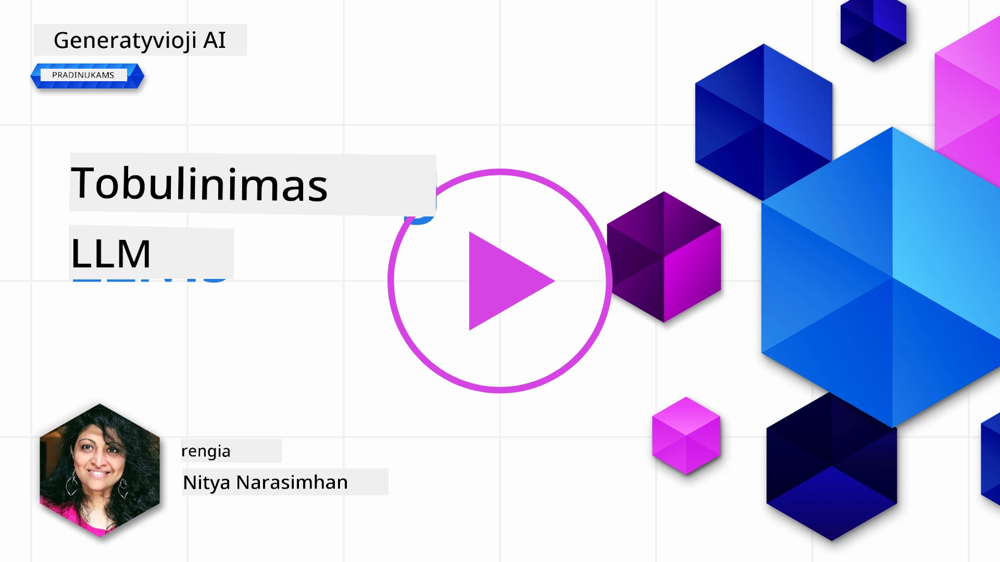

# Didelių kalbos modelių derinimas

Naudojant didelius kalbos modelius generatyvių DI programų kūrimui, kyla naujų iššūkių. Pagrindinė problema yra užtikrinti atsakymo kokybę (tikslumą ir aktualumą) generuojamam turiniui pagal vartotojo užklausą. Ankstesnėse pamokose aptarėme technikas, tokias kaip užklausos inžinerija ir paieška papildomas generavimas, kurios bando spręsti šią problemą _modifikuojant užklausos įvestį_ esamam modeliui.

Šios pamokos metu aptarsime trečią techniką, **derinimą**, kuris siekia iššūkį spręsti _permokant patį modelį_ papildomais duomenimis. Panagrinėkime detales.

## Mokymosi tikslai

Ši pamoka pristato derinimo sąvoką iš anksto apmokytuose kalbos modeliuose, tiria šio metodo naudą ir iššūkius bei suteikia gaires, kada ir kaip naudoti derinimą gerinant generatyvių DI modelių našumą.

Pamokos pabaigoje turėtumėte sugebėti atsakyti į šiuos klausimus:

- Kas yra kalbos modelių derinimas?
- Kada ir kodėl derinimas yra naudingas?
- Kaip galima derinti iš anksto apmokytą modelį?
- Kokios yra derinimo ribos?

Pasiruošę? Pradėkime.

## Iliustruotas gidas

Norite susidaryti bendrą vaizdą apie tai, ką aptarsime, prieš pradėdami? Peržiūrėkite šį iliustruotą gidą, kuriame aprašoma mokymosi kelionė šiai pamokai – nuo pagrindinių sąvokų ir motyvacijos derinimui iki proceso ir geriausių praktikos pavyzdžių. Tai įdomi tema, tad nepamirškite apsilankyti [Resursų](./RESOURCES.md?WT.mc_id=academic-105485-koreyst) puslapyje, kuriame rasite papildomų nuorodų savarankiškam mokymuisi!

## Kas yra kalbos modelių derinimas?

Pagal apibrėžimą, dideli kalbos modeliai yra _iš anksto apmokyti_ naudojant didelius tekstų kiekius iš įvairių šaltinių, įskaitant internetą. Kaip sužinojome ankstesnėse pamokose, mums reikalingos technikos, tokios kaip _užklausų inžinerija_ ir _paieška papildomas generavimas_, kad pagerintume modelio atsakymų kokybę į vartotojo klausimus („užklausas“).

Populiari užklausų inžinerijos technika yra duoti modeliui daugiau nurodymų, ko tikimasi atsakyme, pateikiant _instrukcijas_ (aiškias gaires) arba _kelis pavyzdžius_ (netiesiogines gaires). Tai vadinama _keliais šūviais mokymu_ (few-shot learning), tačiau tai turi du apribojimus:

- Modelio žodžių (tokenų) limitai gali riboti pavyzdžių skaičių ir tokio metodo efektyvumą.
- Modelio žodžių (tokenų) kaina gali paversti brangiu kiekvienos užklausos pavyzdžių pridėjimą ir sumažinti lankstumą.

Derinimas yra įprasta praktika mašininio mokymosi sistemose, kai paimamas iš anksto apmokytas modelis ir papildomai mokomas su naujais duomenimis, siekiant pagerinti našumą konkrečioje užduotyje. Kalbos modelių kontekste galime derinti tokį jau paruoštą modelį _naudojant atrinktų pavyzdžių rinkinį tam tikrai užduočiai ar taikymo sričiai_ ir taip sukurti **specialų modelį**, kuris gali būti tikslesnis ir aktualesnis šiai sričiai arba užduočiai. Papildoma derinimo nauda yra ta, kad jis gali sumažinti reikiamų pavyzdžių skaičių kelių šūvių mokymuisi – taip sumažinant tokenų naudojimą ir susijusias išlaidas.

## Kada ir kodėl verta derinti modelius?

Šiame kontekste, kalbėdami apie derinimą, turime omenyje **supervizorių** derinimą, kai modelis perkvalifikuojamas **pridedant naujų duomenų**, kurie nebuvo originalaus mokymo duomenų rinkinio dalis. Tai skiriasi nuo nesupervizoriaus derinimo, kai modelis perkvalifikuojamas pagal originalius duomenis, bet naudojant kitus hiperparametrus.

Svarbu atsiminti, kad derinimas yra pažangi technika, kuri reikalauja tam tikrų žinių, kad būtų pasiekti norimi rezultatai. Jei atliktas neteisingai, jis gali nepagerinti situacijos ar net pabloginti modelio veikimą pasirinktoje srityje.

Todėl prieš mokantis „kaip“ derinti kalbos modelius, svarbu žinoti „kodėl“ verta tęsti šiuo keliu ir „kada“ pradėti derinimo procesą. Pradėkite užduodami sau šiuos klausimus:

- **Naudojimo atvejis**: Koks yra jūsų _naudojimo atvejis_ derinimui? Koks esamo iš anksto apmokyto modelio aspektas jums svarbiausias?
- **Alternatyvos**: Ar bandėte _kitas technikas_ siekiant norimų rezultatų? Naudokite jas kaip pagrindą palyginimui.
  - Užklausų inžinerija: Išbandykite kelių šūvių užklausas su pavyzdžiais ir įvertinkite atsakymų kokybę.
  - Paieška papildomas generavimas: Pabandykite papildyti užklausas užklausos rezultatų iš savo duomenų. Įvertinkite atsakymų kokybę.
- **Išlaidos**: Ar įvertinote derinimo išlaidas?
  - Derinimo galimybė – ar iš anksto apmokytas modelis prieinamas derinimui?
  - Pastangos – mokymo duomenų paruošimas, modelio vertinimas ir tobulinimas.
  - Skaičiavimai – derinimo procesų vykdymas ir derinto modelio diegimas.
  - Duomenys – pakankamai kokybiškų pavyzdžių prieinamumas derinimui.
- **Nauda**: Ar įsitikinote derinimo pranašumais?
  - Kokybė – ar derintas modelis pranoko pagrindinį?
  - Kaina – ar sumažina tokenų naudojimą supaprastinant užklausas?
  - Išplėtotumas – ar galite pritaikyti pagrindinį modelį naujoms sritims?

Atsakę į šiuos klausimus, turėtumėte galėti nuspręsti, ar derinimas yra tinkamas jūsų konkretčiam naudojimo atvejui. Idealiu atveju, ši strategija yra verta tik tuomet, kai jos pranašumai viršija išlaidas. Kai nuspręsite tęsti, metas galvoti, _kaip_ derinti jau paruoštą modelį.

Norite daugiau įžvalgų apie sprendimų priėmimą? Žiūrėkite [Derinti ar nederinti?](https://www.youtube.com/watch?v=0Jo-z-MFxJs)

## Kaip galime derinti iš anksto apmokytą modelį?

Norint derinti iš anksto apmokytą modelį, jums reikia:

- iš anksto apmokyto modelio derinimui
- duomenų rinkinio derinimui
- mokymosi aplinkos derinimo užduočiai vykdyti
- talpinimo aplinkos derintam modeliui diegti

## Derinimas praktiškai

Šie šaltiniai pateikia žingsnis po žingsnio pamokas, kurios veda jus per realų pavyzdį pasirinktame modelyje su atrinktu duomenų rinkiniu. Norėdami dirbti su šiomis pamokomis, turite turėti paskyrą pas konkrečią paslaugų teikėją, taip pat prieigą prie reikiamų modelių ir duomenų rinkinių.

| Teikėjas    | Pamoka                                                                                                                                                                         | Aprašymas                                                                                                                                                                                                                                                                                                                                                                                                                         |
| ----------- | ------------------------------------------------------------------------------------------------------------------------------------------------------------------------------ | --------------------------------------------------------------------------------------------------------------------------------------------------------------------------------------------------------------------------------------------------------------------------------------------------------------------------------------------------------------------------------------------------------------------------------- |
| OpenAI      | [Kaip derinti pokalbių modelius](https://github.com/openai/openai-cookbook/blob/main/examples/How_to_finetune_chat_models.ipynb?WT.mc_id=academic-105485-koreyst)               | Išmokite derinti `gpt-35-turbo` modeliui konkrečioje srityje („receptų asistentas“), paruošiant mokymo duomenis, vykdant derinimo užduotį ir naudojant derintą modelį prognozėms gauti.                                                                                                                                                                                                                                              |
| Azure OpenAI| [GPT 3.5 Turbo derinimo pamoka](https://learn.microsoft.com/azure/ai-services/openai/tutorials/fine-tune?tabs=python-new%2Ccommand-line?WT.mc_id=academic-105485-koreyst)        | Išmokite derinti `gpt-35-turbo-0613` modelį **Azure** aplinkoje, atlikdami žingsnius duomenų kūrimui bei įkėlimui, derinimo užduoties vykdymui. Diekite ir naudokite naują modelį.                                                                                                                                                                                                                                                  |
| Hugging Face| [Derinimas su Hugging Face](https://www.philschmid.de/fine-tune-llms-in-2024-with-trl?WT.mc_id=academic-105485-koreyst)                                                        | Šiame tinklaraščio įraše pateikiama, kaip derinti atvirą LLM (pvz.: `CodeLlama 7B`) naudojant [transformers](https://huggingface.co/docs/transformers/index?WT.mc_id=academic-105485-koreyst) biblioteką ir [Transformer pastiprinamojo mokymosi (TRL)](https://huggingface.co/docs/trl/index?WT.mc_id=academic-105485-koreyst) priemones su atvirais [duomenų rinkiniais](https://huggingface.co/docs/datasets/index?WT.mc_id=academic-105485-koreyst) Hugging Face. |
|             |                                                                                                                                                                                |                                                                                                                                                                                                                                                                                                                                                                                                                                 |
| 🤗 AutoTrain| [Derinimas su AutoTrain](https://github.com/huggingface/autotrain-advanced/?WT.mc_id=academic-105485-koreyst)                                                                  | AutoTrain (arba AutoTrain Advanced) – tai python biblioteka, sukurta Hugging Face, leidžianti derinti daug įvairių užduočių, įskaitant LLM derinimą. AutoTrain yra be kodo sprendimas, kurį galima vykdyti savo debesyje, Hugging Face Spaces arba lokaliai. Palaiko internetinę GUI, komandų eilutę ir mokymą per yaml konfigūracijas.                                                                                                        |
|             |                                                                                                                                                                                |                                                                                                                                                                                                                                                                                                                                                                                                                                 |
| 🦥 Unsloth  | [Derinimas su Unsloth](https://github.com/unslothai/unsloth)                                                                                                                 | Unsloth yra atviro kodo sistema, palaikanti LLM derinimą ir pastiprinamąjį mokymą (RL). Unsloth supaprastina lokalų mokymą, vertinimą ir diegimą su paruoštais naudoti [užrašais](https://github.com/unslothai/notebooks). Taip pat palaiko tekstą į garsą (TTS), BERT ir multimodalius modelius. Norėdami pradėti, perskaitykite jų nuoseklų [LLM Derinimo Gidą](https://docs.unsloth.ai/get-started/fine-tuning-llms-guide).                                                                                 |
|             |                                                                                                                                                                                |                                                                                                                                                                                                                                                                                                                                                                                                                                 |
## Užduotis

Pasirinkite vieną iš aukščiau pateiktų pamokų ir jas atlikite. _Gali būti, kad mes atkartosime kai kurias šių pamokų versijas Jupyter užrašinėse šiame repozitorijoje tik kaip nuorodas. Prašome naudoti originalius šaltinius tiesiogiai, kad gautumėte naujausias versijas_.

## Puikus darbas! Tęskite mokymąsi.

Baigę šią pamoką, apsilankykite mūsų [Generatyvios DI mokymosi kolekcijoje](https://aka.ms/genai-collection?WT.mc_id=academic-105485-koreyst), kad toliau keliate savo generatyvios DI žinias!

Sveikiname!! Jūs baigėte galutinę šios versijos 2 pamoką šiam kursui! Nesustokite mokytis ir kurti. **Patikrinkite [RESURSŲ](RESOURCES.md?WT.mc_id=academic-105485-koreyst) puslapį su papildomais pasiūlymais šia tema.**

Mūsų v1 serija pamokų taip pat atnaujinta su daugiau užduočių ir konceptų. Tad skirkite minutėlę atnaujinti savo žinias – ir prašome [dalinkitės savo klausimais ir atsiliepimais](https://github.com/microsoft/generative-ai-for-beginners/issues?WT.mc_id=academic-105485-koreyst), kad padėtumėte mums tobulinti šias pamokas bendruomenei.

---

<!-- CO-OP TRANSLATOR DISCLAIMER START -->
**Atsakomybės apribojimas**:
Šis dokumentas buvo išverstas naudojant dirbtinio intelekto vertimo paslaugą [Co-op Translator](https://github.com/Azure/co-op-translator). Nors stengiamės užtikrinti tikslumą, atkreipkite dėmesį, kad automatizuoti vertimai gali turėti klaidų ar netikslumų. Originalus dokumentas jo gimtąja kalba laikomas oficialiu šaltiniu. Svarbiai informacijai rekomenduojama naudoti profesionalų žmogaus vertimą. Mes neatsakome už jokius nesusipratimus ar neteisingus aiškinimus, kylančius dėl šio vertimo naudojimo.
<!-- CO-OP TRANSLATOR DISCLAIMER END -->