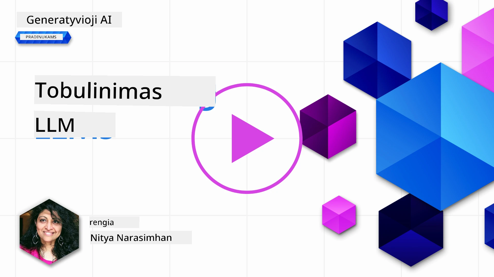
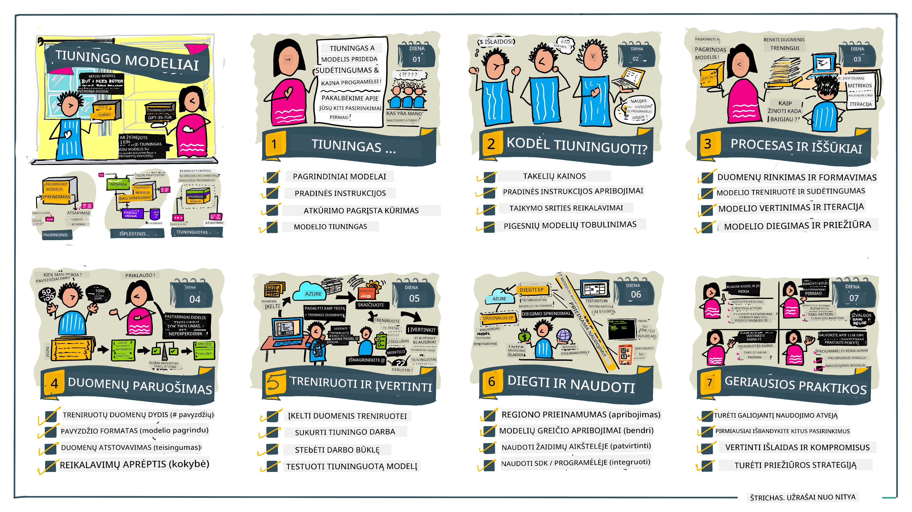

# Jūsų LLM tikslus pritaikymas

Didelių kalbos modelių naudojimas generatyvioms DI programoms kurti atneša naujų iššūkių. Svarbiausia problema yra užtikrinti atsakymo kokybę (tikslumą ir aktualumą) turinio, sugeneruoto modelio pagal vartotojo užklausą. Ankstesnėse pamokose aptarėme tokias technikas kaip užklausų inžinerija ir paieškos pagrindu pagrįstas generavimas, kurios bando išspręsti problemą _modifikuojant modelio įvestį_.

Šios dienos pamokoje aptarsime trečią techniką – **tikslų pritaikymą (fine-tuning)**, kuri stengiasi išspręsti šią iššūkį _permokant patį modelį_ su papildomais duomenimis. Panagrinėkime detaliau.

## Mokymosi tikslai

Šioje pamokoje pristatoma tiksliojo pritaikymo sąvoka iš anksto apmokytiems kalbos modeliams, nagrinėjami tokio požiūrio privalumai ir iššūkiai bei pateikiamos gairės, kada ir kaip naudoti tikslų pritaikymą, kad pagerintumėte savo generatyvių DI modelių veikimą.

Pamokos pabaigoje turėtumėte sugebėti atsakyti į šiuos klausimus:

- Kas yra kalbos modelių tikslus pritaikymas?
- Kada ir kodėl tikslus pritaikymas yra naudingas?
- Kaip galiu tiksliai pritaikyti iš anksto apmokytą modelį?
- Kokios yra tiksliojo pritaikymo ribos?

Pasirengę? Pradėkime.

## Iliustruotas vadovas

Norite susidaryti bendrą vaizdą, ką apimsime, prieš gilindamiesi? Pažvelkite į šį iliustruotą vadovą, kuris aprašo mokymosi kelionę šiai pamokai – nuo pagrindinių koncepcijų ir motyvacijos supratimo iki proceso ir geriausių praktikos pavyzdžių vykdant tiksliojo pritaikymo užduotį. Tai įdomi tema tyrinėti, todėl nepamirškite apsilankyti [Ištekliai](./RESOURCES.md?WT.mc_id=academic-105485-koreyst) puslapyje, kur rasite papildomų nuorodų, padėsiančių savarankiškai mokytis!

## Kas yra kalbos modelių tikslus pritaikymas?

Didelius kalbos modelius pagal apibrėžimą _iš anksto apmoko_ dideliu kiekiu tekstų, gautų iš įvairių šaltinių, įskaitant internetą. Kaip mokėmės ankstesnėse pamokose, mums reikalingos technikos, tokios kaip _užklausų inžinerija_ ir _paieškos pagrindu pagrįstas generavimas_, kad pagerintume modelio atsakymų kokybę į vartotojo klausimus („užklausas“).

Populiari užklausų inžinerijos technika yra suteikti modeliui daugiau nurodymų, ko tikimasi atsakyme, arba pateikiant _instrukcijas_ (aiškius nurodymus), arba _pateikiant keletą pavyzdžių_ (neaiškius nurodymus). Tai vadinama _few-shot learning_, tačiau turi dvi ribas:

- Modelio žodžių ribos gali apriboti kiek pavyzdžių galite pateikti ir sumažinti efektyvumą.
- Modelio žodžių kainos gali padaryti brangu pridėti pavyzdžių kiekvienai užklausai, ribodamos lankstumą.

Tikslus pritaikymas yra įprasta praktika mašininio mokymosi sistemose, kur iš anksto apmokytas modelis perkraunamas su naujais duomenimis, siekiant pagerinti jo veikimą konkrečioje užduotyje. Kalbos modelių kontekste galime tiksliai pritaikyti iš anksto apmokytą modelį _su parinktais pavyzdžių rinkiniais tam tikrai užduočiai ar taikymo sričiai_, kad sukurtume **individualų modelį**, kuris gali būti tikslesnis ir aktualus konkrečiai užduočiai ar sričiai. Papildoma tiksliojo pritaikymo nauda yra ta, kad tai gali sumažinti reikalingų pavyzdžių kiekį few-shot learning – taip sumažinant žodžių naudojimą ir susijusias išlaidas.

## Kada ir kodėl reikėtų tiksliai pritaikyti modelius?

Šiame kontekste kalbant apie tikslų pritaikymą, turime omenyje **priežiūrinį** tikslų pritaikymą, kai perkrovimas atliekamas **pridedant naujus duomenis**, kurie nebuvo originaliame treniruočių duomenų rinkinyje. Tai skiriasi nuo priežiūros neturinčio tiksliojo pritaikymo, kai modelis perdaromas ant originalių duomenų, bet su kitais hiperkonfigūracijų nustatymais.

Svarbiausia prisiminti, kad tikslus pritaikymas yra pažangi technika, reikalaujanti tam tikro meistriškumo, norint pasiekti norimų rezultatų. Jei ją atliekate neteisingai, rezultatai gali nepasiteisinti, arba netgi kristi modelio veikimas jūsų tikslinei sričiai.

Todėl prieš mokantis „kaip“ tiksliai pritaikyti kalbos modelius, reikia žinoti „kodėl“ verta rinktis šį kelią ir „kada“ pradėti tiksliojo pritaikymo procesą. Pradėkite užduodami sau šiuos klausimus:

- **Naudojimo atvejis**: Koks yra jūsų _tikslus pritaikymas_ naudojimo atvejis? Kurią dabartinio iš anksto apmokyto modelio savybę norite pagerinti?
- **Alternatyvos**: Ar bandėte _kitas technikas_ norint pasiekti pageidaujamus rezultatus? Naudokite jas kaip lyginamąją bazę.
  - Užklausų inžinerija: Išbandykite technikas, kaip few-shot užklausas su pavyzdžiais, kurie yra susiję su užklausa. Įvertinkite atsakymų kokybę.
  - Paieškos pagrindu pagrįstas generavimas: Išbandykite pildyti užklausas gaunamais paieškos rezultatų duomenimis. Įvertinkite atsakymų kokybę.
- **Išlaidos**: Ar identifikavote tiksliojo pritaikymo išlaidas?
  - Pritaikomumas – ar iš anksto apmokytas modelis prieinamas tiksliajam pritaikymui?
  - Pastangos – pasiruošimas duomenims, modelio vertinimas ir patobulinimas.
  - Skaičiavimo resursai – tiksliojo pritaikymo darbų vykdymas ir pritaikyto modelio diegimas.
  - Duomenys – pakankamai kokybiškų pavyzdžių prieinamumas tiksliojo pritaikymo poveikiui.
- **Nauda**: Ar patvirtinote tiksliojo pritaikymo privalumus?
  - Kokybė – ar pritaikytas modelis lenkė etaloną?
  - Kaina – ar sumažino žodžių naudojimą supaprastinant užklausas?
  - Išplėčiamumas – ar galima pagrindinį modelį pritaikyti naujoms sritims?

Atsakę į šiuos klausimus galėsite nuspręsti, ar tikslus pritaikymas yra tinkamas sprendimas jūsų atvejui. Idealiu atveju šis požiūris yra pagrįstas tik tada, jei nauda nusveria kainas. Nusprendus tęsti, metas apgalvoti _kaip_ tiksliai pritaikyti iš anksto apmokytą modelį.

Norite daugiau sužinoti apie sprendimų priėmimo procesą? Peržiūrėkite [Tiksliai pritaikyti ar ne?](https://www.youtube.com/watch?v=0Jo-z-MFxJs)

## Kaip galime tiksliai pritaikyti iš anksto apmokytą modelį?

Norėdami tiksliai pritaikyti iš anksto apmokytą modelį, jums reikia turėti:

- iš anksto apmokytą modelį tiksliajam pritaikymui
- duomenų rinkinį, skirtą tiksliajam pritaikymui
- mokymosi aplinką tiksliojo pritaikymo darbui vykdyti
- talpinimo aplinką, kur diegti pritaikytą modelį

## Tikslus pritaikymas praktikoje

Toliau pateikti ištekliai siūlo žingsnis po žingsnio vadovus, kurie padės per realų pavyzdį naudoti pasirinktą modelį su parinktu duomenų rinkiniu. Kad galėtumėte dirbti su šiais vadovais, jums reikės paskyros pas konkrečiu teikėju ir prieigos prie atitinkamo modelio bei duomenų rinkinių.

| Teikėjas    | Vadovas                                                                                                                                                                    | Aprašymas                                                                                                                                                                                                                                                                                                                                                                                                                         |
| ----------- | ------------------------------------------------------------------------------------------------------------------------------------------------------------------------- | --------------------------------------------------------------------------------------------------------------------------------------------------------------------------------------------------------------------------------------------------------------------------------------------------------------------------------------------------------------------------------------------------------------------------------- |
| OpenAI      | [Kaip tiksliai pritaikyti pokalbių modelius](https://github.com/openai/openai-cookbook/blob/main/examples/How_to_finetune_chat_models.ipynb?WT.mc_id=academic-105485-koreyst) | Išmokite tiksliai pritaikyti `gpt-35-turbo` modeliui konkrečiam domenui („receptų asistentas“) pasiruošiant mokymo duomenis, vykdant tiksliojo pritaikymo užduotį ir naudojant pritaikytą modelį spėjimams.                                                                                                                                                                                                                                |
| Azure OpenAI| [GPT 3.5 Turbo tiksliojo pritaikymo vadovas](https://learn.microsoft.com/azure/ai-services/openai/tutorials/fine-tune?tabs=python-new%2Ccommand-line&WT.mc_id=academic-105485-koreyst)   | Išmokite tiksliai pritaikyti `gpt-35-turbo-0613` modelį **Azure platformoje** – kurkite ir įkelkite mokymo duomenis, vykdykite tiksliojo pritaikymo užduotį. Diekite ir naudokite naują modelį.                                                                                                                                                                                                                                         |
| Hugging Face| [Taikomas LLM tikslus pritaikymas su Hugging Face](https://www.philschmid.de/fine-tune-llms-in-2024-with-trl?WT.mc_id=academic-105485-koreyst)                             | Šiame tinklaraščio įraše aprašomas atviro LLM (pvz., `CodeLlama 7B`) tikslus pritaikymas naudojant [transformers](https://huggingface.co/docs/transformers/index?WT.mc_id=academic-105485-koreyst) biblioteką ir [Transformer Reinforcement Learning (TRL)](https://huggingface.co/docs/trl/index?WT.mc_id=academic-105485-koreyst) su atvirais [duomenų rinkiniais](https://huggingface.co/docs/datasets/index?WT.mc_id=academic-105485-koreyst) Hugging Face platformoje. |
|             |                                                                                                                                                                           |                                                                                                                                                                                                                                                                                                                                                                                                                                 |
| 🤗 AutoTrain| [Tikslus LLM pritaikymas su AutoTrain](https://github.com/huggingface/autotrain-advanced/?WT.mc_id=academic-105485-koreyst)                                               | AutoTrain (ar AutoTrain Advanced) yra Hugging Face sukurta python biblioteka, leidžianti atlikti tikslų pritaikymą daugeliui užduočių, įskaitant LLM pritaikymą. AutoTrain – tai kodų nereikalaujantis sprendimas, o tikslus pritaikymą galima atlikti savo debesyje, Hugging Face Spaces arba lokaliai. Palaiko tiek žiniatinklio GUI, CLI ir mokymą per yaml konfigūracijos failus.                                                                                 |
|             |                                                                                                                                                                           |                                                                                                                                                                                                                                                                                                                                                                                                                                 |
| 🦥 Unsloth  | [Tikslus LLM pritaikymas su Unsloth](https://github.com/unslothai/unsloth)                                                                                              | Unsloth yra atviro kodo sistema, palaikanti LLM tikslų pritaikymą ir sustiprintą mokymą (RL). Unsloth supaprastina vietinį mokymąsi, vertinimą ir diegimą su paruoštais [užrašais (notebooks)](https://github.com/unslothai/notebooks). Taip pat palaiko tekstas į kalbą (TTS), BERT ir multimodalius modelius. Norėdami pradėti, perskaitykite jų žingsnis po žingsnio [Tiksliojo pritaikymo LLM vadovą](https://docs.unsloth.ai/get-started/fine-tuning-llms-guide).               |
|             |                                                                                                                                                                           |                                                                                                                                                                                                                                                                                                                                                                                                                                 |
## Užduotis

Pasirinkite vieną iš aukščiau pateiktų vadovų ir pereikite juos. _Mes galbūt kartosime šių vadovų versiją Jupyter užrašinėse šiame repozitorijoje tik kaip pavyzdį. Naudokite originalius šaltinius tiesiogiai, kad gautumėte naujausias versijas_.

## Puikus darbas! Tęskite mokymąsi.

Baigę šią pamoką, peržiūrėkite mūsų [Generatyvios DI mokymosi kolekciją](https://aka.ms/genai-collection?WT.mc_id=academic-105485-koreyst), kad toliau keltumėte savo gen. DI žinias į aukštesnį lygį!

Sveikiname!! Baigėte šios kursų v2 serijos paskutinę pamoką! Nesustokite mokytis ir kurti. **Apsilankykite [IŠTEKLIŲ](RESOURCES.md?WT.mc_id=academic-105485-koreyst) puslapyje, kur rasite papildomų pasiūlymų šiai temai.**

Mūsų v1 mokymosi serija taip pat buvo atnaujinta su daugiau užduočių ir koncepcijų. Tad skirkite minutėlę atnaujinti savo žinias – ir prašome [pasidalinkite klausimais bei atsiliepimais](https://github.com/microsoft/generative-ai-for-beginners/issues?WT.mc_id=academic-105485-koreyst), kad padėtumėte mums tobulinti šias pamokas bendruomenei.

---

<!-- CO-OP TRANSLATOR DISCLAIMER START -->
**Atsakomybės apribojimas**:
Šis dokumentas buvo išverstas naudojant dirbtinio intelekto vertimo paslaugą [Co-op Translator](https://github.com/Azure/co-op-translator). Nors siekiame tikslumo, prašome atkreipti dėmesį, kad automatiniai vertimai gali turėti klaidų ar netikslumų. Originalus dokumentas jo gimtąja kalba laikomas autoritetingu šaltiniu. Svarbiai informacijai rekomenduojama naudoti profesionalų žmogišką vertimą. Mes neatsakome už bet kokius nesusipratimus ar klaidingas interpretacijas, kilusias naudojantis šiuo vertimu.
<!-- CO-OP TRANSLATOR DISCLAIMER END -->