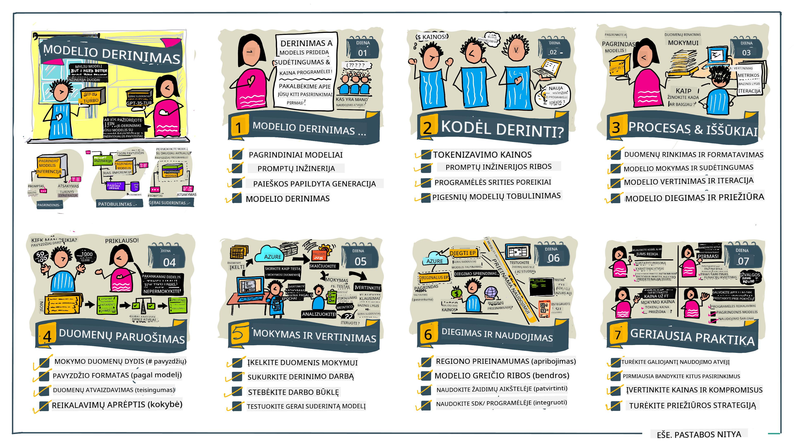

<!--
CO_OP_TRANSLATOR_METADATA:
{
  "original_hash": "807f0d9fc1747e796433534e1be6a98a",
  "translation_date": "2025-10-18T02:28:46+00:00",
  "source_file": "18-fine-tuning/README.md",
  "language_code": "lt"
}
-->

# LLM modelio pritaikymas

Naudojant didelius kalbos modelius generatyviosios dirbtinio intelekto programoms kurti, kyla naujų iššūkių. Vienas pagrindinių klausimų yra užtikrinti atsakymų kokybę (tikslumą ir aktualumą), kai modelis generuoja turinį pagal vartotojo užklausą. Ankstesnėse pamokose aptarėme tokias technikas kaip užklausų kūrimas ir informacijos paieška, kurios siekia išspręsti problemą _modifikuojant modelio įvestį_.

Šiandienos pamokoje aptarsime trečią techniką – **pritaikymą**, kuri siekia spręsti šį iššūkį _pertreniruojant patį modelį_ su papildomais duomenimis. Panagrinėkime detaliau.

## Mokymosi tikslai

Šioje pamokoje pristatoma pritaikymo koncepcija iš anksto apmokytiems kalbos modeliams, aptariami šio metodo privalumai ir iššūkiai, taip pat pateikiamos rekomendacijos, kada ir kaip naudoti pritaikymą, siekiant pagerinti generatyviojo dirbtinio intelekto modelių veikimą.

Pamokos pabaigoje turėtumėte galėti atsakyti į šiuos klausimus:

- Kas yra kalbos modelių pritaikymas?
- Kada ir kodėl pritaikymas yra naudingas?
- Kaip galima pritaikyti iš anksto apmokytą modelį?
- Kokie yra pritaikymo apribojimai?

Pasiruošę? Pradėkime.

## Iliustruotas vadovas

Norite gauti bendrą vaizdą apie tai, ką aptarsime, prieš pasinerdami į detales? Peržiūrėkite šį iliustruotą vadovą, kuriame aprašoma mokymosi kelionė šioje pamokoje – nuo pagrindinių pritaikymo koncepcijų ir motyvacijos supratimo iki proceso ir geriausios praktikos vykdant pritaikymo užduotį. Tai įdomi tema tyrinėjimui, todėl nepamirškite peržiūrėti [Resursų](./RESOURCES.md?WT.mc_id=academic-105485-koreyst) puslapio, kuriame rasite papildomų nuorodų, padėsiančių savarankiškai mokytis!

## Kas yra kalbos modelių pritaikymas?

Pagal apibrėžimą, dideli kalbos modeliai yra _iš anksto apmokyti_ naudojant didelius tekstų kiekius, surinktus iš įvairių šaltinių, įskaitant internetą. Kaip sužinojome ankstesnėse pamokose, mums reikia tokių technikų kaip _užklausų kūrimas_ ir _informacijos paieška_, kad pagerintume modelio atsakymų kokybę į vartotojo klausimus („užklausas“).

Populiari užklausų kūrimo technika apima modelio nurodymą, ko tikimasi atsakyme, pateikiant _instrukcijas_ (aiškus nurodymas) arba _keletą pavyzdžių_ (netiesioginis nurodymas). Tai vadinama _mokymusi iš kelių pavyzdžių_, tačiau turi du apribojimus:

- Modelio žodžių limitai gali apriboti pateikiamų pavyzdžių skaičių ir jų efektyvumą.
- Modelio žodžių kaštai gali padaryti brangų kiekvienos užklausos papildymą pavyzdžiais ir apriboti lankstumą.

Pritaikymas yra įprasta praktika mašininio mokymosi sistemose, kai iš anksto apmokytas modelis pertreniruojamas su naujais duomenimis, siekiant pagerinti jo veikimą konkrečioje užduotyje. Kalbos modelių kontekste galime pritaikyti iš anksto apmokytą modelį _su kruopščiai atrinktais pavyzdžiais konkrečiai užduočiai ar taikymo sričiai_, kad sukurtume **pritaikytą modelį**, kuris gali būti tikslesnis ir aktualesnis konkrečiai užduočiai ar sričiai. Papildomas pritaikymo privalumas yra tas, kad jis gali sumažinti pavyzdžių poreikį mokymuisi iš kelių pavyzdžių – sumažinant žodžių naudojimą ir susijusius kaštus.

## Kada ir kodėl turėtume pritaikyti modelius?

Šiame kontekste, kai kalbame apie pritaikymą, turime omenyje **prižiūrimą** pritaikymą, kai pertreniruojama **pridedant naujus duomenis**, kurie nebuvo originaliame mokymo duomenų rinkinyje. Tai skiriasi nuo neprižiūrimo pritaikymo, kai modelis pertreniruojamas naudojant originalius duomenis, bet su skirtingais hiperparametrais.

Svarbu atsiminti, kad pritaikymas yra pažangi technika, reikalaujanti tam tikro lygio ekspertinių žinių, kad būtų pasiekti norimi rezultatai. Jei tai atliekama netinkamai, gali būti, kad nebus pasiektas laukiamas pagerėjimas, o modelio veikimas tikslinėje srityje gali net pablogėti.

Todėl prieš mokantis „kaip“ pritaikyti kalbos modelius, reikia žinoti „kodėl“ verta rinktis šį kelią ir „kada“ pradėti pritaikymo procesą. Pirmiausia užduokite sau šiuos klausimus:

- **Naudojimo atvejis**: Koks yra jūsų _naudojimo atvejis_ pritaikymui? Kurią dabartinio iš anksto apmokyto modelio dalį norite patobulinti?
- **Alternatyvos**: Ar bandėte _kitas technikas_, kad pasiektumėte norimus rezultatus? Naudokite jas kaip palyginimo pagrindą.
  - Užklausų kūrimas: Išbandykite technikas, tokias kaip mokymasis iš kelių pavyzdžių, pateikiant atitinkamų užklausų atsakymų pavyzdžius. Įvertinkite atsakymų kokybę.
  - Informacijos paieška: Pabandykite papildyti užklausas paieškos rezultatais, gautais ieškant jūsų duomenų bazėje. Įvertinkite atsakymų kokybę.
- **Kaštai**: Ar nustatėte pritaikymo kaštus?
  - Pritaikomumas – ar iš anksto apmokytas modelis yra tinkamas pritaikymui?
  - Pastangos – mokymo duomenų paruošimas, modelio vertinimas ir tobulinimas.
  - Skaičiavimai – pritaikymo užduočių vykdymas ir pritaikyto modelio diegimas.
  - Duomenys – pakankamas kokybiškų pavyzdžių kiekis pritaikymo poveikiui.
- **Privalumai**: Ar patvirtinote pritaikymo privalumus?
  - Kokybė – ar pritaikytas modelis pranoko pradinį lygį?
  - Kaštai – ar tai sumažina žodžių naudojimą, supaprastinant užklausas?
  - Pritaikomumas – ar galite pritaikyti bazinį modelį naujoms sritims?

Atsakę į šiuos klausimus, turėtumėte galėti nuspręsti, ar pritaikymas yra tinkamas jūsų naudojimo atvejui. Idealiu atveju, šis metodas yra tinkamas tik tada, kai privalumai nusveria kaštus. Kai nuspręsite tęsti, metas pagalvoti, _kaip_ galite pritaikyti iš anksto apmokytą modelį.

Norite gauti daugiau įžvalgų apie sprendimų priėmimo procesą? Žiūrėkite [Pritaikyti ar nepritaikyti](https://www.youtube.com/watch?v=0Jo-z-MFxJs)

## Kaip galime pritaikyti iš anksto apmokytą modelį?

Norėdami pritaikyti iš anksto apmokytą modelį, turite turėti:

- iš anksto apmokytą modelį pritaikymui
- duomenų rinkinį pritaikymui
- mokymo aplinką pritaikymo užduočiai vykdyti
- talpinimo aplinką pritaikytam modeliui diegti

## Pritaikymas praktikoje

Šie resursai pateikia žingsnis po žingsnio vadovus, kurie padės jums atlikti realų pavyzdį, naudojant pasirinktą modelį su kruopščiai atrinktu duomenų rinkiniu. Norėdami atlikti šiuos vadovus, jums reikės turėti paskyrą pas konkretų tiekėją, taip pat prieigą prie atitinkamo modelio ir duomenų rinkinių.

| Tiekėjas     | Vadovas                                                                                                                                                                       | Aprašymas                                                                                                                                                                                                                                                                                                                                                                                                                        |
| ------------ | ------------------------------------------------------------------------------------------------------------------------------------------------------------------------------ | ---------------------------------------------------------------------------------------------------------------------------------------------------------------------------------------------------------------------------------------------------------------------------------------------------------------------------------------------------------------------------------------------------------------------------------- |
| OpenAI       | [Kaip pritaikyti pokalbių modelius](https://github.com/openai/openai-cookbook/blob/main/examples/How_to_finetune_chat_models.ipynb?WT.mc_id=academic-105485-koreyst)                | Sužinokite, kaip pritaikyti `gpt-35-turbo` konkrečiai sričiai („receptų asistentas“), paruošiant mokymo duomenis, vykdant pritaikymo užduotį ir naudojant pritaikytą modelį inferencijai.                                                                                                                                                                                                                                              |
| Azure OpenAI | [GPT 3.5 Turbo pritaikymo vadovas](https://learn.microsoft.com/azure/ai-services/openai/tutorials/fine-tune?tabs=python-new%2Ccommand-line?WT.mc_id=academic-105485-koreyst) | Sužinokite, kaip pritaikyti `gpt-35-turbo-0613` modelį **Azure platformoje**, atlikdami veiksmus, kaip sukurti ir įkelti mokymo duomenis, vykdyti pritaikymo užduotį. Diegti ir naudoti naują modelį.                                                                                                                                                                                                                                                                 |
| Hugging Face | [Kalbos modelių pritaikymas su Hugging Face](https://www.philschmid.de/fine-tune-llms-in-2024-with-trl?WT.mc_id=academic-105485-koreyst)                                               | Šiame tinklaraščio įraše aprašomas pritaikymas _atviro kalbos modelio_ (pvz., `CodeLlama 7B`) naudojant [transformers](https://huggingface.co/docs/transformers/index?WT.mc_id=academic-105485-koreyst) biblioteką ir [Transformer Reinforcement Learning (TRL)](https://huggingface.co/docs/trl/index?WT.mc_id=academic-105485-koreyst]) su atvirais [duomenų rinkiniais](https://huggingface.co/docs/datasets/index?WT.mc_id=academic-105485-koreyst) Hugging Face platformoje. |
|              |                                                                                                                                                                                |                                                                                                                                                                                                                                                                                                                                                                                                                                    |
| 🤗 AutoTrain | [Kalbos modelių pritaikymas su AutoTrain](https://github.com/huggingface/autotrain-advanced/?WT.mc_id=academic-105485-koreyst)                                                         | AutoTrain (arba AutoTrain Advanced) yra „Hugging Face“ sukurta „Python“ biblioteka, leidžianti pritaikyti modelius įvairioms užduotims, įskaitant kalbos modelių pritaikymą. AutoTrain yra sprendimas be kodo, o pritaikymas gali būti atliekamas jūsų pačių debesyje, Hugging Face Spaces arba vietoje. Jis palaiko tiek internetinę GUI, tiek CLI, tiek mokymą naudojant yaml konfigūracijos failus.                                                                               |
|              |                                                                                                                                                                                |                                                                                                                                                                                                                                                                                                                                                                                                                                    |

## Užduotis

Pasirinkite vieną iš aukščiau pateiktų vadovų ir atlikite jį. _Mes galime atkurti šių vadovų versiją Jupyter užrašuose šiame repozitoriume tik kaip nuorodą. Prašome naudoti originalius šaltinius, kad gautumėte naujausias versijas_.

## Puikus darbas! Tęskite mokymąsi.

Baigę šią pamoką, peržiūrėkite mūsų [Generatyviojo dirbtinio intelekto mokymosi kolekciją](https://aka.ms/genai-collection?WT.mc_id=academic-105485-koreyst), kad toliau gilintumėte savo žinias apie generatyvųjį dirbtinį intelektą!

Sveikiname!! Jūs baigėte paskutinę v2 serijos pamoką šiam kursui! Nenustokite mokytis ir kurti. \*\*Peržiūrėkite [RESURSAI](RESOURCES.md?WT.mc_id=academic-105485-koreyst) puslapį, kuriame rasite papildomų pasiūlymų būtent šia tema.

Mūsų v1 pamokų serija taip pat buvo atnaujinta su daugiau užduočių ir koncepcijų. Todėl skirkite minutę atnaujinti savo žinias – ir prašome [pasidalinti savo klausimais ir atsiliepimais](https://github.com/microsoft/generative-ai-for-beginners/issues?WT.mc_id=academic-105485-koreyst), kad galėtume tobulinti šias pamokas bendruomenei.

---

**Atsakomybės apribojimas**:  
Šis dokumentas buvo išverstas naudojant AI vertimo paslaugą [Co-op Translator](https://github.com/Azure/co-op-translator). Nors siekiame tikslumo, prašome atkreipti dėmesį, kad automatiniai vertimai gali turėti klaidų ar netikslumų. Originalus dokumentas jo gimtąja kalba turėtų būti laikomas autoritetingu šaltiniu. Dėl svarbios informacijos rekomenduojama profesionali žmogaus vertimo paslauga. Mes neprisiimame atsakomybės už nesusipratimus ar neteisingus aiškinimus, atsiradusius naudojant šį vertimą.