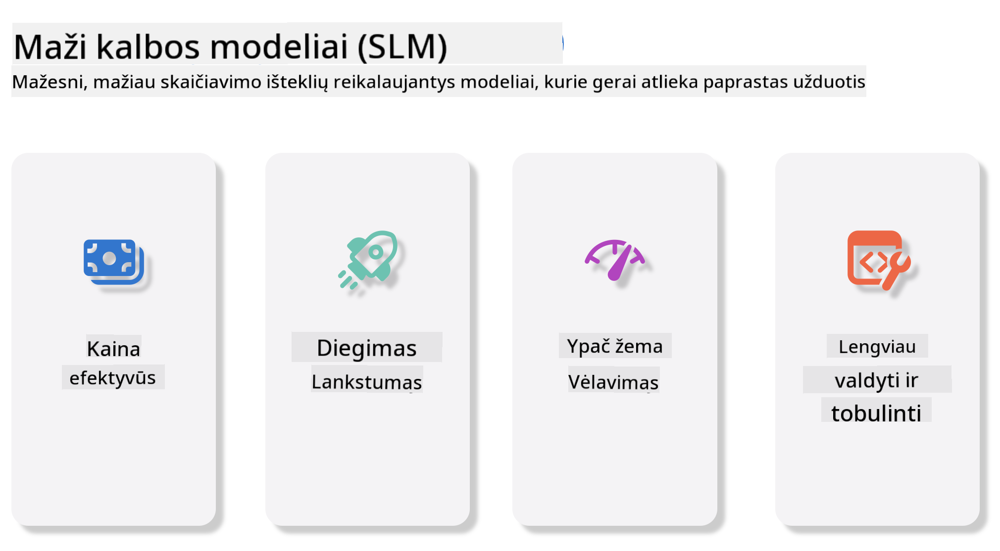
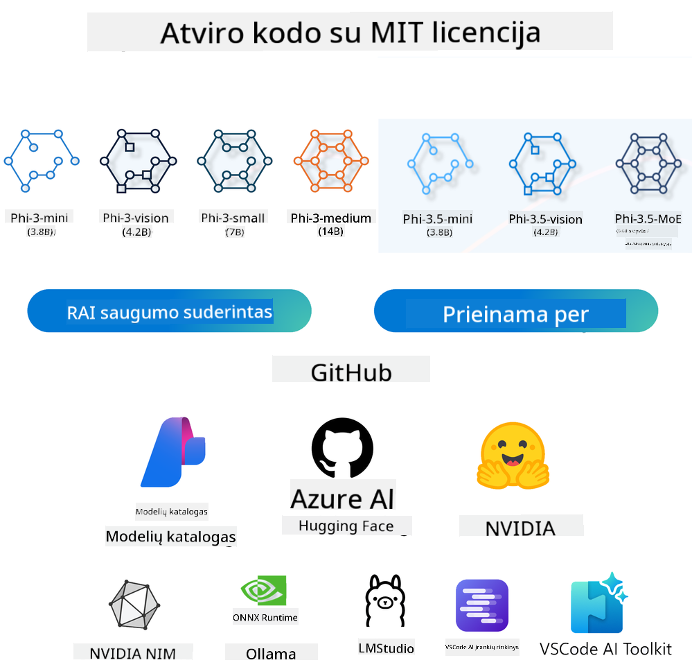
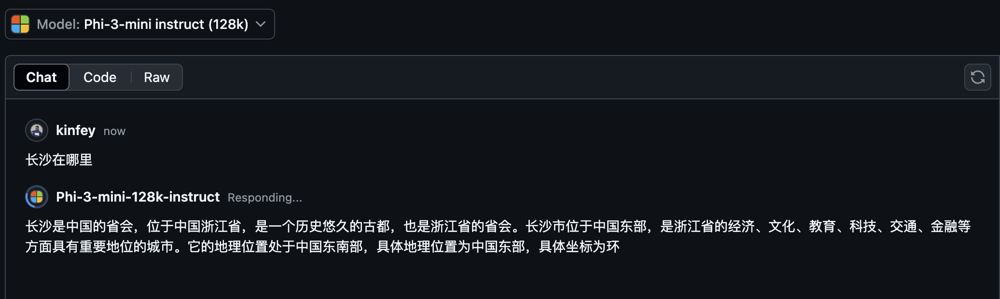
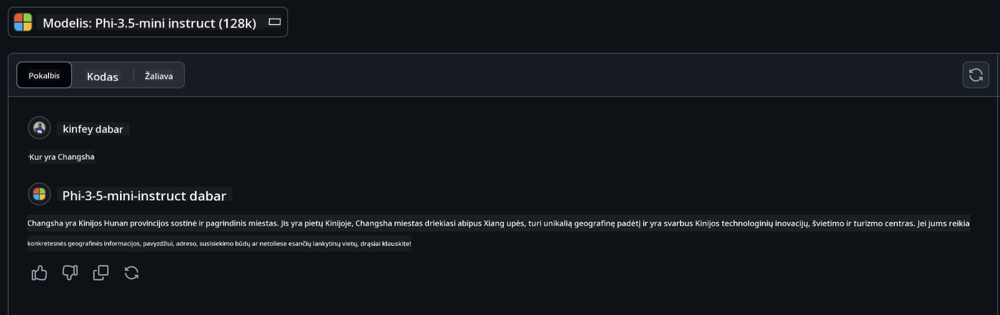

<!--
CO_OP_TRANSLATOR_METADATA:
{
  "original_hash": "124ad36cfe96f74038811b6e2bb93e9d",
  "translation_date": "2025-08-25T12:44:55+00:00",
  "source_file": "19-slm/README.md",
  "language_code": "lt"
}
-->
# Įvadas į mažus kalbos modelius generatyviajai AI pradedantiesiems
Generatyvioji AI – tai įdomi dirbtinio intelekto sritis, kuri orientuojasi į sistemas, gebančias kurti naują turinį. Šis turinys gali būti tekstas, vaizdai, muzika ar net ištisos virtualios aplinkos. Viena iš labiausiai intriguojančių generatyviosios AI taikymo sričių – kalbos modeliai.

## Kas yra maži kalbos modeliai?

Mažas kalbos modelis (SLM) – tai sumažinta didelio kalbos modelio (LLM) versija, kuri pasitelkia daugelį LLM architektūrinių principų ir technikų, tačiau pasižymi gerokai mažesniais skaičiavimo resursų poreikiais.

SLM – tai kalbos modelių pogrupis, skirtas generuoti tekstą, panašų į žmogaus rašomą. Skirtingai nei didesni modeliai, tokie kaip GPT-4, SLM yra kompaktiškesni ir efektyvesni, todėl puikiai tinka ten, kur skaičiavimo ištekliai riboti. Nepaisant mažesnio dydžio, jie vis tiek geba atlikti įvairias užduotis. Dažniausiai SLM kuriami suspaudžiant arba distiliuojant LLM, siekiant išlaikyti didelę dalį pradinio modelio funkcionalumo ir kalbinių gebėjimų. Sumažinus modelio dydį, sumažėja ir bendras sudėtingumas, todėl SLM tampa efektyvesni tiek atminties, tiek skaičiavimo požiūriu. Nepaisant šių optimizacijų, SLM vis dar gali atlikti daugybę natūralios kalbos apdorojimo (NLP) užduočių:

- Teksto generavimas: kurti nuoseklius ir kontekstui tinkamus sakinius ar pastraipas.
- Teksto užbaigimas: prognozuoti ir užbaigti sakinius pagal pateiktą užklausą.
- Vertimas: versti tekstą iš vienos kalbos į kitą.
- Santraukų kūrimas: ilgesnį tekstą sutrumpinti iki lengviau suprantamų santraukų.

Nors, palyginus su didesniais modeliais, gali būti tam tikrų kompromisų našumo ar supratimo gilumo srityje.

## Kaip veikia maži kalbos modeliai?
SLM mokomi naudojant didžiulius tekstų kiekius. Mokymo metu jie perpranta kalbos struktūras ir dėsningumus, todėl geba generuoti gramatiškai taisyklingą ir kontekstui tinkamą tekstą. Mokymo procesą sudaro:

- Duomenų rinkimas: surenkami dideli tekstų rinkiniai iš įvairių šaltinių.
- Paruošimas: duomenys valomi ir tvarkomi, kad tiktų mokymui.
- Mokymas: naudojami mašininio mokymosi algoritmai, kad modelis išmoktų suprasti ir generuoti tekstą.
- Tobulinimas: modelis koreguojamas, kad geriau atliktų konkrečias užduotis.

SLM kūrimas atitinka augantį poreikį turėti modelius, kuriuos būtų galima naudoti ribotų resursų aplinkose, pavyzdžiui, mobiliuosiuose įrenginiuose ar krašto kompiuterijos platformose, kur pilno masto LLM gali būti nepraktiški dėl didelių reikalavimų. SLM siekia efektyvumo, subalansuodami našumą ir prieinamumą, todėl juos galima plačiau taikyti įvairiose srityse.



## Mokymosi tikslai

Šioje pamokoje siekiame supažindinti su SLM žiniomis ir kartu su Microsoft Phi-3 išmokti įvairių scenarijų, susijusių su tekstu, vaizdu ir MoE.

Pamokos pabaigoje turėtumėte gebėti atsakyti į šiuos klausimus:

- Kas yra SLM
- Kuo skiriasi SLM ir LLM
- Kas yra Microsoft Phi-3/3.5 šeima
- Kaip atlikti Microsoft Phi-3/3.5 šeimos inferenciją

Pasiruošę? Pradėkime.

## Skirtumai tarp didelių kalbos modelių (LLM) ir mažų kalbos modelių (SLM)

Tiek LLM, tiek SLM remiasi tikimybinio mašininio mokymosi pagrindais, taiko panašius architektūrinius sprendimus, mokymo metodus, duomenų generavimo procesus ir modelių vertinimo technikas. Tačiau yra keletas esminių skirtumų, kurie išskiria šiuos modelius.

## Mažų kalbos modelių taikymo sritys

SLM gali būti naudojami labai įvairiai, pavyzdžiui:

- Pokalbių robotai: klientų aptarnavimui ir bendravimui su vartotojais pokalbio forma.
- Turinio kūrimas: padeda rašytojams generuoti idėjas ar net parengti visus straipsnius.
- Švietimas: padeda mokiniams rašant rašto darbus ar mokantis naujų kalbų.
- Prieinamumas: kuria įrankius žmonėms su negalia, pavyzdžiui, tekstą paverčiant kalba.

**Dydis**
  
Pagrindinis skirtumas tarp LLM ir SLM – modelių mastas. LLM, tokie kaip ChatGPT (GPT-4), gali turėti apie 1,76 trilijono parametrų, o atviro kodo SLM, pavyzdžiui, Mistral 7B, sukurti su gerokai mažiau parametrų – apie 7 milijardus. Šis skirtumas kyla dėl skirtingos modelių architektūros ir mokymo procesų. Pavyzdžiui, ChatGPT naudoja savęs dėmesio mechanizmą encoder-decoder struktūroje, o Mistral 7B taiko slankiojo lango dėmesį, leidžiantį efektyviau mokyti tik dekoderio modelį. Tokie architektūriniai skirtumai stipriai veikia modelių sudėtingumą ir našumą.

**Supratimas**

SLM dažniausiai optimizuojami konkrečioms sritims, todėl yra labai specializuoti, bet gali būti riboti, kai reikia platesnio kontekstinio supratimo įvairiose žinių srityse. Tuo tarpu LLM siekia imituoti žmogaus intelektą plačiau. Jie mokomi su didžiuliais, įvairiais duomenų rinkiniais, todėl geba gerai veikti įvairiose srityse, pasižymi didesniu universalumu ir prisitaikymu. Dėl to LLM labiau tinka platesniam užduočių spektrui, pavyzdžiui, natūralios kalbos apdorojimui ar programavimui.

**Skaičiavimas**

LLM mokymas ir naudojimas reikalauja daug resursų, dažnai reikia didelių GPU klasterių. Pavyzdžiui, norint nuo nulio apmokyti ChatGPT, gali prireikti tūkstančių GPU per ilgą laiką. SLM, turėdami mažiau parametrų, yra prieinamesni skaičiavimo požiūriu. Tokius modelius kaip Mistral 7B galima mokyti ir paleisti vietiniuose kompiuteriuose su vidutinėmis GPU galimybėmis, nors mokymui vis tiek reikia kelių GPU ir kelių valandų.

**Šališkumas**

Šališkumas – žinoma LLM problema, daugiausia dėl mokymo duomenų pobūdžio. Dažnai naudojami neapdoroti, viešai prieinami interneto duomenys, kurie gali nepakankamai atspindėti tam tikras grupes, būti neteisingai pažymėti ar atspindėti kalbinius šališkumus, susijusius su dialektais, geografija ir gramatika. Be to, sudėtinga LLM architektūra gali netyčia sustiprinti šališkumą, kuris gali likti nepastebėtas be kruopštaus tobulinimo. SLM, mokomi su labiau apribotais, specifiniais duomenimis, iš esmės yra mažiau linkę į tokius šališkumus, nors visiškai jų išvengti negali.

**Inferencija**

Mažesnis SLM dydis suteikia jiems pranašumą inferencijos greičio atžvilgiu – jie gali efektyviai generuoti rezultatus vietinėje įrangoje be didelio paralelinio apdorojimo poreikio. LLM, dėl savo dydžio ir sudėtingumo, dažnai reikia daug paralelinių skaičiavimo resursų, kad pasiektų priimtiną inferencijos laiką. Daugiau vienu metu veikiančių vartotojų dar labiau lėtina LLM atsakymus, ypač kai jie naudojami dideliu mastu.

Apibendrinant, nors LLM ir SLM remiasi tais pačiais mašininio mokymosi pagrindais, jie labai skiriasi modelio dydžiu, resursų poreikiais, kontekstiniu supratimu, polinkiu į šališkumą ir inferencijos greičiu. Šie skirtumai lemia jų tinkamumą skirtingiems atvejams: LLM yra universalesni, bet reikalauja daugiau resursų, o SLM – efektyvesni konkrečiose srityse ir mažiau apkrauna skaičiavimo sistemas.

***Pastaba: Šiame skyriuje SLM pristatysime naudodami Microsoft Phi-3 / 3.5 pavyzdį.***

## Phi-3 / Phi-3.5 šeimos pristatymas

Phi-3 / 3.5 šeima daugiausia skirta tekstui, vaizdui ir Agent (MoE) taikymo scenarijams:

### Phi-3 / 3.5 Instruct

Skirta tekstų generavimui, pokalbių užbaigimui, turinio informacijos išgavimui ir pan.

**Phi-3-mini**

3,8B kalbos modelis pasiekiamas Microsoft Azure AI Studio, Hugging Face ir Ollama. Phi-3 modeliai gerokai lenkia panašaus ar didesnio dydžio kalbos modelius pagal pagrindinius rodiklius (žr. žemiau, kuo didesni skaičiai, tuo geriau). Phi-3-mini lenkia dvigubai didesnius modelius, o Phi-3-small ir Phi-3-medium lenkia dar didesnius modelius, įskaitant GPT-3.5.

**Phi-3-small & medium**

Vos su 7B parametrų, Phi-3-small lenkia GPT-3.5T įvairiuose kalbos, loginio mąstymo, programavimo ir matematikos testuose.

Phi-3-medium su 14B parametrų tęsia šią tendenciją ir lenkia Gemini 1.0 Pro.

**Phi-3.5-mini**

Galima laikyti Phi-3-mini atnaujinimu. Nors parametrų skaičius nepasikeitė, pagerėjo daugiakalbė parama (
Palaiko daugiau nei 20 kalbų: arabų, kinų, čekų, danų, olandų, anglų, suomių, prancūzų, vokiečių, hebrajų, vengrų, italų, japonų, korėjiečių, norvegų, lenkų, portugalų, rusų, ispanų, švedų, tajų, turkų, ukrainiečių) ir sustiprinta ilgo konteksto parama.

Phi-3.5-mini su 3,8B parametrų lenkia tos pačios klasės modelius ir prilygsta dvigubai didesniems modeliams.

### Phi-3 / 3.5 Vision

Galime laikyti Phi-3/3.5 Instruct modelį kaip Phi supratimo gebėjimą, o Vision – tai Phi „akys“, leidžiančios suprasti pasaulį.

**Phi-3-Vision**

Phi-3-vision, turintis tik 4,2B parametrų, tęsia šią tendenciją ir lenkia didesnius modelius, tokius kaip Claude-3 Haiku ir Gemini 1.0 Pro V, atliekant bendras vizualinio mąstymo, OCR, lentelių ir diagramų supratimo užduotis.

**Phi-3.5-Vision**

Phi-3.5-Vision – tai irgi Phi-3-Vision atnaujinimas, pridedantis kelių vaizdų palaikymą. Galima laikyti tai regos patobulinimu – ne tik mato paveikslėlius, bet ir vaizdo įrašus.

Phi-3.5-vision lenkia didesnius modelius, tokius kaip Claude-3.5 Sonnet ir Gemini 1.5 Flash, OCR, lentelių ir diagramų supratimo užduotyse, o bendro vizualinio žinių mąstymo užduotyse prilygsta jiems. Palaiko kelių kadrų įvestį, t. y. gali atlikti mąstymą pagal kelis įvestus vaizdus.

### Phi-3.5-MoE

***Mixture of Experts (MoE)*** leidžia modelius išmokyti naudojant gerokai mažiau skaičiavimo resursų, todėl galima žymiai padidinti modelio ar duomenų rinkinio dydį, išlaikant tą patį skaičiavimo biudžetą kaip tankiam modeliui. Ypač MoE modelis turėtų pasiekti tokį pat kokybės lygį kaip tankus modelis daug greičiau mokymo metu.

Phi-3.5-MoE sudaro 16x3,8B ekspertų modulių. Phi-3.5-MoE, turintis tik 6,6B aktyvių parametrų, pasiekia panašų loginio mąstymo, kalbos supratimo ir matematikos lygį kaip daug didesni modeliai.

Galime naudoti Phi-3/3.5 šeimos modelį pagal skirtingus scenarijus. Skirtingai nei LLM, Phi-3/3.5-mini ar Phi-3/3.5-Vision galima diegti krašto įrenginiuose.

## Kaip naudoti Phi-3/3.5 šeimos modelius

Norime naudoti Phi-3/3.5 įvairiose situacijose. Toliau naudosime Phi-3/3.5 pagal skirtingus scenarijus.



### Inferencijos skirtumai debesijos API

**GitHub Models**

GitHub Models – tiesiausias būdas. Greitai galite pasiekti Phi-3/3.5-Instruct modelį per GitHub Models. Kartu su Azure AI Inference SDK / OpenAI SDK galite pasiekti API per kodą ir atlikti Phi-3/3.5-Instruct užklausas. Taip pat galite išbandyti skirtingus efektus per Playground.

- Demo: Phi-3-mini ir Phi-3.5-mini efektų palyginimas kinų kalbos scenarijuose





**Azure AI Studio**

Jei norite naudoti Vision ir MoE modelius, galite pasinaudoti Azure AI Studio. Jei įdomu, galite perskaityti Phi-3 Cookbook ir sužinoti, kaip Azure AI Studio iškviesti Phi-3/3.5 Instruct, Vision, MoE [Spauskite šią nuorodą](https://github.com/microsoft/Phi-3CookBook/blob/main/md/02.QuickStart/AzureAIStudio_QuickStart.md?WT.mc_id=academic-105485-koreyst)

**NVIDIA NIM**

Be debesijos Model Catalog sprendimų, kuriuos siūlo Azure ir GitHub, galite naudoti ir [Nvidia NIM](https://developer.nvidia.com/nim?WT.mc_id=academic-105485-koreyst) susijusioms užklausoms atlikti. Apsilankykite NVIDIA NIM ir atlikite Phi-3/3.5 šeimos API užklausas. NVIDIA NIM (NVIDIA Inference Microservices) – tai pagreitintų inferencijos mikroservisų rinkinys, skirtas padėti kūrėjams efektyviai diegti AI modelius įvairiose aplinkose: debesijoje, duomenų centruose ir darbo stotyse.

Keletas pagrindinių NVIDIA NIM savybių:

- **Diegimo paprastumas:** NIM leidžia diegti AI modelius viena komanda, todėl lengva integruoti į esamus darbo procesus.
- **Optimizuotas našumas:** Naudojami NVIDIA iš anksto optimizuoti inferencijos varikliai, tokie kaip TensorRT ir TensorRT-LLM, užtikrinantys mažą vėlavimą ir didelį pralaidumą.
- **Mastelio keitimas:** NIM palaiko automatinį mastelio keitimą Kubernetes aplinkoje, todėl efektyviai tvarko įvairius darbo krūvius.
- **Saugumas ir kontrolė:** Organizacijos gali išlaikyti savo duomenų ir programų kontrolę, diegdamos NIM mikroservisus savo pačių valdomoje infrastruktūroje.
- **Standartinės API:** NIM siūlo pramonės standartus atitinkančias API, todėl lengva kurti ir integruoti AI programas, tokias kaip pokalbių robotai, AI asistentai ir kt.

NIM yra NVIDIA AI Enterprise dalis, kurios tikslas – supaprastinti AI modelių diegimą ir eksploatavimą, užtikrinant efektyvų jų veikimą NVIDIA GPU.

- Demo: Kaip naudoti Nvidia NIM iškviesti Phi-3.5-Vision-API  [[Spauskite šią nuorodą](python/Phi-3-Vision-Nividia-NIM.ipynb?WT.mc_id=academic-105485-koreyst)]


### Phi-3/3.5 inferencija vietinėje aplinkoje
Inferencija, kalbant apie Phi-3 ar bet kurį kalbos modelį, pvz., GPT-3, reiškia atsakymų ar prognozių generavimo procesą pagal pateiktą įvestį. Kai pateikiate užklausą ar klausimą Phi-3 modeliui, jis pasitelkia savo išmokytą neuroninį tinklą, kad, analizuodamas duomenų, kuriuos buvo apmokytas, dėsningumus ir ryšius, numatytų tinkamiausią atsakymą.

**Hugging Face Transformer**
Hugging Face Transformers – tai galinga biblioteka, skirta natūralios kalbos apdorojimui (NLP) ir kitiems mašininio mokymosi uždaviniams. Pagrindiniai aspektai:

1. **Iš anksto apmokyti modeliai:** Biblioteka siūlo tūkstančius iš anksto apmokytų modelių, kuriuos galima naudoti įvairioms užduotims, tokioms kaip teksto klasifikavimas, vardinių objektų atpažinimas, klausimų atsakymas, santraukų kūrimas, vertimas ir teksto generavimas.

2. **Suderinamumas su skirtingomis sistemomis:** Biblioteka palaiko kelias giluminio mokymosi sistemas, įskaitant PyTorch, TensorFlow ir JAX. Tai leidžia modelį apmokyti vienoje sistemoje, o naudoti – kitoje.

3. **Daugiarūšės galimybės:** Be NLP, Hugging Face Transformers palaiko ir kompiuterinės regos (pvz., vaizdų klasifikavimas, objektų atpažinimas) bei garso apdorojimo (pvz., kalbos atpažinimas, garso klasifikavimas) užduotis.

4. **Paprastas naudojimas:** Biblioteka siūlo API ir įrankius, leidžiančius lengvai atsisiųsti ir pritaikyti modelius, todėl ji prieinama tiek pradedantiesiems, tiek pažengusiems.

5. **Bendruomenė ir ištekliai:** Hugging Face turi aktyvią bendruomenę, gausią dokumentaciją, pamokas ir gaires, kurios padeda pradėti naudotis ir išnaudoti bibliotekos galimybes.
[oficiali dokumentacija](https://huggingface.co/docs/transformers/index?WT.mc_id=academic-105485-koreyst) arba jų [GitHub saugykla](https://github.com/huggingface/transformers?WT.mc_id=academic-105485-koreyst).

Tai dažniausiai naudojamas metodas, tačiau jam taip pat reikia GPU spartinimo. Tokios užduotys kaip Vision ar MoE reikalauja daug skaičiavimų, kurie CPU bus labai riboti, jei modeliai nebus kvantizuoti.


- Demo: Naudojant Transformer iškviesti Phi-3.5-Instuct [Spauskite šią nuorodą](python/phi35-instruct-demo.ipynb?WT.mc_id=academic-105485-koreyst)

- Demo: Naudojant Transformer iškviesti Phi-3.5-Vision [Spauskite šią nuorodą](python/phi35-vision-demo.ipynb?WT.mc_id=academic-105485-koreyst)

- Demo: Naudojant Transformer iškviesti Phi-3.5-MoE [Spauskite šią nuorodą](python/phi35_moe_demo.ipynb?WT.mc_id=academic-105485-koreyst)

**Ollama**
[Ollama](https://ollama.com/?WT.mc_id=academic-105485-koreyst) – tai platforma, sukurta tam, kad būtų lengviau paleisti didelius kalbos modelius (LLM) tiesiogiai savo kompiuteryje. Ji palaiko įvairius modelius, tokius kaip Llama 3.1, Phi 3, Mistral, Gemma 2 ir kt. Platforma supaprastina procesą, nes modelio svoriai, konfigūracija ir duomenys pateikiami viename pakete, todėl vartotojams lengviau pritaikyti ir kurti savo modelius. Ollama galima naudoti macOS, Linux ir Windows sistemose. Tai puikus įrankis, jei norite eksperimentuoti ar diegti LLM be debesijos paslaugų. Ollama yra tiesiausias būdas – tereikia įvykdyti šią komandą.


```bash

ollama run phi3.5

```


**ONNX Runtime GenAI**

[ONNX Runtime](https://github.com/microsoft/onnxruntime-genai?WT.mc_id=academic-105485-koreyst) – tai kelių platformų inferencijos ir mokymo mašininio mokymosi spartintuvas. ONNX Runtime for Generative AI (GENAI) – galingas įrankis, leidžiantis efektyviai vykdyti generatyvinius AI modelius įvairiose platformose.

## Kas yra ONNX Runtime?
ONNX Runtime – atvirojo kodo projektas, leidžiantis greitai vykdyti mašininio mokymosi modelius. Jis palaiko modelius Open Neural Network Exchange (ONNX) formatu, kuris yra standartas mašininio mokymosi modelių aprašymui. ONNX Runtime inferencija leidžia greičiau aptarnauti klientus ir sumažinti kaštus, palaiko modelius iš tokių giluminio mokymosi sistemų kaip PyTorch ir TensorFlow/Keras, taip pat klasikines bibliotekas kaip scikit-learn, LightGBM, XGBoost ir kt. ONNX Runtime suderinamas su įvairia aparatine įranga, tvarkyklėmis ir operacinėmis sistemomis, o optimaliam našumui naudoja aparatinės įrangos spartintuvus, kai tai įmanoma, kartu su grafų optimizavimu ir transformacijomis.

## Kas yra generatyvinis AI?
Generatyvinis AI – tai AI sistemos, galinčios generuoti naują turinį, pvz., tekstą, vaizdus ar muziką, remiantis išmoktais duomenimis. Pavyzdžiai: kalbos modeliai kaip GPT-3 ar vaizdų generavimo modeliai kaip Stable Diffusion. ONNX Runtime for GenAI biblioteka suteikia generatyvinio AI ciklą ONNX modeliams, įskaitant inferenciją su ONNX Runtime, logitų apdorojimą, paiešką ir mėginių ėmimą, KV talpyklos valdymą.

## ONNX Runtime for GENAI
ONNX Runtime for GENAI išplečia ONNX Runtime galimybes, kad palaikytų generatyvinius AI modelius. Pagrindinės savybės:

- **Platus platformų palaikymas:** Veikia įvairiose platformose, įskaitant Windows, Linux, macOS, Android ir iOS.
- **Modelių palaikymas:** Palaiko daugelį populiarių generatyvinių AI modelių, tokių kaip LLaMA, GPT-Neo, BLOOM ir kt.
- **Našumo optimizavimas:** Yra optimizacijų skirtingiems aparatinės įrangos spartintuvams, pvz., NVIDIA GPU, AMD GPU ir kt.
- **Paprastas naudojimas:** Suteikia API, leidžiančias lengvai integruoti į programas ir generuoti tekstą, vaizdus ar kitą turinį su minimaliu kodu.
- Vartotojai gali kviesti aukšto lygio generate() metodą arba vykdyti kiekvieną modelio iteraciją cikle, generuodami po vieną žodį ir, jei reikia, keisdami generavimo parametrus ciklo metu.
- ONNX Runtime taip pat palaiko greedy/beam paiešką ir TopP, TopK mėginių ėmimą žodžių sekų generavimui bei įmontuotą logitų apdorojimą, pvz., pasikartojimo baudas. Taip pat lengvai galima pridėti savo vertinimo funkcijas.

## Pradžia
Norėdami pradėti naudotis ONNX Runtime for GENAI, atlikite šiuos veiksmus:

### Įdiekite ONNX Runtime:
```Python
pip install onnxruntime
```
### Įdiekite generatyvinio AI plėtinius:
```Python
pip install onnxruntime-genai
```

### Paleiskite modelį: Paprastas pavyzdys Python kalba:
```Python
import onnxruntime_genai as og

model = og.Model('path_to_your_model.onnx')

tokenizer = og.Tokenizer(model)

input_text = "Hello, how are you?"

input_tokens = tokenizer.encode(input_text)

output_tokens = model.generate(input_tokens)

output_text = tokenizer.decode(output_tokens)

print(output_text) 
```
### Demo: Naudojant ONNX Runtime GenAI iškviesti Phi-3.5-Vision


```python

import onnxruntime_genai as og

model_path = './Your Phi-3.5-vision-instruct ONNX Path'

img_path = './Your Image Path'

model = og.Model(model_path)

processor = model.create_multimodal_processor()

tokenizer_stream = processor.create_stream()

text = "Your Prompt"

prompt = "<|user|>\n"

prompt += "<|image_1|>\n"

prompt += f"{text}<|end|>\n"

prompt += "<|assistant|>\n"

image = og.Images.open(img_path)

inputs = processor(prompt, images=image)

params = og.GeneratorParams(model)

params.set_inputs(inputs)

params.set_search_options(max_length=3072)

generator = og.Generator(model, params)

while not generator.is_done():

    generator.compute_logits()
    
    generator.generate_next_token()

    new_token = generator.get_next_tokens()[0]
    
    code += tokenizer_stream.decode(new_token)
    
    print(tokenizer_stream.decode(new_token), end='', flush=True)

```


**Kiti būdai**

Be ONNX Runtime ir Ollama, galime naudoti ir kitų gamintojų siūlomus modelių paleidimo būdus kvantizuotiems modeliams. Pavyzdžiui, Apple MLX su Apple Metal, Qualcomm QNN su NPU, Intel OpenVINO su CPU/GPU ir kt. Daugiau informacijos rasite [Phi-3 Cookbook](https://github.com/microsoft/phi-3cookbook?WT.mc_id=academic-105485-koreyst)


## Daugiau

Išmokome pagrindinius dalykus apie Phi-3/3.5 šeimą, tačiau norint geriau suprasti SLM, reikia daugiau žinių. Atsakymus rasite Phi-3 Cookbook. Jei norite sužinoti daugiau, apsilankykite [Phi-3 Cookbook](https://github.com/microsoft/phi-3cookbook?WT.mc_id=academic-105485-koreyst).

---

**Atsakomybės atsisakymas**:  
Šis dokumentas buvo išverstas naudojant dirbtinio intelekto vertimo paslaugą [Co-op Translator](https://github.com/Azure/co-op-translator). Nors siekiame tikslumo, prašome atkreipti dėmesį, kad automatiniai vertimai gali turėti klaidų ar netikslumų. Originalus dokumentas jo gimtąja kalba turėtų būti laikomas autoritetingu šaltiniu. Svarbios informacijos atveju rekomenduojame profesionalų žmogaus vertimą. Mes neatsakome už nesusipratimus ar neteisingą interpretavimą, kilusį dėl šio vertimo naudojimo.