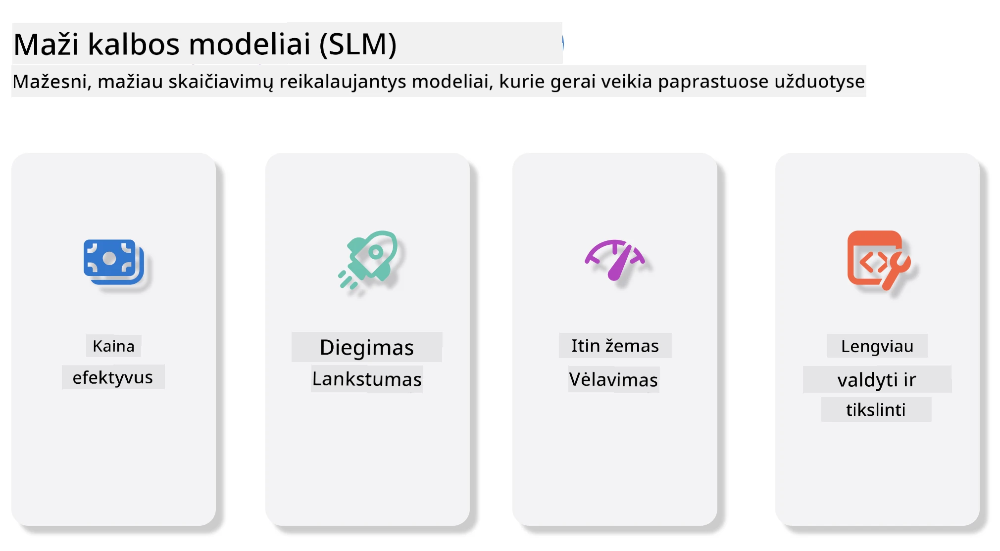
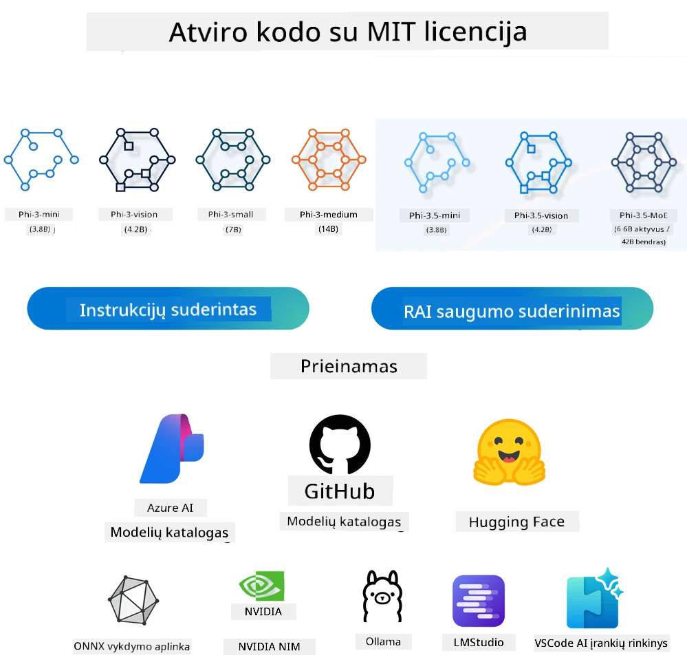
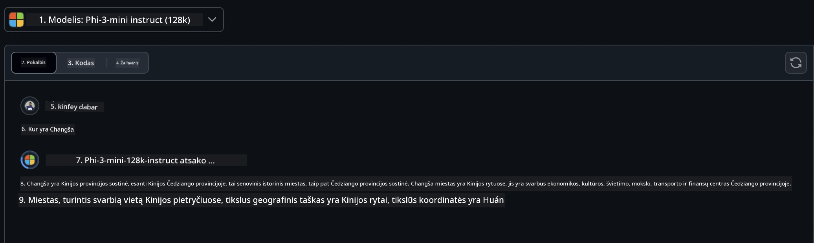
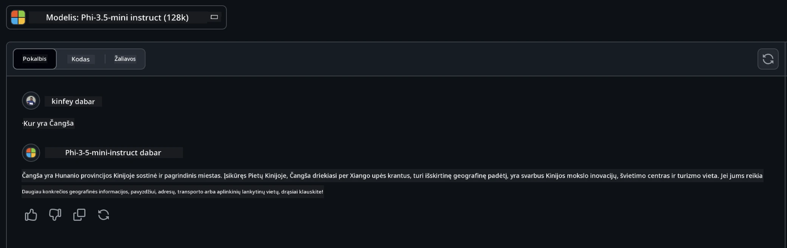

# Įvadas į mažus kalbos modelius generatyviai AI pradedantiesiems
Generatyvi AI yra įdomi dirbtinio intelekto sritis, kuri susitelkia ties sistemų kūrimu, gebančiomis generuoti naują turinį. Šis turinys gali būti nuo teksto ir vaizdų iki muzikos ar net visų virtualių aplinkų. Viena įdomiausių generatyvios AI taikymo sričių yra kalbos modeliai.

## Kas yra mažieji kalbos modeliai?

Mažasis kalbos modelis (SLM) yra sumažinta didžiojo kalbos modelio (LLM) versija, panaudojanti daugelį LLM architektūrinių principų ir technikų, tačiau turinti žymiai mažesnį skaičiavimo pėdsaką. 

SLM yra kalbos modelių pogrupis, skirtas generuoti žmogaus kalbai panašų tekstą. Priešingai nei jų didesni kolegos, tokie kaip GPT-4, SLM yra kompaktiškesni ir efektyvesni, todėl idealiai tinka programoms, kur riboti skaičiavimo ištekliai. Nors jie yra mažesni, vis tiek gali atlikti įvairias užduotis. Paprastai SLM kuriami suspaudžiant arba distiliuojant LLM, siekiant išlaikyti didelę dalį pradinio modelio funkcionalumo ir kalbinių gebėjimų. Modelio dydžio sumažinimas sumažina bendrą sudėtingumą, todėl SLM yra efektyvesni tiek atminties naudojimu, tiek skaičiavimo reikalavimais. Nepaisant šių optimizacijų, SLM vis dar gali atlikti platų natūralios kalbos apdorojimo (NLP) užduočių spektrą:

- Teksto generavimas: kurti nuoseklias ir kontekstualiai tinkamas sakinius ar pastraipas.
- Teksto pabaiga: prognozuoti ir užbaigti sakinius pagal pateiktą užuominą.
- Vertimas: konvertuoti tekstą iš vienos kalbos į kitą.
- Santraukų sudarymas: sutrumpinti ilgus tekstus į trumpesnes, lengviau suvokiamas santraukas.

Tačiau kai kuriais atvejais pasitaiko kompromisų atliekant gilesnius suvokimo veiksmus ar našumą, palyginti su didesniais modeliais.

## Kaip veikia mažieji kalbos modeliai?
SLM mokomi didžiuliais teksto duomenų kiekiais. Mokymo metu jie įsisavina kalbos modelius ir struktūras, leidžiančias generuoti tekstą, kuris yra tiek gramatiniu požiūriu taisyklingas, tiek kontekstualiai tinkamas. Mokymo procesas apima:

- Duomenų rinkimą: renkant dideles teksto duomenų bazes iš įvairių šaltinių.
- Duomenų paruošimą: duomenų švarinimą ir organizavimą, kad jie būtų tinkami mokymui.
- Mokymą: naudojant mašininio mokymosi algoritmus mokyti modelį suprasti ir generuoti tekstą.
- Smulkiąją korekciją: modelio pritaikymą, siekiant pagerinti jo veikimą konkrečiose užduotyse.

SLM vystymas dera su augančiu poreikiu modeliams, kuriuos galima įdiegti aplinkose su ribotais ištekliais, tokiuose kaip mobilūs įrenginiai ar krašto skaičiavimo platformos, kur pilnai išplėtoti LLM gali būti nepatogu dėl didelio resursų poreikio. Sutelkiant dėmesį į efektyvumą, SLM subalansuoja našumą ir prieinamumą, leidžiant platų pritaikymą įvairiose srityse.



## Mokymosi tikslai

Šiame pamokoje bandysime supažindinti su SLM žiniomis ir sujungti jas su Microsoft Phi-3, kad išmoktumėme įvairius scenarijus teksto turiniui, vaizdui ir MoE.

Pamokos pabaigoje turėtumėte sugebėti atsakyti į šiuos klausimus:

- Kas yra SLM?
- Kuo skiriasi SLM ir LLM?
- Kas yra Microsoft Phi-3/3.5 šeima?
- Kaip vykdyti išvedimą naudojant Microsoft Phi-3/3.5 šeimą?

Pasiruošę? Pradėkime.

## Skirtumai tarp didžiųjų kalbos modelių (LLM) ir mažųjų kalbos modelių (SLM)

Tiek LLM, tiek SLM statomi pagal tikimybinio mašininio mokymosi pagrindinius principus, naudodami panašius metodus architektūrai, mokymo metodikoms, duomenų generavimo ir modelio vertinimo technikoms. Tačiau keletas esminių veiksnių šiuos modelius skiria.

## Mažųjų kalbos modelių taikymai

SLM turi platų taikymą, įskaitant:

- Pokalbių robotai: teikia klientų palaikymą ir bendrauja su vartotojais pokalbių forma.
- Turinys kūrimas: padeda rašytojams generuoti idėjas ar net kurti visus straipsnius.
- Švietimas: padeda studentams rašymo užduotyse ar mokantis naujų kalbų.
- Prieinamumas: kuria įrankius žmonėms su negalia, pavyzdžiui, teksto į kalbą sistemas.

**Dydis**
  
Pagrindinis skirtumas tarp LLM ir SLM yra modelių dydžio mastas. LLM, pavyzdžiui, ChatGPT (GPT-4), gali turėti apie 1,76 trilijonus parametrų, tuo tarpu atviro kodo SLM, tokių kaip Mistral 7B, yra sukurti su žymiai mažesniu parametrų skaičiumi – apie 7 milijardus. Šis skirtumas daugiausia kyla dėl architektūros ir mokymo procesų skirtumų. Pavyzdžiui, ChatGPT naudoja savęs dėmesio mechanizmą enkoderio-dekoderio struktūroje, o Mistral 7B - slenkamojo lango dėmesį, leidžiantį efektyviau mokytis naudojant tik dekoderio modelį. Šis architektūrinis skirtumas turi didelę įtaką modelių sudėtingumui ir veikimui.

**Suvokimas**

SLM dažniausiai optimizuojami veikti konkrečiose srityse, todėl yra labai specializuoti, bet gali būti riboti plačiai kontekstinei supratimui įvairiose žinių srityse. Priešingai, LLM siekia imituoti žmogaus intelektą visapusiškiau. Mokomi didelėse ir įvairiose duomenų bazėse, LLM gali gerai veikti daugelyje sričių, todėl yra universalesni ir pritaikomi. Todėl LLM labiau tinka įvairioms tolimesnėms užduotims, tokioms kaip natūrali kalbos apdorojimas ir programavimas.

**Skaičiavimas**

LLM mokymas ir diegimas yra išteklius reikalaujantys procesai, dažnai reikalingos didelės skaičiavimo infrastruktūros, įskaitant plataus masto GPU klasterius. Pavyzdžiui, mokyti modelį kaip ChatGPT nuo nulio gali prireikti tūkstančių GPU ilgą laiką. Priešingai, SLM su mažesniu parametrų skaičiumi yra labiau prieinami išteklių požiūriu. Tokius modelius kaip Mistral 7B galima mokyti ir vykdyti vietinėse mašinose su vidutinės galios GPU, nors mokymas vis tiek reikalauja kelių valandų per kelis GPU.

**Šališkumas**

Šališkumas yra gerai žinoma problema LLM dėl mokymo duomenų pobūdžio. Šie modeliai dažnai naudoja žalius, atvirus internetinius duomenis, kurie gali nepakankamai atspindėti ar netinkamai atspindėti tam tikras grupes, įvesti klaidingą žymėjimą ar atspindėti lingvistines šališkumus, sukeltus dialekto, geografinių skirtumų ir gramatikos taisyklių. Be to, LLM sudėtinga architektūra gali netyčia padidinti šališkumą, kuris gali likti nepastebėtas be kruopštaus smulkiojo derinimo. Kita vertus, SLM, mokomi labiau ribotose sritinėse duomenų bazėse, yra mažiau linkę į tokius šališkumus, nors vis tiek nėra nuo jų apsaugoti.

**Išvedimas**

Mažesnis SLM dydis suteikia svarbų privalumą išvedimo greičio atžvilgiu, leidžiant efektyviai generuoti rezultatus vietinėje aparatinėje įrangoje be didelio lygiagretaus apdorojimo poreikio. Priešingai, LLM dėl savo dydžio ir sudėtingumo dažnai reikalauja didelių lygiagrečių skaičiavimo išteklių, kad pasiektų priimtiną išvedimo laiką. Daug vartotojų, naudojančių modelius vienu metu, dar labiau sulėtina LLM atsakymų laiką, ypač kai jie naudojami dideliame mastelyje.

Apibendrinant, nors tiek LLM, tiek SLM dalijasi mašininiam mokymu pagrįstu pagrindu, jie ženkliai skiriasi modelio dydžiu, išteklių poreikiais, kontekstiniu supratimu, atsparumu šališkumui ir išvedimo greičiu. Šie skirtumai atspindi jų tinkamumą skirtingiems panaudojimo atvejams, kai LLM yra universalesni, bet reikalauja daugiau resursų, o SLM – specializuoti ir efektyvūs su mažesniu skaičiavimo poreikiu.

***Pastaba: šioje pamokoje SLM pateiksime naudodami Microsoft Phi-3 / 3.5 pavyzdį.***

## Phi-3 / Phi-3.5 šeimos pristatymas

Phi-3 / 3.5 šeima daugiausia orientuota į teksto, vaizdo ir agentų (MoE) taikymo scenarijus:

### Phi-3 / 3.5 Instruct

Pagrinde skirta teksto generavimui, pokalbių užbaigimui ir turinio informacijos išgavimui.

**Phi-3-mini**

3,8 mlrd. parametrų kalbos modelis pasiekiamas per Microsoft Azure AI Studio, Hugging Face ir Ollama. Phi-3 modeliai žymiai lenkia lygiaverčius ar didesnius kalbos modelius pagrindiniuose testuose (žr. žemiau pateiktus rezultatus, aukštesni skaičiai yra geresni). Phi-3-mini lenkia dvigubai didesnius modelius, tuo tarpu Phi-3-small ir Phi-3-medium lenkia net didesnius modelius, įskaitant GPT-3.5.

**Phi-3-small ir medium**

Su vos 7 mlrd. parametrų Phi-3-small geriau veikia nei GPT-3.5T įvairiuose kalbos, loginio mąstymo, programavimo ir matematikos testuose.

Phi-3-medium su 14 mlrd. parametrų tęsia šią tendenciją ir lenkia Gemini 1.0 Pro.

**Phi-3.5-mini**

Galime apibūdinti kaip Phi-3-mini atnaujinimą. Parametrų skaičius lieka toks pat, tačiau pagerėja gebėjimas palaikyti daugybę kalbų (palaiko daugiau nei 20 kalbų: arabų, kinų, čekų, danų, olandų, anglų, suomių, prancūzų, vokiečių, hebrajų, vengrų, italų, japonų, korėjiečių, norvegų, lenkų, portugalų, rusų, ispanų, švedų, tailandiečių, turkų, ukrainiečių) ir sustiprintas palaikymas ilgesniam kontektstui.

Phi-3.5-mini su 3,8 mlrd. parametrais lenkia tokio paties dydžio kalbos modelius ir beveik prilygsta dvigubai didesniems modeliams.

### Phi-3 / 3.5 Vision

Galime įsivaizduoti Phi-3/3.5 Instruct modelį kaip Phi sugebėjimą suprasti, o Vision suteikia Phi akis, kad jis galėtų suvokti pasaulį.

**Phi-3-Vision**

Phi-3-Vision, turintis tik 4,2 mlrd. parametrų, tęsia šią tendenciją ir lenkia didesnius modelius, tokius kaip Claude-3 Haiku ir Gemini 1.0 Pro V bendrųjų vizualiųjų užduočių, OCR, lentelių ir diagramų supratimo srityse.

**Phi-3.5-Vision**

Phi-3.5-Vision yra Phi-3-Vision atnaujinimas, suteikiantis daugialypę vaizdų palaikymą. Jį galima laikyti regos patobulinimu – ne tik matote paveikslėlius, bet ir vaizdo įrašus.

Phi-3.5-Vision lenkia didesnius modelius, tokius kaip Claude-3.5 Sonnet ir Gemini 1.5 Flash OCR, lentelių ir diagramų supratimo užduotyse, ir prilygsta jiems bendro vizualinio žinių mąstymo srityse. Palaiko daugialypį įėjimą, t. y. geba analizuoti kelis įeinančius vaizdus.

### Phi-3.5-MoE

***Mišrių ekspertų sistema (MoE)*** leidžia modeliams būti iš anksto apmokytiems su žymiai mažiau skaičiavimo resursų, todėl galima ženkliai padidinti modelio ar duomenų rinkinį naudojant tą patį skaičiavimo biudžetą kaip tankius modelius. Ypač MoE modelis turėtų pasiekti tokią pat kokybę kaip tankio atitikmuo daug greičiau per mokymą.

Phi-3.5-MoE sudaro 16 ekspertų modulių po 3,8 mlrd. parametrų. Phi-3.5-MoE su tik 6,6 mlrd. aktyvių parametrų pasiekia panašų lygį mąstymo, kalbos supratimo ir matematikos srityse kaip daug didesni modeliai.

Galime naudoti Phi-3/3.5 šeimos modelius skirtingiems scenarijams. Skirtingai nuo LLM, Phi-3/3.5-mini arba Phi-3/3.5-Vision modelius galima diegti krašto įrenginiuose.

## Kaip naudoti Phi-3/3.5 šeimos modelius

Mes norime naudoti Phi-3/3.5 skirtinguose scenarijuose. Toliau naudosime Phi-3/3.5 atsižvelgiant į skirtingus scenarijus.



### Išvedimas per debesų API

**GitHub modeliai**

GitHub modeliai yra tiesioginis būdas. Galite greitai pasiekti Phi-3/3.5-Instruct modelį per GitHub modelius. Kartu su Azure AI Inference SDK / OpenAI SDK galite pasiekti API per kodą, kad atliktumėte Phi-3/3.5-Instruct kvietimą. Taip pat galite išbandyti skirtingus veikimo variantus per Playground.

- Demonstracija: Phi-3-mini ir Phi-3.5-mini poveikio palyginimas kinų kalbos scenarijuose





**Azure AI Studio**

Arba jei norime naudoti vaizdo ir MoE modelius, galite naudoti Azure AI Studio kvietimams atlikti. Jei domina, galite perskaityti Phi-3 Vadovą, kaip iškviesti Phi-3/3.5 Instruct, Vision, MoE per Azure AI Studio [Spauskite šią nuorodą](https://github.com/microsoft/Phi-3CookBook/blob/main/md/02.QuickStart/AzureAIStudio_QuickStart.md?WT.mc_id=academic-105485-koreyst)

**NVIDIA NIM**

Be debesų pagrindu veikiančių modelių katalogo sprendimų, kuriuos siūlo Azure ir GitHub, galite naudoti ir [NVIDIA NIM](https://developer.nvidia.com/nim?WT.mc_id=academic-105485-koreyst) kvietimams atlikti. Galite apsilankyti NVIDIA NIM, kad įvykdytumėte Phi-3/3.5 šeimos API kvietimus. NVIDIA NIM (NVIDIA Inference Microservices) yra rinkinys spartinančių išvedimo mikropaslaugų, skirtų padėti kūrėjams efektyviai diegti AI modelius įvairiose aplinkose, įskaitant debesis, duomenų centrus ir darbo vietas.

Čia pateikiamos kai kurios pagrindinės NVIDIA NIM savybės:
- **Diegimo paprastumas:** NIM leidžia įdiegti dirbtinio intelekto modelius vienu komandos įsakymu, todėl jį lengva integruoti į esamus darbo procesus.
- **Optimizuotas našumas:** Naudojamos NVIDIA iš anksto optimizuotos interpretavimo sistemos, tokios kaip TensorRT ir TensorRT-LLM, užtikrinančios mažą delsą ir didelį pralaidumą.
- **Mastelio keitimas:** NIM palaiko automatinį mastelio keitimą Kubernetes aplinkoje, leidžiantį efektyviai tvarkyti skirtingas darbo apkrovas.
- **Saugumas ir kontrolė:** Organizacijos gali išlaikyti kontrolę savo duomenims ir programoms, savarankiškai talpindamos NIM mikropaslaugas savo valdomoje infrastruktūroje.
- **Standartizuoti API:** NIM teikia pramonės standartus atitinkančius API, palengvinančius dirbtinio intelekto programų, tokių kaip pokalbių robotai, DI asistentai ir kt., kūrimą bei integraciją.

NIM yra NVIDIA AI Enterprise dalis, kurios tikslas – supaprastinti dirbtinio intelekto modelių diegimą ir eksploatavimą, užtikrinant efektyvų veikimą NVIDIA GPU.

- Demonstracija: Kaip naudoti NVIDIA NIM norint iškviesti Phi-3.5-Vision-API  [[Spustelėkite šią nuorodą](./python/Phi-3-Vision-Nividia-NIM.ipynb?WT.mc_id=academic-105485-koreyst)]


### Phi-3/3.5 paleidimas lokaliai
Interpretavimas, susijęs su Phi-3 arba bet kokiu kalbos modeliu, pvz., GPT-3, reiškia atsakymų ar prognozių generavimo procesą, remiantis pateiktu įvesties duomenimis. Kai pateikiate Phi-3 užklausą ar klausimą, jis naudoja išmokytą neuroninį tinklą, kad, analizuodamas duomenų modelius ir ryšius, išvestų tikėtiniausią ir aktualiausią atsakymą.

**Hugging Face Transformer**
Hugging Face Transformers yra galinga biblioteka, skirta natūralios kalbos apdorojimo (NLP) ir kitoms mašininio mokymosi užduotims. Štai keletas svarbių aspektų apie ją:

1. **Iš anksto apmokyti modeliai:** Teikia tūkstančius iš anksto apmokytų modelių įvairioms užduotims, tokioms kaip teksto klasifikavimas, vardų atpažinimas, klausimų atsakymas, santraukų sudarymas, vertimas ir teksto generavimas.

2. **Suderinamumas su sistemomis:** Biblioteka palaiko kelis gilų mokymąsi pagrindžiančius framework’us, tokius kaip PyTorch, TensorFlow ir JAX. Tai leidžia apmokyti modelį vienoje aplinkoje ir naudoti kitoje.

3. **Multimodalinės galimybės:** Be NLP, Hugging Face Transformers palaiko užduotis kompiuterinėje vizijoje (pvz., vaizdų klasifikacija, objektų aptikimas) ir garso apdorojime (pvz., balso atpažinimas, garso klasifikacija).

4. **Patogumas naudoti:** Biblioteka siūlo API ir įrankius, leidžiančius lengvai parsisiųsti ir derinti modelius, todėl prieinama tiek pradedantiesiems, tiek ekspertams.

5. **Bendruomenė ir ištekliai:** Hugging Face turi aktyvią bendruomenę, išsamią dokumentaciją, pamokas ir vadovus, padedančius vartotojams pradėti ir maksimaliai išnaudoti biblioteką.
[oficiali dokumentacija](https://huggingface.co/docs/transformers/index?WT.mc_id=academic-105485-koreyst) arba jų [GitHub saugykla](https://github.com/huggingface/transformers?WT.mc_id=academic-105485-koreyst).

Tai dažniausiai naudojamas metodas, bet reikalauja GPU pagreičio. Juk tokios užduotys kaip Vision ir MoE reikalauja daug skaičiavimų, kurie be kiekiavimo būtų labai lėti CPU.

- Demonstracija: Naudojant Transformer iškviesti Phi-3.5-Instruct [Spustelėkite šią nuorodą](./python/phi35-instruct-demo.ipynb?WT.mc_id=academic-105485-koreyst)

- Demonstracija: Naudojant Transformer iškviesti Phi-3.5-Vision [Spustelėkite šią nuorodą](./python/phi35-vision-demo.ipynb?WT.mc_id=academic-105485-koreyst)

- Demonstracija: Naudojant Transformer iškviesti Phi-3.5-MoE [Spustelėkite šią nuorodą](./python/phi35_moe_demo.ipynb?WT.mc_id=academic-105485-koreyst)

**Ollama**
[Ollama](https://ollama.com/?WT.mc_id=academic-105485-koreyst) yra platforma, skirta palengvinti didžiųjų kalbos modelių (LLM) paleidimą lokaliai jūsų kompiuteryje. Ji palaiko įvairius modelius, tokius kaip Llama 3.1, Phi 3, Mistral ir Gemma 2. Platforma supaprastina procesą sujungdama modelio svorius, konfigūraciją ir duomenis į vieną paketą, todėl vartotojams lengviau pritaikyti ir kurti savo modelius. Ollama veikia macOS, Linux ir Windows sistemose. Tai puikus įrankis eksperimentuoti arba diegti LLM nepasižymint nuo debesies paslaugų. Ollama yra pats tiesiausias kelias, tereikia įvykdyti šią komandą.


```bash

ollama run phi3.5

```


**ONNX Runtime for GenAI**

[ONNX Runtime](https://github.com/microsoft/onnxruntime-genai?WT.mc_id=academic-105485-koreyst) yra daugiaplatformė interpretavimo ir mokymo akceleratoriaus priemonė mašininio mokymosi modeliui. ONNX Runtime for Generative AI (GENAI) yra galingas įrankis, padedantis efektyviai vykdyti generatyviuosius DI modelius įvairiose platformose.

## Kas yra ONNX Runtime?
ONNX Runtime yra atviro kodo projektas, leidžiantis greitai interpretuoti mašininio mokymosi modelius. Jis palaiko modelius Open Neural Network Exchange (ONNX) formatu, kuris yra standartas mašininio mokymosi modeliui atvaizduoti. ONNX Runtime interpretavimas gali pagreitinti klientų patirtį ir sumažinti kaštus, palaikydamas modelius iš gilaus mokymosi sistemų kaip PyTorch ir TensorFlow/Keras bei klasikinių mašininio mokymosi bibliotekų kaip scikit-learn, LightGBM, XGBoost ir kt. ONNX Runtime suderinamas su įvairia įranga, tvarkyklėmis ir operacinėmis sistemomis, suteikdamas optimalią našumo kokybę pasinaudodamas įrenginių akceleratoriais bei grafikų optimizacijomis ir transformacijomis.

## Kas yra generatyvioji DI?
Generatyvioji DI yra DI sistemos, galinčios generuoti naują turinį, pvz., tekstą, vaizdus ar muziką, remiantis išmoktais duomenimis. Pavyzdžiai – kalbos modeliai, tokie kaip GPT-3, ir vaizdų generavimo modeliai, tokie kaip Stable Diffusion. ONNX Runtime for GenAI biblioteka teikia generatyviąją DI ciklą ONNX modeliams, įskaitant interpretavimo su ONNX Runtime, logitų apdorojimą, paiešką ir atranką, bei KV talpyklos valdymą.

## ONNX Runtime skirta GENAI
ONNX Runtime skirta GENAI plečia ONNX Runtime galimybes, kad palaikytų generatyviuosius DI modelius. Štai keletas pagrindinių funkcijų:

- **Platus platformų palaikymas:** Veikia įvairiose platformose, įskaitant Windows, Linux, macOS, Android ir iOS.
- **Modelių palaikymas:** Palaiko daug populiarių generatyvių DI modelių, tokių kaip LLaMA, GPT-Neo, BLOOM ir kitus.
- **Našumo optimizavimas:** Apima optimizacijas skirtingiems įrenginių akceleratoriams, tokiems kaip NVIDIA GPU, AMD GPU ir kt.
- **Patogumas naudoti:** Teikia API paprastai integracijai į programas, leidžia generuoti tekstą, vaizdus ir kitą turinį su minimaliu kodu
- Naudotojai gali kviesti aukšto lygio generate() metodą arba vykdyti modelio iteracijas cikle, generuodami po vieną žetoną vienu metu, ir pageidaujant atnaujinti generavimo parametrus ciklo viduje.
- ONNX Runtime taip pat palaiko godžią/ spindulinę paiešką bei TopP, TopK atranką žetonų sekų generavimui ir vidinį logitų apdorojimą, pvz., pakartojimo bausmes. Taip pat galima lengvai pridėti pasirinktinius įvertinimus.

## Pradžia
Norėdami pradėti naudoti ONNX Runtime skirta GENAI, galite atlikti šiuos veiksmus:

### Įdiekite ONNX Runtime:
```Python
pip install onnxruntime
```
### Įdiekite Generatyviosios DI plėtinius:
```Python
pip install onnxruntime-genai
```

### Paleiskite modelį: štai paprastas pavyzdys Python kalba:
```Python
import onnxruntime_genai as og

model = og.Model('path_to_your_model.onnx')

tokenizer = og.Tokenizer(model)

input_text = "Hello, how are you?"

input_tokens = tokenizer.encode(input_text)

output_tokens = model.generate(input_tokens)

output_text = tokenizer.decode(output_tokens)

print(output_text) 
```
### Demonstracija: Kaip naudoti ONNX Runtime GenAI iškviesti Phi-3.5-Vision


```python

import onnxruntime_genai as og

model_path = './Your Phi-3.5-vision-instruct ONNX Path'

img_path = './Your Image Path'

model = og.Model(model_path)

processor = model.create_multimodal_processor()

tokenizer_stream = processor.create_stream()

text = "Your Prompt"

prompt = "<|user|>\n"

prompt += "<|image_1|>\n"

prompt += f"{text}<|end|>\n"

prompt += "<|assistant|>\n"

image = og.Images.open(img_path)

inputs = processor(prompt, images=image)

params = og.GeneratorParams(model)

params.set_inputs(inputs)

params.set_search_options(max_length=3072)

generator = og.Generator(model, params)

while not generator.is_done():

    generator.compute_logits()
    
    generator.generate_next_token()

    new_token = generator.get_next_tokens()[0]
    
    output = tokenizer_stream.decode(new_token)
    
    print(tokenizer_stream.decode(new_token), end='', flush=True)

```


**Kita**

Be ONNX Runtime ir Ollama referencinių metodų, galime papildyti kiekybinių modelių referenciją pagal skirtingų gamintojų pateiktus modelių referencinius metodus. Pavyzdžiui, Apple MLX framework su Apple Metal, Qualcomm QNN su NPU, Intel OpenVINO su CPU/GPU ir kt. Daugiau informacijos rasite [Phi-3 Cookbook](https://github.com/microsoft/phi-3cookbook?WT.mc_id=academic-105485-koreyst).

## Daugiau

Išmokome Phi-3/3.5 šeimos pagrindus, tačiau norint sužinoti daugiau apie SLM, reikia daugiau žinių. Atsakymus rasite Phi-3 Cookbook. Jei norite daugiau sužinoti, apsilankykite [Phi-3 Cookbook](https://github.com/microsoft/phi-3cookbook?WT.mc_id=academic-105485-koreyst).

---

<!-- CO-OP TRANSLATOR DISCLAIMER START -->
**Atsakomybės apribojimas**:
Šis dokumentas buvo išverstas naudojant dirbtinio intelekto vertimo paslaugą [Co-op Translator](https://github.com/Azure/co-op-translator). Nors stengiamės užtikrinti tikslumą, prašome atsižvelgti, kad automatizuoti vertimai gali turėti klaidų ar netikslumų. Originalus dokumentas jo gimtąja kalba turėtų būti laikomas autoritetingu šaltiniu. Kritinei informacijai rekomenduojamas profesionalus žmogiškas vertimas. Mes neatsakome už bet kokius nesusipratimus ar neteisingus interpretavimus, atsiradusius dėl šio vertimo naudojimo.
<!-- CO-OP TRANSLATOR DISCLAIMER END -->