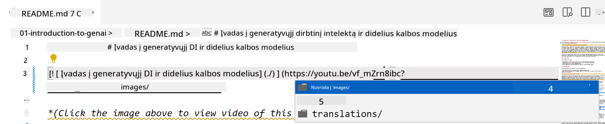
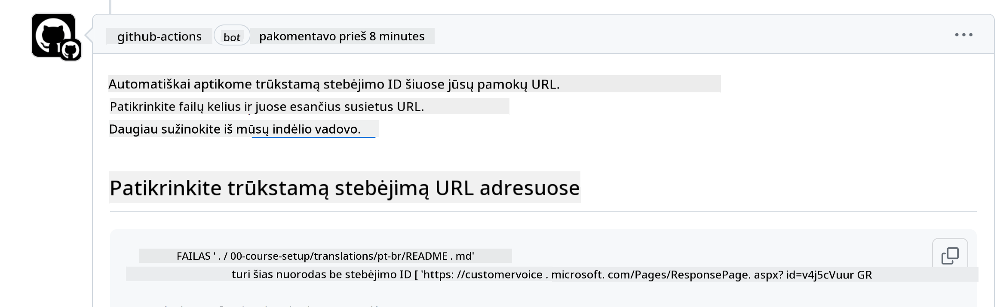

<!--
CO_OP_TRANSLATOR_METADATA:
{
  "original_hash": "57c41f2af71001a2cff9d8eb797cb843",
  "translation_date": "2025-08-25T12:17:43+00:00",
  "source_file": "CONTRIBUTING.md",
  "language_code": "lt"
}
-->
# Prisidėjimas

Šis projektas kviečia prisidėti ir teikti pasiūlymus. Dauguma indėlių reikalauja, kad sutiktumėte su Contributor License Agreement (CLA), patvirtinančiu, jog turite teisę ir iš tikrųjų suteikiate mums teisę naudoti jūsų indėlį. Daugiau informacijos rasite <https://cla.microsoft.com>.

> Svarbu: verčiant tekstą šiame repozitoriume, prašome nenaudoti automatinio vertimo. Vertimus tikrins bendruomenė, tad savanoriaukite tik toms kalboms, kurias gerai mokate.

Kai pateikiate pull request, CLA-bot automatiškai nustatys, ar reikia pateikti CLA, ir atitinkamai pažymės PR (pvz., etikete, komentaru). Tiesiog vykdykite boto pateiktas instrukcijas. Tai reikės padaryti tik vieną kartą visuose repozitoriumuose, naudojančiuose mūsų CLA.

## Elgesio kodeksas

Šis projektas laikosi [Microsoft Open Source Code of Conduct](https://opensource.microsoft.com/codeofconduct/?WT.mc_id=academic-105485-koreyst).
Daugiau informacijos rasite [Code of Conduct FAQ](https://opensource.microsoft.com/codeofconduct/faq/?WT.mc_id=academic-105485-koreyst) arba kreipkitės el. paštu [opencode@microsoft.com](mailto:opencode@microsoft.com), jei turite papildomų klausimų ar komentarų.

## Klausimai ar problemos?

Prašome nerašyti GitHub issue bendriems pagalbos klausimams, nes GitHub sąrašas skirtas funkcijų užklausoms ir klaidų pranešimams. Taip lengviau sekti tikras problemas ar klaidas iš kodo ir atskirti bendrą diskusiją nuo tikrojo kodo.

## Rašybos klaidos, problemos, klaidos ir indėliai

Kai teikiate pakeitimus į Generative AI for Beginners repozitoriumą, laikykitės šių rekomendacijų.

* Visada forkinkite repozitoriumą į savo paskyrą prieš darydami pakeitimus
* Nekombinuokite kelių pakeitimų į vieną pull request. Pavyzdžiui, klaidų pataisymus ir dokumentacijos atnaujinimus teikite atskirais PR
* Jei jūsų pull request rodo susijungimo konfliktus, įsitikinkite, kad jūsų vietinis main atitinka pagrindinį repozitoriumą prieš darydami pakeitimus
* Jei teikiate vertimą, sukurkite vieną PR visiems išverstiems failams, nes nepriimame dalinių vertimų
* Jei teikiate rašybos ar dokumentacijos pataisymą, galite sujungti pakeitimus į vieną PR, jei tai tinkama

## Bendros rašymo gairės

- Įsitikinkite, kad visi jūsų URL yra apgaubti kvadratiniais skliaustais, po kurių eina skliaustai be papildomų tarpų ``.
- Įsitikinkite, kad bet kuri reliatyvi nuoroda (t.y. nuorodos į kitus failus ar aplankus repozitoriume) prasideda nuo `./`, nurodančio failą ar aplanką dabartiniame darbiname kataloge, arba `../`, nurodančio failą ar aplanką tėviniame kataloge.
- Įsitikinkite, kad bet kuri reliatyvi nuoroda turi sekimo ID (t.y. `?` arba `&` ir tada `wt.mc_id=` arba `WT.mc_id=`) pabaigoje.
- Įsitikinkite, kad bet kuris URL iš šių domenų _github.com, microsoft.com, visualstudio.com, aka.ms, ir azure.com_ turi sekimo ID (t.y. `?` arba `&` ir tada `wt.mc_id=` arba `WT.mc_id=`) pabaigoje.
- Įsitikinkite, kad jūsų nuorodose nėra šalies lokalės (pvz., `/en-us/` ar `/en/`).
- Įsitikinkite, kad visi paveikslėliai saugomi `./images` aplanke.
- Įsitikinkite, kad paveikslėliai turi aprašomuosius pavadinimus, naudojant angliškus simbolius, skaičius ir brūkšnelius pavadinime.

## GitHub darbo eigos

Kai pateikiate pull request, bus paleistos keturios skirtingos darbo eigos, kurios patikrins aukščiau išvardintas taisykles.
Tiesiog vykdykite čia pateiktas instrukcijas, kad sėkmingai praeitumėte patikrinimus.

- [Check Broken Relative Paths](../..)
- [Check Paths Have Tracking](../..)
- [Check URLs Have Tracking](../..)
- [Check URLs Don't Have Locale](../..)

### Check Broken Relative Paths

Ši darbo eiga užtikrina, kad visi reliatyvūs keliai jūsų failuose veikia.
Šis repozitoriumas publikuojamas GitHub pages, todėl reikia būti labai atidiems rašant nuorodas, kad jos nukreiptų į teisingą vietą.

Norėdami įsitikinti, kad jūsų nuorodos veikia tinkamai, naudokite VS code ir patikrinkite jas.

Pavyzdžiui, užvedus pelę ant nuorodos, VS code pasiūlys ją atidaryti paspaudus **ctrl + click**

Jei paspausite nuorodą ir ji neveikia lokaliai, tikrai sukels darbo eigos klaidą ir neveiks GitHub.

Norėdami ištaisyti šią problemą, rašykite nuorodą su VS code pagalba.

Kai rašote `./` arba `../`, VS code pasiūlys pasirinkti iš galimų variantų pagal tai, ką įvedėte.

Sekite kelią paspaudę norimą failą ar aplanką ir būsite tikri, kad kelias nėra sugadintas.

Kai pridėsite teisingą reliatyvų kelią, išsaugokite ir išsiųskite pakeitimus – darbo eiga vėl bus paleista, kad patikrintų jūsų pakeitimus.
Jei praeisite patikrinimą, viskas gerai.

### Check Paths Have Tracking

Ši darbo eiga užtikrina, kad bet kuris reliatyvus kelias turi sekimą.
Šis repozitoriumas publikuojamas GitHub pages, todėl reikia sekti judėjimą tarp skirtingų failų ir aplankų.

Norėdami įsitikinti, kad jūsų reliatyvūs keliai turi sekimą, tiesiog patikrinkite, ar pabaigoje yra tekstas `?wt.mc_id=`.
Jei jis pridėtas prie jūsų reliatyvių kelių, praeisite patikrinimą.

Jei ne, galite gauti šią klaidą.

Norėdami ištaisyti šią problemą, atidarykite failo kelią, kurį pažymėjo darbo eiga, ir pridėkite sekimo ID reliatyvių kelių pabaigoje.

Kai pridėsite sekimo ID, išsaugokite ir išsiųskite pakeitimus – darbo eiga vėl bus paleista, kad patikrintų jūsų pakeitimus.
Jei praeisite patikrinimą, viskas gerai.

### Check URLs Have Tracking

Ši darbo eiga užtikrina, kad bet kuris interneto URL turi sekimą.
Šis repozitoriumas prieinamas visiems, todėl reikia sekti prieigą, kad žinotume, iš kur ateina srautas.

Norėdami įsitikinti, kad jūsų URL turi sekimą, tiesiog patikrinkite, ar pabaigoje yra tekstas `?wt.mc_id=`.
Jei jis pridėtas prie jūsų URL, praeisite patikrinimą.

Jei ne, galite gauti šią klaidą.

Norėdami ištaisyti šią problemą, atidarykite failo kelią, kurį pažymėjo darbo eiga, ir pridėkite sekimo ID URL pabaigoje.

Kai pridėsite sekimo ID, išsaugokite ir išsiųskite pakeitimus – darbo eiga vėl bus paleista, kad patikrintų jūsų pakeitimus.
Jei praeisite patikrinimą, viskas gerai.

### Check URLs Don't Have Locale

Ši darbo eiga užtikrina, kad bet kuris interneto URL neturi šalies lokalės.
Šis repozitoriumas prieinamas visiems pasaulyje, todėl reikia neįtraukti šalies lokalės į URL.

Norėdami įsitikinti, kad jūsų URL neturi šalies lokalės, tiesiog patikrinkite, ar nėra teksto `/en-us/` ar `/en/` ar kitos kalbos lokalės URL.
Jei nėra, praeisite patikrinimą.

Jei ne, galite gauti šią klaidą.

Norėdami ištaisyti šią problemą, atidarykite failo kelią, kurį pažymėjo darbo eiga, ir pašalinkite šalies lokalę iš URL.

Kai pašalinsite šalies lokalę, išsaugokite ir išsiųskite pakeitimus – darbo eiga vėl bus paleista, kad patikrintų jūsų pakeitimus.
Jei praeisite patikrinimą, viskas gerai.

Sveikiname! Susisieksime su jumis kuo greičiau ir pateiksime atsiliepimą apie jūsų indėlį.

---

**Atsakomybės atsisakymas**:  
Šis dokumentas buvo išverstas naudojant dirbtinio intelekto vertimo paslaugą [Co-op Translator](https://github.com/Azure/co-op-translator). Nors siekiame tikslumo, prašome atkreipti dėmesį, kad automatiniai vertimai gali turėti klaidų ar netikslumų. Originalus dokumentas jo gimtąja kalba turėtų būti laikomas autoritetingu šaltiniu. Kritinei informacijai rekomenduojame profesionalų žmogaus vertimą. Mes neatsakome už nesusipratimus ar neteisingą interpretavimą, kilusį dėl šio vertimo naudojimo.