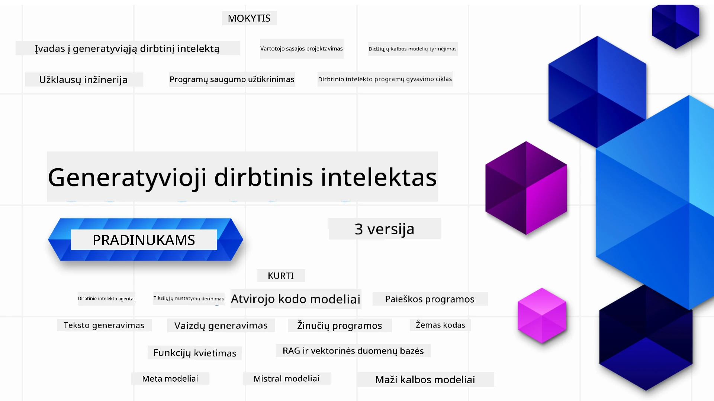

<!--
CO_OP_TRANSLATOR_METADATA:
{
  "original_hash": "054860715e642de31fa8e15c6d01f2b1",
  "translation_date": "2026-01-05T17:11:17+00:00",
  "source_file": "README.md",
  "language_code": "lt"
}
-->


### 21 pamoka, mokanti visko, ką reikia žinoti norint pradėti kurti generatyvinės DI programas

[](https://github.com/microsoft/Generative-AI-For-Beginners/blob/master/LICENSE?WT.mc_id=academic-105485-koreyst)
[](https://GitHub.com/microsoft/Generative-AI-For-Beginners/graphs/contributors/?WT.mc_id=academic-105485-koreyst)
[](https://GitHub.com/microsoft/Generative-AI-For-Beginners/issues/?WT.mc_id=academic-105485-koreyst)
[](https://GitHub.com/microsoft/Generative-AI-For-Beginners/pulls/?WT.mc_id=academic-105485-koreyst)
[](http://makeapullrequest.com?WT.mc_id=academic-105485-koreyst)

[](https://GitHub.com/microsoft/Generative-AI-For-Beginners/watchers/?WT.mc_id=academic-105485-koreyst)
[](https://GitHub.com/microsoft/Generative-AI-For-Beginners/network/?WT.mc_id=academic-105485-koreyst)
[](https://GitHub.com/microsoft/Generative-AI-For-Beginners/stargazers/?WT.mc_id=academic-105485-koreyst)

[](https://discord.gg/nTYy5BXMWG)

### 🌐 Daugiakalbė palaikymas

#### Palaikoma per GitHub Action (automatiškai ir visada atnaujinama)

<!-- CO-OP TRANSLATOR LANGUAGES TABLE START -->
[arabų](../ar/README.md) | [bengalų](../bn/README.md) | [bulgarų](../bg/README.md) | [birmos (Myanmar)](../my/README.md) | [kinų (supaprastinta)](../zh/README.md) | [kinų (tradicinė, Honkongas)](../hk/README.md) | [kinų (tradicinė, Makao)](../mo/README.md) | [kinų (tradicinė, Taivanas)](../tw/README.md) | [kroatų](../hr/README.md) | [čekų](../cs/README.md) | [danų](../da/README.md) | [olandų](../nl/README.md) | [estų](../et/README.md) | [suomių](../fi/README.md) | [prancūzų](../fr/README.md) | [vokiečių](../de/README.md) | [graikų](../el/README.md) | [ivritų](../he/README.md) | [hindi](../hi/README.md) | [vengrų](../hu/README.md) | [indoneziečių](../id/README.md) | [italų](../it/README.md) | [japonų](../ja/README.md) | [kannadų](../kn/README.md) | [korėjiečių](../ko/README.md) | [lietuvių](./README.md) | [malajų](../ms/README.md) | [malajalamų](../ml/README.md) | [maratų](../mr/README.md) | [nepalų](../ne/README.md) | [nigerijos pidžino](../pcm/README.md) | [norvegų](../no/README.md) | [persų (Farsi)](../fa/README.md) | [lenkų](../pl/README.md) | [portugalų (Brasilija)](../br/README.md) | [portugalų (Portugalija)](../pt/README.md) | [punjabi (Gurmukhi)](../pa/README.md) | [rumunų](../ro/README.md) | [rusų](../ru/README.md) | [serbų (kirilica)](../sr/README.md) | [slovakų](../sk/README.md) | [slovėnų](../sl/README.md) | [ispanų](../es/README.md) | [svahili](../sw/README.md) | [švedų](../sv/README.md) | [tagalogų (filipiniečių)](../tl/README.md) | [tamilų](../ta/README.md) | [telugų](../te/README.md) | [tailandiečių](../th/README.md) | [turkų](../tr/README.md) | [ukrainiečių](../uk/README.md) | [urdu](../ur/README.md) | [vietnamiečių](../vi/README.md)

> **Verčiau klonuoti vietoje?**

> Šiame saugykloje yra daugiau nei 50 kalbų vertimų, kas reikšmingai padidina atsisiuntimo dydį. Norėdami klonuoti be vertimų, naudokite ribotą nuskaitymą:
> ```bash
> git clone --filter=blob:none --sparse https://github.com/microsoft/generative-ai-for-beginners.git
> cd generative-ai-for-beginners
> git sparse-checkout set --no-cone '/*' '!translations' '!translated_images'
> ```
> Tai suteikia jums viską, ko reikia kursui baigti, su daug greitesniu atsisiuntimu.
<!-- CO-OP TRANSLATOR LANGUAGES TABLE END -->

# Generatyvinis DI pradedantiesiems (3 versija) - kursas

Išmokite generatyvinių DI programų kūrimo pagrindus su mūsų 21 pamokos išsamiais kursais, parengtais Microsoft Cloud Advocates.

## 🌱 Pradžia

Šiame kurse yra 21 pamoka. Kiekviena pamoka apima savo temą, tad pradėkite nuo bet kurios!

Pamokos pažymėtos kaip "Mokykis" - paaiškinančios generatyvinės DI sąvoką, arba "Kurti" - paaiškinančios sąvoką ir pateikiančios kodo pavyzdžius tiek **Python**, tiek **TypeScript**, jei įmanoma.

.NET kūrėjams rekomenduojame [Generatyvinis DI pradedantiesiems (.NET leidimas)](https://github.com/microsoft/Generative-AI-for-beginners-dotnet?WT.mc_id=academic-105485-koreyst)!

Kiekvienoje pamokoje yra skyrius "Tolimesnis mokymasis" su papildomais mokymosi įrankiais.

## Ko jums reikia
### Norint vykdyti šio kurso kodą galite naudoti:
 - [Azure OpenAI Service](https://aka.ms/genai-beginners/azure-open-ai?WT.mc_id=academic-105485-koreyst) - **Pamokos:** "aoai-assignment"
 - [GitHub Marketplace Model Catalog](https://aka.ms/genai-beginners/gh-models?WT.mc_id=academic-105485-koreyst) - **Pamokos:** "githubmodels"
 - [OpenAI API](https://aka.ms/genai-beginners/open-ai?WT.mc_id=academic-105485-koreyst) - **Pamokos:** "oai-assignment" 
   
- Pagrindinės Python arba TypeScript žinios yra naudingos - \*Pradedantiesiems siūlome šiuos [Python](https://aka.ms/genai-beginners/python?WT.mc_id=academic-105485-koreyst) ir [TypeScript](https://aka.ms/genai-beginners/typescript?WT.mc_id=academic-105485-koreyst) kursus
- GitHub paskyra, kad galėtumėte [padaryti fork visai saugyklai](https://aka.ms/genai-beginners/github?WT.mc_id=academic-105485-koreyst) į savo GitHub paskyrą

Sukūrėme **[Kurso paruošimo](./00-course-setup/README.md?WT.mc_id=academic-105485-koreyst)** pamoką, kuri padės susikurti kūrimo aplinką.

Nepamirškite [žvaigždutės (🌟) šiai saugyklai](https://docs.github.com/en/get-started/exploring-projects-on-github/saving-repositories-with-stars?WT.mc_id=academic-105485-koreyst), kad vėliau būtų lengviau ją rasti.

## 🧠 Pasiruošę diegti?

Jei ieškote pažangesnių kodo pavyzdžių, peržiūrėkite mūsų [generatyvinių DI kodo pavyzdžių kolekciją](https://aka.ms/genai-beg-code?WT.mc_id=academic-105485-koreyst) tiek **Python**, tiek **TypeScript** kalbomis.

## 🗣️ Susipažinkite su kitais besimokančiais, gaukite pagalbą

Prisijunkite prie mūsų [oficialaus Azure AI Foundry Discord serverio](https://aka.ms/genai-discord?WT.mc_id=academic-105485-koreyst), kad susipažintumėte ir bendrautumėte su kitais šį kursą besimokančiais ir gaukite palaikymą.

Užduokite klausimus arba pasidalinkite produkto atsiliepimais mūsų [Azure AI Foundry kūrėjų forume](https://aka.ms/azureaifoundry/forum) GitHub'e.

## 🚀 Norite kurti startuolį?

Apsilankykite [Microsoft for Startups](https://www.microsoft.com/startups), kad sužinotumėte, kaip šiandien pradėti kurti su Azure kreditais.

## 🙏 Norite padėti?

Turite pasiūlymų ar radote rašybos ar kodo klaidų? [Pateikite problemą](https://github.com/microsoft/generative-ai-for-beginners/issues?WT.mc_id=academic-105485-koreyst) arba [Sukurkite pull request](https://github.com/microsoft/generative-ai-for-beginners/pulls?WT.mc_id=academic-105485-koreyst)

## 📂 Kiekviena pamoka apima:

- Trumpą vaizdo įrašo įvado dalį apie temą
- Rašytinę pamoką README faile
- Python ir TypeScript kodo pavyzdžius, palaikančius Azure OpenAI ir OpenAI API
- Nuorodas į papildomus išteklius tęsti mokymąsi

## 🗃️ Pamokos

| #   | **Pamokos nuoroda**                                                                                                                          | **Aprašymas**                                                                                   | **Vaizdo įrašas**                                                            | **Papildomas mokymasis**                                                        |
| --- | -------------------------------------------------------------------------------------------------------------------------------------------- | ----------------------------------------------------------------------------------------------- | --------------------------------------------------------------------------- | ------------------------------------------------------------------------------ |
| 00  | [Kurso paruošimas](./00-course-setup/README.md?WT.mc_id=academic-105485-koreyst)                                                               | **Mokykis:** Kaip susikurti kūrimo aplinką                                                    | Vaizdo įrašas artėja                                                          | [Sužinokite daugiau](https://aka.ms/genai-collection?WT.mc_id=academic-105485-koreyst) |
| 01  | [Įvadas į generatyvinę DI ir didelius kalbos modelius (LLM)](./01-introduction-to-genai/README.md?WT.mc_id=academic-105485-koreyst)               | **Mokykis:** Sužinoti, kas yra generatyvinė DI ir kaip veikia dideli kalbos modeliai (LLM).    | [Vaizdo įrašas](https://aka.ms/gen-ai-lesson-1-gh?WT.mc_id=academic-105485-koreyst) | [Sužinokite daugiau](https://aka.ms/genai-collection?WT.mc_id=academic-105485-koreyst) |
| 02  | [Skirtingų LLM modelių tyrinėjimas ir palyginimas](./02-exploring-and-comparing-different-llms/README.md?WT.mc_id=academic-105485-koreyst)         | **Mokykis:** Kaip pasirinkti tinkamą modelį savo naudojimo atvejui                              | [Vaizdo įrašas](https://aka.ms/gen-ai-lesson2-gh?WT.mc_id=academic-105485-koreyst) | [Sužinokite daugiau](https://aka.ms/genai-collection?WT.mc_id=academic-105485-koreyst) |
| 03  | [Atsakingas generatyvinės DI naudojimas](./03-using-generative-ai-responsibly/README.md?WT.mc_id=academic-105485-koreyst)                         | **Mokykis:** Kaip atsakingai kurti generatyvinės DI programas                                  | [Vaizdo įrašas](https://aka.ms/gen-ai-lesson3-gh?WT.mc_id=academic-105485-koreyst) | [Sužinokite daugiau](https://aka.ms/genai-collection?WT.mc_id=academic-105485-koreyst) |
| 04  | [Pasiūlymų inžinerijos pagrindų supratimas](./04-prompt-engineering-fundamentals/README.md?WT.mc_id=academic-105485-koreyst)                       | **Mokykis:** Praktiniai geriausios pasiūlymų inžinerijos praktikos pavyzdžiai                 | [Vaizdo įrašas](https://aka.ms/gen-ai-lesson4-gh?WT.mc_id=academic-105485-koreyst) | [Sužinokite daugiau](https://aka.ms/genai-collection?WT.mc_id=academic-105485-koreyst) |
| 05  | [Išplėstinių užklausų kūrimas](./05-advanced-prompts/README.md?WT.mc_id=academic-105485-koreyst)                                                | **Sužinokite:** Kaip taikyti užklausų inžinerijos technikas, kurios pagerina užklausų rezultatą. | [Video](https://aka.ms/gen-ai-lesson5-gh?WT.mc_id=academic-105485-koreyst)  | [Sužinokite daugiau](https://aka.ms/genai-collection?WT.mc_id=academic-105485-koreyst) |
| 06  | [Teksto generavimo programų kūrimas](./06-text-generation-apps/README.md?WT.mc_id=academic-105485-koreyst)                                | **Sukurkite:** Teksto generavimo programą, naudojant Azure OpenAI / OpenAI API                 | [Video](https://aka.ms/gen-ai-lesson6-gh?WT.mc_id=academic-105485-koreyst)  | [Sužinokite daugiau](https://aka.ms/genai-collection?WT.mc_id=academic-105485-koreyst) |
| 07  | [Poklapių programų kūrimas](./07-building-chat-applications/README.md?WT.mc_id=academic-105485-koreyst)                                     | **Sukurkite:** Efektyvaus poklapių programų kūrimo ir integravimo metodus.                    | [Video](https://aka.ms/gen-ai-lessons7-gh?WT.mc_id=academic-105485-koreyst) | [Sužinokite daugiau](https://aka.ms/genai-collection?WT.mc_id=academic-105485-koreyst) |
| 08  | [Paieškos programų kūrimas vektorinėse duomenų bazėse](./08-building-search-applications/README.md?WT.mc_id=academic-105485-koreyst)        | **Sukurkite:** Paieškos programą, kuri naudoja įterpimus (Embeddings) duomenims ieškoti.      | [Video](https://aka.ms/gen-ai-lesson8-gh?WT.mc_id=academic-105485-koreyst)  | [Sužinokite daugiau](https://aka.ms/genai-collection?WT.mc_id=academic-105485-koreyst) |
| 09  | [Vaizdų generavimo programų kūrimas](./09-building-image-applications/README.md?WT.mc_id=academic-105485-koreyst)                            | **Sukurkite:** Vaizdų generavimo programą                                                  | [Video](https://aka.ms/gen-ai-lesson9-gh?WT.mc_id=academic-105485-koreyst)  | [Sužinokite daugiau](https://aka.ms/genai-collection?WT.mc_id=academic-105485-koreyst) |
| 10  | [Mažo kodo DI programų kūrimas](./10-building-low-code-ai-applications/README.md?WT.mc_id=academic-105485-koreyst)                         | **Sukurkite:** Generatyvią DI programą, naudojant mažo kodo įrankius                         | [Video](https://aka.ms/gen-ai-lesson10-gh?WT.mc_id=academic-105485-koreyst) | [Sužinokite daugiau](https://aka.ms/genai-collection?WT.mc_id=academic-105485-koreyst) |
| 11  | [Išorinių programų integravimas su funkcijų kvietimu](./11-integrating-with-function-calling/README.md?WT.mc_id=academic-105485-koreyst)    | **Sukurkite:** Kas yra funkcijų kvietimas ir jo panaudojimo atvejai programose               | [Video](https://aka.ms/gen-ai-lesson11-gh?WT.mc_id=academic-105485-koreyst) | [Sužinokite daugiau](https://aka.ms/genai-collection?WT.mc_id=academic-105485-koreyst) |
| 12  | [UX dizainas DI programoms](./12-designing-ux-for-ai-applications/README.md?WT.mc_id=academic-105485-koreyst)                                 | **Sužinokite:** Kaip taikyti UX dizaino principus kuriant generatyvias DI programas          | [Video](https://aka.ms/gen-ai-lesson12-gh?WT.mc_id=academic-105485-koreyst) | [Sužinokite daugiau](https://aka.ms/genai-collection?WT.mc_id=academic-105485-koreyst) |
| 13  | [Jūsų generatyvių DI programų saugumas](./13-securing-ai-applications/README.md?WT.mc_id=academic-105485-koreyst)                             | **Sužinokite:** Grėsmes ir rizikas DI sistemoms bei būdus, kaip saugoti šias sistemas.       | [Video](https://aka.ms/gen-ai-lesson13-gh?WT.mc_id=academic-105485-koreyst) | [Sužinokite daugiau](https://aka.ms/genai-collection?WT.mc_id=academic-105485-koreyst) |
| 14  | [Generatyvios DI programos gyvenimo ciklas](./14-the-generative-ai-application-lifecycle/README.md?WT.mc_id=academic-105485-koreyst)         | **Sužinokite:** Įrankius ir metrikas LLM gyvavimo ciklui ir LLMOps valdyti                  | [Video](https://aka.ms/gen-ai-lesson14-gh?WT.mc_id=academic-105485-koreyst) | [Sužinokite daugiau](https://aka.ms/genai-collection?WT.mc_id=academic-105485-koreyst) |
| 15  | [Retrieval Augmented Generation (RAG) ir vektorinės duomenų bazės](./15-rag-and-vector-databases/README.md?WT.mc_id=academic-105485-koreyst)  | **Sukurkite:** Programą, naudojančią RAG sistemą, kad gautų įterpimus iš vektorinių duomenų bazių | [Video](https://aka.ms/gen-ai-lesson15-gh?WT.mc_id=academic-105485-koreyst) | [Sužinokite daugiau](https://aka.ms/genai-collection?WT.mc_id=academic-105485-koreyst) |
| 16  | [Atvirojo kodo modeliai ir Hugging Face](./16-open-source-models/README.md?WT.mc_id=academic-105485-koreyst)                                | **Sukurkite:** Programą, naudodami atvirojo kodo modelius, prieinamus Hugging Face           | [Video](https://aka.ms/gen-ai-lesson16-gh?WT.mc_id=academic-105485-koreyst) | [Sužinokite daugiau](https://aka.ms/genai-collection?WT.mc_id=academic-105485-koreyst) |
| 17  | [DI agentai](./17-ai-agents/README.md?WT.mc_id=academic-105485-koreyst)                                                                     | **Sukurkite:** Programą, naudodami DI agentų sistemą                                       | [Video](https://aka.ms/gen-ai-lesson17-gh?WT.mc_id=academic-105485-koreyst) | [Sužinokite daugiau](https://aka.ms/genai-collection?WT.mc_id=academic-105485-koreyst) |
| 18  | [LLM tikslinimas (fine-tuning)](./18-fine-tuning/README.md?WT.mc_id=academic-105485-koreyst)                                                | **Sužinokite:** Kas, kodėl ir kaip vykdomas LLM tikslinimas                                 | [Video](https://aka.ms/gen-ai-lesson18-gh?WT.mc_id=academic-105485-koreyst) | [Sužinokite daugiau](https://aka.ms/genai-collection?WT.mc_id=academic-105485-koreyst) |
| 19  | [Kūrimas naudojant mažus kalbos modelius (SLM)](./19-slm/README.md?WT.mc_id=academic-105485-koreyst)                                        | **Sužinokite:** Mažų kalbos modelių kūrimo privalumus                                    | Netrukus bus video | [Sužinokite daugiau](https://aka.ms/genai-collection?WT.mc_id=academic-105485-koreyst) |
| 20  | [Kūrimas naudojant Mistral modelius](./20-mistral/README.md?WT.mc_id=academic-105485-koreyst)                                              | **Sužinokite:** Mistral šeimos modelių ypatybes ir skirtumus                             | Netrukus bus video | [Sužinokite daugiau](https://aka.ms/genai-collection?WT.mc_id=academic-105485-koreyst) |
| 21  | [Kūrimas naudojant Meta modelius](./21-meta/README.md?WT.mc_id=academic-105485-koreyst)                                                    | **Sužinokite:** Meta šeimos modelių ypatybes ir skirtumus                              | Netrukus bus video | [Sužinokite daugiau](https://aka.ms/genai-collection?WT.mc_id=academic-105485-koreyst) |

### 🌟 Ypatingas ačiū

Ypatingas ačiū [**John Aziz**](https://www.linkedin.com/in/john0isaac/) už visų GitHub veiksmų ir darbo srautų kūrimą

[**Bernhard Merkle**](https://www.linkedin.com/in/bernhard-merkle-738b73/) už svarbius indėlius į kiekvieną pamoką, gerinant mokymosi ir kodo patirtį.

## 🎒 Kiti Kursai

Mūsų komanda gamina ir kitus kursus! Peržiūrėkite:

<!-- CO-OP TRANSLATOR OTHER COURSES START -->
### LangChain
[](https://aka.ms/langchain4j-for-beginners)
[](https://aka.ms/langchainjs-for-beginners?WT.mc_id=m365-94501-dwahlin)

---

### Azure / Edge / MCP / Agentai
[](https://github.com/microsoft/AZD-for-beginners?WT.mc_id=academic-105485-koreyst)
[](https://github.com/microsoft/edgeai-for-beginners?WT.mc_id=academic-105485-koreyst)
[](https://github.com/microsoft/mcp-for-beginners?WT.mc_id=academic-105485-koreyst)
[](https://github.com/microsoft/ai-agents-for-beginners?WT.mc_id=academic-105485-koreyst)

---

### Generatyvaus DI serija
[](https://github.com/microsoft/generative-ai-for-beginners?WT.mc_id=academic-105485-koreyst)
[-9333EA?style=for-the-badge&labelColor=E5E7EB&color=9333EA)](https://github.com/microsoft/Generative-AI-for-beginners-dotnet?WT.mc_id=academic-105485-koreyst)
[-C084FC?style=for-the-badge&labelColor=E5E7EB&color=C084FC)](https://github.com/microsoft/generative-ai-for-beginners-java?WT.mc_id=academic-105485-koreyst)
[-E879F9?style=for-the-badge&labelColor=E5E7EB&color=E879F9)](https://github.com/microsoft/generative-ai-with-javascript?WT.mc_id=academic-105485-koreyst)

---

### Pagrindinis mokymasis
[](https://aka.ms/ml-beginners?WT.mc_id=academic-105485-koreyst)
[](https://aka.ms/datascience-beginners?WT.mc_id=academic-105485-koreyst)
[](https://aka.ms/ai-beginners?WT.mc_id=academic-105485-koreyst)
[](https://github.com/microsoft/Security-101?WT.mc_id=academic-96948-sayoung)
[](https://aka.ms/webdev-beginners?WT.mc_id=academic-105485-koreyst)
[](https://aka.ms/iot-beginners?WT.mc_id=academic-105485-koreyst)
[](https://github.com/microsoft/xr-development-for-beginners?WT.mc_id=academic-105485-koreyst)

---
 
### Copilot serija
[](https://aka.ms/GitHubCopilotAI?WT.mc_id=academic-105485-koreyst)
[](https://github.com/microsoft/mastering-github-copilot-for-dotnet-csharp-developers?WT.mc_id=academic-105485-koreyst)
[](https://github.com/microsoft/CopilotAdventures?WT.mc_id=academic-105485-koreyst)
<!-- CO-OP TRANSLATOR OTHER COURSES END -->

## Gaunate pagalbą

Jei įstringate ar turite klausimų apie AI programėlių kūrimą. Prisijunkite prie kitų besimokančiųjų ir patyrusių kūrėjų diskusijose apie MCP. Tai palaikanti bendruomenė, kurioje klausimai yra laukiami, o žinios dalijamos laisvai.

[](https://discord.gg/nTYy5BXMWG)

Jei turite atsiliepimų apie produktą ar pastebite klaidų kūrimo metu, apsilankykite:

[](https://aka.ms/foundry/forum)

---

<!-- CO-OP TRANSLATOR DISCLAIMER START -->
**Atsakomybės atsisakymas**:
Šis dokumentas buvo išverstas naudojant dirbtinio intelekto vertimo paslaugą [Co-op Translator](https://github.com/Azure/co-op-translator). Nors siekiame tikslumo, prašome atkreipti dėmesį, kad automatizuoti vertimai gali turėti klaidų ar netikslumų. Originalus dokumentas gimtąja kalba turėtų būti laikomas autoritetingu šaltiniu. Esant kritinei informacijai, rekomenduojama kreiptis į profesionalų žmogaus vertėją. Mes neprisiimame atsakomybės už bet kokius nesusipratimus ar klaidingas interpretacijas, kilusias dėl šio vertimo naudojimo.
<!-- CO-OP TRANSLATOR DISCLAIMER END -->