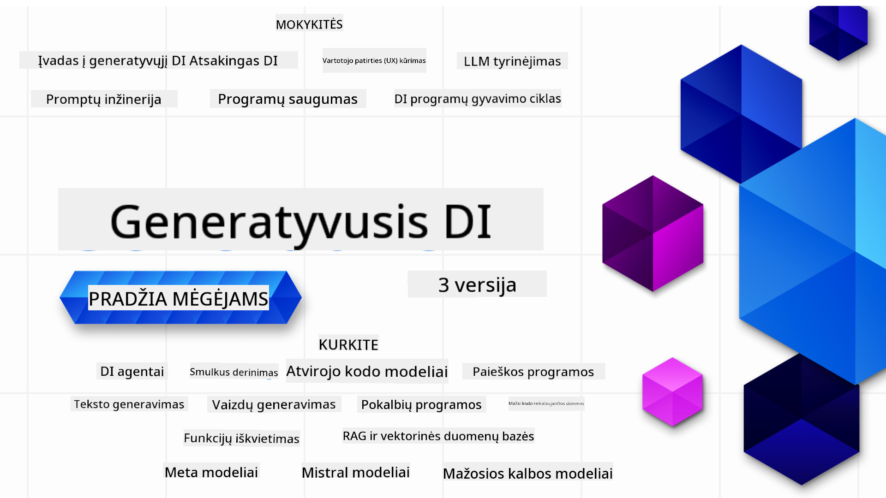

<!--
CO_OP_TRANSLATOR_METADATA:
{
  "original_hash": "ca2afa136ed9aca0634f39f51239746e",
  "translation_date": "2025-08-27T09:04:55+00:00",
  "source_file": "README.md",
  "language_code": "lt"
}
-->

### 21 pamoka, kurios išmokys visko, ko reikia norint pradėti kurti generatyvinio AI programas

  
  
  
  
  

  
  
  

### 🌐 Daugiakalbė parama

#### Palaikoma per GitHub Action (Automatizuota ir visada atnaujinta)

[Prancūzų](../fr/README.md) | [Ispanų](../es/README.md) | [Vokiečių](../de/README.md) | [Rusų](../ru/README.md) | [Arabų](../ar/README.md) | [Persų (Farsi)](../fa/README.md) | [Urdu](../ur/README.md) | [Kinų (supaprastinta)](../zh/README.md) | [Kinų (tradicinė, Makao)](../mo/README.md) | [Kinų (tradicinė, Honkongas)](../hk/README.md) | [Kinų (tradicinė, Taivanas)](../tw/README.md) | [Japonų](../ja/README.md) | [Korėjiečių](../ko/README.md) | [Hindi](../hi/README.md) | [Bengalų](../bn/README.md) | [Marathi](../mr/README.md) | [Nepalų](../ne/README.md) | [Pundžabi (Gurmukhi)](../pa/README.md) | [Portugalų (Portugalija)](../pt/README.md) | [Portugalų (Brazilija)](../br/README.md) | [Italų](../it/README.md) | [Lietuvių](./README.md) | [Lenkų](../pl/README.md) | [Turkų](../tr/README.md) | [Graikų](../el/README.md) | [Tajų](../th/README.md) | [Švedų](../sv/README.md) | [Danų](../da/README.md) | [Norvegų](../no/README.md) | [Suomių](../fi/README.md) | [Olandų](../nl/README.md) | [Hebrajų](../he/README.md) | [Vietnamiečių](../vi/README.md) | [Indoneziečių](../id/README.md) | [Malajų](../ms/README.md) | [Tagalog (Filipinų)](../tl/README.md) | [Svahilių](../sw/README.md) | [Vengrų](../hu/README.md) | [Čekų](../cs/README.md) | [Slovakų](../sk/README.md) | [Rumunų](../ro/README.md) | [Bulgarų](../bg/README.md) | [Serbų (kirilica)](../sr/README.md) | [Kroatų](../hr/README.md) | [Slovėnų](../sl/README.md) | [Ukrainiečių](../uk/README.md) | [Birmos (Mianmaras)](../my/README.md)

# Generatyvinis AI pradedantiesiems (3 versija) - kursas

Išmokite generatyvinio AI programų kūrimo pagrindus su mūsų 21 pamokos išsamiu kursu, kurį parengė Microsoft Cloud Advocates.

## 🌱 Pradžia

Šis kursas turi 21 pamoką. Kiekviena pamoka apima savo temą, todėl galite pradėti nuo bet kurios!

Pamokos pažymėtos kaip "Mokymosi" pamokos, kurios paaiškina generatyvinio AI koncepciją, arba "Kūrimo" pamokos, kurios paaiškina koncepciją ir pateikia kodų pavyzdžius tiek **Python**, tiek **TypeScript**, kai tai įmanoma.

.NET programuotojams rekomenduojame [Generatyvinis AI pradedantiesiems (.NET leidimas)](https://github.com/microsoft/Generative-AI-for-beginners-dotnet?WT.mc_id=academic-105485-koreyst)!

Kiekviena pamoka taip pat turi skyrių "Tęsk mokymąsi" su papildomais mokymosi įrankiais.

## Ko jums reikia
### Norėdami paleisti šio kurso kodą, galite naudoti:
- [Azure OpenAI paslauga](https://aka.ms/genai-beginners/azure-open-ai?WT.mc_id=academic-105485-koreyst) - **Pamokos:** "aoai-assignment"  
- [GitHub Marketplace Model Catalog](https://aka.ms/genai-beginners/gh-models?WT.mc_id=academic-105485-koreyst) - **Pamokos:** "githubmodels"  
- [OpenAI API](https://aka.ms/genai-beginners/open-ai?WT.mc_id=academic-105485-koreyst) - **Pamokos:** "oai-assignment"  

- Pagrindinės Python arba TypeScript žinios yra naudingos - \*Pradedantiesiems rekomenduojame šiuos [Python](https://aka.ms/genai-beginners/python?WT.mc_id=academic-105485-koreyst) ir [TypeScript](https://aka.ms/genai-beginners/typescript?WT.mc_id=academic-105485-koreyst) kursus  
- GitHub paskyra, kad galėtumėte [forkuoti visą šį repo](https://aka.ms/genai-beginners/github?WT.mc_id=academic-105485-koreyst) į savo GitHub paskyrą  

Mes sukūrėme **[Kurso nustatymo](./00-course-setup/README.md?WT.mc_id=academic-105485-koreyst)** pamoką, kad padėtume jums nustatyti savo kūrimo aplinką.

Nepamirškite [pažymėti žvaigždute (🌟) šį repo](https://docs.github.com/en/get-started/exploring-projects-on-github/saving-repositories-with-stars?WT.mc_id=academic-105485-koreyst), kad vėliau būtų lengviau jį rasti.

## 🧠 Pasiruošę diegti?

Jei ieškote pažangesnių kodų pavyzdžių, peržiūrėkite mūsų [Generatyvinio AI kodų pavyzdžių kolekciją](https://aka.ms/genai-beg-code?WT.mc_id=academic-105485-koreyst) tiek **Python**, tiek **TypeScript**.

## 🗣️ Susipažinkite su kitais mokiniais, gaukite pagalbos

Prisijunkite prie mūsų [oficialaus Azure AI Foundry Discord serverio](https://aka.ms/genai-discord?WT.mc_id=academic-105485-koreyst), kad susipažintumėte ir bendrautumėte su kitais šio kurso dalyviais bei gautumėte pagalbos.

Užduokite klausimus arba pasidalinkite produkto atsiliepimais mūsų [Azure AI Foundry Developer Forum](https://aka.ms/azureaifoundry/forum) GitHub'e.

## 🚀 Kuriate startuolį?

Apsilankykite [Microsoft for Startups](https://www.microsoft.com/startups), kad sužinotumėte, kaip pradėti kurti su Azure kreditais jau šiandien.

## 🙏 Norite padėti?

Turite pasiūlymų ar radote rašybos ar kodo klaidų? [Pateikite problemą](https://github.com/microsoft/generative-ai-for-beginners/issues?WT.mc_id=academic-105485-koreyst) arba [Sukurkite pull request](https://github.com/microsoft/generative-ai-for-beginners/pulls?WT.mc_id=academic-105485-koreyst).

## 📂 Kiekviena pamoka apima:

- Trumpą vaizdo įrašo įžangą į temą  
- Rašytinę pamoką, esančią README  
- Python ir TypeScript kodų pavyzdžius, palaikančius Azure OpenAI ir OpenAI API  
- Nuorodas į papildomus išteklius mokymuisi tęsti  

## 🗃️ Pamokos

| #   | **Pamokos nuoroda**                                                                                                                          | **Aprašymas**                                                                                   | **Vaizdo įrašas**                                                              | **Papildomas mokymasis**                                                        |
| --- | -------------------------------------------------------------------------------------------------------------------------------------------- | ----------------------------------------------------------------------------------------------- | ------------------------------------------------------------------------------ | ------------------------------------------------------------------------------ |
| 00  | [Kurso nustatymas](./00-course-setup/README.md?WT.mc_id=academic-105485-koreyst)                                                             | **Mokymasis:** Kaip nustatyti savo kūrimo aplinką                                               | Vaizdo įrašas netrukus                                                          | [Sužinoti daugiau](https://aka.ms/genai-collection?WT.mc_id=academic-105485-koreyst) |
| 01  | [Įvadas į generatyvinį AI ir LLM](./01-introduction-to-genai/README.md?WT.mc_id=academic-105485-koreyst)                                     | **Mokymasis:** Suprasti, kas yra generatyvinis AI ir kaip veikia dideli kalbos modeliai (LLM).  | [Vaizdo įrašas](https://aka.ms/gen-ai-lesson-1-gh?WT.mc_id=academic-105485-koreyst) | [Sužinoti daugiau](https://aka.ms/genai-collection?WT.mc_id=academic-105485-koreyst) |
| 02  | [Skirtingų LLM tyrinėjimas ir palyginimas](./02-exploring-and-comparing-different-llms/README.md?WT.mc_id=academic-105485-koreyst)           | **Mokymasis:** Kaip pasirinkti tinkamą modelį savo naudojimo atvejui                           | [Vaizdo įrašas](https://aka.ms/gen-ai-lesson2-gh?WT.mc_id=academic-105485-koreyst)  | [Sužinoti daugiau](https://aka.ms/genai-collection?WT.mc_id=academic-105485-koreyst) |
| 03  | [Generatyvinio AI atsakingas naudojimas](./03-using-generative-ai-responsibly/README.md?WT.mc_id=academic-105485-koreyst)                    | **Mokymasis:** Kaip atsakingai kurti generatyvinio AI programas                                 | [Vaizdo įrašas](https://aka.ms/gen-ai-lesson3-gh?WT.mc_id=academic-105485-koreyst)  | [Sužinoti daugiau](https://aka.ms/genai-collection?WT.mc_id=academic-105485-koreyst) |
| 04  | [Pagrindinių promptų kūrimo principų supratimas](./04-prompt-engineering-fundamentals/README.md?WT.mc_id=academic-105485-koreyst)            | **Mokymasis:** Praktiniai promptų kūrimo geriausios praktikos                                  | [Vaizdo įrašas](https://aka.ms/gen-ai-lesson4-gh?WT.mc_id=academic-105485-koreyst)  | [Sužinoti daugiau](https://aka.ms/genai-collection?WT.mc_id=academic-105485-koreyst) |
| 05  | [Išplėstinių promptų kūrimas](./05-advanced-prompts/README.md?WT.mc_id=academic-105485-koreyst)                                              | **Mokymasis:** Kaip taikyti promptų kūrimo technikas, kurios pagerina jūsų promptų rezultatus. | [Vaizdo įrašas](https://aka.ms/gen-ai-lesson5-gh?WT.mc_id=academic-105485-koreyst)  | [Sužinoti daugiau](https://aka.ms/genai-collection?WT.mc_id=academic-105485-koreyst) |
| 06  | [Tekstų generavimo programų kūrimas](./06-text-generation-apps/README.md?WT.mc_id=academic-105485-koreyst)                                | **Kurkite:** Tekstų generavimo programą naudojant Azure OpenAI / OpenAI API                                | [Video](https://aka.ms/gen-ai-lesson6-gh?WT.mc_id=academic-105485-koreyst)  | [Sužinokite daugiau](https://aka.ms/genai-collection?WT.mc_id=academic-105485-koreyst) |
| 07  | [Pokalbių programų kūrimas](./07-building-chat-applications/README.md?WT.mc_id=academic-105485-koreyst)                                     | **Kurkite:** Efektyvūs metodai pokalbių programų kūrimui ir integravimui.               | [Video](https://aka.ms/gen-ai-lessons7-gh?WT.mc_id=academic-105485-koreyst) | [Sužinokite daugiau](https://aka.ms/genai-collection?WT.mc_id=academic-105485-koreyst) |
| 08  | [Paieškos programų kūrimas naudojant vektorių duomenų bazes](./08-building-search-applications/README.md?WT.mc_id=academic-105485-koreyst)                        | **Kurkite:** Paieškos programą, kuri naudoja įterpinius duomenų paieškai.                        | [Video](https://aka.ms/gen-ai-lesson8-gh?WT.mc_id=academic-105485-koreyst)  | [Sužinokite daugiau](https://aka.ms/genai-collection?WT.mc_id=academic-105485-koreyst) |
| 09  | [Vaizdų generavimo programų kūrimas](./09-building-image-applications/README.md?WT.mc_id=academic-105485-koreyst)                        | **Kurkite:** Vaizdų generavimo programą                                                       | [Video](https://aka.ms/gen-ai-lesson9-gh?WT.mc_id=academic-105485-koreyst)  | [Sužinokite daugiau](https://aka.ms/genai-collection?WT.mc_id=academic-105485-koreyst) |
| 10  | [Generatyvios AI programos kūrimas naudojant mažo kodo įrankius](./10-building-low-code-ai-applications/README.md?WT.mc_id=academic-105485-koreyst)                       | **Kurkite:** Generatyvios AI programą naudojant mažo kodo įrankius                                     | [Video](https://aka.ms/gen-ai-lesson10-gh?WT.mc_id=academic-105485-koreyst) | [Sužinokite daugiau](https://aka.ms/genai-collection?WT.mc_id=academic-105485-koreyst) |
| 11  | [Išorinių programų integravimas naudojant funkcijų iškvietimą](./11-integrating-with-function-calling/README.md?WT.mc_id=academic-105485-koreyst) | **Kurkite:** Kas yra funkcijų iškvietimas ir jo panaudojimo atvejai programose                          | [Video](https://aka.ms/gen-ai-lesson11-gh?WT.mc_id=academic-105485-koreyst) | [Sužinokite daugiau](https://aka.ms/genai-collection?WT.mc_id=academic-105485-koreyst) |
| 12  | [UX dizainas AI programoms](./12-designing-ux-for-ai-applications/README.md?WT.mc_id=academic-105485-koreyst)                         | **Sužinokite:** Kaip taikyti UX dizaino principus kuriant generatyvios AI programas         | [Video](https://aka.ms/gen-ai-lesson12-gh?WT.mc_id=academic-105485-koreyst) | [Sužinokite daugiau](https://aka.ms/genai-collection?WT.mc_id=academic-105485-koreyst) |
| 13  | [Generatyvios AI programų saugumas](./13-securing-ai-applications/README.md?WT.mc_id=academic-105485-koreyst)                         | **Sužinokite:** Grėsmės ir rizikos AI sistemoms bei metodai jų apsaugai.             | [Video](https://aka.ms/gen-ai-lesson13-gh?WT.mc_id=academic-105485-koreyst) | [Sužinokite daugiau](https://aka.ms/genai-collection?WT.mc_id=academic-105485-koreyst) |
| 14  | [Generatyvios AI programų gyvavimo ciklas](./14-the-generative-ai-application-lifecycle/README.md?WT.mc_id=academic-105485-koreyst)           | **Sužinokite:** Įrankiai ir metrikos LLM gyvavimo ciklo valdymui ir LLMOps                         | [Video](https://aka.ms/gen-ai-lesson14-gh?WT.mc_id=academic-105485-koreyst) | [Sužinokite daugiau](https://aka.ms/genai-collection?WT.mc_id=academic-105485-koreyst) |
| 15  | [RAG (Retrieval Augmented Generation) ir vektorių duomenų bazės](./15-rag-and-vector-databases/README.md?WT.mc_id=academic-105485-koreyst)        | **Kurkite:** Programą naudojant RAG sistemą, kad gautumėte įterpinius iš vektorių duomenų bazės  | [Video](https://aka.ms/gen-ai-lesson15-gh?WT.mc_id=academic-105485-koreyst) | [Sužinokite daugiau](https://aka.ms/genai-collection?WT.mc_id=academic-105485-koreyst) |
| 16  | [Atvirojo kodo modeliai ir Hugging Face](./16-open-source-models/README.md?WT.mc_id=academic-105485-koreyst)                                    | **Kurkite:** Programą naudojant atvirojo kodo modelius, prieinamus Hugging Face platformoje                    | [Video](https://aka.ms/gen-ai-lesson16-gh?WT.mc_id=academic-105485-koreyst) | [Sužinokite daugiau](https://aka.ms/genai-collection?WT.mc_id=academic-105485-koreyst) |
| 17  | [AI agentai](./17-ai-agents/README.md?WT.mc_id=academic-105485-koreyst)                                                                       | **Kurkite:** Programą naudojant AI agentų sistemą                                           | [Video](https://aka.ms/gen-ai-lesson17-gh?WT.mc_id=academic-105485-koreyst) | [Sužinokite daugiau](https://aka.ms/genai-collection?WT.mc_id=academic-105485-koreyst) |
| 18  | [LLM modelių pritaikymas](./18-fine-tuning/README.md?WT.mc_id=academic-105485-koreyst)                                                              | **Sužinokite:** Kas yra LLM modelių pritaikymas, kodėl ir kaip tai daroma                                            | [Video](https://aka.ms/gen-ai-lesson18-gh?WT.mc_id=academic-105485-koreyst) | [Sužinokite daugiau](https://aka.ms/genai-collection?WT.mc_id=academic-105485-koreyst) |
| 19  | [Kūrimas su mažais kalbos modeliais](./19-slm/README.md?WT.mc_id=academic-105485-koreyst)                                                              | **Sužinokite:** Mažų kalbos modelių privalumai                                            | Video netrukus | [Sužinokite daugiau](https://aka.ms/genai-collection?WT.mc_id=academic-105485-koreyst) |
| 20  | [Kūrimas su Mistral modeliais](./20-mistral/README.md?WT.mc_id=academic-105485-koreyst)                                                              | **Sužinokite:** Mistral šeimos modelių ypatybės ir skirtumai                                           | Video netrukus | [Sužinokite daugiau](https://aka.ms/genai-collection?WT.mc_id=academic-105485-koreyst) |
| 21  | [Kūrimas su Meta modeliais](./21-meta/README.md?WT.mc_id=academic-105485-koreyst)                                                              | **Sužinokite:** Meta šeimos modelių ypatybės ir skirtumai                                           | Video netrukus | [Sužinokite daugiau](https://aka.ms/genai-collection?WT.mc_id=academic-105485-koreyst) |

### 🌟 Speciali padėka

Speciali padėka [**John Aziz**](https://www.linkedin.com/in/john0isaac/) už visų GitHub veiksmų ir darbo eigų kūrimą.

[**Bernhard Merkle**](https://www.linkedin.com/in/bernhard-merkle-738b73/) už svarų indėlį į kiekvieną pamoką, siekiant pagerinti mokymosi ir kodo patirtį.

## 🎒 Kiti kursai

Mūsų komanda kuria ir kitus kursus! Peržiūrėkite:

- [**NAUJAS** Modelio konteksto protokolas pradedantiesiems](https://github.com/microsoft/mcp-for-beginners)
- [AI agentai pradedantiesiems](https://github.com/microsoft/ai-agents-for-beginners)
- [Generatyvi AI pradedantiesiems naudojant .NET](https://github.com/microsoft/Generative-AI-for-beginners-dotnet)
- [Generatyvi AI pradedantiesiems naudojant JavaScript](https://aka.ms/genai-js-course)
- [Generatyvi AI pradedantiesiems naudojant Java](https://aka.ms/genaijava)
- [ML pradedantiesiems](https://aka.ms/ml-beginners)
- [Duomenų mokslas pradedantiesiems](https://aka.ms/datascience-beginners)
- [AI pradedantiesiems](https://aka.ms/ai-beginners)
- [Kibernetinis saugumas pradedantiesiems](https://github.com/microsoft/Security-101)
- [Web kūrimas pradedantiesiems](https://aka.ms/webdev-beginners)
- [IoT pradedantiesiems](https://aka.ms/iot-beginners)
- [XR kūrimas pradedantiesiems](https://github.com/microsoft/xr-development-for-beginners)
- [GitHub Copilot įvaldymas AI poriniam programavimui](https://aka.ms/GitHubCopilotAI)
- [GitHub Copilot įvaldymas C#/.NET programuotojams](https://github.com/microsoft/mastering-github-copilot-for-dotnet-csharp-developers)
- [Pasirinkite savo Copilot nuotykį](https://github.com/microsoft/CopilotAdventures)

---

**Atsakomybės apribojimas**:  
Šis dokumentas buvo išverstas naudojant AI vertimo paslaugą [Co-op Translator](https://github.com/Azure/co-op-translator). Nors siekiame tikslumo, prašome atkreipti dėmesį, kad automatiniai vertimai gali turėti klaidų ar netikslumų. Originalus dokumentas jo gimtąja kalba turėtų būti laikomas autoritetingu šaltiniu. Kritinei informacijai rekomenduojama naudoti profesionalų žmogaus vertimą. Mes neprisiimame atsakomybės už nesusipratimus ar klaidingus interpretavimus, atsiradusius dėl šio vertimo naudojimo.