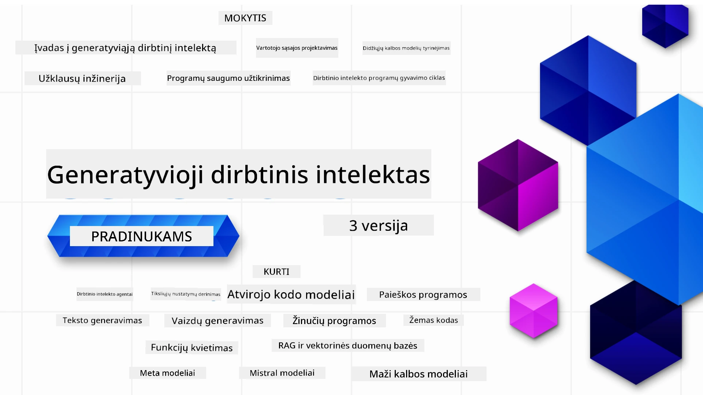

### 21 pamoka, mokanti visko, ką reikia žinoti, kad pradėtum kurti generatyviųjų DI programas

[](https://github.com/microsoft/Generative-AI-For-Beginners/blob/master/LICENSE?WT.mc_id=academic-105485-koreyst)
[](https://GitHub.com/microsoft/Generative-AI-For-Beginners/graphs/contributors/?WT.mc_id=academic-105485-koreyst)
[](https://GitHub.com/microsoft/Generative-AI-For-Beginners/issues/?WT.mc_id=academic-105485-koreyst)
[](https://GitHub.com/microsoft/Generative-AI-For-Beginners/pulls/?WT.mc_id=academic-105485-koreyst)
[](http://makeapullrequest.com?WT.mc_id=academic-105485-koreyst)

[](https://GitHub.com/microsoft/Generative-AI-For-Beginners/watchers/?WT.mc_id=academic-105485-koreyst)
[](https://GitHub.com/microsoft/Generative-AI-For-Beginners/network/?WT.mc_id=academic-105485-koreyst)
[](https://GitHub.com/microsoft/Generative-AI-For-Beginners/stargazers/?WT.mc_id=academic-105485-koreyst)

[](https://discord.gg/nTYy5BXMWG)

### 🌐 Daugiakalbė palaikymas

#### Palaikoma per GitHub Action (automatizuota ir visada atnaujinta)

<!-- CO-OP TRANSLATOR LANGUAGES TABLE START -->
[Arabų](../ar/README.md) | [Bengalų](../bn/README.md) | [Bulgarų](../bg/README.md) | [Birmiečių (Mjanmaras)](../my/README.md) | [Kinų (Supaprastinta)](../zh-CN/README.md) | [Kinų (Tradicinė, Honkongas)](../zh-HK/README.md) | [Kinų (Tradicinė, Makao)](../zh-MO/README.md) | [Kinų (Tradicinė, Taivanas)](../zh-TW/README.md) | [Kroatų](../hr/README.md) | [Čekų](../cs/README.md) | [Danų](../da/README.md) | [Olandų](../nl/README.md) | [Estų](../et/README.md) | [Suomių](../fi/README.md) | [Prancūzų](../fr/README.md) | [Vokiečių](../de/README.md) | [Graikų](../el/README.md) | [Hebrajų](../he/README.md) | [Hindi](../hi/README.md) | [Vengrų](../hu/README.md) | [Indoneziečių](../id/README.md) | [Italų](../it/README.md) | [Japonų](../ja/README.md) | [Kannada](../kn/README.md) | [Khmersų](../km/README.md) | [Korėjiečių](../ko/README.md) | [Lietuvių](./README.md) | [Malajų](../ms/README.md) | [Malajalų](../ml/README.md) | [Maratų](../mr/README.md) | [Nepaliečių](../ne/README.md) | [Nigerijos pidžino](../pcm/README.md) | [Norvegų](../no/README.md) | [Persų (Farsi)](../fa/README.md) | [Lenkų](../pl/README.md) | [Portugalų (Brazilija)](../pt-BR/README.md) | [Portugalų (Portugalija)](../pt-PT/README.md) | [Pandžabių (Gurmukhi)](../pa/README.md) | [Rumunų](../ro/README.md) | [Rusų](../ru/README.md) | [Serbų (Kirilica)](../sr/README.md) | [Slovakų](../sk/README.md) | [Slovėnų](../sl/README.md) | [Ispanų](../es/README.md) | [Suahelių](../sw/README.md) | [Švedų](../sv/README.md) | [Tagalogų (Filipinų)](../tl/README.md) | [Tamilų](../ta/README.md) | [Telugų](../te/README.md) | [Tajų](../th/README.md) | [Turkų](../tr/README.md) | [Ukrainiečių](../uk/README.md) | [Urdu](../ur/README.md) | [Vietnamių](../vi/README.md)

> **Norite klonuoti vietoje?**
>
> Ši saugykla turi daugiau nei 50 kalbų vertimų, todėl atsisiuntimo dydis yra gerokai didesnis. Norėdami klonuoti be vertimų, naudokite riboto atsisiuntimo galimybę:
>
> **Bash / macOS / Linux:**
> ```bash
> git clone --filter=blob:none --sparse https://github.com/microsoft/generative-ai-for-beginners.git
> cd generative-ai-for-beginners
> git sparse-checkout set --no-cone '/*' '!translations' '!translated_images'
> ```
>
> **CMD (Windows):**
> ```cmd
> git clone --filter=blob:none --sparse https://github.com/microsoft/generative-ai-for-beginners.git
> cd generative-ai-for-beginners
> git sparse-checkout set --no-cone "/*" "!translations" "!translated_images"
> ```
>
> Tai suteiks jums viską, ko reikia baigti kursą žymiai greičiau.
<!-- CO-OP TRANSLATOR LANGUAGES TABLE END -->

# Generatyvusis DI pradedantiesiems (3 versija) – Kursas

Išmokite generatyviųjų DI programų kūrimo pagrindus su 21 pamokos visapusišku Microsoft Cloud Advocates parengtu kursu.

## 🌱 Pradžia

Šis kursas turi 21 pamoką. Kiekviena pamoka nagrinėja savo temą, tad pradėkite bet kur!

Pamokos yra pažymėtos kaip "Learn" (mokytis) – paaiškinančios generatyviojo DI konceptą arba "Build" (kurti) – paaiškinančios konceptą ir pateikiančios kodo pavyzdžius tiek **Python**, tiek **TypeScript** kalbomis, kai tai įmanoma.

.NET kūrėjams siūlome [Generatyvusis DI pradedantiesiems (.NET leidimas)](https://github.com/microsoft/Generative-AI-for-beginners-dotnet?WT.mc_id=academic-105485-koreyst)!

Kiekvienoje pamokoje taip pat yra skyrius „Toliau mokytis“ su papildomomis mokymosi priemonėmis.

## Ko jums reikia
### Norint vykdyti šio kurso kodą, galite naudoti:
 - [Azure OpenAI paslaugą](https://aka.ms/genai-beginners/azure-open-ai?WT.mc_id=academic-105485-koreyst) - **Pamokos:** „aoai-assignment“
 - [GitHub Marketplace modelių katalogą](https://aka.ms/genai-beginners/gh-models?WT.mc_id=academic-105485-koreyst) - **Pamokos:** „githubmodels“
 - [OpenAI API](https://aka.ms/genai-beginners/open-ai?WT.mc_id=academic-105485-koreyst) - **Pamokos:** „oai-assignment“ 
   
- Pagrindinės Python ar TypeScript žinios yra naudingos – \*Visiems absoliučiams pradedantiesiems rekomenduojame šiuos [Python](https://aka.ms/genai-beginners/python?WT.mc_id=academic-105485-koreyst) ir [TypeScript](https://aka.ms/genai-beginners/typescript?WT.mc_id=academic-105485-koreyst) kursus
- GitHub paskyrą, kad galėtumėte [padaryti forką šiam repozitoriumui](https://aka.ms/genai-beginners/github?WT.mc_id=academic-105485-koreyst) į savo GitHub paskyrą

Mes parengėme **[Kurso pradžios nustatymo](./00-course-setup/README.md?WT.mc_id=academic-105485-koreyst)** pamoką, kuri padės jums susikurti vystymosi aplinką.

Neužmirškite [pažymėti (🌟) šį repozitoriumą](https://docs.github.com/en/get-started/exploring-projects-on-github/saving-repositories-with-stars?WT.mc_id=academic-105485-koreyst), kad vėliau jį lengviau rastumėte.

## 🧠 Pasiruošę diegti?

Jei ieškote pažangesnių kodo pavyzdžių, pažiūrėkite mūsų [generatyviųjų DI kodo pavyzdžių kolekciją](https://aka.ms/genai-beg-code?WT.mc_id=academic-105485-koreyst) tiek **Python**, tiek **TypeScript** kalbomis.

## 🗣️ Susipažinkite su kitais besimokančiais, gaukite palaikymą

Prisijunkite prie mūsų [oficialaus Azure AI Foundry Discord serverio](https://aka.ms/genai-discord?WT.mc_id=academic-105485-koreyst), kad susipažintumėte ir bendrautumėte su kitais šį kursą pasirinkusiais besimokančiais bei gautumėte palaikymą.

Užduokite klausimus arba pasidalinkite produkto atsiliepimais mūsų [Azure AI Foundry kūrėjų forume](https://aka.ms/azureaifoundry/forum) GitHub platformoje.

## 🚀 Kuriate startuolį?

Apsilankykite [Microsoft for Startups](https://www.microsoft.com/startups), kad sužinotumėte, kaip galite pradėti kurti naudodami Azure kreditus jau šiandien.

## 🙏 Norite padėti?

Ar turite pasiūlymų ar radote rašybos ar kodo klaidų? [Pateikite problemą](https://github.com/microsoft/generative-ai-for-beginners/issues?WT.mc_id=academic-105485-koreyst) arba [Sukurkite užklausą dėl susijungimo](https://github.com/microsoft/generative-ai-for-beginners/pulls?WT.mc_id=academic-105485-koreyst)

## 📂 Kiekviena pamoka apima:

- Trumpą vaizdo įrašo įvadą į temą
- Rašytinę pamoką, esančią README faile
- Python ir TypeScript kodo pavyzdžius, palaikančius Azure OpenAI ir OpenAI API
- Nuorodas į papildomus šaltinius tolesniam mokymuisi

## 🗃️ Pamokos

| #   | **Pamokos nuoroda**                                                                                                                          | **Aprašymas**                                                                                  | **Vaizdo įrašas**                                                             | **Papildomas mokymasis**                                                       |
| --- | -------------------------------------------------------------------------------------------------------------------------------------------- | --------------------------------------------------------------------------------------------- | --------------------------------------------------------------------------- | ------------------------------------------------------------------------------ |
| 00  | [Kurso pradžia](./00-course-setup/README.md?WT.mc_id=academic-105485-koreyst)                                                                 | **Mokytis:** Kaip susikurti vystymosi aplinką                                               | Vaizdo įrašas artimiausiu metu                                                | [Plačiau](https://aka.ms/genai-collection?WT.mc_id=academic-105485-koreyst)    |
| 01  | [Įvadas į generatyvų DI ir didelius kalbos modelius (LLM)](./01-introduction-to-genai/README.md?WT.mc_id=academic-105485-koreyst)              | **Mokytis:** Suprasti, kas yra generatyvusis DI ir kaip veikia dideli kalbos modeliai (LLM)   | [Vaizdo įrašas](https://aka.ms/gen-ai-lesson-1-gh?WT.mc_id=academic-105485-koreyst) | [Plačiau](https://aka.ms/genai-collection?WT.mc_id=academic-105485-koreyst)    |
| 02  | [Skirtingų didelių kalbos modelių (LLM) tyrinėjimas ir palyginimas](./02-exploring-and-comparing-different-llms/README.md?WT.mc_id=academic-105485-koreyst) | **Mokytis:** Kaip pasirinkti tinkamą modelį savo naudojimui                                  | [Vaizdo įrašas](https://aka.ms/gen-ai-lesson2-gh?WT.mc_id=academic-105485-koreyst) | [Plačiau](https://aka.ms/genai-collection?WT.mc_id=academic-105485-koreyst)    |
| 03  | [Generatyvų DI atsakingas naudojimas](./03-using-generative-ai-responsibly/README.md?WT.mc_id=academic-105485-koreyst)                         | **Mokytis:** Kaip atsakingai kurti generatyviųjų DI programas                                | [Vaizdo įrašas](https://aka.ms/gen-ai-lesson3-gh?WT.mc_id=academic-105485-koreyst) | [Plačiau](https://aka.ms/genai-collection?WT.mc_id=academic-105485-koreyst)    |
| 04  | [Pagrindų supratimas apie užklausų inžineriją](./04-prompt-engineering-fundamentals/README.md?WT.mc_id=academic-105485-koreyst)             | **Mokykitės:** Praktiniai geriausios užklausų inžinerijos metodai                                           | [Vaizdo įrašas](https://aka.ms/gen-ai-lesson4-gh?WT.mc_id=academic-105485-koreyst)  | [Sužinokite daugiau](https://aka.ms/genai-collection?WT.mc_id=academic-105485-koreyst) |
| 05  | [Sudėtingų užklausų kūrimas](./05-advanced-prompts/README.md?WT.mc_id=academic-105485-koreyst)                                                | **Mokykitės:** Kaip taikyti užklausų inžinerijos metodus, gerinančius jūsų užklausų rezultatus. | [Vaizdo įrašas](https://aka.ms/gen-ai-lesson5-gh?WT.mc_id=academic-105485-koreyst)  | [Sužinokite daugiau](https://aka.ms/genai-collection?WT.mc_id=academic-105485-koreyst) |
| 06  | [Teksto generavimo programų kūrimas](./06-text-generation-apps/README.md?WT.mc_id=academic-105485-koreyst)                                | **Kurkite:** Teksto generavimo programą naudojant Azure OpenAI / OpenAI API                                | [Vaizdo įrašas](https://aka.ms/gen-ai-lesson6-gh?WT.mc_id=academic-105485-koreyst)  | [Sužinokite daugiau](https://aka.ms/genai-collection?WT.mc_id=academic-105485-koreyst) |
| 07  | [Pokalbių programų kūrimas](./07-building-chat-applications/README.md?WT.mc_id=academic-105485-koreyst)                                     | **Kurkite:** Efektyvių pokalbių programų kūrimo ir integravimo metodus                | [Vaizdo įrašas](https://aka.ms/gen-ai-lessons7-gh?WT.mc_id=academic-105485-koreyst) | [Sužinokite daugiau](https://aka.ms/genai-collection?WT.mc_id=academic-105485-koreyst) |
| 08  | [Paieškos programų, naudojančių vektorių duomenų bazes, kūrimas](./08-building-search-applications/README.md?WT.mc_id=academic-105485-koreyst)                        | **Kurkite:** Paieškos programą, kuri naudoja įterpimus (Embeddings) duomenų paieškai                        | [Vaizdo įrašas](https://aka.ms/gen-ai-lesson8-gh?WT.mc_id=academic-105485-koreyst)  | [Sužinokite daugiau](https://aka.ms/genai-collection?WT.mc_id=academic-105485-koreyst) |
| 09  | [Vaizdų generavimo programų kūrimas](./09-building-image-applications/README.md?WT.mc_id=academic-105485-koreyst)                        | **Kurkite:** Vaizdų generavimo programą                                                       | [Vaizdo įrašas](https://aka.ms/gen-ai-lesson9-gh?WT.mc_id=academic-105485-koreyst)  | [Sužinokite daugiau](https://aka.ms/genai-collection?WT.mc_id=academic-105485-koreyst) |
| 10  | [Žemo kodo AI programų kūrimas](./10-building-low-code-ai-applications/README.md?WT.mc_id=academic-105485-koreyst)                       | **Kurkite:** Generatyvinę dirbtinio intelekto programą naudodami žemo kodo įrankius                                     | [Vaizdo įrašas](https://aka.ms/gen-ai-lesson10-gh?WT.mc_id=academic-105485-koreyst) | [Sužinokite daugiau](https://aka.ms/genai-collection?WT.mc_id=academic-105485-koreyst) |
| 11  | [Išorinių programų integravimas su funkcijų kvietimu](./11-integrating-with-function-calling/README.md?WT.mc_id=academic-105485-koreyst) | **Kurkite:** Kas yra funkcijų kvietimas ir jo naudojimo atvejai programose                          | [Vaizdo įrašas](https://aka.ms/gen-ai-lesson11-gh?WT.mc_id=academic-105485-koreyst) | [Sužinokite daugiau](https://aka.ms/genai-collection?WT.mc_id=academic-105485-koreyst) |
| 12  | [UX kūrimas AI programoms](./12-designing-ux-for-ai-applications/README.md?WT.mc_id=academic-105485-koreyst)                         | **Mokykitės:** Kaip taikyti UX dizaino principus kuriant generatyvines AI programas         | [Vaizdo įrašas](https://aka.ms/gen-ai-lesson12-gh?WT.mc_id=academic-105485-koreyst) | [Sužinokite daugiau](https://aka.ms/genai-collection?WT.mc_id=academic-105485-koreyst) |
| 13  | [Jūsų generatyvinių AI programų apsauga](./13-securing-ai-applications/README.md?WT.mc_id=academic-105485-koreyst)                         | **Mokykitės:** Grėsmės ir rizikos AI sistemoms bei būdai, kaip apsaugoti šias sistemas             | [Vaizdo įrašas](https://aka.ms/gen-ai-lesson13-gh?WT.mc_id=academic-105485-koreyst) | [Sužinokite daugiau](https://aka.ms/genai-collection?WT.mc_id=academic-105485-koreyst) |
| 14  | [Generatyvinių AI programų gyvavimo ciklas](./14-the-generative-ai-application-lifecycle/README.md?WT.mc_id=academic-105485-koreyst)           | **Mokykitės:** Įrankiai ir metrikos LLM gyvavimo ciklo ir LLMOps valdymui                         | [Vaizdo įrašas](https://aka.ms/gen-ai-lesson14-gh?WT.mc_id=academic-105485-koreyst) | [Sužinokite daugiau](https://aka.ms/genai-collection?WT.mc_id=academic-105485-koreyst) |
| 15  | [Retrieval Augmented Generation (RAG) ir vektorių duomenų bazės](./15-rag-and-vector-databases/README.md?WT.mc_id=academic-105485-koreyst)        | **Kurkite:** Programą naudodami RAG sistemą, kad būtų galima pasiimti įterpimus iš vektorių duomenų bazių  | [Vaizdo įrašas](https://aka.ms/gen-ai-lesson15-gh?WT.mc_id=academic-105485-koreyst) | [Sužinokite daugiau](https://aka.ms/genai-collection?WT.mc_id=academic-105485-koreyst) |
| 16  | [Atviro kodo modeliai ir Hugging Face](./16-open-source-models/README.md?WT.mc_id=academic-105485-koreyst)                                    | **Kurkite:** Programą naudodami atviro kodo modelius, kuriuos rasite Hugging Face                    | [Vaizdo įrašas](https://aka.ms/gen-ai-lesson16-gh?WT.mc_id=academic-105485-koreyst) | [Sužinokite daugiau](https://aka.ms/genai-collection?WT.mc_id=academic-105485-koreyst) |
| 17  | [AI agentai](./17-ai-agents/README.md?WT.mc_id=academic-105485-koreyst)                                                                       | **Kurkite:** Programą naudodami AI agentų sistemą                                           | [Vaizdo įrašas](https://aka.ms/gen-ai-lesson17-gh?WT.mc_id=academic-105485-koreyst) | [Sužinokite daugiau](https://aka.ms/genai-collection?WT.mc_id=academic-105485-koreyst) |
| 18  | [Didelių kalbos modelių (LLM) pritaikymas](./18-fine-tuning/README.md?WT.mc_id=academic-105485-koreyst)                                                              | **Mokykitės:** Kas, kodėl ir kaip vyksta didelių kalbos modelių pritaikymas                                            | [Vaizdo įrašas](https://aka.ms/gen-ai-lesson18-gh?WT.mc_id=academic-105485-koreyst) | [Sužinokite daugiau](https://aka.ms/genai-collection?WT.mc_id=academic-105485-koreyst) |
| 19  | [Kūrimas naudojant mažus kalbos modelius (SLM)](./19-slm/README.md?WT.mc_id=academic-105485-koreyst)                                                              | **Mokykitės:** Mažų kalbos modelių naudojimo privalumai                                            | Greitai bus vaizdo įrašas | [Sužinokite daugiau](https://aka.ms/genai-collection?WT.mc_id=academic-105485-koreyst) |
| 20  | [Kūrimas naudojant Mistral modelius](./20-mistral/README.md?WT.mc_id=academic-105485-koreyst)                                                              | **Mokykitės:** Mistral šeimos modelių savybės ir skirtumai                                           | Greitai bus vaizdo įrašas | [Sužinokite daugiau](https://aka.ms/genai-collection?WT.mc_id=academic-105485-koreyst) |
| 21  | [Kūrimas naudojant Meta modelius](./21-meta/README.md?WT.mc_id=academic-105485-koreyst)                                                              | **Mokykitės:** Meta šeimos modelių savybės ir skirtumai                                           | Greitai bus vaizdo įrašas | [Sužinokite daugiau](https://aka.ms/genai-collection?WT.mc_id=academic-105485-koreyst) |

### 🌟 Specialūs padėkos žodžiai

Specialūs padėkos žodžiai [**John Aziz**](https://www.linkedin.com/in/john0isaac/) už visų GitHub Actions ir darbo srautų kūrimą

[**Bernhard Merkle**](https://www.linkedin.com/in/bernhard-merkle-738b73/) už svarbius indėlius į kiekvieną pamoką, gerinant mokymosi ir kodo patirtį.

## 🎒 Kiti kursai

Mūsų komanda rengia ir kitus kursus! Pažiūrėkite:

<!-- CO-OP TRANSLATOR OTHER COURSES START -->
### LangChain
[](https://aka.ms/langchain4j-for-beginners)
[](https://aka.ms/langchainjs-for-beginners?WT.mc_id=m365-94501-dwahlin)
[](https://github.com/microsoft/langchain-for-beginners?WT.mc_id=m365-94501-dwahlin)
---

### Azure / Edge / MCP / Agentai
[](https://github.com/microsoft/AZD-for-beginners?WT.mc_id=academic-105485-koreyst)
[](https://github.com/microsoft/edgeai-for-beginners?WT.mc_id=academic-105485-koreyst)
[](https://github.com/microsoft/mcp-for-beginners?WT.mc_id=academic-105485-koreyst)
[](https://github.com/microsoft/ai-agents-for-beginners?WT.mc_id=academic-105485-koreyst)

---
 
### Generatyvinio DI serija
[](https://github.com/microsoft/generative-ai-for-beginners?WT.mc_id=academic-105485-koreyst)
[-9333EA?style=for-the-badge&labelColor=E5E7EB&color=9333EA)](https://github.com/microsoft/Generative-AI-for-beginners-dotnet?WT.mc_id=academic-105485-koreyst)
[-C084FC?style=for-the-badge&labelColor=E5E7EB&color=C084FC)](https://github.com/microsoft/generative-ai-for-beginners-java?WT.mc_id=academic-105485-koreyst)
[-E879F9?style=for-the-badge&labelColor=E5E7EB&color=E879F9)](https://github.com/microsoft/generative-ai-with-javascript?WT.mc_id=academic-105485-koreyst)

---
 
### Pagrindinis mokymasis
[](https://aka.ms/ml-beginners?WT.mc_id=academic-105485-koreyst)
[](https://aka.ms/datascience-beginners?WT.mc_id=academic-105485-koreyst)
[](https://aka.ms/ai-beginners?WT.mc_id=academic-105485-koreyst)
[](https://github.com/microsoft/Security-101?WT.mc_id=academic-96948-sayoung)
[](https://aka.ms/webdev-beginners?WT.mc_id=academic-105485-koreyst)
[](https://aka.ms/iot-beginners?WT.mc_id=academic-105485-koreyst)
[](https://github.com/microsoft/xr-development-for-beginners?WT.mc_id=academic-105485-koreyst)

---
 
### Copilot serija
[](https://aka.ms/GitHubCopilotAI?WT.mc_id=academic-105485-koreyst)
[](https://github.com/microsoft/mastering-github-copilot-for-dotnet-csharp-developers?WT.mc_id=academic-105485-koreyst)
[](https://github.com/microsoft/CopilotAdventures?WT.mc_id=academic-105485-koreyst)
<!-- CO-OP TRANSLATOR OTHER COURSES END -->

## Pagalbos gavimas

Jei įstringate ar turite klausimų apie DI programėlių kūrimą. Prisijunkite prie bendraminčių mokinių ir patyrusių kūrėjų diskusijų apie MCP. Tai palaikanti bendruomenė, kurioje klausimai yra laukiami, o žinios dalijamos laisvai.

[](https://discord.gg/nTYy5BXMWG)

Jei turite produkto atsiliepimų arba įvyksta klaidų kūrimo metu, apsilankykite:

[](https://aka.ms/foundry/forum)

---

<!-- CO-OP TRANSLATOR DISCLAIMER START -->
**Atsakomybės apribojimas**:  
Šis dokumentas buvo išverstas naudojant dirbtinio intelekto vertimo paslaugą [Co-op Translator](https://github.com/Azure/co-op-translator). Nors stengiamės užtikrinti tikslumą, atkreipkite dėmesį, kad automatizuoti vertimai gali turėti klaidų ar netikslumų. Originalus dokumentas gimtąja kalba turėtų būti laikomas autoritetingu šaltiniu. Svarbiai informacijai rekomenduojama naudoti profesionalų vertimą žmogaus. Mes neatsako už jokius nesusipratimus ar klaidingas interpretacijas, kylančias dėl šio vertimo naudojimo.
<!-- CO-OP TRANSLATOR DISCLAIMER END -->