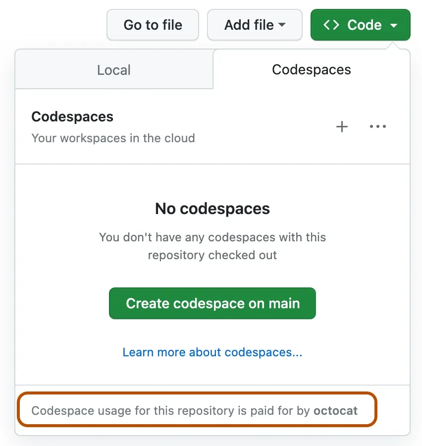

# ഈ കോഴ്സുമായി തുടങ്ങുന്നത്

ജനറേറ്റീവ് AI ഉപയോഗിച്ച് നിങ്ങൾക്ക് എന്താണ് സൃഷ്‌ടിക്കാൻ പ്രചോദനം ലഭിക്കുന്നത് എന്ന് കാണാൻ ഈ കോഴ്സ് തുടങ്ങാൻ ഞങ്ങൾ വളരെ ആവേശഭരിതരാണ്!

നിങ്ങളുടെ വിജയത്തിന് ഉറപ്പുനൽകാൻ, ഈ പേജ് സെറ്റപ്പ് നടപടികൾ, സാങ്കേതിക ആവശ്യകതകൾ, ആവശ്യമായപ്പോൾ എവിടെ സഹായം നേടാമെന്ന് രേഖപ്പെടുത്തുന്നു.

## സെറ്റപ്പ് നടപടികൾ

ഈ കോഴ്സ് തുടങ്ങാൻ, താഴെപ്പറയുന്ന നടപടികൾ പൂർത്തിയാക്കേണ്ടതാണ്.

### 1. ഈ റിപൊ ഫോർക്ക് ചെയ്‌തു മനസ്സിലാക്കുക

[ഈ മുഴുവൻ റിപൊ ഫോർക്ക് ചെയ്യുക](https://github.com/microsoft/generative-ai-for-beginners/fork?WT.mc_id=academic-105485-koreyst) നിങ്ങളുടെ GitHub അക്കൗണ്ടിലേക്ക്, എത് കോഡ് മാറ്റാനും ഊഹാപോഹങ്ങൾ പൂർത്തിയാക്കാനുമാകുവാൻ. നിങ്ങൾക്ക് [സ്റ്റാർ (🌟) ചെയ്യാനും](https://docs.github.com/en/get-started/exploring-projects-on-github/saving-repositories-with-stars?WT.mc_id=academic-105485-koreyst) സാധിക്കും, ഇത് കണ്ടെത്താനും ബന്ധപ്പെടുന്ന റിപോസിറ്ററികൾ എളുപ്പമാണ്.

### 2. ഒരു കോഡ്സ്പേസ്സ് സൃഷ്ടിക്കുക

കോഡ് ഓടുമ്പോൾ ഡിപ്പെൻഡൻസി പ്രശ്നങ്ങൾ ഒഴിവാക്കാൻ, ഈ കോഴ്സ് GitHub Codespaces-ൽ ഓടിക്കുന്നത് ഞങ്ങൾ ശുപാർശ ചെയ്യുന്നു.

നിങ്ങളുടെ ഫോർക്കിൽ: **Code -> Codespaces -> New on main**



#### 2.1 ഒരു സീക്രട്സ് ചേർക്കുക

1. ⚙️ ഗിയർ ഐക്കൺ -> Command Pallete-> Codespaces : Manage user secret -> Add a new secret.
2. പേര് OPENAI_API_KEY, നിങ്ങളുടെ കീ പെയ്സ്റ്റ് ചെയ്യുക, Save ചെയ്യുക.

### 3. പിന്നീട് എന്ത്?

| ഞാൻ ചെയ്യാൻ ആഗ്രഹിക്കുന്നു...          | പോകുക…                                                                  |
|---------------------|-------------------------------------------------------------------------|
| പാഠം 1 ആരംഭിക്കുക      | [`01-introduction-to-genai`](../01-introduction-to-genai/README.md)     |
| ഓഫ്ലൈനിൽ ജോലി ചെയ്യുക        | [`setup-local.md`](02-setup-local.md)                                   |
| ഒരു LLM പ്രൊവൈഡർ സജ്ജമാക്കുക | [`providers.md`](03-providers.md)                                        |
| മറ്റ് പഠനാർത്ഥികളുമായി കണ്ടുമുട്ടുക | [Join our Discord](https://aka.ms/genai-discord?WT.mc_id=academic-105485-koreyst)   |

## ട്രബിള്‍ഷൂട്ടിംഗ്


| ലക്ഷണം                                   | പരിഹാരം                                                             |
|-------------------------------------------|-----------------------------------------------------------------|
| കണ്ടെയ്‌നർ നിർമ്മാണം 10 മിനുട്ടിന് മുകളിൽ കേൾക്കുന്നു            | **Codespaces ➜ “Rebuild Container”**                            |
| `python: command not found`               | ടർമിനൽ അറ്റാച്ച് ചെയ്തില്ല; ക്ലിക്ക് ചെയ്യുക **+** ➜ *bash*                 |
| OpenAI-യിൽ നിന്നുള്ള `401 Unauthorized`            | തെറ്റായ / കാലഹരണപ്പെട്ട `OPENAI_API_KEY`                                |
| VS കോഡ് “Dev container mounting…” കാണിക്കുന്നു   | ബ്രൗസർ ടാബ് റിഫ്രെഷ് ചെയ്യുക—Codespaces ചിലപ്പോൾ കണക്ഷൻ നഷ്ടപ്പെടും   |
| നോട്ട്‌ബുക്ക് കർണൽ കാണുന്നില്ല                   | നോട്ട്‌ബുക്ക് മენു ➜ **Kernel ▸ Select Kernel ▸ Python 3**           |

   Unix-അധിഷ്ഠിത സിസ്റ്റങ്ങൾ:

   ```bash
   touch .env
   ```

   Windows:

   ```cmd
   echo . > .env
   ```

3. **`.env` ഫയൽ എഡിറ്റ് ചെയ്യുക**: `.env` ഫയൽ ഒരു ടെക്‌സ്‌റ്റ് എഡിറ്ററിൽ തുറക്കുക (ഉദാ: VS Code, Notepad++, അല്ലെങ്കിൽ മറ്റേതെങ്കിലും എഡിറ്റർ). താഴെയുള്ള വരി ചേർക്കുക, `your_github_token_here` എന്നത് നിങ്ങളുടെ യഥാർത്ഥ GitHub ടോക്കൺ ഉപയോഗിച്ച് മാറ്റി രേഖപ്പെടുത്തുക:

   ```env
   GITHUB_TOKEN=your_github_token_here
   ```

4. **ഫയൽ സേവ് ചെയ്യുക**: മാറ്റങ്ങൾ സേവ് ചെയ്ത് ടെക്‌സ്‌റ്റ് എഡിറ്റർ അടയ്ക്കുക.

5. **`python-dotenv` ഇൻസ്റ്റാൾ ചെയ്യുക**: നിങ്ങൾ ഇതിനകം ഇൻസ്റ്റാൾ ചെയ്തിട്ടില്ലെങ്കിൽ, `.env` ഫയലിൽ നിന്ന് പരിസ്ഥിതി വ്യത്യാസങ്ങൾ നിങ്ങളുടെ Python ആപ്ലിക്കേഷനിലേക്ക് ലോഡ് ചെയ്യാൻ `python-dotenv` പാക്കേജ് ഇൻസ്റ്റാൾ ചെയ്യണം. ഇതിന് `pip` ഉപയോഗിക്കുക:

   ```bash
   pip install python-dotenv
   ```

6. **Python സ്ക്രിപ്റ്റിൽ പരിസ്ഥിതി വ്യത്യാസങ്ങൾ ലോഡ് ചെയ്യുക**: നിങ്ങളുടെ Python സ്ക്രിപ്റ്റിൽ `.env` ഫയലിൽ നിന്നുള്ള പരിസ്ഥിതി വ്യത്യാസങ്ങൾ ലോഡ് ചെയ്യുന്നതിന് `python-dotenv` പാക്കേജ് ഉപയോഗിക്കുക:

   ```python
   from dotenv import load_dotenv
   import os

   # .env ഫയലിൽ നിന്നുള്ള പരിസ്ഥിതി വ്യത്യാസങ്ങൾ ലോഡ് ചെയ്യുക
   load_dotenv()

   # GITHUB_TOKEN വ്യത്യാസത്തിലേക്ക് പ്രവേശിക്കുക
   github_token = os.getenv("GITHUB_TOKEN")

   print(github_token)
   ```

അത് മതി! നിങ്ങൾ വിജയകരമായി `.env` ഫയൽ സൃഷ്ടിച്ച്, GitHub ടോക്കൺ ചേർത്തു, അത് നിങ്ങളുടെ Python ആപ്ലിക്കേഷനിലേക്ക് ലോഡ്ചെയ്തു.

## കമ്പ്യൂട്ടറിൽ പ്രാദേശികമായി കോഡ് എങ്ങനെ ഓടിക്കുക

കോഡ് പ്രാദേശികമായി നിങ്ങളുടെ കമ്പ്യൂട്ടറിൽ ഓടിക്കാൻ, നമുക്ക് [Python-ന്റെ ഏതെങ്കിലും പതിപ്പ് ഇൻസ്റ്റാൾ ചെയ്തിരിക്കണം](https://www.python.org/downloads/?WT.mc_id=academic-105485-koreyst).

പിന്നീട് റിപോസിറ്ററി ഉപയോഗിക്കുവാൻ, ഒന്ന് ക്ലോൺ ചെയ്യണം:

```shell
git clone https://github.com/microsoft/generative-ai-for-beginners
cd generative-ai-for-beginners
```

എല്ലാം പരിശോധിച്ചതിനുശേഷം, തുടങ്ങാൻ നിങ്ങൾക്ക് സാധിക്കും!

## ഐച്ഛികമായ നടപടികൾ

### മിനികോൺഡ ഇൻസ്റ്റാൾ ചെയ്യൽ

[Miniconda](https://conda.io/en/latest/miniconda.html?WT.mc_id=academic-105485-koreyst) ഒരു ലൈറ്റ് വെയ്റ്റ് ഇൻസ്റ്റാളറാണ് [Conda](https://docs.conda.io/en/latest?WT.mc_id=academic-105485-koreyst), Python, ചില പാക്കേജുകൾ ഇൻസ്റ്റാൾ ചെയ്യാനായി.
Conda സ്വയം ഒരു പാക്കേജ് മാനേജർ ആണ്, ഇതുവഴി വ്യത്യസ്ത Python [**വിർച്ച്വൽ എൻവയോൺമെന്റുകൾ**](https://docs.python.org/3/tutorial/venv.html?WT.mc_id=academic-105485-koreyst) മാറ്റി സജ്ജീകരിക്കാനും പാക്കേജുകൾ നിയന്ത്രിക്കാനും എളുപ്പമാണ്. `pip` വഴി ലഭിക്കാത്ത പാക്കേജുകൾ ഇൻസ്റ്റാൾ ചെയ്യാനുമാകും.

[MiniConda ഇൻസ്റ്റലേഷൻ ഗൈഡ്](https://docs.anaconda.com/free/miniconda/#quick-command-line-install?WT.mc_id=academic-105485-koreyst) അനുസരിച്ച് ഇത് സജ്ജീകരിക്കാം.

Miniconda ഇൻസ്റ്റാൾ ചെയ്തെങ്കിൽ, നിങ്ങൾക്ക് ഇതുവരെ ചെയ്യാത്തവയാണെങ്കിൽ, [റിപ്പോസിറ്ററി](https://github.com/microsoft/generative-ai-for-beginners/fork?WT.mc_id=academic-105485-koreyst) ക്ലോൺ ചെയ്യാവുന്നതാണ്.

അടുത്തതായി, ഒരു വിർച്ച്വൽ എൻവയോൺമെന്റ് സൃഷ്ടിക്കണം. Conda ഉപയോഗിച്ച് ഇത് ചെയ്യാൻ, ഒരു പുതിയ environment ഫയൽ (_environment.yml_) സൃഷ്ടിക്കാം. Codespaces ഉപയോഗിക്കുന്നത് കണ്ടാൽ, `.devcontainer` ഫോൾഡറിനുള്ളിൽ ഇത് സൃഷ്ടിക്കണം, അതായത് `.devcontainer/environment.yml`.

താഴെയുള്ള കോഡ് സ്നിപ്പെറ്റ് ഉപയോഗിച്ച് environment ഫയൽ പൂരിപ്പിക്കാം:

```yml
name: <environment-name>
channels:
  - defaults
  - microsoft
dependencies:
  - python=<python-version>
  - openai
  - python-dotenv
  - pip
  - pip:
      - azure-ai-ml
```

Conda ഉപയോഗിച്ച് പിഴവുകൾ വരുമ്പോൾ, താഴെയുള്ള കമാൻഡ് ടേർമിനലിൽ ഓടിച്ച് മൈക്രോസോഫ്റ്റ് AI ലൈബ്രറികൾ മാനുവലിൻസ്റ്റാൾ ചെയ്യാം.

```
conda install -c microsoft azure-ai-ml
```

Environment ഫയൽ ആവശ്യമായ ഡിപ്പെൻഡൻസികളാണ് നിർദ്ദേശിക്കുന്നത്. `<environment-name>` നിങ്ങൾ ഉപയോഗിക്കാൻ ആഗ്രഹിക്കുന്ന Conda environment നാമം ആണ്, `<python-version>` നിങ്ങൾ ഉപയോഗിക്കാൻ ആഗ്രഹിക്കുന്ന Python പതിപ്പ് (ഉദാഹരണം `3` ഏറ്റവും പുതിയ പ്രധാന പതിപ്പാണ്).

ഇവ ചെയ്തശേഷം, താഴെയുള്ള കമാൻഡുകൾ നിങ്ങളുടെ കമാൻഡ് ലൈനിൽ/ടേർമിനലിൽ ഓടിച്ച് Conda environment സൃഷ്ടിക്കാം:

```bash
conda env create --name ai4beg --file .devcontainer/environment.yml # .devcontainer ഉപപാതം കേഡ്സ്പെയ്‌സ് സെറ്റപ്പുകൾക്ക് മാത്രമേ ബാധകമായുള്ളൂ
conda activate ai4beg
```

പ്രശ്നങ്ങൾ ഉണ്ടെങ്കിൽ [Conda environments guide](https://docs.conda.io/projects/conda/en/latest/user-guide/tasks/manage-environments.html?WT.mc_id=academic-105485-koreyst) കാണുക.

### Python പിന്തുണയുള്ള Visual Studio Code ഉപയോഗിക്കുക

ഈ കോഴ്സിനായി, [Visual Studio Code (VS Code)](https://code.visualstudio.com/?WT.mc_id=academic-105485-koreyst) എഡിറ്റർ [Python support extension](https://marketplace.visualstudio.com/items?itemName=ms-python.python&WT.mc_id=academic-105485-koreyst) ഇൻസ്റ്റാൾ ചെയ്തതോടെ ഉപയോഗിക്കണമെന്ന് ഞങ്ങൾ ശുപാർശ ചെയ്യുന്നു. ഇത് നിർബന്ധമല്ല, ശുപാർശ മാത്രമാണ്.

> **കുറിപ്പ്**: കോഴ്സ് റിപോസിറ്ററി VS Code-ൽ തുറന്നാൽ, പ്രോജക്ട് ഒരു കണ്ടെയ്‌നറിനുള്ളിൽ സജ്ജീകരിക്കാൻ നിങ്ങൾക്ക് ഓപ്ഷൻ ലഭിക്കും. കാരണം കോഴ്സ് റിപോസിറ്ററിയിൽ പ്രത്യേകമായ [`.devcontainer`](https://code.visualstudio.com/docs/devcontainers/containers?itemName=ms-python.python&WT.mc_id=academic-105485-koreyst) ഡയറക്ടറി ഉള്ളതാണ്. പിന്നീട് ഇത് വിശദീകരിക്കും.

> **കുറിപ്പ്**: റിപോസിറ്ററി ക്ലോൺ ചെയ്ത് VS Code-യിൽ തുറന്നപ്പോൾ അത് автоматически നിങ്ങൾക്ക് Python support extension ഇൻസ്റ്റാൾ ചെയ്യാൻ നിർദേശിക്കും.

> **കുറിപ്പ്**: VS Code മടങ്ങി കാണിച്ചു നിങ്ങൾക്ക് റിപോസിറ്ററി കണ്ടെയ്‌നറിൽ തുറക്കാൻ നിർദ്ദേശിക്കുന്നത്, നിരസിക്കുക; അതിനാൽ പ്രാദേശികം ഇൻസ്റ്റാൾ ചെയ്ത Python വേർഷൻ ഉപയോഗിക്കാം.

### ബ്രൗസറിലുള്ള Jupyter ഉപയോഗം

നിങ്ങൾക്ക് പ്രോജക്ടിൽ ബ്രൗസറിലുള്ള [Jupyter environment](https://jupyter.org?WT.mc_id=academic-105485-koreyst) ഉപയോഗിച്ച് പ്രവർത്തിക്കാം. ക്ലാസിക് Jupyterയും [Jupyter Hub](https://jupyter.org/hub?WT.mc_id=academic-105485-koreyst) ഉം കോഡ് ഓടിക്കുന്നതിനും സ്വയം പൂർത്തിയാക്കലിനും മറ്റു നിരവധി സൗകര്യങ്ങൾ പരിചയപ്പെടാൻ സഹായിക്കുന്നു.

Jupyter പ്രാദേശികമായി തുടങ്ങാൻ, ടേർമിനലിൽ / കമാൻഡ്ലൈനിൽ കോഴ്സ് ഡയറക്ടറിയിലേക്ക് പോകുക, തുടർന്ന്:

```bash
jupyter notebook
```

അല്ലെങ്കിൽ

```bash
jupyterhub
```

ഇത് Jupyter ഇൻസ്റ്റാൻസ് ആരംഭിക്കും, ആക്‌സസ് ചെയ്യാനുള്ള URL കമാൻഡ്ലൈൻ വിൻഡോയിൽ കാണിക്കും.

അടുത്ത് URL ആക്‌സസ് ചെയ്താൽ, കോഴ്സ് ഔട്ട്ലൈൻ കാണാം, ഏതെങ്കിലും `*.ipynb` ഫയലിലേയ്ക്ക് പോകാം. ഉദാഹരണം: `08-building-search-applications/python/oai-solution.ipynb`.

### കണ്ടെയ്‌നറിൽ ഓടിക്കൽ

നിങ്ങളുടെ കമ്പ്യൂട്ടറിൽ അല്ലെങ്കിൽ Codespace-ൽ എല്ലാം സജ്ജമാക്കാൻ പകരം, ഒരു [കണ്ടെയ്‌നർ](../../../00-course-setup/<https:/en.wikipedia.org/wiki/Containerization_(computing)?WT.mc_id=academic-105485-koreyst>) ഉപയോഗിക്കാം. കോഴ്സ് റിപോസിറ്ററിയിലെ പ്രത്യേക `.devcontainer` ഫോൾഡർ VS Code-നു പ്രോജക്ട് കണ്ടെയ്‌നറിൽ സജ്ജമാക്കാൻ സഹായിക്കുന്നു. Codespaces ഒഴികെ, Docker ഇൻസ്റ്റലേഷൻ ആവശ്യമാണ്, കൂടാതെ ഇത് ചിലത് പരിമിതമായ ചില പ്രവർത്തനം ആവശ്യപ്പെടുന്നതായിട്ടുണ്ട്, ഇത് കണ്ടെയ്‌നറുമേഖലയിൽ അനുഭവമുള്ളവർക്ക് ശുപാർശ ചെയ്യുന്നു.

GitHub Codespaces ഉപയോഗിക്കുമ്പോൾ API കീകൾ സുരക്ഷിതമാക്കാനുള്ള മികച്ച മാർഗ്ഗങ്ങളിൽ ഒന്ന് Codespace Secrets ഉപയോഗിക്കുകയാണ്. കൂടുതൽ അറിയാൻ [Codespaces secrets management](https://docs.github.com/en/codespaces/managing-your-codespaces/managing-secrets-for-your-codespaces?WT.mc_id=academic-105485-koreyst) ഗൈഡ് പിന്തുടരുക.

## പാഠങ്ങൾക്കും സാങ്കേതിക ആവശ്യകതകൾക്കും

കോഴ്സിന് 6 സങ്കൽപ പാഠങ്ങളും 6 കോഡിംഗ് പാഠങ്ങളും ഉണ്ട്.

കോടിംഗ് പാഠങ്ങളിൽ, Azure OpenAI Service ഉപയോഗിക്കുന്നു. ഈ കോഡ് ഓടിക്കുന്നതിന് Azure OpenAI service-ലേക്ക് ആക്‌സസ്, API കീ ആവശ്യമാണ്. ആക്‌സസ് ലഭിക്കാനായി [ഈ അപേക്ഷ](https://azure.microsoft.com/products/ai-services/openai-service?WT.mc_id=academic-105485-koreyst) പൂരിപ്പിക്കാം.

ആപ്ലിക്കേഷൻ പ്രോസസ്സ് ഓടുകയാണെങ്കിൽ, ഓരോ കോഡിംഗ് പാഠത്തിലും `README.md` ഫയൽ ഉള്ളത് കൊണ്ട്, കോഡ് ഔട്ട്പുട്ടുകൾ കാണാനാകും.

## ആദ്യമായി Azure OpenAI Service ഉപയോഗിക്കുന്നത്

Azure OpenAI service പ്രഥമമായി ഉപയോഗിക്കുമ്പോൾ, ഈ ഗൈഡ് അനുസരിക്കുക: [Azure OpenAI Service resource സൃഷ്ടിക്കാനും വിന്യസിക്കാനും](https://learn.microsoft.com/azure/ai-services/openai/how-to/create-resource?pivots=web-portal&WT.mc_id=academic-105485-koreyst)

## ആദ്യമായി OpenAI API ഉപയോഗിക്കുന്നത്

OpenAI API ആദ്യമായി ഉപയോഗിക്കുമ്പോൾ, ഇതേ ഗൈഡ് കാണുക: [Interface സൃഷ്ടിക്കുകയും ഉപയോഗിക്കുകയും ചെയ്യുക](https://platform.openai.com/docs/quickstart?context=pythont&WT.mc_id=academic-105485-koreyst)

## മറ്റ് പഠനാർത്ഥികളുമായി കാണാം

ഞങ്ങൾ ഔദ്യോഗിക [AI Community Discord സർവർ](https://aka.ms/genai-discord?WT.mc_id=academic-105485-koreyst) ചാനലുകൾ സൃഷ്ടിച്ചിട്ടുണ്ട്, മറ്റ് പഠനാർത്ഥികളുമായി ബന്ധപ്പെടാനായി. ഈ വഴി സമാന മനോഭാവമുള്ള സംരംഭകരുമായും പഠിതാക്കളുമായും സംവാദം നടത്താം, Generative AI-യിൽ പരിജ്ഞാനവും പരിധിയും വർദ്ധിപ്പിക്കാം.

[](https://aka.ms/genai-discord?WT.mc_id=academic-105485-koreyst)

പദ്ധതി സംഘവും ഈ Discord സർവറിൽ ഉണ്ടാകുകയും പഠനാർത്ഥികൾക്ക് സഹായം നൽകുകയും ചെയ്യും.

## സംഭാവന ചെയ്യൂ

ഈ കോഴ്‌സ് ഒരു ഓപ്പൺ സോഴ്‌സ് സംരംഭമാണ്. മെച്ചപ്പെടുത്തലുകളോ പ്രശ്നങ്ങളോ കണ്ടാൽ, ദയവായി ഒരു [Pull Request](https://github.com/microsoft/generative-ai-for-beginners/pulls?WT.mc_id=academic-105485-koreyst) സൃഷ്ടിക്കുക അല്ലെങ്കിൽ [GitHub issue](https://github.com/microsoft/generative-ai-for-beginners/issues?WT.mc_id=academic-105485-koreyst) വർഗ്ഗീകരിക്കുക.

പദ്ധതി സംഘം എല്ലാ സംഭാവനകളും നിരീക്ഷിക്കും. ഓപ്പൺ സോഴ്‌സിലേക്ക് സംഭാവന നിർവഹിക്കുക Generative AI-യിൽ നിങ്ങളുടെ കരിയർ നിർമ്മിക്കാൻ വളരെ മികച്ച മാർഗ്ഗമാണ്.

പല സംഭാവനകളും Contributor License Agreement (CLA)-യുടെ അംഗീകാരം വേണം, അതായത് നിങ്ങൾക്ക് സൃഷ്‌ടിക്കാൻ അവകാശമുണ്ട്, ഞങ്ങൾക്ക് അത് ഉപയോഗിക്കുന്ന അവകാശം അനുവദിക്കുന്നു. വിശദാംശങ്ങൾക്ക് [CLA, Contributor License Agreement വെബ്സൈറ്റ്](https://cla.microsoft.com?WT.mc_id=academic-105485-koreyst) കാണുക.

ഗുരുത്വപൂർണ്ണം: ഈ റിപോസിറ്ററിയിലെ പാഠം വിവർത്തനം ചെയ്യുമ്പോൾ, ദയവായി മെഷീൻ വിവർത്തനം ഉപയോഗിക്കരുത്. ഞങ്ങൾgemeinschaftല്‍ പരിശോധന നടത്തിയിരിക്കും, അതിനാൽ നിങ്ങൾ പ്രാവീണ്യമുള്ള ഭാഷകളിൽ മാത്രം വിവർത്തനം ചെയ്യാൻ സ്വമേധയാ സഹായിക്കുക.

പുൾ റിക്വസ്റ്റ് സമർപ്പിക്കുമ്പോൾ, CLA-ബോട്ട് സ്വയം നിങ്ങൾക്ക് CLA നൽകേണ്ടതുണ്ടോ എന്ന് കൃത്യമായി നിശ്ചയിച്ച് PR ന് യോജിച്ച ലേബൽ / കമന്റ് ചേർത്തുകൊടുക്കും. ബോട്ട് നൽകിയ നിർദ്ദേശങ്ങൾ പാലിക്കുക. CLA സമൂഹത്തിൽ രണ്ട് തവണ മാത്രമേ നൽകേണ്ടതുള്ളൂ.

ഈ പ്രോജക്ട് [Microsoft Open Source Code of Conduct](https://opensource.microsoft.com/codeofconduct/?WT.mc_id=academic-105485-koreyst) സ്വീകരിച്ചിരിക്കുന്നു. കൂടുതൽ വിവരങ്ങൾക്ക് Code of Conduct FAQ വായിക്കുക അല്ലെങ്കിൽ [Email opencode](opencode@microsoft.com) ഐഡിയിൽ ചോദ്യം അയയ്ക്കുക.

## തുടങ്ങി വരാം
നിങ്ങൾക്ക് ഈ കോഴ്‌സ് പൂർത്തിയാക്കുന്നതിനുള്ള ആവശ്യമായ ചുവടുകൾ പൂർത്തിയായതിനാൽ, [ജനറേറ്റീവ് എഐയും LLMs-ഉം പരിചയപ്പെടുന്നതിലൂടെ](../01-introduction-to-genai/README.md?WT.mc_id=academic-105485-koreyst) തുടങ്ങാം.

---

<!-- CO-OP TRANSLATOR DISCLAIMER START -->
**ഡിസ്‌ക്ലെയിമർ**:  
ഈ ഡോക്യുമെന്റ് AI തർജിമാ സേവനം [Co-op Translator](https://github.com/Azure/co-op-translator) ഉപയോഗിച്ച് പരിഭാഷപ്പെടുത്തിയതാണ്. നാം ശരിയായ പരിഭാഷയ്ക്കായി ശ്രമിക്കുന്നുണ്ടെങ്കിലും, ഓട്ടോമേറ്റഡ് തർജിമകളിൽ പിശകുകൾ അല്ലെങ്കിൽ അകൃത്യതകൾ ഉണ്ടായിരിക്കാമെന്ന് ദയവായി ശ്രദ്ധിക്കുക. മൂല രേഖയുടെ മാതൃഭാഷാതത്വം അധികാരമുള്ള സ്രോതസ്സ് ആയി കണക്കാക്കണം. സുപ്രധാന വിവരങ്ങൾക്ക്, പ്രൊഫഷണൽ മാനവ തർജിമ ശുപാർശ ചെയ്യപ്പെടുന്നു. ഈ പരിഭാഷയുടെ ഉപയോഗത്തിൽനിന്ന് ഉണ്ടാകുന്ന ഏതൊരു തെറ്റിദ്ധാരണകൾക്കും അല്ലെങ്കിൽ തെറ്റുവ്യാഖ്യാനങ്ങൾക്കും ഞങ്ങൾ ഉത്തരവാദികളല്ല.
<!-- CO-OP TRANSLATOR DISCLAIMER END -->