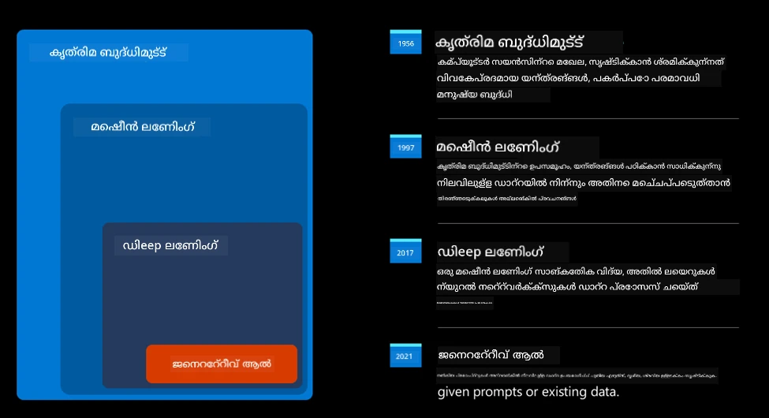
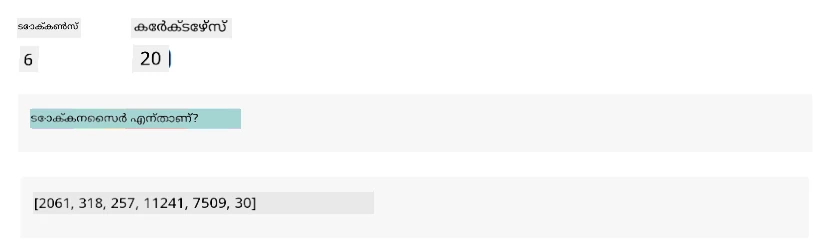
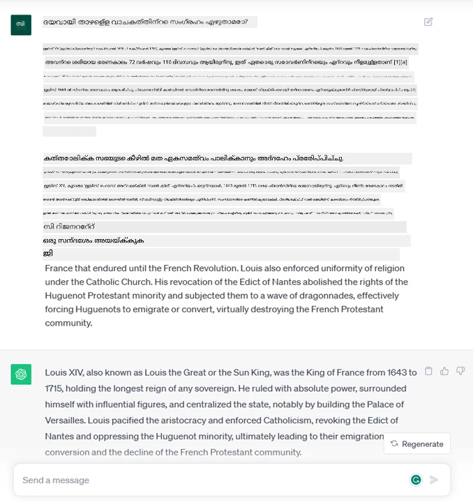
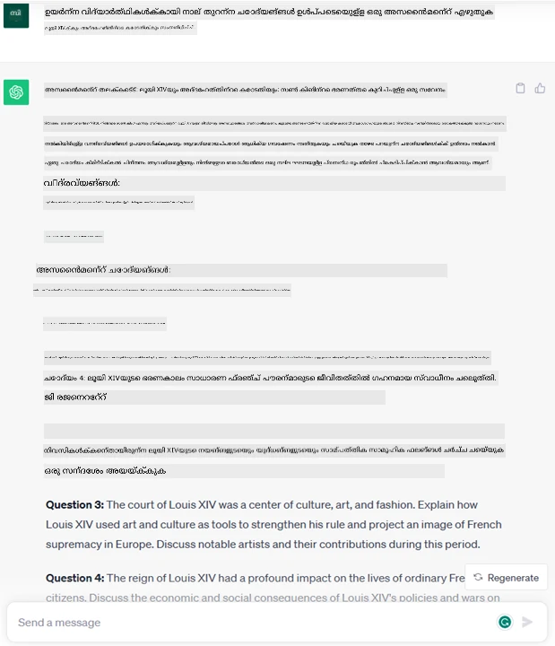
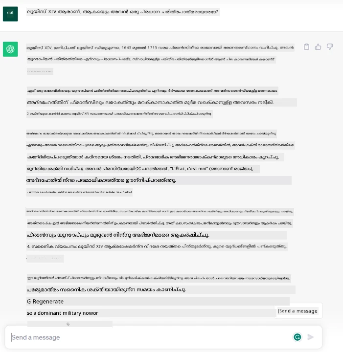
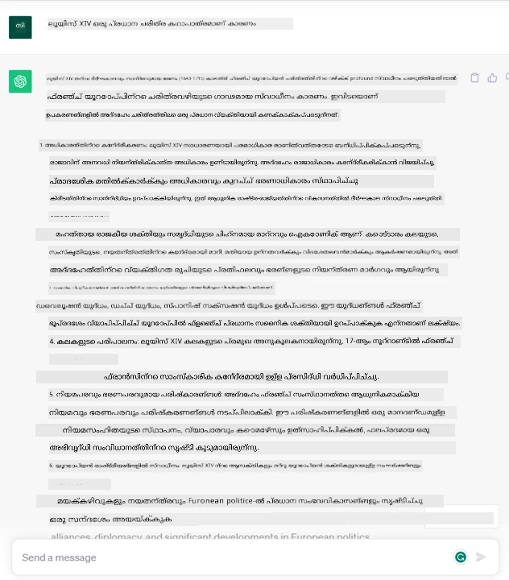
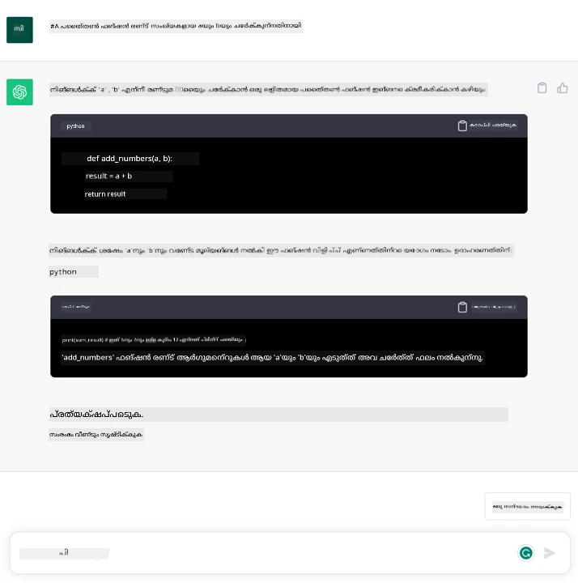

<!--
CO_OP_TRANSLATOR_METADATA:
{
  "original_hash": "bfb7901bdbece1ba3e9f35c400ca33e8",
  "translation_date": "2025-12-19T18:35:16+00:00",
  "source_file": "01-introduction-to-genai/README.md",
  "language_code": "ml"
}
-->
# ജനറേറ്റീവ് എഐയും വലിയ ഭാഷാ മോഡലുകളും പരിചയം

_(ഈ പാഠത്തിന്റെ വീഡിയോ കാണാൻ മുകളിൽ ചിത്രത്തിൽ ക്ലിക്ക് ചെയ്യുക)_

ജനറേറ്റീവ് എഐ എന്നത് ടെക്സ്റ്റ്, ചിത്രങ്ങൾ, മറ്റ് തരത്തിലുള്ള ഉള്ളടക്കം സൃഷ്ടിക്കാൻ കഴിയുന്ന കൃത്രിമ ബുദ്ധിമുട്ടാണ്. അതിനെ അത്ഭുതകരമായ സാങ്കേതികവിദ്യയാക്കുന്നത് അത് എഐയെ ജനസാമാന്യർക്കായി തുറന്നിടുന്നു എന്നതാണ്, ആരും ഒരു ടെക്സ്റ്റ് പ്രോംപ്റ്റ്, സ്വാഭാവിക ഭാഷയിൽ എഴുതിയ ഒരു വാചകം ഉപയോഗിച്ച് എഐ ഉപയോഗിക്കാം. ജാവ അല്ലെങ്കിൽ എസ്‌ക്യുവൽ പോലുള്ള ഭാഷകൾ പഠിക്കേണ്ടതില്ല, നിങ്ങൾക്ക് വേണ്ടത് നിങ്ങളുടെ ഭാഷ ഉപയോഗിച്ച് നിങ്ങൾക്ക് വേണ്ടത് പറയുക, എഐ മോഡലിൽ നിന്നൊരു നിർദ്ദേശം ലഭിക്കും. ഇതിന്റെ പ്രയോഗങ്ങളും സ്വാധീനവും വൻതാണു, നിങ്ങൾ റിപ്പോർട്ടുകൾ എഴുതുകയോ മനസ്സിലാക്കുകയോ, അപേക്ഷകൾ എഴുതുകയോ മറ്റും സെക്കൻഡുകളിൽ ചെയ്യാം.

ഈ പാഠ്യപദ്ധതിയിൽ, നമ്മുടെ സ്റ്റാർട്ടപ്പ് എങ്ങനെ ജനറേറ്റീവ് എഐ ഉപയോഗിച്ച് വിദ്യാഭ്യാസ ലോകത്ത് പുതിയ സാഹചര്യങ്ങൾ തുറക്കുന്നു എന്നും അതിന്റെ സാമൂഹിക പ്രത്യാഘാതങ്ങളും സാങ്കേതിക പരിമിതികളും എങ്ങനെ നേരിടുന്നു എന്നും പരിശോധിക്കും.

## പരിചയം

ഈ പാഠം ഉൾക്കൊള്ളുന്നത്:

- ബിസിനസ് സാഹചര്യത്തിന്റെ പരിചയം: നമ്മുടെ സ്റ്റാർട്ടപ്പ് ആശയം, ദൗത്യം.
- ജനറേറ്റീവ് എഐയും നിലവിലെ സാങ്കേതിക ഭൂപടത്തിൽ എത്തിച്ചേരൽ.
- വലിയ ഭാഷാ മോഡലിന്റെ ആന്തരിക പ്രവർത്തനം.
- വലിയ ഭാഷാ മോഡലുകളുടെ പ്രധാന കഴിവുകളും പ്രായോഗിക ഉപയോഗങ്ങളും.

## പഠന ലക്ഷ്യങ്ങൾ

ഈ പാഠം പൂർത്തിയാക്കിയ ശേഷം, നിങ്ങൾക്ക് മനസ്സിലാകും:

- ജനറേറ്റീവ് എഐ എന്താണെന്നും വലിയ ഭാഷാ മോഡലുകൾ എങ്ങനെ പ്രവർത്തിക്കുന്നുവെന്നും.
- വ്യത്യസ്ത ഉപയോഗങ്ങൾക്കായി വലിയ ഭാഷാ മോഡലുകൾ എങ്ങനെ ഉപയോഗിക്കാമെന്നും, പ്രത്യേകിച്ച് വിദ്യാഭ്യാസ സാഹചര്യങ്ങളിൽ.

## സ്ഥിതി: നമ്മുടെ വിദ്യാഭ്യാസ സ്റ്റാർട്ടപ്പ്

ജനറേറ്റീവ് കൃത്രിമ ബുദ്ധിമുട്ട് (എഐ) എഐ സാങ്കേതികവിദ്യയുടെ ഉന്നതിമാണ്, മുമ്പ് അസാധ്യമായതായി കരുതിയ കാര്യങ്ങളുടെ അതിരുകൾ തള്ളുന്നു. ജനറേറ്റീവ് എഐ മോഡലുകൾക്ക് നിരവധി കഴിവുകളും പ്രയോഗങ്ങളും ഉണ്ട്, എന്നാൽ ഈ പാഠ്യപദ്ധതിയിൽ നാം ഒരു കൃത്രിമ സ്റ്റാർട്ടപ്പിലൂടെ അത് വിദ്യാഭ്യാസത്തിൽ എങ്ങനെ വിപ്ലവം സൃഷ്ടിക്കുന്നു എന്ന് പരിശോധിക്കും. ഈ സ്റ്റാർട്ടപ്പിനെ നാം _നമ്മുടെ സ്റ്റാർട്ടപ്പ്_ എന്ന് വിളിക്കും. നമ്മുടെ സ്റ്റാർട്ടപ്പ് വിദ്യാഭ്യാസ മേഖലയിലാണ് പ്രവർത്തിക്കുന്നത്, അതിന്റെ മഹത്തായ ദൗത്യം:

> _ലോകമാകെയുള്ള പഠനത്തിലെ ആക്‌സസിബിലിറ്റി മെച്ചപ്പെടുത്തുക, വിദ്യാഭ്യാസത്തിൽ സമതുലിതമായ പ്രവേശനം ഉറപ്പാക്കുക, ഓരോ പഠിതാവിനും അവരുടെ ആവശ്യങ്ങൾക്കനുസരിച്ച് വ്യക്തിഗത പഠനാനുഭവങ്ങൾ നൽകുക_.

നമ്മുടെ സ്റ്റാർട്ടപ്പ് ടീം മനസ്സിലാക്കുന്നു, ഈ ലക്ഷ്യം നേടാൻ ഏറ്റവും ശക്തമായ ഉപകരണങ്ങളിൽ ഒന്നായ വലിയ ഭാഷാ മോഡലുകൾ (LLMs) ഉപയോഗിക്കാതെ സാധിക്കില്ല.

ജനറേറ്റീവ് എഐ ഇന്ന് പഠനവും പഠിപ്പിക്കലും വിപ്ലവകരമാക്കുമെന്ന് പ്രതീക്ഷിക്കുന്നു, വിദ്യാർത്ഥികൾക്ക് 24 മണിക്കൂറും ലഭ്യമായ വെർച്വൽ അധ്യാപകർ വൻതോതിൽ വിവരങ്ങളും ഉദാഹരണങ്ങളും നൽകുന്നു, അധ്യാപകർക്ക് വിദ്യാർത്ഥികളെ വിലയിരുത്താനും പ്രതികരണം നൽകാനും നവീന ഉപകരണങ്ങൾ ഉപയോഗിക്കാം.

ആരംഭിക്കാൻ, ഈ പാഠ്യപദ്ധതിയിൽ ഉപയോഗിക്കുന്ന ചില അടിസ്ഥാന ആശയങ്ങളും പദങ്ങളും നമുക്ക് നിർവചിക്കാം.

## ജനറേറ്റീവ് എഐ എങ്ങനെ ലഭിച്ചു?

ജനറേറ്റീവ് എഐ മോഡലുകളുടെ പ്രഖ്യാപനത്തോടെ സൃഷ്ടിച്ച അത്ഭുതകരമായ _ഹൈപ്പ്_ എന്നതിനപ്പുറം, ഈ സാങ്കേതികവിദ്യ പതിറ്റാണ്ടുകളായി വികസിച്ചുവരുന്നു, ആദ്യ ഗവേഷണ ശ്രമങ്ങൾ 60-കളിൽ നിന്നാണ്. ഇന്ന് എഐ മനുഷ്യ ബുദ്ധിമുട്ട് കഴിവുകൾ കൈവരിച്ചിരിക്കുന്നു, ഉദാഹരണത്തിന് [OpenAI ChatGPT](https://openai.com/chatgpt) അല്ലെങ്കിൽ [Bing Chat](https://www.microsoft.com/edge/features/bing-chat?WT.mc_id=academic-105485-koreyst) പോലുള്ള സംഭാഷണങ്ങൾ കാണിക്കുന്നു, ബിംഗ് വെബ് തിരച്ചിലിനായി GPT മോഡൽ ഉപയോഗിക്കുന്നു.

കുറച്ച് പിന്നോട്ടു പോകുമ്പോൾ, എഐയുടെ ആദ്യ പ്രോട്ടോടൈപ്പുകൾ ടൈപ്പുചെയ്ത ചാറ്റ്ബോട്ടുകളായിരുന്നു, വിദഗ്ധരുടെ അറിവ് ശേഖരിച്ച് കമ്പ്യൂട്ടറിൽ പ്രതിനിധാനം ചെയ്തിരുന്നത്. അറിവ് അടിസ്ഥാനത്തിലുള്ള ഉത്തരങ്ങൾ ഇൻപുട്ടിലെ കീവേഡുകൾ വഴി പ്രവർത്തിച്ചിരുന്നു. എന്നാൽ, ടൈപ്പുചെയ്ത ചാറ്റ്ബോട്ടുകൾ ഉപയോഗിക്കുന്ന സമീപനം വലുതാകാൻ കഴിയില്ലെന്ന് ഉടൻ മനസ്സിലായി.

### എഐക്ക് ഒരു സാംഖ്യിക സമീപനം: മെഷീൻ ലേണിംഗ്

90-കളിൽ ഒരു മുറിവ് വന്നു, ടെക്സ്റ്റ് വിശകലനത്തിന് സാംഖ്യിക സമീപനം പ്രയോഗിച്ച്. ഇതു പുതിയ ആൽഗോരിതങ്ങൾ വികസിപ്പിക്കാൻ വഴിയൊരുക്കി – മെഷീൻ ലേണിംഗ് എന്നറിയപ്പെടുന്നത് – ഡാറ്റയിൽ നിന്നു പാറ്റേണുകൾ പഠിക്കാൻ പ്രോഗ്രാമുചെയ്യാതെ. ഈ സമീപനം യന്ത്രങ്ങൾക്ക് മനുഷ്യഭാഷ മനസ്സിലാക്കുന്നത് അനുകരിക്കാൻ സഹായിച്ചു: ഒരു സാംഖ്യിക മോഡൽ ടെക്സ്റ്റ്-ലേബൽ ജോഡികളിൽ പരിശീലിപ്പിക്കപ്പെട്ടു, അതിലൂടെ മോഡൽ അറിയാത്ത ഇൻപുട്ട് ടെക്സ്റ്റ് മുൻകൂട്ടി നിശ്ചയിച്ച ലേബലിൽ വർഗ്ഗീകരിക്കാൻ കഴിയും.

### ന്യൂറൽ നെറ്റ്വർക്കുകളും ആധുനിക വെർച്വൽ അസിസ്റ്റന്റുകളും

അടുത്ത വർഷങ്ങളിൽ, വലിയ ഡാറ്റയും സങ്കീർണ്ണ കണക്കുകൂട്ടലുകളും കൈകാര്യം ചെയ്യാൻ കഴിയുന്ന ഹാർഡ്‌വെയർ സാങ്കേതികവിദ്യയുടെ പുരോഗതി എഐ ഗവേഷണത്തെ പ്രോത്സാഹിപ്പിച്ചു, ന്യൂറൽ നെറ്റ്വർക്കുകൾ അല്ലെങ്കിൽ ഡീപ് ലേണിംഗ് ആൽഗോരിതങ്ങൾ എന്നറിയപ്പെടുന്ന മെഷീൻ ലേണിംഗ് ആൽഗോരിതങ്ങൾ വികസിപ്പിച്ചു.

ന്യൂറൽ നെറ്റ്വർക്കുകൾ (പ്രത്യേകിച്ച് റികറന്റ് ന്യൂറൽ നെറ്റ്വർക്കുകൾ – RNNs) സ്വാഭാവിക ഭാഷാ പ്രോസസ്സിംഗ് വളരെയധികം മെച്ചപ്പെടുത്തി, വാചകത്തിലെ ഒരു പദത്തിന്റെ സാന്ദർഭ്യം വിലമതിച്ച് ടെക്സ്റ്റിന്റെ അർത്ഥം കൂടുതൽ സാരമായ രീതിയിൽ പ്രതിനിധാനം ചെയ്യാൻ സഹായിച്ചു.

ഈ സാങ്കേതികവിദ്യ പുതിയ നൂറ്റാണ്ടിന്റെ ആദ്യ ദശകത്തിൽ ജനിച്ച വെർച്വൽ അസിസ്റ്റന്റുകൾക്ക് ശക്തി നൽകി, മനുഷ്യഭാഷ വ്യാഖ്യാനിക്കാൻ, ആവശ്യങ്ങൾ തിരിച്ചറിയാൻ, അവ തൃപ്തിപ്പെടുത്താൻ പ്രവർത്തനങ്ങൾ നടത്താൻ – മുൻകൂട്ടി നിർവചിച്ച സ്ക്രിപ്റ്റ് ഉപയോഗിച്ച് മറുപടി നൽകുക അല്ലെങ്കിൽ മൂന്നാം കക്ഷി സേവനം ഉപയോഗിക്കുക പോലുള്ള.

### ഇന്നത്തെ ജനറേറ്റീവ് എഐ

ഇങ്ങനെ നാം ഇന്ന് ജനറേറ്റീവ് എഐവിലേക്ക് എത്തി, ഇത് ഡീപ് ലേണിംഗിന്റെ ഒരു ഉപവിഭാഗമായി കാണാം.

എഐ മേഖലയിലെ പതിറ്റാണ്ടുകളായുള്ള ഗവേഷണത്തിന് ശേഷം, _ട്രാൻസ്ഫോർമർ_ എന്ന പുതിയ മോഡൽ ആർക്കിടെക്ചർ RNN-കളുടെ പരിധികൾ മറികടന്നു, കൂടുതൽ ദൈർഘ്യമുള്ള ടെക്സ്റ്റ് സീക്വൻസുകൾ ഇൻപുട്ടായി സ്വീകരിക്കാൻ കഴിയും. ട്രാൻസ്ഫോർമറുകൾ അറ്റൻഷൻ മെക്കാനിസം അടിസ്ഥാനമാക്കി, മോഡലിന് ലഭിക്കുന്ന ഇൻപുട്ടുകൾക്ക് വ്യത്യസ്ത ഭാരങ്ങൾ നൽകാൻ, ഏറ്റവും പ്രസക്തമായ വിവരങ്ങൾ എവിടെ കേന്ദ്രീകൃതമാണെന്ന് 'കൂടുതൽ ശ്രദ്ധ' നൽകാൻ സഹായിക്കുന്നു, ടെക്സ്റ്റ് സീക്വൻസിലെ ക്രമം നോക്കാതെ.

അടുത്തകാലത്തെ ജനറേറ്റീവ് എഐ മോഡലുകളുടെ ഭൂരിഭാഗവും – വലിയ ഭാഷാ മോഡലുകൾ (LLMs) എന്നും അറിയപ്പെടുന്നു, കാരണം അവ ടെക്സ്റ്റ് ഇൻപുട്ടുകളും ഔട്ട്പുട്ടുകളും കൈകാര്യം ചെയ്യുന്നു – ഈ ആർക്കിടെക്ചറിനെ അടിസ്ഥാനമാക്കിയതാണ്. പുസ്തകങ്ങൾ, ലേഖനങ്ങൾ, വെബ്സൈറ്റുകൾ പോലുള്ള വൈവിധ്യമാർന്ന ഉറവിടങ്ങളിൽ നിന്നുള്ള വലിയ അളവിലുള്ള ലേബൽ ചെയ്യാത്ത ഡാറ്റയിൽ പരിശീലിപ്പിച്ച ഈ മോഡലുകൾ വിവിധ ജോലികൾക്ക് അനുയോജ്യമായി മാറ്റം വരുത്താൻ കഴിയും, വ്യാകരണപരമായി ശരിയായ, സൃഷ്ടിപരമായതിന്റെ ഒരു ഭ്രമം ഉള്ള ടെക്സ്റ്റ് സൃഷ്ടിക്കാൻ കഴിയും. അതായത്, ഒരു യന്ത്രത്തിന് ഇൻപുട്ട് ടെക്സ്റ്റ് 'മനസ്സിലാക്കാനുള്ള' ശേഷി വളരെയധികം മെച്ചപ്പെടുത്തിയതോടൊപ്പം, മനുഷ്യഭാഷയിൽ ഒരു ഒറിജിനൽ മറുപടി സൃഷ്ടിക്കാൻ കഴിയും.

## വലിയ ഭാഷാ മോഡലുകൾ എങ്ങനെ പ്രവർത്തിക്കുന്നു?

അടുത്ത അധ്യായത്തിൽ നാം വ്യത്യസ്ത തരത്തിലുള്ള ജനറേറ്റീവ് എഐ മോഡലുകൾ പരിശോധിക്കും, എന്നാൽ ഇപ്പോൾ വലിയ ഭാഷാ മോഡലുകൾ എങ്ങനെ പ്രവർത്തിക്കുന്നുവെന്ന്, പ്രത്യേകിച്ച് OpenAI GPT (ജനറേറ്റീവ് പ്രീ-ട്രെയിൻഡ് ട്രാൻസ്ഫോർമർ) മോഡലുകൾക്ക് ശ്രദ്ധ കേന്ദ്രീകരിച്ച് നോക്കാം.

- **ടോക്കനൈസർ, ടെക്സ്റ്റ് മുതൽ സംഖ്യകൾ വരെ**: വലിയ ഭാഷാ മോഡലുകൾ ടെക്സ്റ്റ് ഇൻപുട്ടായി സ്വീകരിച്ച് ടെക്സ്റ്റ് ഔട്ട്പുട്ട് സൃഷ്ടിക്കുന്നു. എന്നാൽ, സാംഖ്യിക മോഡലുകൾ ആയതിനാൽ, ടെക്സ്റ്റ് സീക്വൻസുകളേക്കാൾ സംഖ്യകളുമായി മികച്ച രീതിയിൽ പ്രവർത്തിക്കുന്നു. അതിനാൽ, മോഡലിന് നൽകുന്ന ഓരോ ഇൻപുട്ടും ടോക്കനൈസർ വഴി പ്രോസസ്സ് ചെയ്യപ്പെടുന്നു. ഒരു ടോക്കൺ എന്നത് ടെക്സ്റ്റിന്റെ ഒരു ഭാഗമാണ് – വ്യത്യസ്ത അക്ഷരങ്ങളുടെ എണ്ണം ഉള്ള ഒരു ഘടകം, അതിനാൽ ടോക്കനൈസറിന്റെ പ്രധാന ജോലി ഇൻപുട്ട് ടോക്കണുകളുടെ ഒരു അറേ ആയി വിഭജിക്കുക ആണ്. തുടർന്ന്, ഓരോ ടോക്കണും ടോക്കൺ ഇൻഡക്സുമായി മാപ്പ് ചെയ്യപ്പെടുന്നു, ഇത് ആ ടെക്സ്റ്റ് ഭാഗത്തിന്റെ പൂർണ്ണസംഖ്യ എൻകോഡിങ്ങാണ്.

- **ഔട്ട്പുട്ട് ടോക്കണുകൾ പ്രവചിക്കൽ**: n ടോക്കണുകൾ ഇൻപുട്ടായി നൽകിയാൽ (മാക്സ് n മോഡലുകൾക്കിടയിൽ വ്യത്യാസപ്പെടുന്നു), മോഡൽ ഒരു ടോക്കൺ ഔട്ട്പുട്ടായി പ്രവചിക്കാൻ കഴിയും. ഈ ടോക്കൺ അടുത്ത ഇറ്ററേഷന്റെ ഇൻപുട്ടിൽ ഉൾപ്പെടുത്തപ്പെടുന്നു, വിപുലീകരിക്കുന്ന വിൻഡോ മാതൃകയിൽ, ഒരു (അല്ലെങ്കിൽ പല) വാചകങ്ങൾ മറുപടിയായി ലഭിക്കുന്ന മികച്ച ഉപയോക്തൃ അനുഭവം നൽകുന്നു. അതുകൊണ്ടാണ്, നിങ്ങൾ ChatGPT ഉപയോഗിച്ചാൽ, ചിലപ്പോൾ അത് വാചകത്തിന്റെ മദ്ധ്യത്തിൽ നിർത്തുന്നതുപോലെ തോന്നാറുള്ളത്.

- **തിരഞ്ഞെടുപ്പ് പ്രക്രിയ, സാധ്യത വിതരണവും**: ഔട്ട്പുട്ട് ടോക്കൺ മോഡൽ നിലവിലെ ടെക്സ്റ്റ് സീക്വൻസിന് ശേഷം സംഭവിക്കാനുള്ള സാധ്യതയുടെ അടിസ്ഥാനത്തിൽ തിരഞ്ഞെടുക്കുന്നു. മോഡൽ എല്ലാ സാധ്യതയുള്ള 'അടുത്ത ടോക്കണുകൾ' നും സാധ്യതാ വിതരണവും പ്രവചിക്കുന്നു, പരിശീലനത്തിന്റെ അടിസ്ഥാനത്തിൽ. എന്നാൽ, ഏറ്റവും ഉയർന്ന സാധ്യതയുള്ള ടോക്കൺ എല്ലായ്പ്പോഴും തിരഞ്ഞെടുക്കപ്പെടുന്നില്ല. ഒരു അളവിൽ യാദൃച്ഛികത ഈ തിരഞ്ഞെടുപ്പിൽ ചേർക്കുന്നു, മോഡൽ നിർണായകമല്ലാത്ത രീതിയിൽ പ്രവർത്തിക്കുന്നു - ഒരേ ഇൻപുട്ടിനായി ഒരേ ഔട്ട്പുട്ട് ലഭിക്കില്ല. ഈ യാദൃച്ഛികത സൃഷ്ടിപരമായ ചിന്തന പ്രക്രിയ അനുകരിക്കാൻ ചേർക്കുന്നു, ഇത് 'ടെംപറേച്ചർ' എന്ന മോഡൽ പാരാമീറ്റർ ഉപയോഗിച്ച് ക്രമീകരിക്കാം.

## നമ്മുടെ സ്റ്റാർട്ടപ്പ് വലിയ ഭാഷാ മോഡലുകൾ എങ്ങനെ ഉപയോഗിക്കാം?

വലിയ ഭാഷാ മോഡലിന്റെ ആന്തരിക പ്രവർത്തനം നമുക്ക് മനസ്സിലായതിനുശേഷം, അവ സാധാരണയായി ചെയ്യാൻ കഴിയുന്ന ചില പ്രായോഗിക ഉദാഹരണങ്ങൾ നോക്കാം, നമ്മുടെ ബിസിനസ് സാഹചര്യത്തെ ശ്രദ്ധയിൽ വെച്ച്. വലിയ ഭാഷാ മോഡലിന്റെ പ്രധാന കഴിവ് _സ്വാഭാവിക ഭാഷയിൽ എഴുതിയ ടെക്സ്റ്റ് ഇൻപുട്ടിൽ നിന്ന് ടെക്സ്റ്റ് സൃഷ്ടിക്കുക_ എന്നതാണ്.

എന്ത് തരത്തിലുള്ള ടെക്സ്റ്റ് ഇൻപുട്ടും ഔട്ട്പുട്ടും?

വലിയ ഭാഷാ മോഡലിന്റെ ഇൻപുട്ട് പ്രോംപ്റ്റ് എന്നറിയപ്പെടുന്നു, ഔട്ട്പുട്ട് പൂർത്തീകരണം (completion) എന്നറിയപ്പെടുന്നു, ഇത് നിലവിലെ ഇൻപുട്ട് പൂർത്തിയാക്കാൻ അടുത്ത ടോക്കൺ സൃഷ്ടിക്കുന്ന മോഡൽ യന്ത്രം സൂചിപ്പിക്കുന്നു. പ്രോംപ്റ്റ് എന്താണെന്നും അത് എങ്ങനെ രൂപകൽപ്പന ചെയ്യാമെന്നും നാം വിശദമായി പഠിക്കും. ഇപ്പോൾ പറയാം പ്രോംപ്റ്റിൽ ഉൾപ്പെടാം:

- മോഡലിൽ നിന്നു പ്രതീക്ഷിക്കുന്ന ഔട്ട്പുട്ടിന്റെ തരം വ്യക്തമാക്കുന്ന **നിർദ്ദേശം**. ചിലപ്പോൾ ഈ നിർദ്ദേശം ഉദാഹരണങ്ങൾ അല്ലെങ്കിൽ അധിക ഡാറ്റ ഉൾക്കൊള്ളാം.

  1. ലേഖനം, പുസ്തകം, ഉൽപ്പന്ന അവലോകനങ്ങൾ എന്നിവയുടെ സംഗ്രഹം, അസംഘടിത ഡാറ്റയിൽ നിന്നുള്ള洞察ങ്ങൾ എടുക്കൽ.
    
    
  
  2. ലേഖനം, പ്രബന്ധം, അസൈൻമെന്റ് എന്നിവയുടെ സൃഷ്ടിപരമായ ആശയവിനിമയം, രൂപകൽപ്പന.
      
     

- ഏജന്റുമായി സംഭാഷണ രൂപത്തിൽ ചോദിക്കുന്ന **ചോദ്യം**.
  
  

- എഴുതേണ്ട **ടെക്സ്റ്റിന്റെ ഒരു ഭാഗം**, ഇത് എഴുതൽ സഹായത്തിനുള്ള അഭ്യർത്ഥനയാണ്.
  
  

- **കോഡ്** ഒരു ഭാഗം, അതിന്റെ വിശദീകരണവും ഡോക്യുമെന്റേഷനും ആവശ്യപ്പെടൽ, അല്ലെങ്കിൽ ഒരു പ്രത്യേക ജോലി ചെയ്യുന്ന കോഡ് സൃഷ്ടിക്കാൻ അഭ്യർത്ഥന.
  
  

മുകളിൽ കാണിച്ച ഉദാഹരണങ്ങൾ വളരെ ലളിതമാണ്, വലിയ ഭാഷാ മോഡലുകളുടെ കഴിവുകളുടെ സമ്പൂർണ്ണ പ്രദർശനമല്ല. പ്രത്യേകിച്ച് വിദ്യാഭ്യാസ സാഹചര്യങ്ങളിൽ ജനറേറ്റീവ് എഐ ഉപയോഗിക്കുന്ന സാധ്യത കാണിക്കാൻ ഉദ്ദേശിച്ചവയാണ്.

കൂടാതെ, ജനറേറ്റീവ് എഐ മോഡലിന്റെ ഔട്ട്പുട്ട് പൂർണ്ണമായും ശരിയല്ല, ചിലപ്പോൾ മോഡലിന്റെ സൃഷ്ടിപരമായ കഴിവ് അതിനെതിരെ പ്രവർത്തിച്ച്, മനുഷ്യ ഉപയോക്താവ് യാഥാർത്ഥ്യത്തിന്റെ മായാജാലം എന്ന് വ്യാഖ്യാനിക്കാവുന്ന വാക്കുകളുടെ സംയോജനം അല്ലെങ്കിൽ അപമാനകരമായ ഔട്ട്പുട്ട് ഉണ്ടാകാം. ജനറേറ്റീവ് എഐ ബുദ്ധിമുട്ടുള്ളതല്ല - കുറഞ്ഞത് ബുദ്ധിമുട്ടിന്റെ കൂടുതൽ വ്യാപകമായ നിർവചനത്തിൽ, അതായത് വിമർശനാത്മകവും സൃഷ്ടിപരവുമായ ചിന്തനവും മാനസിക ബുദ്ധിമുട്ടും ഉൾപ്പെടുന്ന; ഇത് നിർണായകമല്ല, വിശ്വസനീയമല്ല, കാരണം തെറ്റായ റഫറൻസുകൾ, ഉള്ളടക്കം, പ്രസ്താവനകൾ ശരിയായ വിവരങ്ങളുമായി ചേർത്ത് വിശ്വാസയോഗ്യമായും ആത്മവിശ്വാസത്തോടെ അവതരിപ്പിക്കപ്പെടാം. അടുത്ത പാഠങ്ങളിൽ നാം ഈ പരിമിതികൾ കൈകാര്യം ചെയ്യുകയും അവ കുറയ്ക്കാൻ എന്ത് ചെയ്യാമെന്ന് കാണുകയും ചെയ്യും.

## അസൈൻമെന്റ്

[ജനറേറ്റീവ് എഐ](https://en.wikipedia.org/wiki/Generative_artificial_intelligence?WT.mc_id=academic-105485-koreyst) കുറിച്ച് കൂടുതൽ വായിച്ച്, ഇന്ന് ജനറേറ്റീവ് എഐ ഇല്ലാത്ത ഒരു മേഖലയെ കണ്ടെത്താൻ ശ്രമിക്കുക. "പഴയ രീതിയിൽ" ചെയ്യുന്നതിൽ നിന്നുള്ള വ്യത്യാസം എന്ത്? നിങ്ങൾ മുമ്പ് ചെയ്യാൻ കഴിയാത്തത് ചെയ്യാമോ, അല്ലെങ്കിൽ നിങ്ങൾ വേഗത്തിൽ ചെയ്യാമോ? നിങ്ങളുടെ സ്വപ്ന എഐ സ്റ്റാർട്ടപ്പ് എങ്ങനെയിരിക്കും എന്ന് 300 വാക്കുകളിൽ ഒരു സംഗ്രഹം എഴുതുക, "പ്രശ്നം", "എനിക്ക് എഐ എങ്ങനെ ഉപയോഗിക്കാം", "പ്രഭാവം" തുടങ്ങിയ തലക്കെട്ടുകൾ ഉൾപ്പെടുത്തുക, ബിസിനസ് പ്ലാൻ ചേർക്കാം.

ഈ ജോലി ചെയ്താൽ, നിങ്ങൾ മൈക്രോസോഫ്റ്റിന്റെ ഇൻക്യൂബേറ്ററായ [Microsoft for Startups Founders Hub](https://www.microsoft.com/startups?WT.mc_id=academic-105485-koreyst) ൽ അപേക്ഷിക്കാൻ തയ്യാറായിരിക്കാം. ഞങ്ങൾ ആസ്യൂർ, ഓപ്പൺഎഐ, മെന്ററിംഗ് എന്നിവയ്ക്ക് ക്രെഡിറ്റുകൾ നൽകുന്നു, പരിശോധിക്കുക!

## അറിവ് പരിശോധിക്കൽ

വലിയ ഭാഷാ മോഡലുകൾക്കുറിച്ച് എന്താണ് ശരി?

1. നിങ്ങൾക്ക് ഓരോ തവണയും ഒരേ മറുപടി ലഭിക്കും.
1. അത് കാര്യങ്ങൾ പൂർണ്ണമായും ശരിയായി ചെയ്യുന്നു, സംഖ്യകൾ കൂട്ടുന്നതിൽ, പ്രവർത്തിക്കുന്ന കോഡ് സൃഷ്ടിക്കുന്നതിൽ മികച്ചതാണ്.
1. ഒരേ പ്രോംപ്റ്റ് ഉപയോഗിച്ചാലും മറുപടി വ്യത്യാസപ്പെടാം. ഇത് ടെക്സ്റ്റ് ആണോ കോഡോ ആയ ഒന്നിന്റെ ആദ്യ ഡ്രാഫ്റ്റ് നൽകുന്നതിൽ മികച്ചതാണ്. എന്നാൽ ഫലങ്ങൾ മെച്ചപ്പെടുത്തേണ്ടതുണ്ട്.

ഉത്തരം: 3, LLM നിർണായകമല്ല, മറുപടി വ്യത്യാസപ്പെടുന്നു, എന്നാൽ ടെംപറേച്ചർ സെറ്റിംഗ് വഴി വ്യത്യാസം നിയന്ത്രിക്കാം. ഇത് കാര്യങ്ങൾ പൂർണ്ണമായും ശരിയായി ചെയ്യുമെന്ന് പ്രതീക്ഷിക്കരുത്, ഇത് നിങ്ങൾക്ക് ഒരു നല്ല ആദ്യ ശ്രമം നൽകാൻ ഉദ്ദേശിച്ചിരിക്കുന്നു, പിന്നീട് മെച്ചപ്പെടുത്തേണ്ടതാണ്.

## മികച്ച ജോലി! യാത്ര തുടരുക

ഈ പാഠം പൂർത്തിയാക്കിയ ശേഷം, നമ്മുടെ [ജനറേറ്റീവ് എഐ പഠന ശേഖരം](https://aka.ms/genai-collection?WT.mc_id=academic-105485-koreyst) പരിശോധിച്ച് നിങ്ങളുടെ ജനറേറ്റീവ് എഐ അറിവ് ഉയർത്തുക!
Lesson 2 ലേക്ക് പോകൂ, അവിടെ നാം [വിവിധ LLM തരംകൾ എങ്ങനെ പരിശോധിക്കാമെന്നും താരതമ്യം ചെയ്യാമെന്നും](../02-exploring-and-comparing-different-llms/README.md?WT.mc_id=academic-105485-koreyst) നോക്കാം!

---

<!-- CO-OP TRANSLATOR DISCLAIMER START -->
**അസൂയാപത്രം**:  
ഈ രേഖ AI വിവർത്തന സേവനം [Co-op Translator](https://github.com/Azure/co-op-translator) ഉപയോഗിച്ച് വിവർത്തനം ചെയ്തതാണ്. നാം കൃത്യതയ്ക്ക് ശ്രമിച്ചിട്ടുണ്ടെങ്കിലും, യന്ത്രം ചെയ്ത വിവർത്തനങ്ങളിൽ പിശകുകൾ അല്ലെങ്കിൽ തെറ്റുകൾ ഉണ്ടാകാമെന്ന് ദയവായി ശ്രദ്ധിക്കുക. അതിന്റെ മാതൃഭാഷയിലുള്ള യഥാർത്ഥ രേഖ അധികാരപരമായ ഉറവിടമായി കണക്കാക്കപ്പെടണം. നിർണായക വിവരങ്ങൾക്ക്, പ്രൊഫഷണൽ മനുഷ്യ വിവർത്തനം ശുപാർശ ചെയ്യപ്പെടുന്നു. ഈ വിവർത്തനം ഉപയോഗിക്കുന്നതിൽ നിന്നുണ്ടാകുന്ന ഏതെങ്കിലും തെറ്റിദ്ധാരണകൾക്കോ തെറ്റായ വ്യാഖ്യാനങ്ങൾക്കോ ഞങ്ങൾ ഉത്തരവാദികളല്ല.
<!-- CO-OP TRANSLATOR DISCLAIMER END -->