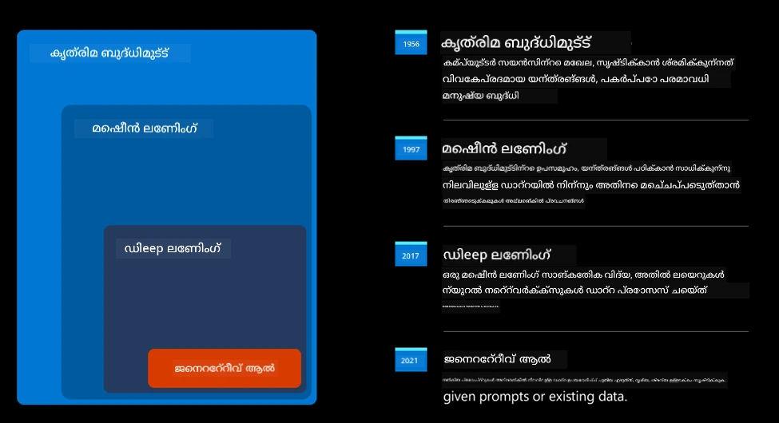
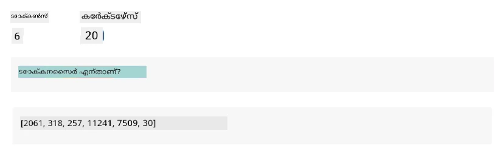
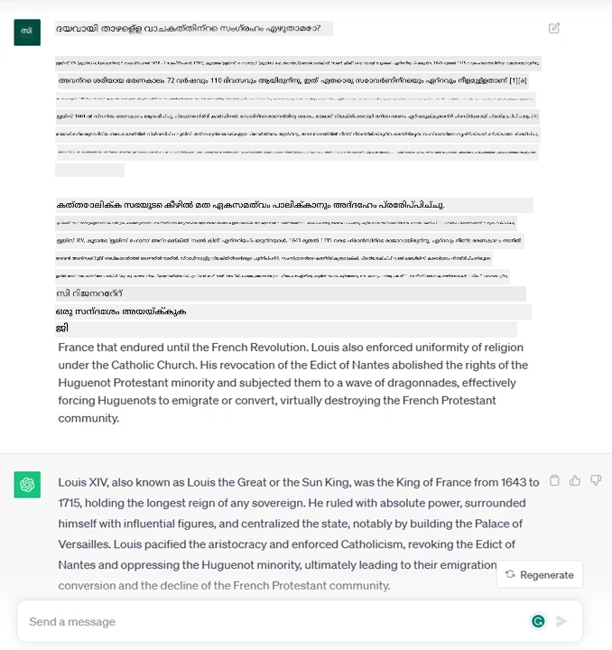
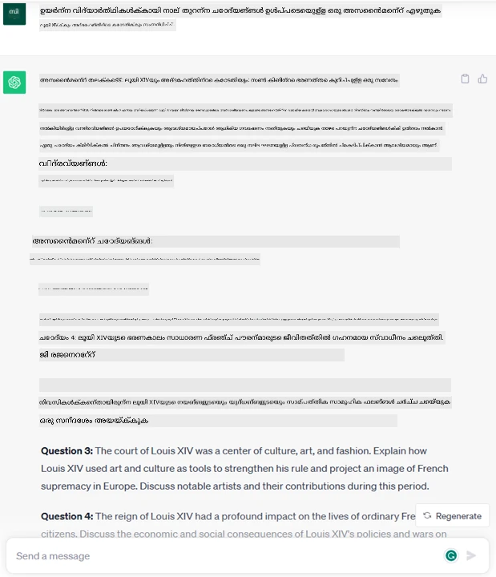
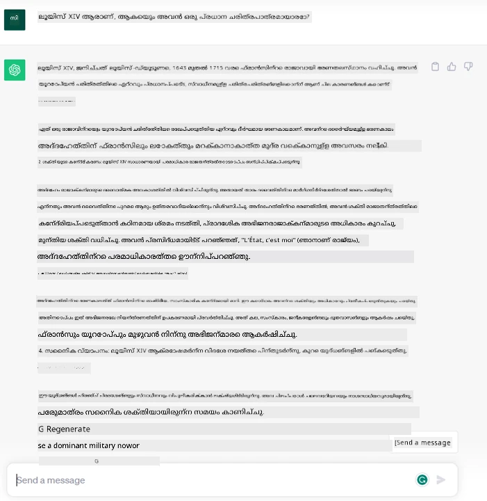
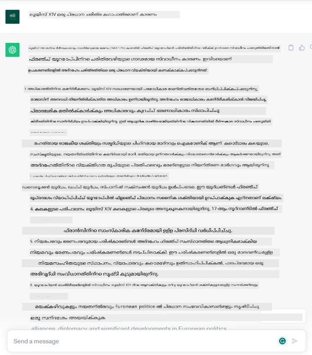
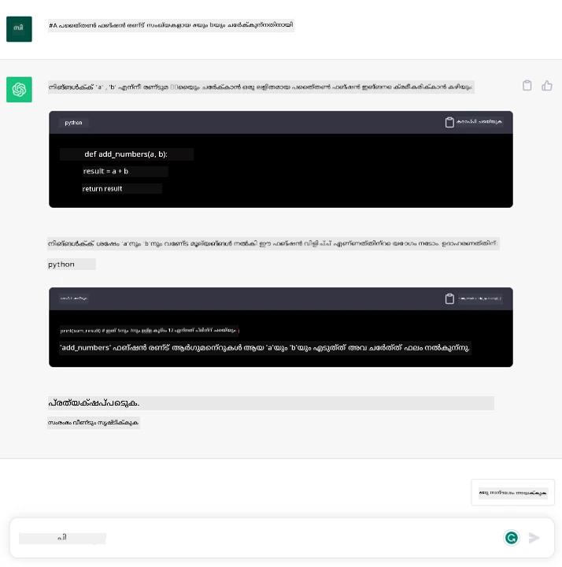

# സൃഷ്ടിപരമായ എഐയും വൻ ഭാഷാ മോഡലുകളും പരിചയം

_(ഈ പാഠമുള്ള വീഡിയോ കാണാൻ മുകളിൽ ചിത്രം ക്ലിക്ക് ചെയ്യുക)_

സൃഷ്ടിപരമായ എഐ (Generative AI) ടെക്സ്റ്റെക്‌സ്, ചിത്രങ്ങൾ മറ്റ് ഉള്ളടക്ക തരങ്ങൾ സൃഷ്ടിക്കാൻ കഴിയുന്ന കൃത്രിമ ബുദ്ധিমുട്ടിലാണ്. ഇതിനെ ഉറ്റ തന്ത്രം ആക്കുന്നത് എന്തെന്നാൽ ഇത് എഐ യെ ജനങ്ങള്‍ക്കിടയിൽ ലളിതമായി എത്തിക്കുന്നതാണ്. ഉള്ളടക്കം മാത്രമുള്ള ചെറിയ ഒരു രചന ഉപയോഗിച്ച് ഒരാളും ഉപയോഗിക്കാനാകും. ജാവ അല്ലെങ്കിൽ എസ്‌ക്യുവൽ പോലുള്ള ഭാഷ പഠിക്കേണ്ട ആവശ്യമില്ല, നിങ്ങൾക്കുള്ള ഭാഷയിൽ നിങ്ങൾക്ക് വേണമെന്നു പറയുന്നതും എഐ മോഡലിൽ നിന്നുള്ള നിർദ്ദേശം കിട്ടുന്നതും മതി. ഈ അനുഭാവങ്ങൾ വളരെയധികമാണ്; റിപ്പോർട്ടുകൾ എഴുതുക അല്ലെങ്കിൽ മനസ്സിലാക്കുക, അപേക്ഷകൾ എഴുതുക എന്നിവയെല്ലാം സെക്കൻഡുകളിൽ ചെയ്യാം.

ഈ പാഠ്യക്രമത്തിൽ, ഞങ്ങളുടെ സ്റ്റാർട്ടപ്പ് എങ്ങനെ സൃഷ്ടിപരമായ എഐ ഉപയോഗിച്ച് വിദ്യാഭ്യാസ ലോകത്ത് പുതിയ സാഹചര്യങ്ങൾ തുറക്കുന്നു എന്ന് പരിശോധിക്കും, സാങ്കേതിക പരിധികളും സാമൂഹ്യ പ്രഭാവങ്ങളും നേരിടുന്നതിനുള്ള മാർഗങ്ങളും വിശകലനം ചെയ്യുന്നു.

## പരിചയം

ഈ പാഠം ഇതെല്ലാം ഉൾക്കും:

- ബിസിനസ് സന്ദർഭം: ഞങ്ങളുടെ സ്റ്റാർട്ടപ്പ് ആശയം മിഷൻ എന്നിവയുടെ പരിചയം.
- സൃഷ്ടിപരമായ എഐയും നിലവിലുള്ള സാങ്കേതിക ഭൂപ്രകൃതിയും എങ്ങനെ എത്തി എന്നത്.
- വൻ ഭാഷാ മോഡലിന്റെ ആന്തരിക പ്രവർത്തനം.
- വൻ ഭാഷാ മോഡലുകളുടെയും പ്രധാന കഴിവുകളും പ്രായോഗിക ഉപയോഗങ്ങളുമെന്താണ്.

## പഠന ലക്ഷ്യങ്ങൾ

ഈ പാഠം പൂർത്തിയാക്കിയതിന് ശേഷം, നിങ്ങൾ അറിയാം:

- സൃഷ്ടിപരമായ എഐ എന്താണെന്നും വൻ ഭാഷാ മോഡലുകൾ എങ്ങനെ പ്രവർത്തിക്കുന്നുവെന്നും.
- വിവിധ ഉപയോഗങ്ങളിലേക്കു വൻ ഭാഷാ മോഡലുകൾ എങ്ങനെ ഉപയോഗിക്കാമെന്നു, പ്രത്യേകിച്ച് വിദ്യാഭ്യാസ സാഹചര്യങ്ങളിൽ ശ്രദ്ധ കേന്ദ്രീകരിച്ച്.

## സാഹചര്യം: നമ്മുടെ വിദ്യാഭ്യാസ സ്റ്റാർട്ടപ്പ്

സൃഷ്ടിപരമായ കൃത്രിമ ബുദ്ധി (AI) എഐ സാങ്കേതിക വിദ്യയുടെ ഉന്നത നിലയാണ്, ഒരു കാലത്ത് അസാദ്ധ്യമായതായി കരുതപ്പെട്ട കാര്യങ്ങൾ സാദ്ധ്യമാക്കിയിരിക്കുന്നു. സൃഷ്ടിപരമായ എഐ മോഡലുകൾക്ക് പല കഴിവുകളും ഉപയോഗങ്ങളും ഉണ്ട്, എന്നാൽ ഈ പാഠ്യക്രമത്തിന്, അവ വിദ്യാഭ്യാസത്തിൽ ഒരു സങ്കൽപ്പം ചെയ്ത സ്റ്റാർട്ടപ്പ് മുഖാന്തിരം എങ്ങനെ വിപ്ലവം സൃഷ്ടിക്കുന്നു എന്നാണ് കാണിക്കുക. ഈ സ്റ്റാർട്ടപ്പ് നാം _നമ്മുടെ സ്റ്റാർട്ടപ്പ്_ എന്ന് വിളിക്കുന്നു. നമ്മുടെ സ്റ്റാർട്ടപ്പ് വിദ്യാഭ്യാസ മേഖലയിൽ ജോലി ചെയ്യുന്നു, അതിന്റെ മഹത്തായ ദൗത്യം:

> _ശ്രദ്ധാപൂർവ്വം ലഭ്യത കൂട്ടി, ആഗോള തലത്തിൽ പഠനത്തിന് തുല്യമായ പ്രവേശനം ഉറപ്പുവരുത്തി, ഓരോ പഠിതാവിനും അവരുടെ ആവശ്യങ്ങളനുസരിച്ച് വ്യക്തിഗത പഠന അനുഭവങ്ങൾ നൽകുക_.

നമ്മുടെ സ്റ്റാർട്ടപ്പ് ടീം മനസ്സിലാക്കുന്നു, ഏറ്റവും ശക്തമായ ആധുനിക ഉപകരണങ്ങളിലൊന്ന് - വൻ ഭാഷാ മോഡലുകൾ (LLMs) - ഉപയോഗിക്കാതെ ഈ ലക്ഷ്യം നേടാനാകില്ല.

സൃഷ്ടിപരമായ എഐ ഇന്നത്തെ പഠനത്തിലും പഠിപ്പിക്കലിലും വിപ്ലവകരമായി മാറാൻ ഉദ്ദേശിക്കുന്നു, വിദ്യാർത്ഥികൾക്ക് 24 മണിക്കൂറും ലഭ്യമായ വൈര്ച്ച്വൽ അധ്യാപകർ വിസ్తൃതമായ വിവരങ്ങളും ഉദാഹരണങ്ങളും തരുന്നു, അധ്യാപകർ സ്റ്റുഡന്റുകളെ വിലയിരുത്താനും പ്രതികരണം നൽകാനും പുതുമയുള്ള ഉപകരണങ്ങൾ ഉപയോഗിക്കാം.

തുടക്കമായി, പാഠ്യക്രമം മുഴുവനായി ഉപയോഗിക്കുന്ന ചില അടിസ്ഥാന ആശയങ്ങളും പദവും നമുക്ക് നിശ്ചയിക്കാം.

## നമ്മൾ എങ്ങനെ സൃഷ്ടിപരമായ എഐ നേടി?

അടുത്തിടെ സൃഷ്ടിപരമായ എഐ മോഡലുകൾ പ്രഖ്യാപിച്ചതോടെ ഉണ്ടായ വലിയ _ഹൈപ്പ്_ കാരണത്താൽ വളരെയധികം ശ്രദ്ധിക്കപ്പെടുകയുള്ളൂ എങ്കിലും, ഈ സാങ്കേതിക വിദ്യ പതിറ്റാണ്ടുകളായി വികസിച്ചുവരുന്നു, ആദ്യം 60-കളിൽ തന്നെ ഗവേഷണം ആരംഭിച്ചത്. ഇന്ന്, എഐ മനുഷ്യ ബുദ്ധിമുട്ടുകൾ പോലുള്ള സംഭാഷണ ശേഷി എന്നിവയാണ്, ഉദാഹരണത്തിന് [OpenAI ChatGPT](https://openai.com/chatgpt) അല്ലെങ്കിൽ [Microsoft Copilot](https://copilot.microsoft.com/?WT.mc_id=academic-105485-koreyst), ഇത് ഘോഷിക്കപ്പെടുന്ന GPT മോഡൽ സംഭാഷണ വെബ് സെർച്ച് അനുഭവത്തിനും ഉപയോഗിക്കുന്നു.

കുറച്ച് നേരം മുൻപായി, എഐയുടെ ആദ്യ മാതൃകകൾ തയാറാക്കിയ ചാറ്റ്ബോട്ടുകൾ മിക്കവാറും അറിയിപ്പർഗ്ഗം ബേസ് ഉപയോഗിച്ച് വിദഗ്ധർ നിന്ന് ലഭിച്ച അറിവുകൾ കമ്പ്യൂട്ടറിൽ അവതരിപ്പിക്കുന്ന തരത്തിലായിരുന്നു. ഉള്ളടക്കത്തിലുള്ള കീവേഡുകൾ ഉത്തരം തിരുവനന്തപുരിച്ചത്.
എന്നാൽ ഈ വിധത്തിലുള്ള തയാറാക്കിയ ചാറ്റ്ബോട്ടുകൾ പര്യാപ്തമായിത്തീർന്നില്ല.

### കൃത്യപരിശോധനയുടെ സമീപനം: മെഷീൻ ലേണിങ്

90-കളിൽ ടെക്സ്റ്റ് വിശകലനത്തിന് കൃത്യസാംഖ്യപരമായ സമീപനം വന്ന സമയം ഒരു വളർച്ചക്കളമായി രൂപം കൊണ്ടു. മെഷീൻ ലേണിങ് എന്നറിയപ്പെടുന്ന പുതിയ ആൽഗോരിതങ്ങൾ വികസിച്ചു, ഇവ ഡാറ്റയിൽ നിന്നുള്ള മാതൃകകൾ പഠിക്കാനും വ്യക്തമായി പ്രോഗ്രാം ചെയ്യപ്പെടാതെ പ്രവർത്തിക്കാനും കഴിയുന്നവയാണ്. ഇത് യന്ത്രങ്ങളെ മനുഷ്യ ഭാഷ മനസ്സിലാക്കല്‍ അനുകരിക്കാൻ അനുവദിച്ചു: ഒരു കൃത്യസാംഖ്യപരമായ മോഡൽ ടെക്സ്റ്റ്-ലേബൽ ജോഡികളിൽ പരിശീലിക്കുകയും അജ്ഞാത ഇൻപുട്ട് ടെക്സ്റ്റ് ഒരു നിശ്ചിത ലക്ഷ്യം പ്രതിനിധാനം ചെയ്യുന്ന ലേബലുമായി വർഗ്ഗീകരിക്കാനും സഹായിക്കുകയും ചെയ്യുന്നു.

### ന്യൂറൽ നെറ്റ്‌വർക്ക്‌കളും ആധുനിക വൈർ‌ച്ച്വൽ അസിസ്റ്റന്റുകളും

കഴിഞ്ഞ കുറേ വർഷങ്ങളിൽ, കൂടുതൽ ഡാറ്റ കൈകാര്യം ചെയ്യാനാകുകയും സങ്കീർണ്ണ കണക്കുകൾ പരിഹരിക്കാൻ ശേഷിയുള്ള ഹാർഡ്‌വയېرിന്റെ സാങ്കേതിക വളർച്ചയാണ് എ.ഐ ഗവേഷണം പ്രോത്സാഹിപ്പിച്ചത്. അതിലൂടെ ന്യൂറൽ നെറ്റ്വർക്കുകൾ അല്ലെങ്കിൽ ഡീപ് ലേണിംഗ് ആൽഗോരിതങ്ങൾ വികസിച്ചു.

പ്രത്യേകിച്ച് റികറന്റ് ന്യൂറൽ നെറ്റ്വർക്കുകൾ (RNNs) സ്വാഭാവിക ഭാഷ പ്രോസസിംഗിൽ (NLP) വലിയ പുരോഗതി ഉണ്ടാക്കി, വാക്കിന്റെ ഒരു വാചകത്തിൽ ഉള്ള പ്രസംഗം മനസ്സിലാക്കൽ മെച്ചപ്പെടുത്തുകയും ചെയ്തു.

നൂറ്റാണ്ടിന്റെ ആദിയിൽ ജനിച്ച ഈ വൈർ‌ച്ച്വൽ അസിസ്റ്റന്റുകൾ മനുഷ്യഭാഷ അവതരിപ്പിക്കാൻ, ആവശ്യങ്ങൾ തിരിച്ചറിയാൻ, അവ പൂരിപ്പിക്കാൻ പ്രവർത്തിക്കാൻ മികച്ച കഴിവും ഉണ്ടായിരുന്നു – നിശ്ചിത സ്രിപ്റ്റ് ലഭ്യമാക്കുക അല്ലെങ്കിൽ മൂന്നാം കക്ഷി സേവനം ഉപയോഗിക്കുക പോലുള്ള പ്രവർത്തനങ്ങൾ.

### ഇന്നത്തെ സ്ഥിതി, സൃഷ്ടിപരമായ എഐ

ഇങ്ങനെ ആഴത്തിലുള്ള പഠനത്തിന്റെ ഒരു ഉപവിഭാഗമായി നമ്മൾ ഇന്നത്തെ സൃഷ്ടിപരമായ എഐ പാതയിലേക്ക് എത്തി.

എഐ ഗവേഷണത്തിൽ പതിറ്റാണ്ടുകൾക്കു ശേഷം, പുതിയ മോഡൽ ആർക്കിടെക്ചർ - _ട്രാൻസ്ഫോർമർ_ - RNN-കളുടെ പരിധികൾ മറികടന്ന് വല്ലാതെ വലിയ ടെക്സ്റ്റ് സീಕ್ವൻസുകൾ ഇൻപുട്ടായി സ്വീകരിക്കാൻ കഴിവുള്ളത്. ട്രാൻസ്ഫോർമറുകൾ ശ്രദ്ധാ സംവിധാനത്തെ അടിസ്ഥാനമാക്കി പ്രവർത്തിക്കുന്നു, കൂടാതെ മോഡൽ ലഭിക്കുന്ന ഇൻപുട്ടുകൾക്ക് വ്യത്യസ്ത ഭാരങ്ങൾ നൽകുന്നു, ഏറ്റവും പ്രസക്തമായ വിവരങ്ങൾ കേന്ദ്രീകരിച്ചിടത്തേക്ക് കൂടുതൽ ശ്രദ്ധ ചെലുത്തുന്നു, പരാതിയിൽ അവയുടെ ക്രമം എന്തായാലും.

ഏറ്റവും പുതിയ സൃഷ്ടിപരമായ എഐ മോഡലുകളിൽ കൂടുതലായും വൻ ഭാഷാ മോഡലുകൾ (LLMs) ആണ്, ഇവ ടെക്സ്റ്റ് ഇൻപുട്ടുകളുമായി മുന്നോട്ടു പോകുന്നു. അവ വലിയ അളവിലുള്ള ലേബൽ ചെയ്യാത്ത വിവരങ്ങളിൽ നിന്ന് - പുസ്തകങ്ങൾ, ലേഖനങ്ങൾ, വെബ്സൈറ്റുകൾ തുടങ്ങിയവ - പരിശീലിപ്പിക്കപ്പെട്ടതിനാൽ തരം തരം ജോലികൾക്ക് അനുയോജ്യമായി മാറുകയും സൃഷ്ടിപരമായ എഴുത്ത് ക്ഷമതയും കാണിക്കുകയും ചെയ്യുന്നു. അതെ, അവർ യന്ത്രത്തിന് ഒരു ഇൻപുട്ടിനെ ‘മനസ്സിലാക്കാനുള്ള’ ശേഷി വളർത്തിയതോടെ മാത്രമല്ല, മനുഷ്യഭാഷയിൽ原创 പ്രതികരണം നൽകാനുള്ള കഴിവും കൈകണ്ടു.

## വൻ ഭാഷാ മോഡലുകൾ എങ്ങനെ പ്രവർത്തിക്കുന്നു?

അടുത്ത അധ്യായത്തിൽ നാം വ്യത്യസ്ത തരം സൃഷ്ടിപരമായ എഐ മോഡലുകൾ പരിശോധിക്കും, പക്ഷും ഇപ്പോൾ OpenAI GPT (Generative Pre-trained Transformer) മോഡലുകളിലേക്കു ശ്രദ്ധ കേന്ദ്രീകരിക്കാം.

- **ടോക്കനൈസർ, ടെക്സ്റ്റ് നമ്ബറുകളിലാക്കി**: വൻ ഭാഷാ മോഡലുകൾ ടെക്സ്റ്റ് ഇൻപുട്ടായി സ്വീകരിച്ച്, ടെക്സ്റ്റ് ഔട്ട്പുട്ടായി സൃഷ്ടിക്കുന്നു. എങ്കിലും, കൃത്യസാംഖ്യപരമായ മോഡലുകൾ എണ്ണങ്ങല്‍ ഉപയോഗിച്ച് കൂടുതലാണ് നന്നായി പ്രവർത്തിക്കുന്നത്, അതുകൊണ്ടു മോഡലിന് ഓരോ ഇൻപുട്ടും ടോക്കനൈസർ ഉപയോഗിച്ച് പ്രോസസ്സ് ചെയ്യുന്നു. ഒരു ടോക്കൺ വൃത്തിയുള്ള ടെക്സ്റ്റ് ചെറുകഷ്ണമാണ് - ഒത്തസംഖ്യാവാരമുള്ള അക്ഷരങ്ങൾ അടങ്ങുന്ന, അതിനാൽ ടോക്കനൈസറിന്റെ പ്രധാന കടമ ഇൻപുട്ട് ടോക്കണിന്റെ നിരയിൽ വിഭജിക്കുക എന്നതാണ്. തുടർന്ന് ഓരോ ടോക്കൺ ടോക്കൺ ഇൻഡക്സുമായി (ടെക്സ്റ്റ് ചെറുകഷ്ണത്തിന്റെ സംഖ്യവർണ്ണന) മാപിക്കുന്നു.

- **ഔട്ട്പുട്ട് ടോക്കണുകൾ പ്രവചിക്കൽ**: n ടോക്കൺ ഇൻപുട്ടായി കിട്ടിയാൽ (max n മോഡൽ마다 വ്യത്യാസപ്പെടും), മോഡൽ ഒരു ടോക്കൺ ഔട്ട്പുട്ടായി പ്രവചിക്കുന്നു. ആ ടോക്കൺ അടുത്ത ഇറ്ററേഷന്റെ ഇൻപുട്ടിൽ ഉൾപ്പെടുത്തുന്നു, വിപുലമായ വിൻഡോ മാതൃകയിൽ, കുട്ടിക്ക് അല്ലെങ്കിൽ പല വാചകങ്ങൾ ഉത്തരമായി കിട്ടാന്‍ നല്ല ഉപയോഗാനുഭവം നൽകുന്നു. ഇത് കാരണം, ChatGPT ഉപയോഗിച്ചാൽ ചിലപ്പോൾ വാചകത്തിന്റെ നടുക്കിൽ നിർത്തുന്നതുപോലെയാണ് തോന്നുക.

- **തിരഞ്ഞെടുപ്പ് പ്രക്രിയ, സാധ്യത വിതരണം**: ഔട്ട്പുട്ട് ടോക്കൺ മോഡൽ ഇൻപുട്ട് ടെക്സ്റ്റ് ശ്രേണിയുടെ ശേഷമുള്ള സംഭവിക്കാനുള്ള സാധ്യത അനുസരിച്ച് തിരഞ്ഞെടുക്കുന്നു. മോഡൽ "അടുത്ത ടോക്കൺ" ങ്ങളുടെ സാധ്യത വിതരണം പ്രവചിക്കുന്നു. പക്ഷേ എല്ലാ സമയവും ഏറ്റവും ഉയർന്ന സാധ്യതയുള്ള ടോക്കൺ തെരഞ്ഞെടുക്കാറില്ല. ഈ തിരഞ്ഞെടുപ്പിൽ അല്പം രാൻഡം ആക്‌ഷൻ ചേർക്കുന്നു, ഇത് മോഡലിനെ നിഷ്ചിതത്വരഹിതമായി പ്രവർത്തിക്കാനിടയാക്കുന്നു - ഒരே ഇൻപുട്ടിന് ഒരേ ഔട്ട്പുട്ട് പ്രതീക്ഷിക്കേണ്ട. ഈ രാൻഡം ക്രിയാത്മക ചിന്തയുടെ ഇമിറ്റ് ചെയ്യാനാണ്യും, മോഡൽ പാരാമീറ്റർ ടെംപറേച്ചർ ഉപയോഗിച്ച് ക്രമീകരിക്കാം.

## നമ്മുടെ സ്റ്റാർട്ടപ്പ് വൻ ഭാഷാ മോഡലുകളെ എങ്ങനെ ഉപയോഗിക്കാം?

വലിയ ഭാഷാ മോഡലിന്റെ ആന്തരിക പ്രവർത്തനം മനസ്സിലാക്കിയ ശേഷം, ബിസിനസ് കേസുമായി കാണിച്ച് അവ കഴിവുള്ള സാധാരണക്കാരൻ പ്രായോഗിക ഉദാഹരണങ്ങൾ നോക്കാം.
നാം പറഞ്ഞത്, വൻ ഭാഷാ മോഡലിന്റെ പ്രധാന കഴിവ് _ഒരു ടെക്സ്റ്റ് ഇൻപുട്ടിൽ നിന്ന് പൂർണ്ണമായി പുതിയ ടെക്സ്റ്റ് സൃഷ്ടിക്കുക_ ആണെന്ന്.

എന്നാൽ മുൻകരുതൽ ഇൻപുട്ട്, ഔട്ട്പുട്ട് എന്താകാം?
വൻ ഭാഷാ മോഡലിന്റെ ഇൻപുട്ട് ഒരു പ്രോംപ്റ്റ് (prompt) എന്നറിയപ്പെടുന്നു, ഔട്ട്പുട്ട് ഒരു പൂർത്തീകരണം (completion) എന്നാണ്, ഇത് മോഡൽ നിലവിലെ ഇൻപുട്ട് പൂർത്തിയാക്കാനുള്ള അടുത്ത ടോക്കൺ സൃഷ്ടിക്കുന്നത് സൂചിപ്പിക്കുന്നു. നാം പ്രോംപ്റ്റ് എന്തെന്ന്, എങ്ങനെ രൂപകൽപ്പന ചെയ്യുമ്പോൾ മോഡലിന്റെ മികച്ചഫലം കിട്ടു എന്ന് വിശദമായി പഠിക്കും. ഇപ്പോൾ മാത്രം പറയാം പ്രോംപ്റ്റിൽ എന്തൊക്കെ ഉൾപ്പെടാം:

- ഒരു **നിർദ്ദേശം**: മോഡൽ നിന്നും ആകാംക്ഷിയായ ഔട്ട്പുട്ടിന്റെ തരം വ്യക്തമാക്കുന്നു. ഇത് ചിലപ്പോൾ ഉദാഹരണങ്ങളോ അധിക വിവരങ്ങളോ ഉൾക്കൊള്ളും.

  1. ലേഖനം, പുസ്തകം, ഉൽപ്പന്ന അവലോകനങ്ങൾ എന്നിവയുടെ സംക്ഷേപം, അക്രമരഹിത ഡാറ്റയിൽ നിന്നുള്ള洞察ങ്ങൾ എടുത്തുകാട്ടൽ.
    
    
  
  2. സൃഷ്ടിപരമായ ആശയവിനിമയം, ലേഖനം, പ്രബന്ധം, അസൈൻമെന്റ് എന്നിവയുടെ രൂപകൽപ്പന.
      
     

- ഒരു **ചോദ്യം**, ഏജന്റുമായി സംവാദ രൂപത്തിൽ ചോദിച്ചിരിക്കുന്നു.
  
  

- ഒരു അല്ലെങ്കില്‍ **ടെക്സ്റ്റ് പൂർത്തിയാക്കുക** എന്ന_chunks_, ഇതില്‍ എഴുത്ത് സഹായത്തിനുള്ള അഭ്യർത്ഥന അടങ്ങിയിട്ടുണ്ട്.
  
  

- ഒരു **കോഡ്** ചെറിയ ഭാഗം, അത് വിശദീകരിക്കുകയും രേഖപ്പെടുത്തുകയും ചെയ്യാൻ ആവശ്യപ്പെടുക, അല്ലെങ്കിൽ പ്രത്യേക പ്രവർത്തനം ചെയ്യുന്ന കോഡ് ഭാഗം സൃഷ്ടിക്കാൻ അഭ്യർത്ഥന.
  
  

മുകളിലുള്ള ഉദാഹരണങ്ങൾ വളരെ ലളിതമാണ്, വൻ ഭാഷാ മോഡലുകളുടെ കഴിവുകളുടെ പൂർണ്ണമായ പ്രകടനം ലക്ഷ്യംവയ്ക്കുന്നില്ല. വൈവിധ്യമാർന്ന സൃഷ്ടിപരമായ എഐ ഉപയോഗങ്ങളുടെ സാധ്യത കാണിക്കുകയാണ് ഉദ്ദേശം, പ്രത്യേകിച്ച് പഠനContexts അടങ്ങുന്നു.

കൂടാതെ, സൃഷ്ടിപരമായ എഐ മോഡലിന്റെ ഔട്ട്‌പുട്ട് പൂർണ്ണമായ perfect അല്ല, ചിലപ്പോൾ മോഡലിന്റെ സൃഷ്ടിമാൻ അസാധാരണം ഫലം നൽകുകയും, മനുഷ്യ ഉപയോക്താവിന് യാഥാർത്ഥ്യത്തിനുള്ള മോശമായ വ്യാഖ്യാനം അല്ലെങ്കിൽ അപകീർത്തി കാരണം ഉണ്ടാകാം. സൃഷ്ടിപരമായ എഐ ബുദ്ധിയുള്ള ഒരു മനുഷ്യനെ പോലെ അല്ല - കുറഞ്ഞത് സമഗ്രമായ ബുദ്ധിയുടെ നിർവചനം അനുസരിച്ച്, മാധ്യമവും സൃഷ്ടിപരവും ചിന്തയും ശൈത്യബോധം ഉൾപ്പെടുന്നു; ഇത് നിർവചിത വേഗത്തിലല്ല, വിശ്വസനീയവുമല്ല ഒന്നുമല്ല, ശേഖരിച്ച വിവരങ്ങൾ തമ്മിൽ തെറ്റായ ഉദ്ധരണികളും ഉള്ളടക്കവും പ്രസ്താവനകളും ചേർന്ന് ബോധ്യത്തിന് എങ്ങനെയെങ്കിലും പ്രശ്‌നങ്ങളുണ്ടാക്കുകയും, ആത്മവിശ്വാസത്തോടും പ്രചോദനത്തോടും കൂടി അവതരിപ്പിക്കപ്പെടുകയും ചെയ്യുന്നു. അഗ്രഭാഗ പാഠങ്ങളിൽ നാം ഈ പരിമിതികളും നേരിടുകയും അവ ഒഴിവാക്കാനുള്ള മാർഗങ്ങളും കാണും.

## ടീച്ചിംഗ് അസൈൻമെന്റ്

നിങ്ങളുടെ അസൈൻമെന്റു ഇവിടെ, [സൃഷ്ടിപരമായ എഐ](https://en.wikipedia.org/wiki/Generative_artificial_intelligence?WT.mc_id=academic-105485-koreyst) കൂടുതൽ വായിക്കുക, ഇന്ന് സൃഷ്ടിപരമായ എഐ ഇല്ലാത്ത ഒരു മേഖലയെ തിരിച്ചറിയാൻ ശ്രമിക്കുക. "പഴയ രീതിയിൽ" ചെയ്യുന്നതിൽനിന്ന് വ്യത്യസ്തമായി എന്ത് ഫലമുണ്ടാകും? മുമ്പ് സാധിക്കാതെ പോയത് നിങ്ങൾക്ക് ചെയ്യാമോ? അല്ലെങ്കിൽ നിങ്ങൾ വേഗത്തിലാണ്? 300 വാക്കുള്ള ഒരു സംക്ഷേപം എഴുതുക, നിങ്ങളുടെ സ്വപ്ന എഐ സ്റ്റാർട്ടപ്പ് എങ്ങനെ കാണപ്പെടും, "പ്രശ്നം", "എങ്ങനെ എഐ ഉപയോഗിക്കും", "ഫലം" തുടങ്ങി ശീർഷകങ്ങൾ ഉൾപ്പെടുത്തുക, ഒരുപക്ഷേ ബിസിനസ് പ്ലാനും ഉൾപ്പെടുത്താം.

നിങ്ങൾ ഈ ടാസ്ക് ചെയ്തിട്ടുണ്ടെങ്കിൽ, മൈക്രോസോഫ്റ്റിന്റെ ഇൻകുബേറ്ററായ [Microsoft for Startups Founders Hub](https://www.microsoft.com/startups?WT.mc_id=academic-105485-koreyst) വേണ്ടി അപേക്ഷിക്കാനുള്ള ഒരുങ്ങലുണ്ടാകും. ഞങ്ങൾ ആസ്യൂർ, ഓപ്പൺ എഐ, മെന്ററിങ് മുതലായവക്ക് ക്രെഡിറ്റ് നൽകുന്നു, പരിശോധിച്ച് നോക്കുക!

## അറിവ് പരിശോധന

വൻ ഭാഷാ മോഡലുകളെക്കുറിച്ച് എന്താണ് സത്യം?

1. ഓരോ തവണയും നിങ്ങൾക്ക് ഒരേ ഉപരിതലം ലഭിക്കും.
1. ഇത് കാര്യങ്ങൾ പൂർണമായി ശരിയായി ചെയ്യുന്നു, അക്കങ്ങൾ കൂട്ടുന്നതിൽ, പ്രവർത്തനക്ഷമമായ കോഡ് സൃഷ്ടിക്കുന്നതിൽ മികവുള്ളതാണ്.
1. ഒരേ പ്രോംപ്റ്റ് ഉപയോഗിച്ചാലും ഫലം വ്യത്യാസപ്പെടാം. ഇത് ആദ്യം ഒരു ഡ്രാഫ്റ്റ് തരുന്നതിൽ നല്ലതാണ്, ടെക്സ്റ്റ് ആണെങ്കിൽ അല്ലെങ്കിൽ കോഡോ ആകാം. പക്ഷേ ഫലങ്ങളിൽ ഉന്നതി ആവശ്യമാണ്.

എ: 3, ഒരു LLM നിർവചനാതീതമാണ്, ഫലം വ്യത്യാസപ്പെടുന്നു, പക്ഷേ ടെംപറേച്ചർ ക്രമീകരണം വഴി വ്യത്യാസം നിയന്ത്രിക്കാം. ഇത് പൂർണമാകാതെ പ്രവർത്തിക്കും, ഇത് ഭാരവാഹിത്വം നിർവഹിക്കും, എന്നാൽ തുടക്കം മുതൽ നല്ല ഒരു നോക്കുകൂട്ട് നൽകും, നിങ്ങൾ പിന്നീട് മെച്ചപ്പെടുത്തേണ്ടത് സാധാരണമാണ്.

## മികച്ച ജോലി! യാത്ര തുടർച്ചയാക്കാം

ഈ പാഠം പൂർത്തിയാക്കിയതിനു ശേഷം സൃഷ്ടിപരമായ എഐ അറിവ് മെച്ചപ്പെടുത്താൻ ഞങ്ങളുടെ [Generative AI Learning collection](https://aka.ms/genai-collection?WT.mc_id=academic-105485-koreyst) പരിശോധിക്കുക!

വ്യത്യസ്ത LLM തരംകൾ [ശേഖരിക്കുകയും താരതമ്യം ചെയ്യുകയും](../02-exploring-and-comparing-different-llms/README.md?WT.mc_id=academic-105485-koreyst) എങ്ങനെ ചെയ്യാമെന്ന് നാം ഗുരുസംഖ്യ 2-ലേക്ക് പോകാം!

---

<!-- CO-OP TRANSLATOR DISCLAIMER START -->
**അറിയിപ്പ്**:
ഈ രേഖ AI പരിഭാഷാ സേവനം [Co-op Translator](https://github.com/Azure/co-op-translator) ഉപയോഗിച്ച് പരിഭാഷപ്പെടുത്തിയതാണ്. ഞങ്ങൾ കൃത്യതയ്ക്കായി ശ്രമിക്കുന്നുവെങ്കിലും, ഓട്ടോമേറ്റഡ് പരിഭാഷകളിൽ പിഴവുകൾ അല്ലെങ്കിൽ തെറ്റായ വിവരങ്ങൾ ഉണ്ടാകാൻ സാധ്യതയുണ്ട്. അതിന്റെ സ്വാഭാവിക ഭാഷയിലുള്ള അസൽ രേഖയാണ് പ്രാമാണികമായ ഉറവിടമായി പരിഗണിക്കേണ്ടത്. നിർണായകമായ വിവരങ്ങൾക്ക്, പ്രൊഫഷണൽ മനുഷ്യ പരിഭാഷ ശുപാർശ ചെയ്യുന്നു. ഈ പരിഭാഷ ഉപയോഗിച്ച് ഉണ്ടാകുന്ന തെറ്റിദ്ധാരണകൾ അല്ലെങ്കിൽ തെറ്റായ വ്യാഖ്യാനങ്ങൾക്കായി ഞങ്ങൾ ഉത്തരവാദികളല്ല.
<!-- CO-OP TRANSLATOR DISCLAIMER END -->