# വ്യത്യസ്ത LLM-കൾ അന്വേഷിക്കുകയും താരതമ്യം ചെയ്യുകയും ചെയ്യുന്നു

[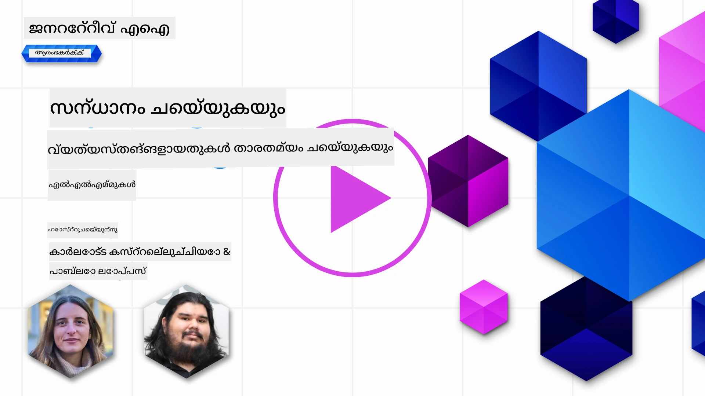](https://youtu.be/KIRUeDKscfI?si=8BHX1zvwzQBn-PlK)

> _ഈ പാഠത്തിന്റെ വീഡിയോ കാണാൻ മുകളിൽ ചിത്രത്തിൽ ക്ലിക്ക് ചെയ്യുക_

മുൻപത്തെ പാഠത്തിൽ, ജനറേറ്റീവ് AI ടെക്നോളജി രംഗം എങ്ങനെ മാറ്റം വരുത്തുകയാണ്, വലിയ ഭാഷാ മോഡലുകൾ (LLMs) എങ്ങനെ പ്രവർത്തിക്കുന്നു, ഒരു ബിസിനസ്സ് - നമ്മുടെ സ്റ്റാർട്ടപ്പുപോലെ - അവയെ അവരുടെ ഉപയോഗ കേസുകളിൽ എങ്ങനെ പ്രയോഗിച്ച് വളരാൻ കഴിയും എന്നത് നാം കണ്ടു! ഈ അധ്യായത്തിൽ, വ്യത്യസ്ത തരത്തിലുള്ള വലിയ ഭാഷാ മോഡലുകൾ (LLMs) താരതമ്യം ചെയ്ത് അവയുടെ ഗുണദോഷങ്ങൾ മനസ്സിലാക്കാൻ നോക്കുകയാണ്.

നമ്മുടെ സ്റ്റാർട്ടപ്പിന്റെ യാത്രയിലെ അടുത്ത ഘട്ടം LLM-കളുടെ നിലവിലെ രംഗം അന്വേഷിക്കുകയും നമ്മുടെ ഉപയോഗ കേസിന് അനുയോജ്യമായവയെ മനസ്സിലാക്കുകയും ചെയ്യുകയാണ്.

## പരിചയം

ഈ പാഠം ഉൾക്കൊള്ളുന്നത്:

- നിലവിലെ രംഗത്തെ വ്യത്യസ്ത തരത്തിലുള്ള LLM-കൾ.
- നിങ്ങളുടെ ഉപയോഗ കേസിനായി Azure-യിൽ വ്യത്യസ്ത മോഡലുകൾ പരീക്ഷിക്കുകയും, പുനരാവർത്തിക്കുകയും, താരതമ്യം ചെയ്യുകയും ചെയ്യുക.
- ഒരു LLM എങ്ങനെ വിന്യസിക്കാമെന്ന്.

## പഠന ലക്ഷ്യങ്ങൾ

ഈ പാഠം പൂർത്തിയാക്കിയ ശേഷം, നിങ്ങൾക്ക് കഴിയും:

- നിങ്ങളുടെ ഉപയോഗ കേസിനായി ശരിയായ മോഡൽ തിരഞ്ഞെടുക്കുക.
- മോഡൽ പരീക്ഷിക്കുക, പുനരാവർത്തിക്കുക, പ്രകടനം മെച്ചപ്പെടുത്തുക എങ്ങനെ എന്നത് മനസ്സിലാക്കുക.
- ബിസിനസ്സുകൾ മോഡലുകൾ എങ്ങനെ വിന്യസിക്കുന്നു എന്ന് അറിയുക.

## വ്യത്യസ്ത തരത്തിലുള്ള LLM-കൾ മനസ്സിലാക്കുക

LLM-കൾ അവരുടെ ആർക്കിടെക്ചർ, പരിശീലന ഡാറ്റ, ഉപയോഗ കേസ് എന്നിവയുടെ അടിസ്ഥാനത്തിൽ പല തരത്തിലായി വർഗ്ഗീകരിക്കാം. ഈ വ്യത്യാസങ്ങൾ മനസ്സിലാക്കുന്നത് നമ്മുടെ സ്റ്റാർട്ടപ്പിന് അനുയോജ്യമായ മോഡൽ തിരഞ്ഞെടുക്കാനും, പരീക്ഷിക്കുകയും, പുനരാവർത്തിക്കുകയും, പ്രകടനം മെച്ചപ്പെടുത്തുകയും ചെയ്യാൻ സഹായിക്കും.

വ്യത്യസ്ത തരത്തിലുള്ള LLM മോഡലുകൾ നിരവധി ഉണ്ട്, നിങ്ങളുടെ മോഡൽ തിരഞ്ഞെടുപ്പ് നിങ്ങൾ അവയെ എന്തിനായി ഉപയോഗിക്കാൻ ഉദ്ദേശിക്കുന്നുവെന്ന്, നിങ്ങളുടെ ഡാറ്റ, നിങ്ങൾ എത്ര ചെലവഴിക്കാൻ തയ്യാറാണെന്ന് എന്നിവയെ ആശ്രയിച്ചിരിക്കും.

നിങ്ങൾ മോഡലുകൾ ടെക്സ്റ്റ്, ഓഡിയോ, വീഡിയോ, ഇമേജ് ജനറേഷൻ തുടങ്ങിയവയ്ക്ക് ഉപയോഗിക്കാൻ ഉദ്ദേശിക്കുന്നുവെങ്കിൽ, നിങ്ങൾക്ക് വ്യത്യസ്ത തരത്തിലുള്ള മോഡലുകൾ തിരഞ്ഞെടുക്കേണ്ടി വരാം.

- **ഓഡിയോയും സ്പീച്ച് തിരിച്ചറിയലും**. ഈ ആവശ്യത്തിനായി, Whisper-തരം മോഡലുകൾ മികച്ച തിരഞ്ഞെടുപ്പാണ്, കാരണം അവ പൊതുവായ ഉദ്ദേശ്യത്തിനും സ്പീച്ച് തിരിച്ചറിയലിനും ഉദ്ദേശിച്ചവയാണ്. വ്യത്യസ്ത ഓഡിയോയിൽ പരിശീലിപ്പിച്ചിട്ടുള്ളവയും ബഹുഭാഷാ സ്പീച്ച് തിരിച്ചറിയൽ നടത്താൻ കഴിവുള്ളവയും ആണ്. [Whisper തരം മോഡലുകൾക്കുറിച്ച് കൂടുതൽ അറിയുക](https://platform.openai.com/docs/models/whisper?WT.mc_id=academic-105485-koreyst).

- **ഇമേജ് ജനറേഷൻ**. ഇമേജ് ജനറേഷനായി, DALL-Eയും Midjourneyയും രണ്ട് വളരെ പ്രശസ്തമായ തിരഞ്ഞെടുപ്പുകളാണ്. DALL-E Azure OpenAI വഴി ലഭ്യമാണ്. [DALL-E-യെക്കുറിച്ച് കൂടുതൽ വായിക്കുക](https://platform.openai.com/docs/models/dall-e?WT.mc_id=academic-105485-koreyst) കൂടാതെ ഈ പാഠ്യപദ്ധതിയുടെ അധ്യായം 9-ൽ.

- **ടെക്സ്റ്റ് ജനറേഷൻ**. മിക്ക മോഡലുകളും ടെക്സ്റ്റ് ജനറേഷനിൽ പരിശീലിപ്പിച്ചവയാണ്, GPT-3.5 മുതൽ GPT-4 വരെ വലിയ തിരഞ്ഞെടുപ്പുകൾ ഉണ്ട്. വ്യത്യസ്ത ചെലവിൽ ലഭ്യമാണ്, GPT-4 ഏറ്റവും വിലവേറിയതാണ്. നിങ്ങളുടെ ആവശ്യങ്ങൾക്കനുസരിച്ച് കഴിവും ചെലവും പരിഗണിച്ച് [Azure OpenAI പ്ലേഗ്രൗണ്ട്](https://oai.azure.com/portal/playground?WT.mc_id=academic-105485-koreyst) പരിശോധിക്കുന്നത് ഉചിതമാണ്.

- **മൾട്ടി-മോഡാലിറ്റി**. നിങ്ങൾ ഇൻപുട്ടിലും ഔട്ട്പുട്ടിലും പല തരത്തിലുള്ള ഡാറ്റ കൈകാര്യം ചെയ്യാൻ ആഗ്രഹിക്കുന്നുവെങ്കിൽ, [gpt-4 turbo with vision അല്ലെങ്കിൽ gpt-4o](https://learn.microsoft.com/azure/ai-services/openai/concepts/models#gpt-4-and-gpt-4-turbo-models?WT.mc_id=academic-105485-koreyst) പോലുള്ള മോഡലുകൾ പരിശോധിക്കാം - OpenAI മോഡലുകളുടെ ഏറ്റവും പുതിയ റിലീസുകൾ - സ്വാഭാവിക ഭാഷാ പ്രോസസ്സിംഗ് ദൃശ്യ ബോധ്യത്തോടെ സംയോജിപ്പിച്ച്, മൾട്ടി-മോഡൽ ഇന്റർഫേസുകൾ വഴി ഇടപെടലുകൾ സാധ്യമാക്കുന്നു.

ഒരു മോഡൽ തിരഞ്ഞെടുക്കുന്നത് അടിസ്ഥാന കഴിവുകൾ ലഭിക്കുന്നതാണെന്ന് അർത്ഥമാക്കുന്നു, എന്നാൽ അത് എപ്പോഴും മതിയാകില്ല. പലപ്പോഴും കമ്പനി പ്രത്യേക ഡാറ്റ LLM-ന് അറിയിക്കേണ്ടി വരും. അതിനായി സമീപിക്കാനുള്ള ചില വ്യത്യസ്ത മാർഗ്ഗങ്ങൾ ഉണ്ട്, അടുത്ത ഭാഗങ്ങളിൽ കൂടുതൽ വിവരിക്കും.

### ഫൗണ്ടേഷൻ മോഡലുകൾ vs LLM-കൾ

ഫൗണ്ടേഷൻ മോഡൽ എന്ന പദം [സ്റ്റാൻഫോർഡ് ഗവേഷകർ നിർവചിച്ചത്](https://arxiv.org/abs/2108.07258?WT.mc_id=academic-105485-koreyst) ആണ്, ഇത് ചില മാനദണ്ഡങ്ങൾ പാലിക്കുന്ന AI മോഡലിനെ സൂചിപ്പിക്കുന്നു, ഉദാഹരണത്തിന്:

- **അവ സ്വയംപരിശീലനമോ സ്വയം-പരിശീലനമോ ഉപയോഗിച്ച് പരിശീലിപ്പിക്കപ്പെടുന്നു**, അർത്ഥം അവ ലേബൽ ചെയ്യാത്ത മൾട്ടി-മോഡൽ ഡാറ്റയിൽ പരിശീലിപ്പിക്കപ്പെടുന്നു, മനുഷ്യൻ ഡാറ്റയ്ക്ക് അനോട്ടേഷൻ അല്ലെങ്കിൽ ലേബലിംഗ് നൽകേണ്ടതില്ല.
- **വളരെ വലിയ മോഡലുകളാണ്**, ബില്യൺ കണക്കിന് പാരാമീറ്ററുകളിൽ പരിശീലിപ്പിച്ച വളരെ ആഴത്തിലുള്ള ന്യൂറൽ നെറ്റ്‌വർക്കുകൾ.
- **അവ സാധാരണയായി മറ്റ് മോഡലുകൾക്ക് ‘അടിസ്ഥാനം’ ആയി സേവനം നൽകാൻ ഉദ്ദേശിച്ചവയാണ്**, അർത്ഥം അവ മറ്റുള്ള മോഡലുകൾ നിർമ്മിക്കാൻ തുടക്കമായി ഉപയോഗിക്കാം, ഫൈൻ-ട്യൂണിംഗ് വഴി.

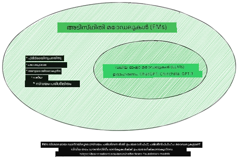

ചിത്രം ഉറവിടം: [Essential Guide to Foundation Models and Large Language Models | by Babar M Bhatti | Medium](https://thebabar.medium.com/essential-guide-to-foundation-models-and-large-language-models-27dab58f7404)

ഈ വ്യത്യാസം കൂടുതൽ വ്യക്തമാക്കാൻ, ChatGPT ഉദാഹരണമായി എടുത്തു നോക്കാം. ChatGPT-യുടെ ആദ്യ പതിപ്പ് നിർമ്മിക്കാൻ, GPT-3.5 എന്ന മോഡൽ ഫൗണ്ടേഷൻ മോഡലായി സേവനം ചെയ്തു. അതായത് OpenAI ചില ചാറ്റ്-സ്പെസിഫിക് ഡാറ്റ ഉപയോഗിച്ച് GPT-3.5-ന്റെ ട്യൂൺ ചെയ്ത പതിപ്പ് സൃഷ്ടിച്ചു, ഇത് ചാറ്റ്ബോട്ടുകൾ പോലുള്ള സംഭാഷണ സാഹചര്യങ്ങളിൽ മികച്ച പ്രകടനം നടത്താൻ പ്രത്യേകിച്ചുള്ളതാണ്.

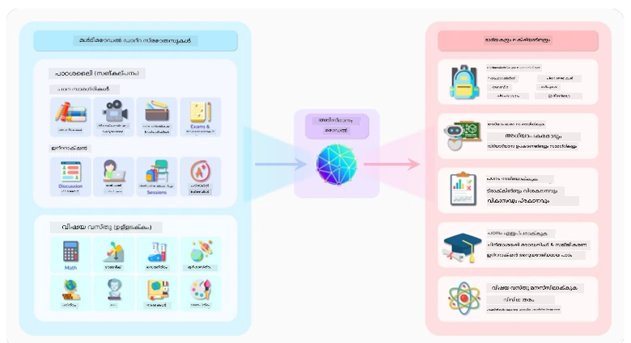

ചിത്രം ഉറവിടം: [2108.07258.pdf (arxiv.org)](https://arxiv.org/pdf/2108.07258.pdf?WT.mc_id=academic-105485-koreyst)

### ഓപ്പൺ സോഴ്‌സ് vs പ്രൊപ്രൈറ്ററി മോഡലുകൾ

LLM-കളെ വേർതിരിക്കുന്ന മറ്റൊരു മാർഗ്ഗം അവ ഓപ്പൺ സോഴ്‌സ് ആണോ പ്രൊപ്രൈറ്ററി ആണോ എന്നതാണ്.

ഓപ്പൺ സോഴ്‌സ് മോഡലുകൾ പൊതുജനങ്ങൾക്ക് ലഭ്യമായവയാണ്, ആരും ഉപയോഗിക്കാവുന്നതും. അവ സാധാരണയായി അവ സൃഷ്ടിച്ച കമ്പനി അല്ലെങ്കിൽ ഗവേഷണ സമൂഹം നൽകുന്നു. ഈ മോഡലുകൾ പരിശോധിക്കാനും, മാറ്റാനും, വ്യത്യസ്ത ഉപയോഗ കേസുകൾക്കായി ഇഷ്ടാനുസൃതമാക്കാനും അനുവാദമുണ്ട്. എന്നാൽ, അവ എല്ലായ്പ്പോഴും പ്രൊഡക്ഷൻ ഉപയോഗത്തിന് അനുയോജ്യമായതല്ല, പ്രൊപ്രൈറ്ററി മോഡലുകളെപ്പോലെ പ്രകടനക്ഷമത കുറവായിരിക്കാം. കൂടാതെ, ഓപ്പൺ സോഴ്‌സ് മോഡലുകൾക്ക് ഫണ്ടിംഗ് പരിമിതമായിരിക്കാം, ദീർഘകാലം പരിപാലിക്കപ്പെടാതിരിക്കാം, ഏറ്റവും പുതിയ ഗവേഷണത്തോടെ അപ്ഡേറ്റ് ചെയ്യപ്പെടാതിരിക്കാം. പ്രശസ്ത ഓപ്പൺ സോഴ്‌സ് മോഡലുകളുടെ ഉദാഹരണങ്ങൾ: [Alpaca](https://crfm.stanford.edu/2023/03/13/alpaca.html?WT.mc_id=academic-105485-koreyst), [Bloom](https://huggingface.co/bigscience/bloom), [LLaMA](https://llama.meta.com).

പ്രൊപ്രൈറ്ററി മോഡലുകൾ ഒരു കമ്പനിയുടേതാണ്, പൊതുജനങ്ങൾക്ക് ലഭ്യമല്ല. ഇവ സാധാരണയായി പ്രൊഡക്ഷൻ ഉപയോഗത്തിന് അനുയോജ്യമായി ഒപ്റ്റിമൈസ് ചെയ്തവയാണ്. എന്നാൽ, അവ പരിശോധിക്കാനും, മാറ്റാനും, വ്യത്യസ്ത ഉപയോഗത്തിനായി ഇഷ്ടാനുസൃതമാക്കാനും അനുവാദമില്ല. കൂടാതെ, അവ എല്ലായ്പ്പോഴും സൗജന്യമല്ല, ഉപയോഗിക്കാൻ സബ്സ്ക്രിപ്ഷൻ അല്ലെങ്കിൽ പണമടയ്ക്കൽ ആവശ്യമായിരിക്കാം. ഉപയോക്താക്കൾക്ക് മോഡൽ പരിശീലിപ്പിക്കാൻ ഉപയോഗിച്ച ഡാറ്റയുടെ നിയന്ത്രണം ഇല്ല, അതിനാൽ ഡാറ്റാ സ്വകാര്യതയും AI-യുടെ ഉത്തരവാദിത്വവും ഉറപ്പാക്കുന്നത് മോഡൽ ഉടമയുടെ ഉത്തരവാദിത്വമാണ്. പ്രശസ്ത പ്രൊപ്രൈറ്ററി മോഡലുകളുടെ ഉദാഹരണങ്ങൾ: [OpenAI മോഡലുകൾ](https://platform.openai.com/docs/models/overview?WT.mc_id=academic-105485-koreyst), [Google Bard](https://sapling.ai/llm/bard?WT.mc_id=academic-105485-koreyst), [Claude 2](https://www.anthropic.com/index/claude-2?WT.mc_id=academic-105485-koreyst).

### എംബെഡ്ഡിംഗ് vs ഇമേജ് ജനറേഷൻ vs ടെക്സ്റ്റ് & കോഡ് ജനറേഷൻ

LLM-കൾ അവയുടെ ഔട്ട്പുട്ട് പ്രകാരം വേർതിരിക്കാം.

എംബെഡ്ഡിംഗുകൾ ടെക്സ്റ്റ് സംഖ്യാത്മക രൂപത്തിലേക്ക് മാറ്റുന്ന മോഡലുകളുടെ ഒരു സെറ്റ് ആണ്, ഇത് എൻപുട്ട് ടെക്സ്റ്റിന്റെ സംഖ്യാത്മക പ്രതിനിധാനമാണ്. എംബെഡ്ഡിംഗുകൾ യന്ത്രങ്ങൾക്ക് വാക്കുകൾക്കിടയിലെ ബന്ധങ്ങൾ മനസ്സിലാക്കാൻ എളുപ്പമാക്കുന്നു, മറ്റ് മോഡലുകൾക്ക് (ക്ലാസിഫിക്കേഷൻ മോഡലുകൾ, ക്ലസ്റ്ററിംഗ് മോഡലുകൾ) ഇൻപുട്ടായി ഉപയോഗിക്കാം, ഇവ സംഖ്യാത്മക ഡാറ്റയിൽ മികച്ച പ്രകടനം കാണിക്കുന്നു. എംബെഡ്ഡിംഗ് മോഡലുകൾ ട്രാൻസ്ഫർ ലേണിംഗിനായി ഉപയോഗിക്കപ്പെടുന്നു, ഒരു മോഡൽ ധാരാളം ഡാറ്റയുള്ള ഒരു ഉപകാര്യത്തിനായി നിർമ്മിച്ച്, പിന്നീട് മോഡൽ വെയ്റ്റുകൾ (എംബെഡ്ഡിംഗുകൾ) മറ്റ് ഡൗൺസ്ട്രീം ടാസ്കുകൾക്കായി പുനരുപയോഗിക്കുന്നു. ഈ വിഭാഗത്തിലെ ഉദാഹരണം [OpenAI embeddings](https://platform.openai.com/docs/models/embeddings?WT.mc_id=academic-105485-koreyst).

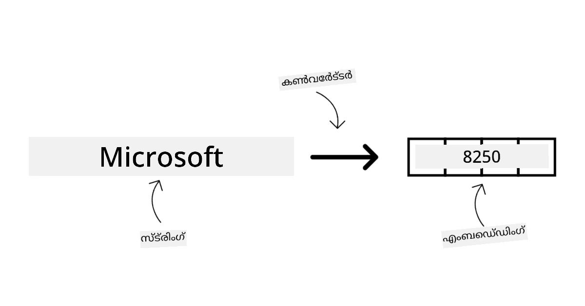

ഇമേജ് ജനറേഷൻ മോഡലുകൾ ചിത്രങ്ങൾ സൃഷ്ടിക്കുന്നവയാണ്. ഇവ സാധാരണയായി ഇമേജ് എഡിറ്റിംഗ്, ഇമേജ് സിന്തസിസ്, ഇമേജ് ട്രാൻസ്ലേഷൻ എന്നിവയ്ക്ക് ഉപയോഗിക്കുന്നു. ഇമേജ് ജനറേഷൻ മോഡലുകൾ വലിയ ഇമേജ് ഡാറ്റാസെറ്റുകളിൽ പരിശീലിപ്പിക്കപ്പെടുന്നു, ഉദാഹരണത്തിന് [LAION-5B](https://laion.ai/blog/laion-5b/?WT.mc_id=academic-105485-koreyst), പുതിയ ചിത്രങ്ങൾ സൃഷ്ടിക്കാനും നിലവിലുള്ള ചിത്രങ്ങൾ ഇൻപെയിന്റിംഗ്, സൂപ്പർ-റിസൊല്യൂഷൻ, കളറൈസേഷൻ സാങ്കേതികവിദ്യകൾ ഉപയോഗിച്ച് എഡിറ്റ് ചെയ്യാനും കഴിയും. ഉദാഹരണങ്ങൾ: [DALL-E-3](https://openai.com/dall-e-3?WT.mc_id=academic-105485-koreyst), [Stable Diffusion മോഡലുകൾ](https://github.com/Stability-AI/StableDiffusion?WT.mc_id=academic-105485-koreyst).

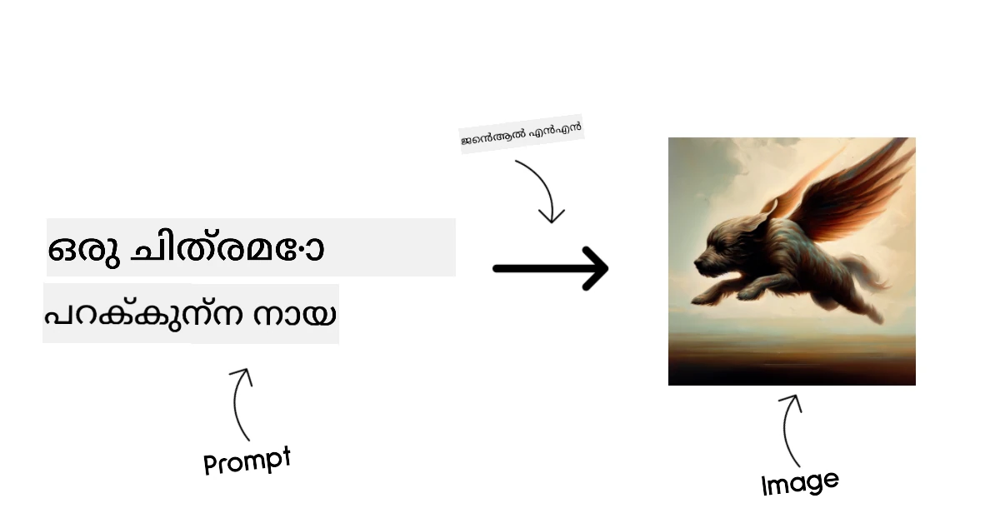

ടെക്സ്റ്റ് & കോഡ് ജനറേഷൻ മോഡലുകൾ ടെക്സ്റ്റ് അല്ലെങ്കിൽ കോഡ് സൃഷ്ടിക്കുന്നവയാണ്. ഇവ സാധാരണയായി ടെക്സ്റ്റ് സംഗ്രഹം, വിവർത്തനം, ചോദ്യോത്തരങ്ങൾ എന്നിവയ്ക്ക് ഉപയോഗിക്കുന്നു. ടെക്സ്റ്റ് ജനറേഷൻ മോഡലുകൾ വലിയ ടെക്സ്റ്റ് ഡാറ്റാസെറ്റുകളിൽ പരിശീലിപ്പിക്കപ്പെടുന്നു, ഉദാഹരണത്തിന് [BookCorpus](https://www.cv-foundation.org/openaccess/content_iccv_2015/html/Zhu_Aligning_Books_and_ICCV_2015_paper.html?WT.mc_id=academic-105485-koreyst), പുതിയ ടെക്സ്റ്റ് സൃഷ്ടിക്കാനും ചോദ്യങ്ങൾക്ക് ഉത്തരം നൽകാനും കഴിയും. കോഡ് ജനറേഷൻ മോഡലുകൾ, ഉദാഹരണത്തിന് [CodeParrot](https://huggingface.co/codeparrot?WT.mc_id=academic-105485-koreyst), വലിയ കോഡ് ഡാറ്റാസെറ്റുകളിൽ പരിശീലിപ്പിക്കപ്പെടുന്നു, ഉദാഹരണത്തിന് GitHub, പുതിയ കോഡ് സൃഷ്ടിക്കാനും നിലവിലുള്ള കോഡിലെ പിശകുകൾ പരിഹരിക്കാനും കഴിയും.

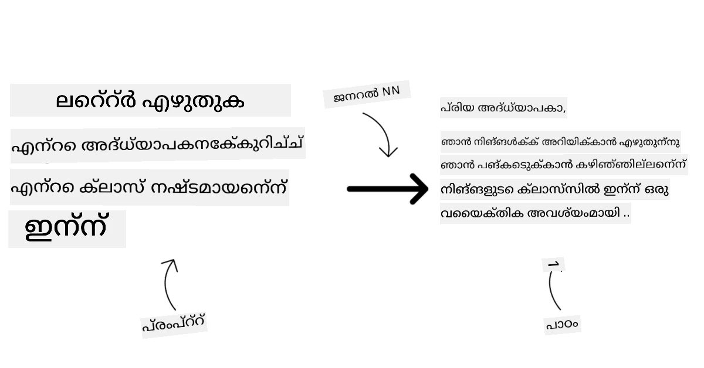

### എൻകോഡർ-ഡികോഡർ vs ഡികോഡർ മാത്രം

LLM-കളുടെ വ്യത്യസ്ത ആർക്കിടെക്ചറുകൾക്കായി ഒരു ഉപമ ഉപയോഗിക്കാം.

നിങ്ങളുടെ മാനേജർ വിദ്യാർത്ഥികൾക്കായി ഒരു ക്വിസ് എഴുതാൻ നിങ്ങൾക്ക് ഒരു ജോലി നൽകി എന്ന് കരുതുക. നിങ്ങൾക്ക് രണ്ട് സഹപ്രവർത്തകർ ഉണ്ട്; ഒരാൾ ഉള്ളടക്കം സൃഷ്ടിക്കുന്നു, മറ്റൊരാൾ അവ പരിശോധിക്കുന്നു.

ഉള്ളടക്കം സൃഷ്ടിക്കുന്നവൻ ഡികോഡർ മാത്രം മോഡലിനെപ്പോലെ ആണ്, അവർ വിഷയം നോക്കി നിങ്ങൾ എഴുതിയതും കാണുകയും അതിന്റെ അടിസ്ഥാനത്തിൽ കോഴ്സ് എഴുതുകയും ചെയ്യുന്നു. അവർ ആകർഷകവും വിവരപ്രദവുമായ ഉള്ളടക്കം എഴുതുന്നതിൽ നല്ലവരാണ്, പക്ഷേ വിഷയം മനസ്സിലാക്കാനും പഠന ലക്ഷ്യങ്ങൾ മനസ്സിലാക്കാനും അവർ നല്ലതല്ല. ഡികോഡർ മോഡലുകളുടെ ഉദാഹരണങ്ങൾ GPT കുടുംബ മോഡലുകൾ, ഉദാഹരണത്തിന് GPT-3.

പരിശോധന നടത്തുന്നത് എൻകോഡർ മാത്രം മോഡലിനെപ്പോലെ ആണ്, അവർ എഴുതിയ കോഴ്സും ഉത്തരങ്ങളും നോക്കി അവ തമ്മിലുള്ള ബന്ധം മനസ്സിലാക്കുന്നു, പക്ഷേ ഉള്ളടക്കം സൃഷ്ടിക്കാൻ അവർ നല്ലതല്ല. എൻകോഡർ മാത്രം മോഡലിന്റെ ഉദാഹരണം BERT ആണ്.

നാം ഒരാൾക്ക് ക്വിസ് സൃഷ്ടിക്കുകയും പരിശോധിക്കുകയും ചെയ്യാൻ കഴിയും എന്ന് കരുതുക, ഇത് എൻകോഡർ-ഡികോഡർ മോഡലാണ്. ഉദാഹരണങ്ങൾ BART, T5.

### സർവീസ് vs മോഡൽ

ഇപ്പോൾ, സർവീസും മോഡലും തമ്മിലുള്ള വ്യത്യാസം നോക്കാം. സർവീസ് ഒരു ക്ലൗഡ് സർവീസ് പ്രൊവൈഡർ നൽകുന്ന ഉൽപ്പന്നമാണ്, സാധാരണയായി മോഡലുകൾ, ഡാറ്റ, മറ്റ് ഘടകങ്ങളുടെ സംയോജനം. മോഡൽ സർവീസിന്റെ മുഖ്യ ഘടകമാണ്, സാധാരണയായി ഒരു ഫൗണ്ടേഷൻ മോഡൽ, ഉദാഹരണത്തിന് LLM.

സർവീസുകൾ സാധാരണയായി പ്രൊഡക്ഷൻ ഉപയോഗത്തിന് ഒപ്റ്റിമൈസ് ചെയ്തവയാണ്, മോഡലുകളേക്കാൾ ഉപയോഗിക്കാൻ എളുപ്പമാണ്, ഗ്രാഫിക്കൽ യൂസർ ഇന്റർഫേസ് വഴി. എന്നാൽ, സർവീസുകൾ എല്ലായ്പ്പോഴും സൗജന്യമല്ല, ഉപയോഗത്തിന് സബ്സ്ക്രിപ്ഷൻ അല്ലെങ്കിൽ പണമടയ്ക്കൽ ആവശ്യമായിരിക്കാം, സർവീസ് ഉടമയുടെ ഉപകരണങ്ങളും വിഭവങ്ങളും ഉപയോഗിച്ച് ചെലവുകൾ കുറയ്ക്കാനും സ്കെയിൽ ചെയ്യാനും സഹായിക്കുന്നു. ഒരു സർവീസിന്റെ ഉദാഹരണം [Azure OpenAI Service](https://learn.microsoft.com/azure/ai-services/openai/overview?WT.mc_id=academic-105485-koreyst) ആണ്, ഇത് ഉപയോഗം അനുസരിച്ച് പണം അടയ്ക്കുന്ന നിരക്കിൽ സേവനം നൽകുന്നു. കൂടാതെ, Azure OpenAI Service മോഡലുകളുടെ കഴിവുകൾക്കു മുകളിൽ എന്റർപ്രൈസ്-ഗ്രേഡ് സുരക്ഷയും ഉത്തരവാദിത്വമുള്ള AI ഫ്രെയിംവർക്കും നൽകുന്നു.

മോഡലുകൾ വെറും ന്യൂറൽ നെറ്റ്‌വർക്ക് ആണ്, പാരാമീറ്ററുകൾ, വെയ്റ്റുകൾ എന്നിവയോടുകൂടി. കമ്പനികൾക്ക് ഇത് ലോക്കലായി ഓടിക്കാൻ അനുവദിക്കുന്നു, എന്നാൽ ഉപകരണങ്ങൾ വാങ്ങണം, സ്കെയിലിംഗ് ഘടന നിർമ്മിക്കണം, ലൈസൻസ് വാങ്ങണം അല്ലെങ്കിൽ ഓപ്പൺ സോഴ്‌സ് മോഡൽ ഉപയോഗിക്കണം. LLaMA പോലുള്ള മോഡൽ ഉപയോഗിക്കാൻ ലഭ്യമാണ്, മോഡൽ ഓടിക്കാൻ കംപ്യൂട്ടേഷണൽ ശക്തി ആവശ്യമാണ്.

## Azure-യിൽ വ്യത്യസ്ത മോഡലുകൾ പരീക്ഷിച്ച് പ്രകടനം മനസ്സിലാക്കാൻ എങ്ങനെ പുനരാവർത്തിക്കാം

നമ്മുടെ ടീം നിലവിലെ LLM രംഗം അന്വേഷിച്ച് അവരുടെ സാഹചര്യങ്ങൾക്ക് അനുയോജ്യമായ ചില മോഡലുകൾ കണ്ടെത്തിയ ശേഷം, അടുത്ത ഘട്ടം അവ അവരുടെ ഡാറ്റയിലും വർക്ക്‌ലോഡിലും പരീക്ഷിക്കുകയാണ്. ഇത് പരീക്ഷണങ്ങളും അളവുകളും വഴി നടത്തുന്ന പുനരാവർത്തന പ്രക്രിയയാണ്.
മുൻപത്തെ പാരഗ്രാഫുകളിൽ ഞങ്ങൾ പരാമർശിച്ച മിക്ക മോഡലുകളും (OpenAI മോഡലുകൾ, Llama2 പോലുള്ള ഓപ്പൺ സോഴ്‌സ് മോഡലുകൾ, Hugging Face ട്രാൻസ്ഫോർമറുകൾ) [Azure AI Studio](https://ai.azure.com/?WT.mc_id=academic-105485-koreyst)യിലെ [Model Catalog](https://learn.microsoft.com/azure/ai-studio/how-to/model-catalog-overview?WT.mc_id=academic-105485-koreyst)ൽ ലഭ്യമാണ്.

[Azure AI Studio](https://learn.microsoft.com/azure/ai-studio/what-is-ai-studio?WT.mc_id=academic-105485-koreyst) ഒരു ക്ലൗഡ് പ്ലാറ്റ്ഫോമാണ്, ഡെവലപ്പർമാർക്ക് ജനറേറ്റീവ് AI ആപ്ലിക്കേഷനുകൾ നിർമ്മിക്കാനും പരീക്ഷണത്തിൽ നിന്ന് മൂല്യനിർണയത്തിലേക്ക് മുഴുവൻ വികസന ജീവിതചക്രവും കൈകാര്യം ചെയ്യാനും സഹായിക്കുന്നതിനായി എല്ലാ Azure AI സേവനങ്ങളും ഒരു ഹബ്ബിൽ സംയോജിപ്പിച്ച് സൗകര്യപ്രദമായ GUI-യോടുകൂടി രൂപകൽപ്പന ചെയ്തതാണ്. Azure AI Studioയിലെ മോഡൽ കാറ്റലോഗ് ഉപയോക്താവിന് സാധ്യമാക്കുന്നു:

- കാറ്റലോഗിൽ താൽപ്പര്യമുള്ള ഫൗണ്ടേഷൻ മോഡൽ കണ്ടെത്തുക - പ്രോപ്രൈറ്ററി അല്ലെങ്കിൽ ഓപ്പൺ സോഴ്‌സ്, ടാസ്ക്, ലൈസൻസ്, അല്ലെങ്കിൽ പേരുപ്രകാരം ഫിൽട്ടർ ചെയ്ത്. തിരയൽ മെച്ചപ്പെടുത്താൻ മോഡലുകൾ Azure OpenAI ശേഖരം, Hugging Face ശേഖരം തുടങ്ങിയ ശേഖരങ്ങളായി ക്രമീകരിച്ചിരിക്കുന്നു.

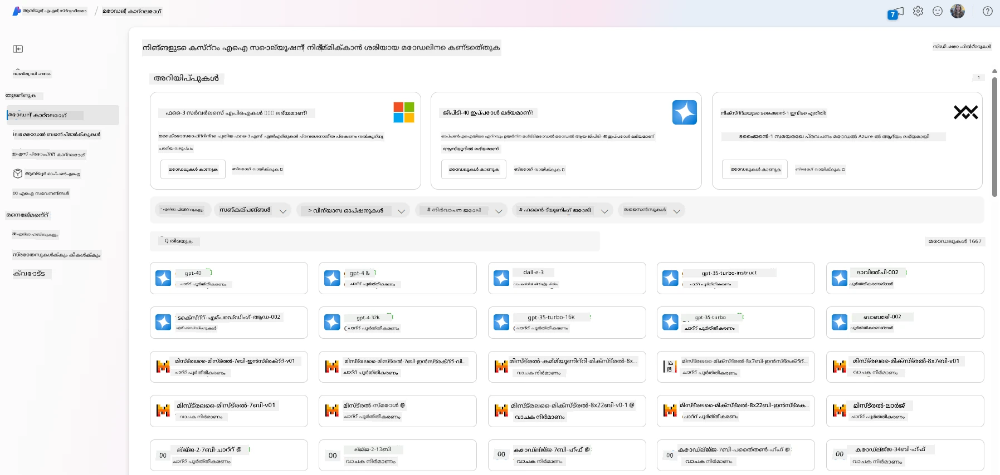

- മോഡൽ കാർഡ് അവലോകനം ചെയ്യുക, ഉദ്ദേശിച്ച ഉപയോഗവും പരിശീലന ഡാറ്റയും ഉൾപ്പെടെയുള്ള വിശദമായ വിവരണം, കോഡ് സാമ്പിളുകളും ആന്തരിക മൂല്യനിർണയ ലൈബ്രറിയിലെ മൂല്യനിർണയ ഫലങ്ങളും ഉൾപ്പെടെ.

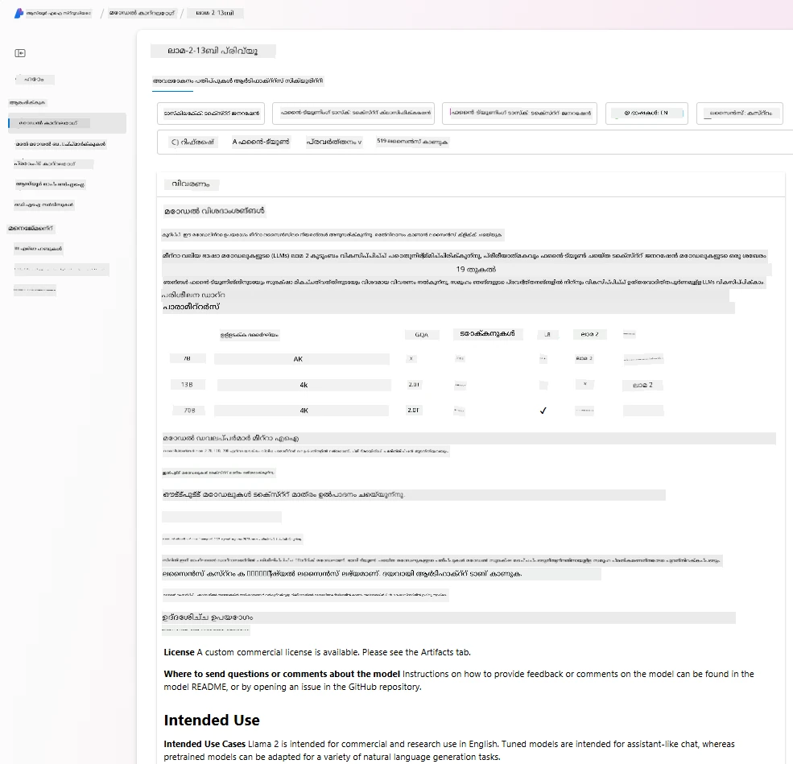

- വ്യവസായത്തിൽ ലഭ്യമായ മോഡലുകളും ഡാറ്റാസെറ്റുകളും തമ്മിലുള്ള ബെഞ്ച്മാർക്കുകൾ താരതമ്യം ചെയ്ത് ഏത് ബിസിനസ് സീനാരിയോയ്ക്ക് അനുയോജ്യമാണ് എന്ന് വിലയിരുത്താൻ [Model Benchmarks](https://learn.microsoft.com/azure/ai-studio/how-to/model-benchmarks?WT.mc_id=academic-105485-koreyst) പെയിൻ ഉപയോഗിക്കുക.

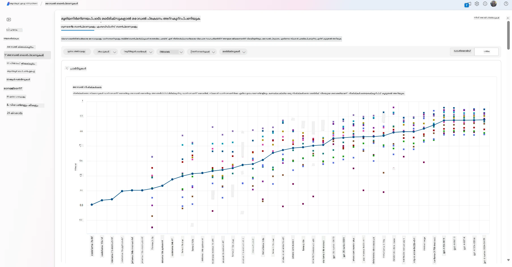

- Azure AI Studioയുടെ പരീക്ഷണവും ട്രാക്കിംഗും ഉപയോഗിച്ച് പ്രത്യേക ജോലിഭാരത്തിൽ മോഡൽ പ്രകടനം മെച്ചപ്പെടുത്താൻ കസ്റ്റം പരിശീലന ഡാറ്റയിൽ മോഡൽ ഫൈൻ-ട്യൂൺ ചെയ്യുക.

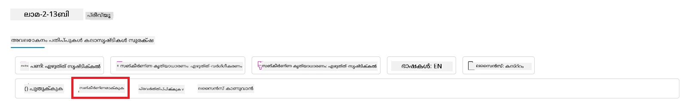

- പ്രാഥമികമായി പരിശീലിപ്പിച്ച മോഡലോ ഫൈൻ-ട്യൂൺ ചെയ്ത പതിപ്പോ റിമോട്ട് റിയൽ ടൈം ഇൻഫറൻസ് - മാനേജ്ഡ് കംപ്യൂട്ട് - അല്ലെങ്കിൽ സർവർലെസ് API എൻഡ്‌പോയിന്റിലേക്ക് - [pay-as-you-go](https://learn.microsoft.com/azure/ai-studio/how-to/model-catalog-overview#model-deployment-managed-compute-and-serverless-api-pay-as-you-go?WT.mc_id=academic-105485-koreyst) - വിന്യസിച്ച് ആപ്ലിക്കേഷനുകൾക്ക് ഉപയോഗിക്കാൻ സാധ്യമാക്കുക.

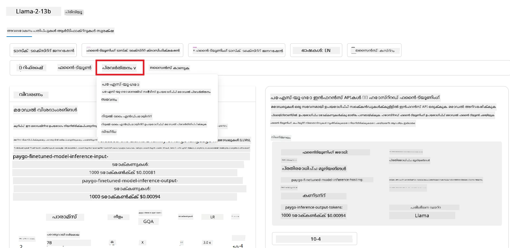

> [!NOTE]
> കാറ്റലോഗിലുള്ള എല്ലാ മോഡലുകളും ഇപ്പോൾ ഫൈൻ-ട്യൂണിംഗിനും/അല്ലെങ്കിൽ pay-as-you-go വിന്യാസത്തിനും ലഭ്യമല്ല. മോഡലിന്റെ കഴിവുകളും പരിമിതികളും സംബന്ധിച്ച വിശദാംശങ്ങൾക്കായി മോഡൽ കാർഡ് പരിശോധിക്കുക.

## LLM ഫലങ്ങൾ മെച്ചപ്പെടുത്തൽ

നമ്മുടെ സ്റ്റാർട്ടപ്പ് ടീമുമായി വിവിധ തരത്തിലുള്ള LLM-കൾ പരീക്ഷിച്ചു, Azure Machine Learning എന്ന ക്ലൗഡ് പ്ലാറ്റ്ഫോം ഉപയോഗിച്ച് വ്യത്യസ്ത മോഡലുകൾ താരതമ്യം ചെയ്യാനും, ടെസ്റ്റ് ഡാറ്റയിൽ അവ മൂല്യനിർണയിക്കാനും, പ്രകടനം മെച്ചപ്പെടുത്താനും, ഇൻഫറൻസ് എൻഡ്‌പോയിന്റുകളിൽ വിന്യസിക്കാനും സാധിച്ചു.

എപ്പോൾ അവർ പ്രീ-ട്രെയിൻ ചെയ്ത മോഡലിനേക്കാൾ ഫൈൻ-ട്യൂണിംഗ് ചെയ്യേണ്ടതുണ്ടെന്ന് പരിഗണിക്കണം? പ്രത്യേക ജോലിഭാരങ്ങളിൽ മോഡൽ പ്രകടനം മെച്ചപ്പെടുത്താൻ മറ്റ് സമീപനങ്ങളുണ്ടോ?

ഒരു ബിസിനസ്സ് ആവശ്യമായ ഫലങ്ങൾ LLM-ൽ നിന്ന് നേടാൻ ഉപയോഗിക്കാവുന്ന നിരവധി സമീപനങ്ങളുണ്ട്. LLM പ്രൊഡക്ഷനിൽ വിന്യസിക്കുമ്പോൾ വ്യത്യസ്ത പരിശീലന ഡിഗ്രികളുള്ള വ്യത്യസ്ത മോഡലുകൾ തിരഞ്ഞെടുക്കാം, വ്യത്യസ്ത സങ്കീർണ്ണത, ചെലവ്, ഗുണമേന്മ എന്നിവയോടെ. ചില വ്യത്യസ്ത സമീപനങ്ങൾ:

- **സന്ദർഭത്തോടെ പ്രോംപ്റ്റ് എഞ്ചിനീയറിംഗ്**. ആവശ്യമായ പ്രതികരണങ്ങൾ ലഭിക്കാൻ പ്രോംപ്റ്റ് നൽകുമ്പോൾ മതിയായ സന്ദർഭം നൽകുക എന്ന ആശയം.

- **Retrieval Augmented Generation, RAG**. നിങ്ങളുടെ ഡാറ്റ ഒരു ഡാറ്റാബേസിലോ വെബ് എൻഡ്‌പോയിന്റിലോ ഉണ്ടായിരിക്കാം, പ്രോംപ്റ്റ് സമയത്ത് ഈ ഡാറ്റ അല്ലെങ്കിൽ അതിന്റെ ഒരു ഉപസമൂഹം ഉൾപ്പെടുത്താൻ, ബന്ധപ്പെട്ട ഡാറ്റ തിരിച്ച് ഉപയോക്താവിന്റെ പ്രോംപ്റ്റിന്റെ ഭാഗമാക്കാം.

- **ഫൈൻ-ട്യൂൺ ചെയ്ത മോഡൽ**. ഇവിടെ, നിങ്ങളുടെ സ്വന്തം ഡാറ്റയിൽ മോഡൽ കൂടുതൽ പരിശീലിപ്പിച്ചിരിക്കുന്നു, അതിനാൽ മോഡൽ കൂടുതൽ കൃത്യവും പ്രതികരണശീലവുമാണ്, പക്ഷേ ചിലവേറിയതായിരിക്കാം.

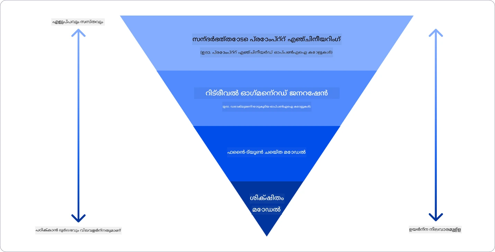

Img source: [Four Ways that Enterprises Deploy LLMs | Fiddler AI Blog](https://www.fiddler.ai/blog/four-ways-that-enterprises-deploy-llms?WT.mc_id=academic-105485-koreyst)

### സന്ദർഭത്തോടെ പ്രോംപ്റ്റ് എഞ്ചിനീയറിംഗ്

പ്രീ-ട്രെയിൻ ചെയ്ത LLM-കൾ പൊതുവായ സ്വാഭാവിക ഭാഷാ ടാസ്കുകളിൽ വളരെ നല്ല പ്രവർത്തനം കാണിക്കുന്നു, ചെറിയ പ്രോംപ്റ്റ് ഉപയോഗിച്ചും, ഉദാഹരണത്തിന് ഒരു വാക്യം പൂർത്തിയാക്കുക അല്ലെങ്കിൽ ഒരു ചോദ്യം –所谓的 “സീറോ-ഷോട്ട്” പഠനം.

എങ്കിലും, ഉപയോക്താവ് അവരുടെ ചോദ്യം വിശദമായി, ഉദാഹരണങ്ങളോടുകൂടി – സന്ദർഭം – രൂപപ്പെടുത്തുമ്പോൾ, ഉത്തരം കൂടുതൽ കൃത്യവും ഉപയോക്താവിന്റെ പ്രതീക്ഷകളോട് അടുത്തതുമായിരിക്കും. ഈ സാഹചര്യത്തിൽ, പ്രോംപ്റ്റിൽ ഒരു ഉദാഹരണം മാത്രമുണ്ടെങ്കിൽ “ഒന്ന്-ഷോട്ട്” പഠനം, പല ഉദാഹരണങ്ങളുണ്ടെങ്കിൽ “ഫ്യൂ ഷോട്ട്” പഠനം എന്ന് പറയുന്നു.
സന്ദർഭത്തോടെ പ്രോംപ്റ്റ് എഞ്ചിനീയറിംഗ് ആരംഭിക്കാൻ ഏറ്റവും ചെലവുകുറഞ്ഞ സമീപനമാണ്.

### Retrieval Augmented Generation (RAG)

LLM-കൾക്ക് അവരുടെ പരിശീലന സമയത്ത് ഉപയോഗിച്ച ഡാറ്റ മാത്രമേ ഉത്തരം സൃഷ്ടിക്കാൻ സാധിക്കൂ. അതായത്, പരിശീലനത്തിന് ശേഷം സംഭവിച്ച വാസ്തവങ്ങളെക്കുറിച്ച് അവയ്ക്ക് അറിയില്ല, സ്വകാര്യ വിവരങ്ങൾ (കമ്പനി ഡാറ്റ പോലുള്ള) ആക്‌സസ് ചെയ്യാനാകില്ല.
ഇത് RAG വഴി മറികടക്കാം, പ്രോംപ്റ്റ് ദൈർഘ്യപരിധികൾ പരിഗണിച്ച്, പ്രോംപ്റ്റ് പുറമേ ഡോക്യുമെന്റ് ചങ്കുകളായി ബാഹ്യ ഡാറ്റ ചേർക്കുന്ന സാങ്കേതിക വിദ്യ. ഇത് [Azure Vector Search](https://learn.microsoft.com/azure/search/vector-search-overview?WT.mc_id=academic-105485-koreyst) പോലുള്ള വെക്ടർ ഡാറ്റാബേസ് ഉപകരണങ്ങൾ പിന്തുണയ്ക്കുന്നു, വിവിധ മുൻനിശ്ചിത ഡാറ്റാ സ്രോതസ്സുകളിൽ നിന്നുള്ള പ്രയോജനകരമായ ചങ്കുകൾ തിരിച്ച് പ്രോംപ്റ്റ് സന്ദർഭത്തിലേക്ക് ചേർക്കുന്നു.

ഒരു ബിസിനസ്സ് ഫൈൻ-ട്യൂണിംഗിന് വേണ്ടത്ര ഡാറ്റ, സമയം, വിഭവങ്ങൾ ഇല്ലാത്ത പക്ഷം, പ്രത്യേക ജോലിഭാരത്തിൽ പ്രകടനം മെച്ചപ്പെടുത്താനും വാസ്തവം മായ്ച്ചുപോകലും ഹാനികരമായ ഉള്ളടക്കവും കുറയ്ക്കാനും ഈ സാങ്കേതിക വിദ്യ സഹായകരമാണ്.

### ഫൈൻ-ട്യൂൺ ചെയ്ത മോഡൽ

ഫൈൻ-ട്യൂണിംഗ് ഒരു ട്രാൻസ്ഫർ ലേണിംഗ് പ്രക്രിയയാണ്, മോഡലിനെ ഒരു ഡൗൺസ്ട്രീം ടാസ്കിനോ പ്രത്യേക പ്രശ്നം പരിഹരിക്കാനോ ‘അഡാപ്റ്റ്’ ചെയ്യാൻ ഉപയോഗിക്കുന്നു. ഫ്യൂ ഷോട്ട് ലേണിംഗിനും RAG-നും വ്യത്യസ്തമായി, പുതിയ മോഡൽ സൃഷ്ടിക്കപ്പെടുന്നു, അപ്ഡേറ്റുചെയ്ത വെയ്റ്റുകളും ബയാസുകളും ഉൾപ്പെടെ. ഇത് ഒരു ഇൻപുട്ട് (പ്രോംപ്റ്റ്) ഒപ്പം അതിന്റെ അനുബന്ധ ഔട്ട്പുട്ട് (കമ്പ്ലീഷൻ) ഉള്ള പരിശീലന ഉദാഹരണങ്ങളുടെ സെറ്റ് ആവശ്യമാണ്.
ഇത് മുൻഗണനയുള്ള സമീപനമായിരിക്കും, പ്രത്യേകിച്ച്:

- **ഫൈൻ-ട്യൂൺ ചെയ്ത മോഡലുകൾ ഉപയോഗിക്കുന്നത്**. ഒരു ബിസിനസ്സ് ഉയർന്ന പ്രകടന മോഡലുകൾക്കുപകരം ഫൈൻ-ട്യൂൺ ചെയ്ത കുറവ് ശേഷിയുള്ള മോഡലുകൾ (എംബെഡ്ഡിംഗ് മോഡലുകൾ പോലുള്ള) ഉപയോഗിക്കാൻ ആഗ്രഹിക്കുന്നുവെങ്കിൽ, ഇത് ചെലവുകുറഞ്ഞതും വേഗതയേറിയതുമായ പരിഹാരമാണ്.

- **ലാറ്റൻസി പരിഗണിക്കുന്നത്**. ഒരു പ്രത്യേക ഉപയോഗകേസിനായി ലാറ്റൻസി പ്രധാനമാണ്, അതിനാൽ വളരെ നീണ്ട പ്രോംപ്റ്റുകൾ ഉപയോഗിക്കാനാകില്ല, അല്ലെങ്കിൽ മോഡലിൽ നിന്ന് പഠിക്കേണ്ട ഉദാഹരണങ്ങളുടെ എണ്ണം പ്രോംപ്റ്റ് ദൈർഘ്യപരിധിയുമായി പൊരുത്തപ്പെടുന്നില്ല.

- **അപ്ഡേറ്റ് ആയിരിക്കുക**. ഒരു ബിസിനസ്സ് ഉയർന്ന ഗുണമേന്മയുള്ള ഡാറ്റയും ഗ്രൗണ്ട് ട്രൂത്ത് ലേബലുകളും ധാരാളം ഉണ്ട്, ഈ ഡാറ്റ കാലക്രമേണ അപ്ഡേറ്റ് ചെയ്യാനുള്ള വിഭവങ്ങളും ഉണ്ട്.

### പരിശീലിപ്പിച്ച മോഡൽ

LLM-നെ തുടക്കത്തിൽ നിന്ന് പരിശീലിപ്പിക്കുന്നത് ഏറ്റവും പ്രയാസവും സങ്കീർണ്ണവുമായ സമീപനമാണ്, വലിയ തോതിലുള്ള ഡാറ്റ, പ്രാവീണ്യമുള്ള വിഭവങ്ങൾ, അനുയോജ്യമായ കംപ്യൂട്ടേഷണൽ ശക്തി ആവശ്യമാണ്. ഒരു ബിസിനസ്സ് ഡൊമെയ്ൻ-സ്പെസിഫിക് ഉപയോഗകേസ് ഉണ്ട്, ഡൊമെയ്ൻ-കേന്ദ്രിത ഡാറ്റ ധാരാളം ഉള്ള സാഹചര്യത്തിൽ മാത്രമേ ഈ ഓപ്ഷൻ പരിഗണിക്കേണ്ടതുള്ളൂ.

## അറിവ് പരിശോധിക്കൽ

LLM കമ്പ്ലീഷൻ ഫലങ്ങൾ മെച്ചപ്പെടുത്താൻ നല്ല സമീപനം എന്താകാം?

1. സന്ദർഭത്തോടെ പ്രോംപ്റ്റ് എഞ്ചിനീയറിംഗ്  
2. RAG  
3. ഫൈൻ-ട്യൂൺ ചെയ്ത മോഡൽ

ഉത്തരം: 3, സമയം, വിഭവങ്ങൾ, ഉയർന്ന ഗുണമേന്മയുള്ള ഡാറ്റ ഉണ്ടെങ്കിൽ, അപ്ഡേറ്റ് ആയിരിക്കാൻ ഫൈൻ-ട്യൂണിംഗ് മികച്ച ഓപ്ഷനാണ്. എന്നാൽ മെച്ചപ്പെടുത്താൻ ശ്രമിക്കുമ്പോൾ സമയക്കുറവ് ഉണ്ടെങ്കിൽ ആദ്യം RAG പരിഗണിക്കുന്നത് ഉചിതമാണ്.

## 🚀 ചലഞ്ച്

നിങ്ങളുടെ ബിസിനസ്സ് വേണ്ടി [RAG ഉപയോഗിക്കുന്നതിനെക്കുറിച്ച്](https://learn.microsoft.com/azure/search/retrieval-augmented-generation-overview?WT.mc_id=academic-105485-koreyst) കൂടുതൽ വായിക്കുക.

## മികച്ച ജോലി, നിങ്ങളുടെ പഠനം തുടരുക

ഈ പാഠം പൂർത്തിയാക്കിയ ശേഷം, നമ്മുടെ [Generative AI Learning collection](https://aka.ms/genai-collection?WT.mc_id=academic-105485-koreyst) പരിശോധിച്ച് നിങ്ങളുടെ ജനറേറ്റീവ് AI അറിവ് ഉയർത്തുക!

പാഠം 3-ലേക്ക് പോകൂ, അവിടെ നാം [ജെനറേറ്റീവ് AI ഉത്തരവാദിത്വത്തോടെ എങ്ങനെ നിർമ്മിക്കാമെന്ന്](../03-using-generative-ai-responsibly/README.md?WT.mc_id=academic-105485-koreyst) നോക്കാം!

---

<!-- CO-OP TRANSLATOR DISCLAIMER START -->
**അസൂയാ**:  
ഈ രേഖ AI വിവർത്തന സേവനം [Co-op Translator](https://github.com/Azure/co-op-translator) ഉപയോഗിച്ച് വിവർത്തനം ചെയ്തതാണ്. നാം കൃത്യതയ്ക്ക് ശ്രമിച്ചിട്ടുണ്ടെങ്കിലും, സ്വയം പ്രവർത്തിക്കുന്ന വിവർത്തനങ്ങളിൽ പിശകുകൾ അല്ലെങ്കിൽ തെറ്റുകൾ ഉണ്ടാകാമെന്ന് ദയവായി ശ്രദ്ധിക്കുക. അതിന്റെ മാതൃഭാഷയിലുള്ള യഥാർത്ഥ രേഖയാണ് പ്രാമാണികമായ ഉറവിടം എന്ന് പരിഗണിക്കേണ്ടതാണ്. നിർണായകമായ വിവരങ്ങൾക്ക്, പ്രൊഫഷണൽ മനുഷ്യ വിവർത്തനം ശുപാർശ ചെയ്യപ്പെടുന്നു. ഈ വിവർത്തനം ഉപയോഗിക്കുന്നതിൽ നിന്നുണ്ടാകുന്ന ഏതെങ്കിലും തെറ്റിദ്ധാരണകൾക്കോ തെറ്റായ വ്യാഖ്യാനങ്ങൾക്കോ ഞങ്ങൾ ഉത്തരവാദികളല്ല.
<!-- CO-OP TRANSLATOR DISCLAIMER END -->