# വ്യത്യസ്ത LLM-കളെ പരിശോധിച്ച് താരതമ്യം ചെയ്യൽ

[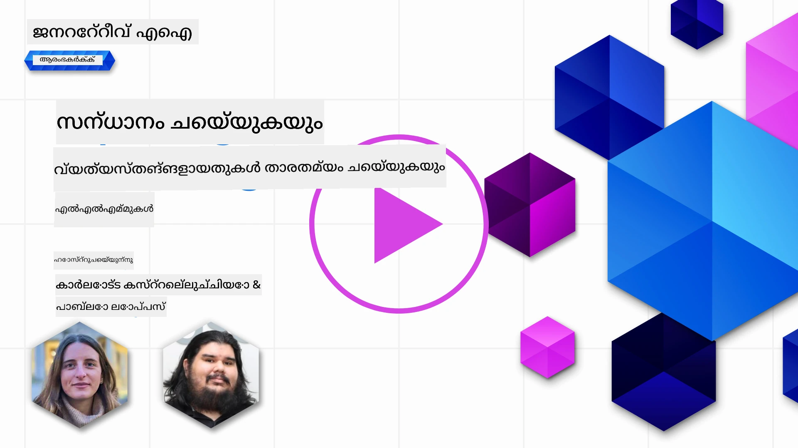](https://youtu.be/KIRUeDKscfI?si=8BHX1zvwzQBn-PlK)

> _ഈ പാഠത്തിന്റെ വീഡിയോ കാണാൻ മുകളിലെ ചിത്രത്തിൽ ക്ലിക് ചെയ്യുക_

മുമ്പത്തെ പാഠത്തിൽ, ജനറേറ്റീവ് എഐ സാങ്കേതിക നിരീക്ഷണത്തിൽ എങ്ങിനെയാണ് മാറ്റം ഉണ്ടാക്കുന്നത്, വലിയ ഭാഷാശാസ്ത്ര മാതൃകകൾ (LLMs) എങ്ങനെ പ്രവർത്തിക്കുന്നു, ഒരു ബിസിനസ്സ് - നമ്മുടെ സ്റ്റാർട്ടപ്പിൻപോലെ - അവയെ എങ്ങനെ ഉപയോഗിച്ച് തന്റെ ഉപയോഗ കേസുകൾക്ക് കണ്ണുണരെ വളരാനാകും എന്നത് കണ്ടു. ഈ അധ്യായത്തിൽ, വ്യത്യസ്ത തരം വലിയ ഭാഷാശാസ്ത്ര മാതൃകകളെ (LLMs) താരതമ്യം ചെയ്ത് അവയുടെ ഗുണങ്ങളെയും ദോഷങ്ങളെയും മനസ്സിലാക്കാൻ ശ്രമിക്കുന്നു.

നമ്മുടെ സ്റ്റാർട്ടപ്പിന്റെ അടുത്ത യാത്രയിലെ ഇനി ഘട്ടം LLM-കളുടെ നിലവിലെ നിലപാട് പരിശോധിച്ച് എങ്ങനെയാണ് നമ്മുടെ ഉപയോഗത്തിനുള്ളവ അനുയോജ്യം എന്ന കാര്യത്തിൽ ബോധ്യപ്പെടുന്നതാണ്.

## പരിചയം

ഈ പാഠത്തിൽ ഉൾപ്പെടുന്നത്:

- നിലവിലെ നിലപാടിലുള്ള വ്യത്യസ്ത LLM-കൾ.
- Azure-ൽ നിങ്ങളുടെ ഉപയോഗത്തിനായി വ്യത്യസ്ത മോഡലുകൾ പരീക്ഷിക്കുക, പുനരാവർത്തനം ചെയ്യുക, താരതമ്യം ചെയ്യുക.
- എങ്ങനെ ഒരു LLM വിന്യസിപ്പിക്കാമെന്നത്.

## പഠന ലക്ഷ്യങ്ങൾ

ഈ പാഠം പൂർത്തിയാക്കിയ ശേഷം, നിങ്ങൾക്ക് സാധിക്കുന്നതെന്തെന്നാൽ:

- നിങ്ങളുടെ ഉപയോഗ സാഹചര്യത്തിന് അനുയോജ്യമായ മോഡൽ തിരഞ്ഞെടുക്കുക.
- മോഡലിന്റെ പ്രകടനം പരിശോധന, പുനരാവർത്തനം, മെച്ചപ്പെടുത്തലുകൾ എങ്ങനെ നടത്താമെന്ന് മനസ്സിലാക്കുക.
- ബിസിനസ്സുകൾ മോഡലുകൾ എങ്ങനെ വിന്യസിക്കുന്നു എന്ന് അറിയുക.

## വ്യത്യസ്ത തരത്തിലുള്ള LLM-കളെ മനസിലാക്കുക

അവയുടെ വാസ്തുവിദ്യ, പരിശീലന ഡാറ്റ, ഉപയോഗ സാഹചര്യത്തിന്റെ അടിസ്ഥാനത്തിൽ LLM-കൾ പല വിഭാഗങ്ങളിലേക്കായി വേർതിരിക്കാൻ കഴിയും. ഈ വ്യത്യാസങ്ങൾ മനസ്സിലാക്കുന്നത് നമ്മുടെ സ്റ്റാർട്ടപ്പിന് ശരിയായ മോഡൽ തിരഞ്ഞെടുക്കാനും, പ്രകടന പരിശോധന, പുനരാവൃത്തികൾ വഴി മെച്ചപ്പെടുത്തലുകൾ എങ്ങനെ നടത്താമെന്നും മനസ്സിലാക്കാനുമാകും.

LLM മോഡലുകളുടെ പല തരം ഉണ്ടായിരുന്നു, നിങ്ങൾ തിരഞ്ഞെടുക്കുന്ന മോഡൽ എന്തിന് ഉപയോഗിക്കാമെന്ന്, നിങ്ങളുടെ ഡാറ്റ, നിങ്ങൾ ചെലവഴിക്കാൻ തയ്യാറുള്ളതും ഇതിൽ ആശ്രയിച്ചിരിക്കുന്നു.

നിങ്ങൾ മോഡലുകൾ വാചകം, ഓഡിയോ, വീഡിയോ, ചിത്രം സൃഷ്ടിക്ക് ഉപയോഗിക്കാൻ ഉദ്ദേശിക്കുന്നുവെങ്കിൽ, നിങ്ങൾക്ക് വേർതിരിഞ്ഞ രൂപത്തിലുള്ള മോഡൽ തിരഞ്ഞെടുക്കേണ്ടതാവും.

- **ഓഡിയോയും സ്പീച്ച് തിരിച്ചറിയലും**. വിസ്പര്‍ രീതിയിലുള്ള മോഡലുകൾ ഇപ്പോഴും പൊതുവായ സ്പീച്ച് തിരിച്ചറിയലിനുള്ള മോഡലുകളാണ്, എന്നാൽ ഔദ്യോഗിക തിരഞ്ഞെടുക്കലിൽ ഇപ്പോൾ പുതിയ സ്പീച്ച്-ടു-ടെക്സ്റ്റ് മോഡലുകൾ പോലുള്ള `gpt-4o-transcribe`, `gpt-4o-mini-transcribe`, ഡയരൈസേഷൻ വേരിയൻറുകൾ ഉൾപ്പെട്ടിരിക്കുന്നു. ഭാഷാ പരിധി, ഡയരൈസേഷൻ, റിയൽ-ടൈം സഹായം, ലാറ്റൻസി, ചിലവ് എന്നിവ നിങ്ങളുടെ സാഹചര്യത്തിന് അനുയോജ്യമാണെന്ന് പരിശോധിക്കുക. കൂടുതൽ അറിയാൻ [OpenAI സ്പീച്ച്-ടു-ടെക്സ്റ്റ് ഡോക്യുമെന്റേഷൻ](https://platform.openai.com/docs/guides/speech-to-text?WT.mc_id=academic-105485-koreyst) വായിക്കാം.

- **ചിത്ര സൃഷ്ടി**. ഡാൽ-ഇയും മിഡ്ജേണിയും പ്രശസ്തമായ ചിത്ര സൃഷ്ടി ഓപ്ഷനുകളാണ്, എന്നാൽ നിലവിലെ OpenAI ഇമേജ് API-കൾ `gpt-image-2` പോലുള്ള GPT ഇമേജ് മോഡലുകളെ കേന്ദ്രീകരിക്കുന്നു, സ്റ്റേബിൾ ഡിഫ്യൂഷൻ, ഇമേജൻ, ഫ്‌ലക്‌സ് തുടങ്ങിയ മറ്റ് മോഡൽ കുടുംബങ്ങളും പതിവായി തിരഞ്ഞെടുക്കപ്പെടുന്നു. പ്രാമ്പ്റ്റ് പാലനവും എഡിറ്റിംഗ് പിന്തുണയും സ്റ്റൈൽ നിയന്ത്രണവും സുരക്ഷാ ആവശ്യകതകളും ലൈസൻസിങ്ങും താരതമ്യം ചെയ്യുക. കൂടുതൽ അറിയാൻ [OpenAI ഇമേജ് സൃഷ്ടി ഗൈഡ്](https://platform.openai.com/docs/guides/images?WT.mc_id=academic-105485-koreyst) കൂടാതെ ഈ പാഠ്യപദ്ധതിയുടെ അദ്ധ്യായം 9 കാണുക.

- **വാചക സൃഷ്ടി**. വാചക മോഡലുകൾ ഇപ്പോൾ ഫ്രണ്ടിയർ മോഡലുകളാകുകയും, യുക്തിപരമായ മോഡലുകളും ചെറുതും കുറഞ്ഞ ലാറ്റൻസി ഉള്ള മോഡലുകളും തുറന്നഭാരം മോഡലുകളും ഉൾക്കൊള്ളുന്നു. നിലവിലെ ഉദാഹരണങ്ങളിൽ OpenAI GPT-5.x മോഡലുകൾ, ആൻത്രോപ്പിക് ക്ലോഡ് 4.x മോഡലുകൾ, ഗൂഗിൾ ജെമിനി 3.x മോഡലുകൾ, മെട ടിപ്പ്ളാമ 4 മോഡലുകൾ, മിസ്ട്രാൽ മോഡലുകൾ ഉൾപ്പെടുന്നു. റിലീസ് തീയതി അല്ലെങ്കിൽ വില മാത്രം അടിസ്ഥാനമാക്കിയുള്ള തിരഞ്ഞെടുപ്പ് ചെയ്യരുത്; കടമയുടെ ഗുണമേന്മ, ലാറ്റൻസി, കോൺറ്റെക്‌സ്‌റ്റ് വിൻഡോ, ഉപകരണം ഉപയോഗം, സുരക്ഷാ പെരുമാറ്റം, പ്രാദേശിക ലഭ്യത, മൊത്തം ചിലവ് എന്നിവ താരതമ്യം ചെയ്യുക. [Microsoft Foundry മോഡൽ കാറ്റലോഗ്](https://ai.azure.com/catalog?WT.mc_id=academic-105485-koreyst) Azure-ൽ ലഭ്യമായ മോഡലുകൾ താരതമ്യം ചെയ്യാനുള്ള നല്ല സ്ഥലം ആണ്.

- **മൾട്ടി-മൊഡാലിറ്റി**. ഇപ്പോഴുള്ള പല മോഡലുകളും വാചകം മാത്രമേ അല്ല, ചിത്രങ്ങൾ, ഓഡിയോ, വീഡിയോ എന്നിവയും പ്രോസസ് ചെയ്യാൻ കഴിയും; ചിലത് ടൂൾ‌കൾ വിളിക്കാനും കഴിയും; ചില പ്രത്യേക മോഡലുകൾ ചിത്രങ്ങൾ, ഓഡിയോ, വീഡിയോ സൃഷ്ടിക്കാനും കഴിയും. ഉദാഹരണത്തിന്, നിലവിലെ OpenAI മോഡലുകൾ വാചകവും ചിത്രവും ഇൻപുട്ടായി സ്വീകരിക്കാറുണ്ട്, ജെമിനി മോഡലുകൾ വേരിയൻറിൻറെ അടിസ്ഥാനത്തിൽ വാചകം, കോഡ്, ചിത്രം, ഓഡിയോ, വീഡിയോ എന്നിവ സ്വീകരിക്കാം, Llama 4 Scout, Maverick എന്നിവ ഓപ്പൺ-വെയിറ്റ് പ്രാകൃതമോഡൽ മൾട്ടിമോഡൽ മോഡലുകളാണ്. വർക്ക്ഫ്ലോ നിർമ്മിക്കുന്നതിന് മുമ്പ് ഓരോ മോഡൽ കാർഡും പിന്തുണയ്ക്കുന്ന ഇൻപുട്ട്, ഔട്ട്‌പുട്ട് രീതികൾ പരിശോധിക്കുക.

മോഡൽ തിരഞ്ഞെടുക്കുന്നത് ചില അടിസ്ഥാന കഴിവുകൾ ലഭിക്കുന്നതാണ്, പക്ഷേ അത് മുഴുവനായിരിക്കണമെന്നില്ല. പലപ്പോഴും കമ്പനി പ്രത്യേക ഡാറ്റ LLM-ന് അറിയിക്കേണ്ടി വരും. അതിനുള്ള ചിലവ്യത്യസ്ത മാർഗ്ഗങ്ങൾ ഉണ്ട്, അവ അടുത്ത ഭാഗങ്ങളിൽ വിശദീകരിക്കും.

### ഫൗണ്ടേഷൻ മോഡലുകളും LLM-കളുമെതിരെ

ഫൗണ്ടേഷൻ മോഡൽ എന്ന പദം സ്റ്റാൻഫോർഡ് ഗവേഷകർ [സംവദിച്ചു](https://arxiv.org/abs/2108.07258?WT.mc_id=academic-105485-koreyst) സംവരണ നിലകൾ പാലിക്കുന്ന എഐ മോഡലായി നിർവചിച്ചിരിക്കുന്നു, ഉദാഹരണത്തിന്:

- **അവ അതിന്‍റെ പരിശീലനത്തിൽ അസൂപ്പർവൈസ്ഡ് അല്ലെങ്കിൽ സ്വയം-അസൂപ്പർവൈസ്ഡ് പഠനം ഉപയോഗിക്കുന്നു**, അർത്ഥം അവ ലേബൽ ചെയ്യപ്പെട്ട മൾട്ടി-മോഡൽ ഡാറ്റയിൽ പരിശീലനം നേടുന്നുവും, മനുഷ്യൻ ഡാറ്റ ലേബലിങ്ങ് ആവശ്യമില്ല.
- **അവ വളരെ വലിയ മോഡലുകളാണ്**, ബില്യൺസ് ഓഫ് പാരാമീറ്ററുകൾ ഉള്ള ആഴത്തിലുള്ള ന്യൂറൽ നെറ്റ് വർക്കുകളിൽ അടിസ്ഥാനമാക്കിയുള്ളതാണ്.
- **അവ മറ്റു മോഡലുകൾക്ക് ‘അടിസ്ഥാനമായ നില’യാക്കാനാണ് ഉദ്ദേശിച്ചിരിക്കുന്നത്**, അതായത്, ഫൈൻ-ട്യൂണിംഗ് വഴി മറ്റ് മോഡലുകൾ നിർമ്മിക്കാൻ ഇവ തുടക്കായി ഉപയോഗിക്കാം.

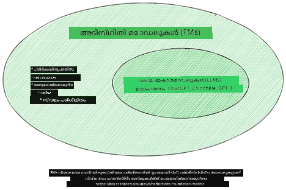

ചിത്രം ഉറവിടം: [Essential Guide to Foundation Models and Large Language Models | by Babar M Bhatti | Medium
](https://thebabar.medium.com/essential-guide-to-foundation-models-and-large-language-models-27dab58f7404)

ഈ വ്യത്യാസം കൂടുതൽ വ്യക്തമാക്കാൻ, ചരിത്രപരമായ ഉദാഹരണമായി ChatGPT എടുത്തു നോക്കാം. ChatGPT-യുടെ ആദിയിലെ പതിപ്പുകൾ GPT-3.5-നെ ഫൗണ്ടേഷൻ മോഡലായി ഉപയോഗിച്ചിരുന്നു. OpenAI പിന്നീട് ചാറ്റ്-സ്പെസിഫിക് ഡാറ്റയും അലൈൻമെന്റ് സാങ്കേതികതകളും ഉപയോഗിച്ച് ചാറ്റുംപ്പോലെ സംഭാഷണ രംഗങ്ങളിൽ മികച്ച പ്രകടനം കാഴ്ചവെക്കുന്ന ഒരു ട്യൂണുചെയ്ത പതിപ്പ് സൃഷ്ടിച്ചു. ആധുനിക എഐ സർവീസുകൾ പല മോഡൽ വേരിയൻറുകൾക്കിടയിൽ മാർഗ്ഗനിർദേശമാക്കാറുണ്ട്, അതിനാൽ സർവീസ് നാമവും അടിസ്ഥാന മോഡൽ നാമവും എല്ലായ്പ്പോഴും ഒരേ തമാശയല്ല.

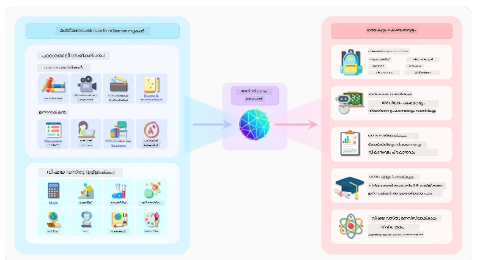

ചിത്രം ഉറവിടം: [2108.07258.pdf (arxiv.org)](https://arxiv.org/pdf/2108.07258.pdf?WT.mc_id=academic-105485-koreyst)

### ഓപ്പൺ-വെയിറ്റ്/ഓപ്പൺ-സോഴ്‌സ് മോഡലുകളും പ്രോപ്രയറ്ററി മോഡലുകളും

LLM-കളെ മറ്റൊരു വിധം വർഗ്ഗീകരിക്കാൻ കഴിയുന്നുണ്ടെന്നും അവ ഓപ്പൺ-വെയിറ്റ്, ഓപ്പൺ-സോഴ്‌സ് അല്ലെങ്കിൽ പ്രോപ്രയറ്ററി ആണോ എന്ന കാര്യത്തിൽ ആശ്രയിച്ചിരിക്കുന്നു.

ഓപ്പൺ-സോഴ്‌സ്, ഓപ്പൺ-വെയിറ്റ് മോഡലുകൾ മോഡൽ ആർട്ടിഫാക്റ്റുകൾ പരിശോധിക്കാനും ഡൗൺലോഡ് ചെയ്യാനും കസ്റ്റമൈസ് ചെയ്യാനുമുള്ള അവസരം നൽകുന്നു, പക്ഷേ അവയുടെ ലൈസൻസുകൾ വ്യത്യസ്തമാണ്. ചിലത് പൂർണ്ണമായി ഓപ്പൺ-സോഴ്‌സ് ആയിരിക്കാം, ചിലത് ഓപ്പൺ-വെയിറ്റ് എന്നാൽ ഉപയോഗ നിബന്ധനകൾ കുറവുള്ളവയാണ്. ബിസിനസ്സ് വിന്യസനത്തിൽ കൂടുതൽ നിയന്ത്രണം, ഡാറ്റയുടെ ലൊക്കലിറ്റി, ചെലവ്, കസ്റ്റമൈസേഷൻ എന്നിവ ആവശ്യമായപ്പോൾ ഇവ ഉപയോഗപ്രദമാണ്. എന്നാൽ ടീമുകൾ വേണം ലൈസൻസിംഗ് നിബന്ധനകൾ, സർവീസ് ചിലവ്, പരിപാലനം, സുരക്ഷാ അപ്ഡേറ്റുകൾ, വിലയിരുത്തൽ ഗുണനിലവാരം എന്നിവ തിരയുക. ഉദാഹരണങ്ങൾക്ക് [Meta Llama 4](https://ai.meta.com/blog/llama-4-multimodal-intelligence/?WT.mc_id=academic-105485-koreyst), ചില [Mistral മോഡലുകൾ](https://docs.mistral.ai/models/overview?WT.mc_id=academic-105485-koreyst), [Hugging Face](https://huggingface.co/models?WT.mc_id=academic-105485-koreyst) യിൽ ഹോസ്റ്റ് ചെയ്ത പല മോഡലുകളും.

പ്രോപ്രയറ്ററി മോഡലുകൾ ഒരു പ്രൊവൈഡർ സ്വന്തമായിട്ടുള്ളവയാണ്. ഇവ സാധാരണ പരിപാലിത ഉത്പാദന ഉപയോഗത്തിനായി അനുയോജ്യമായും ശക്തമായ പിന്തുണ, സുരക്ഷ സിസ്റ്റങ്ങൾ, ഉപകരണം ഇന്റഗ്രേഷൻ, സ്കെയിൽ ചെയ്യും. ഉപഭോക്താക്കൾക്ക് സാധാരണയായി മോഡൽ വെയ്റ്റുകൾ പരിശോധിക്കാനോ തിരുത്താനോ കഴിയാതെ പരിപാലകൻ നിർദ്ദേശിച്ച നിബന്ധനകൾ പ്രൈവസി, ഡാറ്റ സംരക്ഷണം, അനുമതി എന്നിവയ്ക്ക് അനുസരിച്ച് അവലോകനം ചെയ്യണം. ഉദാഹരണങ്ങൾക്ക് [OpenAI മോഡലുകൾ](https://platform.openai.com/docs/models?WT.mc_id=academic-105485-koreyst), [Google Gemini](https://deepmind.google/models/gemini/pro/?WT.mc_id=academic-105485-koreyst), [Anthropic Claude](https://platform.claude.com/docs/en/about-claude/models/overview?WT.mc_id=academic-105485-koreyst).

### എംбеддинг, ചിത്രം സൃഷ്ടി, വാചക-കോഡ് സൃഷ്ടി

LLM-കൾ ഇറക്കുമതി ചെയ്യുന്ന ഔട്ട്‌പുട്ടിന്റെ അടിസ്ഥാനത്തിലുമാണ് വർഗ്ഗീകരിക്കപ്പെടുന്നത്.

എംбедഡിംഗുകൾ എന്നത് ടെക്സ്റ്റ് സംഖ്യാത്മക രൂപാന്തരത്തിലേക്ക് മാറ്റുന്ന മോഡലുകൾ ആണ്, ഇത് ഇൻപുട്ട് ടെക്സ്റ്റിന്റെ സംഖ്യാത്മക പ്രതിനിധാനം ആണ്. എംбедഡ് ചെയ്ത ടെക്സ്റ്റ് അനുബന്ധതകൾ മെഷീനുകൾക്ക് മനസ്സിലാക്കാൻ സഹായിക്കുന്നു, ഇതു മറ്റൊരു മോഡലുകൾക്ക് ഇൻപുട്ടായി ഉപയോഗിക്കാം, പോലുള്ള ക്ലാസിഫിക്കേഷൻ മോഡലുകൾ അല്ലെങ്കിൽ ക്ലസ്റ്ററിംഗ് മോഡലുകൾNumerical ഡേറ്റയിൽ മികച്ച പ്രകടനമുണ്ടാക്കുന്നു. എംбедഡിംഗ് മോഡലുകൾ ട്രാൻസ്ഫർ ലേണിങ്ങിനായി ഉപയോഗിക്കുന്നു, ഉഥ്പന്ന ഡാറ്റ ഉള്ള പകരം ഒരു ടാസ്കിനായി മോഡൽ നിർമ്മിച്ച് പിന്നീട് എംбедഡിംഗ് വെയ്റ്റുകൾ മറ്റു താഴ്ന്ന ടാസ്കുകൾക്കായി പുനരുപയോഗിക്കുന്നു. ഉദാഹരണത്തിന് [OpenAI embeddings](https://platform.openai.com/docs/models/embeddings?WT.mc_id=academic-105485-koreyst) കാണുക.

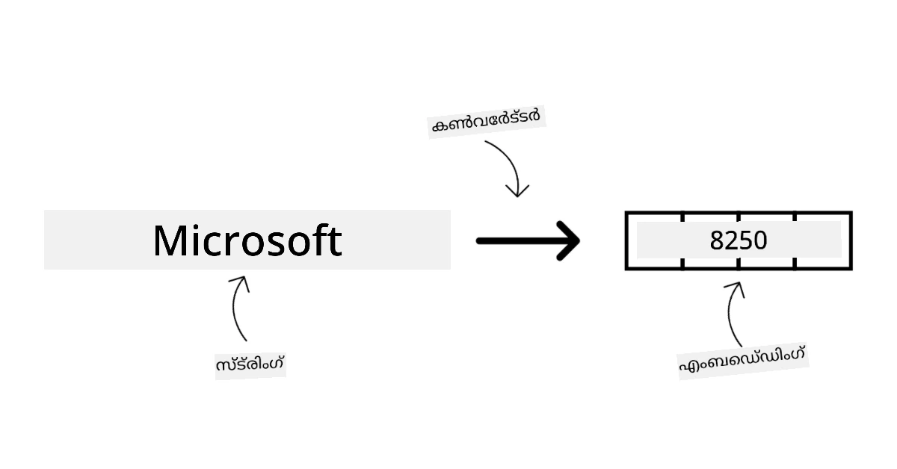

ചിത്രം സൃഷ്ടിക്കുന്ന മോഡലുകൾ ചിത്രങ്ങൾ സൃഷ്ടിക്കുന്ന മോഡലുകളാണ്. ഇവ ചിത്ര എഡിറ്റിംഗ്, ചിത്ര സിന്തസിസ്, ചിത്ര വിവർത്തനം എന്നിവയ്ക്ക് ഉപയോഗിക്കുന്നു. ഈ മോഡലുകൾ വലിയ ചിത്രങ്ങൾ അടങ്ങിയ ഡാറ്റാസെറ്റുകളിൽ പരിശീലിപ്പിക്കപ്പെട്ടിരിക്കുന്നു, ഉദാഹരണത്തിന് [LAION-5B](https://laion.ai/blog/laion-5b/?WT.mc_id=academic-105485-koreyst), പുതിയത് ചിത്രങ്ങൾ സൃഷ്ടിക്കാനോ നിലവിലുള്ള ചിത്രങ്ങൾ inpainting, सुपर-Resolution, colorization തുടങ്ങിയ സാങ്കേതികവിദ്യ ഉപയോഗിച്ച് എഡിറ്റുചെയ്യാനോ ഉപയോഗിക്കാം. ഉദാഹരണങ്ങൾ: [GPT Image മോഡലുകൾ](https://platform.openai.com/docs/guides/images?WT.mc_id=academic-105485-koreyst), [Stable Diffusion മോഡലുകൾ](https://github.com/Stability-AI/StableDiffusion?WT.mc_id=academic-105485-koreyst), Imagen മോഡലുകൾ.

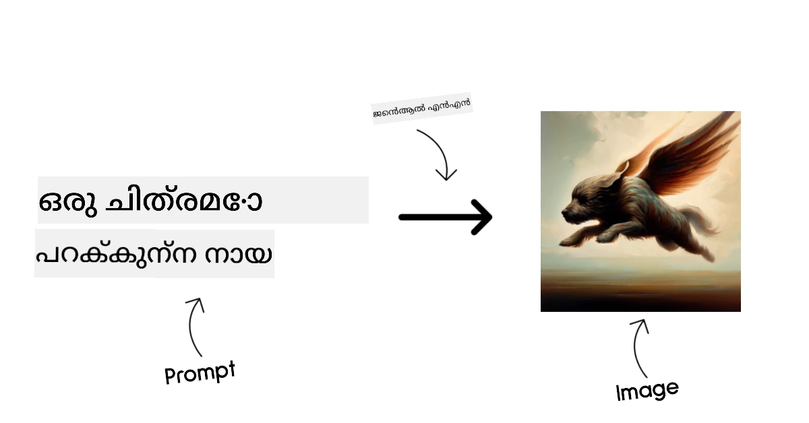

വാചകവും കോഡും സൃഷ്ടിക്കുന്ന മോഡലുകൾ വാചകവും കോഡും സൃഷ്ടിക്കുന്നതിന് ഉപയോഗിക്കുന്നു. വാചക മോഡലുകൾ സാധാരണ വാചക സംക്ഷേപണ, വിവർത്തനം, ചോദ്യം ഉത്തരം എന്നിവയ്ക്ക് പരിശീലിപ്പിച്ചത്. വലിയ വാചക ഡാറ്റാസെറ്റുകളിൽ പരിശീലിപ്പിക്കുന്നു, ഉദാഹരണത്തിനായി [BookCorpus](https://www.cv-foundation.org/openaccess/content_iccv_2015/html/Zhu_Aligning_Books_and_ICCV_2015_paper.html?WT.mc_id=academic-105485-koreyst) പുതിയ വാചകം സൃഷ്ടിക്കാനും ചോദ്യങ്ങൾക്ക് ഉത്തരം നൽകാനും കഴിയും. കോഡ് സൃഷ്ടി മോഡലുകൾ, ഉദാഹരണത്തിന് [CodeParrot](https://huggingface.co/codeparrot?WT.mc_id=academic-105485-koreyst), വലിയ കോഡ് ഡാറ്റാസെറ്റുകളിൽ പരിശീലിപ്പിച്ചിരിക്കുന്നവ, ഉദാഹരണത്തിന് GitHub. പുതിയത് കോഡ് സൃഷ്ടിക്കാനും നിലവിലുള്ള കോഡിലെ പിശകുകൾ പരിഹരിക്കാനുമാകും.

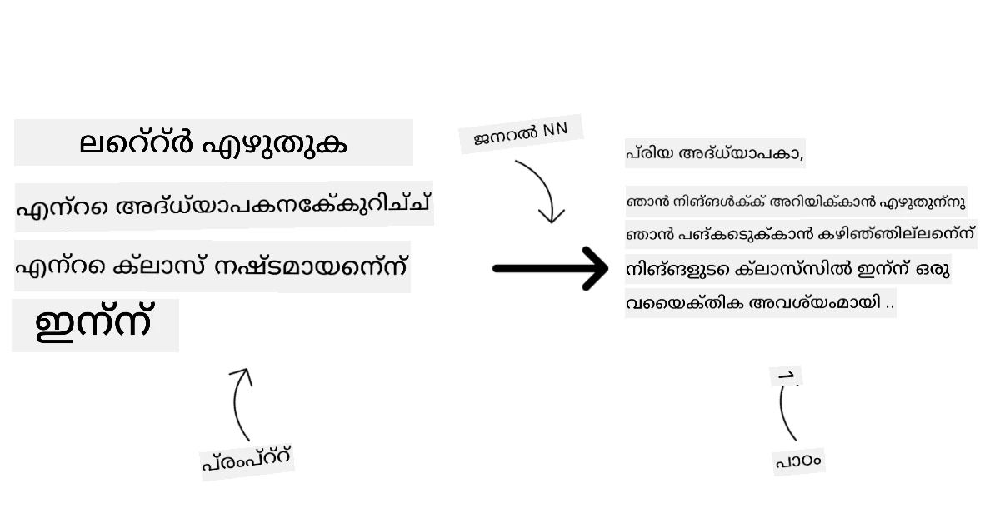

### എൻകോഡർ-ഡിക്കോഡർ മോഡൽ എതിരായി ഡിക്കോഡർ മാത്രം

LLM-കളുടെ വ്യത്യസ്ത വാസ്തുവിദ്യകളെ സംബന്ധിച്ച് സംസാരിക്കുമ്പോൾ ഒരു ഉപമ ഉപയോഗിക്കാം.

നിങ്ങൾക്ക് മാനേജർ വിദ്യാർത്ഥികൾക്കായി ഒരു ക്വിസ് എഴുതാൻ task കൊടുത്തു പോരെ. നിങ്ങൾക്ക് രണ്ട് സഹപ്രവർത്തകർ ഉണ്ട്; ഒരാൾ ഉള്ളടക്കം സൃഷ്ടിക്കുന്നത് നിയന്ത്രിക്കുന്നു, മറ്റോ അവ തിരശീല പരിശോധിക്കുന്നു.

ഉള്ളടക്കം സൃഷ്ടിക്കുന്നവൻ ഒരു ഡിക്കോഡർ മാത്രം മോഡലിന്റെപോലെ ആണ്: അവ വിഷയം നോക്കുന്നു, നിങ്ങൾ മുമ്പേ എഴുതിയതും കാണുന്നു, ആയതു കൊണ്ട് അവ ആ പശ്ചാത്തലത്തിൽ പരമ്പരാഗത ഉള്ളടക്കം സൃഷ്ടിക്കുന്നു. അവർ ആകർഷകവും വിവരപരവും ഉള്ള ഉള്ളടക്കം എഴുതുന്നതിൽ നന്നായി പോരുന്നു, പക്ഷേ അവയും വിവരങ്ങൾ വർഗ്ഗീകരിക്കുക, തിരയുക, കോഡുചെയ്യുക മാത്രമാണെങ്കിൽ ഏറ്റവും നല്ല തിരഞ്ഞെടുക്കലല്ല. ഡിക്കോഡർ മാത്രം മോഡൽ കുടുംബങ്ങളായ GPT, Llama മോഡലുകൾ ഉദാഹരണമാണ്.

തിരശീല പരിശോധകൻ എൻകോഡർ മാത്രം മോഡലിനുപോലെ ആണ്, അവർ പഠനസഹായം എഴുതി ഉത്തരം പരിശോധിക്കുന്നു, അവ തമ്മിലുള്ള ബന്ധം മനസ്സിലാക്കുന്നു, പക്ഷേ ഉള്ളടക്കം സൃഷ്ടിക്കാനാകില്ല. എൻകോഡർ മാത്രം മോഡലിന്റെ ഉദാഹരണം BERT ആണ്.

ക്രിയാത്മകവും തിരശീല പരിശോധനയും ഒരുമിട്ടുള്ള മോഡൽ ഉണ്ടായിരിക്കാമെന്ന് ചിന്തിക്കുക, അത് എൻകോഡർ-ഡിക്കോഡർ മോഡലാണ്. ഉദാഹരണത്തിന് BART, T5.

### സർവീസ് എതിരായി മോഡൽ

ഇപ്പോൾ, ഒരു സർവീസും മോഡലും തമ്മിലുള്ള വ്യത്യാസം ചർച്ച ചെയ്യാം. സർവീസ് ഒരു ക്ലൗഡ് സർവീസ് പ്രൊവൈഡർ വിതരണം ചെയ്യുന്ന ഉൽപ്പന്നമാണ്, സാധാരണ മോഡലുകൾ, ഡാറ്റ, മറ്റ് ഘടകങ്ങളുടെ സംയോജനം ആകുന്നു. മോഡൽ ഒരു സർവീസിന്റെ കോഴ് ഘടകമാണ്, സാധാരണ ഫൗണ്ടേഷൻ മോഡൽ പോലെ LLM.

സർവീസുകൾ പലപ്പോഴും നിർമ്മിത ഉപയോഗത്തിനായി പരിപാലിതവും ഉപയോഗിക്കാൻ എളുപ്പവുമാണ്, പലപ്പോഴും ഗ്രാഫിക്കൽ യൂസർ ഇന്റർഫേസ് വഴിയാണ് ഉപയോഗിക്കുന്നത്. എന്നാൽ, സേവനങ്ങൾ എല്ലായ്പ്പോഴും സൗജന്യമല്ല, ഉപയോഗത്തിനായി സബ്സ്ക്രിപ്ഷൻ അല്ലെങ്കിൽ പണം ആവശ്യമായിരിക്കാം, അത് സേവന ഉടമയുടെ ഉപകരണങ്ങളും വിഭവങ്ങളും ഉപയോഗിക്കുന്നതിനുള്ള ചെലവ് കുറയ്ക്കാനും സ്കേൽ ചെയ്യാനും സഹായിക്കുന്നു. ഉദാഹരണത്തിന് [Azure OpenAI Service](https://learn.microsoft.com/azure/ai-foundry/openai/overview?WT.mc_id=academic-105485-koreyst) ഉപയോഗം അനുസരിച്ച് പണമടയ്ക്കുന്ന പ്ലാൻ നൽകുന്നു. Azure OpenAI സർവീസ് എന്റർപ്രൈസ്-ഗ്രേഡ് സുരക്ഷയും ഉത്തരവാദിത്വമുള്ള എഐ ചട്ടവുമാണ് മോഡലുകളുടെ കഴിവുകൾക്കും മുകളിൽ നൽകുന്നത്.

മോഡലുകൾ ന്യൂറൽ നെറ്റ്‌വർക്ക് ആർട്ടിഫാക്റ്റുകളാണ്: പരിധികൾ, ഭാരം, വാസ്തുവിദ്യ, ടോക്കൺ ഐസർ, പിന്തുണാ കോൺഫിഗറേഷൻ. ഒരു മോഡൽ സോംസ്‌ഥാനത്തിൽ അല്ലെങ്കിൽ സ്വകാര്യ പരിതസ്ഥിതിയിൽ ഓടിക്കാൻ അനുയോജ്യമായ ഹാർഡ്‌വെയർ, സർവീസ് സംവിധാനം, നിരീക്ഷണം എന്നിവ ആവശ്യമാണ്, കൂടാതെ അനുയോജ്യമായ ഓപ്പൺ-സോഴ്‌സ്/ഓപ്പൺ-വെയിറ്റ് ലൈസൻസോ വാണിജ്യ ലൈസൻസോ. ഓപ്പൺ-വെയിറ്റ് മോഡലുകൾ EA Llama 4, Mistral മോഡലുകൾ സ്വയം ഹോസ്റ്റുചെയ്യാമെങ്കിലും, അവക്ക് കമ്പ്യൂട്ടേഷൻ ശക്തിയും പ്രവർത്തനപരിചയവും ആവശ്യമാണ്.

## Azure-ൽ പ്രകടനം മനസിലാക്കാൻ വ്യത്യസ്ത മോഡലുകളുമായി എങ്ങനെ പരീക്ഷിക്കുക, പുനരാവർത്തനം ചെയ്യാമെന്നത്

നമ്മുടെ ടീം നിലവിലെ LLMs ലാൻഡ്‌സ്‌കേപ്പ് പരിശോധിച്ച് അവരുടെ സീനാറിയോകൾക്കായി ചില നല്ല സ്ഥാനാർഥികളെ തിരിച്ചറിയുക കഴിഞ്ഞാൽ, അടുത്തത് അവയെ അവരുടെ ഡാറ്റയിലും വർക്ക്‌ലോഡിലും പരീക്ഷിക്കുകയാണ്. ഇത് ഒരു ആവർത്തന പ്രക്രിയയാണ്, പരീക്ഷണങ്ങളും അളവുകളും വഴി നടത്തപ്പെടുന്നു.
മുമ്പത്തെ പാരഗ്രാഫുകളിൽ പരാമർശിച്ച മൊഡലുകളുടെ (OpenAI മോഡലുകൾ, Llama 4, Mistral പോലുള്ള ഒപ്പൺ-വെയിറ്റ് മോഡലുകൾ, Hugging Face മോഡലുകൾ) പലതും [Microsoft Foundry Models](https://learn.microsoft.com/azure/foundry/concepts/foundry-models-overview?WT.mc_id=academic-105485-koreyst) ൽ ലഭ്യമാണ്.

[Microsoft Foundry](https://learn.microsoft.com/azure/foundry/what-is-foundry?WT.mc_id=academic-105485-koreyst), മുൻപ് Azure AI Studio/Azure AI Foundry ആയി അറിയപ്പെട്ടിരുന്നത്, AI ആപ്ലിക്കേഷനുകളും ഏജന്റുമാരും നിർമ്മിക്കാൻ രൂപകൽപ്പന ചെയ്ത ഏകീകൃത Azure പ്ലാറ്റ്ഫോമാണ്. ഇത് ഡെവലപ്പർമാർക്ക് ട്രയലും മൂല്യനിർണ്ണയവും മുതൽ വിന്യസനം, നിരീക്ഷണം, ഗവൺസൻസ് വരെ ജീവിതചക്രം നിയന്ത്രിക്കാൻ സഹായിക്കുന്നു. Microsoft Foundry ലെ മോഡൽ കാറ്റലോഗ് ഉപഭോക്താവിന് അനുവദിക്കുന്നു:

- കാറ്റലോഗിൽ താൽപ്പര്യമുള്ള ഫൗണ്ടേഷൻ മോഡൽ കണ്ടെത്തുക, Azure വിൽക്കുന്ന മോഡലുകളും പങ്കാളികളും സമൂഹം നൽകുന്ന മോഡലുകളും ഉൾപ്പെടെ. ടാസ്ക്, പ്രൊവൈഡർ, ലൈസൻസ്, വിന്യസന ഓപ്ഷൻ, അല്ലെങ്കിൽ പേരുപോലുള്ള ഫിൽറ്ററുകൾ ഉപയോഗിച്ച് തിരഞ്ഞെടുക്കാം.

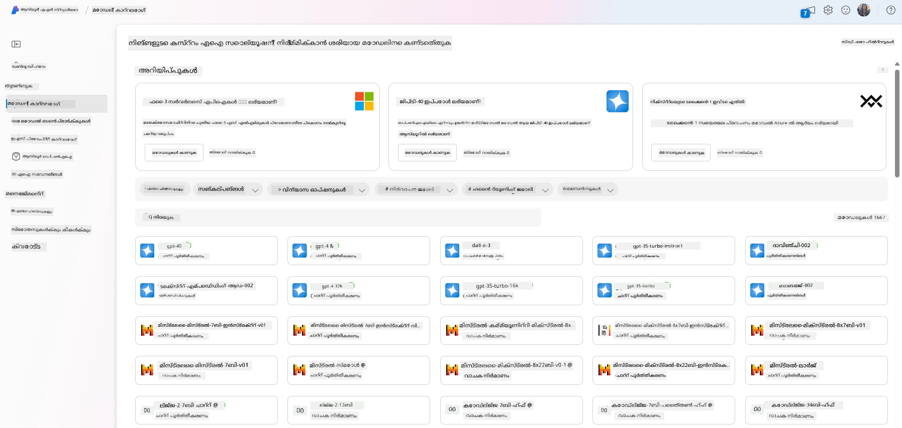

- മോഡൽ കാർഡ് അവലോകനം ചെയ്യുക, ഉദ്ദേശിച്ച ഉപയോഗവും പരിശീലന ഡാറ്റയും വിശദമായ വിവരണവും, കോഡ് സാംപിളുകളും ആന്തരിക മൂല്യനിർണ്ണയ ലൈബ്രറിയിലെ മൂല്യനിർണ്ണയ ഫലങ്ങളുമടങ്ങുന്നു.

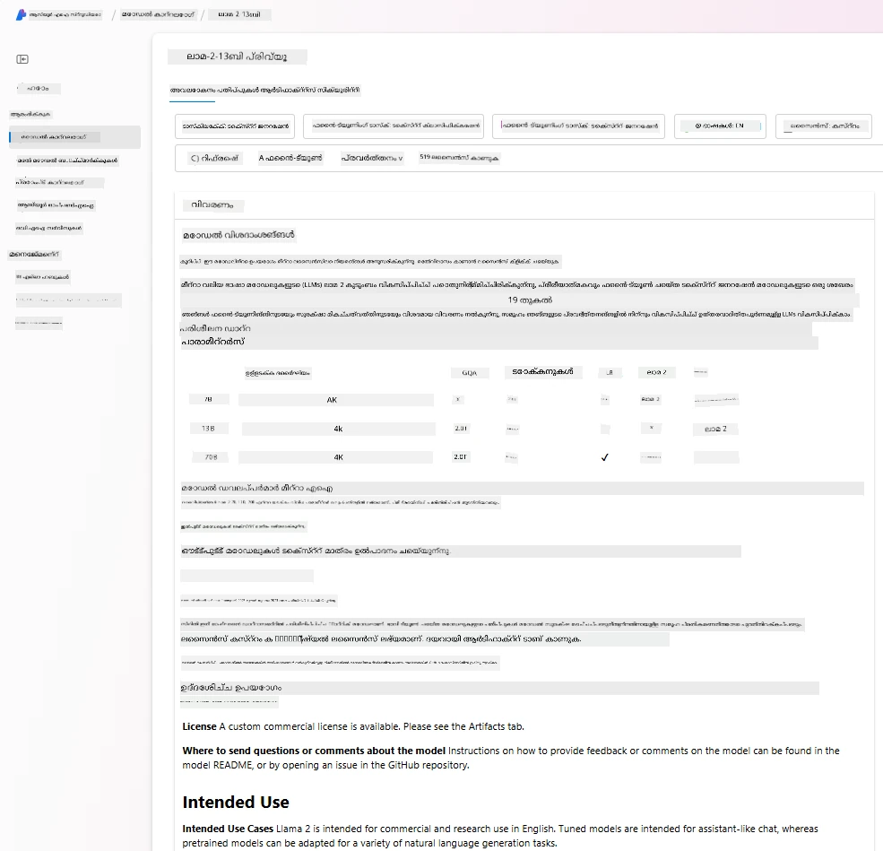

- വ്യവസായത്തിൽ ലഭ്യമായ മോഡലുകളും ഡാറ്റാസെറ്റുകളും തമ്മിലുള്ള ബെഞ്ച്മാർക്കുകൾ താരതമ്യം ചെയ്ത് ബിസിനസ്സ് സീനാറിയോയുടെ ആവശ്യങ്ങൾ ഏത് പാരാമീറ്ററിൽ പൂരിപ്പിക്കുന്നുവെന്ന് വിലയിരുത്തുക, [Model Benchmarks](https://learn.microsoft.com/azure/ai-foundry/concepts/model-benchmarks?WT.mc_id=academic-105485-koreyst) പാനൽ വഴി.

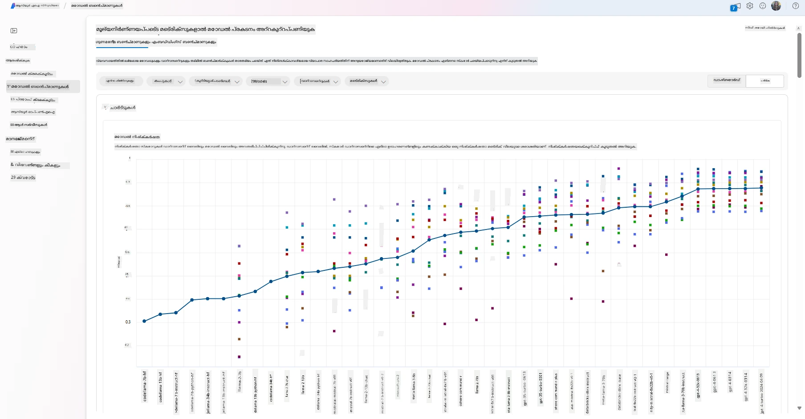

- പിന്തുണയുള്ള മോഡലുകൾ കസ്റ്റം പരിശീലന ഡേറ്റയിൽ ഫൈൻ-ട്യൂൺ ചെയ്ത് പ്രത്യേക വർക്ക്‌ലോഡിൽ മോഡൽ പ്രകടനം മെച്ചപ്പെടുത്തുക, Microsoft Foundry ന്‍റെ പരീക്ഷണവും ട്രാക്കിംഗും ചെയ്യുന്ന ശേഷിആദ്യങ്ങളിൽ ആശ്രയിച്ച്.

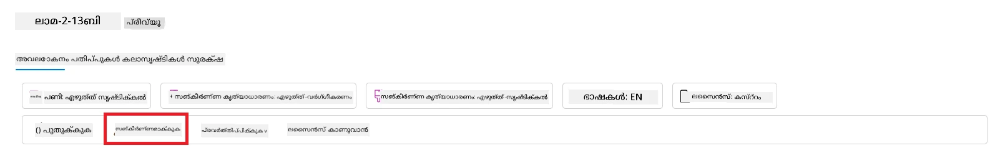

- പ്രാഥമികമായി പരിശീലിപ്പിച്ച മോഡലോ ഫൈൻ-ട്യൂൺ ചെയ്ത വേർഷനോ ഒരു റിമോട്ട് റീയൽ-ടൈം ഇൻഫറൻസ് എൻഡ്‌പോയിന്റിലേക്ക് വിന്യസിക്കുക, മാനേജിംഗ് കണ്ട്രോളുകൾ അല്ലെങ്കിൽ സർവർലെസ് വിന്യസന ഓപ്ഷനുകൾ ഉപയോഗിച്ച്, ആപ്ലിക്കേഷനുകൾക്കായി അത് ഉപഭോഗിക്കാൻ.

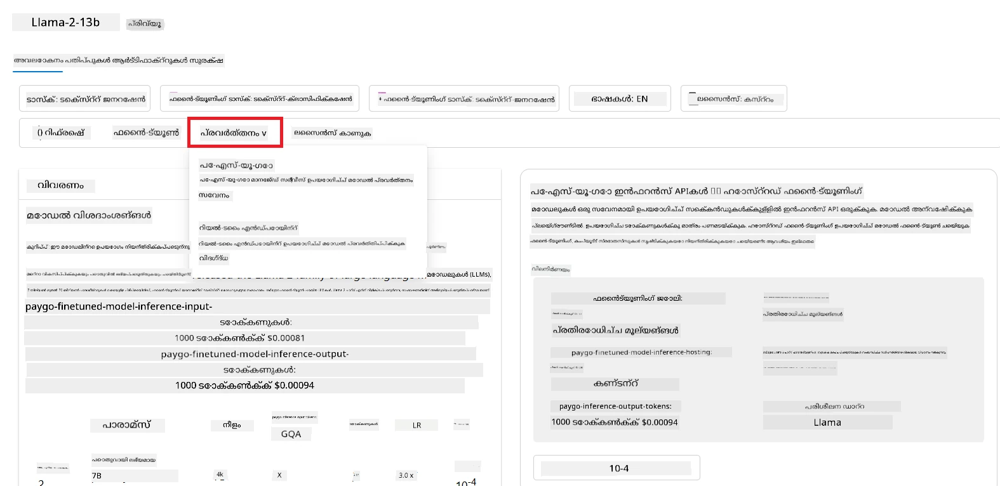

> [!NOTE]
> കാറ്റലോഗിൽ ഉള്ള എല്ലാ മോഡലുകളും ഇപ്പോള്‍ ഫൈൻ-ട്യൂണിംഗിനും/അല്ലെങ്കിൽ പേ-ആസ്-യു-ഗോ വിന്യസനത്തിനും ലഭ്യമല്ല. മോഡൽ കഴിവുകളും പരിമിതികളും സംബന്ധിച്ച വിശദമല്ലിവയും അറിയാൻ മോഡൽ കാർഡ് പരിശോധിക്കുക.

## LLM ഫലങ്ങൾ മെച്ചപ്പെടുത്തൽ

ഞങ്ങളുടെ സ്റ്റാർട് അപ്പ് ടീം വ്യത്യസ്ത തരം LLM കളുമായി, മൈക്രോസോഫ്റ്റ് ഫൗണ്ട്രി പോലുള്ള ക്ലൗഡ് പ്ലാറ്റ്ഫോം ഉപയോഗിച്ച് പരീക്ഷണങ്ങൾ നടത്തി വ്യത്യസ്ത മോഡലുകൾ താരതമ്യം ചെയ്തു, അവയെ ടെസ്റ്റ് ഡാറ്റയിൽ മൂല്യനിർണ്ണയം ചെയ്തു, പ്രകടനം മെച്ചപ്പെടുത്തി, ഇൻഫറൻസ് എൻഡ്‌പോയിന്റുകളിൽ വിന്യസിച്ചു.

എന്നാൽ അവർ ഫൈൻ-ട്യൂണിംഗ് മോഡലിനെ മുൻ-പ്ര‌شിക്ലിതമായതിനെക്കാൾ ഉപയോഗിക്കാൻ എപ്പോൾ പരിഗണിക്കുക? പ്രത്യേക വർക്ക്‌ലോഡിൽ മോഡൽ പ്രകടനം മെച്ചപ്പെടുത്താനുള്ള മറ്റു സമീപനങ്ങളുണ്ടോ?

ഒരു ബിസിനസിന് LLM നിൽ നിന്നുള്ള ആവശ്യമായ ഫലങ്ങൾ നേടാൻ ഉപയോഗിക്കാവുന്ന നിരവധി സമീപനങ്ങൾ ഉണ്ട്. പ്രൊഡക്ഷനിൽ LLM വിന്യാസം ചെയ്യുമ്പോൾ വ്യത്യസ്ത പരിശീലന ഡിഗ്രിയുള്ള വ്യത്യസ്ത തരം മോഡലുകൾ തിരഞ്ഞെടുക്കാം; വ്യത്യസ്ത ക്ലിഷ്ടത, ചെലവ്, ഗുണമേൻമ എന്നിവയുണ്ടാകും. ഇവിടെ ചില വ്യത്യസ്ത സമീപനങ്ങൾ ഉണ്ട്:

- **കോൺടെക്സ്റ്റോടുകൂടിയ പ്രോംപ്റ്റ് എഞ്ചിനീയറിംഗ്**. പ്രോംപ്റ്റ് നൽകുമ്പോൾ കാര്യമായ കോൺടെക്സ്റ്റ് നൽകാനാണ് ആശയം, പെരുമാറ്റം ലഭിക്കുന്നതിന്.

- **റീട്രീവൽ ഓഗ്മെന്റഡ് ജനറേഷൻ (RAG)**. നിങ്ങളുടെ ഡാറ്റ ഒരു ഡാറ്റാബേസിലോ വെബ് എൻഡ്‌പോയിന്റിലോ ഉണ്ടായേക്കാം. പ്രസ്താവന സമയത്ത് ഈ ഡാറ്റ, അല്ലെങ്കിൽ അതിന്റെ ഭാഗം ഉൾപ്പെടെയുള്ള, ഉറപ്പ് വരുത്താൻ ബന്ധപ്പെട്ട ഡാറ്റ തിരഞ്ഞെടുത്തു ഉപയോക്തൃന്റെ പ്രോംപ്റ്റിന്റെ ഭാഗമാക്കാം.

- **ഫൈൻ-ട്യൂൺ ചെയ്ത മോഡൽ**. ഇവിടെ, നിങ്ങൾ നിങ്ങളുടെ സ്വന്തം ഡാറ്റയിൽ മോഡൽ കൂടുതൽ പരിശീലിപ്പിച്ചിരിക്കുന്നു, അത് മോഡലിനെ കൂടുതൽ കൃത്യവും പ്രതികരണശേഷിയുള്ളതുമായിത്തീർക്കുന്നു, പക്ഷേ ചിലവേറിയതാകാം.

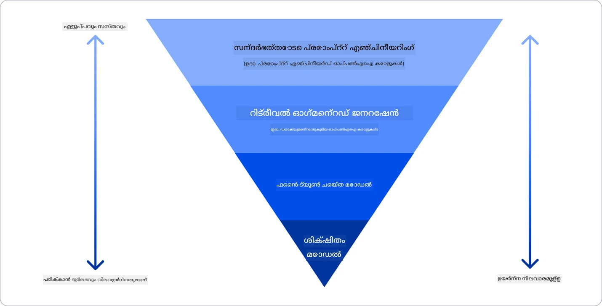

Img ഉറവിടം: [Four Ways that Enterprises Deploy LLMs | Fiddler AI Blog](https://www.fiddler.ai/blog/four-ways-that-enterprises-deploy-llms?WT.mc_id=academic-105485-koreyst)

### കോൺടെക്സ്റ്റോടെ പ്രോംപ്റ്റ് എഞ്ചിനീയറിംഗ്

മുൻ-പരിശീലിച്ച LLMs പൊതുവായ സ്വഭാവഭാഷാ ടെസ്കുകളിൽ വളരെ മികച്ചതാണ്, ചെറിയ പ്രോംപ്റ്റ് ഉപയോഗിച്ചും - ഒരു വാക്യം പൂർത്തിയാക്കൽ അല്ലെങ്കിൽ ഒരു ചോദ്യമുപേക്ഷിയ്ക്കുക -所谓的 "സീറോ-ഷോട്ട്" ലേണിങ്.

എന്നാൽ ഉപയോക്താവ് തന്റെ ചോദ്യം വിശദമായി വിശദീകരിച്ച് ഉദാഹരണങ്ങളോടുകൂടെ - കോൺടെക്സ്റ്റ് - രൂപപ്പെടുത്തുന്നത്ര答案 സാന്ദർഭികവും ഉപയോക്താവിന്റെ പ്രതീക്ഷയ്ക്ക് ഏറ്റവും അടുത്തതും ആയിരിക്കുമെന്ന് കാണാമാകും. ഈ സാഹചര്യത്തിൽ, പ്രോംപ്റ്റ് ഒരേ ഉദാഹരണം ഉൾക്കൊള്ളുമ്പോൾ "ഒന്ന്-ഷോട്ട്" učenം എന്ന് പറയുന്നു ചെറുത്, ഒരു‌ പല ഉദാഹരണങ്ങളുള്ള Pront "ഫ്യൂ ഷോട്ട്" učenം എന്നാണ് പറയുന്നത്.
കോൺടെക്സ്റ്റോടെ പ്രോംപ്റ്റ് എഞ്ചിനീയറിംഗ് തുടക്കമാക്കുന്ന ഏറ്റവും ചെലവുകുറഞ്ഞ സമീപനമാണ്.

### Retrieval Augmented Generation (RAG)

LLMs പരിശീലന സമയത്ത് ഉപയോഗിച്ച ഡാറ്റ മാത്രം ഉപയോഗിച്ച് ഉത്തരം ജനറേറ്റ് ചെയ്യുന്നു എന്ന പരിമിതിയുണ്ട്. അതിനാൽ പരിശീലനത്തിനു ശേഷം സംഭവിച്ച സംഭവങ്ങളെക്കുറിച്ച് അവയ്ക്ക് അറിവില്ല, സ്വകാര്യ വിവരങ്ങൾക്ക് (ഉദാ: കമ്പനി ഡാറ്റ) അവയ്ക്ക് പ്രവേശനം ഇല്ല.
ഇതു മറികടക്കാൻ RAG ഉപയോഗിക്കാം, പ്രോംപ്റ്റ് എംബഡുചെയ്യുന്നതിന് പുറത്തുള്ള ഡാറ്റ സ്രോതസുകളിൽ നിന്നുള്ള ഡോക്യുമെന്റ് ചങ്കുകൾ (chunks) ചേർത്തുകൊണ്ട്, പ്രോംപ്റ്റ്സിന്റെ ദൈർഘ്യ പരിധികളെ കണക്കിലെടുത്ത്. ഇത് വെക്റ്റർ ഡാറ്റാബേസ് ടൂളുകൾ (ഉദാഹരണത്തിന് [Azure Vector Search](https://learn.microsoft.com/azure/search/vector-search-overview?WT.mc_id=academic-105485-koreyst)) കൊണ്ട് പിന്തുണയ്ക്കപ്പെടുന്നു, വ്യത്യസ്ത ഡാറ്റ സ്രോതസുകളിൽ നിന്നുള്ള ഉപഭോക്തൃസാധക ചങ്കുകൾ തിരികെ കണ്ടെത്തി പ്രോംപ്റ്റ് കോൺടെക്സ്റ്റിൽ ചേർക്കുന്നു.

ഒരു ബിസിനസിന് വേണ്ടത്ര ഡാറ്റ അല്ലെങ്കിൽ ടൈം അല്ലെങ്കിൽ വിഭവങ്ങൾ ഇല്ലാതെ LLM ഫൈൻ-ട്യൂൺ ചെയ്യാൻ കഴിയാത്തപ്പോഴും, പ്രത്യേക വർക്ക്‌ലോഡിൽ പ്രകടനം മെച്ചപ്പെടുത്താനും ഹല്ലുസിനേഷൻ, പഴയോ പിന്തുണയില്ലാത്ത ഉത്തരങ്ങളുടെയും അപകടം കുറയ്ക്കാനും ഈ സാങ്കേതികവിദ്യ വളരെ സഹായകമാണ്.

### ഫൈൻ-ട്യൂൺ ചെയ്ത മോഡൽ

ഫൈൻ-ട്യൂണിംഗ് ട്രാൻസ്ഫർ ലേണിംഗ് ഉപയോഗിച്ച് മോഡലിനെ ഒരു അടിഭാഗ ടാസ്ക്കിനായി അല്ലെങ്കിൽ പ്രത്യേക പ്രശ്നം പരിഹരിപ്പാൻ 'ഏർപ്പെടുത്തുന്ന' പ്രക്രിയയാണ്. ഫ്യൂ ഷോട്ട് ലേണിങ്, RAG എന്നിവയ്ക്ക് വ്യത്യസ്തമായി ഫൈൻ-ട്യൂണിംഗ് പുതിയതായിweightsum biasesum പുതുക്കപ്പെട്ട ഒരു മോഡൽ സൃഷ്ടിക്കുന്നു. ഇതിന് പ്രോമ്പ്റ്റും അതിന്റെ output (completion) എന്നിവയടങ്ങുന്ന പരിശീലന ഉദാഹരണങ്ങളുടെ ഒരു സെറ്റ് ആവശ്യമാണ്.
ഇത് വളർച്ചമാകുന്നത് ഇങ്ങനെയാണ്:

- **ചെറുതും ടാസ്ക്-സവിശേഷമായ മോഡലുകൾ ഉപയോഗിക്കൽ**. ബിസിനസ്സ് ഒരു ചെറിയ മോഡൽ ഒരു നിശ്ചിത ടാസ്കിനായി ഫൈന്റ്-ട്യൂൺ ചെയ്യാൻ ആഗ്രഹിക്കുന്നു, വലിയ മോഡലിന് പലതവണ പ്രോമ്പ്റ്റ് നൽകുന്നതിനുപകരം, ഇത് കൂടുതൽ ചെലവിൽ ലാഭകരവും വേഗം തന്നവുമായതായിരിക്കും.

- **വിലംബം പരിഗണിക്കൽ**. ഒരു വിശിഷ്ട ഉപയോഗകേസിനായി വിലംബം പ്രാധാന്യമുള്ളപ്പോൾ, വളരെ നീളമുള്ള പ്രോംപ്റ്റുകൾ ഉപയോഗിക്കാനാകില്ല, അല്ലെങ്കിൽ മോഡലിൽ നിന്നു പഠിക്കേണ്ട ഉദാഹരണങ്ങളുടെ എണ്ണം പ്രോംപ്റ്റ് ദൈർഘ്യ പരിധിക്ക് അനുസരിച്ചുള്ളതല്ല.

- **സ്ഥിരമായ പെരുമാറ്റം അനുകൂലമാക്കൽ**. ബിസിനസ് മികച്ച നിലവാരത്തിലുള്ള നിരവധി ഉദാഹരണങ്ങൾ കൈവരിച്ചിരിക്കുന്നു, മോഡൽ ഒരു ടാസ്ക് ഘടന, ഔട്ട്‌പുട്ട് ഫോർമാറ്റ്, ടോൺ, അല്ലെങ്കിൽ ഡൊമെയ്ൻ-നിര്ദിഷ്ട ശൈലി സ്ഥിരമായി പിന്തുടരുമെന്ന് ആഗ്രഹിക്കുന്നു. പ്രധാന പ്രശ്നം പുതിയത് ഫാക്റ്റുകൾ അല്ലെങ്കിൽ സ്വകാര്യ വിജ്ഞാനം എപ്പോഴും മാറിക്കൊണ്ടിരിക്കുന്നുവെങ്കിൽ, ഫൈൻ-ട്യൂണിംഗിൽ മാത്രം ആശ്രയിക്കാതെ RAG ഉപയോഗിക്കുക.

### പരിശീലന മോഡൽ

ഒരു LLM പൂർണ്ണമായി തുടക്കം മുതൽ പരിശീലിപ്പിക്കുക ഏറ്റവും ബുദ്ധിമുട്ടുള്ളതും ഏറ്റവും ക്ലിഷ്ടമുള്ളതുമായ സമീപനമാണ്, വിപുലമായ ഡാറ്റ, പ്രാവീണ്യമുള്ള വിഭവങ്ങൾ, അനുയോജ്യമായ കംപ്യുട്ടേഷണൽ ശക്തി ആവശ്യമാണ്. ഡൊമെയ്ൻ സവിശേഷമായ ഉപയോഗകേസ് ഉള്ള ബിസിനസ്സ് മാത്രമേ ഈ ഓപ്ഷൻ പരിഗണിക്കേണ്ടതുള്ളൂ.

## അറിവ് പരിശോധിക്കുക

LLM പൂർത്തീകരണ ഫലങ്ങൾ മെച്ചപ്പെടുത്താനായി നല്ല സമീപനം ഏതുവെന്നും?

1. കോൺടെക്സ്റ്റോടുകൂടിയ പ്രോംപ്റ്റ് എഞ്ചിനീയറിംഗ്
1. RAG
1. ഫൈൻ-ട്യൂൺ ചെയ്ത മോഡൽ

ഉത്തരം: മൂന്ന് വഴികളും സഹായിക്കാം. വേഗത്തിൽ മെച്ചപ്പെടുത്താൻ കോൺടെക്സ്റ്റോടുകൂടിയ പ്രോംപ്റ്റ് എഞ്ചിനീയറിംഗ് ഉപയോഗിച്ച് ആരംഭിക്കുക, നിലവിലുള്ള വാസ്തവങ്ങൾക്കോ സ്വകാര്യ ബിസിനസ്സ് ഡാറ്റയ്ക്കോ മോഡലിന് ആവശ്യമായപ്പോൾ RAG ഉപയോഗിക്കുക. ഉയർന്ന നിലവാരമുള്ള മതിയായ ഉദാഹരണങ്ങൾ കൈവരിച്ചുള്ളപ്പോൾ ഫൈൻ-ട്യൂണിംഗ് തിരഞ്ഞെടുക്കുക, തുടർന്ന് മോഡൽ ടാസ്ക്, ഫോർമാറ്റ്, ടോൺ, അല്ലെങ്കിൽ ഡൊമെയ്ൻ മാതൃക കൈവരിക്കുകയും വേണം.

## 🚀 പണിയെടുക്കൽ

നിങ്ങളുടെ ബിസിനസ്സ് വേണ്ടി RAG എങ്ങനെ ഉപയോഗിക്കാമെന്ന് കൂടുതൽ പഠിക്കുക: [use RAG](https://learn.microsoft.com/azure/search/retrieval-augmented-generation-overview?WT.mc_id=academic-105485-koreyst).

## മികച്ച പ്രവൃത്തി, നിങ്ങളുടെ പഠനം തുടരുക

ഈ പാഠം പൂർത്തിയാക്കിയതിന് ശേഷം, നിങ്ങളുടെ ജനറേറ്റീവ് AI വിജ്ഞാനം മെച്ചപ്പെടുത്താൻ ഞങ്ങളുടെ [Generative AI Learning collection](https://aka.ms/genai-collection?WT.mc_id=academic-105485-koreyst) സന്ദർശിക്കുക!

പാഠം 3 ന് മുന്നേറുക, അവിടെ നാം [Generating AI സുതാര്യമായി നിർമ്മിക്കുന്നതിൻറെ](../03-using-generative-ai-responsibly/README.md?WT.mc_id=academic-105485-koreyst) കാര്യത്തിൽ നോക്കാം!

---

<!-- CO-OP TRANSLATOR DISCLAIMER START -->
**അറിയിപ്പ്**:
ഈ രേഖ AI പരിഭാഷാ സേവനം [Co-op Translator](https://github.com/Azure/co-op-translator) ഉപയോഗിച്ച് പരിഭാഷപ്പെടുത്തിയതാണ്. ഞങ്ങൾ കൃത്യതയ്ക്കായി ശ്രമിക്കുന്നുവെങ്കിലും, ഓട്ടോമേറ്റഡ് പരിഭാഷകളിൽ പിഴവുകൾ അല്ലെങ്കിൽ തെറ്റായ വിവരങ്ങൾ ഉണ്ടാകാൻ സാധ്യതയുണ്ട്. അതിന്റെ സ്വാഭാവിക ഭാഷയിലുള്ള അസൽ രേഖയാണ് പ്രാമാണികമായ ഉറവിടമായി പരിഗണിക്കേണ്ടത്. നിർണായകമായ വിവരങ്ങൾക്ക്, പ്രൊഫഷണൽ മനുഷ്യ പരിഭാഷ ശുപാർശ ചെയ്യുന്നു. ഈ പരിഭാഷ ഉപയോഗിച്ച് ഉണ്ടാകുന്ന തെറ്റിദ്ധാരണകൾ അല്ലെങ്കിൽ തെറ്റായ വ്യാഖ്യാനങ്ങൾക്കായി ഞങ്ങൾ ഉത്തരവാദികളല്ല.
<!-- CO-OP TRANSLATOR DISCLAIMER END -->