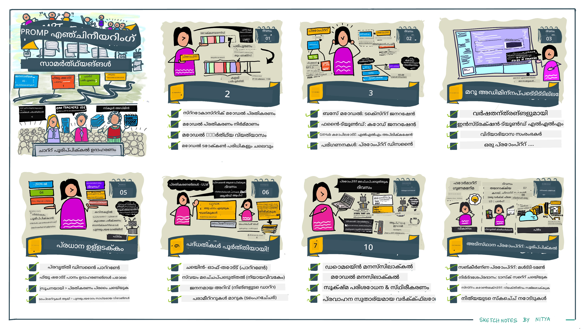
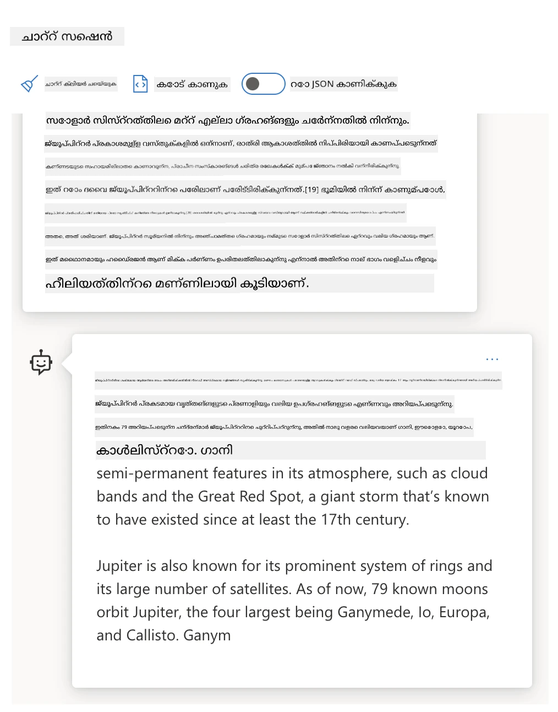
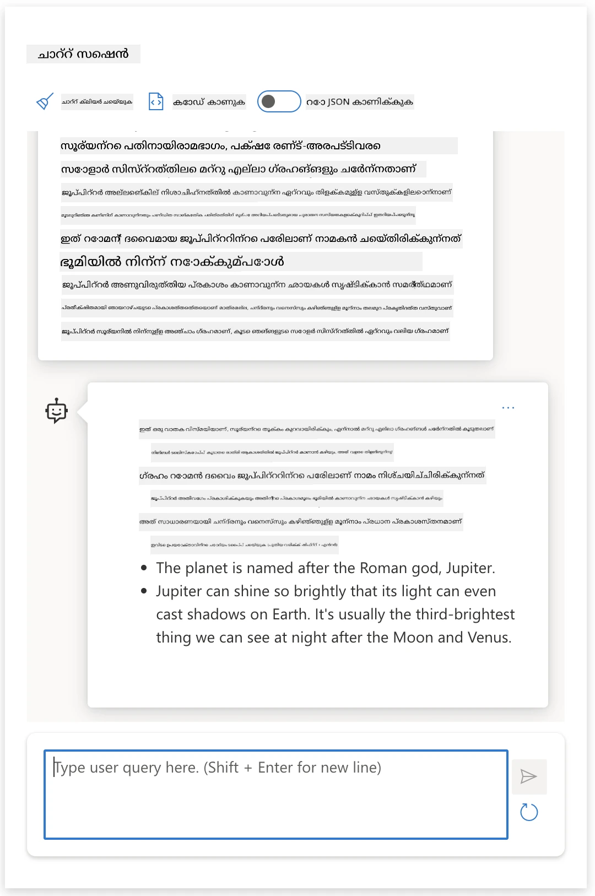
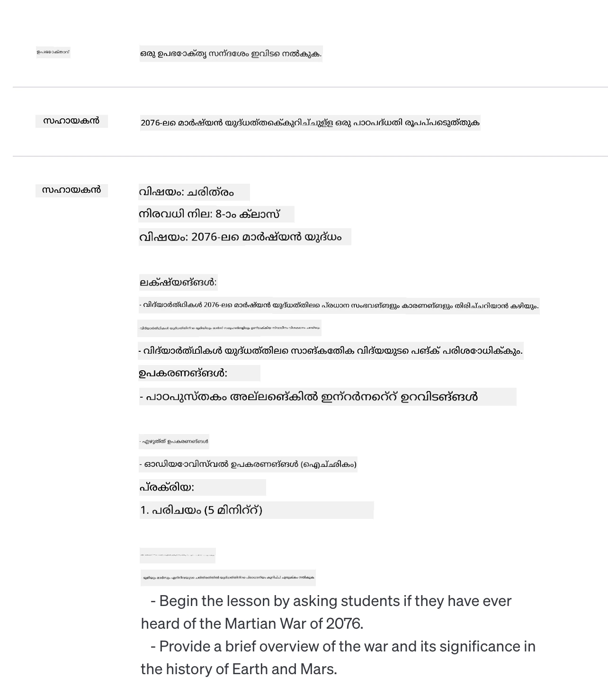
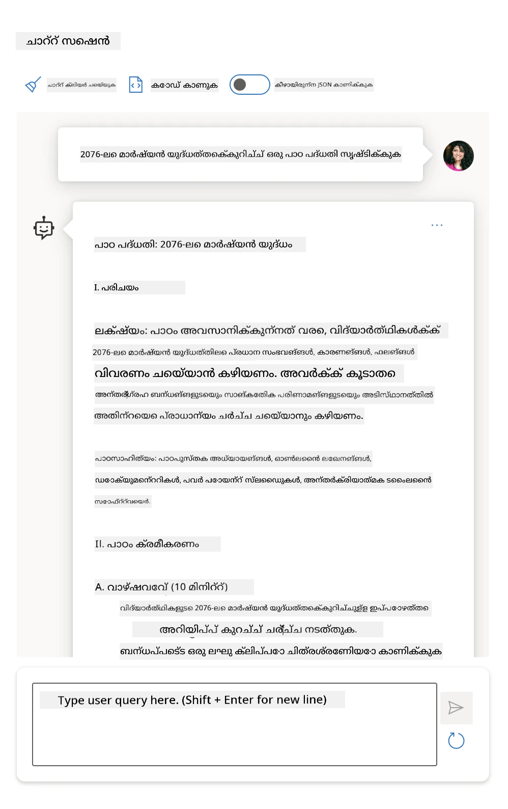
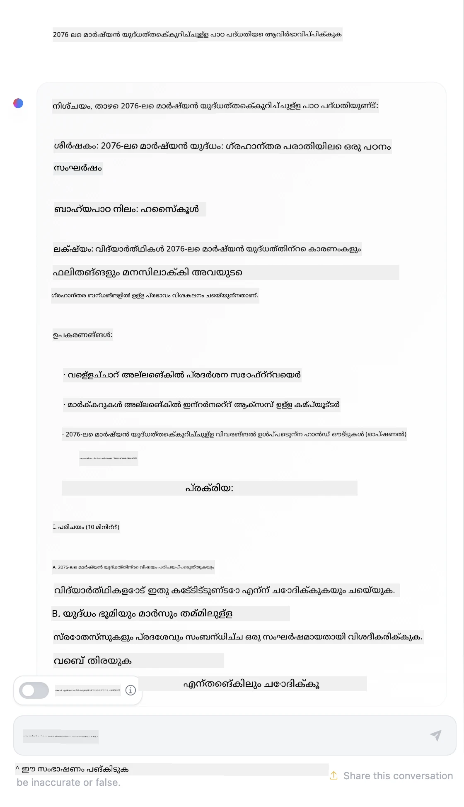

<!--
CO_OP_TRANSLATOR_METADATA:
{
  "original_hash": "0135e6c271f3ece8699050d4debbce88",
  "translation_date": "2025-12-19T18:44:20+00:00",
  "source_file": "04-prompt-engineering-fundamentals/README.md",
  "language_code": "ml"
}
-->
# പ്രോംപ്റ്റ് എഞ്ചിനീയറിംഗ് അടിസ്ഥാനങ്ങൾ

[](https://youtu.be/GElCu2kUlRs?si=qrXsBvXnCW12epb8)

## പരിചയം
ജനറേറ്റീവ് AI മോഡലുകളിൽ ഫലപ്രദമായ പ്രോംപ്റ്റുകൾ സൃഷ്ടിക്കുന്നതിനുള്ള അടിസ്ഥാന ആശയങ്ങളും സാങ്കേതിക വിദ്യകളും ഈ മോഡ്യൂൾ ഉൾക്കൊള്ളുന്നു. ഒരു LLM-ന് നിങ്ങൾ എഴുതുന്ന പ്രോംപ്റ്റിന്റെ രീതി കൂടി പ്രാധാന്യമുള്ളതാണ്. സൂക്ഷ്മമായി രൂപകൽപ്പന ചെയ്ത പ്രോംപ്റ്റ് മികച്ച പ്രതികരണ ഗുണമേന്മ നേടാൻ സഹായിക്കും. എന്നാൽ _പ്രോംപ്റ്റ്_ എന്നും _പ്രോംപ്റ്റ് എഞ്ചിനീയറിംഗ്_ എന്നും പറയുന്നത് എന്താണെന്ന് നിങ്ങൾക്കറിയാമോ? LLM-ന് അയക്കുന്ന പ്രോംപ്റ്റ് _ഇൻപുട്ട്_ എങ്ങനെ മെച്ചപ്പെടുത്താം? ഈ ചോദ്യങ്ങൾക്ക് ഈ അധ്യായത്തിലും അടുത്ത അധ്യായത്തിലും നാം ഉത്തരം കണ്ടെത്താൻ ശ്രമിക്കും.

_ജനറേറ്റീവ് AI_ ഉപയോക്തൃ അഭ്യർത്ഥനകളെ മറുപടിയായി പുതിയ ഉള്ളടക്കം (ഉദാ., ടെക്സ്റ്റ്, ചിത്രങ്ങൾ, ഓഡിയോ, കോഡ് തുടങ്ങിയവ) സൃഷ്ടിക്കാൻ കഴിവുള്ളതാണ്. ഇത് OpenAI-യുടെ GPT ("Generative Pre-trained Transformer") സീരീസ് പോലുള്ള _ലാർജ് ലാംഗ്വേജ് മോഡലുകൾ_ ഉപയോഗിച്ച് സ്വാഭാവിക ഭാഷയും കോഡും ഉപയോഗിച്ച് പരിശീലിപ്പിച്ചാണ് സാധ്യമാക്കുന്നത്.

ഉപയോക്താക്കൾക്ക് ഇപ്പോൾ ഈ മോഡലുകളുമായി ചാറ്റ് പോലുള്ള പരിചിതമായ രീതികളിൽ സാങ്കേതിക വിദഗ്ധതയോ പരിശീലനമോ ആവശ്യമില്ലാതെ ഇടപഴകാം. മോഡലുകൾ _പ്രോംപ്റ്റ് അടിസ്ഥാനമാക്കിയുള്ളവ_ ആണ് - ഉപയോക്താക്കൾ ഒരു ടെക്സ്റ്റ് ഇൻപുട്ട് (പ്രോംപ്റ്റ്) അയച്ച് AI-യുടെ മറുപടി (കമ്പ്ലീഷൻ) ലഭിക്കുന്നു. പിന്നീട് അവർ "AI-യുമായി ചാറ്റ്" ചെയ്യാം, മൾട്ടി-ടേൺ സംഭാഷണങ്ങളിൽ പ്രോംപ്റ്റ് മെച്ചപ്പെടുത്തിക്കൊണ്ട് മറുപടി അവരുടെ പ്രതീക്ഷകൾക്ക് അനുയോജ്യമായതാകുന്നത് വരെ.

"പ്രോംപ്റ്റുകൾ" ഇപ്പോൾ ജനറേറ്റീവ് AI ആപ്പുകൾക്കുള്ള പ്രധാന _പ്രോഗ്രാമിംഗ് ഇന്റർഫേസ്_ ആയി മാറിയിരിക്കുന്നു, മോഡലുകൾക്ക് എന്ത് ചെയ്യണമെന്ന് പറയുകയും ലഭിക്കുന്ന മറുപടികളുടെ ഗുണമേന്മയെ സ്വാധീനിക്കുകയും ചെയ്യുന്നു. "പ്രോംപ്റ്റ് എഞ്ചിനീയറിംഗ്" എന്നത് പ്രോംപ്റ്റുകളുടെ _ഡിസൈൻ_യും _ഓപ്റ്റിമൈസേഷനും_ ശ്രദ്ധിക്കുന്ന വേഗത്തിൽ വളരുന്ന പഠന മേഖലയാണ്, ഇത് സ്ഥിരതയുള്ള, ഗുണമേന്മയുള്ള മറുപടികൾ വലുതായി നൽകാൻ സഹായിക്കുന്നു.

## പഠന ലക്ഷ്യങ്ങൾ

ഈ പാഠത്തിൽ, പ്രോംപ്റ്റ് എഞ്ചിനീയറിംഗ് എന്താണെന്ന്, അതിന്റെ പ്രാധാന്യം എന്താണെന്ന്, ഒരു മോഡലിനും ആപ്ലിക്കേഷൻ ലക്ഷ്യത്തിനും അനുയോജ്യമായ ഫലപ്രദമായ പ്രോംപ്റ്റുകൾ എങ്ങനെ രൂപകൽപ്പന ചെയ്യാമെന്ന് നാം പഠിക്കും. പ്രോംപ്റ്റ് എഞ്ചിനീയറിംഗിന്റെ അടിസ്ഥാന ആശയങ്ങളും മികച്ച പ്രാക്ടീസുകളും മനസ്സിലാക്കുകയും, ജുപിറ്റർ നോട്ട്‌ബുക്കിൽ ഒരു ഇന്ററാക്ടീവ് "സാൻഡ്‌ബോക്സ്" പരിസ്ഥിതിയിൽ ഈ ആശയങ്ങൾ യഥാർത്ഥ ഉദാഹരണങ്ങളിൽ എങ്ങനെ പ്രയോഗിക്കാമെന്ന് പഠിക്കുകയും ചെയ്യും.

ഈ പാഠം അവസാനിക്കുമ്പോൾ നാം കഴിയും:

1. പ്രോംപ്റ്റ് എഞ്ചിനീയറിംഗ് എന്താണെന്ന്, അതിന്റെ പ്രാധാന്യം എന്താണെന്ന് വിശദീകരിക്കുക.
2. ഒരു പ്രോംപ്റ്റിന്റെ ഘടകങ്ങൾ എന്തൊക്കെയാണെന്ന്, അവ എങ്ങനെ ഉപയോഗിക്കപ്പെടുന്നതെന്ന് വിവരിക്കുക.
3. പ്രോംപ്റ്റ് എഞ്ചിനീയറിംഗിനുള്ള മികച്ച പ്രാക്ടീസുകളും സാങ്കേതിക വിദ്യകളും പഠിക്കുക.
4. പഠിച്ച സാങ്കേതിക വിദ്യകൾ യഥാർത്ഥ ഉദാഹരണങ്ങളിൽ പ്രയോഗിക്കുക, OpenAI എന്റ്പോയിന്റ് ഉപയോഗിച്ച്.

## പ്രധാന പദങ്ങൾ

പ്രോംപ്റ്റ് എഞ്ചിനീയറിംഗ്: AI മോഡലുകൾക്ക് ആഗ്രഹിക്കുന്ന ഔട്ട്പുട്ടുകൾ നൽകാൻ പ്രോംപ്റ്റുകൾ രൂപകൽപ്പന ചെയ്ത് മെച്ചപ്പെടുത്തുന്ന പ്രക്രിയ.
ടോക്കനൈസേഷൻ: ടെക്സ്റ്റ് ചെറിയ ഘടകങ്ങളായ ടോക്കണുകളായി മാറ്റുന്ന പ്രക്രിയ, മോഡൽ അവ മനസ്സിലാക്കി പ്രോസസ് ചെയ്യാൻ കഴിയുന്ന വിധം.
ഇൻസ്ട്രക്ഷൻ-ട്യൂൺഡ് LLMs: പ്രത്യേക നിർദ്ദേശങ്ങളോടെ ഫൈൻ-ട്യൂൺ ചെയ്ത വലിയ ഭാഷാ മോഡലുകൾ, മറുപടി കൃത്യതയും പ്രസക്തിയും മെച്ചപ്പെടുത്താൻ.

## പഠന സാൻഡ്‌ബോക്സ്

പ്രോംപ്റ്റ് എഞ്ചിനീയറിംഗ് ഇപ്പോൾ ശാസ്ത്രം എന്നേക്കാൾ കലയുടെ ഭാഗമാണ്. അതിൽ നൈപുണ്യം വർദ്ധിപ്പിക്കാൻ ഏറ്റവും നല്ല മാർഗം _കൂടുതൽ അഭ്യാസം_ ചെയ്യുകയും, പ്രയോഗ മേഖലാ വിദഗ്ധതയും ശുപാർശ ചെയ്ത സാങ്കേതിക വിദ്യകളും മോഡൽ-നിർദിഷ്ട ഓപ്റ്റിമൈസേഷനുകളും സംയോജിപ്പിച്ച പരീക്ഷണ-പിശക് സമീപനം സ്വീകരിക്കുകയുമാണ്.

ഈ പാഠത്തോടനുബന്ധിച്ചുള്ള ജുപിറ്റർ നോട്ട്‌ബുക്ക് നിങ്ങൾ പഠിക്കുന്നതുപോലെ പരീക്ഷിക്കാൻ കഴിയുന്ന _സാൻഡ്‌ബോക്സ്_ പരിസ്ഥിതിയാണ്. വ്യായാമങ്ങൾ നടത്താൻ നിങ്ങൾക്ക് ആവശ്യമായത്:

1. **ഒരു Azure OpenAI API കീ** - വിന്യസിച്ച LLM-ന്റെ സർവീസ് എന്റ്പോയിന്റ്.
2. **ഒരു Python റൺടൈം** - നോട്ട്‌ബുക്ക് പ്രവർത്തിപ്പിക്കാൻ.
3. **പ്രാദേശിക പരിസ്ഥിതി വേരിയബിളുകൾ** - _[SETUP](./../00-course-setup/02-setup-local.md?WT.mc_id=academic-105485-koreyst) ഘട്ടങ്ങൾ ഇപ്പോൾ പൂർത്തിയാക്കുക_.

നോട്ട്‌ബുക്ക് _സ്റ്റാർട്ടർ_ വ്യായാമങ്ങളോടുകൂടി വരുന്നു - എന്നാൽ നിങ്ങൾക്ക് കൂടുതൽ ഉദാഹരണങ്ങൾ പരീക്ഷിക്കാൻ അല്ലെങ്കിൽ ആശയങ്ങൾ പരീക്ഷിക്കാൻ നിങ്ങളുടെ സ്വന്തം _Markdown_ (വിവരണം)യും _Code_ (പ്രോംപ്റ്റ് അഭ്യർത്ഥനകൾ) വിഭാഗങ്ങളും ചേർക്കാൻ പ്രോത്സാഹിപ്പിക്കുന്നു - പ്രോംപ്റ്റ് രൂപകൽപ്പനയിൽ നിങ്ങളുടെ നൈപുണ്യം വളർത്താൻ.

## ചിത്രീകരിച്ച ഗൈഡ്

ഈ പാഠം എന്തൊക്കെ ഉൾക്കൊള്ളുന്നുവെന്ന് വലിയ ദൃശ്യത്തിൽ അറിയാൻ ആഗ്രഹിക്കുന്നുവോ? ഈ ചിത്രീകരിച്ച ഗൈഡ് പരിശോധിക്കുക, ഇതിൽ പ്രധാന വിഷയങ്ങളും ഓരോന്നിലും നിങ്ങൾ ചിന്തിക്കേണ്ട പ്രധാന കാര്യങ്ങളും കാണാം. പാഠം റോഡ്‌മാപ്പ് അടിസ്ഥാന ആശയങ്ങളും വെല്ലുവിളികളും മനസ്സിലാക്കി, അനുയോജ്യമായ പ്രോംപ്റ്റ് എഞ്ചിനീയറിംഗ് സാങ്കേതിക വിദ്യകളും മികച്ച പ്രാക്ടീസുകളും ഉപയോഗിച്ച് അവ പരിഹരിക്കുന്നതിലേക്കാണ് നിങ്ങളെ നയിക്കുന്നത്. ഈ ഗൈഡിലെ "അഡ്വാൻസ്ഡ് ടെക്നിക്സ്" വിഭാഗം ഈ പാഠ്യപദ്ധതിയുടെ _അടുത്ത_ അധ്യായത്തിൽ ഉൾപ്പെടുത്തിയ ഉള്ളടക്കത്തെ സൂചിപ്പിക്കുന്നു.



## നമ്മുടെ സ്റ്റാർട്ടപ്പ്

ഇപ്പോൾ, _ഈ വിഷയം_ നമ്മുടെ സ്റ്റാർട്ടപ്പ് ദൗത്യം [വിദ്യാഭ്യാസത്തിൽ AI നവീകരണം കൊണ്ടുവരാൻ](https://educationblog.microsoft.com/2023/06/collaborating-to-bring-ai-innovation-to-education?WT.mc_id=academic-105485-koreyst) എങ്ങനെ ബന്ധപ്പെട്ടിരിക്കുന്നു എന്ന് സംസാരിക്കാം. നാം _വ്യക്തിഗത പഠനത്തിന്_ AI-ചാലിത ആപ്ലിക്കേഷനുകൾ നിർമ്മിക്കാൻ ആഗ്രഹിക്കുന്നു - അതിനാൽ നമ്മുടെ ആപ്ലിക്കേഷന്റെ വ്യത്യസ്ത ഉപയോക്താക്കൾ എങ്ങനെ "പ്രോംപ്റ്റുകൾ രൂപകൽപ്പന ചെയ്യാമെന്ന്" ചിന്തിക്കാം:

- **അഡ്മിനിസ്ട്രേറ്റർമാർ** AI-യെ _പാഠ്യപദ്ധതി ഡാറ്റ വിശകലനം ചെയ്ത് കവറേജിലെ ഗ്യാപുകൾ കണ്ടെത്താൻ_ ചോദിക്കാം. AI ഫലങ്ങൾ സംഗ്രഹിക്കുകയോ കോഡോടെ ദൃശ്യവൽക്കരിക്കുകയോ ചെയ്യാം.
- **അധ്യാപകർ** AI-യെ _ലക്ഷ്യ പ്രേക്ഷകരുടെയും വിഷയത്തിന്റെയും അടിസ്ഥാനത്തിൽ പാഠ പദ്ധതി സൃഷ്ടിക്കാൻ_ ചോദിക്കാം. AI നിർദ്ദിഷ്ട ഫോർമാറ്റിൽ വ്യക്തിഗത പദ്ധതി നിർമ്മിക്കും.
- **വിദ്യാർത്ഥികൾ** AI-യെ _കഠിനമായ വിഷയത്തിൽ ട്യൂട്ടർ ചെയ്യാൻ_ ചോദിക്കാം. AI ഇപ്പോൾ അവരുടെ തലത്തിനനുസരിച്ച് പാഠങ്ങൾ, സൂചനകൾ, ഉദാഹരണങ്ങൾ നൽകും.

ഇത് മഞ്ഞുകട്ടയുടെ മുകളിൽ ഉള്ള ഭാഗം മാത്രമാണ്. [Prompts For Education](https://github.com/microsoft/prompts-for-edu/tree/main?WT.mc_id=academic-105485-koreyst) - വിദ്യാഭ്യാസ വിദഗ്ധർ ക്യൂറേറ്റ് ചെയ്ത ഒരു ഓപ്പൺ-സോഴ്‌സ് പ്രോംപ്റ്റ് ലൈബ്രറി - പരിശോധിച്ച് സാധ്യതകളുടെ വിശാലമായ ദൃശ്യവും നേടൂ! _അവിടെ ഉള്ള ചില പ്രോംപ്റ്റുകൾ സാൻഡ്‌ബോക്സിൽ അല്ലെങ്കിൽ OpenAI പ്ലേഗ്രൗണ്ടിൽ പരീക്ഷിച്ച് എന്ത് സംഭവിക്കുന്നു എന്ന് നോക്കൂ!_

<!--
LESSON TEMPLATE:
This unit should cover core concept #1.
Reinforce the concept with examples and references.

CONCEPT #1:
Prompt Engineering.
Define it and explain why it is needed.
-->

## പ്രോംപ്റ്റ് എഞ്ചിനീയറിംഗ് എന്താണ്?

ഈ പാഠം ആരംഭിച്ചത് **പ്രോംപ്റ്റ് എഞ്ചിനീയറിംഗ്** എന്നത് ഒരു ആപ്ലിക്കേഷൻ ലക്ഷ്യത്തിനും മോഡലിനും അനുയോജ്യമായ സ്ഥിരതയുള്ള, ഗുണമേന്മയുള്ള മറുപടികൾ (കമ്പ്ലീഷനുകൾ) നൽകാൻ ടെക്സ്റ്റ് ഇൻപുട്ടുകൾ (പ്രോംപ്റ്റുകൾ) _രൂപകൽപ്പന ചെയ്ത് മെച്ചപ്പെടുത്തുന്ന_ പ്രക്രിയയെന്നു നിർവചിച്ച് ആണ്. ഇത് രണ്ട് ഘട്ട പ്രക്രിയയായി ചിന്തിക്കാം:

- ഒരു മോഡലിനും ലക്ഷ്യത്തിനും അനുയോജ്യമായ പ്രാരംഭ പ്രോംപ്റ്റ് _രൂപകൽപ്പന_ ചെയ്യൽ
- മറുപടിയുടെ ഗുണമേന്മ മെച്ചപ്പെടുത്താൻ പ്രോംപ്റ്റ് _പുനരാവർത്തനമായി മെച്ചപ്പെടുത്തൽ_

ഇത് നിർബന്ധമായും പരീക്ഷണ-പിശക് പ്രക്രിയയാണ്, മികച്ച ഫലങ്ങൾ നേടാൻ ഉപയോക്തൃ ബോധവും പരിശ്രമവും ആവശ്യമാണ്. അതിനാൽ ഇത് എന്തുകൊണ്ട് പ്രധാനമാണെന്ന് അറിയാൻ, നമുക്ക് ആദ്യം മൂന്ന് ആശയങ്ങൾ മനസ്സിലാക്കണം:

- _ടോക്കനൈസേഷൻ_ = മോഡൽ പ്രോംപ്റ്റ് എങ്ങനെ "കാണുന്നു"
- _ബേസ് LLMs_ = ഫൗണ്ടേഷൻ മോഡൽ പ്രോംപ്റ്റ് എങ്ങനെ "പ്രോസസ്" ചെയ്യുന്നു
- _ഇൻസ്ട്രക്ഷൻ-ട്യൂൺഡ് LLMs_ = മോഡൽ ഇപ്പോൾ "ടാസ്കുകൾ" എങ്ങനെ കാണുന്നു

### ടോക്കനൈസേഷൻ

ഒരു LLM പ്രോംപ്റ്റുകളെ _ടോക്കണുകളുടെ ശ്രേണിയായി_ കാണുന്നു, വ്യത്യസ്ത മോഡലുകൾ (അല്ലെങ്കിൽ ഒരു മോഡലിന്റെ വേർഷനുകൾ) ഒരേ പ്രോംപ്റ്റ് വ്യത്യസ്ത രീതിയിൽ ടോക്കനൈസ് ചെയ്യാം. LLMകൾ ടോക്കണുകളിൽ പരിശീലിപ്പിച്ചിരിക്കുന്നതിനാൽ (കാച്ഛായ ടെക്സ്റ്റിൽ അല്ല), പ്രോംപ്റ്റുകൾ എങ്ങനെ ടോക്കനൈസ് ചെയ്യപ്പെടുന്നു എന്നത് സൃഷ്ടിക്കുന്ന മറുപടിയുടെ ഗുണമേന്മയെ നേരിട്ട് ബാധിക്കുന്നു.

ടോക്കനൈസേഷൻ എങ്ങനെ പ്രവർത്തിക്കുന്നു എന്ന് മനസ്സിലാക്കാൻ, താഴെ കാണുന്ന [OpenAI Tokenizer](https://platform.openai.com/tokenizer?WT.mc_id=academic-105485-koreyst) പോലുള്ള ഉപകരണങ്ങൾ പരീക്ഷിക്കുക. നിങ്ങളുടെ പ്രോംപ്റ്റ് പകർത്തി പേസ്റ്റ് ചെയ്ത്, അത് ടോക്കണുകളായി എങ്ങനെ മാറുന്നു എന്ന് കാണുക, സ്പേസ് ചിഹ്നങ്ങളും പദചിഹ്നങ്ങളും എങ്ങനെ കൈകാര്യം ചെയ്യപ്പെടുന്നു എന്ന് ശ്രദ്ധിക്കുക. ഈ ഉദാഹരണം പഴയ LLM (GPT-3) ആണ് കാണിക്കുന്നത് - അതിനാൽ പുതിയ മോഡലിൽ പരീക്ഷിക്കുമ്പോൾ വ്യത്യസ്ത ഫലം ഉണ്ടാകാം.


### ആശയം: ഫൗണ്ടേഷൻ മോഡലുകൾ

ഒരു പ്രോംപ്റ്റ് ടോക്കനൈസ് ചെയ്തശേഷം, ["ബേസ് LLM"](https://blog.gopenai.com/an-introduction-to-base-and-instruction-tuned-large-language-models-8de102c785a6?WT.mc_id=academic-105485-koreyst) (അഥവാ ഫൗണ്ടേഷൻ മോഡൽ) പ്രധാന ഫംഗ്ഷൻ ആ ശ്രേണിയിലെ ടോക്കൺ പ്രവചിക്കുക എന്നതാണ്. LLMകൾ വലുതും വ്യാപകവുമായ ടെക്സ്റ്റ് ഡാറ്റാസെറ്റുകളിൽ പരിശീലിപ്പിച്ചിരിക്കുന്നതിനാൽ, ടോക്കണുകൾ തമ്മിലുള്ള സാംഖ്യിക ബന്ധങ്ങൾ അവയ്ക്ക് നല്ലറിയാം, അതിനാൽ അവർ ആ പ്രവചനത്തിൽ ആത്മവിശ്വാസത്തോടെ മുന്നോട്ട് പോകുന്നു. അവർ പ്രോംപ്റ്റിലെ വാക്കുകളുടെ _അർത്ഥം_ മനസ്സിലാക്കുന്നില്ല; അവർ ഒരു പാറ്റേൺ കാണുന്നു, അത് അവരുടെ അടുത്ത പ്രവചനത്തോടെ "പൂരിപ്പിക്കാം". ഉപയോക്തൃ ഇടപെടലോ മുൻകൂട്ടി നിശ്ചയിച്ച നിബന്ധനയോ വരെയുള്ളവരെ തുടർച്ചയായി പ്രവചനം നടത്താം.

പ്രോംപ്റ്റ് അടിസ്ഥാനമാക്കിയുള്ള കമ്പ്ലീഷൻ എങ്ങനെ പ്രവർത്തിക്കുന്നു എന്ന് കാണാൻ ആഗ്രഹിക്കുന്നുവോ? മുകളിൽ നൽകിയ പ്രോംപ്റ്റ് Azure OpenAI സ്റ്റുഡിയോ [_ചാറ്റ് പ്ലേഗ്രൗണ്ട്_](https://oai.azure.com/playground?WT.mc_id=academic-105485-koreyst) ൽ ഡിഫോൾട്ട് സെറ്റിംഗുകളോടെ നൽകുക. സിസ്റ്റം പ്രോംപ്റ്റുകളെ വിവര അഭ്യർത്ഥനകളായി പരിഗണിക്കുന്നതിനാൽ, ഈ സാഹചര്യത്തിന് അനുയോജ്യമായ ഒരു മറുപടി കാണും.

പക്ഷേ ഉപയോക്താവ് ഏതെങ്കിലും പ്രത്യേക മാനദണ്ഡം അല്ലെങ്കിൽ ടാസ്ക് ലക്ഷ്യം പാലിക്കുന്ന ഒന്നാണ് കാണാൻ ആഗ്രഹിക്കുന്നത് എങ്കിൽ? അപ്പോൾ _ഇൻസ്ട്രക്ഷൻ-ട്യൂൺഡ്_ LLMകൾ പ്രാധാന്യമാകുന്നു.



### ആശയം: ഇൻസ്ട്രക്ഷൻ-ട്യൂൺഡ് LLMകൾ

[ഇൻസ്ട്രക്ഷൻ-ട്യൂൺഡ് LLM](https://blog.gopenai.com/an-introduction-to-base-and-instruction-tuned-large-language-models-8de102c785a6?WT.mc_id=academic-105485-koreyst) ഫൗണ്ടേഷൻ മോഡലിൽ നിന്നാരംഭിച്ച് ഉദാഹരണങ്ങളോ ഇൻപുട്ട്/ഔട്ട്പുട്ട് ജോഡികളോ (ഉദാ., മൾട്ടി-ടേൺ "സന്ദേശങ്ങൾ") ഉപയോഗിച്ച് ഫൈൻ-ട്യൂൺ ചെയ്യുന്നു, അവയിൽ വ്യക്തമായ നിർദ്ദേശങ്ങൾ ഉൾക്കൊള്ളാം - AI-യുടെ മറുപടി ആ നിർദ്ദേശം പാലിക്കാൻ ശ്രമിക്കും.

ഇത് Reinforcement Learning with Human Feedback (RLHF) പോലുള്ള സാങ്കേതിക വിദ്യകൾ ഉപയോഗിക്കുന്നു, ഇത് മോഡലിനെ _നിർദ്ദേശങ്ങൾ പാലിക്കാൻ_ പരിശീലിപ്പിക്കുകയും _ഫീഡ്ബാക്കിൽ നിന്ന് പഠിക്കുകയും_ ചെയ്യുന്നു, അതിനാൽ പ്രായോഗിക ആപ്ലിക്കേഷനുകൾക്കായി കൂടുതൽ അനുയോജ്യമായ, ഉപയോക്തൃ ലക്ഷ്യങ്ങൾക്ക് കൂടുതൽ പ്രസക്തമായ മറുപടികൾ നൽകുന്നു.

ഇത് പരീക്ഷിക്കാം - മുകളിൽ നൽകിയ പ്രോംപ്റ്റ് വീണ്ടും നോക്കുക, പക്ഷേ ഇപ്പോൾ _സിസ്റ്റം സന്ദേശം_ താഴെ പറയുന്ന നിർദ്ദേശം നൽകുന്ന വിധം മാറ്റുക:

> _നൽകിയ ഉള്ളടക്കം രണ്ടാം ക്ലാസ് വിദ്യാർത്ഥിക്ക് സംഗ്രഹിക്കുക. ഫലം 3-5 ബുള്ളറ്റ് പോയിന്റുകളുള്ള ഒരു പാരഗ്രാഫിൽ പരിമിതപ്പെടുത്തുക._

ഫലം ഇപ്പോൾ ആഗ്രഹിക്കുന്ന ലക്ഷ്യത്തെയും ഫോർമാറ്റിനെയും അനുസരിച്ച് ട്യൂൺ ചെയ്തതായി കാണാമോ? ഒരു അധ്യാപകൻ ഈ മറുപടി നേരിട്ട് അവരുടെ ക്ലാസ് സ്ലൈഡുകളിൽ ഉപയോഗിക്കാം.



## പ്രോംപ്റ്റ് എഞ്ചിനീയറിംഗ് എന്തിനാണ് വേണ്ടത്?

ഇപ്പോൾ പ്രോംപ്റ്റുകൾ LLMകൾ എങ്ങനെ പ്രോസസ് ചെയ്യുന്നു എന്ന് നമുക്ക് അറിയാമെങ്കിൽ, പ്രോംപ്റ്റ് എഞ്ചിനീയറിംഗ് എന്തിനാണ് ആവശ്യമായത് എന്ന് സംസാരിക്കാം. നിലവിലെ LLMകൾക്ക് ചില വെല്ലുവിളികൾ ഉണ്ട്, അവ കാരണം _നിരന്തരവും വിശ്വസനീയവുമായ കമ്പ്ലീഷനുകൾ_ നേടാൻ പ്രോംപ്റ്റ് നിർമ്മാണത്തിലും ഓപ്റ്റിമൈസേഷനിലും പരിശ്രമം ചെലവഴിക്കാതെ സാധ്യമല്ല. ഉദാഹരണത്തിന്:

1. **മോഡൽ മറുപടികൾ സ്ടോക്കാസ്റ്റിക് ആണ്.** _അതു പോലെ ഉള്ള പ്രോംപ്റ്റ്_ വ്യത്യസ്ത മോഡലുകളിലും മോഡൽ വേർഷനുകളിലും വ്യത്യസ്ത മറുപടികൾ നൽകും. ഒരേ മോഡലിൽ പോലും വ്യത്യസ്ത സമയങ്ങളിൽ വ്യത്യസ്ത ഫലങ്ങൾ ഉണ്ടാകാം. _പ്രോംപ്റ്റ് എഞ്ചിനീയറിംഗ് സാങ്കേതിക വിദ്യകൾ ഈ വ്യത്യാസങ്ങൾ കുറയ്ക്കാൻ സഹായിക്കുന്നു_.

1. **മോഡലുകൾ മറുപടികൾ കെട്ടിപ്പടുക്കാം.** മോഡലുകൾ _വലിയ പക്ഷേ പരിമിതമായ_ ഡാറ്റാസെറ്റുകളിൽ പരിശീലിപ്പിച്ചിരിക്കുന്നതിനാൽ, പരിശീലന പരിധിക്ക് പുറത്തുള്ള ആശയങ്ങളെക്കുറിച്ച് അവയ്ക്ക് അറിവില്ല. അതിനാൽ അവ തെറ്റായ, കൽപ്പിതമായ, അല്ലെങ്കിൽ അറിയപ്പെട്ട വസ്തുതകളോട് വിരുദ്ധമായ മറുപടികൾ നൽകാം. _പ്രോംപ്റ്റ് എഞ്ചിനീയറിംഗ് ഉപയോക്താക്കളെ ഇത്തരം കെട്ടിപ്പാടുകൾ തിരിച്ചറിയാനും കുറയ്ക്കാനും സഹായിക്കുന്നു, ഉദാ., AI-യിൽ സൈറ്റേഷനുകൾ അല്ലെങ്കിൽ കാരണങ്ങൾ ചോദിച്ച്_.

1. **മോഡലുകളുടെ കഴിവുകൾ വ്യത്യസ്തമാണ്.** പുതിയ മോഡലുകൾക്ക് കൂടുതൽ കഴിവുകൾ ഉണ്ടാകും, പക്ഷേ ചില പ്രത്യേകതകളും ചെലവും സങ്കീർണ്ണതയും കൂടും. _പ്രോംപ്റ്റ് എഞ്ചിനീയറിംഗ് മികച്ച പ്രാക്ടീസുകളും പ്രവൃത്തി പ്രവാഹങ്ങളും വികസിപ്പിച്ച് വ്യത്യാസങ്ങൾ മറയ്ക്കാനും മോഡൽ-നിർദിഷ്ട ആവശ്യകതകൾക്ക് അനുസരിച്ച് സ്കെയിലബിൾ, സീംലെസ് മാർഗങ്ങൾ ഒരുക്കാനും സഹായിക്കുന്നു_.

OpenAI അല്ലെങ്കിൽ Azure OpenAI പ്ലേഗ്രൗണ്ടിൽ ഇത് പ്രയോഗത്തിൽ കാണാം:

- വ്യത്യസ്ത LLM വിന്യസനങ്ങളുമായി ഒരേ പ്രോംപ്റ്റ് ഉപയോഗിക്കുക (ഉദാ., OpenAI, Azure OpenAI, Hugging Face) - വ്യത്യാസങ്ങൾ കണ്ടോ?
- ഒരേ LLM വിന്യസനത്തിൽ ഒരേ പ്രോംപ്റ്റ് ആവർത്തിച്ച് ഉപയോഗിക്കുക (ഉദാ., Azure OpenAI പ്ലേഗ്രൗണ്ട്) - ഈ വ്യത്യാസങ്ങൾ എങ്ങനെ വ്യത്യസ്തമാണ്?

### കെട്ടിപ്പാട് ഉദാഹരണം

ഈ കോഴ്സിൽ, LLMകൾ ചിലപ്പോൾ അവരുടെ പരിശീലന പരിധി അല്ലെങ്കിൽ മറ്റ് നിയന്ത്രണങ്ങൾ കാരണം വാസ്തവവിരുദ്ധമായ വിവരങ്ങൾ സൃഷ്ടിക്കുന്ന പ്രതിഭാസം **"കെട്ടിപ്പാട്"** എന്ന് വിളിക്കുന്നു. ജനപ്രിയ ലേഖനങ്ങളിലും ഗവേഷണ പേപ്പറുകളിലും ഇത് _"ഹല്യൂസിനേഷൻസ്"_ എന്ന പേരിൽ കേട്ടിട്ടുണ്ടാകാം. എന്നാൽ, യന്ത്രം സൃഷ്ടിക്കുന്ന ഫലത്തിന് മനുഷ്യസമാന ഗുണം നൽകാതെ _"കെട്ടിപ്പാട്"_ എന്ന പദം ഉപയോഗിക്കാൻ ഞങ്ങൾ ശക്തമായി ശുപാർശ ചെയ്യുന്നു. ഇത് [റസ്പോൺസിബിൾ AI മാർഗനിർദ്ദേശങ്ങൾ](https://www.microsoft.com/ai/responsible-ai?WT.mc_id=academic-105485-koreyst) അനുസരിച്ച് പദപ്രയോഗം മെച്ചപ്പെടുത്തുകയും ചില സാഹചര്യങ്ങളിൽ അപമാനകരമോ ഉൾക്കൊള്ളാത്തതുമായ പദങ്ങൾ ഒഴിവാക്കുകയും ചെയ്യുന്നു.

കെട്ടിപ്പാടുകൾ എങ്ങനെ പ്രവർത്തിക്കുന്നു എന്ന് മനസ്സിലാക്കാൻ ആഗ്രഹിക്കുന്നുവോ? പരിശീലന ഡാറ്റാസെറ്റിൽ ഇല്ലാത്ത ഒരു വിഷയത്തിന് ഉള്ളടക്കം സൃഷ്ടിക്കാൻ AI-യെ നിർദ്ദേശിക്കുന്ന ഒരു പ്രോംപ്റ്റ് ചിന്തിക്കുക. ഉദാഹരണത്തിന് - ഞാൻ ഈ പ്രോംപ്റ്റ് പരീക്ഷിച്ചു:

> **പ്രോംപ്റ്റ്:** 2076-ലെ മാർഷ്യൻ യുദ്ധത്തെക്കുറിച്ചുള്ള പാഠ പദ്ധതി സൃഷ്ടിക്കുക.
ഒരു വെബ് തിരച്ചിൽ എന്നെ കാണിച്ചു കൊടുത്തത് മാർഷ്യൻ യുദ്ധങ്ങളെക്കുറിച്ചുള്ള കൃത്രിമ കണക്കുകൾ (ഉദാഹരണത്തിന്, ടെലിവിഷൻ സീരിയലുകൾ അല്ലെങ്കിൽ പുസ്തകങ്ങൾ) ഉണ്ടെന്ന് - പക്ഷേ 2076-ൽ ഒന്നും ഇല്ല. സാധാരണ ബുദ്ധി നമ്മെ പറയുന്നു 2076 _ഭാവിയിലാണ്_ അതിനാൽ, യഥാർത്ഥ സംഭവവുമായി ബന്ധപ്പെട്ടിരിക്കാനാകില്ല.

അപ്പോൾ വ്യത്യസ്ത LLM പ്രൊവൈഡർമാരുമായി ഈ പ്രോംപ്റ്റ് പ്രവർത്തിപ്പിക്കുമ്പോൾ എന്ത് സംഭവിക്കും?

> **പ്രതികരണം 1**: OpenAI പ്ലേഗ്രൗണ്ട് (GPT-35)



> **പ്രതികരണം 2**: Azure OpenAI പ്ലേഗ്രൗണ്ട് (GPT-35)



> **പ്രതികരണം 3**: : Hugging Face ചാറ്റ് പ്ലേഗ്രൗണ്ട് (LLama-2)



പ്രതീക്ഷിച്ചതുപോലെ, ഓരോ മോഡലും (അല്ലെങ്കിൽ മോഡൽ പതിപ്പ്) സാന്ദ്രതാപരമായ പെരുമാറ്റവും മോഡൽ ശേഷിയിലുള്ള വ്യത്യാസങ്ങളും കാരണം അല്പം വ്യത്യസ്ത പ്രതികരണങ്ങൾ ഉൽപ്പാദിപ്പിക്കുന്നു. ഉദാഹരണത്തിന്, ഒരു മോഡൽ 8-ാം ക്ലാസ് വിദ്യാർത്ഥികളെ ലക്ഷ്യമിടുമ്പോൾ മറ്റൊന്ന് ഹൈസ്കൂൾ വിദ്യാർത്ഥിയെ കരുതുന്നു. പക്ഷേ മൂന്ന് മോഡലുകളും uninformed ഉപയോക്താവിനെ ഈ സംഭവം യഥാർത്ഥമാണെന്ന് വിശ്വസിപ്പിക്കാൻ കഴിയുന്ന പ്രതികരണങ്ങൾ സൃഷ്ടിച്ചു.

_മെടാപ്രോംപ്റ്റിംഗ്_ പോലുള്ള പ്രോംപ്റ്റ് എഞ്ചിനീയറിംഗ് സാങ്കേതികവിദ്യകളും _താപനില ക്രമീകരണവും_ മോഡൽ കൃത്രിമങ്ങൾ കുറയ്ക്കാൻ ചിലമാത്രം സഹായിക്കാം. പുതിയ പ്രോംപ്റ്റ് എഞ്ചിനീയറിംഗ് _ആർക്കിടെക്ചറുകൾ_ പ്രോംപ്റ്റ് ഫ്ലോയിൽ പുതിയ ഉപകരണങ്ങളും സാങ്കേതികവിദ്യകളും സുതാര്യമായി ഉൾപ്പെടുത്തുന്നു, ഈ ചില ഫലങ്ങൾ കുറയ്ക്കാനോ നിയന്ത്രിക്കാനോ.

## കേസ് സ്റ്റഡി: GitHub Copilot

ഈ വിഭാഗം സമാപിപ്പിക്കാം പ്രോംപ്റ്റ് എഞ്ചിനീയറിംഗ് യഥാർത്ഥ ലോക പരിഹാരങ്ങളിൽ എങ്ങനെ ഉപയോഗിക്കപ്പെടുന്നു എന്ന് മനസ്സിലാക്കാൻ ഒരു കേസ് സ്റ്റഡി നോക്കിക്കൊണ്ട്: [GitHub Copilot](https://github.com/features/copilot?WT.mc_id=academic-105485-koreyst).

GitHub Copilot നിങ്ങളുടെ "AI കൂട്ടുകാരൻ പ്രോഗ്രാമർ" ആണ് - ഇത് ടെക്സ്റ്റ് പ്രോംപ്റ്റുകൾ കോഡ് പൂർത്തീകരണങ്ങളായി മാറ്റുന്നു, നിങ്ങളുടെ ഡെവലപ്പ്മെന്റ് പരിസ്ഥിതിയിൽ (ഉദാഹരണത്തിന്, Visual Studio Code) സംയോജിപ്പിച്ചിരിക്കുന്നു, സുതാര്യമായ ഉപയോക്തൃ അനുഭവത്തിനായി. താഴെ നൽകിയിരിക്കുന്ന ബ്ലോഗ് പരമ്പരയിൽ രേഖപ്പെടുത്തിയതുപോലെ, ആദ്യ പതിപ്പ് OpenAI Codex മോഡലിനെ അടിസ്ഥാനമാക്കിയായിരുന്നു - എഞ്ചിനീയർമാർ മോഡൽ ഫൈൻ-ട്യൂൺ ചെയ്യേണ്ടതും മികച്ച പ്രോംപ്റ്റ് എഞ്ചിനീയറിംഗ് സാങ്കേതികവിദ്യകൾ വികസിപ്പിക്കേണ്ടതും ഉടൻ തിരിച്ചറിഞ്ഞു, കോഡ് ഗുണമേന്മ മെച്ചപ്പെടുത്താൻ. ജൂലൈയിൽ, അവർ [Codex-നെ മറികടന്ന മെച്ചപ്പെട്ട AI മോഡൽ അവതരിപ്പിച്ചു](https://github.blog/2023-07-28-smarter-more-efficient-coding-github-copilot-goes-beyond-codex-with-improved-ai-model/?WT.mc_id=academic-105485-koreyst) വേഗത്തിൽ നിർദ്ദേശങ്ങൾക്കായി.

അവരുടെ പഠന യാത്ര പിന്തുടരാൻ പോസ്റ്റുകൾ ക്രമത്തിൽ വായിക്കുക.

- **മേയ് 2023** | [GitHub Copilot നിങ്ങളുടെ കോഡ് മനസ്സിലാക്കുന്നതിൽ മെച്ചപ്പെടുന്നു](https://github.blog/2023-05-17-how-github-copilot-is-getting-better-at-understanding-your-code/?WT.mc_id=academic-105485-koreyst)
- **മേയ് 2023** | [GitHub Copilot-ന്റെ പിന്നിലെ LLM-കളുമായി GitHub-ന്റെ ഉള്ളിൽ പ്രവർത്തനം](https://github.blog/2023-05-17-inside-github-working-with-the-llms-behind-github-copilot/?WT.mc_id=academic-105485-koreyst)
- **ജൂൺ 2023** | [GitHub Copilot-ക്കായി മികച്ച പ്രോംപ്റ്റുകൾ എങ്ങനെ എഴുതാം](https://github.blog/2023-06-20-how-to-write-better-prompts-for-github-copilot/?WT.mc_id=academic-105485-koreyst)
- **ജൂലൈ 2023** | [GitHub Copilot Codex-നെ മറികടന്ന് മെച്ചപ്പെട്ട AI മോഡലുമായി](https://github.blog/2023-07-28-smarter-more-efficient-coding-github-copilot-goes-beyond-codex-with-improved-ai-model/?WT.mc_id=academic-105485-koreyst)
- **ജൂലൈ 2023** | [പ്രോംപ്റ്റ് എഞ്ചിനീയറിംഗും LLM-കളും: ഒരു ഡെവലപ്പറുടെ ഗൈഡ്](https://github.blog/2023-07-17-prompt-engineering-guide-generative-ai-llms/?WT.mc_id=academic-105485-koreyst)
- **സെപ്റ്റംബർ 2023** | [എന്റർപ്രൈസ് LLM ആപ്പ് എങ്ങനെ നിർമ്മിക്കാം: GitHub Copilot-ൽ നിന്നുള്ള പാഠങ്ങൾ](https://github.blog/2023-09-06-how-to-build-an-enterprise-llm-application-lessons-from-github-copilot/?WT.mc_id=academic-105485-koreyst)

ഇവരുടെ [എഞ്ചിനീയറിംഗ് ബ്ലോഗ്](https://github.blog/category/engineering/?WT.mc_id=academic-105485-koreyst) കൂടി ബ്രൗസ് ചെയ്യാം, [ഇവിടെ കാണുന്ന പോലെ](https://github.blog/2023-09-27-how-i-used-github-copilot-chat-to-build-a-reactjs-gallery-prototype/?WT.mc_id=academic-105485-koreyst) ഈ മോഡലുകളും സാങ്കേതികവിദ്യകളും യഥാർത്ഥ ലോക ആപ്ലിക്കേഷനുകൾക്ക് എങ്ങനെ _പ്രയോഗിക്കപ്പെടുന്നു_ എന്ന് കാണിക്കുന്നു.

---

<!--
LESSON TEMPLATE:
This unit should cover core concept #2.
Reinforce the concept with examples and references.

CONCEPT #2:
Prompt Design.
Illustrated with examples.
-->

## പ്രോംപ്റ്റ് നിർമ്മാണം

പ്രോംപ്റ്റ് എഞ്ചിനീയറിംഗ് എന്തുകൊണ്ട് പ്രധാനമാണെന്ന് നാം കണ്ടു - ഇപ്പോൾ പ്രോംപ്റ്റുകൾ എങ്ങനെ _നിർമ്മിക്കപ്പെടുന്നു_ എന്ന് മനസ്സിലാക്കാം, കൂടുതൽ ഫലപ്രദമായ പ്രോംപ്റ്റ് ഡിസൈൻക്കായി വ്യത്യസ്ത സാങ്കേതികവിദ്യകൾ വിലയിരുത്താൻ.

### അടിസ്ഥാന പ്രോംപ്റ്റ്

അടിസ്ഥാന പ്രോംപ്റ്റ് കൊണ്ട് തുടങ്ങാം: മറ്റേതെങ്കിലും പശ്ചാത്തലമില്ലാതെ മോഡലിലേക്ക് അയക്കുന്ന ടെക്സ്റ്റ് ഇൻപുട്ട്. ഉദാഹരണത്തിന് - നാം US ദേശീയ ഗാനം ആരംഭിക്കുന്ന ആദ്യ കുറച്ച് വാക്കുകൾ OpenAI [Completion API](https://platform.openai.com/docs/api-reference/completions?WT.mc_id=academic-105485-koreyst) വഴി അയച്ചപ്പോൾ, അത് ഉടൻ തന്നെ അടുത്ത കുറച്ച് വരികളോടെ പ്രതികരണം _പൂർത്തിയാക്കുന്നു_, അടിസ്ഥാന പ്രവചന പെരുമാറ്റം കാണിക്കുന്നു.

| പ്രോംപ്റ്റ് (ഇൻപുട്ട്) | പൂർത്തീകരണം (ഔട്ട്പുട്ട്)                                                                                                                        |
| :----------------- | :----------------------------------------------------------------------------------------------------------------------------------------- |
| Oh say can you see | നിങ്ങൾ "The Star-Spangled Banner," അമേരിക്കയുടെ ദേശീയ ഗാനം തുടങ്ങിയതായി തോന്നുന്നു. പൂർണ്ണ വരികൾ ഇങ്ങനെ ആണ് ... |

### സങ്കീർണ്ണ പ്രോംപ്റ്റ്

ഇപ്പോൾ ആ അടിസ്ഥാന പ്രോംപ്റ്റിൽ പശ്ചാത്തലവും നിർദ്ദേശങ്ങളും ചേർക്കാം. [Chat Completion API](https://learn.microsoft.com/azure/ai-services/openai/how-to/chatgpt?WT.mc_id=academic-105485-koreyst) നമുക്ക് _സന്ദേശങ്ങളുടെ_ ഒരു ശേഖരമായി സങ്കീർണ്ണ പ്രോംപ്റ്റ് നിർമ്മിക്കാൻ അനുവദിക്കുന്നു:

- _ഉപയോക്താവ്_ ഇൻപുട്ടും _അസിസ്റ്റന്റ്_ പ്രതികരണവും പ്രതിഫലിപ്പിക്കുന്ന ഇൻപുട്ട്/ഔട്ട്പുട്ട് ജോഡികൾ.
- അസിസ്റ്റന്റിന്റെ പെരുമാറ്റം അല്ലെങ്കിൽ വ്യക്തിത്വം സജ്ജമാക്കുന്ന സിസ്റ്റം സന്ദേശം.

ഇപ്പോൾ അഭ്യർത്ഥന താഴെപ്പറയുന്ന രൂപത്തിലാണ്, ഇവിടെ _ടോക്കൺവൽക്കൽ_ പശ്ചാത്തലത്തിലും സംഭാഷണത്തിലും നിന്നുള്ള ബന്ധപ്പെട്ട വിവരങ്ങൾ ഫലപ്രദമായി പിടിച്ചെടുക്കുന്നു. സിസ്റ്റം പശ്ചാത്തലം മാറ്റുന്നത് പൂർത്തീകരണങ്ങളുടെ ഗുണമേന്മയിൽ ഉപയോക്തൃ ഇൻപുട്ടുകൾ നൽകുന്നതുപോലെ തന്നെ പ്രഭാവം ചെലുത്തും.

```python
response = openai.chat.completions.create(
    model="gpt-3.5-turbo",
    messages=[
        {"role": "system", "content": "You are a helpful assistant."},
        {"role": "user", "content": "Who won the world series in 2020?"},
        {"role": "assistant", "content": "The Los Angeles Dodgers won the World Series in 2020."},
        {"role": "user", "content": "Where was it played?"}
    ]
)
```

### നിർദ്ദേശ പ്രോംപ്റ്റ്

മുകളിൽ നൽകിയ ഉദാഹരണങ്ങളിൽ, ഉപയോക്തൃ പ്രോംപ്റ്റ് ഒരു ലളിതമായ ടെക്സ്റ്റ് ചോദ്യം ആയിരുന്നു, അത് വിവരത്തിനുള്ള അഭ്യർത്ഥനയായി വ്യാഖ്യാനിക്കാം. _നിർദ്ദേശ_ പ്രോംപ്റ്റുകളിൽ, ആ ടെക്സ്റ്റ് ഉപയോഗിച്ച് ഒരു ജോലി കൂടുതൽ വിശദമായി വ്യക്തമാക്കാം, AI-യ്ക്ക് മികച്ച മാർഗ്ഗനിർദ്ദേശം നൽകുന്നു. ഉദാഹരണമായി:

| പ്രോംപ്റ്റ് (ഇൻപുട്ട്)                                                                                                                                                                                                                         | പൂർത്തീകരണം (ഔട്ട്പുട്ട്)                                                                                                        | നിർദ്ദേശ തരം    |
| :------------------------------------------------------------------------------------------------------------------------------------------------------------------------------------------------------------------------------------- | :------------------------------------------------------------------------------------------------------------------------- | :------------------ |
| Write a description of the Civil War                                                                                                                                                                                                   | _ഒരു ലളിതമായ പാരഗ്രാഫ് തിരികെ നൽകി_                                                                                              | ലളിതം              |
| Write a description of the Civil War. Provide key dates and events and describe their significance                                                                                                                                     | _ഒരു പാരഗ്രാഫും പ്രധാന സംഭവങ്ങളുടെ തീയതികളോടുകൂടിയ പട്ടികയും വിശദീകരണവും തിരികെ നൽകി_                                             | സങ്കീർണ്ണം             |
| Write a description of the Civil War in 1 paragraph. Provide 3 bullet points with key dates and their significance. Provide 3 more bullet points with key historical figures and their contributions. Return the output as a JSON file | _കൂടുതൽ വിശദാംശങ്ങൾ ഉള്ള ടെക്സ്റ്റ് ബോക്സിൽ JSON ഫോർമാറ്റിൽ തിരികെ നൽകുന്നു, നിങ്ങൾക്ക് കോപ്പി പെയ്സ്റ്റ് ചെയ്ത് ഫയൽ ആയി ഉപയോഗിക്കാനും സാധിക്കും_ | സങ്കീർണ്ണം. ഫോർമാറ്റ് ചെയ്തത്. |

## പ്രാഥമിക ഉള്ളടക്കം

മുകളിൽ നൽകിയ ഉദാഹരണങ്ങളിൽ, പ്രോംപ്റ്റ് ഇപ്പോഴും തുറന്നതായിരുന്നു, LLM-ന് അതിന്റെ മുൻപരിചയ ഡാറ്റാസെറ്റിൽ നിന്നുള്ള പ്രസക്തമായ ഭാഗം തീരുമാനിക്കാൻ അനുവദിച്ചു. _പ്രാഥമിക ഉള്ളടക്കം_ ഡിസൈൻ പാറ്റേണിൽ, ഇൻപുട്ട് ടെക്സ്റ്റ് രണ്ട് ഭാഗങ്ങളായി വിഭജിക്കുന്നു:

- ഒരു നിർദ്ദേശം (പ്രവർത്തനം)
- ബന്ധപ്പെട്ട ഉള്ളടക്കം (പ്രവർത്തനത്തെ സ്വാധീനിക്കുന്നത്)

ഇവിടെ ഒരു ഉദാഹരണം, നിർദ്ദേശം "ഇത് 2 വാക്യങ്ങളിൽ സംക്ഷേപിക്കുക" എന്നതാണ്.

| പ്രോംപ്റ്റ് (ഇൻപുട്ട്)                                                                                                                                                                                                                                                                                                                                                                                                                                                                                                                                                                                                                                                                                      | പൂർത്തീകരണം (ഔട്ട്പുട്ട്)                                                                                                                                                                                                                                                                             |
| :-------------------------------------------------------------------------------------------------------------------------------------------------------------------------------------------------------------------------------------------------------------------------------------------------------------------------------------------------------------------------------------------------------------------------------------------------------------------------------------------------------------------------------------------------------------------------------------------------------------------------------------------------------------------------------------------------- | :---------------------------------------------------------------------------------------------------------------------------------------------------------------------------------------------------------------------------------------------------------------------------------------------- |
| Jupiter is the fifth planet from the Sun and the largest in the Solar System. It is a gas giant with a mass one-thousandth that of the Sun, but two-and-a-half times that of all the other planets in the Solar System combined. Jupiter is one of the brightest objects visible to the naked eye in the night sky, and has been known to ancient civilizations since before recorded history. It is named after the Roman god Jupiter.[19] When viewed from Earth, Jupiter can be bright enough for its reflected light to cast visible shadows,[20] and is on average the third-brightest natural object in the night sky after the Moon and Venus. <br/> **Summarize this in 2 short sentences** | Jupiter, the fifth planet from the Sun, is the largest in the Solar System and is known for being one of the brightest objects in the night sky. Named after the Roman god Jupiter, it's a gas giant whose mass is two-and-a-half times that of all other planets in the Solar System combined. |

പ്രാഥമിക ഉള്ളടക്കം സെഗ്മെന്റ് വിവിധ രീതികളിൽ ഉപയോഗിച്ച് കൂടുതൽ ഫലപ്രദമായ നിർദ്ദേശങ്ങൾ നൽകാൻ കഴിയും:

- **ഉദാഹരണങ്ങൾ** - മോഡലിന് എന്ത് ചെയ്യണമെന്ന് വ്യക്തമാക്കാതെ, ചെയ്യേണ്ടതിന്റെ ഉദാഹരണങ്ങൾ നൽകുക, മോഡൽ പാറ്റേൺ മനസ്സിലാക്കും.
- **ക്യൂസ്** - നിർദ്ദേശത്തിന് ശേഷം "ക്യൂ" നൽകുക, പൂർത്തീകരണം പ്രൈം ചെയ്യാൻ, മോഡലിനെ കൂടുതൽ പ്രസക്തമായ പ്രതികരണങ്ങളിലേക്ക് നയിക്കാൻ.
- **ടെംപ്ലേറ്റുകൾ** - പ്രോംപ്റ്റുകൾക്കുള്ള ആവർത്തനീയമായ 'റസിപ്പികൾ', പ്ലേസ്ഹോൾഡറുകൾ (വേരിയബിളുകൾ) ഉള്ളവ, പ്രത്യേക ഉപയോഗങ്ങൾക്ക് ഡാറ്റ ഉപയോഗിച്ച് ഇഷ്ടാനുസൃതമാക്കാവുന്നതും.

ഇവ പ്രവർത്തനത്തിൽ പരിശോധിക്കാം.

### ഉദാഹരണങ്ങൾ ഉപയോഗിച്ച്

ഇത് ഒരു സമീപനമാണ്, ഇവിടെ പ്രാഥമിക ഉള്ളടക്കം ഉപയോഗിച്ച് ഒരു നിർദ്ദേശത്തിന് വേണ്ടിയുള്ള ആഗ്രഹിച്ച ഔട്ട്പുട്ടിന്റെ ചില ഉദാഹരണങ്ങൾ "മോഡലിന് ഭക്ഷണം നൽകുന്നു", മോഡൽ ആ ഔട്ട്പുട്ടിന്റെ പാറ്റേൺ മനസ്സിലാക്കുന്നു. നൽകിയ ഉദാഹരണങ്ങളുടെ എണ്ണം അനുസരിച്ച്, നാം സീറോ-ഷോട്ട് പ്രോംപ്റ്റിംഗ്, വൺ-ഷോട്ട് പ്രോംപ്റ്റിംഗ്, ഫ്യൂ-ഷോട്ട് പ്രോംപ്റ്റിംഗ് എന്നിവ നടത്താം.

പ്രോംപ്റ്റ് ഇപ്പോൾ മൂന്ന് ഘടകങ്ങളായി ആണ്:

- ഒരു ജോലി വിവരണം
- ആഗ്രഹിച്ച ഔട്ട്പുട്ടിന്റെ ചില ഉദാഹരണങ്ങൾ
- പുതിയ ഒരു ഉദാഹരണത്തിന്റെ ആരംഭം (ഇത് അന്യോന്യമായി ഒരു ജോലി വിവരണമായി മാറുന്നു)

| പഠന തരം | പ്രോംപ്റ്റ് (ഇൻപുട്ട്)                                                                                                                                        | പൂർത്തീകരണം (ഔട്ട്പുട്ട്)         |
| :------------ | :---------------------------------------------------------------------------------------------------------------------------------------------------- | :-------------------------- |
| സീറോ-ഷോട്ട്     | "The Sun is Shining". സ്പാനിഷിലേക്ക് വിവർത്തനം ചെയ്യുക                                                                                                            | "El Sol está brillando".    |
| വൺ-ഷോട്ട്      | "The Sun is Shining" => ""El Sol está brillando". <br> "It's a Cold and Windy Day" =>                                                                 | "Es un día frío y ventoso". |
| ഫ്യൂ-ഷോട്ട്      | The player ran the bases => Baseball <br/> The player hit an ace => Tennis <br/> The player hit a six => Cricket <br/> The player made a slam-dunk => | Basketball                  |
|               |                                                                                                                                                       |                             |

സീറോ-ഷോട്ട് പ്രോംപ്റ്റിംഗിൽ നമുക്ക് വ്യക്തമായ നിർദ്ദേശം ("സ്പാനിഷിലേക്ക് വിവർത്തനം ചെയ്യുക") നൽകേണ്ടിവന്നത് ശ്രദ്ധിക്കുക, പക്ഷേ വൺ-ഷോട്ട് പ്രോംപ്റ്റിംഗ് ഉദാഹരണത്തിൽ അത് അന്യോന്യമായി മനസ്സിലാക്കപ്പെടുന്നു. ഫ്യൂ-ഷോട്ട് ഉദാഹരണം കൂടുതൽ ഉദാഹരണങ്ങൾ ചേർക്കുന്നത് മോഡലുകൾക്ക് കൂടുതൽ കൃത്യമായ അനുമാനങ്ങൾ നടത്താൻ സഹായിക്കുന്നതും കാണിക്കുന്നു, അധിക നിർദ്ദേശങ്ങൾ ഇല്ലാതെ.

### പ്രോംപ്റ്റ് ക്യൂസ്

പ്രാഥമിക ഉള്ളടക്കം ഉപയോഗിക്കുന്ന മറ്റൊരു സാങ്കേതിക വിദ്യ _ക്യൂസ്_ നൽകുകയാണ്. ഈ സാഹചര്യത്തിൽ, മോഡലിന് വേണ്ട പ്രതികരണ ഫോർമാറ്റ് പ്രതിഫലിപ്പിക്കുന്ന ഒരു ചെറിയ ഭാഗം _ആരംഭിച്ച്_ മോഡലിനെ ശരിയായ ദിശയിൽ നയിക്കുന്നു. മോഡൽ പിന്നീട് ആ ക്യൂ സ്വീകരിച്ച് അതേ രീതിയിൽ തുടരും.

| ക്യൂസുകളുടെ എണ്ണം | പ്രോംപ്റ്റ് (ഇൻപുട്ട്)                                                                                                                                                                                                                                                                                                                                                                                                                                               | പൂർത്തീകരണം (ഔട്ട്പുട്ട്)                                                                                                                                                                                                                                                                                       |
| :------------- | :----------------------------------------------------------------------------------------------------------------------------------------------------------------------------------------------------------------------------------------------------------------------------------------------------------------------------------------------------------------------------------------------------------------------------------------------------------- | :-------------------------------------------------------------------------------------------------------------------------------------------------------------------------------------------------------------------------------------------------------------------------------------------------------- |
| 0              | Jupiter is the fifth planet from the Sun and the largest in the Solar System. It is a gas giant with a mass one-thousandth that of the Sun, but two-and-a-half times that of all the other planets in the Solar System combined. Jupiter is one of the brightest objects visible to the naked eye in the night sky, and has been known to ancient civilizations since before recorded history. <br/>**Summarize This**                                       | Jupiter is the largest planet in our Solar System and the fifth one from the Sun. It is a gas giant with a mass 1/1000th of the Sun's, but it is heavier than all the other planets combined. Ancient civilizations have known about Jupiter for a long time, and it is easily visible in the night sky.. |
| 1              | സൂര്യനിൽ നിന്നുള്ള അഞ്ചാമത്തെ ഗ്രഹവും സോളാർ സിസ്റ്റത്തിലെ ഏറ്റവും വലിയ ഗ്രഹവുമാണ് ജൂപ്പിറ്റർ. സൂര്യന്റെ ഭാരം ആയിരത്തിലൊന്ന് മാത്രമുള്ള വാതക ഭീമനാണ് ഇത്, എന്നാൽ സോളാർ സിസ്റ്റത്തിലെ മറ്റ് എല്ലാ ഗ്രഹങ്ങളുടെ ഭാരം ചേർന്നതിന്റെ രണ്ടര മടങ്ങാണ്. രാത്രി ആകാശത്തിൽ നിഗൂഢമായ കണ്ണിൽ കാണാവുന്ന ഏറ്റവും പ്രകാശമുള്ള വസ്തുക്കളിലൊന്നാണ് ജൂപ്പിറ്റർ, ചരിത്ര രേഖപ്പെടുത്തുന്നതിന് മുമ്പ് പുരാതന സംസ്കാരങ്ങൾ ഇതിനറിയപ്പെട്ടിരുന്നു. <br/>**ഇത് സംഗ്രഹിക്കുക** <br/> നാം പഠിച്ചത് എന്തെന്നാൽ ജൂപ്പിറ്റർ | സൂര്യനിൽ നിന്നുള്ള അഞ്ചാമത്തെ ഗ്രഹവും സോളാർ സിസ്റ്റത്തിലെ ഏറ്റവും വലിയ ഗ്രഹവുമാണ്. സൂര്യന്റെ ഭാരം ആയിരത്തിലൊന്ന് മാത്രമുള്ള വാതക ഭീമനാണ് ഇത്, എന്നാൽ മറ്റ് എല്ലാ ഗ്രഹങ്ങളുടെയും ഭാരം ചേർന്നതിന്റെ രണ്ടര മടങ്ങാണ്. ഇത് നിഗൂഢമായ കണ്ണിൽ എളുപ്പത്തിൽ കാണാവുന്നതും പുരാതനകാലം മുതൽ അറിയപ്പെട്ടതുമാണ്.                        |
| 2              | സൂര്യനിൽ നിന്നുള്ള അഞ്ചാമത്തെ ഗ്രഹവും സോളാർ സിസ്റ്റത്തിലെ ഏറ്റവും വലിയ ഗ്രഹവുമാണ് ജൂപ്പിറ്റർ. സൂര്യന്റെ ഭാരം ആയിരത്തിലൊന്ന് മാത്രമുള്ള വാതക ഭീമനാണ് ഇത്, എന്നാൽ സോളാർ സിസ്റ്റത്തിലെ മറ്റ് എല്ലാ ഗ്രഹങ്ങളുടെ ഭാരം ചേർന്നതിന്റെ രണ്ടര മടങ്ങാണ്. രാത്രി ആകാശത്തിൽ നിഗൂഢമായ കണ്ണിൽ കാണാവുന്ന ഏറ്റവും പ്രകാശമുള്ള വസ്തുക്കളിലൊന്നാണ് ജൂപ്പിറ്റർ, ചരിത്ര രേഖപ്പെടുത്തുന്നതിന് മുമ്പ് പുരാതന സംസ്കാരങ്ങൾ ഇതിനറിയപ്പെട്ടിരുന്നു. <br/>**ഇത് സംഗ്രഹിക്കുക** <br/> നാം പഠിച്ച 3 പ്രധാന വസ്തുതകൾ:         | 1. ജൂപ്പിറ്റർ സൂര്യനിൽ നിന്നുള്ള അഞ്ചാമത്തെ ഗ്രഹവും സോളാർ സിസ്റ്റത്തിലെ ഏറ്റവും വലിയ ഗ്രഹവുമാണ്. <br/> 2. ഇത് സൂര്യന്റെ ഭാരം ആയിരത്തിലൊന്ന് മാത്രമുള്ള വാതക ഭീമനാണ്...<br/> 3. ജൂപ്പിറ്റർ പുരാതനകാലം മുതൽ നിഗൂഢമായ കണ്ണിൽ കാണപ്പെട്ടിട്ടുണ്ട് ...                                                                       |
|                |                                                                                                                                                                                                                                                                                                                                                                                                                                                              |                                                                                                                                                                                                                                                                                                           |

### പ്രോംപ്റ്റ് ടെംപ്ലേറ്റുകൾ

ഒരു പ്രോംപ്റ്റ് ടെംപ്ലേറ്റ് എന്നത് _ഒരു പ്രോംപ്റ്റിനുള്ള മുൻകൂട്ടി നിർവചിച്ച റെസിപ്പി_ ആണ്, ഇത് ആവശ്യമായപ്പോൾ സംഭരിച്ചു വീണ്ടും ഉപയോഗിക്കാവുന്നതാണ്, വലിയ തോതിൽ കൂടുതൽ സ്ഥിരതയുള്ള ഉപയോക്തൃ അനുഭവങ്ങൾ സൃഷ്ടിക്കാൻ. അതിന്റെ ഏറ്റവും ലളിതമായ രൂപത്തിൽ, ഇത് [OpenAI-യിൽ നിന്നുള്ള ഈ ഉദാഹരണത്തോട് സമാനമായ](https://platform.openai.com/examples?WT.mc_id=academic-105485-koreyst) പ്രോംപ്റ്റ് ഉദാഹരണങ്ങളുടെ ഒരു ശേഖരമാണ്, ഇത് ഇന്ററാക്ടീവ് പ്രോംപ്റ്റ് ഘടകങ്ങളും (ഉപയോക്താവും സിസ്റ്റവും സന്ദേശങ്ങളും) API-നിർവ്വചിത അഭ്യർത്ഥന ഫോർമാറ്റും നൽകുന്നു - പുനരുപയോഗത്തിന് പിന്തുണ നൽകാൻ.

ഇത് കൂടുതൽ സങ്കീർണ്ണമായ രൂപത്തിൽ [LangChain-ൽ നിന്നുള്ള ഈ ഉദാഹരണത്തോട് സമാനമായി](https://python.langchain.com/docs/concepts/prompt_templates/?WT.mc_id=academic-105485-koreyst) വിവിധ ഉറവിടങ്ങളിൽ നിന്നുള്ള ഡാറ്റ ഉപയോഗിച്ച് (ഉപയോക്തൃ ഇൻപുട്ട്, സിസ്റ്റം കോൺടെക്സ്റ്റ്, ബാഹ്യ ഡാറ്റാ ഉറവിടങ്ങൾ തുടങ്ങിയവ) പ്രോംപ്റ്റ് ഡൈനാമിക്കായി സൃഷ്ടിക്കാൻ _പ്ലേസ്‌ഹോൾഡറുകൾ_ ഉൾക്കൊള്ളുന്നു. ഇത് സ്ഥിരതയുള്ള ഉപയോക്തൃ അനുഭവങ്ങൾ **പ്രോഗ്രാമാറ്റിക്കായി** വലിയ തോതിൽ സൃഷ്ടിക്കാൻ പുനരുപയോഗയോഗ്യമായ പ്രോംപ്റ്റുകളുടെ ലൈബ്രറി സൃഷ്ടിക്കാൻ സഹായിക്കുന്നു.

അവസാനമായി, ടെംപ്ലേറ്റുകളുടെ യഥാർത്ഥ മൂല്യം വെർട്ടിക്കൽ അപ്ലിക്കേഷൻ ഡൊമെയ്‌നുകൾക്കായി _പ്രോംപ്റ്റ് ലൈബ്രറികൾ_ സൃഷ്ടിക്കുകയും പ്രസിദ്ധീകരിക്കുകയും ചെയ്യുന്നതിൽ ആണ് - ഇവിടെ പ്രോംപ്റ്റ് ടെംപ്ലേറ്റ് ഇപ്പോൾ ആപ്ലിക്കേഷൻ-നിർദ്ദിഷ്ട കോൺടെക്സ്റ്റ് അല്ലെങ്കിൽ ഉദാഹരണങ്ങൾ പ്രതിഫലിപ്പിക്കാൻ _ഓപ്റ്റിമൈസ്_ ചെയ്തിരിക്കുന്നു, ഇത് ലക്ഷ്യമിട്ട ഉപയോക്തൃ പ്രേക്ഷകർക്കായി പ്രതികരണങ്ങൾ കൂടുതൽ പ്രസക്തവും കൃത്യവുമാക്കുന്നു. [Prompts For Edu](https://github.com/microsoft/prompts-for-edu?WT.mc_id=academic-105485-koreyst) റിപോസിറ്ററി ഈ സമീപനത്തിന്റെ മികച്ച ഉദാഹരണമാണ്, വിദ്യാഭ്യാസ മേഖലയിലെ പ്രധാന ലക്ഷ്യങ്ങൾക്കായി പാഠം പദ്ധതിയിടൽ, പാഠ്യപദ്ധതി രൂപകൽപ്പന, വിദ്യാർത്ഥി ട്യൂട്ടറിംഗ് തുടങ്ങിയവയിൽ ഊന്നൽ നൽകുന്ന പ്രോംപ്റ്റുകളുടെ ലൈബ്രറി ശേഖരിക്കുന്നു.

## പിന്തുണയ്ക്കുന്ന ഉള്ളടക്കം

പ്രോംപ്റ്റ് നിർമ്മാണം ഒരു നിർദ്ദേശം (ടാസ്‌ക്) ഉം ലക്ഷ്യം (പ്രാഥമിക ഉള്ളടക്കം) ഉം ഉള്ളതായി കരുതുമ്പോൾ, _ദ്വിതീയ ഉള്ളടക്കം_ എന്നത് **ഔട്ട്പുട്ടിനെ ഏതെങ്കിലും വിധത്തിൽ സ്വാധീനിക്കാൻ** നാം നൽകുന്ന അധിക കോൺടെക്സ്റ്റ് പോലെയാണ്. ഇത് ട്യൂണിംഗ് പാരാമീറ്ററുകൾ, ഫോർമാറ്റിംഗ് നിർദ്ദേശങ്ങൾ, വിഷയം ടാക്സോണോമികൾ എന്നിവയായിരിക്കാം, മോഡലിന് ആവശ്യമായ ഉപയോക്തൃ ലക്ഷ്യങ്ങൾക്കോ പ്രതീക്ഷകൾക്കോ അനുയോജ്യമായി പ്രതികരിക്കാൻ സഹായിക്കുന്നവ.

ഉദാഹരണത്തിന്: പാഠ്യപദ്ധതിയിലെ എല്ലാ ലഭ്യമായ കോഴ്സുകളുടെയും വ്യാപകമായ മെറ്റാഡേറ്റ (പേര്, വിവരണം, നില, മെറ്റാഡേറ്റ ടാഗുകൾ, ഇൻസ്ട്രക്ടർ തുടങ്ങിയവ) ഉള്ള കോഴ്സ് കാറ്റലോഗ് നൽകിയാൽ:

- "Fall 2023-ലെ കോഴ്സ് കാറ്റലോഗ് സംഗ്രഹിക്കുക" എന്ന നിർദ്ദേശം നമുക്ക് നിർവചിക്കാം
- ആവശ്യമായ ഔട്ട്പുട്ടിന്റെ ചില ഉദാഹരണങ്ങൾ നൽകാൻ പ്രാഥമിക ഉള്ളടക്കം ഉപയോഗിക്കാം
- ഏറ്റവും പ്രധാനപ്പെട്ട 5 "ടാഗുകൾ" തിരിച്ചറിയാൻ ദ്വിതീയ ഉള്ളടക്കം ഉപയോഗിക്കാം.

ഇപ്പോൾ, മോഡൽ ചില ഉദാഹരണങ്ങളിൽ കാണിച്ച ഫോർമാറ്റിൽ ഒരു സംഗ്രഹം നൽകും - എന്നാൽ ഒരു ഫലത്തിൽ പല ടാഗുകളും ഉണ്ടെങ്കിൽ, ദ്വിതീയ ഉള്ളടക്കത്തിൽ തിരിച്ചറിയപ്പെട്ട 5 ടാഗുകൾക്ക് മുൻഗണന നൽകും.

---

<!--
LESSON TEMPLATE:
ഈ യൂണിറ്റ് കോർ ആശയം #1 ഉൾക്കൊള്ളണം.
ഉദാഹരണങ്ങളും റഫറൻസുകളും ഉപയോഗിച്ച് ആശയം ശക്തിപ്പെടുത്തുക.

CONCEPT #3:
പ്രോംപ്റ്റ് എഞ്ചിനീയറിംഗ് സാങ്കേതികവിദ്യകൾ.
പ്രോംപ്റ്റ് എഞ്ചിനീയറിംഗിന് ചില അടിസ്ഥാന സാങ്കേതികവിദ്യകൾ എന്തെല്ലാം?
ചില അഭ്യാസങ്ങളിലൂടെ ഇത് വിശദീകരിക്കുക.
-->

## പ്രോംപ്റ്റിംഗ് മികച്ച പ്രാക്ടീസുകൾ

ഇപ്പോൾ നമുക്ക് പ്രോംപ്റ്റുകൾ എങ്ങനെ _നിർമ്മിക്കാമെന്ന്_ അറിയാമെങ്കിൽ, അവയെ മികച്ച പ്രാക്ടീസുകൾ പ്രതിഫലിപ്പിക്കുന്ന വിധം _ഡിസൈൻ_ ചെയ്യുന്നതിനെക്കുറിച്ച് ചിന്തിക്കാം. ഇത് രണ്ട് ഭാഗങ്ങളായി ചിന്തിക്കാം - ശരിയായ _മനോഭാവം_ ഉണ്ടാകുക, ശരിയായ _സാങ്കേതികവിദ്യകൾ_ പ്രയോഗിക്കുക.

### പ്രോംപ്റ്റ് എഞ്ചിനീയറിംഗ് മനോഭാവം

പ്രോംപ്റ്റ് എഞ്ചിനീയറിംഗ് ഒരു പരീക്ഷണ-പിശക് പ്രക്രിയയാണ്, അതിനാൽ മൂന്ന് വ്യാപകമായ മാർഗ്ഗനിർദ്ദേശങ്ങൾ മനസ്സിൽ വയ്ക്കുക:

1. **ഡൊമെയ്ൻ മനസ്സിലാക്കൽ പ്രധാനമാണ്.** പ്രതികരണത്തിന്റെ കൃത്യതയും പ്രസക്തിയും ആ ആപ്ലിക്കേഷൻ അല്ലെങ്കിൽ ഉപയോക്താവ് പ്രവർത്തിക്കുന്ന _ഡൊമെയ്ൻ_-ന്റെ ഫംഗ്ഷനാണ്. നിങ്ങളുടെ直觉യും ഡൊമെയ്ൻ വിദഗ്ധതയും ഉപയോഗിച്ച് **സാങ്കേതികവിദ്യകൾ കൂടുതൽ ഇഷ്‌ടാനുസൃതമാക്കുക**. ഉദാഹരണത്തിന്, നിങ്ങളുടെ സിസ്റ്റം പ്രോംപ്റ്റുകളിൽ _ഡൊമെയ്ൻ-നിർദ്ദിഷ്ട വ്യക്തിത്വങ്ങൾ_ നിർവചിക്കുക, അല്ലെങ്കിൽ ഉപയോക്തൃ പ്രോംപ്റ്റുകളിൽ _ഡൊമെയ്ൻ-നിർദ്ദിഷ്ട ടെംപ്ലേറ്റുകൾ_ ഉപയോഗിക്കുക. ഡൊമെയ്ൻ-നിർദ്ദിഷ്ട കോൺടെക്സ്റ്റുകൾ പ്രതിഫലിപ്പിക്കുന്ന ദ്വിതീയ ഉള്ളടക്കം നൽകുക, അല്ലെങ്കിൽ മോഡലിനെ പരിചിതമായ ഉപയോഗ മാതൃകകളിലേക്ക് നയിക്കാൻ _ഡൊമെയ്ൻ-നിർദ്ദിഷ്ട സൂചനകളും ഉദാഹരണങ്ങളും_ ഉപയോഗിക്കുക.

2. **മോഡൽ മനസ്സിലാക്കൽ പ്രധാനമാണ്.** മോഡലുകൾ സ്വാഭാവികമായി സ്ടോക്കാസ്റ്റിക് ആണ് എന്ന് നമുക്ക് അറിയാം. എന്നാൽ മോഡൽ നടപ്പാക്കലുകൾ പരിശീലന ഡാറ്റാസെറ്റ് (മുൻകൂട്ടി പരിശീലനം ലഭിച്ച അറിവ്), അവ നൽകുന്ന കഴിവുകൾ (ഉദാ: API അല്ലെങ്കിൽ SDK വഴി) എന്നിവയിൽ വ്യത്യാസപ്പെടാം, കൂടാതെ അവ ഏത് തരത്തിലുള്ള ഉള്ളടക്കത്തിന് (ഉദാ: കോഡ്, ചിത്രങ്ങൾ, എഴുത്ത്) ഓപ്റ്റിമൈസ് ചെയ്തിട്ടുള്ളതാണോ എന്നതിലും വ്യത്യാസമുണ്ടാകാം. നിങ്ങൾ ഉപയോഗിക്കുന്ന മോഡലിന്റെ ശക്തികളും പരിമിതികളും മനസ്സിലാക്കി, ആ അറിവ് ഉപയോഗിച്ച് _ടാസ്‌കുകൾക്ക് മുൻഗണന നൽകുക_ അല്ലെങ്കിൽ മോഡലിന്റെ കഴിവുകൾക്കായി _ഇഷ്‌ടാനുസൃത ടെംപ്ലേറ്റുകൾ_ നിർമ്മിക്കുക.

3. **പുനരാവൃത്തി & സാധുത പരിശോധിക്കൽ പ്രധാനമാണ്.** മോഡലുകൾ വേഗത്തിൽ വികസിക്കുന്നു, പ്രോംപ്റ്റ് എഞ്ചിനീയറിംഗിനുള്ള സാങ്കേതികവിദ്യകളും അതുപോലെ. ഒരു ഡൊമെയ്ൻ വിദഗ്ധനായി, നിങ്ങളുടെ പ്രത്യേക ആപ്ലിക്കേഷനുമായി ബന്ധപ്പെട്ട മറ്റ് കോൺടെക്സ്റ്റുകളും മാനദണ്ഡങ്ങളും ഉണ്ടാകാം, അവ പൊതുവായ സമൂഹത്തിന് ബാധകമാകാതിരിക്കാം. പ്രോംപ്റ്റ് എഞ്ചിനീയറിംഗ് ഉപകരണങ്ങളും സാങ്കേതികവിദ്യകളും ഉപയോഗിച്ച് പ്രോംപ്റ്റ് നിർമ്മാണം "ജമ്പ് സ്റ്റാർട്ട്" ചെയ്യുക, പിന്നീട് നിങ്ങളുടെ直觉യും ഡൊമെയ്ൻ വിദഗ്ധതയും ഉപയോഗിച്ച് ഫലങ്ങൾ പുനരാവലോകനം ചെയ്യുകയും സാധുത പരിശോധിക്കുകയും ചെയ്യുക. നിങ്ങളുടെ洞察ങ്ങൾ രേഖപ്പെടുത്തുകയും മറ്റുള്ളവർക്ക് വേഗത്തിൽ പുനരാവൃത്തി നടത്താൻ ഉപയോഗിക്കാവുന്ന **ജ്ഞാനശേഖരം** (ഉദാ: പ്രോംപ്റ്റ് ലൈബ്രറികൾ) സൃഷ്ടിക്കുകയും ചെയ്യുക.

## മികച്ച പ്രാക്ടീസുകൾ

ഇപ്പോൾ [OpenAI](https://help.openai.com/en/articles/6654000-best-practices-for-prompt-engineering-with-openai-api?WT.mc_id=academic-105485-koreyst)യും [Azure OpenAI](https://learn.microsoft.com/azure/ai-services/openai/concepts/prompt-engineering#best-practices?WT.mc_id=academic-105485-koreyst) പ്രാക്ടീഷണർമാരും ശുപാർശ ചെയ്യുന്ന സാധാരണ മികച്ച പ്രാക്ടീസുകൾ നോക്കാം.

| എന്ത്                              | എന്തുകൊണ്ട്                                                                                                                                                                                                                                               |
| :-------------------------------- | :------------------------------------------------------------------------------------------------------------------------------------------------------------------------------------------------------------------------------------------------ |
| ഏറ്റവും പുതിയ മോഡലുകൾ വിലയിരുത്തുക       | പുതിയ മോഡൽ തലമുറകൾ മെച്ചപ്പെട്ട സവിശേഷതകളും ഗുണനിലവാരവും നൽകാൻ സാധ്യതയുണ്ട് - എന്നാൽ ചിലപ്പോൾ ഉയർന്ന ചെലവുകളും ഉണ്ടാകാം. അവയുടെ പ്രഭാവം വിലയിരുത്തി, പിന്നീട് മൈഗ്രേഷൻ തീരുമാനങ്ങൾ എടുക്കുക.                                                                                |
| നിർദ്ദേശങ്ങളും കോൺടെക്സ്റ്റും വേർതിരിക്കുക   | നിങ്ങളുടെ മോഡൽ/പ്രൊവൈഡർ നിർദ്ദേശങ്ങൾ, പ്രാഥമികവും ദ്വിതീയവും ഉള്ളടക്കവും കൂടുതൽ വ്യക്തമായി വേർതിരിക്കാൻ _ഡെലിമിറ്ററുകൾ_ നിർവചിക്കുന്നുണ്ടോ എന്ന് പരിശോധിക്കുക. ഇത് മോഡലുകൾക്ക് ടോക്കണുകൾക്ക് കൂടുതൽ കൃത്യമായ ഭാരം നൽകാൻ സഹായിക്കും.                                                         |
| വ്യക്തവും വ്യക്തവുമായിരിക്കുക             | ആവശ്യമായ കോൺടെക്സ്റ്റ്, ഫലം, നീളം, ഫോർമാറ്റ്, ശൈലി എന്നിവയെക്കുറിച്ച് കൂടുതൽ വിശദാംശങ്ങൾ നൽകുക. ഇത് പ്രതികരണങ്ങളുടെ ഗുണനിലവാരവും സ്ഥിരതയും മെച്ചപ്പെടുത്തും. പുനരുപയോഗയോഗ്യമായ ടെംപ്ലേറ്റുകളിൽ റെസിപ്പികൾ രേഖപ്പെടുത്തുക.                                                          |
| വിവരണാത്മകമായിരിക്കുക, ഉദാഹരണങ്ങൾ ഉപയോഗിക്കുക      | മോഡലുകൾ "കാണിച്ച് പറയുക" സമീപനത്തിൽ മികച്ച പ്രതികരണം നൽകാം. ആദ്യം `സീറോ-ഷോട്ട്` സമീപനം ഉപയോഗിച്ച് നിർദ്ദേശം നൽകുക (ഉദാഹരണങ്ങൾ ഇല്ലാതെ), പിന്നീട് `ഫ്യൂ-ഷോട്ട്` ഉപയോഗിച്ച് ആവശ്യമായ ഔട്ട്പുട്ടിന്റെ ചില ഉദാഹരണങ്ങൾ നൽകുക. ഉപമകൾ ഉപയോഗിക്കുക. |
| പൂർത്തീകരണങ്ങൾ ആരംഭിക്കാൻ സൂചനകൾ ഉപയോഗിക്കുക | മോഡലിനെ ഒരു ആഗ്രഹിക്കുന്ന ഫലത്തിലേക്ക് നയിക്കാൻ ചില മുൻകൂർ വാക്കുകൾ അല്ലെങ്കിൽ വാചകങ്ങൾ നൽകുക, അവ പ്രതികരണത്തിന് തുടക്കം കുറിക്കാൻ ഉപയോഗിക്കാം.                                                                                                               |
| ആവർത്തിക്കുക                       | ചിലപ്പോൾ മോഡലിന് നിങ്ങൾ സ്വയം ആവർത്തിക്കേണ്ടി വരാം. പ്രാഥമിക ഉള്ളടക്കത്തിന് മുമ്പും ശേഷവും നിർദ്ദേശങ്ങൾ നൽകുക, നിർദ്ദേശവും സൂചനയും ഉപയോഗിക്കുക, തുടങ്ങിയവ. എന്താണ് ഫലപ്രദം എന്ന് കണ്ടെത്താൻ പുനരാവലോകനം ചെയ്യുക.                                                         |
| ക്രമം പ്രധാനമാണ്                     | നിങ്ങൾ മോഡലിന് നൽകുന്ന വിവരങ്ങളുടെ ക്രമം ഔട്ട്പുട്ടിനെ ബാധിക്കാം, പഠന ഉദാഹരണങ്ങളിലും, പുതിയതായതിനാൽ. എന്താണ് മികച്ചത് എന്ന് കണ്ടെത്താൻ വ്യത്യസ്ത ഓപ്ഷനുകൾ പരീക്ഷിക്കുക.                                                               |
| മോഡലിന് ഒരു "പുറത്തേക്ക്" നൽകുക           | മോഡലിന് ടാസ്‌ക് പൂർത്തിയാക്കാൻ കഴിയാത്ത പക്ഷം നൽകാൻ കഴിയുന്ന _ഫാൾബാക്ക്_ പൂർത്തീകരണ പ്രതികരണം നൽകുക. ഇത് മോഡലുകൾ തെറ്റായ അല്ലെങ്കിൽ കൃത്രിമ പ്രതികരണങ്ങൾ സൃഷ്ടിക്കുന്ന സാധ്യത കുറയ്ക്കും.                                                         |
|                                   |                                                                                                                                                                                                                                                   |

ഏതെങ്കിലും മികച്ച പ്രാക്ടീസിനൊപ്പം, മോഡൽ, ടാസ്‌ക്, ഡൊമെയ്ൻ എന്നിവയുടെ അടിസ്ഥാനത്തിൽ _നിങ്ങളുടെ അനുഭവം വ്യത്യസ്തമായിരിക്കാം_ എന്ന് ഓർക്കുക. ഇവ തുടക്കമായി ഉപയോഗിച്ച്, നിങ്ങൾക്ക് ഏറ്റവും അനുയോജ്യമായത് കണ്ടെത്താൻ പുനരാവലോകനം ചെയ്യുക. പുതിയ മോഡലുകളും ഉപകരണങ്ങളും ലഭ്യമാകുമ്പോൾ നിങ്ങളുടെ പ്രോംപ്റ്റ് എഞ്ചിനീയറിംഗ് പ്രക്രിയ തുടർച്ചയായി പുനർവിലയിരുത്തുക, പ്രക്രിയയുടെ സ്കെയിലബിലിറ്റിയും പ്രതികരണ ഗുണനിലവാരവും മുൻനിർത്തി.

<!--
LESSON TEMPLATE:
ഈ യൂണിറ്റ് ആവശ്യമായെങ്കിൽ ഒരു കോഡ് ചലഞ്ച് നൽകണം

CHALLENGE:
നിർദ്ദേശങ്ങളിലുള്ള കോഡ് കമന്റുകൾ മാത്രം ഉള്ള ഒരു Jupyter നോട്ട്‌ബുക്ക് ലിങ്ക് (കോഡ് സെക്ഷനുകൾ ശൂന്യമാണ്).

SOLUTION:
അത് പൂരിപ്പിച്ച് പ്രവർത്തിപ്പിച്ച ഒരു നോട്ട്‌ബുക്കിന്റെ കോപ്പി ലിങ്ക്, ഒരു ഉദാഹരണ ഫലം കാണിക്കുന്നു.
-->

## അസൈൻമെന്റ്

അഭിനന്ദനങ്ങൾ! പാഠത്തിന്റെ അവസാനം എത്തി! ആ ആശയങ്ങളും സാങ്കേതികവിദ്യകളും യഥാർത്ഥ ഉദാഹരണങ്ങളിലൂടെ പരീക്ഷിക്കാനുള്ള സമയം.

നമ്മുടെ അസൈൻമെന്റിനായി, നിങ്ങൾ ഇന്ററാക്ടീവ് ആയി പൂർത്തിയാക്കാവുന്ന അഭ്യാസങ്ങളുള്ള ഒരു Jupyter നോട്ട്‌ബുക്ക് ഉപയോഗിക്കും. നിങ്ങളുടെ സ്വന്തം മാർക്ക്ഡൗൺ, കോഡ് സെല്ലുകൾ ഉപയോഗിച്ച് ആശയങ്ങളും സാങ്കേതികവിദ്യകളും സ്വയം അന്വേഷിക്കാൻ നോട്ട്‌ബുക്ക് വിപുലീകരിക്കാം.

### ആരംഭിക്കാൻ, റിപോ ഫോർക്ക് ചെയ്യുക, തുടർന്ന്

- (ശുപാർശ ചെയ്യുന്നു) GitHub Codespaces ആരംഭിക്കുക
- (മറ്റൊരു വഴി) റിപോ നിങ്ങളുടെ ലൊക്കൽ ഉപകരണത്തിലേക്ക് ക്ലോൺ ചെയ്ത് Docker Desktop ഉപയോഗിക്കുക
- (മറ്റൊരു വഴി) നിങ്ങളുടെ ഇഷ്ടമുള്ള നോട്ട്‌ബുക്ക് റൺടൈം പരിസ്ഥിതിയിൽ നോട്ട്‌ബുക്ക് തുറക്കുക.

### തുടർന്ന്, നിങ്ങളുടെ പരിസ്ഥിതി വ്യത്യാസങ്ങൾ ക്രമീകരിക്കുക

- റിപോ റൂട്ടിലുള്ള `.env.copy` ഫയൽ `.env` ആയി പകർത്തി `AZURE_OPENAI_API_KEY`, `AZURE_OPENAI_ENDPOINT`, `AZURE_OPENAI_DEPLOYMENT` മൂല്യങ്ങൾ പൂരിപ്പിക്കുക. എങ്ങനെ ചെയ്യാമെന്ന് അറിയാൻ [Learning Sandbox വിഭാഗത്തിലേക്ക്](../../../04-prompt-engineering-fundamentals/04-prompt-engineering-fundamentals) മടങ്ങി നോക്കുക.

### തുടർന്ന്, Jupyter നോട്ട്‌ബുക്ക് തുറക്കുക

- റൺടൈം കർണൽ തിരഞ്ഞെടുക്കുക. ഓപ്ഷൻ 1 അല്ലെങ്കിൽ 2 ഉപയോഗിക്കുന്നുവെങ്കിൽ, ഡെവ് കണ്ടെയ്‌നർ നൽകുന്ന ഡിഫോൾട്ട് Python 3.10.x കർണൽ തിരഞ്ഞെടുക്കുക.

നിങ്ങൾക്ക് അഭ്യാസങ്ങൾ നടത്താൻ എല്ലാം സജ്ജമാണ്. ഇവിടെ _തെറ്റും ശരിയും_ ഉത്തരം ഇല്ല - പരീക്ഷണ-പിശക് വഴി ഓപ്ഷനുകൾ അന്വേഷിക്കുകയും ഒരു മോഡലിനും ആപ്ലിക്കേഷൻ ഡൊമെയ്ൻക്കും എന്താണ് ഫലപ്രദം എന്ന് മനസ്സിലാക്കുകയും ചെയ്യുകയാണ്.

_ഇതിനാൽ ഈ പാഠത്തിൽ കോഡ് സൊല്യൂഷൻ സെഗ്മെന്റുകൾ ഇല്ല. പകരം, നോട്ട്‌ബുക്കിൽ "My Solution:" എന്ന തലക്കെട്ടുള്ള മാർക്ക്ഡൗൺ സെല്ലുകൾ ഉണ്ടാകും, അവയിൽ ഒരു ഉദാഹരണ ഔട്ട്പുട്ട് കാണിക്കും._

 <!--
LESSON TEMPLATE:
വിഭാഗം ഒരു സംഗ്രഹവും സ്വയം പഠനത്തിനുള്ള വിഭവങ്ങളും ഉൾക്കൊള്ളിച്ച് മൂടുക.
-->

## അറിവ് പരിശോധന

താഴെപ്പറയുന്നവയിൽ ഏതാണ് ചില യുക്തിപരമായ മികച്ച പ്രാക്ടീസുകൾ പാലിക്കുന്ന നല്ല പ്രോംപ്റ്റ്?

1. എനിക്ക് ചുവപ്പ് കാറിന്റെ ചിത്രം കാണിക്കൂ
2. എനിക്ക് ചുവപ്പ് കാറിന്റെ ചിത്രം കാണിക്കൂ, Volvo നിർമ്മിതിയും XC90 മോഡലുമായ, ഒരു കുന്നിന്റെ സമീപം സൂര്യസ്തമയത്തിൽ പാർക്ക് ചെയ്തിരിക്കുന്നത്
3. എനിക്ക് ചുവപ്പ് കാറിന്റെ ചിത്രം കാണിക്കൂ, Volvo നിർമ്മിതിയും XC90 മോഡലുമായ

ഉത്തരം: 2, ഇത് ഏറ്റവും മികച്ച പ്രോംപ്റ്റാണ്, കാരണം ഇത് "എന്ത്" എന്നതിനെക്കുറിച്ച് വിശദാംശങ്ങൾ നൽകുന്നു, പ്രത്യേക നിർമ്മിതിയും മോഡലും ഉൾപ്പെടുന്നു, കൂടാതെ ആകെ സജ്ജീകരണവും വിവരിക്കുന്നു. 3 അടുത്തതാണ്, കാരണം ഇതും ധാരാളം വിവരണം ഉൾക്കൊള്ളുന്നു.

## 🚀 ചലഞ്ച്

"cue" സാങ്കേതികവിദ്യ പ്രയോജനപ്പെടുത്തി ഈ പ്രോംപ്റ്റ് ഉപയോഗിച്ച് നോക്കൂ: "Show me an image of red car of make Volvo and ". ഇത് എന്ത് പ്രതികരിക്കുന്നു, നിങ്ങൾ എങ്ങനെ മെച്ചപ്പെടുത്തും?

## മികച്ച ജോലി! നിങ്ങളുടെ പഠനം തുടരുക

വിവിധ പ്രോംപ്റ്റ് എഞ്ചിനീയറിംഗ് ആശയങ്ങളെക്കുറിച്ച് കൂടുതൽ അറിയാൻ ആഗ്രഹിക്കുന്നുവോ? [തുടർന്ന് പഠന പേജ്](https://aka.ms/genai-collection?WT.mc_id=academic-105485-koreyst) സന്ദർശിച്ച് ഈ വിഷയത്തിൽ മറ്റ് മികച്ച വിഭവങ്ങൾ കണ്ടെത്തുക.

പാഠം 5-ലേക്ക് പോകൂ, അവിടെ നാം [ഉന്നത പ്രോംപ്റ്റിംഗ് സാങ്കേതികവിദ്യകൾ](../05-advanced-prompts/README.md?WT.mc_id=academic-105485-koreyst) പരിശോധിക്കും!

---

<!-- CO-OP TRANSLATOR DISCLAIMER START -->
**അസൂയാപത്രം**:  
ഈ രേഖ AI വിവർത്തന സേവനം [Co-op Translator](https://github.com/Azure/co-op-translator) ഉപയോഗിച്ച് വിവർത്തനം ചെയ്തതാണ്. നാം കൃത്യതയ്ക്ക് ശ്രമിച്ചിട്ടുണ്ടെങ്കിലും, സ്വയം പ്രവർത്തിക്കുന്ന വിവർത്തനങ്ങളിൽ പിശകുകൾ അല്ലെങ്കിൽ തെറ്റുകൾ ഉണ്ടാകാമെന്ന് ദയവായി ശ്രദ്ധിക്കുക. അതിന്റെ മാതൃഭാഷയിലുള്ള യഥാർത്ഥ രേഖ അധികാരപരമായ ഉറവിടമായി കണക്കാക്കപ്പെടണം. നിർണായക വിവരങ്ങൾക്ക്, പ്രൊഫഷണൽ മനുഷ്യ വിവർത്തനം ശുപാർശ ചെയ്യപ്പെടുന്നു. ഈ വിവർത്തനം ഉപയോഗിക്കുന്നതിൽ നിന്നുണ്ടാകുന്ന ഏതെങ്കിലും തെറ്റിദ്ധാരണകൾക്കോ തെറ്റായ വ്യാഖ്യാനങ്ങൾക്കോ ഞങ്ങൾ ഉത്തരവാദികളല്ല.
<!-- CO-OP TRANSLATOR DISCLAIMER END -->