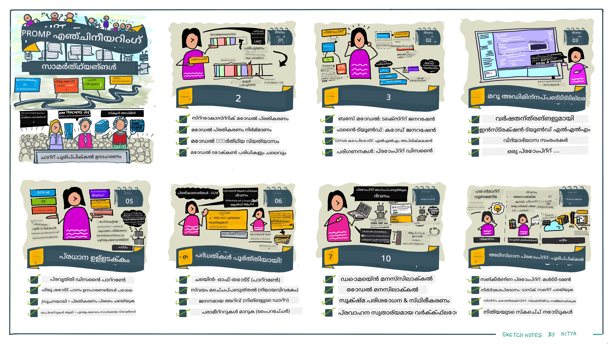
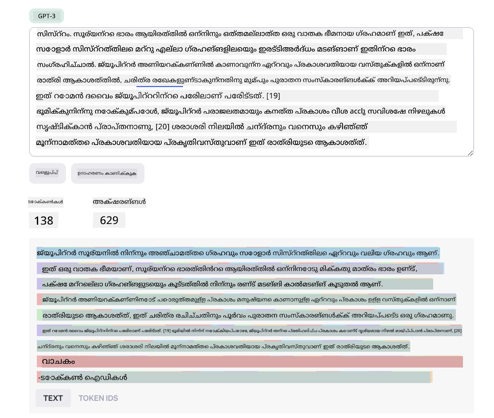
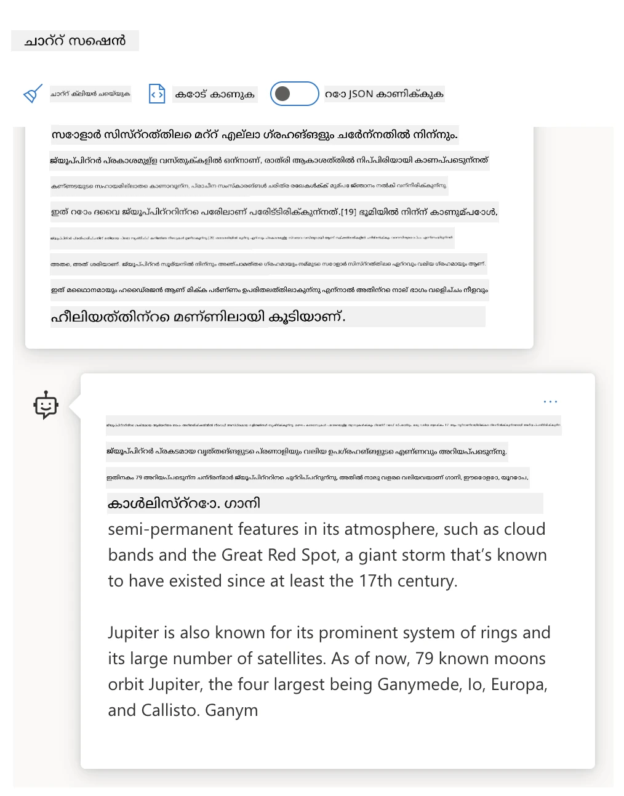
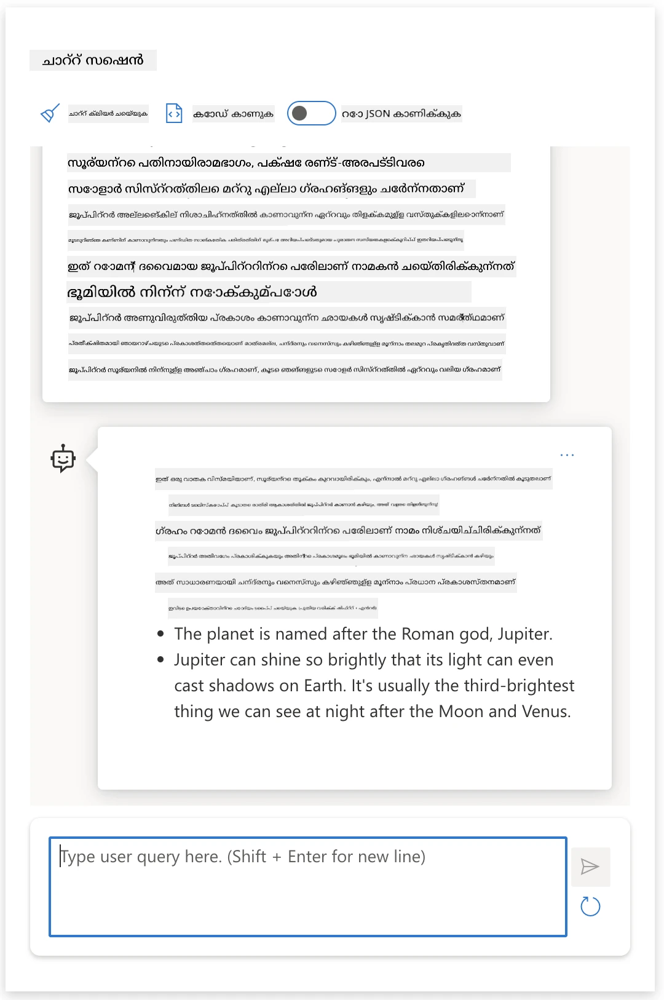
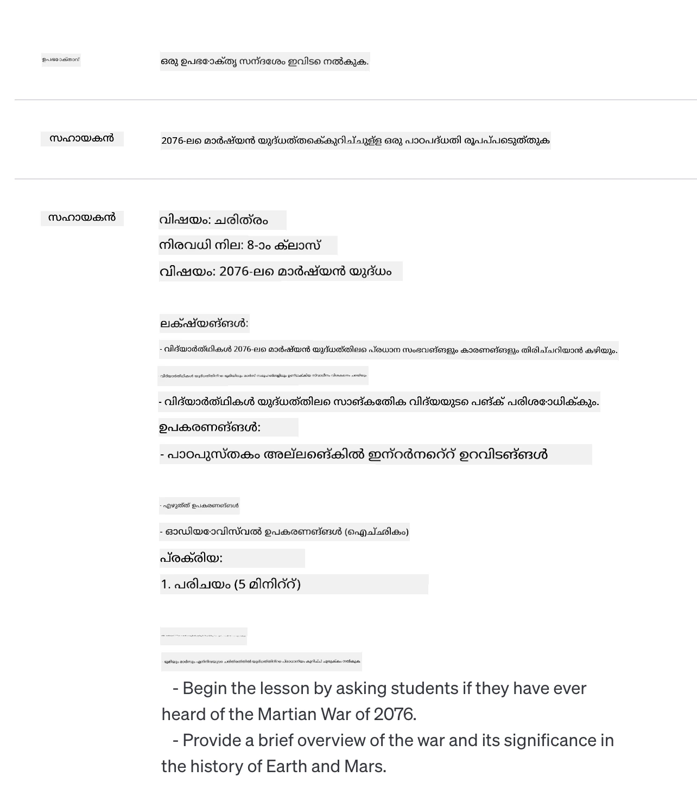
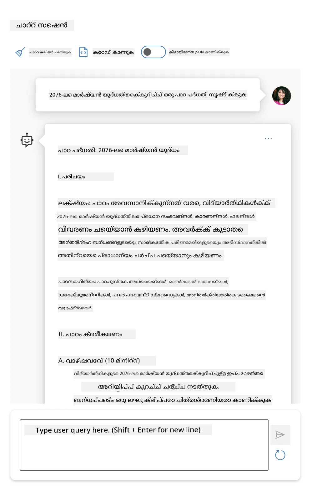
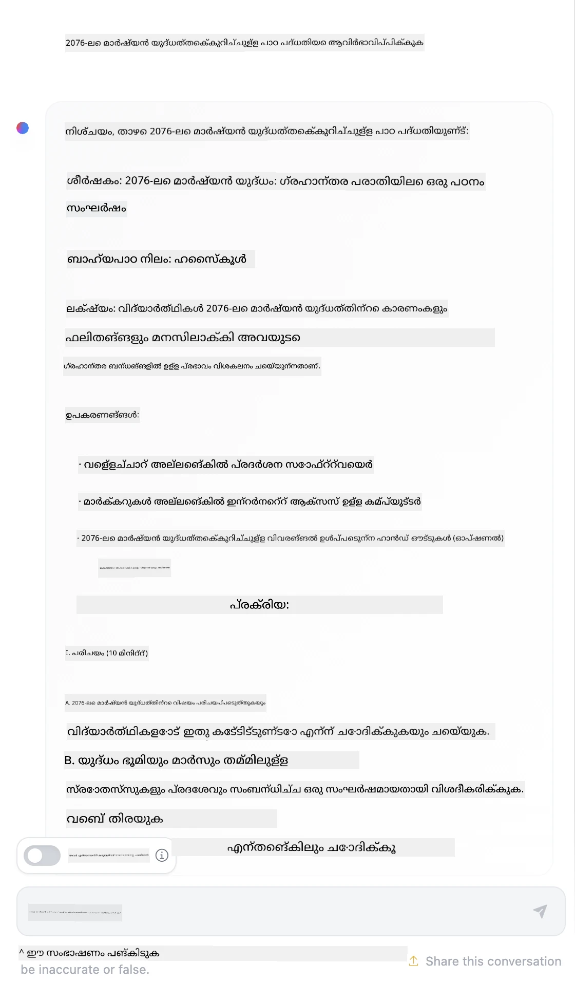

# പ്രॉംപ്്റ്റ് എഞ്ചിനീയറിംഗ് അടിസ്ഥാനങ്ങൾ

[](https://youtu.be/GElCu2kUlRs?si=qrXsBvXnCW12epb8)

## പരിചയം
ഈ മോഡ്യൂൾ ജനറേറ്റീവ് AI മോഡലുകളിൽ ഫലപ്രദമായ പ്രോംപ്‌റ്റുകൾ സൃഷ്ടിക്കുന്നതിനു ആവശ്യമായ അടിസ്ഥാന ആശയങ്ങളും സാങ്കേതിക വിദ്യകളും ഉൾക്കൊള്ളുന്നു. ഒരു LLM-ന് നിങ്ങൾ എഴുതുന്നത് ഇങ്ങനെ തന്നെയാണ് പ്രധാനപ്പെട്ടത്. ശ്രദ്ധയോടെ തയ്യാറാക്കപ്പെട്ട ഒരു പ്രോംപ്‌ട് മികച്ച മറുപടി നിലവാരം നേടാൻ സഹായിക്കാം. പക്ഷെ _പ്രോംപ്‌ട്_ എന്നും _പ്രോംപ്‌ട് എഞ്ചിനീയറിംഗ്_ എന്നും പറയുന്നത് എന്താണെന്ന് നിങ്ങള്‍ക്ക് അറിയാമോ? LLM-ന് അയക്കുന്ന പ്രോംപ്‌റ് _ഇൻപുട്ട്_ എങ്ങനെ മെച്ചപ്പെടുത്താം? ഈ ചാപ്റ്റർ കൂടിയാണ് ഈ ചോദ്യങ്ങൾക്ക് നാം പരിഹാരം കാണാൻ ശ്രമിക്കുന്നത്.

_ജനറേറ്റീവ് AI_ ഉപയോക്താവിന്റെ അഭ്യർത്ഥനകളെ അടിസ്ഥാനമാക്കി പുതിയ ഉള്ളടക്കം സൃഷ്ടിക്കാൻ (ഉദാഹരണത്തിന്, എഴുത്ത്, ചിത്രങ്ങൾ, ശബ്ദം, കോഡ് മുതലായവ) കഴിവുള്ളതാണ്. OpenAI-യുടെ GPT ("ജനറേറ്റീവ് പ്രീ-ട്രെയിൻഡ് ട്രാൻസ്ഫോർമർ") ശ്രേണിയായ വലിയ ഭാഷാ മോഡലുകൾ പോലുള്ള മോഡലുകൾ ഉപയോഗിച്ച് ഇത് സാധ്യമാക്കുന്നു, അവ സ്വാഭാവികഭാഷയിലും കോഡിലും പരിശീലിച്ചവയാണ്.

ഉപയോക്താക്കൾ ഇപ്പോൾ ഒരു ചാറ്റ് പോലുള്ള പരിചിതമായ അവസരങ്ങൾ ഉപയോഗിച്ച് ഈ മോഡലുകളുമായി ഇടപഴകാൻ കഴിയും, സാങ്കേതിക വൈദഗ്ധ്യവും പരിശീലനവും ആവശ്യമില്ലാതെ. മോഡലുകൾ _പ്രോംപ്‌റ് അധിഷ്ഠിതമാണ്_ – ഉപയോക്താക്കൾ ഒരു ടെകസ്റ്റ് ഇൻപുട്ട് (പ്രോംപ്‌റ്) അയയ്ക്കുകയും AI മടങ്ങിച്ചെത്തിക്കുന്ന മറുപടി (ബന്ധപൂർണ്ണം) ലഭിക്കുകയും ചെയ്യുന്നു. തുടർന്ന് അവർ "AI-വുമായ ചാറ്റ്" ഒന്നുകിൽ ഒരുമിച്ച് നടത്തുന്ന ബഹുചടങ്ങുള്ള സംഭാഷണങ്ങളിൽ അവരുടെ പ്രോംപ്‌ട് ക്രമചെയ്യുകയും മറുപടി അവരുടെ പ്രതീക്ഷാവകാശത്തിന് അനുയോജ്യം ആക്കുകയും ചെയ്യുന്നു.

"പ്രോംപ്‌റ്റുകൾ" ഇപ്പോൾ ജനറേറ്റീവ് AI അപ്ലിക്കേഷനുകളുടെ പ്രാഥമിക _പ്രോഗ്രാമിംഗ് ഇന്റർഫേസ്_ ആയി മാറുന്നു, മോഡലുകൾക്ക് എന്ത് ചെയ്യണമെന്ന് അറിയിക്കുകയും മടങ്ങീടുന്ന മറുപടികളുടെ ഗുണമേന്മയിൽ സ്വാധീനം ചെലുത്തുകയും ചെയ്യുന്നു. "പ്രോംപ്‌ട് എഞ്ചിനീയറിംഗ്" എന്നത് ഫലപ്രദവും സ്ഥിരതയുള്ള മറുപടികൾ വിതരണം ചെയ്യാൻ പ്രോംപ്‌റ്റുകളുടെ _ഡിസൈൻ_ മ്പയും _ഓപ്ടിമൈസേഷനും_ പ്രാധാന്യം പ്രദാനം ചെയ്യുന്ന വേഗത്തിൽ വളരുന്ന പഠന മേഖലയാണ്.

## പഠന ലക്ഷ്യങ്ങൾ

ഈ പാഠത്തിൽ നാം പ്രോംപ്‌ട് എഞ്ചിനീയറിംഗ് എന്താണെന്ന്, അത് എങ്ങനെ പ്രാധാന്യമുള്ളതാണെന്ന്, ഒരു വിദ്യാർത്ഥനും അപ്പ്ലിക്കേഷൻ ഉദ്ദേശ്യത്തിനും അനുയോജ്യമായ ഫലപ്രദമായ പ്രോംപ്‌റ്റുകൾ എങ്ങനെ രൂപകൽപ്പന ചെയ്യാമെന്നും പഠിക്കും. പ്രധാന ആശയങ്ങളും മികച്ച ആചരണങ്ങളും മനസ്സിലാക്കുകയും പ്രായോഗിക ഉദാഹരണങ്ങൾ ഉൾക്കൊഴുക്കിയ ഒരു ഇന്ററാക്റ്റീവ് Jupyter നോട്ട്ബുക് "സാൻഡ്ബോക്സ്" പരിസരത്തെക്കുറിച്ച് പഠിക്കുകയും ചെയ്യും.

ഈ പാഠത്തിന്റെ അവസാനം നമുക്ക് സാധിക്കാനുള്ളത്:

1. പ്രോംപ്‌ട് എഞ്ചിനീയറിംഗ് എന്താണെന്നും അത് പ്രാധാന്യമുള്ളതാകുന്നത് എന്തെന്നും വിശദീകരിക്കുക.
2. ഒരു പ്രോംപ്‌ട്ടിന്റെ ഘടകങ്ങൾ എന്തൊക്കെയാണെന്ന് വിവരിക്കുക.
3. പ്രോംപ്‌ട് എഞ്ചിനീയറിംഗിനുള്ള നല്ല രീതികളും സാങ്കേതിക വിദ്യകളും പഠിക്കുക.
4. പഠിച്ച സാങ്കേതിക വിദ്യകൾ ഉപയോഗിച്ച് യഥാർത്ഥ ഉദാഹരണങ്ങളിൽ പ്രയോഗം ചെയ്യുക, OpenAI എന്റ്പോയിന്റ് ഉപയോഗിച്ച്.

## പ്രധാന പദങ്ങൾ

പ്രോംപ്‌ട് എഞ്ചിനീയറിംഗ്: ആവശ്യമായ ഔട്ട്പുട്ടുകൾ സൃഷ്ടിക്കാൻ AI മോഡലുകളെ നയിക്കുന്ന ഇൻപുട്ടുകൾ രൂപകൽപ്പന ചെയ്യുകയും നവീകരിക്കുകയുമുള്ള പ്രവൃത്തി.
ടോക്കനൈസേഷൻ: ടെക്സ്റ്റ് ചെറിയ അകൂട്ടുകളായി (ടോക്കണുകൾ) മാറ്റുന്ന പ്രക്രിയ, ഒരു മോഡൽ അത് മനസ്സിലാക്കി പ്രോസസ് ചെയ്യാൻ കഴിയും.
നിർദ്ദേശം-ട്യൂൺ ചെയ്ത LLMകൾ: മറുപടി കൃത്യത മെച്ചപ്പെടുത്തുന്നതിനായി പ്രത്യേക നിർദ്ദേശങ്ങൾ ഉപയോഗിച്ച് ഫൈൻ-ട്യൂൺ ചെയ്ത വലിയ ഭാഷാ മോഡലുകൾ.

## പഠന സാൻഡ്ബോക്സ്

പ്രോംപ്‌ട് എഞ്ചിനീയറിംഗ് ഇപ്പോൾ ശാസ്ത്രത്തിൽക്കാൾ കലയിൽ കൂടുതൽ അടിസ്ഥാനമാണ്. ഉപയോഗം വിദഗ്ധതകളും ശുപാർശചെയ്യപ്പെട്ട സാങ്കേതിക വിദ്യകളും മോഡൽ-സവിശേഷ ഓപ്ടിമൈസേഷനുകളും സംയോജിപ്പിക്കുന്ന പരീക്ഷണാത്മക സമീപനം സ്വീകരിച്ച് ഈ അറിവ് മെച്ചപ്പെടുത്തേണ്ടതാണ്.

ഈ പാഠത്തിനൊപ്പം നൽകുന്ന Jupyter നോട്ട്ബുക്ക് നിങ്ങൾ പഠിക്കുന്ന കാര്യം പരീക്ഷിക്കാൻ _സാൻഡ്ബോക്സ്_ പരിസരമാകുന്നു - പഠിക്കുന്നതോടെ അല്ലെങ്കിൽ പാഠം അവസാനം വരുന്ന കോഡ് ചലഞ്ചിന്റെ ഭാഗമായും. വ്യായാമങ്ങൾ നടത്താൻ നിങ്ങൾക്കുള്ളത്:

1. **ഒരു Azure OpenAI API കീ** – വിന്യമാനം ചെയ്ത LLM-ന് സർവീസ് എൻപ്‌റോയിന്റ്.
2. **ഒരു പൈതൺ റൺടൈം** – നോട്ട്ബുക്ക് പ്രവർത്തിപ്പിക്കാനുള്ളത്.
3. **പ്രാദേശിക പരിസ്ഥിതി മാറ്റികൾ** – ഇപ്പോൾ [സജ്ജീകരണ്ഇ - SETUP](./../00-course-setup/02-setup-local.md?WT.mc_id=academic-105485-koreyst) നടപടിക്രമങ്ങൾ പൂർത്തിയാക്കുക.

നോട്ട്ബുക്ക് _ആരംഭകരി_ വ്യായാമങ്ങളുമായി വന്നു – പക്ഷേ നിങ്ങളുടെ സ്വന്തം _മാർക്ക്ഡൗൺ_ (വിവരണം) ഉം _കോഡ്_ (പ്രോംപ്‌റ് അഭ്യർത്ഥനകൾ) ഉള്ള സെക്ഷനുകളും ചേർക്കാൻ ഉദ്ദേശിക്കുന്നു, കൂടുതൽ ഉദാഹരണങ്ങൾ അഥവാ ആശയങ്ങൾ പരീക്ഷിച്ച് പ്രോംപ്‌ട് രൂപകൽപ്പനക്കുള്ള നിങ്ങളുടെ ന直യത മെറ്റെടുക്കാൻ.

## ചിത്രീകരിച്ച ഗൈഡ്

ഈ പാഠം ഉൾക്കൊള്ളുന്ന പ്രധാന വിഷങ്ങൾ അറിയാൻ തയ്യാറെടുക്കുമ്പോൾ വലിയ ചിത്രം കാണാൻ ആഗ്രഹിക്കുന്നുണ്ടോ? ഈ ചിത്രീകരിച്ച ഗൈഡ് കാണുക, ഇതിൽ പ്രധാന വിഷങ്ങൾക്കും നിങ്ങൾ ചിന്തിക്കേണ്ട പ്രധാന കാര്യങ്ങൾക്കും ഒരു ധാരണ ഉണ്ടാകും. പാഠത്തിന്റെ റോഡ്‌മാപ് കോർ ആശയങ്ങളും വെല്ലുവിളികളും മനസ്സിലാക്കി അനുയോജ്യമായ പ്രോംപ്‌ട് എഞ്ചിനീയറിംഗ് സാങ്കേതിക വിദ്യകളും മികച്ച പ്രയോഗങ്ങളും ഉൾക്കൊള്ളുന്നു. ഈ ഗൈഡിലെ "ഉന്നത സാങ്കേതിക വിദ്യകൾ" ഭാഗം ഈ പാഠക്രമത്തിലെ _അടുത്ത_ ചാപ്റ്ററിൽ ഉള്ള ഉള്ളടക്കം കാട്ടുന്നു.



## നമ്മുടെ സ്റ്റാർട്ടപ്പ്

ഇപ്പോൾ, _ഈ വിഷയം_ എങ്ങനെ നമ്മുടെ സ്റ്റാർട്ടപ്പ് ദൗത്യം [വിദ്യാഭ്യാസത്തിനായി AI നവീകരണം കൊണ്ടുവരാൻ](https://educationblog.microsoft.com/2023/06/collaborating-to-bring-ai-innovation-to-education?WT.mc_id=academic-105485-koreyst) ബന്ധപ്പെട്ടിരിക്കുന്നു എന്ന് സംസാരിക്കാം. നമ്മൾ _പേഴ്സണലൈസ്ഡ് പഠന_ എന്ന വിഷയത്തിൽ AI പ്രേരിത ആപ്ലിക്കേഷനുകൾ നിർമ്മിക്കാൻ ആഗ്രഹിക്കുന്നു - അതിനാൽ നമ്മുടെ ആപ്ലിക്കേഷൻ വിവിധ ഉപയോക്താക്കളെ പ്രോംപ്‌റുകൾ "ഡിസൈൻ" ചെയ്യുന്നത് എങ്ങനെ ആയിരിക്കാം എന്ന് ആലോചിക്കാം:

- **അഡ്മിനിസ്ട്രേറ്റർമാർ** AI-ന് _പരിപാടി ഡാറ്റ വിശകലനം ചെയ്ത് പ്രധാനപ്പെട്ടവ കണ്ടെത്താൻ_ ചോദിക്കും. AI ഫലങ്ങൾ സംഗ്രഹിക്കുകയോ കോഡിനായി വിസ്വലൈസ് ചെയ്യുകയോ കഴിയും.
- **വ്യവസായോപദേശകർ** AI-ന് _ടാർഗറ്റ് പ്രേക്ഷകർക്കുള്ള വിഷയം ഉൾപ്പെടുന്ന പാഠപദ്ധതി രൂപപ്പെടുത്താൻ_ ചോദിക്കും. AI നൽകിയാ വിധിയിലുള്ള വ്യക്തിഗത പദ്ധതി നിർമ്മിക്കും.
- **വിദ്യാർത്ഥികൾ** AI-ന് _പ്രയാസമുള്ള വിഷയത്തിൽ ഗൈഡ് ചെയ്യാൻ_ ചോദിക്കും. AI അതിന്റെ തലത്തിൽ അനുയോജ്യമായ പാഠങ്ങൾ, നിർദ്ദേശങ്ങൾ & ഉദാഹരണങ്ങൾ നൽകി വിദ്യാർത്ഥികളെ സഹായിക്കും.

ഇത് iceberg-ന്റെ മുക്കിൽ മാത്രമാണ്. [Prompts For Education](https://github.com/microsoft/prompts-for-edu/tree/main?WT.mc_id=academic-105485-koreyst) - വിദ്യാഭ്യാസ വിദഗ്ധർ ക്രമീകരിച്ച ഒരു ഓപ്പൺ-സോഴ്‌സ് പ്രോംപ്‌റ്റ് ലൈബ്രറി കാണുക - സാധ്യതകളുടെ വിപുലമായ അവകാശം നേടാൻ! _അവയിൽ ചിലത് സാൻഡ്ബോക്സിൽ ഓടിക്കുക അല്ലെങ്കിൽ OpenAI പ്ലേഗ്രൗണ്ടിൽ പരീക്ഷിച്ച് നോക്കൂ!_

<!--
LESSON TEMPLATE:
ഈ യൂണിറ്റ് കോർ ആശയം #1 ഉൾക്കൊള്ളണം.
ആശയം ഉദാഹരണങ്ങൾക്കും റഫറൻസിനും വഴക്കം കൊടുക്കുക.

ആശയം #1:
പ്രോംപ്‌ട് എഞ്ചിനീയറിംഗ്.
ഇത് നിർവചിച്ച്, എന്തിനാണ് ആവശ്യമെന്ന് വിശദീകരിക്കുക.
-->

## പ്രോംപ്‌ട് എഞ്ചിനീയറിംഗ് എന്താണ്?

നാം ഈ പാഠം തുടങ്ങി **പ്രോംപ്‌ട് എഞ്ചിനീയറിംഗ്** എന്ന് നിർവചിച്ചത് ഒരു ആപ്ലിക്കേഷൻ ഉദ്ദേശ്യത്തിനും മോഡലിനും യോജിച്ച സ്ഥിരതയുള്ള, ഗുണമേന്മയുള്ള മറുപടികൾ (കമ്പ്ലീഷനുകൾ) നൽകാൻ ടെക്സ്റ്റ് ഇൻപുട്ടുകൾ (പ്രോംപ്‌റ്റുകൾ) _ഡിസൈൻ ചെയ്യുകയും ഓപ്ടിമൈസ് ചെയ്യുകയും_ ചെയ്യുന്നതിന്റെ പ്രക്രിയയെന്നായിരുന്നു. ഇതിനെ രണ്ട് ഘട്ട പ്രക്രിയയായി പരിഗണിക്കാം:

- ഒരു മോഡലിനും ഉദ്ദേശ്യത്തിനും അനുയോജ്യമായ പ്രാഥമിക പ്രോംപ്‌ട് _ഡിസൈൻ ചെയ്യുക_
- മറുപടിയുടെ ഗുണമേന്മ മെച്ചപ്പെടുത്താൻ പ്രോംപ്‌ട് പുനപ്പരിശോധന ചെയ്ത് _നവീകരിക്കൽ_

ഇത് നിർബന്ധമായും പരീക്ഷണവും പിഴവുകളും ഉൾപ്പെടുന്ന പ്രക്രിയയാണ്, അOptimal ഫലങ്ങൾ നേടാൻ ഉപയോക്തൃ സൂക്ഷ്മതയും പരിശ്രമവും ആവശ്യമുള്ളതും. എങ്കിൽ ഇതിന് പ്രാധാന്യം എന്തുകൊണ്ട്? അതിന്റെ ഉത്തരത്തിന്, നമുക്ക് മൂന്ന് ആശയങ്ങൾ മനസ്സിലാക്കണം:

- _ടോക്കനൈസേഷൻ_ = മോഡൽ പ്രോംപ്‌ട് "എങ്ങനെ കാണുന്നു"
- _ബേസ് LLMs_ = ഫൗണ്ടേഷൻ മോഡൽ പ്രോംപ്‌ട് എങ്ങനെ "പ്രോസസ് ചെയ്യുന്നു"
- _നിർദ്ദേശം-ട്യൂൺ ചെയ്ത LLMs_ = മോഡൽ ഇപ്പോൾ "ടാസ്‌കുകൾ" എങ്ങനെ കാണുന്നു

### ടോക്കനൈസേഷൻ

ഒരിടത്ത് പ്രോംപ്‌റ്റുകൾ _ടോക്കണുകളുടേ ഒരു സീക്വൻസായി_ LLM കാണുന്നു, ഏറ്റവും നല്ല രീതിയിൽ മോഡലുകൾ (അഥവാ മോഡലിന്റെ പതിപ്പുകൾ) ഒരേ പ്രോംപ്‌ട് വ്യത്യസ്തമായി tokenize ചെയ്യാം. LLM-കൾ ടോക്കണുകൾകൊണ്ട് പരിശീലിക്കപ്പെട്ടതിനാൽ (നണ്ണി ടെക്സ്റ്റിൽ അല്ല), പ്രോംപ്‌റ്റുകൾ എങ്ങനെ ടോക്കണൈസ് ചെയ്യപ്പെടുന്നു എന്നത് സൃഷ്ടിക്കുന്ന മറുപടി ഗുണത്തിൽ നേരിട്ട് സ്വാധീനം ചെലുത്തുന്നു.

ടോക്കനൈസേഷൻ എങ്ങനെ പ്രവർത്തിക്കുന്നതിന്റെ ഒരു ധാരണക്കായി, താഴെ കാണിച്ചിരിക്കുന്ന [OpenAI Tokenizer](https://platform.openai.com/tokenizer?WT.mc_id=academic-105485-koreyst) പോലുള്ള ഉപകരണങ്ങൾ ശ്രമിക്കുക. നിങ്ങളുടെ പ്രോംപ്‌ട് പകർത്തി ഒട്ടിക്കുക - അത് ടോക്കണുകളായി എങ്ങനെ മാറ്റപ്പെട്ടിരിക്കുന്നത് നോക്കുക, പ്രധാനയായി വെളിപ്പെടുത്തലുകളും വാചകചിഹ്നങ്ങളും എങ്ങനെ കൈകാര്യം ചെയ്യപ്പെടുന്നതു ശ്രദ്ധിക്കുക. ഈ ഉദാഹരണം പഴയ LLM (GPT-3) കാണിക്കുന്നു - എന്നാൽ പുതിയ മോഡലിനു ഇത് പരീക്ഷിക്കുന്നത് ഒരു വ്യത്യസ്ത ഫലം ഉളവാക്കാം ശ്രദ്ധിക്കുക.



### ആശയം: ഫൗണ്ടേഷൻ മോഡലുകൾ

ഒരു പ്രോംപ്‌ട് tokenize ചെയ്ത ശേഷം, ["Base LLM"](https://blog.gopenai.com/an-introduction-to-base-and-instruction-tuned-large-language-models-8de102c785a6?WT.mc_id=academic-105485-koreyst) (അഥവാ ഫൗണ്ടേഷൻ മോഡൽ) മുഖ്യ ചുമതല ആയിരിക്കുന്ന ടോക്കണുകൾ അനുക്രമമായ പ്രവചിക്കുക എന്നതാണ്. LLM-കൾ വൻ ടെക്സ്റ്റ് ഡേറ്റാസെറ്റുകളിൽ പരിശീലനം നേടിയതിനാൽ, അവ ടോക്കണുകൾക്കിടയിലെ സ്ഥാനിഗഗണിതബന്ധം മനസ്സിലാക്കുകയും ആ പ്രവചനത്തിന് ആത്മവിശ്വാസത്തോടെ മുന്നോട്ട് പോവുകയും ചെയ്യും. അവ പ്രോംപ്‌ടിലോ ടോക്കണിലോ ഉള്ള വാക്കുകളുടെ _അർത്ഥം_ മനസ്സിലാക്കുന്നില്ല; അവക്ക് വെറും ഒരു മാതൃക കാണപ്പെടുന്നു, അത് അവരുടെ അടുത്ത പ്രവചനത്തോടൊപ്പം "പൂരിപ്പിക്കാം". ഉപയോക്തൃ ഇടപെടലോ മുൻ निर्धारित ഘടകമോ ഉണ്ടാകുന്നത് വരെ അവ തുടർന്നും പ്രവചനം നടത്താൻ കഴിയും.

പ്രോംപ്‌ട് അധിഷ്ഠിത പൂർത്തീകരണം എങ്ങനെ പ്രവർത്തിക്കുന്നു എന്ന് കാണాలോ? മുകളിൽ ചേർത്ത പ്രോംപ്‌ട് [Microsoft Foundry playground](https://ai.azure.com?WT.mc_id=academic-105485-koreyst) യിൽ അടിസ്ഥാന ക്രമീകരണങ്ങളോടെ ചേർക്കുക. സിസ്റ്റം പ്രോംപ്‌റ്റുകളെ വിവര അഭ്യർത്ഥനകളായി പാടുക - അതിനാൽ ഈ സാഹചര്യത്തിനു യോജിച്ച ഒരു പൂർത്തീകരണം നിങ്ങൾ കാണും.

എന്നാൽ ഉപയോക്താവ് നിർദ്ദിഷ്ടമായതോ എന്തെങ്കിലും ക്രമീകരണത്തിനോ യോജിച്ച ഒരു കാര്യമോ കാണാൻ ആഗ്രഹിച്ചാൽ? ഇതു കൊണ്ട് _നിർദ്ദേശം-ട്യൂൺ ചെയ്ത_ LLM-കൾ ചാര്‍ത്തപ്പെടുന്നു.



### ആശയം: നിർദ്ദേശം-ട്യൂൺ ചെയ്ത LLMകൾ

ഒരു [നിർദ്ദേശം-ട്യൂൺ ചെയ്ത LLM](https://blog.gopenai.com/an-introduction-to-base-and-instruction-tuned-large-language-models-8de102c785a6?WT.mc_id=academic-105485-koreyst) ഫൗണ്ടേഷൻ മോഡലിൽ ആരംഭിച്ച് ഉദാഹരണങ്ങൾ അല്ലെങ്കിൽ ഇൻപുട്ട്/ഔട്ട്‌പുട്ട് ജോഡികൾ (ഉദാഹരണത്തിന്, ബഹുചടങ്ങുള്ള "സന്ദേശങ്ങൾ") ഉപയോഗിച്ച് ഫൈൻ-ട്യൂൺ ചെയ്യുന്നു, അവയിൽ വ്യക്തമാക്കിയ നിർദേശങ്ങൾ ഉൾക്കൊള്ളാം - AI-ലെ മറുപടി ആ നിർദേശങ്ങൾ പിന്തുടരാൻ ശ്രമിക്കുന്നു.

ഇത് മനുഷ്യ പ്രതികരണത്തോടെ ശക്തിപ്പെടുത്തൽ പഠന (RLHF) പോലുള്ള സാങ്കേതിക വിദ്യകൾ ഉപയോഗിക്കുന്നു, ഇതുകൊണ്ട് മോഡൽ _നിർദേശങ്ങൾ പാലിക്കാൻ_യും _പ്രതികരണങ്ങളിൽ നിന്നും പഠിക്കാൻ_ കഴിയും, അതിനാൽ ഇത് പ്രായോഗിക ആപ്ലിക്കേഷനുകളിൽ കൂടുതൽ അനുയോജ്യവും ഉപയോക്തൃ ലക്ഷ്യങ്ങൾക്കു കൂടുതൽ അനുയോജ്യമുള്ള മറുപടികൾ നൽകും.

ഇത് പരീക്ഷിക്കാം – മുകളിൽ നൽകിയ പ്രോംപ്‌ട് വീണ്ടും പരിശോധിക്കുക, എന്നാൽ ഇപ്പോൾ _സിസ്റ്റം സന്ദേശം_ താഴെ പറയുന്ന നിർദേശത്തെ പ്രാധാന്യമാക്കി മാറ്റുക:

> _നൽകിയ ഉള്ളടക്കം ഒരു രണ്ടാം ക്ലാസ് വിദ്യാർത്ഥിക്കായി സംഗ്രഹിക്കുക. ഫലം ഒരു പാരഗ്രാഫിൽ 3-5 ബുള്ളറ്റ് പോയിന്റുകളോടെ സൂക്ഷിക്കുക._

ഫലത്തിന്റെ ഇപ്പോൾ ആഗ്രഹിക്കുന്ന ലക്ഷ്യത്തെയും സ്വരൂപിനെയും അനുസരിക്കുന്നതായി ക്രമീകരിച്ചിരിക്കുന്നത് കാണൂ? ഒരു പഠനോപദേശം ഇതു നേരിട്ട് അവരുടെ ക്ലാസ് സ്ലൈഡുകളിൽ ഉപയോഗിക്കാൻ കഴിയും.



## പ്രോംപ്‌റ്റ് എഞ്ചിനീയറിംഗ് എന്തിനാണ് വേണ്ടത്?

ഇപ്പോൾ മെട്രിക് മോഡലുകൾ പ്രോംപ്‌റ്റുകൾ എങ്ങനെ പ്രോസസ് ചെയ്യുന്നുവെന്ന് അറിയാമെങ്കിൽ, പ്രോംപ്‌റ് എഞ്ചിനീയറിംഗ് നമുക്ക് _എന്തിന്_ ആവശ്യമാണ് എന്നത് സംസാരിക്കാം. നിലവിലുള്ള LLMകൾ ഒരുപാട് വെല്ലുവിളികളെ ഉളവാക്കുന്നു, അതുകൊണ്ട് _വിശ്വസനീയവും സ്ഥിരതയുള്ള_ പൂർത്തീകരണങ്ങൾ നേടാൻ പ്രോംപ്‌റ്റ് നിർമ്മാണത്തിലും ഓപ്ടിമൈസേഷനിലും ശ്രമം ചെലുത്തേണ്ടി വരുന്നു. ഉദാഹരണങ്ങൾ:

1. **മോഡൽ മറുപടികൾ സാങ്കേതികസാധ്യതാപൂരിതമാണ്.** _അയ്യാതൊരു പ്രോംപ്‌ട്ട്_ വിവിധ മോഡലുകളിലും പതിപ്പുകളിലും വ്യത്യസ്ത മറുപടികൾ ഉൽപാദിപ്പിക്കാം. ഒപ്പം ഒരേ മോഡലിൽ വ്യത്യസ്ത സമയത്ത് പോലും വ്യത്യാസമുണ്ടാകും. _പ്രോംപ്‌ട് എഞ്ചിനീയറിംഗ് സാങ്കേതിക വിദ്യകൾ ഈ വ്യത്യാസങ്ങൾ കുറയ്ക്കുന്നതിന് മികച്ച സംരക്ഷണവും മേൽനോട്ടവും നൽകാൻ സഹായിക്കുന്നു_.

2. **മോഡലുകൾ മറുപടി കെട്ടിപ്പടുക്കാം.** മോഡലുകൾ _വലിയ, പക്ഷെ പരിമിതമായ_ ഡാറ്റാസെറ്റുകളിലേയ്ക്ക് പ്രാളം ചെയ്ത് ഉള്ളതിനാൽ հայտնի അറിവുകൾക്ക് പുറത്തുള്ള ആശയങ്ങളെക്കുറിച്ച് അവയെറിയില്ല. അതിനാൽ, അവ ചിലപ്പോൾ തെറ്റായ, കൽപ്പിതമായ, അല്ലെങ്കിൽ_known_ വിവരങ്ങൾക്ക് വിരുദ്ധമായ പൂർത്തീകരണങ്ങൾ നൽകാം. _പ്രോംപ്‌ട് എഞ്ചിനീയറിംഗ് സാങ്കേതിക വിദ്യ ഉപയോക്താക്കളെ ഇങ്ങനെ കട്ടിയുള്ള സംഭവങ്ങൾ തിരിച്ചറിയാൻ സഹായിക്കുകയും AI-നിൽ നിന്നുള്ള ഉദ്ധരണികൾക്കോ നിരീക്ഷണത്തിനോ ആവശ്യപ്പെടുകയും ചെയ്യുന്നു_.

3. **മോഡലുകളുടെ ശേഷികൾ വ്യത്യാസപ്പെടും.** പുതിയ മോഡലുകൾക്കും തലമുറകൾക്കും കൂടുതൽ കഴിവുകൾ ഉണ്ടാകും, പക്ഷേ മറ്റ് ലാഭനഷ്ടങ്ങളും ചില പ്രത്യേക സവിശേഷതകളും ഉണ്ടാക്കും. _പ്രോംപ്‌ട് എഞ്ചിനീയറിംഗ് മികച്ച പ്രവർത്തനരീതികളും പ്രവൃത്തി പ്രവാഹങ്ങളും വികസിപ്പിച്ച് മോഡൽ വ്യത്യാസങ്ങൾ അടയ്ക്കുകയും മാതൃക-നിർദ്ദേശനങ്ങളെ ഉൾക്കൊള്ളുന്ന സ്‌കെയിലബിൾ, സാരവുമായ മാർഗ്ഗങ്ങൾ രൂപകല്‍പ്പന ചെയ്യുകയും ചെയ്യുന്നു_.

ഇത് പ്രയോഗത്തിൽ എങ്ങനെ എന്നത് OpenAI അല്ലെങ്കിൽ Azure OpenAI പ്ലേഗ്രൗണ്ടിൽ കാണാം:

- വിവിധ LLM വിന്യാസങ്ങളുമായി (ഉദാ., OpenAI, Azure OpenAI, Hugging Face)അയ്യാതൊരു പ്രോംപ്‌റ് ഉപയോഗിക്കുക - വ്യത്യാസങ്ങൾ കാണാമോ?
- ഒരേ LLM വിന്യാസത്തിൽ (ഉദാ., Azure OpenAI പ്ലേഗ്രൗണ്ട്) പതിവായി ഒരേ പ്രോംപ്‌റ് ഉപയോഗിക്കുകയോ - ഇവയിലെ വ്യത്യാസങ്ങൾ എങ്ങനെ മാറി?

### കൽപ്പിതങ്ങളുടേ ഉദാഹരണം

ഈ കോഴ്‌സിൽ നാം **"കൽപ്പിതം"** എന്ന പദം ഉപയോഗിക്കുന്നത് LLMകൾ ചില അവസരങ്ങളിൽ പരിശീലന പരിധികളോ മറ്റ് പരിധികളോ കാരണം യാഥാർത്ഥ്യത്തിൽ തെറ്റായ വിവരങ്ങൾ സൃഷ്ടിക്കുന്ന സംഭവത്തെയാണ് സൂചിപ്പിക്കുന്നത്. പത്രപ്രവർത്തനങ്ങളിൽ അല്ലെങ്കിൽ ഗവേഷണ പേപ്പറുകളിൽ ഇത് _"ഹാളൂസിനേഷൻ"_ എന്നറിയാമെങ്കിലും ഞങ്ങൾ _"കൽപ്പിതം"_ പദം ഉപയോഗിക്കാൻ ശക്തമായി ശുപാർശ ചെയ്യുന്നു, കാരണം അതുമൂലം യന്ത്രmano-സ്ഥിതിക്ക് മനുഷ്യപോലൊരു സ്വഭാവം ചേർക്കുന്നതിൽ നിന്നു നമ്മുക്ക് ഒഴിവാകാം. ഇത് [ഉത്തരവാദി AI മാർഗ്ഗനിർദേശങ്ങൾ](https://www.microsoft.com/ai/responsible-ai?WT.mc_id=academic-105485-koreyst) അനുസരിച്ച് പരാമർശങ്ങൾ ഒഴിവാക്കുന്നതിലും സഹાયകമാണ്, ചില സാഹചര്യങ്ങളിൽ അപമാനകരമോ അപരിധാരമായോ ആക്കാവുന്ന പദങ്ങൾ ഒഴിവാക്കാമെന്നുവാദം.

കൽപ്പിതങ്ങൾ എങ്ങനെ പ്രവർത്തിക്കുന്നുവെന്ന് ധാരണ കിട്ടണോ? AI ഒരു പരിശീലന ഡാറ്റാസെറ്റിൽ കാണപ്പെടാത്ത അസാധുവായ വിഷയം കുറിച്ച് ഉള്ളടക്കം സൃഷ്ടിക്കാനുള്ള പ്രോംപ്‌ട് അനുകരിച്ച് ചിന്തിക്കുക. ഉദാഹരണത്തിന് - ഞാൻ ഈ പ്രോംപ്‌ട് പരീക്ഷിച്ചു:

> **പ്രോംപ്‌ട്:** 2076ലെ മാർഷ്യൻ യുദ്ധത്തെ കുറിച്ച് ഒരു പാഠപദ്ധതി തയ്യാറാക്കൂ.

വെബ് തിരച്ചിൽ എന്ന വിഷയത്തെ അടിസ്ഥാനമാക്കി മാർഷ്യൻ യുദ്ധങ്ങളെക്കുറിച്ചുള്ള പരിക്കഥകൾ (ഉദാ., ടെലിവിഷൻ പരമ്പരകൾ അല്ലെങ്കിൽ പുസ്തകങ്ങൾ) ഉണ്ട് - പക്ഷെ 2076ൽ ഒന്നുമല്ല. ആരോ പറയുന്നത് 2076 _ഭാവിയില്_ ആണ് എന്നതുകൊണ്ട് യഥാർത്ഥ സംഭവമായി അത് ഉൾപ്പെടുത്താനാകില്ല.


പക്ഷേ, വ്യത്യസ്ത LLM പ്രൊവൈഡർമാരോടുകൂടി ഈ പ്രോംപ് റൺ ചെയ്യുമ്പോൾ എന്ത് സംഭവിക്കും?

> **പ്രതികരണം 1**: OpenAI പ്ലേഗ്രൗണ്ട് (GPT-35)



> **പ്രതികരണം 2**: Azure OpenAI പ്ലേഗ്രൗണ്ട് (GPT-35)



> **പ്രതികരണം 3**: : Hugging Face Chat പ്ലേഗ്രൗണ്ട് (LLama-2)



പ്രതീക്ഷിച്ചതു പോലെ, ഓരോ മോഡലും (അഥവാ മോഡൽ പതിപ്പ്) ലളിതമായ വ്യത്യാസങ്ങളുള്ള പ്രതികരണങ്ങൾ ഉല്പാദിപ്പിക്കുന്നു, കാരണം ככלל സ്റ്റോചസ്റ്റിക് പെരുമാറ്റത്തിനും മോഡൽ ശേഷിയുമാണ് വ്യത്യാസങ്ങൾ. ഉദാഹരണത്തിന്, ഒരു മോഡൽ 8-ാം ക്ലാസ് വിദ്യാർത്ഥികളെയുടേത് ലക്ഷ്യമിടുമ്പോൾ മറ്റൊന്ന് ഹൈ-സ്കൂൾ വിദ്യാർത്ഥിയാകുമെന്ന് കരുതുന്നു. എന്നാൽ, ഈ മൂന്ന് മോഡലുകളും യാതൊരു അറിവില്ലാത്ത ഉപയോക്താവിനും ഈ സംഭവം യഥാർത്ഥമാണെന്ന് വിശ്വസിപ്പിക്കാൻ പ്രക്ഷിപ്തങ്ങളുടെ ഉത്പാദനം ചെയ്തിട്ടുണ്ട്.

പ്രോംപ് എഞ്ചിനീയറിംഗ് സാങ്കേതിക വിദ്യകൾ പോലെ _മെടാപ്രോംപ്റ്റിംഗ്_ , _ടെംപറേച്ചർ കോൺഫിഗറേഷൻ_ എന്നിവ ചിലമാത്രം മോഡൽ നിർമ്മാണങ്ങൾ കുറയ്ക്കാൻ സഹായിക്കും. പുതിയ പ്രോംപ് എഞ്ചിനീയറിംഗ് _ആർക്കിട്ടക്ചറുകൾ_ പ്രോംപ് ഫ്ലോയിൽ ഓരോ ഉപകരണങ്ങളും സാങ്കേതിക വിദ്യകളും എളുപ്പത്തിൽ ഉൾപ്പെടുത്തുന്നു, ഇതുവഴി ചില ഇതര ഫലങ്ങളെ കുറയ്ക്കാൻ.

## കേസ്സ്ടഡി: GitHub കോപൈലറ്റ്

ഒരു കേസ്സ്ടഡി നോക്കാം, യഥാർത്ഥ ലോക പരിഹാരങ്ങളിൽ പ്രോംപ് എഞ്ചിനീയറിംഗ് എങ്ങനെ ഉപയോഗിക്കപ്പെടുന്നു എന്ന് അറിയാൻ: [GitHub Copilot](https://github.com/features/copilot?WT.mc_id=academic-105485-koreyst).

GitHub Copilot നിങ്ങളുടെ "AI പങ്കാളി പ്രോഗ്രാമർ" ആണ് - ഇത് ടെക്സ്റ്റ് പ്രോംപ്റ്റുകൾ കോഡ് പൂർത്തീകരണങ്ങളായി മാറ്റുകയും നിങ്ങളുടെ ഡെവലപ്പ്മെന്റ് പരിസരത്തിലേക്ക് (ഉദാ., Visual Studio Code) സംയോജിപ്പിച്ചുകൊണ്ട് ഒരു നിരവധിയായി ഉപയോഗത്തിന് അനായാസമാകുന്നു. താഴെ കൊടുത്തിരിക്കുന്ന ബ്ലോഗ് പരമ്പരയിൽ രേഖപ്പെടുത്തിയതുപോലെ, ആദ്യ പരിഷ്‌ക്കരണം OpenAI Codex മോഡലിനെ അടിസ്ഥാനമാക്കി; എഞ്ചിനീയർമാർ മോഡലിനെ നന്നായി ഫൈന ട്യൂൺ ചെയ്യേണ്ടതിന്റെ ആവശ്യകതയും മികച്ച പ്രോംപ് എഞ്ചിനീയറിംഗ് സാങ്കേതിക വിദ്യകളും വികസിപ്പിക്കാൻ വേണ്ടത് വേഗത്തിൽ തിരിച്ചറിഞ്ഞു, കോഡ് ഗുണമേന്മ മെച്ചപ്പെടുത്താൻ. ജൂലൈയിൽ അവർ [Codex-നെ മറികടന്ന ഒരു മെച്ചപ്പെട്ട AI മോഡൽ അവതരിപ്പിച്ചു](https://github.blog/2023-07-28-smarter-more-efficient-coding-github-copilot-goes-beyond-codex-with-improved-ai-model/?WT.mc_id=academic-105485-koreyst), വേഗത്തിലായി നിർദ്ദേശങ്ങൾ നൽകുന്നതിനായി.

ഈ പോസ്റ്റുകൾ ശ്രേണിയിലൂടെ വായിച്ച് അവരുടെ പഠന യാത്ര പിന്തുടരുക.

- **മെയ് 2023** | [GitHub Copilot നിങ്ങളുടെ കോഡ് മനസിലാക്കുന്നതിൽ മെച്ചപ്പെടുത്തുന്നു](https://github.blog/2023-05-17-how-github-copilot-is-getting-better-at-understanding-your-code/?WT.mc_id=academic-105485-koreyst)
- **മെയ് 2023** | [GitHub ന്റെ അകത്തളങ്ങൾ: GitHub Copilot ന്റെ പിന്തുണയുള്ള LLM കളുമായി പ്രവർത്തനം](https://github.blog/2023-05-17-inside-github-working-with-the-llms-behind-github-copilot/?WT.mc_id=academic-105485-koreyst).
- **ജൂണ്‍ 2023** | [GitHub Copilotക്കായി മെച്ചപ്പെട്ട പ്രോംപ്റ്റുകൾ എങ്ങനെ എഴുതാം](https://github.blog/2023-06-20-how-to-write-better-prompts-for-github-copilot/?WT.mc_id=academic-105485-koreyst).
- **ജുലൈ 2023** | [GitHub Copilot Codex-നെ മറികടന്ന് മെച്ചപ്പെട്ട AI മോഡലുമായി](https://github.blog/2023-07-28-smarter-more-efficient-coding-github-copilot-goes-beyond-codex-with-improved-ai-model/?WT.mc_id=academic-105485-koreyst)
- **ജുലൈ 2023** | [ഒരു ഡെവലപ്പറുടെ പ്രോംപ് എഞ്ചിനീയറിംഗ് ഗുരുക്കഥയും LLM കളും](https://github.blog/2023-07-17-prompt-engineering-guide-generative-ai-llms/?WT.mc_id=academic-105485-koreyst)
- **സെപ് 2023** | [എന്റർപ്രൈസ് LLM ആപ്പ് നിർമ്മിക്കുന്നത് എങ്ങനെ: GitHub Copilot നിന്റെ പാഠങ്ങൾ](https://github.blog/2023-09-06-how-to-build-an-enterprise-llm-application-lessons-from-github-copilot/?WT.mc_id=academic-105485-koreyst)

നിങ്ങൾക്ക് അവരുടെ [എഞ്ചിനീയറിംഗ് ബ്ലോഗ്](https://github.blog/category/engineering/?WT.mc_id=academic-105485-koreyst) കൂടി പരിഷോധിക്കാം, ഇവിടെ പോലെ [ഈ പോസ്റ്റ്](https://github.blog/2023-09-27-how-i-used-github-copilot-chat-to-build-a-reactjs-gallery-prototype/?WT.mc_id=academic-105485-koreyst) മോഡലുകളും സാങ്കേതികവിദ്യകളും യഥാർത്ഥ ലോക ആപ്ലിക്കേഷനുകൾക്ക് _പ്രയോഗം_ ചെയ്യുന്ന രീതികൾ കാണിക്കുന്നു.

---

<!--
LESSON TEMPLATE:
ഈ യൂണിറ്റിൽ കോർ ആശയം #2 ഉൾപ്പെടുത്തണം.
ഉദാഹരണങ്ങളും റഫറൻസുകളുമായി ആശയം ശക്തിപ്പെടുത്തുക.

ആശയം #2:
പ്രോംപ് ഡിസൈൻ.
ഉദാഹരണങ്ങളോടുകൂടി വിശദീകരിച്ചിരിക്കുന്നു.
-->

## പ്രോംപ് നിർമ്മാണം

പ്രോംപ് എഞ്ചിനിയറിംഗ് എന്തുകൊണ്ട് പ്രധാനമാണെന്ന് നമുക്ക് മനസ്സിലായി - ഇപ്പോൾ പ്രോംപ്റ്റുകൾ എങ്ങനെ _നിർമിച്ചതാണ്_ എന്ന് മനസ്സിലാക്കാം, ഇതുവഴി കുത്തനെ ഫലപ്രദമായ പ്രോംപ് ഡിസൈൻ തന്ത്രങ്ങൾ വിലയിരുത്താൻ കഴിയൂ.

### അടിസ്ഥാന പ്രോംപ്

അടിസ്ഥാന പ്രോംപ്റ്റിൽ ആരംഭിക്കാം: മോഡലിന് മറ്റ് പശ്ചാത്തലമില്ലാതെ അയച്ച ഒരു ടെക്സ്റ്റ് ഇൻപുട്ട്. ഉദാഹരണമായി – അമേരിക്കൻ ദേശീയ ഗാനം ആദ്യവാക്കുകൾ OpenAI [Completion API](https://platform.openai.com/docs/api-reference/completions?WT.mc_id=academic-105485-koreyst) ലേക്ക് അയച്ചപ്പോൾ അത് ഉടനെ തുടർന്നുള്ള വരികൾ ഉപയോഗിച്ച് പ്രതികരണം _പൂർത്തിയാക്കി_, അടിസ്ഥാന പ്രവചന പെരുമാറ്റം കാണിച്ച്.

| പ്രോംപ് (ഇൻപുട്ട്) | പൂർത്തീകരണം (ഔട്പുട്ട്)                                                                                                                  |
| :----------------- | :----------------------------------------------------------------------------------------------------------------------------------------- |
| Oh say can you see | ഇത് നിങ്ങൾ "The Star-Spangled Banner," അമേരിക്കൻ ദേശീയ ഗാനം തുടങ്ങുന്നതായി തോന്നിപ്പോകുന്നു. പൂർണ്ണ വരികൾ ...                          |

### സമ്പ്രദായിക പ്രോംപ്

ഇപ്പോൾ അതിൽ പശ്ചാത്തലം, നിർദ്ദേശങ്ങൾ ചേർക്കാം. [Chat Completion API](https://learn.microsoft.com/azure/ai-services/openai/how-to/chatgpt?WT.mc_id=academic-105485-koreyst) നമുക്ക് പ്രോംപ്_Message കളായി സങ്കീർണ്ണമായി നിർമ്മിക്കാന്‍ അനുവദിക്കുന്നു:

- ഉപയോക്താവ് നൽകിയ ഇൻപുട്ടും സഹായകാരന്റെ പ്രതികരണവും പ്രതിഫലിപ്പിക്കുന്ന ഇൻപുട്ട്/ഔട്ട്പുട്ട് ജോടികൾ.
- സഹായകന്റെ പെരുമാറ്റം അല്ലെങ്കിൽ വ്യക്തിത്വം നിർണ്ണയിക്കുന്ന സിസ്റ്റം സന്ദേശം.

അഭ്യർത്ഥന താഴെക്കാണുന്ന രൂപത്തിലാണ്, _ടോക്കൺമാറ്റം_ പശ്ചാത്തലത്തിലേക്കും സംഭാഷണത്തിലേക്കും ബന്ധപ്പെട്ട വിവരങ്ങൾ ഫലപ്രമാണമായി പിടിച്ചെടുക്കുന്നു. സിസ്റ്റം കോൺടെക്സ്റ്റ് മാറ്റുന്നത് ഉപയോക്തൃ ഇൻപുട്ടുകൾ നൽകിയതിനേക്കാൾ പൂർത്തീകരണ ഗുണനിലവാരത്തിൽ പ്രത്യേകം സ്വാധീനമുണ്ട്.

```python
response = client.responses.create(
    model="gpt-4o-mini",
    input=[
        {"role": "system", "content": "You are a helpful assistant."},
        {"role": "user", "content": "Who won the world series in 2020?"},
        {"role": "assistant", "content": "The Los Angeles Dodgers won the World Series in 2020."},
        {"role": "user", "content": "Where was it played?"}
    ]
)
```

### നിർദ്ദേശപ്രദമായ പ്രോംപ്

മുൻ ഉദാഹരണങ്ങളിൽ, ഉപയോക്തൃ പ്രോംപ് ഒരു ലളിതമായ ടെക്സ്റ്റ് ക്വറിയായിരുന്നു, വിവരത്തിന് ആവശ്യമായ രീതിയിൽ വ്യാഖ്യാനിക്കാവുന്നത്. _നിർദ്ദേശം_ പ്രോംപ്റ്റുകളിലായി, ആ ടെക്സ്റ്റ് ഒരു ജോലിയെ വിശദമായി നിർവചിക്കാൻ ഉപയോഗിക്കാം, AI-യ്ക്ക് കൂടുതൽ മികച്ച മാർഗ്ഗനിർദ്ദേശം നൽകുന്നു. ഇവിടെ ഒരു ഉദാഹരണം:

| പ്രോംപ് (ഇൻപുട്ട്)                                                                                                                                                                                                                         | പൂർത്തീകരണം (ഔട്പുട്ട്)                                                                                                          | നിർദ്ദേശ തരം          |
| :------------------------------------------------------------------------------------------------------------------------------------------------------------------------------------------------------------------------------------- | :------------------------------------------------------------------------------------------------------------------------- | :------------------ |
| Write a description of the Civil War                                                                                                                                                                                                   | _ഒരു ലളിതമായ പാരഗ്രാഫ് തിരികെ തരുന്നു_                                                                                       | ലളിതം              |
| Write a description of the Civil War. Provide key dates and events and describe their significance                                                                                                                                     | _ഒരു പാരഗ്രാഫിനുശേഷം പ്രധാന തിയതികളുടെയും സംഭവങ്ങളുടെയും പട്ടിക, വിശദീകരണങ്ങൾക്കൊപ്പം_                                    | സങ്കീർണ്ണം           |
| Write a description of the Civil War in 1 paragraph. Provide 3 bullet points with key dates and their significance. Provide 3 more bullet points with key historical figures and their contributions. Return the output as a JSON file | _കൂടുതൽ വിശദാംശങ്ങൾ ഉള്ളുള്ള ഒരു ടെക്സ്റ്റ് ബോക്സ് ജേഎസ്ഒഎൻ രൂപത്തിലാണ് തിരികെ നൽകുന്നത്, സ്റ്റേറ്റ് ഫയലിലേക്ക് എളുപ്പത്തിൽ പകർത്താനും പരിശോധിക്കാനും കഴിയുന്ന രൂപത്തിൽ_ | സങ്കീർണ്ണം. രൂപകൽപ്പന ചെയ്തത്. |

## പ്രാഥമിക ഉള്ളടക്കം

മുൻ ഉദാഹരണങ്ങളിൽ, പ്രോംപ് വ്യക്തമായ അവസാനമായിരുന്നില്ല, LLMമുൻകൂട്ടി പരിശീലിച്ച ഡാറ്റാസെറ്റിലെ പ്രസക്ത ഭാഗം തന്നെ തീരുമാനിക്കാനും അനുവദിച്ചു. _പ്രാഥമിക ഉള്ളടക്കം_ ഡിസൈൻ മാതൃകയിൽ ഇൻപുട്ട് ടെക്സ്റ്റ് രണ്ടു ഭാഗങ്ങളായി വിഭജിക്കും:

- ഒരു നിർദ്ദേശം (അഴിയുക)
- പ്രസക്ത ഉള്ളടക്കം (അഴിയൽക്ക് സ്വാധീനം ചെലുത്തുന്നു)

"ഇത് രണ്ട് വാക്കുകളിൽ സംഗ്രഹിക്കുക" എന്ന് നിർദ്ദേശം നൽകിയ ഉദാഹരണമാണ് താഴെ.

| പ്രോംപ് (ഇൻപുട്ട്)                                                                                                                                                                                                                                                                                                                                                                                                                                                                                                                                                                                                                                                                                      | പൂർത്തീകരണം (ഔട്പുട്ട്)                                                                                                                                                                                                                                                                             |
| :-------------------------------------------------------------------------------------------------------------------------------------------------------------------------------------------------------------------------------------------------------------------------------------------------------------------------------------------------------------------------------------------------------------------------------------------------------------------------------------------------------------------------------------------------------------------------------------------------------------------------------------------------------------------------------------------------- | :---------------------------------------------------------------------------------------------------------------------------------------------------------------------------------------------------------------------------------------------------------------------------------------------- |
| Jupiter is the fifth planet from the Sun and the largest in the Solar System. It is a gas giant with a mass one-thousandth that of the Sun, but two-and-a-half times that of all the other planets in the Solar System combined. Jupiter is one of the brightest objects visible to the naked eye in the night sky, and has been known to ancient civilizations since before recorded history. It is named after the Roman god Jupiter.[19] When viewed from Earth, Jupiter can be bright enough for its reflected light to cast visible shadows,[20] and is on average the third-brightest natural object in the night sky after the Moon and Venus. <br/> **Summarize this in 2 short sentences** | Jupiter, സൂര്യാസ്ത്രീയിൽ അഞ്ചാമത്തെ ഗ്രഹം, സോളാർ സിസ്റ്റത്തിലെ ഏറ്റവും വലുത് കൂടിയാണ്, രാത്രിയിലെ ആകാശത്ത് ഏറ്റവും പ്രകാശമുള്ള വസ്തുക്കളിൽ ഒന്നായി അറിയപ്പെടുന്നു. ഇത് റോമൻ ദേവനായ ജൂപ്പിറ്ററിന്റെ പേരിലാണ്, ഇത് ഒരു വാതക ഭീമൻ ആണ്, അതിന്റെ ദ്രവ്യം സോളാർ സിസ്റ്റത്തിലെ മറ്റു എല്ലാ ഗ്രഹങ്ങളുടെ ദ്രവ്യത്തിന്റെ രണ്ട്-അര പാളി ആയിരിക്കുന്നു. |

പ്രാഥമിക ഉള്ളടക്കം വിവിധ രീതിയിൽ ലഭ്യമായ നിർദ്ദേശങ്ങൾ കൂടുതൽ ഫലപ്രദമാക്കാൻ ഉപയോഗിക്കാം:

- **ഉദാഹരണങ്ങൾ** - മോഡലിനോട് വ്യക്തമായ നിർദ്ദേശം നൽകുന്നതിന് പകരം ചെയ്യേണ്ടത് എന്താണെന്ന് ഉദാഹരണങ്ങൾ നൽകുക, മോഡലിനെ പാറ്റേൺ ആണ് തിരിച്ചറിയാൻ അനുവദിക്കുക.
- **ക്യൂകൾ** - നിർദ്ദേശത്തിന് ശേഷം "ക്യൂ" നൽകുക, ഈ ക്യൂ പൂർത്തീകരണത്തിനെക്കുറിച്ച് മുൻകൂർ സൂചന നൽകുകയും മോഡലിനെ കൂടുതൽ പ്രസക്തമായ പ്രതികരണങ്ങളിലേക്ക് നയിക്കുകയും ചെയ്യും.
- **ടെംപ്ലേറ്റുകൾ** - പലതവണ ആവർത്തിക്കാൻ കഴിയുന്ന 'റസിപ്പികൾ' ആണ്, പ്രോംപ്റ്റുകളിൽ ഉപയോഗിക്കുന്ന പ്ലേസ്ഹോൾഡറുകളുള്ള (വേരിയബിൾസ്) പോലുള്ളവ, പ്രത്യേക ഉപയോഗങ്ങളുമായി അനുയോജ്യമായ ഡാറ്റയോട് ഇച്ഛാനുസരണം

ഇതിനെ പ്രവർത്തനത്തിൽ നോക്കാം.

### ഉദാഹരണങ്ങൾ ഉപയോഗിച്ച്

ഇതൊരു സമീപനമാണ്, പ്രാഥമിക ഉള്ളടക്കം ഉപയോഗിച്ച് മോഡലിന് ഒരു നിർദേശത്തിനായുള്ള ആഗ്രഹിച്ച ഔട്ട്പുട്ടിന്റെ ചില ഉദാഹരണങ്ങൾ 'ചാറുക', ആ Patterns തിരിച്ചറിയാൻ അപരിചിതമായി അനുവദിക്കുക. നൽകിയ ഉദാഹരണങ്ങളുടെ എണ്ണത്തിൻറെ അടിസ്ഥാനത്തിൽ 0-ഷോട്ട്, ഒന്ന്-ഷോട്ട്, കുറച്ച്-ഷോട്ട് പ്രോംപ്റ്റിംഗ് തുടങ്ങി പലതും ഉണ്ടാകാം.

പ്രോംപ് ഇപ്പോൾ ഇനിപ്പറയുന്ന മൂന്നു ഘടകങ്ങളടങ്ങിയുണ്ട്:

- ഒരു പ്രവർത്തന വിവരണം
- ആഗ്രഹിക്കുന്ന ഔട്ട്‌പുട്ടിന്റെ കുറച്ച് ഉദാഹരണങ്ങൾ
- പുതിയ ഒരു ഉദാഹരണത്തിന്റെ തുടക്കം (ഇത് അനിവാര്യമായ ഒരു പ്രവർത്തന വിവരണമായി മാറും)

| പഠന തരം | പ്രോംപ് (ഇൻപുട്ട്)                                                                                                                                        | പൂർത്തീകരണം (ഔട്പുട്ട്)         |
| :------------ | :---------------------------------------------------------------------------------------------------------------------------------------------------- | :-------------------------- |
| സീറോ-ഷോട്ട്   | "The Sun is Shining". സ്പാനിഷിലേക്ക് തർജ്ജമചെയ്യുക                                                                                                  | "El Sol está brillando".    |
| വൺ-ഷോട്ട്     | "The Sun is Shining" => ""El Sol está brillando". <br> "It's a Cold and Windy Day" =>                                                                 | "Es un día frío y ventoso". |
| ഫ്യൂ-ഷോട്ട്    | കളിക്കാർ ബേസുകൾ ഓടി => ബേസ്ബോൾ <br/> കളിക്കാർ എച്ച് തട്ടി => ടെന്നീസ് <br/> കളിക്കാർ സിക് സ്റ്റ്രൈക്ക് => ക്രികറ്റ <br/> കളിക്കാർ സ്ലാം-ഡങ്ക് ചെയ്തു => | ബാസ്കറ്റ്ബോൾ                  |
|               |                                                                                                                                                       |                             |

സീറോ-ഷോട്ട് പ്രോംപ്റ്റിൽ നമുക്ക് വ്യക്തമായ നിർദ്ദേശം ("സ്പാനിഷിലേക്ക് തർജ്ജമ ചെയ്യുക") നൽകേണ്ടി വന്നുവെങ്കിലും, വൺ- ഷോട്ട് ഉദാഹരണത്തിൽ അത് സ്വയം തിരിച്ചറിയപ്പെടുന്നു എന്ന് ശ്രദ്ധിക്കുക. ഫ്യൂ- ഷോട്ട് ഉദാഹരണത്തിൽ കൂടുതൽ ഉദാഹരണങ്ങൾ ചേർക്കുന്നത് നിർദ്ദേശങ്ങളും കൂടാതെ മോഡലുകൾക്ക് കൃത്യമായ നിഗമനങ്ങൾ നടത്താൻ സഹായിക്കുന്നു.

### പ്രോംപ് ക്യൂകൾ

പ്രാഥമിക ഉള്ളടക്കം ഉപയോഗിക്കുന്ന മറ്റൊരു സാങ്കേതിക വിദ്യ _ക്യൂകൾ_ നൽകുകയാണ്. ഈ സാഹചര്യത്തിൽ, മോഡലിന് മനസ്സിലാകാനായി ആവശ്യമായ പ്രതികരണ ഫോർമാറ്റ് പ്രതിഫലിപ്പിക്കുന്ന ഒരു തൊട്ടടുത്തിട്ടുള്ള നിധാന്യം നൽകുകയാണ്‌. ശേഷം മോഡലിന് അത് തുടരണം എന്ന് 'ക്യൂ' എടുത്തുകൊള്ളുന്നു.

| ക്യൂകളുടെ എണ്ണം | പ്രോംപ് (ഇൻപുട്ട്)                                                                                                                                                                                                                                                                                                                                                                                                                                               | പൂർത്തീകരണം (ഔട്പുട്ട്)                                                                                                                                                                                                                                                                                       |
| :------------- | :----------------------------------------------------------------------------------------------------------------------------------------------------------------------------------------------------------------------------------------------------------------------------------------------------------------------------------------------------------------------------------------------------------------------------------------------------------- | :-------------------------------------------------------------------------------------------------------------------------------------------------------------------------------------------------------------------------------------------------------------------------------------------------------- |
| 0              | Jupiter is the fifth planet from the Sun and the largest in the Solar System. It is a gas giant with a mass one-thousandth that of the Sun, but two-and-a-half times that of all the other planets in the Solar System combined. Jupiter is one of the brightest objects visible to the naked eye in the night sky, and has been known to ancient civilizations since before recorded history. <br/>**Summarize This**                                       | Jupiter നമ്മുടെ സോളാർ സിസ്റ്റത്തിലെ ഏറ്റവും വലിയ ഗ്രഹവും സൂര്യനിൽ അഞ്ചാമത്തും ആണ്. ഇത് ഒരു വാതക ഭീമനാണ്, സൂര്യന്റെ വള്ള 1/1000 ഭാഗമാണെങ്കിലും എല്ലാ മറ്റു ഗ്രഹങ്ങളുടെ ദ്രവ്യം ചേർത്തതേക്കാൾ ഭാരം കൂടിയതാണ്. പണ്ടേകാല സംസ്കാരങ്ങൾ ജൂപ്പിറ്ററെ അറിയുന്നു, ഇത് രാത്രിയിലെ ആകാശത്തിൽ എളുപ്പത്തിൽ കാണപ്പെടുന്ന വസ്തുവാണ്. |
| 1              | Jupiter is the fifth planet from the Sun and the largest in the Solar System. It is a gas giant with a mass one-thousandth that of the Sun, but two-and-a-half times that of all the other planets in the Solar System combined. Jupiter is one of the brightest objects visible to the naked eye in the night sky, and has been known to ancient civilizations since before recorded history. <br/>**Summarize This** <br/> What we learned is that Jupiter | സൂര്യനു സമീപമുള്ള അഞ്ചാമത്തെ ഗ്രഹവും സോളാർ സിസ്റ്റത്തിലെ ഏറ്റവും വലിയ ഗ്രഹവുമായ ജൂപ്പിറ്റർ ഒരു വാതക ഭീമനാണ്, സൂര്യന്റെ വള്ള 1/1000 ഭാഗവും, എന്നാൽ മറ്റു എല്ലാ ഗ്രഹങ്ങളുടെ ദ്രവ്യത്തിന്റെ രണ്ട്-അരപാളി ഭാരമുള്ളതാണ്. ഇത് എളുപ്പത്തിൽ തോന്നാവുന്ന പ്രകാശമുള്ളത് കൂടിയാണ്, പ്രാചീനകാല മുതൽ അറിയപ്പെട്ടിരിക്കുന്നു.                        |

| 2              | ജൂപിറ്റർ സൂര്യനിൽ നിന്നും അഞ്ചാമത്തെ ഗ്രഹവും സൗരയൂഥത്തിലെ ഏറ്റവും വലിയ ഗ്രഹവുമാണ്. അത് സൂര്യന്റെ മാസ്സ് ഒരു ആയിരം ഭാഗങ്ങളുടെ ഒന്നാണ്, എന്നാൽ മറ്റു എല്ലാ ഗ്രഹങ്ങളുടെ സംയുക്ത മാസ്സിന്റെ രണ്ടു അടവും അഞ്ഞഞ്ചും ആണ്. ജൂപിറ്റർ രാത്രി ആകാശത്തിൽ കണകിടാവയിൽ കാണപ്പെടുന്ന ഏറ്റവും പ്രഭാപൂർണ വസ്തുക്കളിൽ ഒന്നാണ്, ചരിത്ര രേഖകൾ തുടങ്ങുന്നതിന് മുമ്പ് തന്നെ പുരാതന സിവിലൈസേഷനുകളിൽ ഇത് അറിയപ്പെട്ടിരുന്നതാണ്. <br/>**സംക്ഷേപിക്കുക** <br/> നമ്മൾ പഠിച്ച മുകളിൽ 3 വസ്തുതകൾ:         | 1. ജൂപിറ്റർ സൂര്യനിൽ നിന്നും അഞ്ചാമത്തെ ഗ്രഹവും സൗരയൂഥത്തിലെ ഏറ്റവും വലിയ ഗ്രഹവുമാണ്. <br/> 2. അത് സൂര്യന്റെ മാസ്സ് ഒരു ആയിരം ഭാഗങ്ങളിലെ ഒന്നാണ്...<br/> 3. ജൂപിറ്റർ പുരാതനകാലം മുതൽ കണകിടാവിൽ കാണപ്പെട്ടിരിക്കുന്നു ...                                                                       |
|                |                                                                                                                                                                                                                                                                                                                                                                                                                                                              |                                                                                                                                                                                                                                                                                                           |

### പ്രോമ്പ്റ്റ് ടെംപ്ലേറ്റുകൾ

പ്രോമ്പ്റ്റ് ടെംപ്ലേറ്റ് എന്ന് പറയുന്നത് ആവശ്യമുള്ളപ്പോൾ വീണ്ടും ഉപയോഗിക്കാൻ ശേഷിയുള്ള _പ്രോമ്പ്റ്റിന് വേണ്ടി മുൻകൂട്ടി നിർവചിച്ചിരിക്കുന്ന വിഭവമുടയ രീതിയാണ്_. ഏറ്റവും ലളിതമായ രൂപത്തിൽ, ഇത് ഒരു പ്രോമ്പ്റ്റ് ഉദാഹരണങ്ങളുടെ സമാഹാരമാണ്, ഉദാ. [OpenAI-യിൽ നിന്നുള്ള ഇവിടെ കാണാൻ](https://cookbook.openai.com/examples/gpt4-1_prompting_guide?WT.mc_id=academic-105485-koreyst), ഇതു ഇന്ററാക്ടീവ് പ്രോമ്പ്റ്റ് ഘടകങ്ങളും (ഉപയോക്തൃയും സിസ്റ്റം സന്ദേശങ്ങളും) API-നിർവ്വഹിച്ച അഭ്യർത്ഥനാ ഫോർമാറ്റും പാലിക്കുന്നു - ഇത് പുനരുപയോഗം പിന്തുണയ്ക്കുന്നു.

കൂടുതൽ സങ്കീർണമായ രൂപത്തിൽ [LangChain-ൽ നിന്നുള്ള ഈ ഉദാഹരണം](https://python.langchain.com/docs/concepts/prompt_templates/?WT.mc_id=academic-105485-koreyst) _പ്ലെയ്‌സ്‌ഹോൾഡറുകൾ_ സ്വീകരിക്കുന്നു, അവ ഉപയോക്തൃ ഇൻപുട്ട്, സിസ്റ്റം സാന്ദർശ്യങ്ങൾ, ബാഹ്യ ഡാറ്റ സ്രോതസ്സുകൾ മുതലായവയിൽ നിന്നുള്ള ഡാറ്റ ഉപയോഗിച്ച്‍റെ സ്‌ഥാനാർത്ഥം ചെയ്യാൻ കഴിയും, ഇതിനാൽ ഡൈനാമിക് ആയി പ്രോമ്പ്റ്റ് സൃഷ്ടിക്കുവാൻ സാധിക്കുന്നു. ഇത് ഒരു ലൈബ്രറി സൃഷ്ടിക്കുവാൻ സാധിക്കുന്നു, അവ **പ്രോഗ്രാമാറ്റിക് ആയി** യൂസ് ചെയ്തു അളവിൽ സ്ഥിരതയുള്ള ഉപയോക്തൃ അനുഭവങ്ങൾ നയിക്കാൻ കഴിയും.

ഒടുവിൽ, ടെംപ്ലേറ്റുകളുടെ യഥാർത്ഥ മൂല്യം ആ കാഴ്ചപ്പാടുകളിൽ കാണുമുണ്ട് - പ്രോമ്പ്റ്റ് ലൈബ്രറികൾ സൃഷ്ടിച്ച് പ്രസിദ്ധീകരിക്കാനുള്ള ശേഷി വിശകലനം ചെയ്യുന്നപ്പോൾ - എവിടെ പ്രോമ്പ്റ്റ് ടെംപ്ലേറ്റ് ഇപ്പോൾ _പ്രയോഗ-നിർവചിത സാന്ദർശ്യങ്ങൾ_ അല്ലെങ്കിൽ ഉദാഹരണങ്ങൾ പ്രതിഫലിപ്പിക്കാൻ _ഓപ്റ്റിമൈസ്ഡ്_ ആയി മാറുന്നു, ഇത് ടാർഗට් ചെയ്ത ഉപയോക്തൃ പ്രേക്ഷകർക്ക് പ്രതികരണങ്ങൾ കൂടുതൽ പ്രസക്തവും കൃത്യവുമാകുന്നു. [Prompts For Edu](https://github.com/microsoft/prompts-for-edu?WT.mc_id=academic-105485-koreyst) റീപോസിറ്ററി ഈ സമീപനത്തിന് ഒരു മികച്ച ഉദാഹരണമാണ്, വിദ്യാഭ്യാസ രംഗത്തെ ലക്ഷ്യങ്ങളെ പരിഗണിച്ച് പാഠ രീതീകരണം, പാഠ്യപദ്ധതി രൂപകൽപ്പന, വിദ്യാർത്ഥി ട്യൂട്ടറിംഗ് എന്നിവയ്ക്കുള്ള പ്രോംബ്റ്റ് ലൈബ്രറി നിർവചിക്കുകയാണ്.

## പിന്തുണയ്ക്കുന്ന ഉള്ളടക്കം

പ്രോമ്പ്റ്റ് നിർമ്മാണം ഒരു നിർദ്ദേശം (ടാസ്‌ക്) ഉം ഒരു ലക്ഷ്യം (പ്രാഥമിക ഉള്ളടക്കം) ഉം ഉള്ളതായി നമുക്ക് കരുതി നോക്കാം, അപ്പോൾ _രണ്ടാം നിലവാര ഉള്ളടക്കം_ outputനെ ഏതാണ്ടോ വിധം **പ്രഭാവിതമാക്കാൻ** ഞങ്ങൾ നൽകുന്ന കൂടതൽ സാന്ദർശ്യങ്ങളോട് സമാനമാണ്. ഇത് ട്യൂനിംഗ് പാരാമീറ്ററുകൾ, ഫോർമാറ്റിംഗ് നിർദ്ദേശങ്ങൾ, വിഷയം ടാക്സണോമികൾ തുടങ്ങിയവ ആകാം, മോഡലിന് വേണ്ടി തിരിച്ചറിവ് നൽകാനും അവരുടെ അനുയോജ്യമായ ഉത്തരങ്ങൾ നൽകാനും സഹായിക്കുന്നു.

ഉദാഹരണത്തിന്: കോഴ്സ് നിർദ്ദേശിക ഉൽപ്പന്നം (നാമം, വിവരണം, നിരപ്പ്, മെടാടാറ്റ മെറ്റാഗുകൾ, ഇൻസ്ട്രക്ടർ എന്നിവ ഉൾപ്പെടെ) ഉള്ള കോഴ്സുകളുടെ സമാഹാരം:

- "Fall 2023 കോഴ്സ് നിർദ്ദേശിക സംക്ഷേപം" എന്ന് നിർദ്ദേശം നിർവചിക്കാം
- ആവശ്യമായ output ന്റെ കുറച്ച് ഉദാഹരണങ്ങൾ നൽകുന്നതിന് പ്രാഥമിക ഉള്ളടക്കം ഉപയോഗിക്കാം
- പ്രധാന 5 "ടാഗുകൾ" കണ്ടെത്താൻ രണ്ടാമനുള്ള ഉള്ളടക്കം ഉപയോഗിക്കാം

ഇപ്പോൾ മോഡൽ കുറച്ച് ഉദാഹരണങ്ങളിൽ കാണിച്ച ചിത്രത്തിൽ സംക്ഷേപം നൽകാൻ കഴിയും - പക്ഷേ ഫലത്തിൽ നിരവധി ടാഗുകൾ ഉണ്ടെങ്കിൽ, രണ്ടാമനുള്ള ഉള്ളടക്കത്തിൽ അറിയിച്ച 5 ടാഗുകൾ മുൻഗണന നൽകുക കഴിയും.

---

<!--
പാഠ്യരൂപം:
ഈ യൂണിറ്റ് മൂല അംശം #1 ആണു പരിഗണിക്കുക.
ഉദാഹരണങ്ങളും റഫറൻസുകളും നൽകി ആശയം ശക്തിപ്പെടുത്തുക.

ആശയം #3:
പ്രോമ്പ്റ്റ് എഞ്ചിനിയറിംഗ് സാങ്കേതികതകൾ.
പ്രോമ്പ്റ്റ് എഞ്ചിനിയറിംഗിനുള്ള ചില അടിസ്ഥാന സാങ്കേതികതകൾ എന്തുകാണുന്നു?
ചില അഭ്യാസങ്ങളിലൂടെയും അത് പ്രതിപാദിക്കുക.
-->

## പ്രോമ്പ്റ്റിംഗ് മികച്ച പ്രാക്ടീസുകൾ

ഇപ്പോൾ നമുക്ക് അറിയാം പ്രോമ്പ്റ്റുകൾ എങ്ങനെ _നിർമ്മിക്കാം_, ആശയക്കുഴപ്പം ഇല്ലാതെ _ഡിസൈൻ_ ചെയ്യുമെന്നാണ് ചിന്തിക്കുന്നത്. ഇത് രണ്ട് ഭാഗങ്ങളിൽ ചിന്തിക്കാം - ശരിയായ _മനോഭാവം_ കൈവരിക്കുക, ശരിയായ _സാങ്കേതികതകൾ_ ഉപയോഗിക്കുക.

### പ്രോമ്പ്റ്റ് എഞ്ചിനിയറിംഗ് മനോഭാവം

പ്രോമ്പ്റ്റ് എഞ്ചിനിയറിംഗ് ശ്രമം-പരിശോധന പ്രക്രിയയാണ്, അതിനാൽ മൂന്ന് വ്യാപക മാർഗ്ഗ നിർദേശങ്ങൾ ശ്രദ്ധിക്കണം:

1. **ഡൊമെയ്ൻ മനസ്സിലാക്കൽ പ്രസക്തമാണ്.** പ്രതികരണ കൃത്യതയും പ്രസക്തിയും ആ അപേക്ഷയുടേയും ഉപയോക്താക്കളുടേയും പ്രവർത്തിക്കുന്ന _ഡൊമെയ്ൻ_-ന്റെ ഫംഗ്ഷനാണ്. നിങ്ങളുടെ ഇൻറ്യൂഷനും ഡൊമെയ്ൻ വിദഗ്ദ്ധതയും വിനിയോഗിച്ച് സാങ്കേതികതകൾ കസ്റ്റമൈസ് ചെയ്യുക. ഉദാഹരണത്തിന്, നിങ്ങളുടെ സിസ്റ്റം പ്രോമ്പ്റ്റുകളിൽ _ഡൊമെയ്ൻ പ്രത്യേക വ്യക്തിത്വം_ നിർവചിക്കുക, അല്ലെങ്കിൽ ഉപയോക്തൃ പ്രോമ്പ്റ്റുകളിൽ _ഡൊമെയ്ൻ പ്രത്യേക ടെംപ്ലേറ്റുകൾ_ ഉപയോഗിക്കുക. ഡൊമെയ്ൻ പ്രത്യേക സാന്ദർശ്യങ്ങൾ പ്രതിഫലിപ്പിക്കുന്ന രണ്ടാമനുള്ള ഉള്ളടക്കം നൽകുക, അല്ലെങ്കിൽ മോഡലിനെ പരിചിതമായ ഉപയോഗ മാതൃകകളിലേക്ക് നയിക്കാൻ _ഡൊമെയ്ൻ-സാന്ദർശ്യ സൂചനകൾ_ ഉപയോഗിക്കുക.

2. **മോഡൽ മനസ്സിലാക്കൽ പ്രസക്തമാണ്.** മോഡലുകൾ സ്വഭാവം പ്രകാരം സ്റ്റോകാസ്റ്റിക് ആണ് എന്ന് നമുക്ക് അറിയാം. പക്ഷേ മോഡൽ നടപ്പാക്കലുകൾ പ്രയോഗിക്കുന്ന പരിശീലന ഡാറ്റാസറ്റ് (പ്രീ-ട്രെയിൻഡ് അറിവ്), സവിശേഷതകൾ (API/SDK വഴി), സവിശേഷ തരം ഉള്ളടക്കം (കോഡ്, ചിത്രം, എഴുത്ത്) എന്നിവയിൽ വ്യത്യാസപ്പെട്ടിരിക്കും. ഉപയോഗിക്കുന്ന മോഡലിന്റെ ശക്തികളും ദുര്ബലതകളും മനസ്സിലാക്കുകയും അത് അടിസ്ഥാനമാക്കി ടാസ്ക്കുകൾ മുൻഗണന നൽകുകയും മോഡൽ കഴിവുകൾ ആധാരമാക്കി _കസ്റ്റം ടെംപ്ലേറ്റുകൾ_ നിർമ്മിക്കുകയും ചെയ്യുക.

3. **പരിശോധനയും സ്ഥിരീകരണവും പ്രസക്തമാണ്.** മോഡലുകൾ മോളിപ്പിക്കുന്നത് കൂടുന്നു, പ്രോമ്പ്റ്റ് എഞ്ചിനിയറിംഗ് സാങ്കേതികതകളും വളരുന്നു. ഡൊമെയ്ൻ പ്രാവീണ്യമായി, നിങ്ങള്‍ക്ക് സ്വന്തം പ്രത്യേക അനുഭവ പരിചയം, പ്രത്യേക അപേക്ഷകൾ എന്നിവ ഉണ്ടായേക്കാം. പ്രോമ്പ്റ്റ് എഞ്ചിനിയറിംഗ് ഉപകരണങ്ങൾ ഉപയോഗിച്ച് "പ്രോമ്പ്റ്റ് നിർമ്മാണം ജംപ് സ്റ്റാർട്ട്" ചെയ്യുക, തുടർന്ന് ഫലം ശ്രമിച്ച് വിലയിരുത്തുക. നിങ്ങളുടെ അറിവുകൾ രേഖപ്പെടുത്തുക, മറ്റുള്ളവർ ഉപയോഗിക്കാൻ കഴിയുന്ന **നോലി‍ജ് ബേസ്** (ഉദാ: പ്രോമ്പ്റ്റ് ലൈബ്രറികൾ) സൃഷ്ടിക്കുക, ഭാവിയിൽ വേഗത്തിലുള്ള ഇറ്ററേഷനുകൾക്ക്.

## മികച്ച പ്രവൃത്തിപദ്ധതികൾ

ഇപ്പോൾ നമുക്ക് [OpenAI](https://help.openai.com/en/articles/6654000-best-practices-for-prompt-engineering-with-openai-api?WT.mc_id=academic-105485-koreyst) യും [Azure OpenAI](https://learn.microsoft.com/azure/ai-services/openai/concepts/prompt-engineering#best-practices?WT.mc_id=academic-105485-koreyst) പ്രാവർത്തകരും നിർദേശിക്കുന്ന സാധാരണ നല്ല പ്രവൃത്തിപദ്ധതികൾ നോക്കാം.

| എന്ത്                              | എന്തിനായി                                                                                                                                                                                                                                               |
| :-------------------------------- | :------------------------------------------------------------------------------------------------------------------------------------------------------------------------------------------------------------------------------------------------ |
| ഏറ്റവും പുതിയ മോഡലുകൾ വിലയിരുത്തുക | പുതിയ മോഡൽ തലമുറകൾ മെച്ചപ്പെട്ട സവിശേഷതകളും ഗുണനിലവാരവും ഉണ്ടാകും - എന്നാൽ ചിലപ്പോൾ ചെലവുകളും കൂടാം. സ്വാധീനം വിലയിരുത്തി മൈഗ്രേഷൻ തീരുമാനങ്ങൾ എടുക്കുക.                                                                                |
| നിർദ്ദേശങ്ങളും സാന്ദർശ്യവും വേർതിരിക്കുക | നിങ്ങളുടെ മോഡൽ/പ്രദാതാവ് നിർദ്ദേശങ്ങൾ, പ്രാഥമികവും രണ്ടാമനുള്ള ഉള്ളടക്കവും വേർതിരിക്കാൻ _ഡെലിമിറ്ററുകൾ_ നിർവചിക്കുന്നുണ്ടോ എന്ന് പരിശോധിക്കുക. ഇത് മോഡലുകൾക്ക് ടോക്കൻ സ്വഭാവം നൽകുന്നതു കൂടുതൽ കൃത്യമായി സഹായിക്കും.                                                         |
| വ്യക്തവും വ്യക്തമുമായിരിക്കുക             | ആവശ്യമായ സാന്ദർശ്യവും ഫലവും നീളവും ഫോർമാറ്റും ശൈലിയുമായി ബന്ധപ്പെട്ട കൂടുതൽ വിവരങ്ങൾ നൽകുക. ഇത് പ്രതികരണത്തിന്റെ ഗുണനിലവാരവും സ്ഥിരതയും മെച്ചപ്പെടുത്തും. പുനരുപയോഗം സാധ്യമാകുന്ന ടെംപ്ലേറ്റുകളായി റെസിപ്പികൾ പിടിക്കുക.                                                          |
| വിവരണാത്മകവും ഉദാഹരണങ്ങളും ഉപയോഗിക്കുക      | മോഡലുകൾക്ക് "കാണുക-പറയുക" സമീപനം നല്ല പ്രതികരണമാകും. ആദ്യം `സീറോ-ഷോട്ട്` സ്ത്രീതിക്ക് ഒരു നിർദ്ദേശം കൊടുക്കുക (ഉദാഹരണങ്ങൾ ഇല്ലാതെയ്ന്നു), തുടർന്ന് ആവശ്യമായ output ന്റെ കുറച്ച് ഉദാഹരണങ്ങൾ നൽകി `ഫ്യൂ-ഷോട്ട്` വിഭജനം പരീക്ഷിക്കുക. ഉപമകളാകും. |
| പൂര്‍ത്തീകരണങ്ങൾക്ക് ക്യൂകൾ ഉപയോഗിക്കുക | മോഡലിനെ ഒരു നിർദ്ദിഷ്ട ഫലത്തിലേക്ക് നയിക്കാൻ അതിന് തുടങ്ങുവാനുള്ള ചില വാക്കുകൾ അല്ലെങ്കിൽ വാക്കുപദങ്ങൾ നൽകുക.                                                                                                               |
| ആവർത്തിക്കുക                       | അനേകം കാല അവസരങ്ങളിൽ മോഡലിനെ ആവർത്തിച്ച് നൽകേണ്ടിവരാം. പ്രാഥമിക ഉള്ളടക്കത്തിന് മുൻപും പിന്നെയും നിർദ്ദേശങ്ങൾ നൽകുക, ഒരു നിർദ്ദേശവും ഒരു ക്യൂയും ഉപയോഗിക്കുക. ഫലം പരീക്ഷിച്ച് ഏതാണ് ഫലപ്രദം എന്ന് കാണുക.                                                         |
| ക്രമം പ്രധാനമാണ്                     | നിങ്ങൾ മോഡലിനോട് വിവരങ്ങൾ ഏത് ക്രമത്തിൽ നൽകുന്നു, അത് output നെ ബാധിച്ചേക്കാം, പ്രത്യേകിച്ച് പഠന ഉദാഹരണങ്ങളിൽ, അടുത്തകാലത്തെ മാർഗ്ഗ പിന്തുണയ്ക്കൽ കാരണം. വ്യത്യസ്ത ഓപ്ഷനുകൾ പരീക്ഷിക്കുക.                                                               |
| മോഡലിന് ഒരു "വിച്ഛേദം" നൽകുക           | മോഡലിന് ഒരു _ഫാൽബാക്ക്_ പൂരിപ്പിക്കൽ സ്വീകാര്യമാണെന്നൊന്ന് പറയുക, ഇത് ടാസ്ക് പൂർത്തിയാക്കാൻ കഴിയാതെപോകുംപക്ഷം ഉപയോഗിക്കും. ഇതുവഴി മോഡലുകൾ വ്യാജമോ കട്ടപ്പോലുള്ള മറുപടികൾ നൽകാനുള്ള സാധ്യത കുറയും.                                                         |
|                                   |                                                                                                                                                                                                                                                   |

ഏതാനും മികച്ച പ്രവൃത്തിപദ്ധതികൾ പോലെ, _നിങ്ങളുടെ mileage വ്യത്യസ്തമായിരിക്കാം_ മോഡൽ, ടാസ്ക്, ഡൊമെയിൻ എന്നിവയുടെ അടിസ്ഥാനത്തിൽ. ഇതുകൾ ഒരു തുടക്കബിന്ദുവായി ഉപയോഗിച്ച്, തുടർന്ന് താങ്കൾക്ക് ഏറ്റവും അനുയോജ്യമായതിനെ കണ്ടെത്താൻ ഇറ്ററേറ്റ് ചെയ്യുക. പുതിയ മോഡലുകളും ഉപകരണങ്ങളും ലഭ്യമാകുന്നതോടെ പ്രോമ്പ്റ്റ് എഞ്ചിനിയറിംഗ് പ്രക്രിയയെ മടക്കം വിലയിരുത്തുക, പ്രക്രിയയുടെ അളവുകൂട്ടലും പ്രതികരണ ഗുണനിലവാരവും ശ്രദ്ധയിൽ വെച്ച്.

<!--
പാഠ്യരൂപം:
ഈ ഭാഗം പ്രയോഗയോഗ്യമായെങ്കിൽ ഒരു കോഡ് ചലഞ്ച് നൽകണം

ചലഞ്ച്:
നിർദ്ദേശങ്ങളിലുള്ള കോഡ് കമന്റുകൾ മാത്രം അടങ്ങിയ ഒരു Jupyter നോട്ട്‌ബുക്ക് ലിങ്ക് (കോഡ് വിഭാഗങ്ങൾ ശൂന്യമാണ്).

പരിഹാരം:
നിർദ്ദേശങ്ങൾ ഉൾപ്പെടുത്തി പ്രവർത്തിപ്പിച്ച നോട്ട്‌ബുക്കിന്റെ ഒരു പകച്ച് ലിങ്ക്, ഒരു ഉദാഹരണം കാണിച്ച്.
-->

## അസക്സ്മെന്റ്

അഭിനന്ദനങ്ങൾ! പാഠത്തിന്റെ അവസാനം എത്തി! ഇപ്പോൾ ആ ആശയങ്ങളും സാങ്കേതികങ്ങളും യാഥാർത്ഥ്യത്തിൽ പരീക്ഷിക്കാനുള്ള സമയം!

നമ്മുടെ അസൈൻമെന്റിനായി, നിങ്ങൾ ഇന്ററാക്ടീവ് ആയി പൂർത്തിയാക്കാൻ കഴിയുന്ന ഒരു Jupyter നോട്ട്‌ബുക്ക് ഉപയോഗിക്കും. നിങ്ങൾക്ക് നിങ്ങളുടെ സ്വന്തം മാർക്ക്ഡൗൺക്കും കോഡ് സെല്ലുകളും ചേർത്ത് ആശയങ്ങൾക്കും സാങ്കേതിക വിദ്യകൾക്കും പരീക്ഷിക്കാൻ തുടർച്ച നൽകാം.

### തുടങ്ങിയതിന്, റെപ്പോയെ ഫോർക്കുചെയ്യുക, തുടർന്ന്

- (ശിപാർശ) GitHub Codespaces ആരംഭിക്കുക
- (മറ്റുവിധം) നിങ്ങളുടെ ലൊക്കൽ ഉപകരണത്തിലേക്ക് റെപ്പോ ക്ലോൺ ചെയ്ത് Docker Desktop ഉപയോഗിക്കുക
- (മറ്റുവിധം) നിങ്ങൾ ഇഷ്ടപ്പെടുന്ന നോട്ട്‌ബുക്ക് റൺടൈം പരിസ്ഥിതി ഉപയോഗിച്ചു നോട്ട്‌ബുക്ക് തുറക്കുക.

### തുടർന്ന്, നിങ്ങളുടെ പരിസ്ഥിതി മാറ്റങ്ങൾ ക്രമീകരിക്കുക

- റെപ്പോ റൂട്ട് ലെ `.env.copy` ഫയൽ `.env` ആയി പകർത്തി, `AZURE_OPENAI_API_KEY`, `AZURE_OPENAI_ENDPOINT`, `AZURE_OPENAI_DEPLOYMENT` വാലുകൾ പൂരിപ്പിക്കുക. [Learning Sandbox വിഭാഗം](#പഠന-സാൻഡ്ബോക്സ്) കാണാൻ തിരിച്ച് വരുക.

### തുടർന്ന്, Jupyter നോട്ട്‌ബുക്ക് തുറക്കുക

- റൺടൈം കർണൽ തിരഞ്ഞെടുക്കുക. ഓപ്ഷൻ 1 അല്ലെങ്കിൽ 2 ഉപയോഗിക്കുന്ന പക്ഷം ഡെവ് കൺറ്റൈനർ നൽകുന്ന Python 3.10.x മുതൽനിൽക്കുന്ന കർണൽ തിരഞ്ഞെടുക്കുക.

നിങ്ങൾ പരീക്ഷണങ്ങൾ നടത്താൻ സജ്ജമാണ്. ഇവിടെ _ശരി തെറ്റ്_ ഉത്തരം ഇല്ല - പരീക്ഷണം/പിശകുകൾ വഴിയുള്ള പഠനവും ഒരു മോഡലിനും അപേക്ഷാ ഡൊമെയ്ൻ ലെ ഏറ്റവും ഉചിതമായ നിർദ്ദേശം കണ്ടെത്താനുമാണ്.

_ഈ കാരണം കൊണ്ടാണ് ഈ പാഠത്തിൽ കോഡ് പരിഹാരभागങ്ങൾ ഇല്ലാത്തത്. അതിനു പകരം നോട്ട്‌ബുക്കിൽ "എന്റെ പരിഹാരം:" എന്ന മർMarkdown സെല്ലുകൾ ഉണ്ടായിരിക്കും, അവ ഒരു ഉദാഹരണ output കാണിക്കുന്നു._

 <!--
പാഠ്യരൂപം:
ഈ ഭാഗത്തിന് സാരാംശവും സ്വയം പഠനത്തിന്റെ പ്രവർത്തന സമാഹാരവും ചേർക്കുക.
-->

## അറിവ് പരിശോധന

താഴെക്കുറിച്ചുള്ളവയിൽ ഏതൊന്ന് മനസ്സിലാക്കാവുന്ന മികച്ച പ്രോമ്പ്റ്റ് ആണ്?

1. എനിക്ക് ഒരു ചുവപ്പ് കാർ ചിത്രം കാണിക്കുക
2. എനിക്ക് വോൾവോ മേക്ക്, XC90 മോഡൽ, ഒരു കവാടത്തിൽ പാർക്ക് ചെയ്തിരിക്കുന്ന, സൂര്യനുച്ചയം ഇടിഞ്ഞുണ്ടായ சூത്രത്തിൽ ഒരു ചുവപ്പ് കാർ ചിത്രം കാണിക്കുക
3. എനിക്ക് വോൾവോ മേക്ക്, XC90 മോഡൽ ഉള്ള ഒരു ചുവപ്പ് കാർ ചിത്രം കാണിക്കുക

ഉത്തരം: 2, "എന്ത്" എന്ന് വിശദീകരിക്കുകയും പ്രത്യേക മേക്ക്, മോഡൽ പോലുള്ള വിശദാംശങ്ങൾ ഉൾപ്പെടുത്തുകയും സമഗ്രമായ പാർപ്പിടം വിവരിക്കുകയും ചെയ്യുന്നതിലൂടെ ഏറ്റവും മികച്ച പ്രോമ്പ്റ്റ് ആണ്. 3 അടുത്തത്തെയാണ് കാരണം ഇതും വിശദീകരണത്തിന്റെ വലിയൊരു അങ്കമായുണ്ട്.

## 🚀 വെല്ലുവിളി

"cue" സാങ്കേതികം പ്രയോജിപ്പിച്ച് പൂരിപ്പിക്കുക: "Show me an image of red car of make Volvo and " എന്ന വാക്യം പൂർത്തിയാക്കുക. എന്താണ് മറുപടി, നിങ്ങൾ എങ്ങനെ മെച്ചപ്പെടുത്തും?

## ആശംസകൾ! നിങ്ങളുടെ പഠനം തുടരുക

വ്യത്യസ്ത പ്രോമ്പ്റ്റ് എഞ്ചിനിയറിംഗ് ആശയങ്ങളെക്കുറിച്ച് കൂടുതൽ അറിയാൻ ആഗ്രഹിക്കുന്നുവോ? ഈ വിഷയത്തിൽ മറ്റു മികച്ച ഉറവിടങ്ങളും കണ്ടെത്താൻ [continued learning page](https://aka.ms/genai-collection?WT.mc_id=academic-105485-koreyst) സന്ദർശിക്കുക.

അധ്യായം 5 ൽ പോകൂ, അവിടെ അമിത പ്രോമ്പ്റ്റിംഗ് സാങ്കേതികങ്ങൾ പരിശോധിക്കും [advanced prompting techniques](../05-advanced-prompts/README.md?WT.mc_id=academic-105485-koreyst)!

---

<!-- CO-OP TRANSLATOR DISCLAIMER START -->
**അറിയിപ്പ്**:
ഈ രേഖ AI പരിഭാഷാ സേവനം [Co-op Translator](https://github.com/Azure/co-op-translator) ഉപയോഗിച്ച് പരിഭാഷപ്പെടുത്തിയതാണ്. ഞങ്ങൾ കൃത്യതയ്ക്കായി ശ്രമിക്കുന്നുവെങ്കിലും, ഓട്ടോമേറ്റഡ് പരിഭാഷകളിൽ പിഴവുകൾ അല്ലെങ്കിൽ തെറ്റായ വിവരങ്ങൾ ഉണ്ടാകാൻ സാധ്യതയുണ്ട്. അതിന്റെ സ്വാഭാവിക ഭാഷയിലുള്ള അസൽ രേഖയാണ് പ്രാമാണികമായ ഉറവിടമായി പരിഗണിക്കേണ്ടത്. നിർണായകമായ വിവരങ്ങൾക്ക്, പ്രൊഫഷണൽ മനുഷ്യ പരിഭാഷ ശുപാർശ ചെയ്യുന്നു. ഈ പരിഭാഷ ഉപയോഗിച്ച് ഉണ്ടാകുന്ന തെറ്റിദ്ധാരണകൾ അല്ലെങ്കിൽ തെറ്റായ വ്യാഖ്യാനങ്ങൾക്കായി ഞങ്ങൾ ഉത്തരവാദികളല്ല.
<!-- CO-OP TRANSLATOR DISCLAIMER END -->