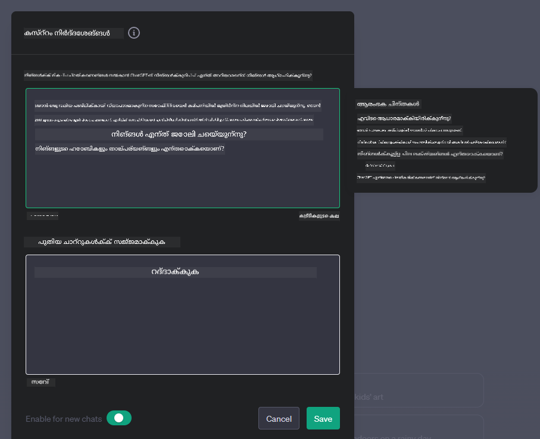

<!--
CO_OP_TRANSLATOR_METADATA:
{
  "original_hash": "a5308963a56cfbad2d73b0fa99fe84b3",
  "translation_date": "2025-12-19T19:42:02+00:00",
  "source_file": "07-building-chat-applications/README.md",
  "language_code": "ml"
}
-->
# ജനറേറ്റീവ് എഐ-പവേർഡ് ചാറ്റ് ആപ്ലിക്കേഷനുകൾ നിർമ്മിക്കൽ

[](https://youtu.be/R9V0ZY1BEQo?si=IHuU-fS9YWT8s4sA)

> _(ഈ പാഠത്തിന്റെ വീഡിയോ കാണാൻ മുകളിൽ ചിത്രത്തിൽ ക്ലിക്ക് ചെയ്യുക)_

നാം ടെക്സ്റ്റ്-ജനറേഷൻ ആപ്ലിക്കേഷനുകൾ എങ്ങനെ നിർമ്മിക്കാമെന്ന് കണ്ടതിനു ശേഷം, ചാറ്റ് ആപ്ലിക്കേഷനുകളിലേക്ക് നോക്കാം.

ചാറ്റ് ആപ്ലിക്കേഷനുകൾ നമ്മുടെ ദൈനംദിന ജീവിതത്തിൽ ഉൾക്കൊള്ളപ്പെട്ടിരിക്കുന്നു, സാധാരണ സംഭാഷണത്തിന് മാത്രമല്ല, ഉപഭോക്തൃ സേവനം, സാങ്കേതിക പിന്തുണ, സങ്കീർണ്ണമായ ഉപദേശക സംവിധാനങ്ങൾ എന്നിവയുടെ അവിഭാജ്യ ഭാഗങ്ങളാണ്. നിങ്ങൾക്ക് അടുത്തകാലത്ത് ഒരു ചാറ്റ് ആപ്ലിക്കേഷനിൽ നിന്നു സഹായം ലഭിച്ചിട്ടുണ്ടാകാം. ജനറേറ്റീവ് എഐ പോലുള്ള കൂടുതൽ പുരോഗമന സാങ്കേതികവിദ്യകൾ ഈ പ്ലാറ്റ്ഫോമുകളിൽ സംയോജിപ്പിക്കുമ്പോൾ, സങ്കീർണ്ണതയും വെല്ലുവിളികളും കൂടുന്നു.

നമുക്ക് ഉത്തരം ലഭിക്കേണ്ട ചില ചോദ്യങ്ങൾ:

- **ആപ്പ് നിർമ്മാണം**. പ്രത്യേക ഉപയോഗ കേസുകൾക്കായി ഈ എഐ-പവേർഡ് ആപ്ലിക്കേഷനുകൾ എങ്ങനെ കാര്യക്ഷമമായി നിർമ്മിച്ച് സുതാര്യമായി സംയോജിപ്പിക്കാം?
- **മോണിറ്ററിംഗ്**. വിന്യസിച്ചതിനു ശേഷം, ആപ്ലിക്കേഷനുകൾ പ്രവർത്തനക്ഷമതയും [ഉത്തരവാദിത്വമുള്ള എഐയുടെ ആറ് സിദ്ധാന്തങ്ങൾ](https://www.microsoft.com/ai/responsible-ai?WT.mc_id=academic-105485-koreyst) പാലിക്കുന്നതും ഉറപ്പാക്കാൻ എങ്ങനെ നിരീക്ഷിക്കാം?

ഓട്ടോമേഷൻ, മനുഷ്യ-യന്ത്ര ഇടപെടലുകൾ എന്നിവ നിർവചിക്കുന്ന ഒരു കാലഘട്ടത്തിലേക്ക് നാം കടക്കുമ്പോൾ, ജനറേറ്റീവ് എഐ ചാറ്റ് ആപ്ലിക്കേഷനുകളുടെ പരിധി, ആഴം, അനുയോജ്യത എന്നിവ എങ്ങനെ മാറ്റുന്നു എന്ന് മനസ്സിലാക്കുന്നത് അനിവാര്യമാണ്. ഈ പാഠം ഈ സങ്കീർണ്ണ സംവിധാനങ്ങളെ പിന്തുണയ്ക്കുന്ന ആർക്കിടെക്ചർ ഘടകങ്ങൾ പരിശോധിക്കുകയും, ഡൊമെയ്ൻ-നിർദിഷ്ട പ്രവർത്തനങ്ങൾക്ക് അവയെ ഫൈൻ-ട്യൂൺ ചെയ്യാനുള്ള രീതികൾ പഠിക്കുകയും, ഉത്തരവാദിത്വമുള്ള എഐ വിന്യാസം ഉറപ്പാക്കുന്നതിനുള്ള മാനദണ്ഡങ്ങളും പരിഗണനകളും വിലയിരുത്തുകയും ചെയ്യും.

## പരിചയം

ഈ പാഠം ഉൾക്കൊള്ളുന്നു:

- ചാറ്റ് ആപ്ലിക്കേഷനുകൾ കാര്യക്ഷമമായി നിർമ്മിച്ച് സംയോജിപ്പിക്കുന്ന സാങ്കേതിക വിദ്യകൾ.
- ആപ്ലിക്കേഷനുകൾക്ക് കസ്റ്റമൈസേഷൻ, ഫൈൻ-ട്യൂണിംഗ് എങ്ങനെ പ്രയോഗിക്കാം.
- ചാറ്റ് ആപ്ലിക്കേഷനുകൾ ഫലപ്രദമായി നിരീക്ഷിക്കാൻ തന്ത്രങ്ങളും പരിഗണനകളും.

## പഠന ലക്ഷ്യങ്ങൾ

ഈ പാഠം അവസാനിപ്പിക്കുമ്പോൾ, നിങ്ങൾക്ക് കഴിയും:

- നിലവിലുള്ള സിസ്റ്റങ്ങളിലേക്ക് ചാറ്റ് ആപ്ലിക്കേഷനുകൾ നിർമ്മിച്ച് സംയോജിപ്പിക്കുമ്പോൾ പരിഗണിക്കേണ്ട കാര്യങ്ങൾ വിവരിക്കുക.
- പ്രത്യേക ഉപയോഗ കേസുകൾക്കായി ചാറ്റ് ആപ്ലിക്കേഷനുകൾ കസ്റ്റമൈസ് ചെയ്യുക.
- എഐ-പവേർഡ് ചാറ്റ് ആപ്ലിക്കേഷനുകളുടെ ഗുണനിലവാരം ഫലപ്രദമായി നിരീക്ഷിക്കാൻ പ്രധാന മാനദണ്ഡങ്ങളും പരിഗണനകളും തിരിച്ചറിയുക.
- ചാറ്റ് ആപ്ലിക്കേഷനുകൾ ഉത്തരവാദിത്വത്തോടെ എഐ ഉപയോഗിക്കുന്നതായി ഉറപ്പാക്കുക.

## ജനറേറ്റീവ് എഐ ചാറ്റ് ആപ്ലിക്കേഷനുകളിൽ സംയോജിപ്പിക്കൽ

ജനറേറ്റീവ് എഐ വഴി ചാറ്റ് ആപ്ലിക്കേഷനുകൾ ഉയർത്തുന്നത് അവയെ കൂടുതൽ ബുദ്ധിമുട്ടുള്ളതാക്കുന്നതല്ല; ഗുണമേന്മയുള്ള ഉപയോക്തൃ അനുഭവം നൽകാൻ അവരുടെ ആർക്കിടെക്ചർ, പ്രകടനം, ഉപയോക്തൃ ഇന്റർഫേസ് എന്നിവ മെച്ചപ്പെടുത്തുകയാണ്. ഇതിൽ ആർക്കിടെക്ചറൽ അടിസ്ഥാനങ്ങൾ, API സംയോജിപ്പിക്കൽ, ഉപയോക്തൃ ഇന്റർഫേസ് പരിഗണനകൾ എന്നിവ പരിശോധിക്കപ്പെടുന്നു. നിലവിലുള്ള സിസ്റ്റങ്ങളിലേക്ക് ഇവ സംയോജിപ്പിക്കുകയോ സ്വതന്ത്ര പ്ലാറ്റ്ഫോമുകളായി നിർമ്മിക്കുകയോ ചെയ്യുമ്പോൾ ഈ സങ്കീർണ്ണ മേഖലകളിലൂടെ നയിക്കുന്ന സമഗ്ര റോഡ്‌മാപ്പ് നൽകുകയാണ് ഈ വിഭാഗത്തിന്റെ ലക്ഷ്യം.

ഈ വിഭാഗം അവസാനിപ്പിക്കുമ്പോൾ, ചാറ്റ് ആപ്ലിക്കേഷനുകൾ കാര്യക്ഷമമായി നിർമ്മിച്ച് സംയോജിപ്പിക്കാൻ ആവശ്യമായ വിദഗ്ധത നിങ്ങൾക്ക് ലഭിച്ചിരിക്കും.

### ചാറ്റ്ബോട്ട് അല്ലെങ്കിൽ ചാറ്റ് ആപ്ലിക്കേഷൻ?

ചാറ്റ് ആപ്ലിക്കേഷനുകൾ നിർമ്മിക്കാൻ മുമ്പ്, 'ചാറ്റ്ബോട്ടുകൾ'യും 'എഐ-പവേർഡ് ചാറ്റ് ആപ്ലിക്കേഷനുകളും' തമ്മിലുള്ള വ്യത്യാസം നോക്കാം. ഇവ വ്യത്യസ്തമായ പങ്കുകളും പ്രവർത്തനങ്ങളും വഹിക്കുന്നു. ചാറ്റ്ബോട്ടിന്റെ പ്രധാന ലക്ഷ്യം പ്രത്യേക സംഭാഷണ പ്രവർത്തനങ്ങൾ സ്വയം പ്രവർത്തിപ്പിക്കുകയാണ്, ഉദാഹരണത്തിന്, സാധാരണ ചോദിക്കപ്പെടുന്ന ചോദ്യങ്ങൾക്ക് ഉത്തരം നൽകൽ അല്ലെങ്കിൽ പാക്കേജ് ട്രാക്കിംഗ്. ഇത് സാധാരണയായി നിയമാധിഷ്ഠിത ലജിക് അല്ലെങ്കിൽ സങ്കീർണ്ണ എഐ ആൽഗോരിതങ്ങൾ ഉപയോഗിച്ച് നിയന്ത്രിക്കപ്പെടുന്നു. മറുവശത്ത്, എഐ-പവേർഡ് ചാറ്റ് ആപ്ലിക്കേഷൻ ഒരു വ്യാപകമായ പരിസരമാണ്, മനുഷ്യ ഉപയോക്താക്കളിൽ ടെക്സ്റ്റ്, വോയ്സ്, വീഡിയോ ചാറ്റുകൾ പോലുള്ള വിവിധ ഡിജിറ്റൽ ആശയവിനിമയ രൂപങ്ങൾ സജ്ജമാക്കാൻ രൂപകൽപ്പന ചെയ്തിരിക്കുന്നത്. ഇതിന്റെ നിർണ്ണായക സവിശേഷതയാണ് ജനറേറ്റീവ് എഐ മോഡൽ സംയോജിപ്പിക്കൽ, ഇത് സൂക്ഷ്മമായ, മനുഷ്യസമാനമായ സംഭാഷണങ്ങൾ അനുകരിച്ച്, വിവിധ ഇൻപുട്ടുകളും സാന്ദർഭിക സൂചനകളും അടിസ്ഥാനമാക്കി പ്രതികരണങ്ങൾ സൃഷ്ടിക്കുന്നു. ജനറേറ്റീവ് എഐ-പവേർഡ് ചാറ്റ് ആപ്ലിക്കേഷൻ തുറന്ന-ഡൊമെയ്ൻ ചർച്ചകളിൽ പങ്കെടുക്കാനും, മാറുന്ന സംഭാഷണ സാഹചര്യങ്ങൾക്ക് അനുയോജ്യമായി മാറാനും, സൃഷ്ടിപരമായ അല്ലെങ്കിൽ സങ്കീർണ്ണ സംഭാഷണങ്ങൾ ഉത്പാദിപ്പിക്കാനും കഴിയും.

താഴെയുള്ള പട്ടിക ഡിജിറ്റൽ ആശയവിനിമയത്തിൽ അവയുടെ വ്യത്യസ്ത പങ്കുകൾ മനസ്സിലാക്കാൻ പ്രധാന വ്യത്യാസങ്ങളും സാമ്യമുള്ളതും വ്യക്തമാക്കുന്നു.

| ചാറ്റ്ബോട്ട്                               | ജനറേറ്റീവ് എഐ-പവേർഡ് ചാറ്റ് ആപ്ലിക്കേഷൻ |
| ------------------------------------- | -------------------------------------- |
| ടാസ്‌ക്-കേന്ദ്രിതവും നിയമാധിഷ്ഠിതവുമാണ്           | സാന്ദർഭിക ബോധമുള്ളത്                          |
| പലപ്പോഴും വലിയ സിസ്റ്റങ്ങളിലേക്ക് സംയോജിപ്പിച്ചിരിക്കുന്നു  | ഒറ്റയോ ഒന്നിലധികമോ ചാറ്റ്ബോട്ടുകൾ ഹോസ്റ്റ് ചെയ്യാം      |
| പ്രോഗ്രാമുചെയ്ത ഫംഗ്ഷനുകളിലേയ്ക്ക് പരിമിതമാണ്       | ജനറേറ്റീവ് എഐ മോഡലുകൾ ഉൾക്കൊള്ളിക്കുന്നു      |
| പ്രത്യേകിച്ചും ഘടനാപരമായ ഇടപെടലുകൾ | തുറന്ന-ഡൊമെയ്ൻ ചർച്ചകൾക്ക് ശേഷിയുള്ളത്     |

### SDKs, APIs ഉപയോഗിച്ച് മുൻകൂട്ടി നിർമ്മിച്ച ഫംഗ്ഷനാലിറ്റികൾ പ്രയോജനപ്പെടുത്തൽ

ചാറ്റ് ആപ്ലിക്കേഷൻ നിർമ്മിക്കുമ്പോൾ, ആദ്യം നിലവിലുള്ളവ എന്താണെന്ന് വിലയിരുത്തുന്നത് നല്ല തുടക്കം ആണ്. SDKs, APIs ഉപയോഗിച്ച് ചാറ്റ് ആപ്ലിക്കേഷനുകൾ നിർമ്മിക്കുന്നത് പല കാരണങ്ങളാൽ പ്രയോജനകരമാണ്. നന്നായി രേഖപ്പെടുത്തിയ SDKs, APIs സംയോജിപ്പിച്ച്, നിങ്ങളുടെ ആപ്ലിക്കേഷൻ ദീർഘകാല വിജയത്തിനായി തന്ത്രപരമായി സജ്ജമാക്കുന്നു, സ്കെയിലബിലിറ്റി, പരിപാലന പ്രശ്നങ്ങൾ പരിഹരിക്കുന്നു.

- **വികസന പ്രക്രിയ വേഗത്തിലാക്കുകയും ഓവർഹെഡ് കുറയ്ക്കുകയും ചെയ്യുന്നു**: സ്വയം നിർമ്മിക്കുന്ന ചെലവേറിയ പ്രക്രിയയുടെ പകരം മുൻകൂട്ടി നിർമ്മിച്ച ഫംഗ്ഷനാലിറ്റികൾ ആശ്രയിക്കുന്നത്, ബിസിനസ് ലജിക് പോലുള്ള മറ്റ് പ്രധാന ഭാഗങ്ങളിൽ ശ്രദ്ധ കേന്ദ്രീകരിക്കാൻ സഹായിക്കുന്നു.
- **മികച്ച പ്രകടനം**: ഫംഗ്ഷനാലിറ്റി തൊട്ടുതുടങ്ങി നിർമ്മിക്കുമ്പോൾ, "ഇത് എങ്ങനെ സ്കെയിൽ ചെയ്യുന്നു? ഈ ആപ്ലിക്കേഷൻ അപ്രതീക്ഷിതമായി ഉപയോക്താക്കളുടെ എണ്ണം വർധിച്ചാൽ കൈകാര്യം ചെയ്യാൻ കഴിയും?" എന്ന ചോദ്യങ്ങൾ ഉയരും. നന്നായി പരിപാലിക്കപ്പെട്ട SDK, APIs ഈ പ്രശ്നങ്ങൾക്ക് പരിഹാരങ്ങൾ ഉൾക്കൊള്ളിച്ചിരിക്കുന്നു.
- **പരിപാലനം എളുപ്പം**: പുതിയ പതിപ്പുകൾ പുറത്തിറങ്ങിയാൽ ലൈബ്രറി അപ്ഡേറ്റ് ചെയ്യുന്നതിലൂടെ അപ്ഡേറ്റുകളും മെച്ചപ്പെടുത്തലുകളും എളുപ്പത്തിൽ കൈകാര്യം ചെയ്യാം.
- **അത്യാധുനിക സാങ്കേതികവിദ്യ ലഭ്യത**: വ്യാപകമായ ഡാറ്റാസെറ്റുകളിൽ ഫൈൻ-ട്യൂൺ ചെയ്ത മോഡലുകൾ ഉപയോഗിച്ച് നിങ്ങളുടെ ആപ്ലിക്കേഷനിൽ സ്വാഭാവിക ഭാഷാ കഴിവുകൾ നൽകാം.

SDK അല്ലെങ്കിൽ API ഫംഗ്ഷനാലിറ്റി ഉപയോഗിക്കാൻ സാധാരണയായി നൽകിയ സേവനങ്ങൾ ഉപയോഗിക്കാൻ അനുമതി നേടണം, സാധാരണയായി ഒരു പ്രത്യേക കീ അല്ലെങ്കിൽ ഓതന്റിക്കേഷൻ ടോക്കൺ ഉപയോഗിച്ച്. ഇതിന്റെ ഉദാഹരണമായി OpenAI Python ലൈബ്രറി ഉപയോഗിച്ച് നോക്കാം. നിങ്ങൾക്ക് ഈ പാഠത്തിനായി താഴെ കൊടുത്തിരിക്കുന്ന [OpenAI നോട്ട്ബുക്ക്](./python/oai-assignment.ipynb?WT.mc_id=academic-105485-koreyst) അല്ലെങ്കിൽ [Azure OpenAI Services നോട്ട്ബുക്ക്](./python/aoai-assignment.ipynb?WT.mc_id=academic-105485-koreys) സ്വയം പരീക്ഷിക്കാം.

```python
import os
from openai import OpenAI

API_KEY = os.getenv("OPENAI_API_KEY","")

client = OpenAI(
    api_key=API_KEY
    )

chat_completion = client.chat.completions.create(model="gpt-3.5-turbo", messages=[{"role": "user", "content": "Suggest two titles for an instructional lesson on chat applications for generative AI."}])
```

മുകളിൽ കാണിച്ച ഉദാഹരണം GPT-3.5 Turbo മോഡൽ പ്രോംപ്റ്റ് പൂർത്തിയാക്കാൻ ഉപയോഗിക്കുന്നു, പക്ഷേ API കീ മുൻകൂട്ടി സജ്ജമാക്കിയിരിക്കണം. കീ സജ്ജമാക്കിയില്ലെങ്കിൽ പിശക് ലഭിക്കും.

## ഉപയോക്തൃ അനുഭവം (UX)

സാധാരണ UX സിദ്ധാന്തങ്ങൾ ചാറ്റ് ആപ്ലിക്കേഷനുകളിൽ പ്രയോഗിക്കാം, എന്നാൽ മെഷീൻ ലേണിംഗ് ഘടകങ്ങൾ ഉൾപ്പെടുന്നതുകൊണ്ട് ചില അധിക പരിഗണനകൾ പ്രധാനമാണ്.

- **അസ്പഷ്ടത പരിഹരിക്കുന്ന സംവിധാനം**: ജനറേറ്റീവ് എഐ മോഡലുകൾ ചിലപ്പോൾ അസ്പഷ്ടമായ ഉത്തരങ്ങൾ സൃഷ്ടിക്കുന്നു. ഉപയോക്താക്കൾക്ക് വിശദീകരണം ചോദിക്കാൻ കഴിയുന്ന ഒരു സവിശേഷത സഹായകരമാണ്.
- **സാന്ദർഭം നിലനിർത്തൽ**: പുരോഗമന ജനറേറ്റീവ് എഐ മോഡലുകൾ സംഭാഷണത്തിനുള്ളിൽ സാന്ദർഭം ഓർക്കാൻ കഴിവുള്ളവയാണ്, ഇത് ഉപയോക്തൃ അനുഭവത്തിന് അനിവാര്യമായ ഒരു ആസ്തി ആകാം. ഉപയോക്താക്കൾക്ക് സാന്ദർഭം നിയന്ത്രിക്കാനും മാനേജുചെയ്യാനും കഴിവ് നൽകുന്നത് അനുഭവം മെച്ചപ്പെടുത്തുന്നു, പക്ഷേ സ്വകാര്യതാ പ്രശ്നങ്ങൾ ഉണ്ടാക്കാം. ഈ വിവരങ്ങൾ എത്രകാലം സൂക്ഷിക്കണം എന്നതിനെക്കുറിച്ചുള്ള നയം (ഉദാ: റിട്ടൻഷൻ പോളിസി) സാന്ദർഭം ആവശ്യകതയും സ്വകാര്യതയും തമ്മിൽ തുല്യപ്പെടുത്താൻ സഹായിക്കും.
- **വ്യക്തിഗതവൽക്കരണം**: പഠിച്ച് അനുയോജ്യമായി മാറാനുള്ള കഴിവുള്ള എഐ മോഡലുകൾ ഉപയോക്താവിന് വ്യക്തിഗത അനുഭവം നൽകുന്നു. ഉപയോക്തൃ പ്രൊഫൈലുകൾ പോലുള്ള സവിശേഷതകളിലൂടെ അനുഭവം തയാറാക്കുന്നത് ഉപയോക്താവിനെ മനസ്സിലാക്കിയതായി തോന്നിക്കാനും, പ്രത്യേക ഉത്തരങ്ങൾ കണ്ടെത്തുന്നതിൽ സഹായിക്കാനും, കൂടുതൽ കാര്യക്ഷമവും തൃപ്തികരവുമായ ഇടപെടൽ സൃഷ്ടിക്കാനും സഹായിക്കുന്നു.

ഉദാഹരണമായി, OpenAIയുടെ ChatGPT-യിലെ "Custom instructions" ക്രമീകരണങ്ങൾ. ഇത് നിങ്ങളുടെ പ്രോംപ്റ്റുകൾക്കായി പ്രധാനമായ സാന്ദർഭം നൽകുന്ന വിവരങ്ങൾ നൽകാൻ അനുവദിക്കുന്നു. ഒരു കസ്റ്റം ഇൻസ്ട്രക്ഷന്റെ ഉദാഹരണം താഴെ കാണാം.



ഈ "പ്രൊഫൈൽ" ChatGPT-യെ ലിങ്ക്ഡ് ലിസ്റ്റുകളെക്കുറിച്ചുള്ള പാഠപദ്ധതി തയ്യാറാക്കാൻ പ്രേരിപ്പിക്കുന്നു. ഉപയോക്താവിന്റെ അനുഭവം അടിസ്ഥാനമാക്കി കൂടുതൽ ആഴത്തിലുള്ള പാഠപദ്ധതി വേണമെന്നു ChatGPT പരിഗണിക്കുന്നു.


### വലിയ ഭാഷാ മോഡലുകൾക്കുള്ള Microsoft സിസ്റ്റം മെസേജ് ഫ്രെയിംവർക്ക്

[Microsoft നൽകിയ മാർഗ്ഗനിർദ്ദേശം](https://learn.microsoft.com/azure/ai-services/openai/concepts/system-message#define-the-models-output-format?WT.mc_id=academic-105485-koreyst) LLM-കളിൽ നിന്ന് പ്രതികരണങ്ങൾ സൃഷ്ടിക്കുമ്പോൾ ഫലപ്രദമായ സിസ്റ്റം മെസേജുകൾ എഴുതുന്നതിനുള്ള 4 മേഖലകളായി വിഭജിച്ചിരിക്കുന്നു:

1. മോഡൽ ആര്ക്ക് വേണ്ടി ആണെന്ന്, അതിന്റെ കഴിവുകളും പരിമിതികളും നിർവചിക്കൽ.
2. മോഡലിന്റെ ഔട്ട്പുട്ട് ഫോർമാറ്റ് നിർവചിക്കൽ.
3. മോഡലിന്റെ ഉദ്ദേശിച്ച പെരുമാറ്റം കാണിക്കുന്ന പ്രത്യേക ഉദാഹരണങ്ങൾ നൽകൽ.
4. അധിക പെരുമാറ്റ ഗാർഡ്‌റെയിൽസ് നൽകൽ.

### ആക്സസിബിലിറ്റി

ഉപയോക്താവിന് ദൃശ്യ, ശ്രവണ, മോട്ടോർ, ബുദ്ധിമുട്ടുകൾ ഉണ്ടാകാമെങ്കിലും, നല്ല രൂപകൽപ്പന ചെയ്ത ചാറ്റ് ആപ്ലിക്കേഷൻ എല്ലാവർക്കും ഉപയോഗിക്കാൻ കഴിയണം. വിവിധ ഉപയോക്തൃ വൈകല്യങ്ങൾക്കായി ആക്സസിബിലിറ്റി മെച്ചപ്പെടുത്താനുള്ള പ്രത്യേക സവിശേഷതകൾ താഴെ കൊടുത്തിരിക്കുന്നു.

- **ദൃശ്യ വൈകല്യത്തിനുള്ള സവിശേഷതകൾ**: ഉയർന്ന കോൺട്രാസ്റ്റ് തീമുകൾ, വലുതാക്കാവുന്ന എഴുത്ത്, സ്ക്രീൻ റീഡർ അനുയോജ്യത.
- **ശ്രവണ വൈകല്യത്തിനുള്ള സവിശേഷതകൾ**: ടെക്സ്റ്റ്-ടു-സ്പീച്ച്, സ്പീച്ച്-ടു-ടെക്സ്റ്റ് ഫംഗ്ഷനുകൾ, ഓഡിയോ അറിയിപ്പുകൾക്കുള്ള ദൃശ്യ സൂചനകൾ.
- **മോട്ടോർ വൈകല്യത്തിനുള്ള സവിശേഷതകൾ**: കീബോർഡ് നാവിഗേഷൻ പിന്തുണ, വോയ്സ് കമാൻഡുകൾ.
- **ബുദ്ധിമുട്ടുള്ളവർക്കുള്ള സവിശേഷതകൾ**: ലളിതമായ ഭാഷാ ഓപ്ഷനുകൾ.

## ഡൊമെയ്ൻ-നിർദിഷ്ട ഭാഷാ മോഡലുകൾക്കായി കസ്റ്റമൈസേഷൻ, ഫൈൻ-ട്യൂണിംഗ്

നിങ്ങളുടെ കമ്പനിയുടെ ജാർഗൺ മനസ്സിലാക്കുകയും ഉപയോക്താക്കൾ സാധാരണ ചോദിക്കുന്ന പ്രത്യേക ചോദ്യങ്ങൾ മുൻകൂട്ടി പ്രവചിക്കുകയും ചെയ്യുന്ന ഒരു ചാറ്റ് ആപ്ലിക്കേഷൻ تصور ചെയ്യുക. ഇതിന് ചില സമീപനങ്ങൾ ഉണ്ട്:

- **DSL മോഡലുകൾ പ്രയോജനപ്പെടുത്തൽ**. DSL എന്നത് ഡൊമെയ്ൻ-നിർദിഷ്ട ഭാഷ എന്നർത്ഥം. ഒരു പ്രത്യേക ഡൊമെയ്ൻ പഠിച്ചെടുത്ത DSL മോഡൽ ഉപയോഗിച്ച് അതിന്റെ ആശയങ്ങളും സാഹചര്യങ്ങളും മനസ്സിലാക്കാം.
- **ഫൈൻ-ട്യൂണിംഗ് പ്രയോഗിക്കുക**. ഫൈൻ-ട്യൂണിംഗ് എന്നത് നിങ്ങളുടെ മോഡലിനെ പ്രത്യേക ഡാറ്റ ഉപയോഗിച്ച് കൂടുതൽ പരിശീലിപ്പിക്കുന്ന പ്രക്രിയയാണ്.

## കസ്റ്റമൈസേഷൻ: DSL ഉപയോഗിക്കൽ

ഡൊമെയ്ൻ-നിർദിഷ്ട ഭാഷാ മോഡലുകൾ (DSL മോഡലുകൾ) ഉപയോക്തൃ പങ്കാളിത്തം വർദ്ധിപ്പിക്കുകയും പ്രത്യേക, സാന്ദർഭികമായി പ്രസക്തമായ ഇടപെടലുകൾ നൽകുകയും ചെയ്യുന്നു. ഇത് ഒരു പ്രത്യേക മേഖല, വ്യവസായം, വിഷയം എന്നിവയുമായി ബന്ധപ്പെട്ട ടെക്സ്റ്റ് മനസ്സിലാക്കാനും സൃഷ്ടിക്കാനും പരിശീലിപ്പിച്ച മോഡലാണ്. DSL മോഡൽ ഉപയോഗിക്കുന്ന ഓപ്ഷനുകൾ സ്ക്രാച്ചിൽ നിന്ന് പരിശീലിപ്പിക്കുന്നതിൽ നിന്നോ SDKs, APIs വഴി നിലവിലുള്ളവ ഉപയോഗിക്കുന്നതിൽ നിന്നോ വ്യത്യസ്തമാണ്. മറ്റൊരു ഓപ്ഷൻ ഫൈൻ-ട്യൂണിംഗ് ആണ്, നിലവിലുള്ള പ്രീ-ട്രെയിൻ ചെയ്ത മോഡൽ ഒരു പ്രത്യേക ഡൊമെയ്ൻ അനുസരിച്ച് ക്രമീകരിക്കുന്നത്.

## കസ്റ്റമൈസേഷൻ: ഫൈൻ-ട്യൂണിംഗ് പ്രയോഗിക്കുക

ഒരു പ്രീ-ട്രെയിൻ ചെയ്ത മോഡൽ പ്രത്യേക ഡൊമെയ്ൻ അല്ലെങ്കിൽ പ്രത്യേക ടാസ്‌കിൽ പര്യാപ്തമല്ലെങ്കിൽ ഫൈൻ-ട്യൂണിംഗ് പരിഗണിക്കപ്പെടുന്നു.

ഉദാഹരണത്തിന്, മെഡിക്കൽ ചോദ്യങ്ങൾ സങ്കീർണ്ണവും സാന്ദർഭം ആവശ്യവുമാണ്. ഒരു മെഡിക്കൽ പ്രൊഫഷണൽ രോഗിയെ ഡയഗ്നോസ് ചെയ്യുമ്പോൾ ജീവിതശൈലി, മുൻകൂട്ടി ഉള്ള അവസ്ഥകൾ, പുതിയ മെഡിക്കൽ ജേർണലുകൾ എന്നിവ പരിഗണിക്കുന്നു. ഇത്തരം സൂക്ഷ്മ സാഹചര്യങ്ങളിൽ, പൊതുവായ എഐ ചാറ്റ് ആപ്ലിക്കേഷൻ വിശ്വസനീയമായ ഉറവിടമാകാൻ കഴിയില്ല.

### സീനാരിയോ: ഒരു മെഡിക്കൽ ആപ്ലിക്കേഷൻ

മെഡിക്കൽ പ്രാക്ടീഷണർമാർക്ക് ചികിത്സാ മാർഗ്ഗനിർദ്ദേശങ്ങൾ, മരുന്ന് ഇടപെടലുകൾ, പുതിയ ഗവേഷണ കണ്ടെത്തലുകൾ എന്നിവ വേഗത്തിൽ നൽകാൻ സഹായിക്കുന്ന ഒരു ചാറ്റ് ആപ്ലിക്കേഷൻ പരിഗണിക്കുക.

പൊതുവായ മോഡൽ അടിസ്ഥാന മെഡിക്കൽ ചോദ്യങ്ങൾക്ക് ഉത്തരം നൽകുന്നതിന് മതിയാകാം, എന്നാൽ താഴെപ്പറയുന്ന കാര്യങ്ങളിൽ ബുദ്ധിമുട്ട് അനുഭവിക്കാം:

- **വളരെ പ്രത്യേകമായ അല്ലെങ്കിൽ സങ്കീർണ്ണമായ കേസുകൾ**. ഉദാഹരണത്തിന്, ഒരു ന്യൂറോളജിസ്റ്റ് ആപ്ലിക്കേഷനോട് ചോദിക്കാം, "പീഡിയാട്രിക് രോഗികളിൽ മരുന്ന് പ്രതിരോധ എപ്പിലപ്സി നിയന്ത്രിക്കുന്നതിനുള്ള നിലവിലെ മികച്ച പ്രാക്ടീസുകൾ എന്തെല്ലാം?"
- **സമകാലീന പുരോഗതികൾ ഇല്ലാതായിരിക്കുക**. പൊതുവായ മോഡൽ ന്യൂറോളജി, ഫാർമക്കോളജി എന്നിവയിലെ ഏറ്റവും പുതിയ പുരോഗതികൾ ഉൾക്കൊള്ളിച്ചുള്ള നിലവിലെ ഉത്തരം നൽകുന്നതിൽ ബുദ്ധിമുട്ട് അനുഭവിക്കാം.

ഇത്തരത്തിലുള്ള സാഹചര്യങ്ങളിൽ, പ്രത്യേക മെഡിക്കൽ ഡാറ്റാസെറ്റിൽ മോഡൽ ഫൈൻ-ട്യൂൺ ചെയ്യുന്നത് ഈ സങ്കീർണ്ണമായ മെഡിക്കൽ ചോദ്യങ്ങൾ കൂടുതൽ കൃത്യവും വിശ്വസനീയവുമായ രീതിയിൽ കൈകാര്യം ചെയ്യാൻ സഹായിക്കും. ഇത് ഡൊമെയ്ൻ-നിർദിഷ്ട വെല്ലുവിളികളും ചോദ്യങ്ങളും പ്രതിനിധീകരിക്കുന്ന വലിയ, പ്രസക്തമായ ഡാറ്റാസെറ്റിലേക്ക് ആക്‌സസ് ആവശ്യമാണ്.

## ഉയർന്ന ഗുണമേന്മയുള്ള എഐ-നിർവ്വചിത ചാറ്റ് അനുഭവത്തിനുള്ള പരിഗണനകൾ

ഈ വിഭാഗം "ഉയർന്ന ഗുണമേന്മയുള്ള" ചാറ്റ് ആപ്ലിക്കേഷനുകൾക്കുള്ള മാനദണ്ഡങ്ങൾ വിശദീകരിക്കുന്നു, ഇതിൽ പ്രവർത്തനക്ഷമമായ മാനദണ്ഡങ്ങൾ പിടിച്ചുപറയുകയും ഉത്തരവാദിത്വത്തോടെ എഐ സാങ്കേതികവിദ്യ ഉപയോഗിക്കുന്ന ഒരു ഫ്രെയിംവർക്ക് പാലിക്കുകയും ചെയ്യുന്നു.

### പ്രധാന മാനദണ്ഡങ്ങൾ

ആപ്ലിക്കേഷന്റെ ഉയർന്ന ഗുണമേന്മ നിലനിർത്താൻ, പ്രധാന മാനദണ്ഡങ്ങളും പരിഗണനകളും നിരീക്ഷിക്കുക അനിവാര്യമാണ്. ഈ അളവുകൾ ആപ്ലിക്കേഷന്റെ പ്രവർത്തനക്ഷമത മാത്രമല്ല, എഐ മോഡലിന്റെയും ഉപയോക്തൃ അനുഭവത്തിന്റെയും ഗുണനിലവാരവും വിലയിരുത്തുന്നു. താഴെ അടിസ്ഥാന, എഐ, ഉപയോക്തൃ അനുഭവ മാനദണ്ഡങ്ങൾ ഉൾക്കൊള്ളുന്ന പട്ടികയാണ്.

| മാനദണ്ഡം                        | നിർവചനം                                                                                                             | ചാറ്റ് ഡെവലപ്പറുടെ പരിഗണനകൾ                                         |
| ----------------------------- | ---------------------------------------------------------------------------------------------------------------------- | ------------------------------------------------------------------------- |
| **ഉപയോഗസമയം (Uptime)**                    | ആപ്ലിക്കേഷൻ പ്രവർത്തനക്ഷമവും ഉപയോക്താക്കൾക്ക് ലഭ്യവുമുള്ള സമയത്തെ അളക്കുന്നു.                                              | ഡൗൺടൈം എങ്ങനെ കുറയ്ക്കും?                                           |
| **പ്രതികരണ സമയം (Response Time)**             | ഉപയോക്താവിന്റെ ചോദ്യംക്ക് ആപ്ലിക്കേഷൻ പ്രതികരിക്കാൻ എടുക്കുന്ന സമയം.                                                          | പ്രതികരണ സമയം മെച്ചപ്പെടുത്താൻ ചോദ്യം പ്രോസസ്സിംഗ് എങ്ങനെ ഓപ്റ്റിമൈസ് ചെയ്യും?           |
| **പ്രിസിഷൻ (Precision)**                 | ശരിയായ പോസിറ്റീവ് പ്രവചനങ്ങളുടെ അനുപാതം മൊത്തം പോസിറ്റീവ് പ്രവചനങ്ങളിലേക്കുള്ളത്                                     | മോഡലിന്റെ പ്രിസിഷൻ എങ്ങനെ സ്ഥിരീകരിക്കും?                        |
| **റീക്കാൾ (Recall / Sensitivity)**      | ശരിയായ പോസിറ്റീവ് പ്രവചനങ്ങളുടെ അനുപാതം യഥാർത്ഥ പോസിറ്റീവുകളുടെ എണ്ണം                                               | റീക്കാൾ എങ്ങനെ അളക്കും, മെച്ചപ്പെടുത്തും?                                  |
| **F1 സ്കോർ**                  | പ്രിസിഷനും റീക്കാളും തമ്മിലുള്ള ഹാർമോണിക് ശരാശരി, ഇരുവരും തമ്മിലുള്ള തുല്യത നിലനിർത്തുന്നു                                   | നിങ്ങളുടെ ലക്ഷ്യ F1 സ്കോർ എന്താണ്? പ്രിസിഷനും റീക്കാളും എങ്ങനെ തുല്യപ്പെടുത്തും?  |
| **പർപ്ലെക്സിറ്റി (Perplexity)**                | മോഡൽ പ്രവചിക്കുന്ന പ്രൊബബിലിറ്റി വിതരണവും യഥാർത്ഥ ഡാറ്റ വിതരണവും എത്രത്തോളം പൊരുത്തപ്പെടുന്നു എന്ന് അളക്കുന്നു. | പർപ്ലെക്സിറ്റി എങ്ങനെ കുറയ്ക്കും?                                         |
| **ഉപയോക്തൃ തൃപ്തി മാനദണ്ഡങ്ങൾ** | ആപ്ലിക്കേഷനോടുള്ള ഉപയോക്തൃ ധാരണ അളക്കുന്നു. സാധാരണയായി സർവേകൾ വഴി ശേഖരിക്കുന്നു.                                     | ഉപയോക്തൃ പ്രതികരണം എത്രത്തോളം ശേഖരിക്കും? അതിന്റെ അടിസ്ഥാനത്തിൽ എങ്ങനെ ക്രമീകരിക്കും? |
| **പിശക് നിരക്ക് (Error Rate)**                | മോഡൽ തെറ്റായി മനസ്സിലാക്കുന്നതിലും തെറ്റായ ഔട്ട്പുട്ട് നൽകുന്നതിലും ഉണ്ടാകുന്ന നിരക്ക്.                                                 | പിശക് നിരക്ക് കുറയ്ക്കാൻ നിങ്ങൾക്കുള്ള തന്ത്രങ്ങൾ എന്തെല്ലാം?               |
| **പുനർപരിശീലന ചക്രങ്ങൾ (Retraining Cycles)**         | പുതിയ ഡാറ്റയും അറിവുകളും ഉൾപ്പെടുത്താൻ മോഡൽ എത്രത്തോളം അപ്ഡേറ്റ് ചെയ്യുന്നു എന്നത്.                                    | മോഡൽ എത്രത്തോളം പുനർപരിശീലിക്കും? പുനർപരിശീലന ചക്രം ആരംഭിക്കുന്ന ഘട്ടങ്ങൾ എന്തെല്ലാം?   |
| **അസാധാരണ കണ്ടെത്തൽ**         | പ്രതീക്ഷിച്ച പെരുമാറ്റത്തിന് അനുസരിക്കാത്ത അസാധാരണ മാതൃകകൾ തിരിച്ചറിയുന്നതിനുള്ള ഉപകരണങ്ങളും സാങ്കേതിക വിദ്യകളും.                        | അസാധാരണങ്ങളോട് നിങ്ങൾ എങ്ങനെ പ്രതികരിക്കും?                                        |

### ചാറ്റ് ആപ്ലിക്കേഷനുകളിൽ ഉത്തരവാദിത്വമുള്ള AI പ്രാക്ടീസുകൾ നടപ്പിലാക്കൽ

Microsoft-ന്റെ ഉത്തരവാദിത്വമുള്ള AI സമീപനം AI വികസനത്തെയും ഉപയോഗത്തെയും നയിക്കേണ്ട ആറ് സിദ്ധാന്തങ്ങൾ തിരിച്ചറിഞ്ഞിട്ടുണ്ട്. താഴെ സിദ്ധാന്തങ്ങൾ, അവയുടെ നിർവചനവും, ഒരു ചാറ്റ് ഡെവലപ്പർ പരിഗണിക്കേണ്ട കാര്യങ്ങളും അവയെ ഗൗരവമായി എടുക്കേണ്ടതിന്റെ കാരണങ്ങളും നൽകിയിരിക്കുന്നു.

| സിദ്ധാന്തങ്ങൾ             | Microsoft-ന്റെ നിർവചനം                                | ചാറ്റ് ഡെവലപ്പറുടെ പരിഗണനകൾ                                      | ഇത് പ്രധാനമാണെന്ന് കാരണം                                                                     |
| ---------------------- | ----------------------------------------------------- | ---------------------------------------------------------------------- | -------------------------------------------------------------------------------------- |
| നീതിമാന്മാർഗ്ഗം               | AI സിസ്റ്റങ്ങൾ എല്ലാവരോടും നീതിപൂർവ്വം പെരുമാറണം.            | ഉപയോക്തൃ ഡാറ്റ അടിസ്ഥാനമാക്കി ചാറ്റ് ആപ്ലിക്കേഷൻ വിവേചനം ചെയ്യാതിരിക്കണം.  | ഉപയോക്താക്കളിൽ വിശ്വാസവും ഉൾക്കൊള്ളലും സൃഷ്ടിക്കാൻ; നിയമപരമായ പ്രത്യാഘാതങ്ങൾ ഒഴിവാക്കാൻ.                |
| വിശ്വാസ്യതയും സുരക്ഷയും | AI സിസ്റ്റങ്ങൾ വിശ്വാസയോഗ്യവും സുരക്ഷിതവുമാകണം.        | പിശകുകളും അപകടങ്ങളും കുറയ്ക്കാൻ ടെസ്റ്റിംഗും ഫെയിൽ-സേഫുകളും നടപ്പിലാക്കുക.         | ഉപയോക്തൃ സംതൃപ്തി ഉറപ്പാക്കുകയും സാധ്യതയുള്ള ഹാനി തടയുകയും ചെയ്യുന്നു.                                 |
| സ്വകാര്യതയും സുരക്ഷയും   | AI സിസ്റ്റങ്ങൾ സുരക്ഷിതവും സ്വകാര്യത മാനിക്കുന്നതുമായിരിക്കണം.      | ശക്തമായ എൻക്രിപ്ഷനും ഡാറ്റ സംരക്ഷണ നടപടികളും നടപ്പിലാക്കുക.              | സങ്കീർണ്ണമായ ഉപയോക്തൃ ഡാറ്റ സംരക്ഷിക്കുകയും സ്വകാര്യതാ നിയമങ്ങൾ പാലിക്കുകയും ചെയ്യാൻ.                         |
| ഉൾക്കൊള്ളൽ          | AI സിസ്റ്റങ്ങൾ എല്ലാവരെയും ശക്തിപ്പെടുത്തുകയും ആളുകളെ ഉൾപ്പെടുത്തുകയും ചെയ്യണം. | വ്യത്യസ്ത പ്രേക്ഷകരെ പരിഗണിച്ച് ആക്‌സസിബിൾ ആയ UI/UX രൂപകൽപ്പന ചെയ്യുക. | കൂടുതൽ ആളുകൾ ആപ്ലിക്കേഷൻ ഫലപ്രദമായി ഉപയോഗിക്കാൻ സാധിക്കും.                   |
| പാരദർശിത്വം           | AI സിസ്റ്റങ്ങൾ മനസ്സിലാക്കാവുന്നതായിരിക്കണം.                  | AI പ്രതികരണങ്ങൾക്ക് വ്യക്തമായ ഡോക്യുമെന്റേഷനും കാരണവുമൊരുക്കുക.            | തീരുമാനങ്ങൾ എങ്ങനെ ഉണ്ടാകുന്നു എന്ന് ഉപയോക്താക്കൾക്ക് മനസ്സിലാകുമ്പോൾ അവർ സിസ്റ്റത്തിൽ കൂടുതൽ വിശ്വാസം കാണിക്കും. |
| ഉത്തരവാദിത്വം         | AI സിസ്റ്റങ്ങൾക്കായി ആളുകൾ ഉത്തരവാദിത്വം വഹിക്കണം.          | AI തീരുമാനങ്ങൾ ഓഡിറ്റ് ചെയ്യാനും മെച്ചപ്പെടുത്താനും വ്യക്തമായ പ്രക്രിയ സ്ഥാപിക്കുക.     | പിശകുകൾ സംഭവിച്ചാൽ തുടർച്ചയായ മെച്ചപ്പെടുത്തലും പരിഹാര നടപടികളും സാധ്യമാക്കുന്നു.               |

## അസൈൻമെന്റ്

[assignment](../../../07-building-chat-applications/python) കാണുക. ഇത് നിങ്ങളുടെ ആദ്യ ചാറ്റ് പ്രോംപ്റ്റുകൾ പ്രവർത്തിപ്പിക്കുന്നതിൽ നിന്ന് തുടങ്ങി, ടെക്സ്റ്റ് വർഗ്ഗീകരണവും സംഗ്രഹീകരണവും ഉൾപ്പെടെയുള്ള വ്യത്യസ്ത അഭ്യാസങ്ങളിലൂടെ നിങ്ങളെ നയിക്കും. അസൈൻമെന്റുകൾ വിവിധ പ്രോഗ്രാമിംഗ് ഭാഷകളിൽ ലഭ്യമാണ് എന്ന് ശ്രദ്ധിക്കുക!

## മികച്ച ജോലി! യാത്ര തുടരുക

ഈ പാഠം പൂർത്തിയാക്കിയ ശേഷം, നമ്മുടെ [Generative AI Learning collection](https://aka.ms/genai-collection?WT.mc_id=academic-105485-koreyst) പരിശോധിച്ച് നിങ്ങളുടെ Generative AI അറിവ് ഉയർത്താൻ തുടരണം!

[building search applications](../08-building-search-applications/README.md?WT.mc_id=academic-105485-koreyst) എങ്ങനെ തുടങ്ങാമെന്ന് കാണാൻ പാഠം 8-ലേക്ക് പോകൂ!

---

<!-- CO-OP TRANSLATOR DISCLAIMER START -->
**അസൂയാപത്രം**:  
ഈ രേഖ AI വിവർത്തന സേവനം [Co-op Translator](https://github.com/Azure/co-op-translator) ഉപയോഗിച്ച് വിവർത്തനം ചെയ്തതാണ്. നാം കൃത്യതയ്ക്ക് ശ്രമിച്ചിട്ടുണ്ടെങ്കിലും, സ്വയം പ്രവർത്തിക്കുന്ന വിവർത്തനങ്ങളിൽ പിശകുകൾ അല്ലെങ്കിൽ തെറ്റുകൾ ഉണ്ടാകാമെന്ന് ദയവായി ശ്രദ്ധിക്കുക. അതിന്റെ മാതൃഭാഷയിലുള്ള യഥാർത്ഥ രേഖ അധികാരപരമായ ഉറവിടമായി കണക്കാക്കപ്പെടണം. നിർണായക വിവരങ്ങൾക്ക്, പ്രൊഫഷണൽ മനുഷ്യ വിവർത്തനം ശുപാർശ ചെയ്യപ്പെടുന്നു. ഈ വിവർത്തനത്തിന്റെ ഉപയോഗത്തിൽ നിന്നുണ്ടാകുന്ന ഏതെങ്കിലും തെറ്റിദ്ധാരണകൾക്കോ തെറ്റായ വ്യാഖ്യാനങ്ങൾക്കോ ഞങ്ങൾ ഉത്തരവാദികളല്ല.
<!-- CO-OP TRANSLATOR DISCLAIMER END -->