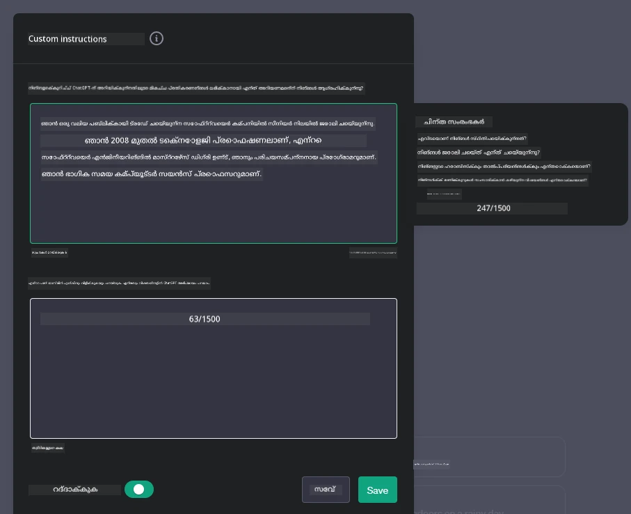
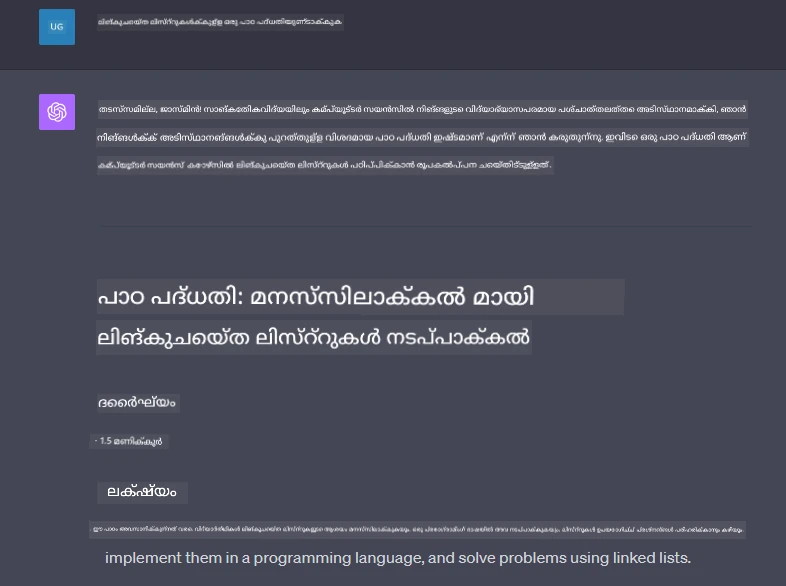

# ജനറേറ്റീവ് എഐ-മൂലമായ ചാറ്റ് അപ്ലിക്കേഷനുകൾ നിർമ്മിക്കൽ

[](https://youtu.be/R9V0ZY1BEQo?si=IHuU-fS9YWT8s4sA)

> _(ഈ പാഠപുസ്തകത്തിന്റെ വീഡിയോ കാണാൻ മുകളിൽ ഉള്ള ചിത്രത്തിൽ ക്ലിക്ക് ചെയ്യുക)_

നാം ടെക്സ്റ്റ്-ജനറേഷൻ ആപ്പുകൾ നിർമ്മിക്കുന്ന വിധം കണ്ടപ്പോൾ, ഇനി ചാറ്റ് അപ്ലിക്കേഷനുകൾ പരിശോധിക്കാം.

ചാറ്റ് അപ്ലിക്കേഷനുകൾ നമ്മുടെ ദൈനംദിന ജീവിതത്തിൽ സുപ്രധാനമായ ഘടകങ്ങളായി മാറിയിട്ടുണ്ടാണ്, ഇത് വെറും അനൈവൃത്തി സംസാരത്തിനുള്ള മാർഗം മാത്രമല്ല. അവ לקוחות സേവനത്തിന്റേയും, സാങ്കേതിക പിന്തുണയുടെയും, sofisticתו ദി ഉപദേശക സംവിധാനങ്ങളുടെ ഭാഗങ്ങളാണ്. നിങ്ങൾക്ക് അടുത്ത കാലത്തുകൂടി ഒരു ചാറ്റ് അപ്ലിക്കേഷനിൽ നിന്നും സഹായം ലഭിച്ചതുണ്ടാകാം. ജനറേറ്റീവ് എഐ പോലുള്ള ഉയർന്ന സാങ്കേതികവിദ്യകൾ ആ പ്ലാറ്റ്ഫോമുകളിൽ ഉൾപ്പെടുത്തുന്നതോടെ, സങ്കീർണ്ണതയും വെല്ലുവിളികളും വർദ്ധിക്കുന്നു.

നമുക്ക് ഉത്തരം അറിയേണ്ട ചില ചോദ്യങ്ങൾ:

- **ആപ്പ് നിർമ്മിക്കുന്നത്**. പ്രത്യേക ഉപയോഗ കാേസംറികളിൽ ഈ എഐ-മൂലമായ അപ്ലിക്കേഷനുകൾ എങ്ങനെ കാര്യക്ഷമമായി നിർമ്മിച്ച് സുസജ്ജമാക്കാം?
- **മോനിറ്ററിംഗ്**. വിനിയോഗിച്ചതിന് ശേഷം, അപ്ലിക്കേഷനുകൾ പ്രവർത്തനത്തിലും [ഉത്തരവാദിത്വമുള്ള എഐയുടെ ആറ് സിദ്ധാന്തങ്ങൾ](https://www.microsoft.com/ai/responsible-ai?WT.mc_id=academic-105485-koreyst) പാലിക്കുന്നതിൽ ഏറ്റവും ಉತ್ತಮ നിലവാരത്തിൽ പ്രവർത്തിക്കുന്നുണ്ടെന്ന് എങ്ങനെ ജാഗ്രത പാലിക്കാം?

ഓട്ടോമേഷൻ ഉമാതെ മനുഷ്യ-യന്ത്ര ഇടപെടലുകൾക്കു നടുവിൽ നാം കടത്തുന്ന കാലഘട്ടത്തിൽ, ജനറേറ്റീവ് എഐ ചാറ്റ് അപ്ലിക്കേഷനുകളുടെ പരിധി, ആഴം, അനുയോജ്യത എങ്ങനെ മാറ്റപ്പെടുമ്പോൾ അതിനെ മനസ്സിലാക്കുന്നത് അത്യന്താപേക്ഷിതമാണ്. ഈ പാഠം ഈ സങ്കീർണ്ണ സംവിധാനങ്ങളെ പിന്തുണയ്ക്കുന്ന ആർക്കിടെക്ചർ ഘടകങ്ങളെ പരിശോധിക്കും, ഡോമെയ്ൻ-നിർദിഷ്‌ട പ്രവർത്തനങ്ങൾക്ക് ഫൈൻ-ട്യൂണിംഗ് വഴി അതിനെ പൂരിപ്പിക്കുന്ന രീതികളും, ഉത്തരവാദിത്വമുള്ള എഐ വിനിയോഗം ഉറപ്പുവരുത്തുന്നതിനുള്ള മെട്രിക്‌സ് അടക്കമുള്ള പരിഗണനകളും വിലയിരുത്തും.

## പരിചയം

ഈ പാഠം ഉൾപ്പെടുന്നു:

- ചാറ്റ് അപ്ലിക്കേഷനുകൾ കാര്യക്ഷമമായി നിർമ്മിച്ച് സുസജ്ജമാക്കാനുള്ള സാങ്കേതികങ്ങൾ.
- അപ്ലിക്കേഷനുകൾക്ക് കസ്റ്റമൈസേഷൻയും ഫൈൻ-ട്യൂണിംഗും എങ്ങനെ പ്രയോഗിക്കാമെന്ന്.
- ചാറ്റ് അപ്ലിക്കേഷനുകൾ ഫലപ്രദമായി റോക്കാൻ, നിരീക്ഷിക്കാൻ ഉള്ള തന്ത്രങ്ങളുടെയും പരിഗണനകളുടെയും വിശദവിവരങ്ങൾ.

## പഠന ലക്ഷ്യങ്ങൾ

ഇതു പാഠം പൂർത്തിയായാൽ, നിങ്ങൾക്ക് കഴിയും:

- ചെറുതായി പ്രവർത്തനങ്ങളിലെ ചാറ്റ് അപ്ലിക്കേഷനുകൾ നിലവിലുള്ള സംവിധാനങ്ങളിലേക്ക് നിർമ്മിച്ച് ഇന്റഗ്രേറ്റ് ചെയ്യുന്നതിലെ പരിഗണനകൾ വിവരിക്കാൻ.
- പ്രത്യേക ഉപയോഗ കാേസംറുകളെ അനുസരിച്ച് ചാറ്റ് അപ്ലിക്കേഷനുകൾ കസ്റ്റമൈസ് ചെയ്യാൻ.
- എഐ-മൂലമായ ചാറ്റ് അപ്ലിക്കേഷനുകളുടെ ഗുണമേന്മ നിരീക്ഷിക്കാനും പരിപാലിക്കാനുമുള്ള പ്രധാന മെട്രിക്‌സുകളും പരിഗണനകളും തിരിച്ചറിഞ്ഞ്.
- ചാറ്റ് അപ്ലിക്കേഷനുകൾ ഉത്തരവാദിത്തത്തോടെ എഐ ഉപയോഗിക്കുന്നുണ്ടെന്ന് ഉറപ്പാക്കാൻ.

## ചാറ്റ് അപ്ലിക്കേഷനുകളിൽ ജനറേറ്റീവ് എഐ ഉൾപ്പെടുത്തൽ

ജനറേറ്റീവ് എഐ ഉപയോഗിച്ച് ചാറ്റ് അപ്ലിക്കേഷനുകൾ മെച്ചപ്പെടുത്തുക എന്നത് അവയെ വെറും പെരുമാറ്റം മണവാട്ടിൽ സ്മാർട്ട് ആക്കുന്നത് മാത്രമല്ല; അതിന്റെ ആർക്കിടെക്ചർ, പ്രകടനം, ഉപയോക്തൃ ഇന്റർഫേസ് എന്നിവയുടെ ഗുണമേന്മ മെച്ചപ്പെടുത്തലും ഉൾപ്പെടുന്നു. ഇതിൽ ആർക്കിടെക്ചറിന്റെ അടിസ്ഥാന ഘടകങ്ങൾ, API ഇന്റഗ്രേഷനുകൾ, ഉപയോക്തൃ ഇന്റർഫേസ് പരിഗണനകൾ പരിശോധിക്കപ്പെടുന്നു. നിങ്ങൾ ഈ അപ്ലിക്കേഷനുകൾ നിലവിലുള്ള സംവിധാനങ്ങളിൽ ഉൾപ്പെടുത്തുകയാണോ അല്ലെങ്കിൽ സ്വതന്ത്ര പ്ലാറ്റ്ഫോമായി നിർമ്മിക്കുകയാണോ എന്നത് ആശ്രയിച്ചും ഈ സങ്കീർണ്ണ വിഷയങ്ങളിൽ ലളിതമായ വഴി നിർദേശിക്കാൻ ജീവിക്കുന്നു.

ഈ അദ്ധ്യായം പൂർത്തിയായപ്പോൾ, നിങ്ങൾക്ക് ചാറ്റ് അപ്ലിക്കേഷനുകൾ എഫ്‌ഫിഷ്യൻസിയായും കഴിവോടെ നിർമ്മിക്കാനും ഇവ സംയോജിപ്പിക്കാനുമുള്ള പരിജ്ഞാനം ഉണ്ടാകും.

### ചാറ്റ്‌ബോട്ട് അല്ലെങ്കിൽ ചാറ്റ് അപ്ലിക്കേഷൻ?

ചാറ്റ് അപ്ലിക്കേഷനുകൾ നിർമ്മിക്കുന്നത് ആദ്യമേ, 'ചാറ്റ്‌ബോട്ടുകൾ' എതിരെയും 'എഐ-മൂലമായ ചാറ്റ് അപ്ലിക്കേഷനുകൾ' എതിരെയും താരതമ്യം ചെയ്യാം, അവ വ്യത്യസ്ത ഭൂപ്രദേശങ്ങൾക്കും പ്രവർത്തനങ്ങൾക്കും സേവനം ചെയ്യുന്നു. ഒരു ചാറ്റ്‌ബോട്ടിന്റെ മുഖ്യ ലക്ഷ്യം ചില പ്രത്യേക സംവാദ പ്രവർത്തനങ്ങൾ സ്വയം പ്രവര്‍ത്തിപ്പിക്കുകയാണ്, ഉദാഹരണത്തിന് സാധാരണ ചോദിക്കുന്ന ചോദ്യങ്ങൾക്കു ഉത്തരം നൽകുക അല്ലെങ്കിൽ ഒരു പാക്കേജ് ട്രാക്ക് ചെയ്യുക. സാധാരണയായി ഇത് നിബന്ധന അടിസ്ഥാനമായ ലജിക് അല്ലെങ്കിൽ സങ്കീർണ്ണ എഐ ആൽഗോരിതങ്ങൾ നിയന്ത്രിക്കുന്നു. മറുവശത്ത്, എഐ-മൂലമായ ചാറ്റ് അപ്ലിക്കേഷൻ കൂടുതൽ വ്യാപകമായ ഡിജിറ്റൽ കമ്മ്യൂണിക്കേഷൻ സൗകര്യങ്ങൾ നൽകുന്നതാണ്, ഉദാഹരണത്തിന് ടെക്സ്റ്റ്, വോയ്സ്, വീഡിയോ ചാറ്റുകൾ മനുഷ്യര്ക്കിടയിൽ. ഇതിന്റെ പ്രധാന സവിശേഷത ജനറേറ്റീവ് എഐ മോഡൽ ഉൾപ്പെടുത്തൽ ആണ്, അത് മനുഷ്യപോലുള്ള സൂക്ഷ്മമായ സംവാദങ്ങൾ അനുകരിക്കുന്നു, വിവിധ ഇൻപുട്ടുകളും പ്രാസംഗിക സൂചനകളും അടിസ്ഥാനമാക്കി പ്രതികരണങ്ങൾ സൃഷ്ടിക്കുന്നു. ജനറേറ്റീവ് എഐ-മൂലമായ ചാറ്റ് അപ്ലിക്കേഷൻ തുറന്ന-ഡൊമൈൻ സംവാദങ്ങളിൽ പങ്കെടുക്കാനും, മാറുന്ന സന്ദർഭങ്ങൾക്ക് അനുയോജ്യമായി പ്രവർത്തിക്കാനും, സൃഷ്‌ടിപരമായ അല്ലെങ്കിൽ സങ്കീർണ്ണ സംഭാഷണം സൃഷ്ടിക്കാനുമാകും.

താഴെ തന്നിരിക്കുന്ന പട്ടിക, അവരുടെ വ്യത്യസ്തമായ ഫലകമായ ഡിജിറ്റൽ കമ്യൂണിക്കേഷനിലെ അവകാശപ്രധാന്യങ്ങൾ മനസ്സിലാക്കാൻ സഹായിക്കുന്നു.

| ചാറ്റ്‌ബോട്ട്                        | ജനറേറ്റീവ് എഐ-മൂലമായ ചാറ്റ് അപ്ലിക്കേഷൻ |
| --------------------------------- | ---------------------------------------- |
| ടാസ്‌ക് കേന്ദ്രീകൃതവും നിയമം അടിസ്ഥാനവും | കോൺടെക്സ്റ്റ്-അറിവുള്ളവ                  |
| പലപ്പോഴും വലിയ സംവിധാനങ്ങളിൽ സംയോജിപ്പിക്കുന്നത് | ഒരോചാറ്റ്‌ബോട്ടും അല്ലെങ്കിൽ പല ചാറ്റ്‌ബോട്ടുകളും ഹോസ്റ്റാക്കാം  |
| പ്രോഗ്രാം ചെയ്തത് മാത്രമുള്ള പ്രവർത്തനങ്ങൾ പരിമിതമായത് | ജനറേറ്റീവ് എഐ മോഡലുകൾ ഉൾക്കൊള്ളുന്നു       |
| പ്രത്യേകിപ്പിക്കപ്പെട്ടും ഘടിതമായും ഇടപെടലുകൾ   | തുറന്ന-ഡൊമൈൻ സംവാദങ്ങളിൽ ശേഷിയുള്ളത്     |

### SDKകൾക്കും APIകൾക്കും മുമ്പ് നിർമ്മിച്ച ഫംഗ്ഷണലിറ്റികൾ ഉപയോഗപ്പെടുത്തൽ

ചാറ്റ് അപ്ലിക്കേഷൻ നിർമ്മിക്കുമ്പോൾ, ആദ്യം വിപണിയിൽ ഉള്ളത് അയക്കേണ്ടതായിരിക്കും. SDKകളും APIകളും ഉപയോഗിച്ച് ചാറ്റ് അപ്ലിക്കേഷൻ നിർമ്മിക്കുന്നത് പല കാരണങ്ങളാലും നല്ല സ്വീകാര്യമായ മാർഗമാണ്. നന്നായി രേഖപ്പെടുത്തപ്പെട്ട SDKകളും APIകളും ഇന്റഗ്രേറ്റ് ചെയ്യുന്നത് നിങ്ങളുടെ അപ്ലിക്കേഷൻ ദീർഘകാല വിജയത്തിനായുള്ള തന്ത്രപരമായ സ്ഥാനനിർണ്ണയം ആക്കുന്നു, സ്കെയിലബിലിറ്റിയും പരിപാലന പ്രശ്നങ്ങളും പരിഹരിക്കുന്നു.

- **വികസന പ്രക്രിയ വേഗത്തിലാക്കുകയും ഒഴിവാക്കലുകൾ കുറയ്ക്കുകയും ചെയ്യുന്നു**: സ്വയം നിർമാണത്തിന്റെ ചെലവ് കൂടിയ പ്രക്രിയ ഒഴിവാക്കുക വഴി, നിങ്ങളുടെ ആപ്ലിക്കേഷന്റെ മറ്റ് ഭാഗങ്ങളായ ബിസിനസ് ലജിക് പോലുള്ള കാര്യങ്ങളിൽ ശ്രദ്ധ കേന്ദ്രീകരിക്കാം.
- **മികച്ച പ്രകടനം**: പ്രവർത്തനം തുടക്കം മുതൽ സ്വയം നിർമിക്കുന്നപ്പോൾ നിങ്ങൾക്ക് ചോദിക്കേണ്ടതാണ് "ഇത് എങ്ങനെ സ്കെയിലാകുന്നു? ഈ ആപ് ഒരുപിടി ഉപയോക്താക്കൾ കൈകാര്യം ചെയ്യാൻ സാധിക്കുന്നതാണോ?" നല്ല പരിപാലനമുള്ള SDKകളും APIകളും ഇത്തരത്തിലുള്ള പ്രശ്നങ്ങൾക്ക് തീരെ പരിഹാരങ്ങൾ നൽകാറുണ്ട്.
- **പരിപാലനം എളുപ്പം**: അപ്ഡേറ്റുകളും മെച്ചപ്പെടുത്തലുകളും എളുപ്പമാണ്, പല APIകളും SDKകളും പുതിയ പതിപ്പ് പുറത്തിറങ്ങിയാൽ ലൈബ്രറി മാത്രം അപ്ഡേറ്റ് ചെയ്യുക മതിയാണ്.
- **അവസാന സാങ്കേതികവിദ്യകളിലേക്ക് ആക്‌സസ്**: വ്യാപകമായ ഡാറ്റാസെറ്റുകളിൽ ഫൈൻ-ട്യൂണും പരിശീലനവും പ്രാപിച്ച മോഡലുകൾ നിങ്ങളുടെ അപ്ലിക്കേഷനിന് നൈസർഗിക ഭാഷാ ശേഷികളെ പുനർജ്ജീവിപ്പിക്കുന്നു.

SDKയുടേയും APIയുടേയും ഫംഗ്ഷണലിറ്റി ആക്‌സസ്സ് ചെയ്യാൻ സാധാരണയായി നൽകുന്ന സേവനങ്ങൾ ഉപയോഗിക്കാനുള്ള അനുമതി എടുക്കണം, സാധാരണയായി അനന്യം കീ അല്ലെങ്കിൽ അതന്റിചുരേഷൻ ടോക്കൻ ഉപയോഗിച്ചാണ്. ഇതിൽ നാം OpenAI പൈത്തൺ ലൈബ്രറി ഉപയോഗിച്ച് പരിശോധിക്കാം. നിങ്ങൾക്ക് ഇതു സ്വയം പരീക്ഷിക്കാനും ഈ പാഠത്തിന് താഴെ [OpenAI നോട്ട്ബുക്ക്](./python/oai-assignment.ipynb?WT.mc_id=academic-105485-koreyst) അല്ലെങ്കിൽ [Azure OpenAI സേവനങ്ങളിലേക്കുള്ള നോട്ട്ബുക്ക്](./python/aoai-assignment.ipynb?WT.mc_id=academic-105485-koreys) ഉപയോഗിക്കാം.

```python
import os
from openai import OpenAI

API_KEY = os.getenv("OPENAI_API_KEY","")

client = OpenAI(
    api_key=API_KEY
    )

response = client.responses.create(model="gpt-4o-mini", input="Suggest two titles for an instructional lesson on chat applications for generative AI.", store=False)
print(response.output_text)
```

മുകളിൽ നൽകിയ ഉദാഹരണത്തിൽ Responses API ഉപയോഗിച്ച് GPT-4o മിനി മോഡൽ പ്രോമ്പ്റ്റ് പൂർത്തിയാക്കാൻ ഉപയോഗിച്ചിട്ടുണ്ടെങ്കിലും, API കീ മുൻകൂട്ടി സജ്ജമാക്കിയിരിക്കണം. കീ സജ്ജമാക്കിയില്ലെങ്കിൽ പിശക് ഉണ്ടാകും.

## ഉപയോക്തൃ അനുഭവം (UX)

സാധാരണ UX സിദ്ധാന്തങ്ങൾ ചാറ്റ് അപ്ലിക്കേഷനുകൾക്കും ബാധകമാണ്, എന്നാൽ യന്ത്രം പഠന ഘടകങ്ങളോട് ബന്ധപ്പെട്ട പ്രത്യേക പരിഗണനകളും ഇവിടെ അടങ്ങാം.

- **അസംബദ്ധത പരിഹരിക്കുന്ന രീതി**: ജനറേറ്റീവ് എഐ മോഡലുകൾ ചിലപ്പോൾ ക്ലിഷ്ടമായ പ്രതികരണങ്ങൾ സൃഷ്ടിക്കാറുണ്ട്. ഉപയോക്താക്കൾക്ക് വിശദീകരണം ആവശ്യപ്പെടാനുള്ള സൗകര്യം പേർപ്പാറായി ആ പ്രശ്നം നിലനിൽക്കുന്പോൾ സഹായകമാണ്.
- **സന്ദർഭം നിലനിർത്തൽ**: ആധുനിക ജനറേറ്റീവ് എഐ മോഡലുകൾ ഒരു സംവാദത്തിനു ഉള്ളിലെ സന്ദർഭം ഓർത്തു സൂക്ഷിക്കാനുള്ള കഴിവുണ്ട്, ഇത് ഉപയോക്തൃ അനുഭവത്തിന് അനിവാര്യമാണ്. ഉപയോക്താർക്ക് സന്ദർਭ നിയന്ത്രിക്കാൻ കഴിവുള്ള സംവിധാനം നൽകുന്നത് ഉപയോക്തൃ അനുഭവം മെച്ചപ്പെടുത്തും, എന്നാൽ ഈ വിവരങ്ങൾ സുരക്ഷിതമായി സൂക്ഷിക്കുക എന്ന വെല്ലുവിളി ഉണ്ടാകും. സംഭരണം എത്രസമയം നിലനിൽക്കണം എന്നതിനെ കുറിച്ചു റിട്ടൻഷൻ നയം പരിഗണിച്ച് സുരക്ഷയും സന്ദർഭ ആവശ്യകതയും തമ്മിൽ താരതമ്യം ചെയ്‌തു വേണ്ടിവരും.
- **സ്വകാര്യത**: എഐ മോഡലുകൾ പഠിക്കുകയും സ്വയം പറയുന്നു. ഉപയോക്തൃ പ്രൊഫൈലുകൾ പോലുള്ള സവിശേഷതകളിലൂടെ അനുഭവം വ്യക്തിഗതമാക്കുന്നത് ഉപയോക്താവിന് അവനെ മനസ്സിലാക്കിയതിന്റെ അനുഭവം നൽകും മാത്രമല്ല, ആവശ്യമായ ഉത്തരം ഏറ്റവും വേഗത്തിൽ കണ്ടെത്താനും സഹായിക്കും.

വ്യക്തിഗതമാക്കലിന്റെ ഒരു ഉദാഹരണമാണ് OpenAI യുടെ ChatGPT ൽ "Custom instructions" സജ്ജീകരണം. ഇത് ഉപയോക്താവ് നൽകുന്ന നിർദേശങ്ങൾക്ക് പിറ്റേന്ന് പ്രാസംഗികമായ പശ്ചാത്തലം നൽകുന്നു. താഴെ ഒരു കസ്റ്റം ഇൻസ്ട്രക്ഷൻ ഉദാഹരണമാണ്.



ഈ "പ്രൊഫൈൽ" ChatGPT യെ ലിങ്ക് ചെയ്ത പട്ടികകളുടെ പാഠപരിപാടി തയ്യാറാക്കാൻ പ്രേരിപ്പിക്കുന്നു. ഉപയോക്താവിന്റെ പരിചയത്തെ അളക്കിയാണ് ChatGPT കൂടുതൽ വിശദമായ പാഠപരിപാടി നൽകാൻ ശ്രമിക്കുന്നത്.



### വലിയ ഭാഷാ മോഡലുകൾക്കായുള്ള Microsoft ന്റെ സിസ്റ്റം സന്ദേശ枠

[Microsoft നൽകിയ മാർഗ്ഗനിർദ്ദേശം](https://learn.microsoft.com/azure/ai-services/openai/concepts/system-message#define-the-models-output-format?WT.mc_id=academic-105485-koreyst) നിങ്ങൾക്കു എഫക്റ്റിവ് സിസ്റ്റം സന്ദേശങ്ങൾ എഴുതാൻ സഹായിക്കുന്നു, ഇത് നാലു ഭാഗങ്ങളായി വിഭജിച്ചിരിക്കുന്നു:

1. മോഡലിന്റെ ലക്ഷ്യക്കാരനും അതിന്റെ കഴിവുകളും പരിമിതികളുമെന്തൊക്കെയാണെന്ന് നിർവചിക്കൽ.
2. മോഡലിന്റെ ഔട്ട്പുട്ട് ഫോർമാറ്റ് നിർവചിക്കൽ.
3. മോഡലിന്റെ ഉദ്ദേശിച്ചുകൊണ്ടുള്ള പെരുമാറ്റം കാണിക്കുന്ന നിർദിഷ്ട ഉദാഹരണങ്ങൾ നൽകുക.
4. അധിക പെരുമാറ്റ സുരക്ഷാ മാർഗ്ഗങ്ങൾ നൽകുക.

### പ്രവേശനക്ഷമത

ഉപയോക്താവിന് ദർശന, ശ്രവണ, മോട്ടോർ, ബുദ്ധിമുട്ടുകൾ ഉണ്ടാകുമ്പോഴും, നല്ല രൂപകൽപ്പന ചെയ്ത ചാറ്റ് അപ്ലിക്കേഷൻ എല്ലാവർക്കും ഉപയോഗയോഗ്യമാകണം. നിരൂപണം അനുസരിച്ച് വിവിധ ഉപഭോക്തൃ വൈകല്യങ്ങൾക്കായി ലഭ്യമാകുന്ന പ്രത്യേക സവിശേഷതകൾ ചുവടെ കൊടുത്തിരിക്കുന്നു.

- **ദർശന വൈകല്യങ്ങൾക്കായുള്ള സവിശേഷതകൾ**: ഉയർന്ന കോണ്ടാസ്റ്റ് തീമുകൾ, വലുപ്പം മാറ്റാവുന്ന എഴുത്ത്, സ്ക്രീൻ റീഡർ അനുയോജ്യത.
- **ശ്രಾವಣ വൈകല്യങ്ങൾക്കായുള്ള സവിശേഷതകൾ**: ടെക്സ്റ്റ്-ടു-സ്പീച്ച്, സ്പീച്ച്-ടു-ടെക്സ്റ്റ് ഫംഗ്ഷനുകൾ, ഓഡിയോ അറിയിപ്പിനായുള്ള ദൃശ്യ സൂചനകൾ.
- **മോട്ടോർ വൈകല്യങ്ങൾക്കായുള്ള സവിശേഷതകൾ**: കീബോർഡിൽ നാവിഗേഷൻ പിന്തുണ, വോയ്സ് കമാന്റുകൾ.
- **ബോധ വൈകല്യങ്ങൾക്കായുള്ള സവിശേഷതകൾ**: ലളിതമായ ഭാഷാവികല്പങ്ങൾ.

## ഡോമെയ്ൻ-നിർദിഷ്ട ഭാഷാ മോഡലുകൾക്ക് കസ്റ്റമൈസേഷൻയും ഫൈൻ-ട്യൂണിംഗും

നിങ്ങളുടെ സ്ഥാപനത്തിന്റെ ജാർഗൺ മനസ്സിലാക്കുകയും, അതിന്റെ ഉപയോക്താക്കളുടെ സാധാരണ ചോദ്യങ്ങളെ മുൻകൂട്ടി പ്രവചിക്കുകയും ചെയ്യുന്ന ഒരു ചാറ്റ് അപ്ലിക്കേഷൻ ആശയത്തിലാക്കാം. ഇക്കാര്യവുമായി ബന്ധപ്പെട്ട് കുറച്ചു മാർഗ്ഗങ്ങളുണ്ട്:

- **DSL മോഡലുകൾ ഉപയോഗപ്പെടുത്തൽ**: DSL എന്നത് ഡോമെയ്ൻ-സ്പെസിഫിക് ലാംഗ്വേജ് എന്നർത്ഥം. പ്രത്യേക ഒരു ഡോമെയ്ൻ എളുപ്പത്തിൽ മനസ്സിലാക്കാനുള്ളതിന് അതിന്റെ ആശയങ്ങളും അവസ്ഥകളും പഠിപ്പിച്ചിട്ടുള്ള DSL മോഡലുകൾ ഉപയോഗിക്കാം.
- **ഫൈൻ-ട്യൂണിംഗ് പ്രയോഗിക്കൽ**: നിങ്ങളുടെ മോഡലിനെ പ്രത്യേക ഡാറ്റ ഉപയോഗിച്ച് കൂടുതൽ പരിശീലിപ്പിക്കുക എന്ന പ്രക്രിയയാണ് ഫൈൻ-ട്യൂണിംഗ്.

## കസ്റ്റമൈസേഷൻ: DSL ഉപയോഗിക്കുക

ഡോമെയ്ൻ-സ്പെസിഫിക് ലാംഗ്വേജ് മോഡലുകൾ (DSL മോഡലുകൾ) ഉപയോക്താക്കളുടെ പങ്കാളിത്തം മെച്ചപ്പെടുത്താൻ സഹായിക്കും, പ്രത്യേകിച്ചും പ്രയോഗത്തിലാവുന്ന യോഗ്യതാ, പ്രസംഗ സാഹചര്യവുമായി ബന്ധപ്പെട്ട ഇടപെടലുകൾ നൽകുമ്പോൾ. ഇത് ഒരു പ്രത്യേക ഫീൽഡ്, വ്യവസായം, വിഷയവുമായി ബന്ധപ്പെട്ട ടെക്സ്റ്റ് മനസ്സിലാക്കാനും സൃഷ്‌ടിക്കാനും ഫൈൻ-ട്യൂൺ ചെയ്ത മോഡലാണ്. DSL മോഡൽ ഉപയോഗിക്കുന്നതിന്റെ വഴികൾ വ്യത്യാസപ്പെട്ടിരിക്കുന്നു — മറ്റൊരു മോഡൽ പഠിപ്പിച്ച് നിർമ്മിക്കാനോ, SDKകളും APIകളും വഴി നിലവിലുള്ള മോഡലുകൾ ഉപയോഗിക്കാനോ. മറ്റൊരു വഴിയാണ് ഫൈൻ-ട്യൂണിംഗ്, അത് നിലവിലുള്ള പ്രീ-ട്രെയിൻ മോഡലുമായി പ്രത്യേക ഡോമെയ്ൻ-നിർദിഷ്‌ട പാടവം നൽകുകയാണ്.

## കസ്റ്റമൈസേഷൻ: ഫൈൻ-ട്യൂണിംഗ് പ്രയോഗിക്കുക

സ്പെഷ്യലൈസ്ഡ് ഡോമെയിനിൽ അല്ലെങ്കിൽ നിർദിഷ്‌ട ടാസ്‌ക്കിൽ പ്രീ-ട്രെയിൻ മോഡൽ പര്യാപ്തമല്ലാത്തപ്പോൾ ഫൈൻ-ട്യൂണിംഗ് പലപ്പോഴും പരിഗണിക്കപ്പെടുന്നു.

ഉദാഹരണത്തിന്, മെഡിക്കൽ ചോദ്യങ്ങൾ സങ്കീർണ്ണവും, ധാരാളം സന്ദർഭ ആംശങ്ങൾ ആവശ്യവുമാണ. ഒരു ഡോക്ടർ രോഗിയെ നിരീക്ഷിക്കുന്നത് ജീവിതരീതി, മുൻ കണക്കുകൾ തുടങ്ങിയ ഘടകങ്ങളിൽ ആശ്രയിച്ചിരുന്നുണ്ടാകും, ഒരു പുതിയ മെഡിക്കൽ ജേണൽ പരിശോധിച്ചും ഡയഗ്നോസിസ് സ്ഥിരീകരിക്കുകയും ചെയ്യും. ഇത്തരം സൂക്ഷ്മ സാഹചര്യങ്ങളിൽ ഒരു പൊതുവായ എഐ ചാറ്റ് അപ്ലിക്കേഷൻ വിശ്വസനീയമായ ഉറവിടമാകാൻ കഴിയില്ല.

### ദൃശ്യം: ഒരു മെഡിക്കൽ അപ്ലിക്കേഷൻ

ചികിത്സാ മാർഗ്ഗനിർദ്ദേശങ്ങൾ, മരുന്ന് ഇടപാടുകൾ, പുതിയ ഗവേഷണ കണ്ടെത്തലുകൾ എന്നിവ വേഗത്തിൽ നൽകുന്ന ഒരു മെഡിക്കൽ ഡോക്ടർമാരെ സഹായിക്കുന്ന ചാറ്റ് അപ്ലിക്കേഷൻ ഡിസൈൻ ചെയ്തിരിക്കുന്നു എന്നു കരുതുക.

ഒരു പൊതുവായ മോഡൽ അടിസ്ഥാന മെഡിക്കൽ ചോദ്യങ്ങൾക്ക് മറുപടികൾ നൽകാൻ സാധിക്കും, എന്നാൽ ഇതിലെ താഴെ പറയുന്ന കഠിനതകൾ നേരിടാൻ പ്രയാസപ്പെടും:

- **മിക്കവാറും പ്രത്യേകിച്ചോ സങ്കീർണമായ കേസുകൾ**: ഉദാഹരണത്തിന്, ഒരു ന്യൂറോളജിസ്റ്റ് ഈ അപ്ലിക്കേഷനോട് ചോദിക്കാം, "കുഞ്ഞുങ്ങളിൽ മരുന്നുകളുടെ പ്രതിരോധമുള്ള എപ്പിലപ്സി നടത്തിപ്പിലെ ഏറ്റവും പുതിയ മികച്ച പ്രക്രിയകൾ എന്തൊക്കെയാണ്?"
- **തികച്ചും പുതിയ പുരോഗതികൾക്കുറവുള്ളത്**: പുതിയ ന്യൂറോളജി, ഫാർമക്കോളജി മുന്നേറ്റങ്ങളെ ഉൾപ്പെടുത്തി നിലവിലുള്ള ഉത്തരങ്ങൾ നൽകാൻ പൊതുവായ മോഡൽ പരാജയപ്പെടാം.

ഇത്തരമൊരു സാഹചര്യത്തിൽ, പ്രത്യേക മെഡിക്കൽ ഡാറ്റാസെറ്റ് ഉപയോഗിച്ച് മോഡൽ ഫൈൻ-ട്യൂൺ ചെയ്യുന്നത് ഈ പ്രോഗ്രസ്സീവായ മെഡിക്കൽ ചോദ്യങ്ങൾ വ്യക്തവും വിശ്വാസനീയവുമായ വിധത്തിൽ കൈകാര്യം ചെയ്യുന്നതിന് സഹായകമാണ്. ഇതിന് വലിയ പരിധിയും പ്രസക്തിയുള്ള ഡാറ്റ അസംഖ്യവും പ്രത്യേക ഡോമെയ്ൻ വെല്ലുവിളികൾക്കും ചോദ്യങ്ങൾക്കും സ്വാധീനിക്കുന്ന ഡാറ്റ ലഭിക്കേണ്ടതാണ്.

## ഉയർന്ന ഗുണമേന്മയുള്ള എഐ-പ്രേരിത ചാറ്റ് അനുഭവത്തിനുള്ള പരിഗണനകൾ

ഈ വകുപ്പ് "ഉയർന്ന ഗുണമേന്മയുള്ള" ചാറ്റ് അപ്ലിക്കേഷനുകളുടെ മാനദണ്ഡങ്ങൾ വിശദീകരിക്കുന്നു, ഇതിൽ പ്രവർത്തനക്ഷമമായ മെട്രിക്കുകൾ പിടിച്ചെടുക്കൽ ഉൾപ്പെടുമെന്നതും ഉത്തരവാദിത്വപരമായ എഐ സാങ്കേതിക വിദ്യ ഉപയോഗിക്കുന്ന ഫ്രെയിംവർക്ക് പാലിച്ചുമുള്ളതുമാണ്.

### മുഖ്യ മെട്രിക്കുകൾ

ഒരു ആപ്പ്ലിക്കേഷൻ മികച്ച ഗുണമേന്മ നിലനിർത്താൻ, പ്രധാന മെട്രിക്കുകളും പരിഗണനകളും നിരീക്ഷിക്കുന്നത് അനിവാര്യമാണ്. ഈ അളവുകൾ ആപ്പിന്റെ പ്രവർത്തനക്ഷമത ഉറപ്പാക്കുകയും, എഐ മോഡലിന്റെയും ഉപയോക്തൃ അനുഭവത്തിന്റെയും ഗുണമേന്മ അടിസ്ഥാനപരമായി നിർണ്ണയിക്കുകയും ചെയ്യും. ചുവടുളള പട്ടികയിൽ അടിസ്ഥാന, എഐ, ഉപയോക്തൃ അനുഭവ മെട്രിക്കുകൾ ഉൾപ്പെടുത്തിയിരിക്കുന്നു.

| മെട്രിക്ക്                    | നിർവചനം                                                                                                                  | ചാറ്റ് ഡെവലപ്പറുടെ പരിഗണനകൾ                                              |
| --------------------------- | ----------------------------------------------------------------------------------------------------------------------- | -------------------------------------------------------------------------- |
| **ഉപയോഗയോഗ്യത**                 | ആപ്പ്ലിക്കേഷൻ പ്രവർത്തനക്ഷമവും ഉപയോക്താക്കൾക്ക് ലഭ്യമായതിന്റേയും സമയം അളക്കും.                                               | ഡൗൺടൈം കുറയ്ക്കാൻ നിങ്ങൾ എങ്ങനെ ശ്രമിക്കും?                                |
| **പ്രതികരണ സമയo**             | ഉപയോക്താവിന്റെ ചോദ്യംക്ക് ആപ്പ് പ്രതികരിക്കുന്നതിന് എടുക്കുന്ന സമയം.                                                              | പ്രതികരണസമയവും മെച്ചപ്പെടുത്താൻ നിങ്ങൾ എങ്ങനെ ക്വറി പ്രോസസ്സിങ് ക്രമീകരിക്കും?  |
| **പ്രിസിഷൻ**                  | യഥാർത്ഥ പോസിറ്റീവ് പ്രവചനങ്ങളുടെ അനുപാതം പോസിറ്റീവ് പ്രവചനങ്ങളുടെ മൊത്തം എണ്ണത്തിൽനിന്നും.                                      | മോഡലിന്റെ പ്രിസിഷൻ എങ്ങനെ പരിശോദിക്കും?                                  |
| **റിക്കാൾ (സെൻസിറ്റിവിറ്റി)**      | യഥാർത്ഥ പോസിറ്റീവ് എണ്ണംനിന്നും യഥാർത്ഥ പോസിറ്റീവ് പ്രവചനങ്ങളുടെ അനുപാതം.                                                      | റിക്കാൾ എങ്ങനെ അളക്കും, മെച്ചപ്പെടുത്തും?                                    |
| **എഫ്1 സ്‌കോർ**               | പ്രിസിഷനും റിക്കാളും തമ്മിലുള്ള ത്രെഡ്-ഓഫിനെ തുല്യവണ്ണം വിലയിരുത്തുന്ന ഹാർമോണിക് മീൻ.                                           | നിങ്ങളുടെ ലക്ഷ്യമിട്ടിരിക്കുന്ന എഫ്1 സ്‌കോർ എന്താണ്?.precision-യും recall-ഉം എങ്ങനെ പൊരുത്തപ്പെടുത്തും?|
| **പർപ്ലെക്സിറ്റി**              | മോഡലിന്റെ പ്രവചിച്ച സാദ്ധ്യതാവിതരണം യഥാർത്ഥ ഡാറ്റയുടെ വിതരണത്തോടു എത്രത്തോളം പൊരുത്തപ്പെടുന്നു എന്നാണ് അളക്കുന്നത്.                    | പർപ്ലെക്സിറ്റി കുറഞ്ഞതാക്കാൻ നിങ്ങൾ എങ്ങനെ ശ്രമിക്കും?                       |
| **ഉപയോക്തൃ സാന്ത്വന അളവുകൾ**    | ഉപയോക്താവ് ആപ്പിന്റെ പ്രകടനത്തെ എങ്ങനെ കാണുന്നുവെന്നത് മൂല്യനിർണ്ണയം. പലതവണ സർവേകൾ വഴി സമാഹരിക്കുന്നു.                           | എത്ര തവണ ഉപയോക്തൃ പ്രതികരണം സമാഹരിക്കും? അതനുസരിച്ച് എങ്ങനെ പുരോഗമിക്കും?  |
| **പിശക് നിരക്ക്**               | മോഡൽ തെറ്റിദ്ധരിക്കുകയോ തെറ്റായ ഔട്ട്‌പുട്ട് നൽകുകയോ ചെയ്യുന്ന പ്രമാണം.                                                            | പിശക് നിരക്ക് കുറയ്ക്കാനുള്ള തന്ത്രങ്ങൾ എന്തെല്ലാം നിങ്ങൾക്കുണ്ടു?               |
| **രീട്രെയിനിംഗ് ചക്രങ്ങൾ**      | മോഡൽ പുതുതായി ലഭിക്കുന്ന ഡാറ്റയും അറിവുകൾ ഉൾപ്പെടുത്തുന്നതിനായുള്ള അപ്ഡേഷൻ ബന്ധവ്.                                                | എത്ര തവണ മോഡൽ വീണ്ടും പരിശീലിപ്പിക്കും? വീണ്ടും പരിശീലിപ്പിക്കാൻ എന്തൊക്കെ കാരണം വരുത്തും?  |

| **അസാധാരണता കണ്ടെത്തല്‍**         | പ്രതീക്ഷിച്ച പെരുമാറ്റം പാലിക്കാത്ത അസാധാരണ പാറ്റേണുകള്‍ തിരിച്ചറിയുന്നതിനുള്ള ഉപകരണങ്ങളും സാങ്കേതിക വിദ്യകളും.                        | അസാധാരണങ്ങളോട് നിങ്ങൾ എങ്ങനെ പ്രതികരിക്കും?                                       |

### ചാറ്റ് ആപ്ലിക്കേഷനുകളിലെ ഉത്തരവാദിത്വമുള്ള AI പ്രാക്ടീസുകൾ നടപ്പിലാക്കൽ

Microsoft ന്‍റെ ഉത്തരവാദിത്വമുള്ള AI സമീപനം AI വികസനവും ഉപയോഗവും നയിക്കുന്ന ആറു തത്വങ്ങളെ തിരിച്ചറിഞ്ഞിട്ടുണ്ട്. താഴെ തത്വങ്ങൾ, അവയുടെ വ്യാഖ്യാനം, ചാറ്റ് ഡെവലപ്പർ പരിഗണിക്കേണ്ട വിഷയങ്ങൾ, അവയ്ക്ക് ഗൗരവമായി സമീപിക്കേണ്ടതിന്റെയും കാരണം ഉൾപ്പെടുന്നു.

| തത്വങ്ങൾ             | Microsoft ന്റെ വ്യാഖ്യാനം                                 | ചാറ്റ് ഡെവലപ്പർ പരിഗണനകൾ                                         | ഇത് അവശ്യം ആവശ്യമാണ് എന്തിന്                                                               |
| ---------------------- | ----------------------------------------------------- | ---------------------------------------------------------------------- | -------------------------------------------------------------------------------------- |
| നീതി               | AI സിസ്റ്റങ്ങൾ എല്ലാ ആളുകളെയും നീതിപൂർവ്വം സമീപിക്കണം.            | ഉപയോക്തൃ ഡാറ്റ അടിസ്ഥാനമാക്കിയുള്ള വിവേചനം ഇല്ലാതാക്കുക.                    | ഉപയോക്താക്കളിൽ വിശ്വാസവും ഉൾക്കൊള്ളലും ഉയർത്താൻ; നിയമപരമായ പ്രത്യാഘാതങ്ങൾ ഒഴിവാക്കാൻ.                 |
| വിശ്വാസ്യതയും സുരക്ഷയും | AI സിസ്റ്റങ്ങൾ വിശ്വസനീയവും സുരക്ഷിതവുമായ പ്രവർത്തനം നടത്തണം.        | പിശകുകളും അപകടങ്ങളും കുറയ്ക്കാൻ പരീക്ഷണങ്ങളും ഫെയിൽ-സേഫുകളും നടപ്പിലാക്കുക.         | ഉപയോക്തൃ സംതൃപ്തി ഉറപ്പാക്കുകയും സാദ്ധ്യതയുള്ള നഷ്ടങ്ങൾക്ക് തടസം നൽകുകയും ചെയ്യുന്നു.                     |
| സ്വകാര്യതയും സുരക്ഷയും   | AI സിസ്റ്റങ്ങൾ സുരക്ഷിതവും സ്വകാര്യതയ്ക്ക് മാന്യം നൽകുകയും വേണം.      | ശക്തമായ എൻക്രിപ്ഷനും ഡാറ്റ സംരക്ഷണ നടപടികളും നടപ്പിലാക്കുക.              | സങ്കീർണ്ണമായ ഉപയോക്തൃ ഡാറ്റ സംരക്ഷിക്കുകയും സ്വകാര്യതാ നിയമങ്ങൾ പാലിക്കുകയും ചെയ്യാൻ.                         |
| ഉൾക്കൊള്ളൽ          | AI സിസ്റ്റങ്ങൾ എല്ലാരെയും സജ്ജമാക്കുകയും ആളുകളെ ഉൾപ്പെടുത്തുകയും വേണം. | വ്യത്യസ്ത പ്രേക്ഷകര്ക്കായി ആക്‌സസിബിളും എളുപ്പത്തിൽ ഉപയോഗിക്കാവുന്നതുമായ UI/UX ഡിസൈൻ ചെയ്യുക. | വലിയ തോതിലുള്ള ആളുകൾ ആപ്ലിക്കേഷൻ ഫലപ്രദമായി ഉപയോഗിക്കാൻ കഴിയും.                   |
| പാരദർശകത്വം           | AI സിസ്റ്റങ്ങൾ എളുപ്പത്തിൽ മനസ്സിലാക്കാവുന്നതും ആയിരിക്കണം.                  | AI പ്രതികരണങ്ങൾക്ക് വ്യക്തമായ ഡോക്യുമെന്റേഷനും തർക്കനുമാണ് നൽകുക.            | നിർണയങ്ങൾ എങ്ങനെ ഉണ്ടാകുന്നു എന്ന് ഉപയോക്താക്കൾക്ക് മനസ്സിലാവുകയാണെങ്കിൽ അവർക്ക് വലിയ വിശ്വാസം ഉണ്ടാകും. |
| ഉത്തരവാദിത്തം         | AI സിസ്റ്റങ്ങൾക്കായി ആളുകൾ ഉത്തരവാദിത്വമുള്ളവരായിരിക്കണം.          | AI നിർണയങ്ങൾ ഓഡിറ്റ് ചെയ്യുന്നതിനും മെച്ചപ്പെടുത്തുന്നതിനും വ്യക്തമായ പ്രക്രിയ സ്ഥാപിക്കുക.     | പിശകുകൾ സംഭവിച്ചാൽ തുടർച്ചയായ മെച്ചപ്പെടുത്തലും പരിഹാര നടപടി ക്രമങ്ങളും സാധ്യമാക്കുന്നു.               |

## അസൈന്മെന്റ്

[assignment](../../../07-building-chat-applications/python) കാണുക. ആദ്യ ചാറ്റ് പ്രോംപ്റ്റുകൾ പ്രവർത്തിപ്പിക്കുന്നതിൽ നിന്നാരംഭിച്ച്, ടെക്സ്റ്റ് ವರ್ಗീകരിക്കുകയും സംഗ്രഹിക്കുകയും ചെയ്യുന്നതിനും കൂടുതൽ പരമ്പരാഗത ഉപകരണങ്ങൾ ഉപയോഗിച്ച് ഒരു പരമ്പരയായി നിങ്ങളെ നയിക്കും. അസൈന്മെന്റുകൾ വിവിധ പ്രോഗ്രാമിംഗ് ഭാഷകളിൽ ലഭ്യമാണ് എന്ന് ശ്രദ്ധിക്കുക!

## നല്ല ജോലി! യാത്ര തുടരുക

ഈ പാഠം പൂർത്തീകരിച്ചതിനു ശേഷം, ഞങ്ങളുടെ [Generative AI Learning collection](https://aka.ms/genai-collection?WT.mc_id=academic-105485-koreyst) പരിശോധിച്ച് നിങ്ങളുടെ Generative AI അറിവുകൾ കൂടുതല്‍ മെച്ചപ്പെടുത്തുക!

പാഠം 8 ൽ പോകുക, [search applications നിർമ്മിക്കാനുള്ള പ്രക്രിയ](../08-building-search-applications/README.md?WT.mc_id=academic-105485-koreyst) എങ്ങനെ തുടങ്ങിയാൽ എന്ന് കാണാൻ!

---

<!-- CO-OP TRANSLATOR DISCLAIMER START -->
**അറിയിപ്പ്**:
ഈ രേഖ AI പരിഭാഷാ സേവനം [Co-op Translator](https://github.com/Azure/co-op-translator) ഉപയോഗിച്ച് പരിഭാഷപ്പെടുത്തിയതാണ്. ഞങ്ങൾ കൃത്യതയ്ക്കായി ശ്രമിക്കുന്നുവെങ്കിലും, ഓട്ടോമേറ്റഡ് പരിഭാഷകളിൽ പിഴവുകൾ അല്ലെങ്കിൽ തെറ്റായ വിവരങ്ങൾ ഉണ്ടാകാൻ സാധ്യതയുണ്ട്. അതിന്റെ സ്വാഭാവിക ഭാഷയിലുള്ള അസൽ രേഖയാണ് പ്രാമാണികമായ ഉറവിടമായി പരിഗണിക്കേണ്ടത്. നിർണായകമായ വിവരങ്ങൾക്ക്, പ്രൊഫഷണൽ മനുഷ്യ പരിഭാഷ ശുപാർശ ചെയ്യുന്നു. ഈ പരിഭാഷ ഉപയോഗിച്ച് ഉണ്ടാകുന്ന തെറ്റിദ്ധാരണകൾ അല്ലെങ്കിൽ തെറ്റായ വ്യാഖ്യാനങ്ങൾക്കായി ഞങ്ങൾ ഉത്തരവാദികളല്ല.
<!-- CO-OP TRANSLATOR DISCLAIMER END -->