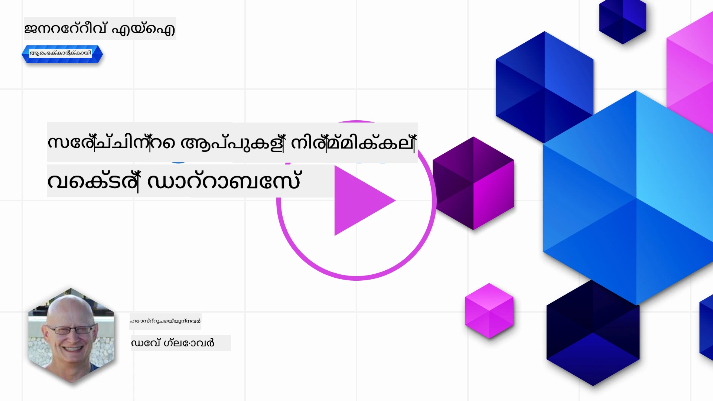
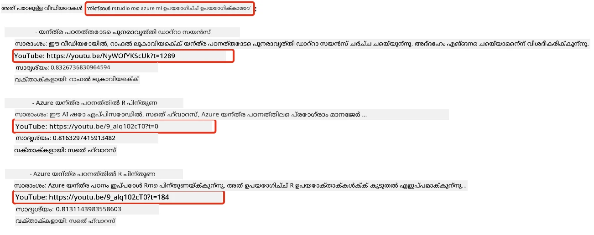
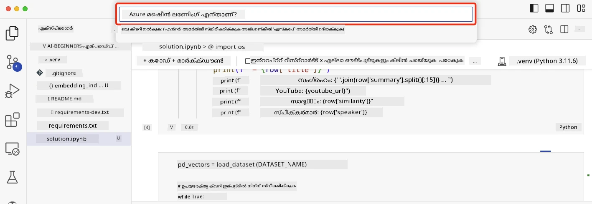

# ഒരു സെർച്ച് ആപ്ലിക്കേഷൻ നിർമ്മിക്കൽ

[](https://youtu.be/W0-nzXjOjr0?si=GcsqiTTvd7RKbo7V)

> > _ഈ പാഠപുസ്തകത്തിന്റെ വീഡിയോ കാണുന്നതിനായി മുകളിലുള്ള ചിത്രം ക്ലിക്ക് ചെയ്യുക_

LLM ൻറെ പ്രവർത്തനം ചാറ്റ്ബോട്ടുകളും എഴുത്ത് സൃഷ്ടിക്കലുമുതലായവയിലേക്കു മാത്രമല്ല. എംബെഡിംഗുകൾ ഉപയോഗിച്ച് സെർച്ച് ആപ്ലിക്കേഷനുകൾ നിർമ്മിക്കാനും സാധ്യതയുണ്ട്. എംബെഡിംഗുകൾ ഡാറ്റയുടെ സംഖ്യാത്മക പ്രതിനിധാനങ്ങളാണ്, വക്ടറുകളായി അറിയപ്പെടുന്നത്, അവ ഡാറ്റക്കായുള്ള അർത്ഥപരമായ സെർച്ചിനായി ഉപയോഗിക്കപ്പെടാറുണ്ട്.

ഈ പാഠത്തിൽ, നമ്മൾ നമ്മുടെ വിദ്യാഭ്യാസ സ്റ്റാർട്ടപ്പിനായി ഒരു സെർച്ച് ആപ്ലിക്കേഷൻ നിർമ്മിക്കാൻ പോകുന്നു. നമ്മുടെ സ്റ്റാർട്ടപ്പ് ഒരു ലാഭരഹിത സംഘടനയാണ്, വികസന രാജ്യങ്ങളിലെ വിദ്യാർത്ഥികൾക്ക് സൗജന്യ വിദ്യാഭ്യാസം നൽകുന്നു. നമ്മുടെ സ്റ്റാർട്ടപ്പിന് യൂട്യൂബിൽ ഉള്ള നിരവധി വീഡിയോകൾ ഉണ്ട്, വിദ്യാർത്ഥികൾ എഐ പഠിക്കാനുള്ളവ. നമ്മുടെ സ്റ്റാർട്ടപ്പ് ഒരു സെർച്ച് ആപ്ലിക്കേഷൻ നിർമ്മിക്കണമെന്ന് ആഗ്രഹിക്കുന്നു, അത് ഒരു വിദ്യാർഥി ഒരു ചോദ്യം টাইപ്പ് ചെയ്ത് യൂട്യൂബ് വീഡിയോ തിരയാൻ നൽകും.

ഉദാഹരണത്തിന്, ഒരു വിദ്യാർത്ഥി 'ജൂപ്പിറ്റർ നോട്ടുബുക്കുകൾ എന്തെല്ലാം?' അല്ലെങ്കിൽ 'അസ്യൂർ ML എന്താണ്' എന്ന് ടൈപ്പ് ചെയ്താൽ, സെർച്ച് ആപ്ലിക്കേഷൻ ചോദ്യത്തിന് അനുയോജ്യമായ യൂട്യൂബ് വീഡിയോകളുടെ ഒരു പട്ടിക തിരിച്ച് നൽകും, അതോടൊപ്പം ചോദ്യത്തിന് ഉത്തരം ലഭിക്കുന്ന വീഡിയോയിലെ സ്താനം തുറന്ന ലിങ്കും നൽകും.

## പരിചയം

ഈ പാഠത്തിൽ നാം പഠിക്കേണ്ടതിനിടയിൽ:

- അർത്ഥപരവും കീවേർഡും സെർച്ച് തമ്മിലുള്ള വ്യത്യാസം
- ടെക്സ്റ്റ് എംബെഡിംഗുകൾ എന്താണ്
- ടെക്സ്റ്റ് എംബെഡിംഗുകൾ ഇൻഡക്സിനെ സൃഷ്ടിക്കൽ
- ടെക്സ്റ്റ് എംബെഡിംഗുകൾ ഇൻഡക്സിൽ സെർച്ച് ചെയ്യൽ

## പഠന ലക്ഷ്യങ്ങൾ

ഈ പാഠം പൂർത്തിയാക്കിയ ശേഷം, നിങ്ങൾ കഴിയും:

- അർത്ഥപരവും കീവേർഡും സെർച്ച് തമ്മിലുള്ള വ്യത്യാസം പറയുക.
- ടെക്സ്റ്റ് എംബെഡിംഗുകൾ എന്താണെന്ന് വിശദീകരിക്കുക.
- ഡാറ്റ സെർച് ചെയ്യാൻ എംബെഡിംഗുകൾ ഉപയോഗിച്ച് ഒരു ആപ്ലിക്കേഷൻ നിർമ്മിക്കുക.

## ഒരു സെർച്ച് ആപ്ലിക്കേഷൻ നിർമ്മിക്കാൻ എന്തുകൊണ്ട്?

ഒരു സെർച്ച് ആപ്ലിക്കേഷൻ ഉണ്ടാക്കുന്നത്, എംബെഡിംഗുകൾ ഉപയോഗിച്ച് ഡാറ്റ എങ്ങനെ തിരയാമെന്ന് മനസ്സിലാക്കാൻ സഹായിക്കും. കൂടാതെ, വിദ്യാർത്ഥികൾക്ക് വേഗത്തിൽ വിവരങ്ങൾ കണ്ടെത്താൻ ഉപയോഗിക്കാവുന്ന സെർച്ച് ആപ്ലിക്കേഷൻ നിർമ്മിക്കാൻ കടുത്ത കഴിവ് നൽകും.

ഈ പാഠത്തിൽ Microsoft [AI Show](https://www.youtube.com/playlist?list=PLlrxD0HtieHi0mwteKBOfEeOYf0LJU4O1) യുട്യൂബ് ചാനലിന്റെ ട്രാൻസ്‌ക്രിപ്റ്റുകളുടെ എംബെഡിംഗുകൾ ഉൾക്കൊള്ളുന്ന ഒരു എംബെഡിംഗ് ഇൻഡക്സ് ഉൾപ്പെടുത്തിയിട്ടുണ്ട്. AI Show എൻ എ ഐയെയും മെഷീൻ ലേണിംഗിനെയും പഠിപ്പിക്കുന്ന യൂട്യൂബ് ചാനലാണ്. 2023 ഒക്ടോബറുവരെ ഉള്ള യുട്യൂബ് ട്രാൻസ്‌ക്രിപ്റ്റുകളുടെ എംബെഡിംഗുകൾ ഈ ഇൻഡക്സ് ഉൾക്കൊള്ളുന്നു. ഈ എംബെഡിംഗ് ഇൻഡക്സ് ഉപയോഗിച്ച് നമ്മുടെ സ്റ്റാർട്ടപ്പിനായി ഒരു സെർച്ച് ആപ്ലിക്കേഷൻ നിർമ്മിക്കും. സെർച്ച് ആപ്ലിക്കേഷൻ ചോദ്യത്തിന് ഏത് ഭാഗത്താണ് ഉത്തരം ലഭിക്കുന്നത് എന്ന് കാണിക്കുന്ന വീഡിയോ ലൊക്കേഷനിൽ ഒരു ലിങ്ക് നൽകും. ഇത് വിദ്യാർത്ഥികൾക്ക് ആവശ്യമുള്ള വിവരം വേഗത്തിൽ കണ്ടെത്താൻ മികച്ച മാർഗമാണ്.

ചോദ്യത്തിന്റെ അർത്ഥപരമായ ഒരു ഉദാഹരണമായി 'can you use rstudio with azure ml?' എന്ന സംവാദത്തിനായുള്ള ഒരു സെമാന്റിക് ക്വറി ചുവടെ കൊടുക്കുന്നു. യുട്യൂബ് URL ശ്രദ്ധിക്കൂ, ടൈംസ്റ്റാമ്പ് അടങ്ങിയതുകൊണ്ട് അത് ചോദ്യത്തിന് ഉത്തരം ലഭിക്കുന്ന വീഡിയോ ഭാഗത്തേക്ക് നിങ്ങളെ കൊണ്ടുപോകും.



## സെമാന്റിക് സെർച്ച് എന്താണ്?

ഇനി നിങ്ങൾക്കു സംശയം തോന്നുമെങ്കിൽ, സെമാന്റിക് സെർച്ച് എന്ത് എന്ന്? സെമാന്റിക് സെർച്ച് ഒരു സെർച്ച് സാങ്കേതിക വിദ്യയാണ്, അതിൽ ക്വറിയിൽ ഉള്ള വാക്കുകളുടെ അർത്ഥം കൂടി ഉപയോഗിച്ച് അനുയോജ്യമായ ഫലം തിരികെ നൽകും.

ഒരു ഉദാഹരണം: നിങ്ങൾ ഒരു കാറ് വാങ്ങാൻ പോകുകയാണെന്ന് കരുതുക, നിങ്ങൾ 'എന്റെ സ്വപ്ന കാർ' എന്ന് സെർച്ച് ചെയ്‌താൽ, സെമാന്റിക് സെർച്ച് മനസ്സിലാക്കുന്നത് നിങ്ങൾ ഒരു കാറിനെ സ്വപ്ന കാണുന്നില്ല, മറിച്ച് നിങ്ങൾ സ്വന്തമായ 'ആദർശ' കാർ വാങ്ങാൻ താല്പര്യമുള്ളതായി ആണ്. സെമാന്റിക് സെർച്ച് നിങ്ങളുടെ ഉദ്ദേശം മനസ്സിലാക്കി അനുയോജ്യമായ ഫലങ്ങൾ ലഭ്യമാക്കും. പകരം, കീവേഡു സെർച്ച് ഉണ്ടെങ്കിൽ നിങ്ങൾ സ്വപ്നത്തിൽ കാണുന്ന കാറുകൾക്കായായി സെർച്ച് ചെയ്‌തതായിരിക്കും, ഇത് അന്വർത്ഥ ഫലങ്ങൾ കൂടി നൽകാറുണ്ട്.

## ടെക്സ്റ്റ് എംബെഡിംഗുകൾ എന്താണ്?

[ടെക്സ്റ്റ് എംബെഡിംഗുകൾ](https://en.wikipedia.org/wiki/Word_embedding?WT.mc_id=academic-105485-koreyst) ഒരു ടെക്സ്റ്റ് പ്രതിനിധാന സാങ്കേതിക വിദ്യയാണ്, ഇത് [നാചുറൽ ലാംഗ്വേജ് പ്രോസസ്സിങ്ങിൽ](https://en.wikipedia.org/wiki/Natural_language_processing?WT.mc_id=academic-105485-koreyst) ഉപയോഗിക്കുന്നു. ടെക്സ്റ്റ് എംബെഡിംഗുകൾ ടെക്സ്റ്റിന്റെ അർത്ഥപരമായ സംഖ്യാത്മക പ്രതിനിധാനങ്ങളാണ്. മെഷീനുകൾക്കായി ഡാറ്റ എളുപ്പത്തിൽ മനസ്സിലാക്കാവുന്നതുപോലെ പ്രതിനിധാനം ചെയ്യാൻ എംബെഡിംഗുകൾ ഉപയോ​ഗിക്കുന്നു. ടെക്സ്റ്റ് എംബെഡിംഗുകൾ സൃഷ്ടിക്കുന്ന നിരവധി മോഡലുകൾ ഉണ്ട്, ഈ പാഠത്തിൽ OpenAI Embedding Model ഉപയോ​ഗിച്ച് എംബെഡിംഗുകൾ സൃഷ്ടിക്കുന്നതിൽ ശ്രദ്ധ കേന്ദ്രീകരിക്കാം.

ഉദാഹരണത്തിന്, താഴെ കാണുന്ന ടെക്സ്റ്റ് AI Show യുട്യൂബ് ചാനൽ ഒരു എപ്പിസോഡിന്റെ ട്രാൻസ്‌ക്രിപ്റ്റിൽ ഉണ്ടെന്ന് കരുതുക:

```text
Today we are going to learn about Azure Machine Learning.
```

ടെക്സ്റ്റ് OpenAI Embedding API -ലേക്ക് അയയ്ക്കും, അത് 1536 സംഖ്യകളുള്ള ഒരു എംബെഡിംഗ് (വക്ടർ) തിരികെ നൽകും. വക്ടറിലുള്ള ഓരോ സംഖ്യയും ടെക്സ്റ്റിന്റെ വ്യത്യസ്ത ഒരു പാർശ്വം പ്രതിനിധാനം ചെയ്യുന്നു. ലഘുവായി ആദ്യത്തെ 10 സംഖ്യകൾ ഇവിടെ കൊടുക്കുന്നു.

```python
[-0.006655829958617687, 0.0026128944009542465, 0.008792596869170666, -0.02446001023054123, -0.008540431968867779, 0.022071078419685364, -0.010703742504119873, 0.003311325330287218, -0.011632772162556648, -0.02187200076878071, ...]
```

## എംബെഡിംഗിൻറെ ഇൻഡക്സ് എങ്ങനെ സൃഷ്ടിക്കാം?

ഈ പാഠത്തിനായി എംബെഡിംഗ് ഇൻഡക്സ് പൈython സ്ക്രിപ്റ്റുകളുടെ പരമ്പര ഉപയോഗിച്ച് സൃഷ്ടിച്ചിരിക്കുന്നു. ഈ പാഠത്തിന്റെ 'scripts' ഫോൾഡറിൽ ഉള്ള [README](./scripts/README.md?WT.mc_id=academic-105485-koreyst) ഡോക്യുമെന്റിൽ സ്ക്രിപ്റ്റുകളും നിർദ്ദേശങ്ങളും കാണാം. ഈ പാഠം പൂർത്തിയാക്കാൻ നിങ്ങൾക്കു സ്ക്രിപ്റ്റുകൾ ഓടിക്കാൻ ആവശ്യമില്ല, കാരണം എംബെഡിംഗ് ഇൻഡക്സ് മുമ്പേ ലഭ്യമാണ്.

സ്ക്രിപ്റ്റുകൾ ചുവടെപ്പറഞ്ഞ കാര്യങ്ങൾ ചെയ്യുന്നു:

1. [AI Show](https://www.youtube.com/playlist?list=PLlrxD0HtieHi0mwteKBOfEeOYf0LJU4O1) പ്ലേലിസ്റ്റിലുള്ള ഓരോ യൂട്യൂബ് വീഡിയോയുടെ ട്രാൻസ്‌ക്രിപ്റ്റും ഡൗൺലോഡ് ചെയ്യുന്നു.
2. [OpenAI ഫംഗ്ഷനുകൾ](https://learn.microsoft.com/azure/ai-foundry/openai/how-to/function-calling?WT.mc_id=academic-105485-koreyst) ഉപയോഗിച്ച് ആദ്യ 3 മിനിറ്റിലെ യൂട്യൂബ് ട്രാൻസ്‌ക്രിപ്റ്റിൽ നിന്നു സ്പീക്കറിന്റെ പേര് എടുക്കാൻ ശ്രമിക്കുന്നു. ഓരോ വീഡിയോയുടെ സ്പീക്കർ നാമം `embedding_index_3m.json` എന്ന എംബെഡിംഗ് ഇൻഡക്സിൽ സൂക്ഷിക്കുന്നു.
3. ട്രാൻസ്‌ക്രിപ്റ്റ് ടെക്സ്റ്റ് **3 മിനിറ്റ് ടെക്സ്റ്റ് സെഗ്മെന്റുകളായി** വിഭജിക്കുകയും ചെയ്തു. അടുത്ത സെഗ്മെന്റിൽ നിന്നുള്ള ഏകദേശം 20 വാക്കുകൾ ഓവർലാപ്പായി ഉൾപ്പെടുത്തുന്നു, ഇതുവഴി സെഗ്മെന്റിന്റെ എംബെഡിംഗ് മുറിഞ്ഞുപോകരുതെന്നും, സെർച്ചിനായി ഉള്ള നല്ല പ്രാധാന്യം നിലനിർത്താനും.
4. ഓരോ ടെക്സ്റ്റ് സെഗ്മെന്റും OpenAI ചാറ്റ് API-ിലേക്ക് അയച്ച് 60 വാക്കുകളിൽ ചുരുക്കം വരുത്തുന്നു. ചുരുക്കവും `embedding_index_3m.json`-ൽ സൂക്ഷിക്കുന്നു.
5. ഒടുവിൽ, സെഗ്മെന്റ് ടെക്സ്റ്റ് OpenAI എംബെഡിംഗ് API-യിലെക് അയയ്ക്കുന്നു. എംബെഡിംഗ് API സെഗ്മെന്റിന്റെ അർത്ഥം പ്രതിനിധീകരിക്കുന്ന 1536 സംഖ്യകൾ അടങ്ങിയ ഒരു വക്ടർ നൽകുന്നു. സെഗ്മെന്റ് OpenAI വക്ടറിനൊടൊപ്പം `embedding_index_3m.json`-ൽ സൂക്ഷിക്കുന്നു.

### വക്ടർ ഡേറ്റാബേസുകൾ

പാഠം എളുപ്പമാക്കാൻ, എംബെഡിംഗ് ഇൻഡക്സ് JSON ഫയൽയായി `embedding_index_3m.json` എന്ന പേരിൽ സൂക്ഷിച്ച്, പാണ്ടാസ് ഡാറ്റാഫ്രെയിമിലേക്ക് ലോഡ് ചെയ്യുന്നു. യാഥാർത്ഥ്യത്തിൽ, ഈ ഇൻഡക്സ് [Azure Cognitive Search](https://learn.microsoft.com/training/modules/improve-search-results-vector-search?WT.mc_id=academic-105485-koreyst), [Redis](https://cookbook.openai.com/examples/vector_databases/redis/readme?WT.mc_id=academic-105485-koreyst), [Pinecone](https://cookbook.openai.com/examples/vector_databases/pinecone/readme?WT.mc_id=academic-105485-koreyst), [Weaviate](https://cookbook.openai.com/examples/vector_databases/weaviate/readme?WT.mc_id=academic-105485-koreyst) പോലുള്ള വക്ടർ ഡേറ്റാബേസുകളിൽ സൂക്ഷിക്കപ്പെടും.

## കോസൈൻ സാദൃശ്യം തിരിച്ചറിയൽ

നാം ടെക്സ്റ്റ് എംബെഡിംഗുകൾക്കുറിച്ച് പഠിച്ചു, അടുത്തത് ടെക്സ്റ്റ് എംബെഡിംഗുകൾ സെർച്ച് ചെയ്യാനും പ്രത്യേകിച്ച് ഒരു ക്വറിയിനോട് ഏറ്റവും സമാനമുള്ള എംബെഡിംഗുകൾ കണ്ടെത്താൻ കോസൈൻ സാദൃശ്യം ഉപയോഗിക്കാനുമാണ്.

### കോസൈൻ സാദൃശ്യം എന്താണ്?

കോസൈൻ സാദൃശ്യം രണ്ട് വക്ടറുകൾ തമ്മിലുള്ള സമാനതയുടെ ഒരു അളവാണ്, ഇതിനെ `ഏറ്റവും അടുത്ത അയൽ സെർച്ചും` എന്ന് വിളിക്കാറുണ്ട്. കോസൈൻ സാദൃശ്യം സെർച്ച് നടത്താൻ OpenAI എംബെഡിംഗ് API ഉപയോഗിച്ച് ക്വറി ടെക്സ്റ്റ് വക്ടറാക്കി, ഇൻഡക്സ് വക്ടറുകളെല്ലാം അതുമായി താരതമ്യം ചെയ്ത് കോസൈൻ സാദൃശ്യം കണക്കാക്കണം. ഇൻഡക്സ് യുട്യൂബ് ട്രാൻസ്‌ക്രിപ്റ്റ് സെഗ്മെന്റുകൾക്കുള്ള വക്ടറുകൾ ഉൾക്കൊള്ളുന്നു. അവസാനം കോസൈൻ സാദൃശ്യം അടിസ്ഥാനമാക്കി ഫലങ്ങൾ ക്രമീകരിച്ച് ഏറ്റവും ഉയർന്ന സാമ്യമുള്ള സെഗ്മെന്റുകൾ കണ്ടെത്തും.

ഗണിതപരമായി, കോസൈൻ സാദൃശ്യം ഒരു മൾട്ടിഡൈമെൻഷണൽ സ്പേസിലെ രണ്ട് വക്ടറുകളുടെ ഇടയിൽ വരുന്ന കോണിന്റെ കോസൈൻ കണക്കാക്കലാണ്. ഇത് എളുപ്പമാണ്, കാരണം دوهژگی euclidean ദൂരംവേലുന്നത് കാരണം രണ്ട് ഡോക്യുമെന്റുകൾ വളരെ വിടർന്നു ഉണ്ടായിരിക്കും, പക്ഷേ അവക്കിടയിൽ കോണിന്റെ വലിപ്പം ചെറുതായിരിക്കും, അതിനാൽ കൂടുതൽ കോസൈൻ സാദൃശ്യം ഉണ്ടായേക്കാം. കോസൈൻ സാദൃശ്യം സൂചനകളും സമവാക്യങ്ങളും കൂടുതൽ അറിയാൻ [Cosine similarity](https://en.wikipedia.org/wiki/Cosine_similarity?WT.mc_id=academic-105485-koreyst) കാണുക.

## നിങ്ങളുടെ ആദ്യ സെർച്ച് ആപ്ലിക്കേഷൻ നിർമ്മിക്കൽ

ഇനി, നാം എംബെഡിംഗുകൾ ഉപയോഗിച്ച് ഒരു സെർച്ച് ആപ്ലിക്കേഷൻ നിർമ്മിക്കാൻ പഠിക്കും. ഈ സെർച്ച് ആപ്ലിക്കേഷൻ വിദ്യാർത്ഥികൾക്ക് ഒരു ചോദ്യത്തിൽ ടൈപ്പ് ചെയ്ത് വീഡിയോ തിരയാൻ കഴിയും. ചോദ്യത്തിന് അനുയോജ്യമായവയുള്ള ഒരു വീഡിയോ പട്ടികയും, ചോദ്യത്തിന് ഉത്തരം ലഭിക്കുന്ന വീഡിയോ ഭാഗത്തേക്ക് ഒരു ലിങ്കും നൽകും.

ഈ പരിഹാരം Windows 11, macOS, Ubuntu 22.04 എന്നിവയിൽ Python 3.10 അല്ലെങ്കിൽ അതിനും മുകളിൽ ആവശ്യമുള്ള പതിപ്പിൽ നിർമ്മിക്കുകയും പരീക്ഷിക്കുകയും ചെയ്തു. Python [python.org](https://www.python.org/downloads/?WT.mc_id=academic-105485-koreyst) നിന്നു ഡൗൺലോഡ് ചെയ്യാം.

## അസൈൻമെന്റ് - വിദ്യാർത്ഥികൾക്ക് സെർച്ച് ആപ്ലിക്കേഷൻ സൃഷ്ടിക്കാനുള്ള സാധ്യത നൽകൽ

പാഠം ആരംഭത്തിൽ ഞങ്ങൾ നമ്മുടെ സ്റ്റാർട്ടപ്പിനെ പരിചയപ്പെടുത്തി. ഇപ്പോൾ, വിദ്യാർത്ഥികൾക്ക് അവരുടെ അസസ്‌മെന്റുകള്ക്കായി സെർച്ച് ആപ്ലിക്കേഷൻ നിർമ്മിക്കാൻ അനുവദിക്കാനുള്ള സമയം.

ഈ അസൈൻമെന്റിൽ, നിങ്ങൾ സെർച്ച് ആപ്ലിക്കേഷൻ നിർമ്മിക്കാൻ ഉപയോഗിക്കുന്ന Azure OpenAI സേവനങ്ങൾ സൃഷ്ടിക്കും. താഴെപ്പറയുന്ന Azure OpenAI സേവനങ്ങൾ നിങ്ങൾ സൃഷ്ടിക്കണം. ഈ അസൈൻമെന്റ് പൂർത്തിയാക്കാൻ ഒരു Azure സബ്‌സ്‌ക്രിപ്ഷൻ വേണം.

### Azure ക്ലൗഡ് ഷെൽ ആരംഭിക്കുക

1. [Azure പോർട്ടലിൽ](https://portal.azure.com/?WT.mc_id=academic-105485-koreyst) സൈൻ ഇൻ ചെയ്യുക.
2. Azure പോർട്ടലിലെ മുകളിൽ വലതുവശത്തുള്ള ക്ലൗഡ് ഷെൽ ഐക്കൺ തിരഞ്ഞെടുക്കുക.
3. എൻവയോൺമെന്റ് തരം ആയി **Bash** തിരഞ്ഞെടുക്കുക.

#### ഒരു റിസോഴ്സ് ഗ്രൂപ്പ് സൃഷ്ടിക്കുക

> ഈ നിർദ്ദേശങ്ങളിൽ, East US ല്‍ ഉള്ള "semantic-video-search" എന്ന റിസോഴ്സ് ഗ്രൂപ്പ് ഉപയോഗിക്കുന്നു.
> നിങ്ങൾക്ക് റിസോഴ്‌സ് ഗ്രൂപ്പ് നാമം മാറ്റാൻ കഴിയും, എന്നാൽ റിസോഴ്‌സുകളുടെ സ്ഥലം മാറ്റുമ്പോൾ,
> [മോഡൽ ലഭ്യതാ ടേബിൾ](https://aka.ms/oai/models?WT.mc_id=academic-105485-koreyst) പരിശോധിക്കുക.

```shell
az group create --name semantic-video-search --location eastus
```

#### ഒരു Azure OpenAI സേവന റിസോഴ്സ് സൃഷ്ടിക്കുക

Azure ക്ലൗഡ് ഷെൽ നിന്ന് താഴെ കാണുന്ന കമാൻഡ് ഓടിച്ച് Azure OpenAI സെർവീസ് റിസോഴ്സ് സൃഷ്ടിക്കുക.

```shell
az cognitiveservices account create --name semantic-video-openai --resource-group semantic-video-search \
    --location eastus --kind OpenAI --sku s0
```

#### ഈ ആപ്ലിക്കേഷനിൽ ഉപയോഗിക്കുന്ന എന്റ്‌പോയിന്റും കീകളും നേടുക

Azure ക്ലൗഡ് ഷെൽ വഴി താഴെ കാണുന്ന കമാൻഡുകൾ ഓടിച്ച് Azure OpenAI സേവനത്തിന്റെ എന്റ്‌പോയിന്റും കീകളും നേടുക.

```shell
az cognitiveservices account show --name semantic-video-openai \
   --resource-group  semantic-video-search | jq -r .properties.endpoint
az cognitiveservices account keys list --name semantic-video-openai \
   --resource-group semantic-video-search | jq -r .key1
```

#### OpenAI എംബെഡിംഗ് മോഡൽ ഡിപ്ലോയ് ചെയ്യൽ

Azure ക്ലൗഡ് ഷെൽ വഴി താഴെ കാണുന്ന കമാൻഡ് റൺ ചെയ്യുക OpenAI എംബെഡിംഗ് മോഡൽ ഡിപ്ലോയ് ചെയ്യാൻ.

```shell
az cognitiveservices account deployment create \
    --name semantic-video-openai \
    --resource-group  semantic-video-search \
    --deployment-name text-embedding-ada-002 \
    --model-name text-embedding-ada-002 \
    --model-version "2"  \
    --model-format OpenAI \
    --sku-capacity 100 --sku-name "Standard"
```

## പരിഹാരം

GitHub കോഡ്‌സ്‌പേസിലെ [പരിഹാര നോട്ടുബുക്ക്](./python/aoai-solution.ipynb?WT.mc_id=academic-105485-koreyst) തുറന്ന് ജുപൈറ്റർ നോട്ടുബുക്കിലെ നിർദ്ദേശങ്ങൾ അനുസരിക്കുക.

നോട്ടുബുക്ക് റൺ ചെയ്‌താൽ, നിങ്ങൾ ഒരു ചോദ്യം നൽകാൻ പ്രോമ്പ്റ്റ് ചെയ്യും. ഇൻപുട്ട് ബോക്സ് ഇപ്രകാരമാണുള്ളത്:



## നന്നായി! നിങ്ങളുടെ പഠനം തുടരം പാലിക്കുക

ഈ പാഠം പൂർത്തിയാക്കിയതിന് ശേഷം, നമ്മുടെ [ജനറേറ്റീവ് എഐ പഠന ശേഖരം](https://aka.ms/genai-collection?WT.mc_id=academic-105485-koreyst) പരിശോധിച്ച് നിങ്ങളുടെ ജനറേറ്റീവ് എഐ അറിവ് മെച്ചപ്പെടുത്താൻ തുടരുക!

നൂറാം പാഠത്തിലേക്ക് പോയി, അവിടെ നാം [ഇമേജ് ജനറേഷൻ ആപ്ലിക്കേഷനുകൾ എങ്ങനെ നിർമ്മിക്കാമെന്ന്](../09-building-image-applications/README.md?WT.mc_id=academic-105485-koreyst) പരിശോധിക്കും!

---

<!-- CO-OP TRANSLATOR DISCLAIMER START -->
**അറിയിപ്പ്**:
ഈ രേഖ AI പരിഭാഷാ സേവനം [Co-op Translator](https://github.com/Azure/co-op-translator) ഉപയോഗിച്ച് പരിഭാഷപ്പെടുത്തിയതാണ്. ഞങ്ങൾ കൃത്യതയ്ക്കായി ശ്രമിക്കുന്നുവെങ്കിലും, ഓട്ടോമേറ്റഡ് പരിഭാഷകളിൽ പിഴവുകൾ അല്ലെങ്കിൽ തെറ്റായ വിവരങ്ങൾ ഉണ്ടാകാൻ സാധ്യതയുണ്ട്. അതിന്റെ സ്വാഭാവിക ഭാഷയിലുള്ള അസൽ രേഖയാണ് പ്രാമാണികമായ ഉറവിടമായി പരിഗണിക്കേണ്ടത്. നിർണായകമായ വിവരങ്ങൾക്ക്, പ്രൊഫഷണൽ മനുഷ്യ പരിഭാഷ ശുപാർശ ചെയ്യുന്നു. ഈ പരിഭാഷ ഉപയോഗിച്ച് ഉണ്ടാകുന്ന തെറ്റിദ്ധാരണകൾ അല്ലെങ്കിൽ തെറ്റായ വ്യാഖ്യാനങ്ങൾക്കായി ഞങ്ങൾ ഉത്തരവാദികളല്ല.
<!-- CO-OP TRANSLATOR DISCLAIMER END -->