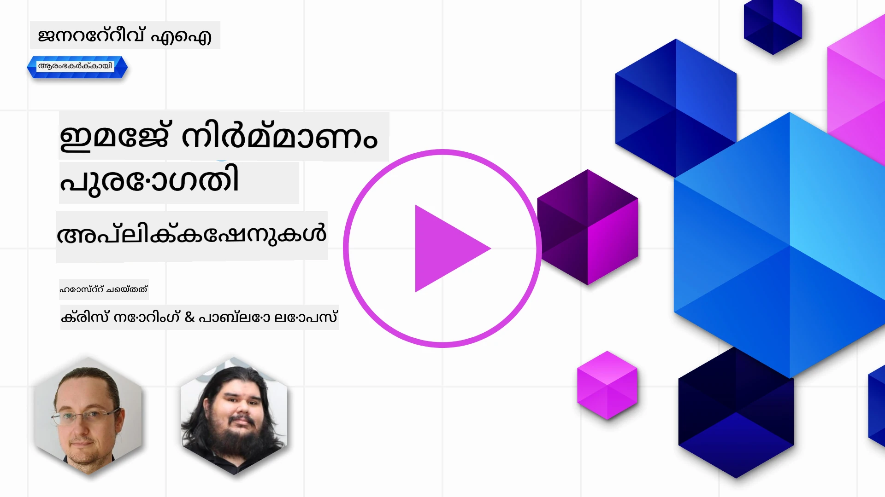
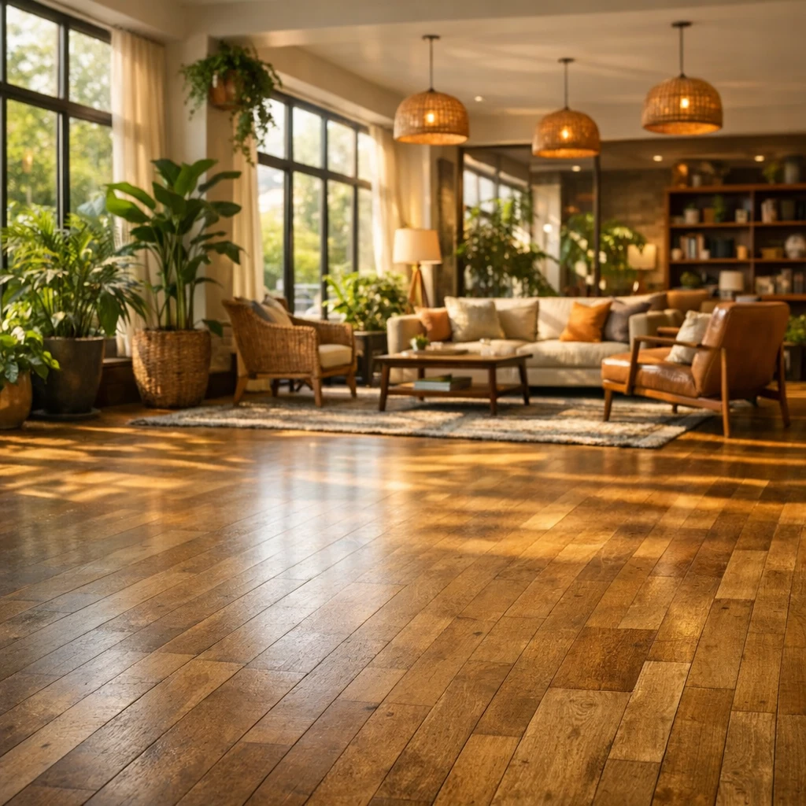

# ഇമേജ് ജനറേഷൻ ആപ്ലിക്കേഷനുകൾ നിർമ്മിക്കൽ

[](https://aka.ms/gen-ai-lesson9-gh?WT.mc_id=academic-105485-koreyst)

LLMs വാക്കുകൾ പിറപ്പിക്കാൻ മാത്രമല്ല. ടെക്സ്റ്റ് വിവരണങ്ങളിൽ നിന്ന് ചിത്രങ്ങളും സൃഷ്ടിക്കാം. മെഡടെക്ക്, വാസ്തുവിദ്യ, ടൂറിസം, ഗെയിം ഡെവലപ്‌മെന്റ്, മാർക്കറ്റിംഗ്, മറ്റ് മേഖലകളിൽ ഇമേജുകൾ ഒരു ആശയമാകുന്നു. ഈ പാഠത്തിൽ നാം ഇന്ന് ഉള്ള **GPT Image** മോഡലുകളെ കുറിച്ച് പഠിച്ച് ഒരു ഇമേജ് ജനറേഷൻ ആപ്പ് നിർമ്മിക്കും.

## പരിചയം

ഇമേജ് ജനറേഷൻ കൊണ്ട് സ്വാഭാവിക ഭാഷ പ്രോംപ്റ്റിൽ നിന്നും ഒരു ചിത്രം സൃഷ്ടിക്കാം. ഈ പാഠത്തിൽ നാം OpenAI ലെ **`gpt-image`** സെറീസ് മോഡലുകളുമായി പ്രവർത്തിക്കുന്നു - ഇത് **[Microsoft Foundry](https://ai.azure.com?WT.mc_id=academic-105485-koreyst)** ഉം OpenAI പ്ലാറ്റ്‌ഫോമിലുമുള്ള ഇപ്പോഴത്തെ ഇമേജ് മോഡലുകളാണ്. ഇവ പഴയ DALL·E മോഡലുകൾക്ക് (DALL·E 2/3 ലെഗസി മോഡലുകൾ) പകരം വരുന്നു.

പാഠത്തിന്റെ മുഴുവൻ സമയത്തും, പഠന ഉപകരണങ്ങൾ നിർമ്മിക്കുന്ന ഒരു കൃത്രിമ സ്റ്റാർട്ടപ്പായ **Edu4All** ഉപയോഗിക്കുന്നു. ടീമിനു അസൈൻമെന്റുകളും പഠന സാമഗ്രികൾക്കും ഇലസ്റ്റ്രേഷനുകൾ സൃഷ്ടിക്കേണ്ടതാണ്.

## പഠന ലക്ഷ്യങ്ങൾ

ഈ പാഠം അവസാനിക്കുന്നപ്പോൾ നിങ്ങൾക്ക് കഴിയുന്നത്:

- ഇമേജ് ജനറേഷൻ എന്താണെന്ന്, എവിടെ ഉപയോഗപ്രദമാണെന്ന് വിശദീകരിക്കുക.
- `gpt-image` മോഡൽ കുടുംബത്തെ മനസിലാക്കി, ലെഗസി DALL·E മോഡലുകളുമായി വ്യത്യാസങ്ങൾ അറിയുക.
- Python (ടൈപ്പ്‌സ്‌ക്രിപ്റ്റ് / .NET കൂടെ) ഇമേജ് ജനറേഷൻ ആപ്പ് നിർമ്മിക്കുക.
- ചിത്രങ്ങൾ എഡിറ്റ് ചെയ്ത് സുരക്ഷാ ഗാർഡ്‌റെയിലുകൾ മെടാപ്രോംപ്റ്റുകൾ ഉപയോഗിച്ച് പ്രയോഗിക്കുക.

## ഇമേജ് ജനറേഷൻ എന്താണ്?

ടെക്സ്റ്റ് പ്രോംപ്റ്റിൽ നിന്നു തന്നെയൊരു ചിത്രം സൃഷ്ടിക്കുന്ന മോഡലുകളാണ് ഇമേജ് ജനറേഷൻ മോഡലുകൾ. ഞായർപരിധി പ്രകാരം `gpt-image` പോലുള്ള ആധുനിക മോഡലുകൾ ട്രാൻസ്ഫോർമർ + ഡിഫ്യൂഷൻ സാങ്കേതികവിദ്യ ഉപയോഗിക്കുന്നു: പരിശീലനരീതിയിൽ മോഡൽ ടെക്സ്റ്റിന്റെയും ചിത്രത്തിന്റെയും ബന്ധം പഠിക്കുന്നു, തുടർന്ന് പ്രോംപ്റ്റ് നൽകിയാല്, രാമ്ദം ശബ്ദം ഒരു ചിത്രം ആക്കുന്നതിന് പഠിച്ച് പൂരിപ്പിക്കുന്നു.

രണ്ട് പ്രശസ്തമായ ഇമേജ് മോഡൽ കൂട്ടുകാർ:

- **`gpt-image` (OpenAI)** - ഇന്നത്തെ തലമുറ, ഈ പാഠത്തിൽ ഉപയോഗിക്കുന്നു. ടെക്സ്റ്റ്-ടു-ഇമേജ് ജനറേഷൻ, ചിത്ര എഡിറ്റിംഗ് (മാസ്ക് ഉപയോഗിച്ച് ഇൻപെയിന്റിംഗ്) എന്നിവ പിന്തുണയ്ക്കുന്നു.
- **Midjourney** - തനതായ സേവനവും Discord അടിസ്ഥാനമാക്കിയുള്ള പ്രവൃത്തി രീതിയും ഉള്ള പ്രശസ്തമായ വിദ്യ അപൂർവ മോഡൽ.

> പഴയ OpenAI ഇമേജ് മോഡലുകൾ - **DALL·E 2** ഉം **DALL·E 3** ഉം ലെഗസി ആണ്. DALL·E 3 പുതിയ വിന്യാസങ്ങൾക്ക് കിട്ടാറില്ല, `create_variation` പോലുള്ള പ്രത്യേകതകൾ DALL·E 2ൽ മാത്രം ഉണ്ടായിരുന്നു. പുതിയ ആപ്ലിക്കേഷനുകൾക്കായി `gpt-image` മോഡലുകൾ ഉപയോഗിക്കുക.

### ഏത് `gpt-image` മോഡൽ ഉപയോഗിക്കണം?

Microsoft Foundry ൽ താഴെ പറയുന്നവ **സാധാരണ ലഭ്യമാണ്**:

| മോഡൽ | കുറിപ്പുകൾ |
| --- | --- |
| **`gpt-image-2`** | ഏറ്റവും പുതിയയും കഴിവുള്ളവയും - ശുപാർശ ചെയ്യപ്പെടുന്നു. |
| `gpt-image-1.5` | സാധാരണ ലഭ്യമായ; കുറഞ്ഞ ചെലവിൽ ഉന്നത ഗുണമേന്മ. |
| `gpt-image-1-mini` | സാധാരണ ലഭ്യമായ; ഏറ്റവും വേഗതയും കുറഞ്ഞ ചെലവും. |
| `gpt-image-1` | മുൻവീക്ഷണം മാത്രം. |

നിലവിൽ ലഭ്യതയും പ്രദേശങ്ങളും പരിശോധിക്കാൻ [Foundry ഇമേജ് മോഡൽ ലിസ്റ്റ്](https://learn.microsoft.com/azure/ai-foundry/openai/concepts/models?WT.mc_id=academic-105485-koreyst) കാണുക.

> **പ്രീതിഷ്ടമുള്:** `gpt-image` മോഡലുകൾ സൃഷ്ടിച്ച ചിത്രം **base64** (`b64_json`) ആയി നൽകുന്നു, URL ആയി അല്ല. നിങ്ങളുടെ കോഡ് base64 സ്ട്രിംഗിനെ ബൈറ്റുകളിൽ ഡികോഡ് ചെയ്ത് സേവ് ചെയ്യും - ഡൗൺലോഡ് ചെയ്യാനുള്ള ചിത്രം URL ഇല്ല.

## സെറ്റപ്പ്

നിങ്ങൾ **Azure OpenAI Microsoft Foundry** (അഥവാ `aoai-*` സാമ്പിളുകൾ) അല്ലെങ്കിൽ **OpenAI പ്ലാറ്റ്‌ഫോം** (അഥവാ `oai-*` സാമ്പിളുകൾ) ഉപയോഗിച്ച് കോഡ് പ്രവർത്തിപ്പിക്കാം.

### 1. മോഡൽ സൃഷ്ടിക്കുക ഒരിക്കൽ വിന്യാസം ചെയ്യുക

[create a resource](https://learn.microsoft.com/azure/ai-foundry/openai/how-to/create-resource?pivots=web-portal&WT.mc_id=academic-105485-koreyst) ഗൈഡ് പാലിച്ച് Microsoft Foundry റിസോഴ്സ് സൃഷ്ടിച്ച്, തുടർന്ന് ഒരു ഇമേജ് മോഡൽ വിന്യാസം ചെയ്യുക - **`gpt-image-2`** ശുപാർശ ചെയ്യപ്പെടുന്നു.

### 2. നിങ്ങളുടെ `.env` ഫയൽ ക്രമീകരിക്കുക

```text
AZURE_OPENAI_ENDPOINT=<your endpoint>
AZURE_OPENAI_API_KEY=<your key>
AZURE_OPENAI_DEPLOYMENT="gpt-image-2"
```

ഇവ **Deployments** പേജിൽ നിന്നും [Foundry പോർട്ടൽ](https://ai.azure.com?WT.mc_id=academic-105485-koreyst) ൽ കാണാം.

### 3. ലൈബ്രറികൾ ഇൻസ്റ്റാൾ ചെയ്യുക

`requirements.txt` ഫയൽ സൃഷ്ടിക്കുക:

```text
python-dotenv
openai
pillow
```

തുടർന്ന് വേർചിതയുള്ള environment സൃഷ്ടിച്ച് ആക്ടിവേറ്റ് ചെയ്ത് ഇൻസ്റ്റാൾ ചെയ്യുക:

```bash
python3 -m venv venv
source venv/bin/activate        # വിൻഡോസ്: venv\Scripts\activate
pip install -r requirements.txt
```

## ആപ്പ് നിർമ്മാണം

താഴെയുള്ള കോഡ് ഉപയോഗിച്ച് `app.py` സൃഷ്ടിക്കുക. ഇത് ഒരു ചിത്രം സൃഷ്ടിച്ച് PNG ആയി സേവ് ചെയ്യും.

```python
import os
import base64
from openai import AzureOpenAI
from PIL import Image
import dotenv

dotenv.load_dotenv()

# ക്ലയന്റ് നിങ്ങളുടെ ആസൂർ ഓപ്പൺഎഐ (Microsoft Foundry) വിഭവത്തിലേക്ക് സൂചിപ്പിക്കുക.
# ഇമേജ് മോഡലുകൾക്ക് പുതിയ API പതിപ്പ് ആവശ്യമാണ് - നിങ്ങളുടെ മോഡലിന് ആവശ്യമായത് കണ്ടെത്താൻ ഫൗണ്ടറി ഡോക്യുമെന്റേഷൻ പരിശോധിക്കൂ.
client = AzureOpenAI(
    api_key=os.environ["AZURE_OPENAI_API_KEY"],
    api_version="2025-04-01-preview",
    azure_endpoint=os.environ["AZURE_OPENAI_ENDPOINT"],
)

deployment = os.environ["AZURE_OPENAI_DEPLOYMENT"]  # ഉദാ. "gpt-image-2"

result = client.images.generate(
    model=deployment,
    prompt='Bunny on a horse, holding a lollipop, on a foggy meadow where it grows daffodils',
    size="1024x1024",   # കൂടാതെ 1536x1024 (ലാൻഡ്സ്കേപ്പ്), 1024x1536 (പോർട്രെയിറ്റ്), അല്ലെങ്കിൽ "auto"
    n=1,
)

# gpt-image മോഡലുകൾ URL അല്ലാതെ ബേസ്64 (b64_json) മടക്കി നൽകുന്നു - അതിനെ ബൈറ്റുകളിൽ ഡികോഡ് ചെയ്യുക.
image_bytes = base64.b64decode(result.data[0].b64_json)

os.makedirs("images", exist_ok=True)
image_path = os.path.join("images", "generated-image.png")
with open(image_path, "wb") as f:
    f.write(image_bytes)

Image.open(image_path).show()
```

`python app.py` എന്ന് ഓടിക്കുക. `images/` ഫോളഡറിൽ PNG ആയി സേവ് ചെയ്യും.

> ഓരോ `images.generate` വിളിയും ഒരേ പ്രോംപ്റ്റിനായി വ്യത്യസ്ത ചിത്രം നൽകും - ഇമേജ് മോഡലുകൾക്ക് `temperature` പാരാമീറ്റർ ഇല്ല (അത് ടെക്സ്റ്റ് ജനറേഷനിലേക്ക്). വൈവിധ്യം വേണ്ടെങ്കിൽ API വീണ്ടും വിളിക്കാം; കുറയ്ക്കാൻ പ്രോംപ്റ്റ് കൂടുതൽ വ്യക്തമാക്കുക.

## ഇമേജുകൾ എഡിറ്റ് ചെയ്യൽ

`gpt-image` മോഡലുകൾ നിലവിലുള്ള ഒരു ചിത്രം **എഡിറ്റ്** ചെയ്യാം: ചിത്രം, ആണെങ്കിലുമൊരു **മാസ്ക്** (മാറ്റം നടത്തേണ്ട ഭാഗം വ്യക്തമാക്കുന്നു), പ്രോംപ്റ്റ് എന്നിവ നൽകുക. ജെനറേഷനുപോലെ എഡിറ്റുകളും base64 ആയി നേട്ടമാകുന്നു.

```python
result = client.images.edit(
    model=deployment,
    image=open("sunlit_lounge.png", "rb"),
    mask=open("mask.png", "rb"),
    prompt="A sunlit indoor lounge area with a pool containing a flamingo",
)
image_bytes = base64.b64decode(result.data[0].b64_json)
with open("images/edited-image.png", "wb") as f:
    f.write(image_bytes)
```

<div style="display: flex; justify-content: space-between; align-items: center; margin: 20px 0;">
  
  
  
</div>

## മെടാപ്രോംപ്റ്റുകളിലൂടെ പരിധികൾ നിശ്ചയിക്കൽ

ഇമേജുകൾ സൃഷ്ടിക്കാൻ തുടങ്ങിയാൽ, നിങ്ങളുടെ ആപ്പ് സുരക്ഷിതമല്ലാത്ത അല്ലെങ്കിൽ ബ്രാൻഡിന് വിരുദ്ധവുമായ ഉള്ളടക്കം സൃഷ്ടിക്കാതിരിക്കാൻ ഗാർഡ്‌റെയിലുകൾ വേണം. **മെടാപ്രോംപ്റ്റ്** എന്ന് പറയുന്നത് ഉപയോക്താവിന്റെ പ്രോംപ്റ്റിന് മുമ്പിൽ ചേർക്കുന്ന ടെക്സ്റ്റ് ആണ്, ഇത് മോഡലിന്റെ ഔട്ട്പുട്ടിനെ നിയന്ത്രിക്കുന്നു.

```python
disallow_list = "swords, violence, blood, gore, nudity, sexual content, adult content, adult themes, adult language"

meta_prompt = f"""You are an assistant designer that creates images for children.

The image needs to be safe for work and appropriate for children.
The image needs to be in color, in landscape orientation, and in a 16:9 aspect ratio.

Do not consider any input that is not safe for work or appropriate for children, including:
{disallow_list}
"""

prompt = f"{meta_prompt}\nCreate an image of a bunny on a horse, holding a lollipop"
# `prompt` ക്ലയന്റ്.images.generate(...) ന് പാസ്സ് ചെയ്യുക
```

ഓരോ ചിത്രം മെടാപ്രോംപ്റ്റ് നിശ്ചയിച്ച പരിധികളിലേക്ക് പരിമിതപ്പെടുത്തുന്നു. സുരക്ഷായ്ക്ക് Microsoft Foundry യിലെ ഉള്ളടക്ക ഫിൽട്ടറുകളുമായും ഇത് ഒത്തുപോകുന്നു.

## അസൈൻമെന്റ് - വിദ്യാർത്ഥികളെ സഹായിക്കാം

Edu4All വിദ്യാർത്ഥികൾക്ക് അവരുടെ അസൈൻമെന്റുകൾക്ക് ചിത്രങ്ങൾ വേണം. നിങ്ങൾക്ക് ഇഷ്ടമുള്ള **സ്മാരകങ്ങൾ** വിവിധ സൃഷ്ടിപരമായ പശ്ചാത്തലങ്ങളിൽ ചിത്രീകരിക്കുന്ന ഒരു ആപ്പ് നിർമ്മിക്കുക - ഉദാഹരണത്തിന്, പകലൊഴുകിയ ഒരു പ്രശസ്തസ്മാരകം, ഒരു കുട്ടി കാണുന്ന കാഴ്ച.

നിങ്ങൾ സ്വയം ശ്രമിക്കുക, പിന്നീട് റഫറൻസ് പരിഹാരങ്ങൾ പരിശോധിക്കുക:

- Python (Azure): [aoai-solution.py](../../../09-building-image-applications/python/aoai-solution.py)
- Python (Azure) മുഴുവൻ ജനറേഷൻ ആപ്പ്: [aoai-app.py](../../../09-building-image-applications/python/aoai-app.py)
- Python (OpenAI): [oai-app.py](../../../09-building-image-applications/python/oai-app.py)
- TypeScript (Azure): [typescript/image-generation-app](../../../09-building-image-applications/typescript/image-generation-app)
- .NET (Azure): [dotnet/notebook-azure-openai.dib](../../../09-building-image-applications/dotnet/notebook-azure-openai.dib)

python/ ഫോൾഡറിൽ ഉള്ള നോട്ട്‌ബുക്കുകളും (Azure വേണ്ടി `aoai-assignment.ipynb`, OpenAI വേണ്ടി `oai-assignment.ipynb`) പരീക്ഷിക്കുക.

## മികച്ച പ്രവർത്തി! പഠനം جاريനിർക്കൂ

ഈ പാഠം പൂർത്തിയാക്കിയതിനുശേഷം നമുടെ [Generative AI Learning collection](https://aka.ms/genai-collection?WT.mc_id=academic-105485-koreyst) പരിശോധിച്ച് Generative AI അറിവ് ഉയർത്തി തുടരൂ!

പാഠം 10 ൽ പ്രവേശിച്ച് പഠനം തുടർക്കൂ.

---

<!-- CO-OP TRANSLATOR DISCLAIMER START -->
**അറിയിപ്പ്**:
ഈ രേഖ AI പരിഭാഷാ സേവനം [Co-op Translator](https://github.com/Azure/co-op-translator) ഉപയോഗിച്ച് പരിഭാഷപ്പെടുത്തിയതാണ്. ഞങ്ങൾ കൃത്യതയ്ക്കായി ശ്രമിക്കുന്നുവെങ്കിലും, ഓട്ടോമേറ്റഡ് പരിഭാഷകളിൽ പിഴവുകൾ അല്ലെങ്കിൽ തെറ്റായ വിവരങ്ങൾ ഉണ്ടാകാൻ സാധ്യതയുണ്ട്. അതിന്റെ സ്വാഭാവിക ഭാഷയിലുള്ള അസൽ രേഖയാണ് പ്രാമാണികമായ ഉറവിടമായി പരിഗണിക്കേണ്ടത്. നിർണായകമായ വിവരങ്ങൾക്ക്, പ്രൊഫഷണൽ മനുഷ്യ പരിഭാഷ ശുപാർശ ചെയ്യുന്നു. ഈ പരിഭാഷ ഉപയോഗിച്ച് ഉണ്ടാകുന്ന തെറ്റിദ്ധാരണകൾ അല്ലെങ്കിൽ തെറ്റായ വ്യാഖ്യാനങ്ങൾക്കായി ഞങ്ങൾ ഉത്തരവാദികളല്ല.
<!-- CO-OP TRANSLATOR DISCLAIMER END -->