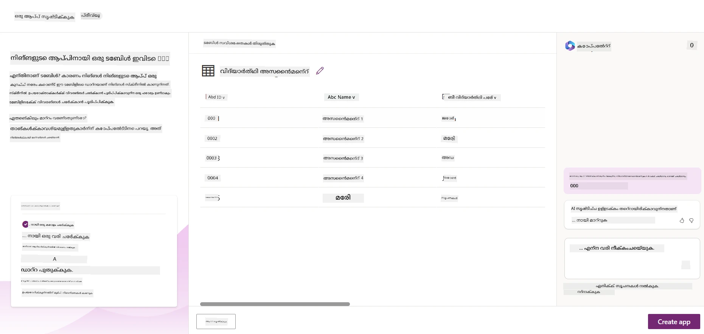
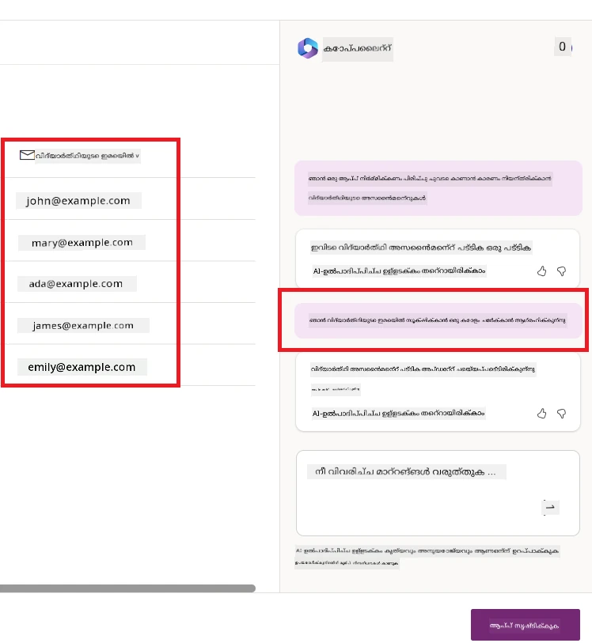
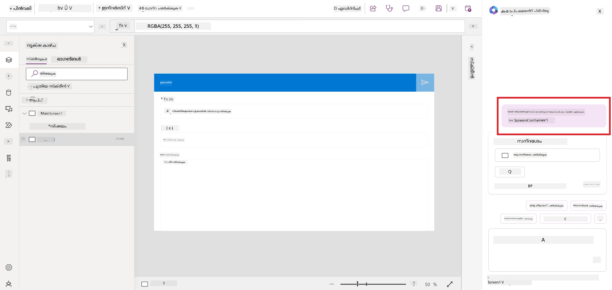
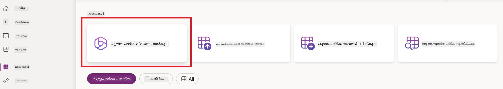
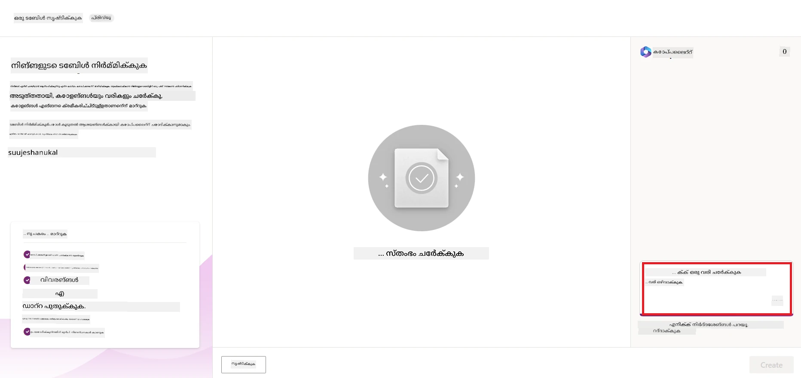
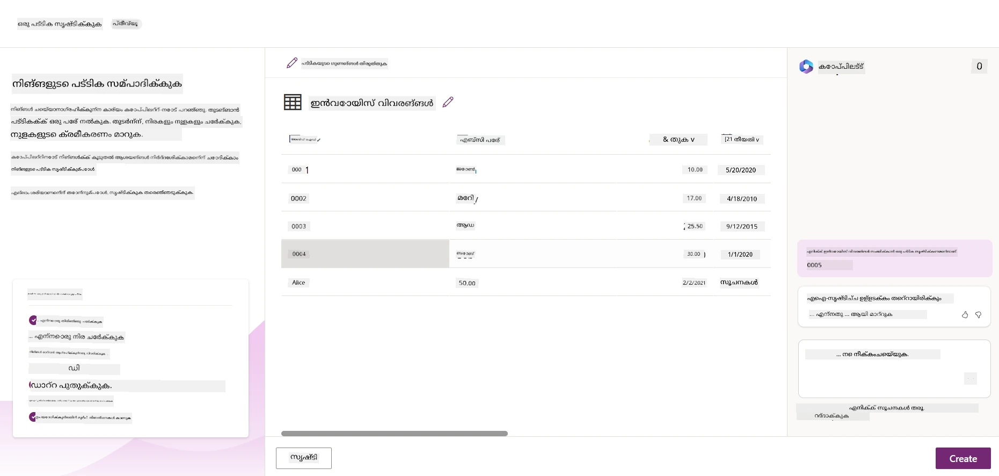
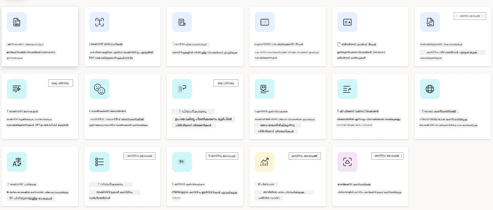
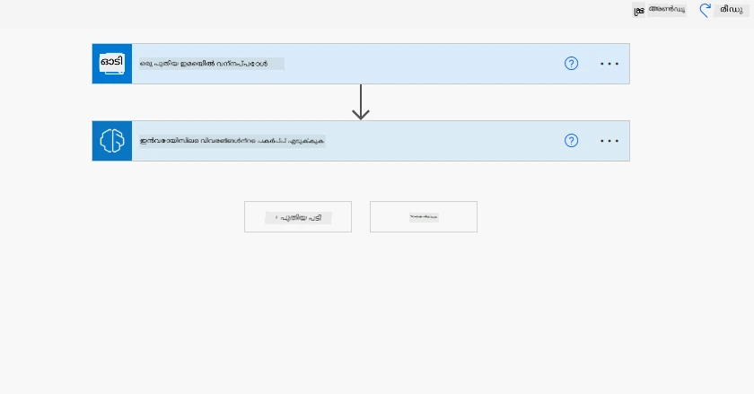
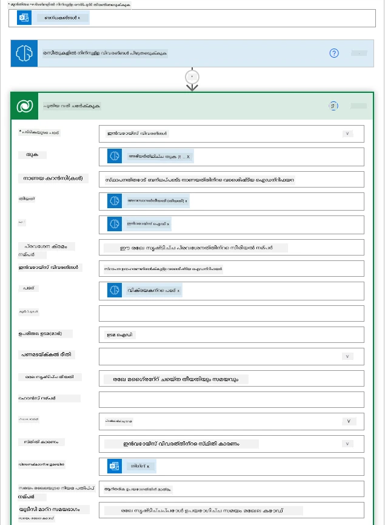
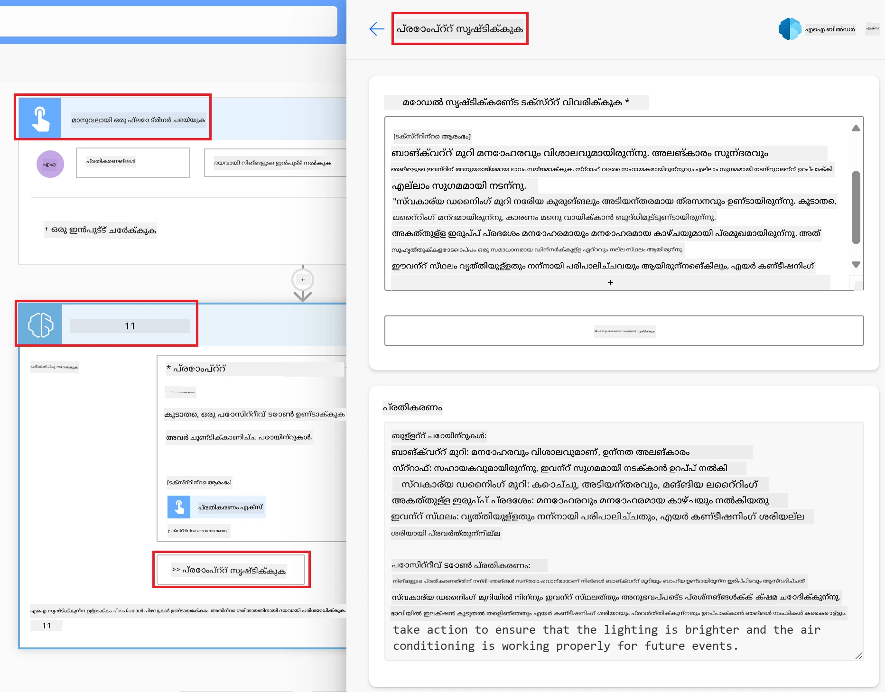

# ലോ കോഡ് AI ആപ്ലിക്കേഷനുകൾ നിർമ്മിക്കൽ

> _(ഈ പാഠത്തിന്റെ വീഡിയോ കാണാൻ മുകളിൽ ചിത്രത്തിൽ ക്ലിക്ക് ചെയ്യുക)_

## പരിചയം

ഇമേജ് ജനറേറ്റ് ചെയ്യുന്ന ആപ്ലിക്കേഷനുകൾ നിർമ്മിക്കുന്ന വിധം നാം പഠിച്ചപ്പോൾ, ഇപ്പോൾ ലോ കോഡ് കുറിച്ച് സംസാരിക്കാം. ലോ കോഡ് ഉൾപ്പെടെ വ്യത്യസ്ത മേഖലകളിൽ ജനറേറ്റീവ് AI ഉപയോഗിക്കാനാകും, എന്നാൽ ലോ കോഡ് എന്താണ്, അതിൽ AI എങ്ങനെ ചേർക്കാം?

ലോ കോഡ് ഡവലപ്പ്മെന്റ് പ്ലാറ്റ്‌ഫോമുകൾ ഉപയോഗിച്ച് പരമ്പരാഗത ഡവലപ്പർമാരക്കും ടെക്ക് പറ്റാത്തവർക്കും ആപ്ലിക്കേഷനുകളും പരിഹാരങ്ങളും നിർമ്മിക്കൽ എളുപ്പമാകുന്നു. ലോ കോഡ് ഡവലപ്പ്മെന്റ് പ്ലാറ്റ്‌ഫോമുകൾ നിങ്ങൾക്ക് കുറച്ച് കോഡ് പോലും എഴുതാതെ ആപ്ലിക്കേഷനുകളും പരിഹാരങ്ങളും നിർമ്മിക്കാൻ സഹായിക്കുന്നു. ഇത് ഉപയോഗിച്ച് കോംപോണന്റുകൾ ഡ്രാഗ് ആൻഡ് ഡ്രോപ്പ് ചെയ്ത് ആപ്ലിക്കേഷനുകളും പരിഹാരങ്ങളും രൂപകൽപ്പന ചെയ്ത് നിർമ്മിക്കാമെന്നതാണ് കാരണം. ഇത് വേഗത്തിൽ കുറച്ച് ആഴത്തിലുള്ള വിഭവങ്ങൾ ഉപയോഗിച്ച് ആപുകളും പരിഹാരങ്ങളും നിർമ്മിക്കാൻ സഹായിക്കുന്നു. ഈ പാഠത്തിൽ, ലോ കോഡ് ഉപയോഗിച്ച് എങ്ങനെ വികസിപ്പിക്കാമെന്നും, പവർ പ്ലാറ്റ്‌ഫോം ഉപയോഗിച്ച് AI ഉപയോഗിച്ച് ലോ കോഡ് വികസനത്തെ എങ്ങനെ വികസിപ്പിക്കാമെന്നതിലും നാം വിശദമായി നോക്കുന്നു.

പവർ പ്ലാറ്റ്‌ഫോം സ്ഥാപനങ്ങൾക്ക് അവരുടെ ടീമുകൾക്ക് ഒരു ഇൻറ്യൂറ്റീവ് ലോ-കോഡ് അല്ലെങ്കിൽ നോ-കോഡ് പരിപ്രേഷ്യത്തിൽ അവരുടെ സ്വന്തം പരിഹാരങ്ങൾ നിർമ്മിക്കാനുള്ള സാധ്യത നൽകുന്നു. ഈ പരിപ്രേഷ്യം പരിഹാരങ്ങൾ നിർമ്മിക്കാനുള്ള പ്രക്രിയ സുഗമമാക്കുന്നു. പവർ പ്ലാറ്റ്‌ഫോമിലൂടെ പരിഹാരങ്ങൾ മാസങ്ങൾ അല്ലെങ്കിൽ വർഷങ്ങൾക്കോ പകരം ആഴ്ചകളിൽ അല്ലെങ്കിൽ ദിവസങ്ങളിൽ നിർമ്മിക്കാം. പവർ പ്ലാറ്റ്‌ഫോമിന്റെ അഞ്ചുവിധ പ്രധാന ഉൽപ്പന്നങ്ങൾ: പവർ ആപ്സ്, പവർ ഓട്ടോമേറ്റ്, പവർ BI, പവർ പേജുകൾ, കോപൈലറ്റ് സ്റ്റുഡിയോ.

ഈ പാഠം ഉൾക്കൊള്ളുന്നവ:

- പവർ പ്ലാറ്റ്‌ഫോമിൽ ജനറേറ്റീവ് AI പരിചയം
- കോപൈലറ്റും അതിന്റെ ഉപയോഗവും പരിചയപ്പെടുത്തൽ
- പവർ പ്ലാറ്റ്‌ഫോമിൽ ആപുകളും ഫ്ലോയും നിർമ്മിക്കാൻ ജനറേറ്റീവ് AI ഉപയോഗിക്കൽ
- AI ബിൽഡറിലൂടെ പവർ പ്ലാറ്റ്‌ഫോമിലെ AI മോഡലുകൾ മനസ്സിലാക്കൽ
- മൈക്രോസോഫ്റ്റ് കോപൈലറ്റ് സ്റ്റുഡിയോ ഉപയോഗിച്ച് ബുദ്ധിമാനായ ഏജന്റുമാർ നിർമ്മിക്കൽ

## പഠന ലക്ഷ്യങ്ങൾ

ഈ പാഠത്തിന്റെ അവസാനം, നിങ്ങൾക്ക് കഴിയും:

- പവർ പ്ലാറ്റ്‌ഫോമിൽ കോപൈലറ്റ് എങ്ങനെ പ്രവർത്തിക്കുന്നു എന്നു മനസിലാക്കുക.

- നമ്മുടെ വിദ്യാഭ്യാസ സ്റ്റാർട്ടപ്പിനായി ഒരു വിദ്യാർത്ഥി അസൈൻമെന്റ് ട്രാക്കർ ആപ്പ് നിർമ്മിക്കുക.

- ഇൻവോയിസുകളിൽ നിന്നുള്ള വിവരങ്ങൾ എടുക്കാൻ AI ഉപയോഗിക്കുന്ന ഇൻവോയിസ് പ്രോസസ്സിങ് ഫ്ലോ നിർമ്മിക്കുക.

- GPT AI മോഡൽ ഉപയോഗിച്ച് ടെക്സ്റ്റ് സൃഷ്ടിക്കുമ്പോൾ മികച്ച അഭ്യസനങ്ങൾ പ്രയോഗിക്കുക.

- മൈക്രോസോഫ്റ്റ് കോപൈലറ്റ് സ്റ്റുഡിയോ എന്താണ്, അതുപയോഗിച്ച് ബുദ്ധിമാനായ ഏജന്റുമാർ എങ്ങനെ നിർമ്മിക്കാമെന്നും മനസിലാക്കുക.

ഈ പാഠത്തിൽ നിങ്ങൾ ഉപയോഗിക്കുന്ന ഉപകരണങ്ങളും സാങ്കേതിക വിദ്യകളും:

- **പവർ ആപ്സ്**: വിദ്യാർത്ഥി അസൈൻമെന്റ് ട്രാക്കർ ആപ്പിന്, ഡേറ്റാ ട്രാക്ക്, മാനേജ്, ഇന്ററാക്റ്റ് ചെയ്യാനുള്ള ലോ-കോഡ് വികസന പരിപ്രേഷ്യമാണ്.

- **ഡേറ്റവർസ്**: വിദ്യാർത്ഥി അസൈൻമെന്റ് ട്രാക്കർ ആപ്പിന്റെ ഡാറ്റ സൂക്ഷിക്കാൻ, ആപ്പിന്റെ ഡാറ്റ സൂക്ഷിക്കുന്നതിനു ഒരു ലോ-കോഡ് ഡേറ്റ പ്ലാറ്റ്‌ഫോമാണ് ഡേറ്റവർസ്.

- **പവർ ഓട്ടോമേറ്റ്**: ഇൻവോയിസ് പ്രോസസ്സിങ് ഫ്ലോയിന്, ഇൻവോയിസ് പ്രോസസ്സിംഗ് പ്രക്രിയ ഓട്ടോമേറ്റ് ചെയ്യുന്നതിന് ലോ-കോഡ് ഫ്ലോ നിർമ്മാണ പരിപ്രേഷ്യമാണ്.

- **AI ബിൽഡർ**: ഇൻവോയിസ് പ്രോസസ്സിങ് AI മോഡലിന്, സ്റ്റാർട്ടപ്പിന്റെ ഇൻവോയിസുകൾ പ്രോസസ് ചെയ്യാൻ മുന്നിൽ നിർമ്മിച്ച AI മോഡലുകൾ ഉപയോഗിക്കുന്നു.

## പവർ പ്ലാറ്റ്‌ഫോമിൽ ജനറേറ്റീവ് AI

ലോ-കോഡ് വികസനവും ആപ്ലിക്കേഷൻ ജനറേഷൻും ജനറേറ്റീവ് AI ഉപയോഗിച്ചു മെച്ചപ്പെടുത്തുക പവർ പ്ലാറ്റ്‌ഫോമിന്റെ പ്രധാന ലക്ഷ്യങ്ങളിലൊന്നാണ്. ഇത് ആഹ്വാനം ചെയ്യുന്ന ഒന്ന്, ഡാറ്റാ സയൻസ് വിദഗ്ധത ആവശ്യമില്ലാതെ എല്ലാവർക്കും AI ഓടുന്ന ആപ്ലിക്കേഷനുകളും സൈറ്റുകളും ഡാഷ്ബോർഡുകളും പ്രക്രിയകളും ഓട്ടോമേറ്റ് ചെയ്യാനുള്ള കഴിവ് നൽകലാണ്. ഇത് കോപൈലറ്റ്, AI ബിൽഡർ രൂപത്തിൽ പവർ പ്ലാറ്റ്‌ഫോമിന്റെ ലോ-കോഡ് വികസന അനുഭവത്തിൽ ജനറേറ്റീവ് AI പ്രയോഗിച്ചുകൊണ്ട് സാധ്യമാകുന്നു.

### ഇത് എങ്ങനെ പ്രവർത്തിക്കുന്നു?

കോപൈലറ്റ് ഒരു AI അസിസ്റ്റന്റാണ്, ഇതുപയോഗിച്ച് സ്വാഭാവിക ഭാഷയിൽ സംഭാഷണ ഘട്ടങ്ങളിൽ നിങ്ങളുടെ ആവശ്യകതകൾ വിവരിച്ച് പവർ പ്ലാറ്റ്‌ഫോം പരിഹാരങ്ങൾ നിർമ്മിക്കാം. ഉദാഹരണത്തിന്, നിങ്ങളുടെ ആപ്പിൽ ഉപയോഗിക്കുന്ന ഫീൽഡുകൾ എന്തൊക്കെയെന്ന് പറയാം, അത് ആപ്പ് കൂടാതെ അടിയിലെ ഡേറ്റാ മോഡൽ ഉണ്ടാക്കും, അല്ലെങ്കിൽ പവർ ഓട്ടോമേറ്റിൽ ഫ്ലോ എങ്ങനെ സജ്ജീകരിക്കാമെന്ന് വ്യക്തമാക്കാം.

കോപൈലറ്റ്-നിർമ്മിച്ചിരിക്കുന്ന ഫീച്ചറുകൾ നിങ്ങളുടെ ആപ്പ് സ്ക്രീനുകളിൽ സവിശേഷമായിട്ട് ഉപയോഗിച്ച് ഉപയോക്താക്കൾ സംഭാഷണ ഇടപാടുകൾ വഴി ഉൾക്കാഴ്ചകൾ കണ്ടെത്താം.

AI ബിൽഡർ പവർ പ്ലാറ്റ്‌ഫോമിൽ ലഭ്യമായ ലോ-കോഡ് AI കഴിവാണ്, ഇത് പ്രക്രിയകൾ ഓട്ടോമേറ്റ് ചെയ്യാനും ഫലങ്ങൾ പ്രവചിക്കാനും AI മോഡലുകൾ ഉപയോഗിക്കാനും സഹായിക്കുന്നു. AI ബിൽഡറിന്റെ സഹായത്തോടെ ഡേറ്റവർസ് ഉൾപ്പെടെ നിങ്ങളുടെ ഡാറ്റക്കു ബന്ധമുള്ള ആപ്പുകൾക്കും ഫ്ലോകൾക്കും AI കൊണ്ടു കൂട്ടിച്ചേർക്കാം.

കോപൈലറ്റ് എല്ലാ പവർ പ്ലാറ്റ്‌ഫോം ഉൽപ്പന്നങ്ങളിലും ലഭ്യമാണ്: പവർ ആപ്സ്, പവർ ഓട്ടോമേറ്റ്, പവർ BI, പവർ പേജുകൾ, കോപൈലറ്റ് സ്റ്റുഡിയോ (മുൻപ് പവർ_virtual_ ഏജന്റ്സ്). AI ബിൽഡർ പവർ ആപ്സിലും പവർ ഓട്ടോമേറ്റിലും ലഭ്യമാണ്. ഈ പാഠത്തിൽ, കോപൈലറ്റ്, AI ബിൽഡർ ഉപയോഗിച്ച് പവർ ആപ്സിലും പവർ ഓട്ടോമേറ്റിലും ഒരു പരിഹാരമുണ്ടാക്കുന്നതിൽ നാം ശ്രദ്ധ കേന്ദ്രീകരിക്കും.

### പവർ ആപ്സിൽ കോപൈലറ്റ്

പവർ പ്ലാറ്റ്‌ഫോമിന്റെ ഭാഗമായ പവർ ആപ്സ് ഡാറ്റ ട്രാക്ക്, മാനേജ്, ഇന്ററാക്റ്റ് ചെയ്യാനായി ആപ്ലിക്കേഷനുകൾ നിർമ്മിക്കുന്ന ലോ-കോഡ് വികസന പരിപ്രേഷ്യമാണ്. ഇത് സ്കേബിള്‍ ഡാറ്റ പ്ലാറ്റ്‌ഫോംഉം ക്ലൗഡ് സേവനങ്ങളോടുള്ള കണക്ഷനും ഒപ്പം ബ്രൗസറുകളിൽ, ടാബ്‌ലറ്റുകളിൽ, ഫോണുകളിലായി ഓടുന്ന ആപ്പുകൾ നിർമ്മിക്കാനുമുള്ള സേവനങ്ങളും നൽകുന്നു. പവർ ആപ്സ് ലളിതമായ ഇന്റർഫേസ് വഴി ഓരോ ബിസിനസ് ഉപയോക്താവിനും പ്രൊഫഷണൽ ഡവലപ്പർമാരും സ്വന്തം ആപ്ലിക്കേഷനുകൾ നിർമ്മിക്കാൻ അനുവദിക്കുന്നു. ജനറേറ്റീവ് AI കോപൈലറ്റ് വഴി ആപ്പ് വികസന അനുഭവം മെച്ചപ്പെടുത്തിയിരിക്കുന്നു.

പവർ ആപ്സിലെ കോപൈലറ്റ് AI അസിസ്റ്റന്റ് ഫീച്ചർ നിങ്ങൾക്ക് നിങ്ങൾക്കാവശ്യമുള്ള ആപ്പ് വിധവും ആപ്പ് ട്രാക്ക്, ശേഖരിക്കേണ്ട വിവരങ്ങൾ കൊടുത്ത് വിവരിക്കാം. കോപൈലറ്റ് നിങ്ങളുടെ വിവരണം അടിസ്ഥാനമാക്കി ഒരു പ്രതികരണശേഷിയുള്ള കാൻവാസ് ആപ്പും ഒരു ഡേറ്റവർസ് പട്ടികയും നിർമിക്കും. പിന്നീട് നിങ്ങൾ അത് നിങ്ങളുടെ ആവശ്യങ്ങൾക്ക് അനുയോജ്യമാക്കാം. AI കോപൈലറ്റ് ഡാറ്റ സംഭരിക്കാനുള്ള ഫീൽഡുകളും ചില സാമ്പിൾ ഡാറ്റയും ഉൾപ്പെടുന്ന ഒരു ഡേറ്റവർസ് പട്ടിക നിർമിക്കുന്നു. ഡേറ്റവർസ് എന്താണെന്ന്, പവർ ആപ്സിൽ എങ്ങനെ ഉപയോഗിക്കാമെന്ന് ഈ പാഠത്തിൽ പിന്നീട് കാണാം. നിങ്ങൾ കോപൈലറ്റ് അസിസ്റ്റന്റ് ഫീച്ചർ ഉപയോഗിച്ച് സംഭാഷണ ഘട്ടങ്ങളിൽ പട്ടിക നിങ്ങളുടെ ആവശ്യാനുസരിച്ച് എങ്ങനെ മെച്ചപ്പെടുത്താമെന്ന് കൈകാര്യം ചെയ്യാം. ഇത് പവർ ആപ്സ് ഹോം സ്ക്രീനിൽ നിന്ന് ലഭ്യമാണ്.

### പവർ ഓട്ടോമേറ്റിൽ കോപൈലറ്റ്

പവർ പ്ലാറ്റ്‌ഫോമിന്റെ ഭാഗമായ പവർ ഓട്ടോമേറ്റ് ഉപയോക്താക്കളെ ആപ്ലിക്കേഷനുകൾക്കും സേവനങ്ങൾക്കുമായുള്ള ഓട്ടോമേറ്റഡ് വർക്ക്‌ഫ്ളോകൾ സൃഷ്ടിക്കാൻ അനുവദിക്കുന്നു. ഇത് ധാരാളം ബിസിനസ് പ്രക്രിയകൾ പോലുള്ള ഇടപെടലുകൾ, ഡാറ്റാ ശേഖരണം, തീരുമാനാനുമതികൾ തുടങ്ങിയവ ഓട്ടോമേറ്റ് ചെയ്യാനായാണ് സഹായിക്കുന്നത്. ലളിതമായ ഇന്റർഫേസ് വ്യത്യസ്ത സാങ്കേതിക പരിജ്ഞാനമുള്ള ഉപയോക്താക്കൾക്കുമൊത്തുള്ള ഓട്ടോമേറ്റ് പ്രവർത്തനത്തിന് അനുകൂലമാണ്. ജനറേറ്റീവ് AI കോപൈലറ്റ് വഴി വർക്ക്‌ഫ്ലോ വികസന അനുഭവം മെച്ചപ്പെടുത്തിയിരിക്കുന്നു.

പവർ ഓട്ടോമേറ്റിലെ കോപൈലറ്റ് AI അസിസ്റ്റന്റ് ഫീച്ചർ നിങ്ങൾക്ക് നിങ്ങൾക്ക് വേണ്ട ഫ്ലോയും പ്രവർത്തനങ്ങളും വിവരിച്ച് പറഞ്ഞാല്‍ കോപൈലറ്റ് അത് അടിസ്ഥാനമാക്കി ഫ്ലോ നിർമ്മിക്കും. ശേഷം നിങ്ങൾ അത് നിങ്ങളുടെ ആവശ്യങ്ങൾക്ക് ക്രമീകരിക്കാം. AI കോപൈലറ്റ് ആവശ്യമായ പ്രവർത്തനങ്ങളും നിർദ്ദേശിച്ചു നൽകും. ഫ്ലോകൾ എന്താണെന്നും പവർ ഓട്ടോമേറ്റിൽ എങ്ങനെ ഉപയോഗിക്കാമെന്നും ഈ പാഠത്തിൽ പിന്നീട് വിശദീകരിക്കും. ചാറ്റ്-അസിസ്റ്റന്റ് ഫീച്ചർ ഉപയോഗിച്ച് പ്രവർത്തനങ്ങൾ നിങ്ങളുടെ ആവശ്യാനുസൃത്രമായി ക്രമീകരിക്കാം. ഇത് പവർ ഓട്ടോമേറ്റ് ഹോം സ്ക്രീനിൽ നിന്ന് ലഭ്യമാണ്.

## മൈക്രോസോഫ്റ്റ് കോപൈലറ്റ് സ്റ്റുഡിയോ ഉപയോഗിച്ച് ബുദ്ധിമാനായ ഏജന്റുമാർ നിർമ്മിക്കൽ

[Microsoft Copilot Studio](https://learn.microsoft.com/microsoft-copilot-studio/fundamentals-what-is-copilot-studio?WT.mc_id=academic-105485-koreyst) (മുൻപ് പവർ_virtual_ ഏജന്റ്സ്) പവർ പ്ലാറ്റ്‌ഫോമിന്റെ ലോ-കോഡ് അംഗമാണ്, ഉപയോക്താക്കളുടെ പകരം ചോദ്യങ്ങൾക്ക് മറുപടി പറയാൻ, പ്രവർത്തനങ്ങൾ സ്വീകരിക്കാൻ, ടാസ്കുകൾ ഓട്ടോമേറ്റ് ചെയ്യാൻ കഴിവുള്ള **AI ഏജന്റുമാർ** നിർമ്മിക്കാൻ സഹായിക്കുന്നു. പവർ പ്ലാറ്റ്‌ഫോമിലെ മറ്റു ഉൽപ്പന്നങ്ങളുപോലെ, നിങ്ങളുടെ ആവശ്യങ്ങൾ ഏജന്റ് ചെയ്യാനായി വിവരിക്കുമ്പോൾ കോപൈലറ്റ് സ്റ്റുഡിയോ അതിന്റെ നിർദ്ദേശങ്ങൾ, ജ്ഞാനം, പ്രവർത്തനങ്ങൾ രൂപപ്പെടുത്താനും സഹായിക്കുന്നു.

നമ്മുടെ വിദ്യാഭ്യാസ സ്റ്റാർട്ടപ്പിനായി, കോഴ്സുകളെ സംബന്ധിച്ച വിദ്യാർത്ഥികളുടെ ചോദ്യങ്ങൾ മറുപടി പറയാനും, അസൈൻമെന്റ് അവസാന തീയതികൾ പരിശോധിക്കാനും, അദ്ധ്യാപകനുമായി ഇമെയിൽ ചെയ്യാനും കഴിവുള്ള ഒരൊറ്റ ഏജന്റ് നിർമ്മിക്കാം — അത് കോഡ് എഴുതി ഇല്ലാതെ.

കോപൈലറ്റ് സ്റ്റുഡിയോ ശക്തിയുള്ളതാക്കുന്ന ചില പുതിയ കഴിവുകൾ:

- **നിങ്ങളുടെ ജ്ഞാനത്തിൽ നിന്നുള്ള ജനറേറ്റീവ് ഉത്തരം**. ഓരോ സംഭാഷണവും കൈയോടെ തയ്യാറാക്കുന്നതിന് പകരം, നിങ്ങൾ **ജ്ഞാന ഉറവിടങ്ങൾ** — പൊതുജന വെബ്സൈറ്റുകൾ, ഷെയർപോയിന്റ്, വൺഡ്രൈവ്, ഡേറ്റവർസ്, അപ്‌ലോഡ് ചെയ്ത ഫയലുകൾ, ഏജന്റുകൾ ഉപയോഗിക്കുന്ന എൻറ്റർപ്രൈസ് ഡാറ്റ എന്നിവ എത്തിച്ച് ഏജന്റ് അവയിൽ നിന്നുള്ള സ്രോതസ്സായ ഉത്തരം തയ്യാറാക്കും.

- **ജനറേറ്റീവ് ഓർക്കസ്ട്രേഷൻ**. കഠിനമായ ട്രിഗർ പദപ്രയോഗങ്ങളിൽ ആശ്രയിക്കാതെ, ഏജന്റ് AI ഉപയോഗിച്ച് ആവശ്യകത മനസ്സിലാക്കി അത് പൂർത്തീകരിക്കാൻ ഏത് ജ്ഞാനം, വിഷയങ്ങൾ, പ്രവർത്തനങ്ങൾ ചേരുവേണ്ടതാണെന്ന് തീരുമാനിച്ച് പല ഘട്ടങ്ങളും ചേര്ക്കും.

- **പ്രവർത്തനങ്ങളും കണക്ടറുകളും**. ഏജന്റുകൾ സംസാരിച്ചു മാത്രം പോകരുത്, 1500-കൂടിയുള്ള പവർ പ്ലാറ്റ്‌ഫോം കണക്ടറുകൾ, പവർ ഓട്ടോമേറ്റ് ഫ് ലോകൾ, കസ്റ്റം REST APIകൾ, പ്രോമ്പ്റ്റുകൾ, അല്ലെങ്കിൽ **Model Context Protocol (MCP)** സെർവറുകൾ പിന്തുണയ്ക്കുന്ന പ്രവർത്തനങ്ങൾ ഏജന്റുകൾക്ക് നൽകാം.

- **സ്വയം നിയന്ത്രിക്കുന്ന ഏജന്റുമാർ**. ഏജന്റുകൾ ചാറ്റ് വിൻഡോയിൽ മാത്രം മറുപടി നൽകുന്നില്ല; ഒരു പുതിയ ഇമെയിൽ, ഡേറ്റവർസ് പുതിയ റെക്കോർഡ്, ഫയൽ അപ്‌ലോഡ് തുടങ്ങിയ സംഭവങ്ങൾ വഴിതെളിഞ്ഞ് പ്രവർത്തിക്കുന്ന സ്വയം നിയന്ത്രിക്കുന്ന ഏജന്റുമാരെ നിർമ്മിക്കാം.

- **മൾട്ടി-ഏജന്റ് ഓർക്കസ്ട്രേഷൻ**. ഏജന്റുകൾ മറ്റു ഏജന്റുകളെ വിളിക്കാം; ഒരു കോപൈലറ്റ് സ്റ്റുഡിയോ ഏജന്റ് മറ്റ് ഏജന്റുകളിലേക്ക് കൈമാറാനും അതുപോലെ വിപുലീകരിക്കാനും കഴിയും, മൈക്രോസോഫ്റ്റ് 365 കോപൈലറ്റ് പ്രസിദ്ധീകരിച്ച ഏജന്റുകൾ ഉൾപ്പെടെ.

- **മോഡൽ തിരഞ്ഞെടുപ്പ്**. ഉൾപ്പെടുത്തിയ മോഡലുകൾക്കപ്പുറം, മൈക്രോസോഫ്റ്റ് ഫൗണ്ട്രി മോഡൽ കാറ്റലോഗിൽ നിന്നുമുള്ള മോഡലുകൾ കൊണ്ടുവരാനും ഏജന്റിന്റെ ചിന്തന വിധിയും മറുപടിയും തികച്ചും ആകൃതീകരിക്കാനും കഴിയും.

- **എവിടെവെച്ചും പ്രസിദ്ധീകരിക്കൽ**. നിർമ്മിച്ചതിന് ശേഷം ഏജന്റ് മൈക്രോസോഫ്റ്റ് ടീംസ്, മൈക്രോസോഫ്റ്റ് 365 കോപൈലറ്റ്, വെബ്സൈറ്റ്, കസ്റ്റം ആപ്പ് തുടങ്ങിയ പല ചാനലുകളിലും പ്രസിദ്ധീകരിക്കാം, സുരക്ഷ, ഓതന്റിക്കേഷൻ, അനലിറ്റിക്സ് പവർ പ്ലാറ്റ്‌ഫോം അഡ്മിൻ അനുഭവത്തിലൂടെ നിയന്ത്രിച്ചത്.

നിങ്ങൾ നിങ്ങളുടെ ആദ്യ ഏജന്റ് [copilotstudio.microsoft.com](https://copilotstudio.microsoft.com?WT.mc_id=academic-105485-koreyst) ൽ നിർമ്മിക്കാൻ തുടങ്ങാം, കൂടുതൽ അറിയാൻ [Microsoft Copilot Studio ഡോക്യുമെന്റേഷൻ](https://learn.microsoft.com/microsoft-copilot-studio/?WT.mc_id=academic-105485-koreyst) സന്ദർശിക്കാം.

## അസൈൻമെന്റ്: കോപൈലറ്റ് ഉപയോഗിച്ച് വിദ്യാർത്ഥികളുടെ അസൈൻമെന്റുകളും ഇൻവോയിസുകളും կառավարിക്കുക

നമ്മുടെ സ്റ്റാർട്ടപ്പ് വിദ്യാർത്ഥികൾക്ക് ഓൺലൈൻ കോഴ്‌സുകൾ നൽകുന്നു. ഈ സ്റ്റാർട്ടപ്പ് വേഗത്തിൽ വളർന്നു, ഇപ്പോൾ കോഴ്‌സുകളുടെ ഡിമാൻഡിനൊപ്പം മുന്നോട്ട് പോകാൻ ബുദ്ധിമുട്ടുന്നുണ്ട്. അവർ പവർ പ്ലാറ്റ്‌ഫോം ഡവലപ്പർ ആയി നിന്നെ നിയമിച്ചു, അവരുടെ വിദ്യാർത്ഥി അസൈൻമെന്റുകളും ഇൻവോയിസുകളും നിയന്ത്രിക്കാൻ ലോ കോഡ് പരിഹാരമുണ്ടാക്കാൻ. പരിഹാരം ഒരു ആപ്പ് ഉപയോഗിച്ച് വിദ്യാർത്ഥി അസൈൻമെന്റുകൾ ട്രാക്ക് ചെയ്യാനും മാനേജ് ചെയ്യാനും, ഇൻവോയിസ് പ്രൊസസ്സിംഗ് വർക്ക്‌ഫ്ലോ വഴി ഓട്ടോമേറ്റ് ചെയ്യാനും കഴിയണം. നിങ്ങൾക്ക് ജനറേറ്റീവ് AI ഉപയോഗിച്ച് പരിഹാരം വികസിപ്പിക്കാൻ പറയപ്പെട്ടു.

കോപൈലറ്റ് ഉപയോഗം ആരംഭിക്കുമ്പോൾ, [Power Platform Copilot Prompt Library](https://github.com/pnp/powerplatform-prompts?WT.mc_id=academic-109639-somelezediko) പ്രോമ്പ്റ്റുകൾ പഠിക്കാൻ ഉപയോഗിക്കാം. ഈ ലൈബ്രറിയിൽ കോപൈലറ്റുമായി ആപുകളും ഫ്ലോകളും നിർമ്മിക്കാൻ ഉപയോഗിക്കാവുന്ന പ്രോമ്പ്റ്റുകളുടെ പട്ടിക ഉണ്ട്. നിങ്ങളുടെ ആവശ്യങ്ങൾ കോപൈലറ്റിന് വിശദീകരിക്കാൻ ഇതു സഹായിക്കും.

### നമ്മുടെ സ്റ്റാർട്ടപ്പിനായി വിദ്യാർത്ഥി അസൈൻമെന്റ് ട്രാക്കർ ആപ്പ് നിർമ്മിക്കുക

നമ്മുടെ സ്റ്റാർട്ടപ്പിലെ വിദ്യാഭ്യാസകോാഴ്ചകർ വിദ്യാർത്ഥികളുടെ അസൈൻമെന്റുകൾ ട്രാക്ക് ചെയ്യാൻ ബുദ്ധിമുട്ടുന്നു. അവർ അസൈൻമെന്റുകൾ ട്രാക്ക് ചെയ്യാനായി സ്പ്രെഡ്ഷീറ്റ് ഉപയോഗിച്ചിരുന്നു, എന്നാൽ വിദ്യാർത്ഥികളുടെ എണ്ണം വർധിച്ചതുകൊണ്ട് ഇത് കൈകാര്യം ചെയ്യാൻ ബുദ്ധിമുട്ടായി. അതിനാൽ പുതിയ അസൈൻമെന്റുകൾ ചേർക്കാനും, അവ കാണാനും, അപ്ഡേറ്റ് ചെയ്യാനും, ഡിലീറ്റ് ചെയ്യാനും സാധിക്കുന്ന ഒരു ആപ്പ് നിർമ്മിക്കാൻ നിങ്ങളോട് ആവശ്യപ്പെട്ടു. ഗ്രേഡ് ചെയ്ത അസൈൻമെന്റുകളും ഇതുവരെ ഗ്രേഡ് ചെയ്യാത്തവയും അധ്യാപകരും വിദ്യാർത്ഥികളും കാണാൻ ആപ്പിൽ സാധിക്കണം.

കോപൈലറ്റ് ഉപയോഗിച്ച് പവർ ആപ്സിൽ ആപ്പ് നിർമ്മിക്കാനുള്ള ചുവടുവയ്പ്പുകൾ ഇങ്ങനെ:

1. [Power Apps](https://make.powerapps.com?WT.mc_id=academic-105485-koreyst) ഹോം സ്ക്രീനിലേക്ക് പോകുക.

1. ഹോം സ്ക്രീനിലുള്ള ടെക്സ്റ്റ് ഏരിയയിൽ നിങ്ങൾ നിർമ്മിക്കാൻ ആഗ്രഹിക്കുന്ന ആപ്പ് വിശദീകരിക്കുക. ഉദാഹരണത്തിന്, **_ഞാൻ വിദ്യാർത്ഥി അസൈൻമെന്റുകൾ ട്രാക്ക് ചെയ്യാനും മാനേജ് ചെയ്യാനും ആപ്പ് നിർമ്മിക്കാൻ ആഗ്രഹിക്കുന്നു_**. AI കോപൈലറ്റിലേക്ക് ആ പ്രോമ്പ്റ്റ് അയയ്ക്കാൻ **സെൻറ്** ബട്ടൺ അമർത്തുക.

1. AI കോപൈലറ്റ് നിങ്ങളുടെ ആവശ്യത്തിന് അനുയോജ്യമായ ഫീൽഡുകൾ ഉൾപ്പെടുന്ന ഡേറ്റവർസ് പട്ടികയും ചില സാമ്പിൾ ഡാറ്റയും നിർമിക്കും. പിന്നീട് സംഭാഷണ ഘട്ടങ്ങളിലൂടെ AI കോപൈലറ്റ് അസിസ്റ്റന്റ് ഫീച്ചർ ഉപയോഗിച്ച് പട്ടിക നിങ്ങളുടെ ആവശ്യങ്ങൾക്ക് അനുയോജ്യമായി ക്രമീകരിക്കാം.

   > **പ്രധാനമാക്കേണ്ടത്**: ഡേറ്റവർസ് പവർ პლാറ്റ്‌ഫോമിന്റെ അടിസ്ഥാനം വീതമായ ഡാറ്റ പ്ലാറ്റ്‌ഫോമാണ്. ആപ്പിന്റെ ഡാറ്റ സൂക്ഷിക്കാനായി ഇത് ഒരു പൂർത്തിയായ മാനേജുചെയ്യപ്പെട്ട സേവനമാണ്. മൈക്രോസോഫ്റ്റ് ക്ലൗഡിൽ സുരക്ഷിതമായി ഡാറ്റ സൂക്ഷിക്കുകയും നിങ്ങളുടെ പവർ പ്ലാറ്റ്‌ഫോം പരിപ്രേഷ്യത്തിലേക്ക് നൽകുകയും ചെയ്യുന്നു. ഡാറ്റാ ക്ലാസിഫിക്കേഷൻ, ഡാറ്റാ ലിനിയേജ്, ഫൈൻ-ഗ്രെയിൻഡ് ആക്‌സസ് നിയന്ത്രണം തുടങ്ങിയ നിർമ്മിത ഡാറ്റാ ഗവർണൻസ് കഴിവുകളുണ്ട്. കൂടുതൽ അറിയാൻ [ഇവിടെ](https://docs.microsoft.com/powerapps/maker/data-platform/data-platform-intro?WT.mc_id=academic-109639-somelezediko) നോക്കുക.

   

1. അസൈൻമെന്റ് സമർപ്പിച്ച വിദ്യാർത്ഥികളുടെ ഇമെയിൽ സൂക്ഷിക്കുന്നതിന് ഡേറ്റവർസ് പട്ടികയിൽ പുതിയ ഫീൽഡ് ചേർക്കാനായി കോപൈലറ്റ് ഉപയോഗിക്കാം. ഉദാഹരണത്തിന്, **_വിദ്യാർത്ഥി ഇമെയിൽ സൂക്ഷിക്കാൻ ഒരു കോളം ചേർക്കണം_** എന്ന പ്രോമ്പ്റ്റ് ഉപയോഗിക്കാം. AI കോപൈലറ്റിലേക്ക് പ്രോമ്പ്റ്റ് അയയ്ക്കാൻ **സെൻറ്** ബട്ടൺ അമർത്തുക.

1. AI കോപൈലറ്റ് പുതിയ ഫീൽഡ് നിർمിച്ച് ഉദ്ദേശിക്കുന്നതു പോലെ ഫീൽഡ് ക്രമീകരിക്കാം.

1. പട്ടിക പൂർത്തിയാക്കിയതിനു ശേഷം, ആപ്പ് സൃഷ്ടിക്കാൻ **Create app** ബട്ടണിൽ ക്ലിക്ക് ചെയ്യുക.

1. നിങ്ങളുടെ വിവരണത്തിന്റെ അടിസ്ഥാനത്തിൽ AI Copilot ഒരു പ്രതികരണസഹിതമായ കാൻവാസ് ആപ്പ് സൃഷ്ടിക്കും. തുടർന്ന് ആപ്പ് നിങ്ങളുടെ ആവശ്യങ്ങൾക്ക് അനുസരിച്ച് ഇഷ്ടാനുസൃതമാക്കാം.

1. വിദ്യാർത്ഥികളെക്കായി ഇമെയിലുകൾ അയയ്ക്കാൻ അധ്യാപകർക്ക്, ആപ്പിൽ പുതിയ ഒരു സ്ക്രീൻ ചേർക്കാൻ Copilot ഉപയോഗിക്കാം. ഉദാഹരണത്തിന്, ആപ്പിൽ പുതിയ ഒരു സ്ക്രീൻ ചേർക്കാൻ താഴെ കാണുന്ന പ്രോമ്പ്റ്റ് ഉപയോഗിക്കാം: **_I want to add a screen to send emails to students_**. പ്രോമ്പ്റ്റ് AI Copilot-ക്ക് അയക്കാൻ **Send** ബട്ടണിൽ ക്ലിക്ക് ചെയ്യുക.

1. AI Copilot പുതിയ ഒരു സ്ക്രീൻ സൃഷ്ടിക്കും, തുടർന്ന് സ്ക്രീൻ നിങ്ങളുടെ ആവശ്യങ്ങൾക്കനുസരിച്ച് ഇഷ്ടാനുസൃതമാക്കാം.

1. ആപ്പ് പൂർത്തിയാക്കിയതിന് ശേഷം, ആപ്പ് സേവ് ചെയ്യാൻ **Save** ബട്ടണിൽ ക്ലിക്ക് ചെയ്യുക.

1. അധ്യാപകരുമായി ആപ്പ് പങ്കിടാൻ **Share** ബട്ടണിൽ ക്ലിക്ക് ചെയ്യുകയും വീണ്ടും **Share** ബട്ടണിൽ ക്ലിക്ക് ചെയ്യുക. തുടർന്ന് അധ്യാപകരുടെ ഇമെയിൽ വിലാസങ്ങൾ നൽകിക്കോയി ആപ്പ് പങ്കിടാം.

> **നിങ്ങളുടെ ഹോംവർക്**: നിങ്ങൾ appena നിർമ്മിച്ച ആപ്പ് നല്ല ആരംഭമാണെങ്കിലും മെച്ചപ്പെടുത്താം. ഇമെയിൽ ഫീച്ചറോടെ, അധ്യാപകർക്ക് ഇമെയിൽ വിലാസങ്ങൾ ടൈപ്പ് ചെയ്ത് വിദ്യാർത്ഥികളെ മാനുവൽ ആയി ഇമെയിൽ അയയ്ക്കേണ്ടിവരുമെന്ന് മാത്രമാണ് സാധിക്കുന്നത്. ഒരു ഓട്ടോമേഷൻ നിർമ്മിക്കാൻ Copilot ഉപയോഗിച്ചറിയാമോ, അതിലൂടെ അധ്യാപകർ തങ്ങളുടെ അസൈൻമെന്റുകൾ സമർപ്പിച്ചാൽ വിദ്യാർത്ഥികളെ സ്വയം ഇമെയിൽ അയക്കാൻ സാധിക്കും? ശരിയായ പ്രോമ്പ്റ്റ് ഉപയോഗിച്ച് Copilot Power Automate-ൽ ഉപയോഗിച്ച് ഇത് നിർമിക്കാം എന്നാണ് നിങ്ങളുടെ സൂചന.

### ഞങ്ങളുടെ സ്റ്റാർട്ടപ്പിന് ഇൻവോയ്സ് വിവര ടേബിൾ നിർമ്മിക്കുക

ഞങ്ങളുടെ സ്റ്റാർട്ടപ്പിലെ ഫിനാൻസ് ടീം ഇൻവോയിസുകൾ ട്രാക്ക് ചെയ്യാൻ ബുദ്ധിമുട്ടുന്നുണ്ട്. അവർ ഇൻവോയിസുകൾ ട്രാക്ക് ചെയ്യാൻ ഒരു സ്പ്രെഡ്ഷീറ്റ് ഉപയോഗിച്ചുവരുന്നതായിരുന്നെങ്കിലും, ഇൻവോയിസുകളുടെ എണ്ണം വർദ്ധിച്ചതിനെ തുടർന്ന് ഇത് നിയന്ത്രിക്കാൻ പ്രയാസമായി. അവർ നിങ്ങൾക്ക് ലഭിച്ച ഇൻവോയിസുകളുടെ വിവരങ്ങൾ സൂക്ഷിക്കാൻ, ട്രാക്ക് ചെയ്യാനും നിയന്ത്രിക്കാനും സഹായിക്കുന്ന ഒരു ടേബിൾ നിർമ്മിക്കാൻ ആവശ്യപ്പെട്ടു. ഈ ടേബിൾ ഒരു ഓട്ടോമേഷൻ നിർമ്മിക്കാൻ ഉപയോഗിക്കണം, അത് ഇൻവോയിസ് വിവരങ്ങൾ എല്ലാം പുറത്തെടുത്ത് ടേബിളിൽ സൂക്ഷിക്കും. ഫിനാൻസ് ടീമിന് പണമടച്ച ഇൻവോയിസുകളും പണമടച്ചിട്ടില്ലാത്തവയും കാണാൻ ടേബിൾ അനുവദിക്കണം.

പവർ പ്ലാറ്റ്‌ഫോമിനു കീഴിലെ ഒരു ഡാറ്റ പ്ലാറ്റ്ഫോം Dataverse ഉണ്ട്, ഇത് നിങ്ങളുടെ ആപ്പുകൾക്കും പരിഹാരങ്ങൾക്കും ഡാറ്റ സംഭരിക്കാനാകും. Dataverse ഒരു ലോ-കോഡ് ഡാറ്റ പ്ലാറ്റ്ഫോംയാണ് ആപ്പ് ഡാറ്റ സംഭരിക്കാൻ. ഇത് മൈക്രോസോഫ്റ്റ് ക്ലൗഡിൽ സുരക്ഷിതമായി ഡാറ്റ സംരക്ഷിക്കുകയും നിങ്ങളുടെ പവർ പ്ലാറ്റ്‌ഫോം പരിസരത്തിൽ പ്രൊവിഷൻ ചെയ്യപ്പെടുകയും ചെയ്യുന്ന ഒരു പൂര്‍ണ്ണമായി മാനേജുചെയ്ത സേവനമാണ്. ഡാറ്റ ക്ലാസിഫിക്കേഷൻ, ഡാറ്റ ലിനിയേജ്, സൂക്ഷ്മ തരം ആക്‌സസ് നിയന്ത്രണം എന്നിവ പോലുള്ള നിർമ്മിത ഡാറ്റ ഗവൺനൻസ് കഴിവുകൾ ഇതിൽ ഉൾപ്പെടുത്തപ്പെട്ടിട്ടുണ്ട്. Dataverse കുറിച്ച് കൂടുതൽ പഠിക്കാൻ [Dataverse-നെക്കുറിച്ച് ഇവിടെ](https://docs.microsoft.com/powerapps/maker/data-platform/data-platform-intro?WT.mc_id=academic-109639-somelezediko) കാണുക.

ഞങ്ങളുടെ സ്റ്റാർട്ടപ്പിന് Dataverse ഉപയോഗിക്കേണ്ടത് എന്തിന്? Dataverse-ല് ഉള്ള സ്റ്റാൻഡേർഡ്, കസ്റ്റം ടേബിളുകൾ നിങ്ങളുടെ ഡാറ്റയ്ക്ക് ഒരു സുരക്ഷിതവും ക്ലൗഡ് അടിസ്ഥാനമാക്കിയുള്ള സംഭരണ ഓപ്ഷനും നൽകുന്നു. ടേബിളുകൾ ഏതൊരു തരത്തിലുള്ള ഡാറ്റ സംഗ്രഹിക്കാൻ സഹായിക്കുന്നു, ഒരേ Excel workbook-ലെ പല വർക്ക് ഷീറ്റുകൾ ഉപയോഗിക്കുന്നതിന് സമാനമായി. നിങ്ങളുടെ സംഘടനയുടെ അല്ലെങ്കിൽ ബിസിനസിന്റെ ആവശ്യങ്ങൾക്ക് പ്രത്യേകമായ ഡാറ്റ സംഭരിക്കാൻ ടേബിളുകൾ ഉപയോഗിക്കാം. Dataverse ഉപയോഗിച്ചുകൊണ്ട് നമ്മുടെ സ്റ്റാർട്ടപ്പിന് ലഭിക്കുന്ന ചില ഗുണങ്ങൾ ചുരുക്കി പറയുമ്പോൾ:

- **സമയം ലാഭിക്കുന്ന നിയന്ത്രണം**: മെറ്റാഡാറ്റയും ഡാറ്റയും ക്ലൗഡിൽ സംരക്ഷിക്കപ്പെടുന്നുവെന്നതിനാൽ ഡാറ്റ എന്തുവിധം സംഭരിക്കുന്നുവെന്ന് അല്ലെങ്കിൽ നിയന്ത്രിക്കുന്നുവെന്ന് നിങ്ങൾക്കെന്തും ആശങ്കകളാകില്ല. നിങ്ങളുടെ ആപ്പുകളും പരിഹാരങ്ങളും നിർമാണത്തിൽ കേന്ദ്രീകരിക്കാം.

- **സുരക്ഷിതം**: Dataverse നിങ്ങളുടെ ഡാറ്റയ്ക്ക് ഉണ്ടാക്കുന്ന സുരക്ഷിതവും ക്ലൗഡ് അടിസ്ഥാനമുള്ള സംഭരണ ഓപ്ഷൻ ആണ്. ടേബിളുകളിലെ ഡാറ്റയിൽ ആര്ക്കുണ്ടാകണം എങ്ങനെ ആക്‌സസ് നടത്തണം എന്നിവ നിങ്ങൾ റോളിന്റെ അടിസ്ഥാനത്തിൽ നിയന്ത്രിക്കാം.

- **ശ്രീമത മെടാഡാറ്റ**: ഡാറ്റ തരം, ബന്ധങ്ങൾ നേരിട്ട് പവർ ആപ്പുകളിൽ ഉപയോഗിക്കാൻ കഴിയും.

- **ലാജിക്, വാലിഡേഷൻ**: ബിസിനസ് നിയമങ്ങൾ, കാൽക്കുലേറ്റഡ് ഫീൽഡ്‌സ്, വാലിഡേഷൻ നിയമങ്ങൾ ഉപയോഗിച്ച് ബിസിനസ്സ് ലാജിക് നടപ്പിലാക്കാനും ഡാറ്റ സ്ഥിരീകരണമുണ്ടാക്കാനും കഴിയും.

Dataverse എന്താണെന്ന് എന്തുകൊണ്ട് ഉപയോഗിക്കണം എന്ന് അറിഞ്ഞപ്പോൾ, ഇനി ഫിനാൻസ് ടീമിന്റെ ആവശ്യങ്ങൾക്കനുസരിച്ച് Dataverse-ൽ Copilot ഉപയോഗിച്ച് ഒരു ടേബിൾ എങ്ങനെ സൃഷ്ടിക്കാമെന്ന് നോക്കാം.

> **കുറിപ്പ്** : വരുന്ന ഭാഗത്ത് നിങ്ങൾ ഈ ടേബിൾ ഉപയോഗിച്ച് ഇൻവോയിസ് വിവരങ്ങൾ പുറത്തെടുത്ത് ടേബിൾ വാശിയാക്കുന്ന ഓട്ടോമേഷൻ നിർമ്മിക്കും.

Copilot ഉപയോഗിച്ച് Dataverse-ൽ ഒരു ടേബിൾ സൃഷ്ടിക്കാൻ താഴെപ്പറയുന്ന ഘട്ടങ്ങൾ പിന്തുടരുക:

1. [Power Apps](https://make.powerapps.com?WT.mc_id=academic-105485-koreyst) ഹോം സ്ക്രീനിലേക്കു പോവുക.

2. ഇടത് നവി​ഗേഷൻ ബാറിൽ **Tables** തിരഞ്ഞെടുത്ത്, **Describe the new Table**-യില് ക്ളിക്ക് ചെയ്യുക.

1. **Describe the new Table** സ്ക്രീനിൽ, നിർമ്മിക്കാനാഗ്രഹിക്കുന്ന ടേബിൾ വിവരിക്കാൻ ടെക്സ്റ്റ് ഏരിയ ഉപയോഗിക്കുക. ഉദാഹരണത്തിന്, **_I want to create a table to store invoice information_**. അങ്ങനെ പ്രോമ്പ്റ്റ് AI Copilot-ക്ക് അയക്കാൻ **Send** ബട്ടണിൽ ക്ലിക്ക് ചെയ്യുക.

1. AI Copilot ആവശ്യമായ ഫീൽഡുകളോടെ Dataverse Table ഉദ്ദേശിച്ച ഡാറ്റ സംഭരിക്കാൻ നിർദ്ദേശിച്ച് ചില സാമ്പിൾ ഡാറ്റയുമുണ്ടാകും. തുടർന്ന് നിങ്ങളുടെ ആവശ്യങ്ങൾക്കനുസരിച്ച് ടേബിൾ ഇഷ്ടാനുസൃതപ്പെടുത്താൻ AI Copilot അസിസ്റ്റന്റ് ഉപയോഗിച്ച് സംവാദ ഘട്ടങ്ങൾ വഴി ചെയ്യാം.

1. ഫിനാൻസ് ടീം ലഭിച്ച ഇൻവോയിസിന്റെ നിലവിലെ നിലയുമായി സംബന്ധിച്ചുള്ള അപ്‌ഡേറ്റുകൾ നൽകാനായി സപ്ലയറിന് ഇമെയിൽ അയയ്ക്കാനാണ് ആഗ്രഹിക്കുന്നത്. Copilot ഉപയോഗിച്ച് സപ്ലയർ ഇമെയിൽ സൂക്ഷിക്കുന്ന പുതിയ ഫീൽഡ് ടേബിളിൽ ചേർക്കാൻ കഴിയും. ഉദാഹരണത്തിന്, ടേബിളിൽ പുതിയ ഒരു കോളം ചേർക്കാൻ താഴെപറയുന്ന പ്രോമ്പ്റ്റ് ഉപയോഗിക്കാം: **_I want to add a column to store supplier email_**. AI Copilot-க்கு പ്രോമ്പ്റ്റ് അയക്കാൻ **Send** ബട്ടണിയിൽ ക്ലിക്ക് ചെയ്യുക.

1. AI Copilot പുതിയ ഫീൽഡ് സൃഷ്ടിക്കും, തുടർന്ന് നിങ്ങളുടെ ആവശ്യങ്ങൾക്കനുസരിച്ച് ഫീൽഡ് ഇഷ്ടാനുസൃതമാക്കാം.

1. പട്ടിക പൂർത്തിയാക്കിയതിന് ശേഷം, പട്ടിക സൃഷ്ടിക്കാൻ **Create** ബട്ടണിൽ ക്ലിക്ക് ചെയ്യുക.

## പവർ പ്ലാറ്റ്‌ഫോമിലെ AI മോഡലുകൾ AI ബിൽഡറിന്റെ ഉപയോഗത്തോടെ

AI ബിൽഡർ പവർ പ്ലാറ്റ്‌ഫോമിൽ ലഭിക്കുന്ന ഒരു ലോ-കോഡ് AI കഴിവാണ്, ഇത് AI മോഡലുകൾ ഉപയോഗിച്ച് പ്രക്രിയകൾ ഓട്ടോമേറ്റ് ചെയ്യാനും ഫലം ഭാവന ചെയ്യാനും സഹായിക്കും. AI ബിൽഡർ ഉപയോഗിച്ച് Dataverse-ൽ അല്ലെങ്കിൽ ഷെയർപോയിന്റ്, വൺഡ്രൈവ്, ആസ്യൂർ പോലുള്ള ക്ലൗഡ് ഡാറ്റ സ്രോതസ്സുകളിൽ നിങ്ങളുടെ ഡാറ്റയുമായി ബന്ധിപ്പിക്കുന്ന ആപ്പുകൾക്കും ഫ്‌ളോകൾക്കും AI എത്തിക്കാം.

## പ്രീബിൽറ്റ് AI മോഡലുകൾ Vs കസ്റ്റം AI മോഡലുകൾ

AI ബിൽഡർ രണ്ട് തരം AI മോഡലുകൾ നൽകുന്നു: പ്രീബിൽറ്റ് AI മോഡലുകൾ, കസ്റ്റം AI മോഡലുകൾ. പ്രീബിൽറ്റ് AI മോഡലുകൾ മൈക്രോസോഫ്റ്റർ പരിശീലിപ്പിച്ചിട്ടുള്ളും പവർ പ്ലാറ്റ്‌ഫോമിൽ ലഭ്യവുമായ, തളരാതെ ഉപയോഗിക്കാൻ കഴിയുന്ന AI മോഡലുകളാണ്. നിങ്ങളുടെ സ്വന്തം ഡാറ്റ ശേഖരിക്കുകയും, മോഡലുകൾ നിർമ്മിക്കുകയും പരിശീലിപ്പിക്കുകയും പ്രസിദ്ധീകരിക്കുകയും ചെയ്യേണ്ട ആവശ്യമില്ലാതെ നിങ്ങളുടെ ആപ്പുകൾക്കും ഫ്‌ളോകൾക്കും എംബെഡ് ചെയ്യാൻ ഇത് സഹായിക്കുന്നു. പ്രക്രിയകൾ ഓട്ടോമേറ്റ് ചെയ്യാനും ഫലം പ്രവചിക്കാനും ഈ മോഡലുകൾ ഉപയോഗിക്കാം.

പവർ പ്ലാറ്റ്‌ഫോമിൽ ലഭ്യമായ ചില പ്രീബിൽറ്റ് AI മോഡലുകൾ:

- **കീ ഫ്രയ്സ് എക്സ്ട്രാക്ഷൻ**: ടെക്സ്റ്റിൽ നിന്നുള്ള പ്രധാന ഫ്രീസുകൾ എടുക്കുന്ന മോഡൽ.
- **ഭാഷ തിരിച്ചറിയൽ**: ടെക്സ്റ്റിന്റെ ഭാഷ കണ്ടെത്തുന്ന മോഡൽ.
- **സെൻറ്റിമെന്റ് അനാലസിസ്**: പോസിറ്റീവ്, നെഗറ്റീവ്, ന്യൂട്രൽ അല്ലെങ്കിൽ മിക്‌സ് ചെയ്ത भावना ടെക്സ്റ്റിൽ കണ്ടെത്തുന്ന മോഡൽ.
- **ബിസിനസ്സ് കാർഡ് വായനക്കാരൻ**: ബിസിനസ്സ് കാർഡിലുള്ള വിവരങ്ങൾ എടുക്കുന്നതിന് മോഡൽ.
- **ടെക്സ്റ്റ് തിരിച്ചറിയൽ**: ചിത്രങ്ങളിൽ നിന്നും ടെക്സ്റ്റ് എടുക്കുന്ന മോഡൽ.
- **ഓബ്ജക്ട് ഡിറ്റക്ഷൻ**: ചിത്രങ്ങളിൽ നിന്ന് വസ്തുക്കൾ കണ്ടെത്തി എടുക്കുന്ന മോഡൽ.
- **ഡോക്യുമെന്റ് പ്രോസസ്സിങ്**: ഫോമുകളിൽ നിന്നും വിവരങ്ങൾ എടുക്കുന്ന മോഡൽ.
- **ഇൻവോയിസ് പ്രോസസ്സിങ്**: ഇൻവോയിസുകളിൽ നിന്നുള്ള വിവരങ്ങൾ എടുക്കുന്ന മോഡൽ.

കസ്റ്റം AI മോഡലുകൾ ഉപയോഗിച്ച് നിങ്ങൾക്ക് നിങ്ങളുടെ സ്വന്തം മോഡൽ AI ബിൽഡറിലേക്ക് കൊണ്ടുവരാൻ കഴിയും, അതുപയോഗിച്ച് AI ബിൽഡറിലെ മറ്റ് കസ്റ്റം മോഡലുകളെപോലെ പ്രവർത്തിക്കാം, നിങ്ങളുടെ സ്വന്തം ഡാറ്റ ഉപയോഗിച്ച് മോഡൽ പരിശീലിപ്പിക്കാം. ഇത് ഉപയോഗിച്ച് പ്രക്രിയകൾ ഓട്ടോമേറ്റ് ചെയ്യാനും ഫലം പ്രവചിക്കാനും പവർ ആപ്പുകൾക്കും പവർ ഓട്ടോമേറ്റിനും ഉപയോഗിക്കാം. നിങ്ങളുടെ സ്വന്തം മോഡലിനോട് ബന്ധപ്പെട്ട ചില പരിധികൾ ഉണ്ട്. ഇവയെക്കുറിച്ച് കൂടുതൽ വായിക്കുക [പരിധികൾ](https://learn.microsoft.com/ai-builder/byo-model#limitations?WT.mc_id=academic-105485-koreyst).

## അസൈൻമെന്റ് #2 - ഞങ്ങളുടെ സ്റ്റാർട്ടപ്പിനു ഇൻവോയിസ് പ്രോസസ്സിങ് ഫ്‌ളോ നിർമ്മിക്കുക

ഫിനാൻസ് ടീം ഇൻവോയിസുകൾ പ്രോസസ്സ് ചെയ്യുന്നതിൽ ബുദ്ധിമുട്ടുന്നുണ്ട്. അവർ ഇൻവോയിസുകൾ ട്രാക്ക് ചെയ്യാൻ ഒരു സ്പ്രെഡ്ഷീറ്റ് ഉപയോഗിച്ചുവെങ്കിലും നിന്ന് ഇൻവോയിസുകളുടെ എണ്ണം കൂടിയതുകൊണ്ട് ഇത് നിയന്ത്രിക്കാൻ പ്രയാസമായി. അവർ ഇൻവോയിസുകൾ പ്രോസസ്സ് ചെയ്യാനായി AI ഉപയോഗിക്കുന്ന ഒരു വർക്ക്‌ഫ്ലോ നിർമ്മിക്കാനായി ആവശ്യപ്പെട്ടു. വർക്ക്‌ഫ്ലോ ഇൻവോയിസുകളിൽ നിന്ന് വിവരങ്ങൾ പുറത്തെടുത്ത് Dataverse ടേബിളിൽ സൂക്ഷിക്കാൻ സഹായിക്കണം. വേറെ ഒരു ഇമെയിൽ ഫിനാൻസ് ടീമിന് പുറപ്പെടുവിക്കാൻ കഴിയണം.

AI ബിൽഡർ എന്താണെന്നും അത് എന്തിനാണ് ഉപയോഗിക്കേണ്ടതെന്നുമറിയുമ്പോൾ, മുമ്പ് കണ്ട Invoice Processing AI മോഡൽ ഉപയോഗിച്ച് ഫിനാൻസ് ടീം ഇൻവോയിസുകൾ പ്രോസസ്സ് ചെയ്യാൻ സഹായിക്കുന്ന വർക്ക്‌ഫ്ലോ എങ്ങനെ നിർമ്മിക്കാമെന്ന് നോക്കാം.

Invoice Processing AI മോഡൽ AI ബിൽഡറിൽ ഉപയോഗിച്ച് ഫിനാൻസ് ടീം ഇൻവോയിസുകൾ പ്രോസസ്സ് ചെയ്യാൻ സഹായിക്കുന്ന വർക്ക്‌ഫ്ലോ നിർമ്മിക്കാൻ താഴെ പറയുന്ന ഘട്ടങ്ങൾ പിന്തുടരുക:

1. [Power Automate](https://make.powerautomate.com?WT.mc_id=academic-105485-koreyst) ഹോം സ്ക്രീനിലേക്ക് പോവുക.

2. ഹോം സ്ക്രീനിലുള്ള ടെക്സ്റ്റ് ഏരിയ ഉപയോഗിച്ച് നിർമ്മിക്കാൻ ആഗ്രഹിക്കുന്ന വർക്ക്‌ഫ്ലോ വിവരണം നൽകുക. ഉദാഹരണത്തിന്, **_Process an invoice when it arrives in my mailbox_**. AI Copilot-ക്ക് പ്രോമ്പ്റ്റ് അയയ്ക്കാൻ **Send** ബട്ടണിൽ ക്ലിക്ക് ചെയ്യുക.

   

3. AI Copilot നിങ്ങൾ ഓട്ടോമേറ്റ് ചെയ്യാൻ ഇഷ്ടപ്പെടുന്ന പ്രവൃത്തികൾ നിർദ്ദേശിക്കും. അടുത്ത ഘട്ടങ്ങൾക്കായി **Next** ബട്ടണിൽ ക്ലിക്ക് ചെയ്യാം.

4. അടുത്ത ഘട്ടത്തിൽ, പവർ ഓട്ടോമേറ്റ് ഫോവിന്റെ ബന്ധങ്ങൾ സജ്ജീകരിക്കാൻ ആവശ്യമായ മാർഗ്ഗനിർദ്ദേശങ്ങൾ നൽകും. പൂർത്തിയാക്കിയ ശേഷം, **Create flow** ബട്ടണിൽ ക്ലിക്ക് ചെയ്ത് ഫ്‌ളോ സൃഷ്ടിക്കുക.

5. AI Copilot ഒരു ഫ്‌ളോ സൃഷ്ടിക്കും, പിന്നീട് നിങ്ങളുടെ ആവശ്യങ്ങൾക്കനുസരിച്ച് ഇഷ്ടാനുസൃതമാക്കാം.

6. ഫ്‌ളോയുടെ ട്രിഗർ അപ്‌ഡേറ്റ് ചെയ്ത്, ഇൻവോയിസുകൾ സൂക്ഷിക്കപ്പെടുന്ന ഫോൾഡർ ഉറപ്പാക്കുക. ഉദാഹരണത്തിന്, ഫോൾഡർ **Inbox** ആയി ക്രമീകരിക്കുക. **Show advanced options**-ൽ **Only with Attachments** **Yes** ആയി ക്രമീകരിക്കുക. ഇത് ഒരുരൂപമാക്കുന്നത്, ഫോൾഡറിലേക്ക് അനുബന്ധമുള്ള ഇമെയിൽ മാത്രമേ ഫ്‌ളോ പ്രവർത്തിപ്പിക്കൂ.

7. ഫ്‌ളോയിൽ നിന്ന് **HTML to text**, **Compose**, **Compose 2**, **Compose 3**, **Compose 4** എന്നവ നീക്കം ചെയ്യുക, കാരണം ഇവ ഉപയോഗിക്കാനില്ല.

8. ഫ്‌ളോയുടെ **Condition** പ്രവർത്തി നീക്കം ചെയ്യുക, കാരണം ഇത് ഉപയോഗികാനില്ല. ഇത് താഴെപറയുന്ന സ്ക്രീൻഷോട്ട് പോലിരിക്കണം:

   

9. **Add an action** ബട്ടണിൽ ക്ലിക്ക് ചെയ്ത് **Dataverse** തിരഞ്ഞെടുത്ത് **Add a new row** പ്രവർത്തി തിരഞ്ഞെടുക്കുക.

10. **Extract Information from invoices** പ്രവർത്തിയിൽ, **Invoice File**-നെ ഇമെയിൽയിലെ **Attachment Content**-നു സജ്ജമാക്കുക. ഇതോടെ ഫ്‌ളോ ഇൻവോയിസ് അനുബന്ധം നിന്ന് വിവരങ്ങൾ പുറത്തെടുക്കും.

11. മുമ്പ് നിർമ്മിച്ച **Table** തിരഞ്ഞെടുക്കുക. ഉദാഹരണത്തിന്, **Invoice Information** ടേബിൾ തിരഞ്ഞെടുക്കാം. താഴെപറയുന്ന ഫീൽഡുകൾ നിറക്കുന്നതിന് മുൻപത്തെ പ്രവർത്തിയിൽ നിന്നുള്ള ഡൈനാമിക് ഉള്ളടക്കം തിരഞ്ഞെടുക്കുക:

    - ID
    - തുക (Amount)
    - തീയതി (Date)
    - പേര് (Name)
    - നില (Status) - **Status** **Pending** ആയി ക്രമീകരിക്കുക.
    - സപ്ലയർ ഇമെയിൽ - **When a new email arrives** ട്രിഗറിലെ **From** ഡൈനാമിക് ഉള്ളടക്കം ഉപയോഗിക്കുക.

    

12. ഫ്‌ളോ പൂർത്തിയാക്കിയതിന് ശേഷം, **Save** ബട്ടണിൽ ക്ലിക്ക് ചെയ്ത് ഫ്‌ളോ സംരക്ഷിക്കുക. പിന്നീട് ഒരു ഇൻവോയിസിന്റെ ഇമെയിൽ ഫോള്ഡറിൽ അയച്ച് ഫ്‌ളോ പരിശോധന ചെയ്യാം.

> **നിങ്ങളുടെ ഹോംവർക്**: നിങ്ങൾ appena നിർമ്മിച്ച ഫ്‌ളോ നല്ല തുടക്കമാണ്; ഇപ്പോൾ എങ്ങനെ ഓട്ടോമേഷൻ നിർമ്മിച്ച് ഫിനാൻസ് ടീം സപ്ലയറിന് ഇൻവോയിസ് നിലവിലെ നിലയുമായി ബന്ധപ്പെട്ട ഇമെയിൽ അയക്കാൻ കഴിയും എന്ന് ആലോചിക്കണം. സൂചന: ഇൻവോയിസ് നില മാറുമ്പോൾ ഫ്‌ളോ പ്രവർത്തിക്കണം.

## പവർ ഓട്ടോമേറ്റിൽ ഒരു ടെക്സ്റ്റ് ജനറേഷൻ AI മോഡൽ ഉപയോഗിക്കുക

AI ബിൽഡറിലെ Create Text with GPT AI മോഡൽ പ്രോമ്പ്റ്റിന്റെ അടിസ്ഥാനത്തിൽ ടെക്സ്റ്റ് സൃഷ്ടിക്കുവാൻ സഹായിക്കുന്നു, ഇത് മൈക്രോസോഫ്റ്റ് ആസ്യൂർ ഓപ്പൺഎഐ സർവീസ് ഉപയോഗിച്ചാണ് പ്രവർത്തിക്കുന്നത്. ഈ കഴിവ് ഉപയോഗിച്ച്, GPT (Generative Pre-Trained Transformer) സാങ്കേതിക വിദ്യ നിങ്ങളുടെ ആപ്പുകളിലും ഫ്‌ളോകളിലും ചേർക്കാം, വിവിധ ഓട്ടോമേറ്റഡ് പ്രവൃത്തികളും ബോധ്യപ്രദമായ അപ്ലിക്കേഷനുകളും നിര്‍മിക്കാൻ.

GPT മോഡലുകൾ വളരെ വലുതും വ്യത്യസ്തവുമായ ഡാറ്റയിൽ വ്യാപകമായി പരിശീലിപ്പിച്ചിരിക്കുന്നു, അതിനാൽ പ്രോമ്പ്റ്റ് നൽകി മനുഷ്യഭാഷയെ അനുപമമായ ടെക്സ്റ്റ് നിർമ്മിക്കുവാൻ കഴിയും. പ്രവൃത്തി ഓട്ടോമേഷൻുംנטുക, GPT പോലുള്ള AI മോഡലുകൾ നിരവധി പ്രവൃത്തികൾ ലളിതവും സുതാര്യമാക്കാനും ഉപയോഗിക്കാം.

ഉദാഹരണത്തിന്, ഇമെയിൽ ഡ്രാഫ്റ്റുകൾ, ഉൽപ്പന്ന വിവരണങ്ങൾ തുടങ്ങിയവയ്ക്ക് സ്വയം ടെക്സ്റ്റ് നിർമ്മിക്കുന്ന ഫ്‌ളോകൾ എളുപ്പത്തിൽ രൂപീകരിക്കാം. കൂടാതെ, ചാറ്റ്ബോട്ടുകൾക്കും, ഉപഭോക്തൃ സേവന ആപ്പുകൾക്കും മോഡൽ ഉപയോഗിച്ച് ഉപഭോക്തൃ സേവന ഏജന്റുകളെ കാര്യക്ഷമമായി പ്രതികരിക്കാൻ സഹായിക്കും.

പവർ ഓട്ടോമേറ്റിൽ ഈ AI മോഡൽ എങ്ങനെ ഉപയോഗിക്കാമെന്ന് പഠിക്കാൻ, [AI ബിൽഡറും GPTയും ഉപയോഗിച്ച് ബുദ്ധിമുട്ടുകൾ ചേർക്കുക](https://learn.microsoft.com/training/modules/ai-builder-text-generation/?WT.mc_id=academic-109639-somelezediko) മോഡ്യുൾ വഴി പോകുക.

## മികച്ച ജോലി! നിങ്ങളുടെ പഠനം जारीെയാവുക

ഈ പാഠം പൂർത്തിയാക്കിയതിന് ശേഷം, നിങ്ങളുടെ ജനറേറ്റീവ് AI അറിവ് വികസിപ്പിക്കാൻ ഞങ്ങളുടെ [ജനറേറ്റീവ് AI പഠന ശേഖരം](https://aka.ms/genai-collection?WT.mc_id=academic-105485-koreyst) പരിശോധിക്കുക!

കോപിലോട്ട് കൂടുതൽ വ്യക്തിഗതമാക്കാനും അതിൽ നിന്നും കൂടുതൽ ഉപയോഗിക്കാനുമാണ് ആഗ്രഹിക്കുന്നുണ്ടോ? GitHub Copilot-ന്റെ പരമാവധി പ്രയോജനം എടുക്കാൻ സഹായിക്കുന്ന നിർദേശങ്ങൾ, ഏജൻറുകൾ, കഴിവുകൾ, ക്രമീകരണങ്ങൾ എന്നിവയുടെ സമൂഹ സംഭാവനയായ [Awesome Copilot](https://github.com/github/awesome-copilot?WT.mc_id=academic-105485-koreyst) തത്സമയം തിരയൂ.

ജനറേറ്റീവ് AI-നെ ഫങ്ഷൻ കോളിങ്ങിനൊപ്പം എങ്ങനെ ഇന്റഗ്രേറ്റ് ചെയ്യാമെന്ന് നോക്കാൻ ലെസൺ 11-ലേക്ക് പോകൂ: [Integrate Generative AI with Function Calling](../11-integrating-with-function-calling/README.md?WT.mc_id=academic-105485-koreyst)!

---

<!-- CO-OP TRANSLATOR DISCLAIMER START -->
**അറിയിപ്പ്**:
ഈ രേഖ AI പരിഭാഷാ സേവനം [Co-op Translator](https://github.com/Azure/co-op-translator) ഉപയോഗിച്ച് പരിഭാഷപ്പെടുത്തിയതാണ്. ഞങ്ങൾ കൃത്യതയ്ക്കായി ശ്രമിക്കുന്നുവെങ്കിലും, ഓട്ടോമേറ്റഡ് പരിഭാഷകളിൽ പിഴവുകൾ അല്ലെങ്കിൽ തെറ്റായ വിവരങ്ങൾ ഉണ്ടാകാൻ സാധ്യതയുണ്ട്. അതിന്റെ സ്വാഭാവിക ഭാഷയിലുള്ള അസൽ രേഖയാണ് പ്രാമാണികമായ ഉറവിടമായി പരിഗണിക്കേണ്ടത്. നിർണായകമായ വിവരങ്ങൾക്ക്, പ്രൊഫഷണൽ മനുഷ്യ പരിഭാഷ ശുപാർശ ചെയ്യുന്നു. ഈ പരിഭാഷ ഉപയോഗിച്ച് ഉണ്ടാകുന്ന തെറ്റിദ്ധാരണകൾ അല്ലെങ്കിൽ തെറ്റായ വ്യാഖ്യാനങ്ങൾക്കായി ഞങ്ങൾ ഉത്തരവാദികളല്ല.
<!-- CO-OP TRANSLATOR DISCLAIMER END -->