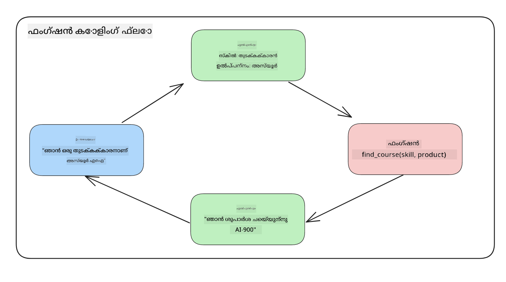
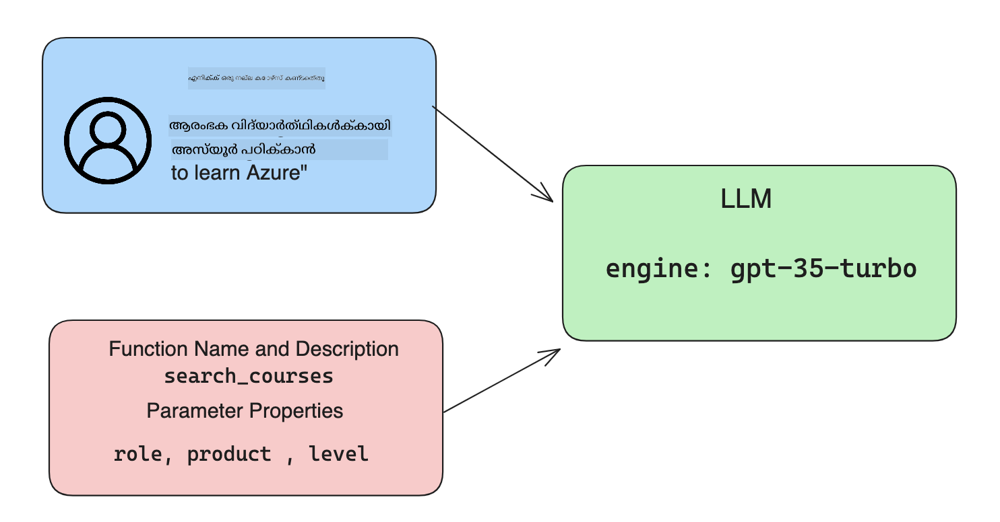

<!--
CO_OP_TRANSLATOR_METADATA:
{
  "original_hash": "f6f84f9ef2d066cd25850cab93580a50",
  "translation_date": "2025-12-19T20:05:02+00:00",
  "source_file": "11-integrating-with-function-calling/README.md",
  "language_code": "ml"
}
-->
# ഫംഗ്ഷൻ കോളിങ്ങുമായി സംയോജിപ്പിക്കൽ

[](https://youtu.be/DgUdCLX8qYQ?si=f1ouQU5HQx6F8Gl2)

മുൻപത്തെ പാഠങ്ങളിൽ നിങ്ങൾ ഇതുവരെ നല്ലൊരു പരിജ്ഞാനം നേടിയിട്ടുണ്ട്. എങ്കിലും, നാം കൂടുതൽ മെച്ചപ്പെടുത്താൻ കഴിയും. ചില കാര്യങ്ങൾ നാം പരിഹരിക്കേണ്ടത് എങ്ങനെ കൂടുതൽ സ്ഥിരതയുള്ള പ്രതികരണ ഫോർമാറ്റ് ലഭ്യമാക്കാമെന്ന് ആണ്, ഇത് പ്രതികരണത്തെ താഴെ പ്രവർത്തനക്ഷമമാക്കാൻ സഹായിക്കും. കൂടാതെ, നാം മറ്റ് ഉറവിടങ്ങളിൽ നിന്നുള്ള ഡാറ്റ ചേർക്കാൻ ആഗ്രഹിക്കാം, അതിലൂടെ നമ്മുടെ ആപ്ലിക്കേഷൻ കൂടുതൽ സമ്പന്നമാക്കാൻ.

മുകളിൽ പരാമർശിച്ച പ്രശ്നങ്ങൾ ഈ അധ്യായം പരിഹരിക്കാൻ ഉദ്ദേശിക്കുന്നതാണ്.

## പരിചയം

ഈ പാഠത്തിൽ ഉൾപ്പെടുന്നത്:

- ഫംഗ്ഷൻ കോളിങ്ങ് എന്താണെന്നും അതിന്റെ ഉപയോഗ കേസുകളും വിശദീകരിക്കുക.
- Azure OpenAI ഉപയോഗിച്ച് ഫംഗ്ഷൻ കോൾ സൃഷ്ടിക്കൽ.
- ഒരു ആപ്ലിക്കേഷനിൽ ഫംഗ്ഷൻ കോൾ എങ്ങനെ സംയോജിപ്പിക്കാമെന്ന്.

## പഠന ലക്ഷ്യങ്ങൾ

ഈ പാഠം അവസാനിപ്പിക്കുമ്പോൾ, നിങ്ങൾക്ക് കഴിയും:

- ഫംഗ്ഷൻ കോളിങ്ങിന്റെ ഉദ്ദേശ്യം വിശദീകരിക്കുക.
- Azure OpenAI സർവീസ് ഉപയോഗിച്ച് ഫംഗ്ഷൻ കോൾ സജ്ജമാക്കുക.
- നിങ്ങളുടെ ആപ്ലിക്കേഷന്റെ ഉപയോഗ കേസിനായി ഫംഗ്ഷൻ കോൾ ഫലപ്രദമായി രൂപകൽപ്പന ചെയ്യുക.

## സീനാരിയോ: ഫംഗ്ഷനുകളിലൂടെ നമ്മുടെ ചാറ്റ്ബോട്ട് മെച്ചപ്പെടുത്തൽ

ഈ പാഠത്തിനായി, നമ്മുടെ വിദ്യാഭ്യാസ സ്റ്റാർട്ടപ്പിനായി ഒരു ഫീച്ചർ നിർമ്മിക്കാൻ ആഗ്രഹിക്കുന്നു, ഇത് ഉപയോക്താക്കൾക്ക് ഒരു ചാറ്റ്ബോട്ട് ഉപയോഗിച്ച് സാങ്കേതിക കോഴ്സുകൾ കണ്ടെത്താൻ അനുവദിക്കും. അവരുടെ കഴിവ് നില, നിലവിലെ ജോലി, താൽപ്പര്യമുള്ള സാങ്കേതികവിദ്യ എന്നിവ അനുസരിച്ച് കോഴ്സുകൾ നാം ശുപാർശ ചെയ്യും.

ഈ സീനാരിയോ പൂർത്തിയാക്കാൻ, നാം താഴെ പറയുന്നവയുടെ സംയോജനം ഉപയോഗിക്കും:

- `Azure OpenAI` ഉപയോക്താവിന് ചാറ്റ് അനുഭവം സൃഷ്ടിക്കാൻ.
- `Microsoft Learn Catalog API` ഉപയോക്താക്കൾക്ക് അവരുടെ അഭ്യർത്ഥന അനുസരിച്ച് കോഴ്സുകൾ കണ്ടെത്താൻ സഹായിക്കാൻ.
- `Function Calling` ഉപയോക്താവിന്റെ ചോദ്യം എടുത്ത് API അഭ്യർത്ഥന നടത്താൻ ഫംഗ്ഷനിലേക്ക് അയയ്ക്കാൻ.

ആരംഭിക്കാൻ, നാം ആദ്യം ഫംഗ്ഷൻ കോളിങ്ങ് ഉപയോഗിക്കേണ്ടതെന്തുകൊണ്ടെന്ന് നോക്കാം:

## ഫംഗ്ഷൻ കോളിങ്ങ് എന്തുകൊണ്ട്

ഫംഗ്ഷൻ കോളിങ്ങിന് മുമ്പ്, LLM-ൽ നിന്നുള്ള പ്രതികരണങ്ങൾ ഘടനയില്ലാത്തതും അനിയന്ത്രിതവുമായിരുന്നു. ഡെവലപ്പർമാർക്ക് ഓരോ പ്രതികരണ വ്യത്യാസവും കൈകാര്യം ചെയ്യാൻ സങ്കീർണ്ണമായ പരിശോധന കോഡ് എഴുതേണ്ടിവന്നു. ഉപയോക്താക്കൾക്ക് "സ്റ്റോക്ക്ഹോംയിലെ നിലവിലെ കാലാവസ്ഥ എന്താണ്?" പോലുള്ള ചോദ്യങ്ങൾക്ക് ഉത്തരം ലഭിക്കാനായിരുന്നില്ല. കാരണം മോഡലുകൾ പരിശീലിപ്പിച്ച ഡാറ്റയുടെ സമയപരിധിയിലായിരുന്നു പരിമിതമായത്.

ഫംഗ്ഷൻ കോളിങ്ങ് Azure OpenAI സർവീസിന്റെ ഒരു സവിശേഷതയാണ്, താഴെ പറയുന്ന പരിമിതികൾ മറികടക്കാൻ:

- **സ്ഥിരമായ പ്രതികരണ ഫോർമാറ്റ്**. പ്രതികരണ ഫോർമാറ്റ് നന്നായി നിയന്ത്രിക്കാനാകുന്നുവെങ്കിൽ, നാം അത് താഴെ പ്രവർത്തനക്ഷമമായി മറ്റ് സിസ്റ്റങ്ങളുമായി സംയോജിപ്പിക്കാൻ കഴിയും.
- **ബാഹ്യ ഡാറ്റ**. ഒരു ആപ്ലിക്കേഷനിലെ മറ്റ് ഉറവിടങ്ങളിൽ നിന്നുള്ള ഡാറ്റ ചാറ്റ് സാന്ദർഭ്യത്തിൽ ഉപയോഗിക്കാൻ കഴിയും.

## ഒരു സീനാരിയോ വഴി പ്രശ്നം വിശദീകരിക്കൽ

> താഴെ പറയുന്ന സീനാരിയോ പ്രവർത്തിപ്പിക്കാൻ നിങ്ങൾക്ക് [ഉൾപ്പെടുത്തിയ നോട്ട്ബുക്ക്](./python/aoai-assignment.ipynb?WT.mc_id=academic-105485-koreyst) ഉപയോഗിക്കാൻ ഞങ്ങൾ ശുപാർശ ചെയ്യുന്നു. അല്ലെങ്കിൽ, നാം ഫംഗ്ഷനുകൾ പ്രശ്നം പരിഹരിക്കാൻ എങ്ങനെ സഹായിക്കാമെന്ന് വിശദീകരിക്കാൻ ശ്രമിക്കുന്നതിനാൽ വായിച്ചുകൊണ്ടിരിക്കാം.

പ്രതികരണ ഫോർമാറ്റ് പ്രശ്നം വിശദീകരിക്കുന്ന ഉദാഹരണം നോക്കാം:

നാം ഒരു വിദ്യാർത്ഥി ഡാറ്റാബേസ് സൃഷ്ടിച്ച് ശരിയായ കോഴ്സ് ശുപാർശ ചെയ്യാൻ ആഗ്രഹിക്കുന്നു. താഴെ രണ്ട് വിദ്യാർത്ഥികളുടെ വിവരണങ്ങൾ ഉണ്ട്, അവ തമ്മിൽ വളരെ സമാനമാണ്.

1. Azure OpenAI റിസോഴ്സുമായി കണക്ഷൻ സൃഷ്ടിക്കുക:

   ```python
   import os
   import json
   from openai import AzureOpenAI
   from dotenv import load_dotenv
   load_dotenv()

   client = AzureOpenAI(
   api_key=os.environ['AZURE_OPENAI_API_KEY'],  # ഇത് ഡിഫോൾട്ടും ആണ്, ഇത് ഒഴിവാക്കാം
   api_version = "2023-07-01-preview"
   )

   deployment=os.environ['AZURE_OPENAI_DEPLOYMENT']
   ```

   താഴെ Azure OpenAI-യുമായി കണക്ഷൻ ക്രമീകരിക്കുന്നതിന് ചില Python കോഡ് ഉണ്ട്, ഇവിടെ `api_type`, `api_base`, `api_version` , `api_key` എന്നിവ സജ്ജീകരിക്കുന്നു.

1. `student_1_description` , `student_2_description` എന്ന വേരിയബിളുകൾ ഉപയോഗിച്ച് രണ്ട് വിദ്യാർത്ഥി വിവരണങ്ങൾ സൃഷ്ടിക്കുക.

   ```python
   student_1_description="Emily Johnson is a sophomore majoring in computer science at Duke University. She has a 3.7 GPA. Emily is an active member of the university's Chess Club and Debate Team. She hopes to pursue a career in software engineering after graduating."

   student_2_description = "Michael Lee is a sophomore majoring in computer science at Stanford University. He has a 3.8 GPA. Michael is known for his programming skills and is an active member of the university's Robotics Club. He hopes to pursue a career in artificial intelligence after finishing his studies."
   ```

   മുകളിൽ പറഞ്ഞ വിദ്യാർത്ഥി വിവരണങ്ങൾ LLM-ലേക്ക് അയച്ച് ഡാറ്റ പാഴ്‌സ് ചെയ്യാൻ ആഗ്രഹിക്കുന്നു. ഈ ഡാറ്റ പിന്നീട് നമ്മുടെ ആപ്ലിക്കേഷനിൽ ഉപയോഗിക്കാനും API-യിലേക്ക് അയയ്ക്കാനും ഡാറ്റാബേസിൽ സൂക്ഷിക്കാനും കഴിയും.

1. LLM-നെ എന്ത് വിവരങ്ങൾ ആവശ്യമാണെന്ന് നിർദ്ദേശിക്കുന്ന രണ്ട് സമാന പ്രോംപ്റ്റുകൾ സൃഷ്ടിക്കാം:

   ```python
   prompt1 = f'''
   Please extract the following information from the given text and return it as a JSON object:

   name
   major
   school
   grades
   club

   This is the body of text to extract the information from:
   {student_1_description}
   '''

   prompt2 = f'''
   Please extract the following information from the given text and return it as a JSON object:

   name
   major
   school
   grades
   club

   This is the body of text to extract the information from:
   {student_2_description}
   '''
   ```

   മുകളിൽ കാണുന്ന പ്രോംപ്റ്റുകൾ LLM-നെ വിവരങ്ങൾ പാഴ്‌സ് ചെയ്ത് JSON ഫോർമാറ്റിൽ പ്രതികരിക്കാൻ നിർദ്ദേശിക്കുന്നു.

1. പ്രോംപ്റ്റുകളും Azure OpenAI-യുമായി കണക്ഷനും സജ്ജമാക്കിയ ശേഷം, `openai.ChatCompletion` ഉപയോഗിച്ച് പ്രോംപ്റ്റുകൾ LLM-ലേക്ക് അയയ്ക്കാം. പ്രോംപ്റ്റ് `messages` വേരിയബിളിൽ സൂക്ഷിക്കുകയും `user` എന്ന റോളിൽ നിയോഗിക്കുകയും ചെയ്യുന്നു. ഇത് ഉപയോക്താവിന്റെ സന്ദേശം ചാറ്റ്ബോട്ടിലേക്ക് എഴുതുന്നതായി അനുകരിക്കുന്നു.

   ```python
   # പ്രോംപ്റ്റ് ഒന്ന് നിന്നുള്ള പ്രതികരണം
   openai_response1 = client.chat.completions.create(
   model=deployment,
   messages = [{'role': 'user', 'content': prompt1}]
   )
   openai_response1.choices[0].message.content

   # പ്രോംപ്റ്റ് രണ്ട് നിന്നുള്ള പ്രതികരണം
   openai_response2 = client.chat.completions.create(
   model=deployment,
   messages = [{'role': 'user', 'content': prompt2}]
   )
   openai_response2.choices[0].message.content
   ```

ഇപ്പോൾ നാം രണ്ട് അഭ്യർത്ഥനകളും LLM-ലേക്ക് അയച്ച് ലഭിക്കുന്ന പ്രതികരണം പരിശോധിക്കാം, ഉദാഹരണത്തിന് `openai_response1['choices'][0]['message']['content']` എന്ന രീതിയിൽ.

1. അവസാനം, `json.loads` വിളിച്ച് പ്രതികരണം JSON ഫോർമാറ്റിലേക്ക് മാറ്റാം:

   ```python
   # പ്രതികരണം JSON ഒബ്ജക്റ്റായി ലോഡ് ചെയ്യുന്നു
   json_response1 = json.loads(openai_response1.choices[0].message.content)
   json_response1
   ```

   പ്രതികരണം 1:

   ```json
   {
     "name": "Emily Johnson",
     "major": "computer science",
     "school": "Duke University",
     "grades": "3.7",
     "club": "Chess Club"
   }
   ```

   പ്രതികരണം 2:

   ```json
   {
     "name": "Michael Lee",
     "major": "computer science",
     "school": "Stanford University",
     "grades": "3.8 GPA",
     "club": "Robotics Club"
   }
   ```

   പ്രോംപ്റ്റുകൾ ഒരേപോലെയാണ്, വിവരണങ്ങളും സമാനമാണ്, എങ്കിലും `Grades` പ്രോപ്പർട്ടി മൂല്യങ്ങൾ വ്യത്യസ്തമായി ഫോർമാറ്റ് ചെയ്തിട്ടുണ്ട്, ചിലപ്പോൾ `3.7` എന്ന ഫോർമാറ്റും ചിലപ്പോൾ `3.7 GPA` എന്ന ഫോർമാറ്റും ലഭിക്കുന്നു.

   ഈ ഫലം കാരണം LLM എഴുതി നൽകിയ പ്രോംപ്റ്റ് രൂപത്തിലുള്ള ഘടനയില്ലാത്ത ഡാറ്റ സ്വീകരിച്ച് ഘടനയില്ലാത്ത ഡാറ്റ തിരികെ നൽകുന്നു. നമുക്ക് ഘടനയുള്ള ഫോർമാറ്റ് വേണം, അതിലൂടെ നാം ഈ ഡാറ്റ സംഭരിക്കുമ്പോൾ അല്ലെങ്കിൽ ഉപയോഗിക്കുമ്പോൾ എന്ത് പ്രതീക്ഷിക്കാമെന്ന് അറിയാം.

അപ്പോൾ ഫോർമാറ്റിംഗ് പ്രശ്നം എങ്ങനെ പരിഹരിക്കാം? ഫംഗ്ഷണൽ കോളിങ്ങ് ഉപയോഗിച്ച്, നാം ഘടനയുള്ള ഡാറ്റ തിരികെ ലഭിക്കുന്നതായി ഉറപ്പാക്കാം. ഫംഗ്ഷൻ കോളിങ്ങ് ഉപയോഗിക്കുമ്പോൾ, LLM യഥാർത്ഥത്തിൽ ഫംഗ്ഷനുകൾ വിളിക്കുകയോ പ്രവർത്തിപ്പിക്കുകയോ ചെയ്യില്ല. പകരം, LLM-ന് അതിന്റെ പ്രതികരണങ്ങൾക്ക് പിന്തുടരാനുള്ള ഘടന നാം സൃഷ്ടിക്കുന്നു. പിന്നീട് ആ ഘടനയുള്ള പ്രതികരണങ്ങൾ ഉപയോഗിച്ച് ആപ്ലിക്കേഷനുകളിൽ ഏത് ഫംഗ്ഷൻ പ്രവർത്തിപ്പിക്കണമെന്ന് നാം അറിയാം.



പിന്നീട് ഫംഗ്ഷനിൽ നിന്നുള്ള ഫലം എടുത്ത് LLM-ലേക്ക് തിരികെ അയയ്ക്കാം. LLM ഉപയോക്താവിന്റെ ചോദ്യം പ്രകൃതിദത്ത ഭാഷയിൽ മറുപടി നൽകും.

## ഫംഗ്ഷൻ കോൾ ഉപയോഗിക്കുന്ന ഉപയോഗ കേസുകൾ

ഫംഗ്ഷൻ കോൾ നിങ്ങളുടെ ആപ്പ് മെച്ചപ്പെടുത്താൻ സഹായിക്കുന്ന പല വ്യത്യസ്ത ഉപയോഗ കേസുകൾ ഉണ്ട്, ഉദാഹരണങ്ങൾ:

- **ബാഹ്യ ഉപകരണങ്ങൾ കോൾ ചെയ്യൽ**. ചാറ്റ്ബോട്ടുകൾ ഉപയോക്താക്കളുടെ ചോദ്യങ്ങൾക്ക് ഉത്തരം നൽകുന്നതിൽ മികച്ചവയാണ്. ഫംഗ്ഷൻ കോളിങ്ങ് ഉപയോഗിച്ച്, ചാറ്റ്ബോട്ടുകൾ ഉപയോക്താക്കളുടെ സന്ദേശങ്ങൾ ഉപയോഗിച്ച് ചില പ്രവർത്തനങ്ങൾ പൂർത്തിയാക്കാം. ഉദാഹരണത്തിന്, ഒരു വിദ്യാർത്ഥി ചാറ്റ്ബോട്ടിനോട് "എന്റെ ഇൻസ്ട്രക്ടറിന് ഈ വിഷയത്തിൽ കൂടുതൽ സഹായം വേണമെന്ന് ഒരു ഇമെയിൽ അയയ്ക്കൂ" എന്ന് പറയാം. ഇത് `send_email(to: string, body: string)` എന്ന ഫംഗ്ഷൻ കോൾ ചെയ്യാം.

- **API അല്ലെങ്കിൽ ഡാറ്റാബേസ് ക്വെറികൾ സൃഷ്ടിക്കൽ**. ഉപയോക്താക്കൾ സ്വാഭാവിക ഭാഷ ഉപയോഗിച്ച് വിവരങ്ങൾ കണ്ടെത്താം, അത് ഫോർമാറ്റ് ചെയ്ത ക്വറി അല്ലെങ്കിൽ API അഭ്യർത്ഥനയാക്കി മാറ്റാം. ഉദാഹരണത്തിന്, ഒരു അധ്യാപകൻ "അവസാന അസൈൻമെന്റ് പൂർത്തിയാക്കിയ വിദ്യാർത്ഥികൾ ആരെല്ലാം?" എന്ന് ചോദിക്കുമ്പോൾ, `get_completed(student_name: string, assignment: int, current_status: string)` എന്ന ഫംഗ്ഷൻ കോൾ ചെയ്യാം.

- **ഘടനയുള്ള ഡാറ്റ സൃഷ്ടിക്കൽ**. ഉപയോക്താക്കൾ ഒരു ടെക്സ്റ്റ് ബ്ലോക്ക് അല്ലെങ്കിൽ CSV എടുത്ത് LLM ഉപയോഗിച്ച് അതിൽ നിന്നുള്ള പ്രധാന വിവരങ്ങൾ പാഴ്‌സ് ചെയ്യാം. ഉദാഹരണത്തിന്, ഒരു വിദ്യാർത്ഥി Wikipedia ലേഖനം എടുത്ത് AI ഫ്ലാഷ്‌കാർഡുകൾ സൃഷ്ടിക്കാൻ `get_important_facts(agreement_name: string, date_signed: string, parties_involved: list)` എന്ന ഫംഗ്ഷൻ ഉപയോഗിക്കാം.

## നിങ്ങളുടെ ആദ്യ ഫംഗ്ഷൻ കോൾ സൃഷ്ടിക്കൽ

ഫംഗ്ഷൻ കോൾ സൃഷ്ടിക്കുന്ന പ്രക്രിയയിൽ 3 പ്രധാന ഘട്ടങ്ങൾ ഉണ്ട്:

1. നിങ്ങളുടെ ഫംഗ്ഷനുകളുടെ പട്ടികയും ഉപയോക്തൃ സന്ദേശവും ഉപയോഗിച്ച് Chat Completions API കോൾ ചെയ്യൽ.
2. മോഡലിന്റെ പ്രതികരണം വായിച്ച് ഒരു പ്രവർത്തനം നിർവഹിക്കൽ, ഉദാ: ഫംഗ്ഷൻ അല്ലെങ്കിൽ API കോൾ നടത്തൽ.
3. നിങ്ങളുടെ ഫംഗ്ഷനിൽ നിന്നുള്ള പ്രതികരണം ഉപയോഗിച്ച് Chat Completions API-യിലേക്ക് മറ്റൊരു കോൾ നടത്തൽ, ഉപയോക്താവിന് മറുപടി സൃഷ്ടിക്കാൻ.



### ഘട്ടം 1 - സന്ദേശങ്ങൾ സൃഷ്ടിക്കൽ

ആദ്യം ഒരു ഉപയോക്തൃ സന്ദേശം സൃഷ്ടിക്കണം. ഇത് ഡൈനാമിക്കായി ടെക്സ്റ്റ് ഇൻപുട്ടിന്റെ മൂല്യം എടുത്ത് നിയോഗിക്കാം അല്ലെങ്കിൽ ഇവിടെ ഒരു മൂല്യം നൽകാം. Chat Completions API-യുമായി ആദ്യമായി പ്രവർത്തിക്കുന്നുവെങ്കിൽ, സന്ദേശത്തിന്റെ `role`യും `content`ഉം നിർവചിക്കണം.

`role` ആയിരിക്കാം `system` (നിയമങ്ങൾ സൃഷ്ടിക്കൽ), `assistant` (മോഡൽ) അല്ലെങ്കിൽ `user` (അവസാന ഉപയോക്താവ്). ഫംഗ്ഷൻ കോളിങ്ങിനായി, നാം ഇത് `user` ആയി നിയോഗിക്കുകയും ഒരു ഉദാഹരണ ചോദ്യവും നൽകുകയും ചെയ്യും.

```python
messages= [ {"role": "user", "content": "Find me a good course for a beginner student to learn Azure."} ]
```

വിവിധ റോളുകൾ നിയോഗിക്കുന്നത് LLM-ന് സിസ്റ്റം സംസാരിക്കുന്നതാണോ ഉപയോക്താവ് ആണോ എന്ന് വ്യക്തമാക്കുന്നു, ഇത് LLM സംഭാഷണ ചരിത്രം നിർമ്മിക്കാൻ സഹായിക്കുന്നു.

### ഘട്ടം 2 - ഫംഗ്ഷനുകൾ സൃഷ്ടിക്കൽ

അടുത്തതായി, ഒരു ഫംഗ്ഷനും അതിന്റെ പാരാമീറ്ററുകളും നിർവചിക്കും. ഇവിടെ `search_courses` എന്ന ഒരു ഫംഗ്ഷൻ മാത്രം ഉപയോഗിക്കും, പക്ഷേ നിങ്ങൾക്ക് പല ഫംഗ്ഷനുകളും സൃഷ്ടിക്കാം.

> **പ്രധാനമാണ്** : ഫംഗ്ഷനുകൾ LLM-ന് നൽകിയ സിസ്റ്റം സന്ദേശത്തിൽ ഉൾപ്പെടും, ഇത് ലഭ്യമായ ടോക്കൺ പരിധിയിൽ ഉൾപ്പെടും.

താഴെ, ഫംഗ്ഷനുകൾ ഒരു ഐറ്റം ലിസ്റ്റായി സൃഷ്ടിക്കുന്നു. ഓരോ ഐറ്റവും ഒരു ഫംഗ്ഷനാണ്, അതിന് `name`, `description`, `parameters` എന്ന പ്രോപ്പർട്ടികൾ ഉണ്ട്:

```python
functions = [
   {
      "name":"search_courses",
      "description":"Retrieves courses from the search index based on the parameters provided",
      "parameters":{
         "type":"object",
         "properties":{
            "role":{
               "type":"string",
               "description":"The role of the learner (i.e. developer, data scientist, student, etc.)"
            },
            "product":{
               "type":"string",
               "description":"The product that the lesson is covering (i.e. Azure, Power BI, etc.)"
            },
            "level":{
               "type":"string",
               "description":"The level of experience the learner has prior to taking the course (i.e. beginner, intermediate, advanced)"
            }
         },
         "required":[
            "role"
         ]
      }
   }
]
```

ഓരോ ഫംഗ്ഷൻ ഉദാഹരണവും വിശദമായി വിവരണം ചെയ്യാം:

- `name` - വിളിക്കേണ്ട ഫംഗ്ഷന്റെ പേര്.
- `description` - ഫംഗ്ഷൻ എങ്ങനെ പ്രവർത്തിക്കുന്നു എന്ന വിവരണം. ഇവിടെ വ്യക്തവും വ്യക്തവുമായിരിക്കണം.
- `parameters` - മോഡൽ പ്രതികരണത്തിൽ ഉത്പാദിപ്പിക്കേണ്ട മൂല്യങ്ങളും ഫോർമാറ്റും ഉള്ള ലിസ്റ്റ്. പാരാമീറ്ററുകളുടെ അറേയിൽ ഉള്ള ഓരോ ഐറ്റത്തിനും താഴെ പറയുന്ന പ്രോപ്പർട്ടികൾ ഉണ്ട്:
  1. `type` - പ്രോപ്പർട്ടിയുടെ ഡാറ്റാ ടൈപ്പ്.
  1. `properties` - മോഡൽ പ്രതികരണത്തിൽ ഉപയോഗിക്കുന്ന പ്രത്യേക മൂല്യങ്ങളുടെ ലിസ്റ്റ്
      1. `name` - മോഡൽ ഫോർമാറ്റ് ചെയ്ത പ്രതികരണത്തിൽ ഉപയോഗിക്കുന്ന പ്രോപ്പർട്ടി പേര്, ഉദാ: `product`.
      1. `type` - ഈ പ്രോപ്പർട്ടിയുടെ ഡാറ്റാ ടൈപ്പ്, ഉദാ: `string`.
      1. `description` - പ്രത്യേക പ്രോപ്പർട്ടിയുടെ വിവരണം.

ഓപ്ഷണൽ പ്രോപ്പർട്ടി `required` ഉണ്ട് - ഫംഗ്ഷൻ കോൾ പൂർത്തിയാക്കാൻ ആവശ്യമായ പ്രോപ്പർട്ടികൾ.

### ഘട്ടം 3 - ഫംഗ്ഷൻ കോൾ നടത്തൽ

ഫംഗ്ഷൻ നിർവചിച്ചതിന് ശേഷം, അത് Chat Completion API-യിലേക്ക് കോൾ ചെയ്യുമ്പോൾ ഉൾപ്പെടുത്തണം. ഇത് അഭ്യർത്ഥനയിൽ `functions` ചേർക്കുന്നതിലൂടെ ചെയ്യുന്നു. ഇവിടെ `functions=functions` ആണ്.

`function_call` എന്ന ഓപ്ഷൻ `auto` ആയി സജ്ജീകരിക്കാം. ഇതിന്റെ അർത്ഥം, ഉപയോക്തൃ സന്ദേശത്തിന്റെ അടിസ്ഥാനത്തിൽ ഏത് ഫംഗ്ഷൻ വിളിക്കണമെന്ന് LLM തീരുമാനിക്കും, നാം നേരിട്ട് നിയോഗിക്കില്ല.

താഴെ ചില കോഡ് ഉണ്ട്, ഇവിടെ `ChatCompletion.create` കോൾ ചെയ്യുമ്പോൾ `functions=functions` , `function_call="auto"` സജ്ജീകരിച്ചിരിക്കുന്നു, അതിലൂടെ LLM-ന് ഫംഗ്ഷനുകൾ വിളിക്കാനുള്ള തിരഞ്ഞെടുപ്പ് നൽകുന്നു:

```python
response = client.chat.completions.create(model=deployment,
                                        messages=messages,
                                        functions=functions,
                                        function_call="auto")

print(response.choices[0].message)
```

ഇപ്പോൾ ലഭിക്കുന്ന പ്രതികരണം ഇങ്ങനെ കാണാം:

```json
{
  "role": "assistant",
  "function_call": {
    "name": "search_courses",
    "arguments": "{\n  \"role\": \"student\",\n  \"product\": \"Azure\",\n  \"level\": \"beginner\"\n}"
  }
}
```

ഇവിടെ `search_courses` ഫംഗ്ഷൻ വിളിക്കപ്പെട്ടതും, JSON പ്രതികരണത്തിലെ `arguments` പ്രോപ്പർട്ടിയിൽ ഉള്ള ആർഗ്യുമെന്റുകളുമായി കാണാം.

LLM `messages` പാരാമീറ്ററിൽ നൽകിയ മൂല്യത്തിൽ നിന്നുള്ള ഡാറ്റ പാഴ്‌സ് ചെയ്ത് ഫംഗ്ഷന്റെ ആർഗ്യുമെന്റുകളുമായി പൊരുത്തപ്പെടുന്ന ഡാറ്റ കണ്ടെത്താൻ കഴിഞ്ഞു. താഴെ `messages` മൂല്യത്തിന്റെ ഓർമ്മപ്പെടുത്തൽ:

```python
messages= [ {"role": "user", "content": "Find me a good course for a beginner student to learn Azure."} ]
```

കാണുന്നതുപോലെ, `student`, `Azure`, `beginner` എന്നിവ `messages`-ൽ നിന്നു പാഴ്‌സ് ചെയ്ത് ഫംഗ്ഷനിലേക്ക് ഇൻപുട്ടായി നൽകിയിട്ടുണ്ട്. ഫംഗ്ഷനുകൾ ഈ രീതിയിൽ ഉപയോഗിക്കുന്നത് പ്രോംപ്റ്റിൽ നിന്നുള്ള വിവരങ്ങൾ പാഴ്‌സ് ചെയ്യാനും LLM-ന് ഘടന നൽകാനും, പുനരുപയോഗയോഗ്യമായ ഫംഗ്ഷനാലിറ്റി നൽകാനും മികച്ച മാർഗമാണ്.

ഇപ്പോൾ, നാം ഇത് നമ്മുടെ ആപ്പിൽ എങ്ങനെ ഉപയോഗിക്കാമെന്ന് നോക്കാം.

## ആപ്ലിക്കേഷനിൽ ഫംഗ്ഷൻ കോൾ സംയോജിപ്പിക്കൽ

LLM-ൽ നിന്നുള്ള ഫോർമാറ്റ് ചെയ്ത പ്രതികരണം പരീക്ഷിച്ചതിന് ശേഷം, നാം ഇത് ആപ്ലിക്കേഷനിൽ സംയോജിപ്പിക്കാം.

### പ്രവാഹം നിയന്ത്രിക്കൽ

നമ്മുടെ ആപ്ലിക്കേഷനിൽ ഇത് സംയോജിപ്പിക്കാൻ, താഴെ പറയുന്ന ഘട്ടങ്ങൾ സ്വീകരിക്കാം:

1. ആദ്യം, OpenAI സർവീസുകളിലേക്ക് കോൾ ചെയ്ത് `response_message` എന്ന വേരിയബിളിൽ സന്ദേശം സൂക്ഷിക്കുക.

   ```python
   response_message = response.choices[0].message
   ```

1. ഇനി, Microsoft Learn API-യെ കോൾ ചെയ്ത് കോഴ്സുകളുടെ ലിസ്റ്റ് ലഭിക്കുന്ന ഫംഗ്ഷൻ നിർവചിക്കാം:

   ```python
   import requests

   def search_courses(role, product, level):
     url = "https://learn.microsoft.com/api/catalog/"
     params = {
        "role": role,
        "product": product,
        "level": level
     }
     response = requests.get(url, params=params)
     modules = response.json()["modules"]
     results = []
     for module in modules[:5]:
        title = module["title"]
        url = module["url"]
        results.append({"title": title, "url": url})
     return str(results)
   ```

   ഇവിടെ, `functions` വേരിയബിളിൽ നൽകിയ ഫംഗ്ഷൻ പേരുമായി പൊരുത്തപ്പെടുന്ന യഥാർത്ഥ Python ഫംഗ്ഷൻ സൃഷ്ടിക്കുന്നു. നാം യഥാർത്ഥ ബാഹ്യ API കോൾ നടത്തുന്നു, ഈ കേസിൽ Microsoft Learn API-യിലേക്ക് പരിശീലന മോഡ്യൂളുകൾ തിരയാൻ.

ശരി, നാം `functions` വേരിയബിളും അനുബന്ധ Python ഫംഗ്ഷനും സൃഷ്ടിച്ചു, എങ്ങനെ LLM-ന് ഇത് മാപ്പ് ചെയ്യാമെന്ന് പറയാം, അതിലൂടെ Python ഫംഗ്ഷൻ വിളിക്കപ്പെടും?

1. Python ഫംഗ്ഷൻ വിളിക്കേണ്ടതുണ്ടോ എന്ന് പരിശോധിക്കാൻ, LLM പ്രതികരണത്തിൽ `function_call` ഉണ്ടോ എന്ന് നോക്കണം, ഉണ്ടെങ്കിൽ സൂചിപ്പിച്ച ഫംഗ്ഷൻ വിളിക്കണം. താഴെ ഈ പരിശോധന എങ്ങനെ നടത്താമെന്ന് കാണിക്കുന്നു:

   ```python
   # മോഡൽ ഒരു ഫംഗ്ഷൻ വിളിക്കണമെന്ന് ആഗ്രഹിക്കുന്നുണ്ടോ എന്ന് പരിശോധിക്കുക
   if response_message.function_call.name:
    print("Recommended Function call:")
    print(response_message.function_call.name)
    print()

    # ഫംഗ്ഷൻ വിളിക്കുക.
    function_name = response_message.function_call.name

    available_functions = {
            "search_courses": search_courses,
    }
    function_to_call = available_functions[function_name]

    function_args = json.loads(response_message.function_call.arguments)
    function_response = function_to_call(**function_args)

    print("Output of function call:")
    print(function_response)
    print(type(function_response))


    # അസിസ്റ്റന്റ് പ്രതികരണവും ഫംഗ്ഷൻ പ്രതികരണവും സന്ദേശങ്ങളിൽ ചേർക്കുക
    messages.append( # അസിസ്റ്റന്റ് പ്രതികരണം സന്ദേശങ്ങളിൽ ചേർക്കുന്നു
        {
            "role": response_message.role,
            "function_call": {
                "name": function_name,
                "arguments": response_message.function_call.arguments,
            },
            "content": None
        }
    )
    messages.append( # ഫംഗ്ഷൻ പ്രതികരണം സന്ദേശങ്ങളിൽ ചേർക്കുന്നു
        {
            "role": "function",
            "name": function_name,
            "content":function_response,
        }
    )
   ```

   ഈ മൂന്ന് വരികൾ ഫംഗ്ഷൻ പേര്, ആർഗ്യുമെന്റുകൾ പാഴ്‌സ് ചെയ്ത് കോൾ ചെയ്യുന്നു:

   ```python
   function_to_call = available_functions[function_name]

   function_args = json.loads(response_message.function_call.arguments)
   function_response = function_to_call(**function_args)
   ```

   താഴെ നമ്മുടെ കോഡ് പ്രവർത്തിപ്പിച്ചപ്പോൾ ലഭിച്ച ഔട്ട്പുട്ട്:

   **ഔട്ട്പുട്ട്**

   ```Recommended Function call:
   {
     "name": "search_courses",
     "arguments": "{\n  \"role\": \"student\",\n  \"product\": \"Azure\",\n  \"level\": \"beginner\"\n}"
   }

   Output of function call:
   [{'title': 'Describe concepts of cryptography', 'url': 'https://learn.microsoft.com/training/modules/describe-concepts-of-cryptography/?
   WT.mc_id=api_CatalogApi'}, {'title': 'Introduction to audio classification with TensorFlow', 'url': 'https://learn.microsoft.com/en-
   us/training/modules/intro-audio-classification-tensorflow/?WT.mc_id=api_CatalogApi'}, {'title': 'Design a Performant Data Model in Azure SQL
   Database with Azure Data Studio', 'url': 'https://learn.microsoft.com/training/modules/design-a-data-model-with-ads/?
   WT.mc_id=api_CatalogApi'}, {'title': 'Getting started with the Microsoft Cloud Adoption Framework for Azure', 'url':
   'https://learn.microsoft.com/training/modules/cloud-adoption-framework-getting-started/?WT.mc_id=api_CatalogApi'}, {'title': 'Set up the
   Rust development environment', 'url': 'https://learn.microsoft.com/training/modules/rust-set-up-environment/?WT.mc_id=api_CatalogApi'}]
   <class 'str'>
   ```

1. ഇപ്പോൾ അപ്ഡേറ്റുചെയ്‌ത സന്ദേശം `messages` LLM-ലേക്ക് അയച്ച്, API JSON ഫോർമാറ്റ് മറുപടി പകരം സ്വാഭാവിക ഭാഷാ മറുപടി സ്വീകരിക്കാം.

   ```python
   print("Messages in next request:")
   print(messages)
   print()

   second_response = client.chat.completions.create(
      messages=messages,
      model=deployment,
      function_call="auto",
      functions=functions,
      temperature=0
         )  # ഫംഗ്ഷൻ റെസ്പോൺസ് കാണാൻ കഴിയുന്ന പുതിയ ഒരു ജിപിടി റെസ്പോൺസ് നേടുക


   print(second_response.choices[0].message)
   ```

   **ഔട്ട്പുട്ട്**

   ```python
   {
     "role": "assistant",
     "content": "I found some good courses for beginner students to learn Azure:\n\n1. [Describe concepts of cryptography] (https://learn.microsoft.com/training/modules/describe-concepts-of-cryptography/?WT.mc_id=api_CatalogApi)\n2. [Introduction to audio classification with TensorFlow](https://learn.microsoft.com/training/modules/intro-audio-classification-tensorflow/?WT.mc_id=api_CatalogApi)\n3. [Design a Performant Data Model in Azure SQL Database with Azure Data Studio](https://learn.microsoft.com/training/modules/design-a-data-model-with-ads/?WT.mc_id=api_CatalogApi)\n4. [Getting started with the Microsoft Cloud Adoption Framework for Azure](https://learn.microsoft.com/training/modules/cloud-adoption-framework-getting-started/?WT.mc_id=api_CatalogApi)\n5. [Set up the Rust development environment](https://learn.microsoft.com/training/modules/rust-set-up-environment/?WT.mc_id=api_CatalogApi)\n\nYou can click on the links to access the courses."
   }

   ```

## അസൈൻമെന്റ്

Azure OpenAI ഫംഗ്ഷൻ കോളിങ്ങിന്റെ പഠനം തുടരാൻ നിങ്ങൾക്ക് നിർമ്മിക്കാവുന്നതാണ്:

- പഠനാർത്ഥികൾക്ക് കൂടുതൽ കോഴ്സുകൾ കണ്ടെത്താൻ സഹായിക്കുന്ന ഫംഗ്ഷന്റെ കൂടുതൽ പാരാമീറ്ററുകൾ.
- പഠനാർത്ഥിയുടെ മാതൃഭാഷ പോലുള്ള കൂടുതൽ വിവരങ്ങൾ സ്വീകരിക്കുന്ന മറ്റൊരു ഫംഗ്ഷൻ കോൾ സൃഷ്ടിക്കുക.
- ഫംഗ്ഷൻ കോൾ ചെയ്യുമ്പോഴും/അഥവാ API കോൾ ചെയ്യുമ്പോഴും യോജിച്ച കോഴ്സുകൾ ലഭിക്കാത്തപ്പോൾ പിശക് കൈകാര്യം ചെയ്യൽ സൃഷ്ടിക്കുക

സൂചന: ഈ ഡാറ്റ എങ്ങനെ എവിടെ ലഭ്യമാണെന്ന് കാണാൻ [Learn API reference documentation](https://learn.microsoft.com/training/support/catalog-api-developer-reference?WT.mc_id=academic-105485-koreyst) പേജ് പിന്തുടരുക.

## മികച്ച ജോലി! യാത്ര തുടരുക

ഈ പാഠം പൂർത്തിയാക്കിയ ശേഷം, നിങ്ങളുടെ Generative AI അറിവ് മെച്ചപ്പെടുത്താൻ ഞങ്ങളുടെ [Generative AI Learning collection](https://aka.ms/genai-collection?WT.mc_id=academic-105485-koreyst) പരിശോധിക്കുക!

പാഠം 12 ലേക്ക് പോകൂ, അവിടെ നാം [AI ആപ്ലിക്കേഷനുകൾക്കുള്ള UX ഡിസൈൻ](../12-designing-ux-for-ai-applications/README.md?WT.mc_id=academic-105485-koreyst) എങ്ങനെ ചെയ്യാമെന്ന് നോക്കാം!

---

<!-- CO-OP TRANSLATOR DISCLAIMER START -->
**അസൂയാപത്രം**:  
ഈ രേഖ AI വിവർത്തന സേവനം [Co-op Translator](https://github.com/Azure/co-op-translator) ഉപയോഗിച്ച് വിവർത്തനം ചെയ്തതാണ്. നാം കൃത്യതയ്ക്ക് ശ്രമിച്ചിട്ടുണ്ടെങ്കിലും, സ്വയം പ്രവർത്തിക്കുന്ന വിവർത്തനങ്ങളിൽ പിശകുകൾ അല്ലെങ്കിൽ തെറ്റുകൾ ഉണ്ടാകാമെന്ന് ദയവായി ശ്രദ്ധിക്കുക. അതിന്റെ മാതൃഭാഷയിലുള്ള യഥാർത്ഥ രേഖ അധികാരപരമായ ഉറവിടമായി കണക്കാക്കപ്പെടണം. നിർണായക വിവരങ്ങൾക്ക്, പ്രൊഫഷണൽ മനുഷ്യ വിവർത്തനം ശുപാർശ ചെയ്യപ്പെടുന്നു. ഈ വിവർത്തനം ഉപയോഗിക്കുന്നതിൽ നിന്നുണ്ടാകുന്ന ഏതെങ്കിലും തെറ്റിദ്ധാരണകൾക്കോ തെറ്റായ വ്യാഖ്യാനങ്ങൾക്കോ ഞങ്ങൾ ഉത്തരവാദികളല്ല.
<!-- CO-OP TRANSLATOR DISCLAIMER END -->