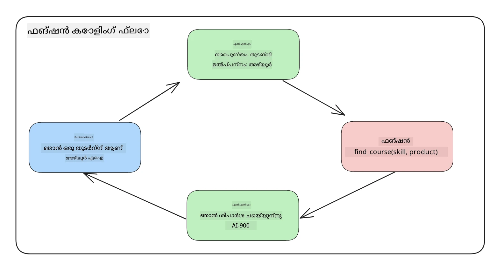
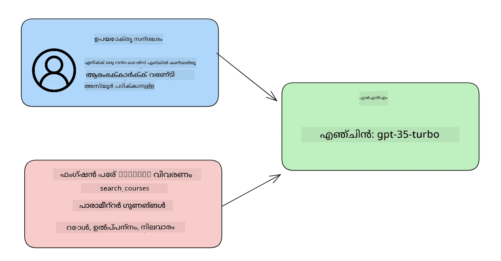

# ഫംഗ്ഷൻ വിളിപ്പിക്കുന്നത് ഇന്റഗ്രേറ്റ് ചെയ്യുന്നു

[](https://youtu.be/DgUdCLX8qYQ?si=f1ouQU5HQx6F8Gl2)

മുൻപത്തെ പാഠങ്ങളിൽ നിങ്ങൾക്കു ഇന്നലെയും നല്ലൊരു അറിവ് ഉണ്ടായി. എന്നാൽ, നാം കൂടുതൽ മെച്ചപ്പെടുത്താൻ കഴിയും. ചില കാര്യങ്ങൾ നാം പരിഗണിക്കേണ്ടതാണ്, മറ്റൊരു കാര്യത്തിന് കൂടുതൽ സ്ഥിരതയുള്ള പ്രതികരണ ഫോർമാറ്റ് ലഭിക്കാൻ, പ്രതികരണം താഴെ പ്രവർത്തിക്കാൻ എളുപ്പമാക്കാൻ. കൂടാതെ, ഊരിതിൽ നിന്നുള്ള മറ്റ് ഉറവിടങ്ങളിൽ നിന്ന് ഡാറ്റ ചേർക്കുന്നതിലൂടെ ഞങ്ങളുടെ അപ്ലിക്കേഷൻ കൂടുതൽ സമൃദ്ധമാക്കാനാകാം.

മുകളിൽ പറഞ്ഞ പ്രശ്നങ്ങൾ ഈ അധ്യായം പരിഹരിക്കാൻ ശ്രമിക്കുന്നതാണ്.

## പരിചയം

ഈ പാഠത്തിൽ ഉൾപ്പെടുന്നത്:

- ഫംഗ്ഷൻ വിളിപ്പിക്കുന്നത് എന്താണെന്നും അതിന്റെ ഉപയോഗകാരണങ്ങളും വിശദീകരിക്കുക.
- Azure OpenAI ഉപയോഗിച്ച് ഫംഗ്ഷൻ വിളി സൃഷ്ടിക്കൽ.
- ഒരു അപ്ലിക്കേഷനിൽ ഫംഗ്ഷൻ വിളി എങ്ങനെ ഇന്റഗ്രേറ്റ് ചെയ്യാമെന്ന് കാണിക്കുക.

## പഠന ലക്ഷ്യങ്ങൾ

ഈ പാഠം അവസാനിക്കുന്നപ്പോൾ, നിങ്ങൾ കഴിവുണ്ട്:

- ഫംഗ്ഷൻ വിളിപ്പിക്കുന്നതിനുള്ള ഉദ്ദേശ്യം വിശദീകരിക്കുക.
- Azure OpenAI സേర్వീസ് ഉപയോഗിച്ച് ഫംഗ്ഷൻ കോളിനെ സജ്ജീകരിക്കുക.
- നിങ്ങളുടെ അപ്ലിക്കേഷന്റെ ഉപയോഗകാരണത്തിനായി പ്രഭാവവത്തായ ഫംഗ്ഷൻ കോളുകൾ രൂപകല്‍പ്പന ചെയ്യുക.

## സാന്ദർഭ്യം: ഞങ്ങളുടെ ചാറ്റ്ബോട്ടിനെ ഫംഗ്ഷനുകളിലൂടെ മെച്ചപ്പെടുത്തുക

ഈ പാഠത്തിന്റെ ഭാഗമായി, ഞങ്ങളുടെ വിദ്യാഭ്യാസ സ്റ്റാർട്ടപ്പിനായി ഒരു ഫീച്ചർ നിർമിക്കാനാണ് ഉദ്ദേശിക്കുന്നത്, ഇത് ഉപയോക്താക്കൾക്ക് ഒരു ചാറ്റ്ബോട്ട് ഉപയോഗിച്ച് സാങ്കേതിക കോഴ്സുകൾ കണ്ടെത്താൻ അനുവദിക്കും. അവർക്കുള്ള ശിപാർശകൾ അവരുടെ കഴിവ് നില, നിലവിലെ പങ്ക്, താൽപര്യമുള്ള സാങ്കേതികവിദ്യ എന്നിവയ്ക്ക് അനുയോജ്യമായ കോഴ്സുകൾ നൽകും.

ഈ സാന്ദർഭ്യം പൂർത്തിയാക്കാൻ നാം താഴെ ചേർത്തു:

- ഉപയോഗിക്കാം `Azure OpenAI` ഉപയോക്താവിന് ചാറ്റ് അനുഭവം സൃഷ്ടിക്കാൻ.
- ഉപയോക്താക്കളുടെ അഭ്യർത്ഥനകളുടെ അടിസ്ഥാനത്തിൽ കോഴ്സുകൾ കണ്ടെത്താൻ `Microsoft Learn Catalog API`.
- ഉപയോക്താവിന്റെ ചോദ്യത്തെ ഫംഗ്ഷനിലേക്ക് അയച്ച് API അഭ്യർത്ഥന നടത്താൻ `Function Calling`.

തുടക്കം ചെയ്യാൻ, ഫംഗ്ഷൻ വിളിക്കുന്നതിന്റെ പ്രാധാന്യം എന്താണെന്ന് നോക്കാം:

## ഫംഗ്ഷൻ വിളിക്കാനുള്ള കാരണം

ഫംഗ്ഷൻ വിളിക്കുന്നതിന് മുമ്പ്, LLMയിൽ നിന്നുള്ള പ്രതികരണങ്ങൾ അനിയമിതവും അസ്ഥിരവുമായിരുന്നതും നിർബന്ധിതമായിരുന്നു. ഡെവലപ്പർമാർക്ക് പ്രതികരണങ്ങളുടെ ഓരോ വ്യത്യാസവും കൈകാര്യം ചെയ്യാൻ സങ്കീർണ്ണമായ പരിശോധിച്ചുപരിശോധിക്കൽ കോഡ് എഴുതേണ്ടിവന്നിരുന്നു. ഉപയോക്താക്കൾക്ക് "സ്റ്റോക്ക്ഹോം നഗരത്തിലെ ഇപ്പോഴുള്ള കാലാവസ്ഥ എന്താണ്?" പോലുള്ള ചോദ്യങ്ങൾക്ക് ഉത്തരം കിട്ടാതെ പോയതാണ്. കാരണം, മോഡലുകൾ പരിശീലിച്ച ഡാറ്റയുടെ സമയത്തേക്ക് മാത്രമേ പരിമിതമായിരുന്നത്.

ഫംഗ്ഷൻ വിളിക്കുന്നത് Azure OpenAI Service ന്റെ ഒരു സവിശേഷതയാണ് താഴെ പറയുന്ന പരിമിതികൾ മറികടക്കാൻ:

- **സ്ഥിരമായ പ്രതികരണ ഫോർമാറ്റ്**. പ്രതികരണ ഫോർമാറ്റ് മെച്ചപ്പെടുത്തുന്നതിലൂടെ, നാം മറ്റുള്ള സിസ്റ്റങ്ങൾക്കു തിരിച്ചടങ്ങാനായുയ് ഈ ഫോർമാറ്റ് അനുസരിച്ച് പ്രതികരണം രൂപപ്പെടുത്താം.
- **ബാഹ്യ ഡാറ്റ**. ചാറ്റ് പശ്ചാത്തലത്തിൽ അപ്ലിക്കേഷനിലെ മറ്റ് ഉറവിടങ്ങളിൽ നിന്നുള്ള ഡാറ്റ ഉപയോഗിക്കാനുള്ള കഴിവ്.

## ഒരു സാന്ദർഭ്യത്തിലെ പ്രശ്നം ദൃശ്യവൽക്കരിക്കൽ

> താഴെ പറയുന്ന സാന്ദർഭ്യം നടത്താൻ ഇഷ്ടമുണ്ടെങ്കിൽ, നിങ്ങൾക്ക് [ഉൾപ്പെടുത്തിയിരിക്കുന്ന നോട്ട്‌ബുക്ക്](./python/aoai-assignment.ipynb?WT.mc_id=academic-105485-koreyst) ഉപയോഗിക്കാനാണ് നാം ശിപാർശ ചെയ്യുന്നത്. അല്ലാത്ത പക്ഷം, ഫംഗ്ഷൻ ഉപയോഗിച്ചുള്ള പ്രശ്ന പരിഹാര ശ്രമം കാണാനായും വായിക്കാവുന്നതാണ്.

പ്രതികരണ ഫോർമാറ്റ് പ്രശ്നം വിശദമാക്കുന്ന ഉദാഹരണം നോക്കാം:

നമുക്ക് ഒരു വിദ്യാർത്ഥികളുടെ ഡാറ്റാബേസ് സൃഷ്ടിക്കാനായി, അവർക്ക് ശരിയായ കോഴ്സ് നിർദേശിക്കാൻ വേണ്ട ഡാറ്റ തയ്യാറാക്കാം. താഴെ രണ്ട് വിദ്യാർത്ഥികളുടെ വിവരണങ്ങൾ കൊടുക്കുന്നു, അവയിൽ ഉള്ള ഡാറ്റ വളരെ സാധാരണമാണ്.

1. Azure OpenAI റിസോഴ്സുമായി ഒരു കണക്ഷൻ സൃഷ്ടിക്കുക:

   ```python
   import os
   import json
   from openai import OpenAI
   from dotenv import load_dotenv
   load_dotenv()

   # റെസ്‌പ്പോൺസസ് API ആജുർ ഓപ്പൺഎഐ (Microsoft Foundry) v1 എൻഡ്‌പോയിന്റിൽ നിന്നാണ് സേവനം ലഭിക്കുന്നത്
   # അതുകൊണ്ട്, ഓപ്പൺഎഐ ക്ലയർ‌റെ <your-endpoint>/openai/v1/ എന്നതിന് പോയ്ന്റ്റ് ചെയ്യുന്നു.
   endpoint = os.environ['AZURE_OPENAI_ENDPOINT']
   client = OpenAI(
   api_key=os.environ['AZURE_OPENAI_API_KEY'],
   base_url=f"{endpoint.rstrip('/')}/openai/v1/",
   )

   deployment=os.environ['AZURE_OPENAI_DEPLOYMENT']
   ```

   താഴെ Azure OpenAI-യുമായി കണക്ഷൻ ക്രമീകരിക്കുന്നതിന് പൈത്തൺ കോഡ് കാണിക്കുന്നു. v1 എന്റ്പോയിന്റ് ഉപയോഗിക്കുന്നതിനാൽ, `api_key`യും `base_url`വും മാത്രമേ കരാറില്‍ സജ്ജീകരിക്കേണ്ടതുള്ളൂ (`api_version` ആവശ്യമില്ല).

1. രണ്ട് വിദ്യാർത്ഥി വിവരണങ്ങൾ `student_1_description`നും `student_2_description`നും മാറ്റിനിർവ്വചിക്കുക.

   ```python
   student_1_description="Emily Johnson is a sophomore majoring in computer science at Duke University. She has a 3.7 GPA. Emily is an active member of the university's Chess Club and Debate Team. She hopes to pursue a career in software engineering after graduating."

   student_2_description = "Michael Lee is a sophomore majoring in computer science at Stanford University. He has a 3.8 GPA. Michael is known for his programming skills and is an active member of the university's Robotics Club. He hopes to pursue a career in artificial intelligence after finishing his studies."
   ```

   മുകളിൽ നൽകിയ വിദ്യാർത്ഥി വിവരണങ്ങൾ LLM-ക്ക് അയച്ച് ഡാറ്റ പാഴ്സുചെയ്യാൻ ആഗ്രഹിക്കുന്നു. ഈ ഡാറ്റ പിന്നീട് ഞങ്ങളുടെ അപ്ലിക്കേഷനിൽ ഉപയോഗിക്കുകയും APIയ്ക്ക് അയയ്ക്കുകയും ഡാറ്റാബേസിൽ സംഭരിക്കുകയും ചെയ്യാം.

1. LLM-നെ എന്തെല്ലാം വിവരങ്ങൾക്കായി ആഭ്യർത്ഥിക്കുന്നു എന്ന് നിർദ്ദേശിക്കുന്ന രണ്ട് സമാനമായ പ്രോംപ്റ്റുകൾ സൃഷ്ടിക്കാം:

   ```python
   prompt1 = f'''
   Please extract the following information from the given text and return it as a JSON object:

   name
   major
   school
   grades
   club

   This is the body of text to extract the information from:
   {student_1_description}
   '''

   prompt2 = f'''
   Please extract the following information from the given text and return it as a JSON object:

   name
   major
   school
   grades
   club

   This is the body of text to extract the information from:
   {student_2_description}
   '''
   ```

   മുകളിൽ നൽകിയ പ്രോംപ്റ്റുകൾ LLM-ന് വിവരങ്ങൾ പാഴ്സുചെയ്ത് JSON ഫോർമാറ്റിൽ തിരിച്ചയക്കാൻ നിർദ്ദേശിക്കുന്നു.

1. പ്രോംപ്റ്റുകളും Azure OpenAI-യുമായി കണക്ഷനും ക്രമീകരിച്ചശേഷം, `client.responses.create` ഉപയോഗിച്ച് പ്രോംപ്റ്റുകൾ LLM-ൽ അയയ്ക്കാം. പ്രോംപ്റ്റ് `input` എന്ന വേരിയബിൾ-ൽ സൂക്ഷിക്കുകയും റോൾ `user` ആയി നിശ്ചയിക്കുകയും ചെയ്യുന്നു. ഇത് ഉപയോക്താവിന്റെ സന്ദേശം ചാറ്റ്ബോട്ട്‌ക്ക് എഴുതുന്നതായി അനുഭവപ്പെടുത്തുന്നു.

   ```python
   # പ്രാരംഭം ഒന്നിൽ നിന്നുള്ള പ്രതികരണം
   openai_response1 = client.responses.create(
   model=deployment,
   input = [{'role': 'user', 'content': prompt1}],
   store=False,
   )
   openai_response1.output_text

   # പ്രാരംഭം ഒന്നിൽ നിന്നുള്ള പ്രതികരണം
   openai_response2 = client.responses.create(
   model=deployment,
   input = [{'role': 'user', 'content': prompt2}],
   store=False,
   )
   openai_response2.output_text
   ```

 ഇപ്പൊൾ രണ്ടു അഭ്യർത്ഥനകളും LLM-ത്തിലേക്ക് അയച്ച് കിട്ടുന്ന പ്രതികരണം `openai_response1.output_text` എന്ന ഉറവിടം വഴി പരിശോധിക്കാം.

1. അവസാനം, `json.loads` വിളിച്ച് പ്രതികരണം JSON ഫോർമാറ്റിലേക്ക് മാറ്റാം:

   ```python
   # പ്രതികരണത്തെ JSON объек്ടായി ലോഡ് ചെയ്യുന്നു
   json_response1 = json.loads(openai_response1.output_text)
   json_response1
   ```

   1-ാം പ്രതികരണം:

   ```json
   {
     "name": "Emily Johnson",
     "major": "computer science",
     "school": "Duke University",
     "grades": "3.7",
     "club": "Chess Club"
   }
   ```

   2-ാം പ്രതികരണം:

   ```json
   {
     "name": "Michael Lee",
     "major": "computer science",
     "school": "Stanford University",
     "grades": "3.8 GPA",
     "club": "Robotics Club"
   }
   ```

   പ്രോംപ്റ്റുകൾ സമാനമാണ്, വിവരണങ്ങളും ഏകദേശമാണ് എങ്കിലും, `Grades` സ്വത്തുവിന്റെ മൂല്യങ്ങൾ വ്യത്യസ്തമായി ഫോർമാറ്റ് ചെയ്തിട്ടുള്ളത് കാണാം — ചിലപ്പോൾ `3.7` എന്നും മറ്റൊരിക്കൽ `3.7 GPA` എന്നും എന്ന പോലെ.

   ഈ ഫലം അതിന്റെ കാരണം LLM എഴുതി നൽകിയ പ്രോംപ്റ്റിന്റെ അനിസ്ചിതമായ (unstructured) ഡാറ്റ സ്വീകരിച്ച് മറുപടിയും അനിസ്ചിതമായ രീതിയിൽ ലഭ്യമാക്കുന്നതാണ്. നമുക്ക് സൂക്ഷിക്കാനും ഉപയോഗിക്കാനുമാവുമ്പോളുള്ള പ്രതീക്ഷ അറിയാൻ ശരിയായ ഫോർമാറ്റ് ആവശ്യമുണ്ട്.

എങ്ങിനെയാണ് ഈ ഫോർമാറ്റിംഗ് പ്രശ്നം പരിഹരിക്കാമെന്ന്? ഫംഗ്ഷൻ കോളിംഗ് ഉപയോഗിച്ച്, നമുക്ക് തിരിച്ചു ലഭിക്കുന്നത് സാരിചെയ്ത ഫോർമാറ്റത്തിലുള്ള ഡാറ്റയായിരിക്കും. ഫംഗ്ഷൻ കോളിംഗ് ഉപയോഗിക്കുക എന്നതിന്റെ അർത്ഥം, LLM യഥാർത്ഥത്തിൽ ഫംഗ്ഷനുകൾ വിളിക്കുകയോ പ്രവർത്തിപ്പിക്കുകയോ ചെയ്യുകയില്ല. ബദലായി, LLM പിന്തുടരേണ്ട ഒരു ഘടന നമുക്ക് രൂപകൽപ്പന ചെയ്യാനാകും. പിന്നീട് ഈ ഘടനാപൂർണ്ണമായ മറുപടികൾ ഉപയോഗിച്ച് നിലനിൽക്കുന്ന അപ്ലിക്കേഷനിൽ പ്രവർത്തിപ്പിക്കേണ്ട ഫംഗ്ഷൻ കണ്ടെത്താം.



എന്നിട്ട് ഫംഗ്ഷൻ പ്രവർത്തിപ്പിച്ച് കിട്ടിയ ഫലങ്ങൾ LLM-ൽ തിരിച്ചയക്കാം. LLM സ്വാഭാവിക ഭാഷ ഉപയോഗിച്ച് ഉപയോക്താവിന്റെ ചോദ്യം മറുപടി നൽകും.

## ഫംഗ്ഷൻ കോളുകൾ ഉപയോഗിക്കാൻ ഉപയോഗങ്ങൾ

പലവിധവും ഫംഗ്ഷൻ കോളുകൾ നിങ്ങളുടെ ആപ് മെച്ചപ്പെടുത്താൻ സഹായിക്കുന്ന ഉപയോഗങ്ങൾ ഉണ്ട്, ഉദാഹരണത്തിന്:

- **ബാഹ്യ സാമഗ്രികൾക്ക് വിളിക്കുക**. ചാറ്റ്ബോട്ടുകൾ ഉപയോക്താക്കളിൽ നിന്നുള്ള ചോദ്യങ്ങൾക്ക് ഉത്തരം നൽകുന്നതിൽ മികച്ചവയാണ്. ഫംഗ്ഷൻ കോളിംഗ് ഉപയോഗിച്ച്, ചാറ്റ്ബോട്ട് ഉപയോക്താക്കളുടെ സന്ദേശങ്ങൾ ഉപയോഗിച്ചു ചില പ്രവർത്തനങ്ങൾ നടത്താം. ഉദാഹരണത്തിന്, ഒരു വിദ്യാർത്ഥി ചാറ്റ്ബോട്ട്‌ ചോദിക്കാം, "എന്റെ അധ്യാപകനോട് ഇമെയിൽ അയയ്ക്കൂ, ഈ വിഷയത്തിൽ കൂടുതൽ സഹായം വേണമെന്ന് പറയുക." ഇത് `send_email(to: string, body: string)` എന്ന ഫംഗ്ഷൻ കോളിലേക്ക് എത്താം.

- **API അല്ലെങ്കിൽ ഡാറ്റാബേസ് ക്വറികൾ സൃഷ്ടിക്കുക**. ഉപയോക്താക്കൾ സ്വാഭാവിക ഭാഷ ഉപയോഗിച്ച് വിവരങ്ങൾ കണ്ടെത്തുക, അത് എടുക്കിവച്ച് അഭ്യർത്ഥനയായി ഫോർമാറ്റ് ചെയ്യുന്ന API ആവശ്യമാണ്. ഉദാഹരണത്തിന്, ഒരു അധ്യാപകൻ ചോദിക്കാം "അവസാന അസൈൻമെന്റുള്ള വിദ്യാർത്ഥികൾ ആരെല്ലാം?" ഇതിനെ അനുസരിച്ച് `get_completed(student_name: string, assignment: int, current_status: string)` എന്ന ഫംഗ്ഷൻ കോളോ കീഴിലാകും വിളിക്കുന്നത്.

- **ഘടനാപൂര്ണ്ണമായ ഡാറ്റ സൃഷ്ടിക്കുക**. ഉപയോക്താക്കൾ ടെക്സ്റ്റ് ബ്ലോക്കോ CSV ഫയൽ ഉണ്ട് എങ്കിൽ LLM ഉപയോഗിച്ച് അതിൽ നിന്നുള്ള പ്രധാനം വിവരങ്ങൾ പാഴ്സുചെയ്യാം. ഉദാഹരണത്തിന്, ഒരാൾ ശ്രീമതി സമാധാന കരാറുകൾക്കുറിച്ച് വിക്കിപീഡിയ ലേഖനം എടുത്ത് AI ഫ്ലാഷ്‌കാർഡുകൾ സൃഷ്ടിക്കാം. ഇത് `get_important_facts(agreement_name: string, date_signed: string, parties_involved: list)` എന്ന ഫംഗ്ഷൻ ഉപയോഗിച്ച് ചെയ്യാം.

## നിങ്ങളുടെ ആദ്യ ഫംഗ്ഷൻ കോളിംഗ് സൃഷ്ടിക്കുക

ഫംഗ്ഷൻ കോളിംഗ് സൃഷ്ടിക്കുന്ന പ്രക്രിയയിൽ പ്രധാനമായ 3 ഘട്ടങ്ങളുണ്ട്:

1. നിങ്ങളുടെ ഫംഗ്ഷനുകളുടെ പട്ടിക (ഉപകരണങ്ങൾ) ഉപയോഗിച്ച് Responses API-ക്കു ഫംഗ്ഷൻ കോളിംഗ് അനുവദിക്കുക.
2. പ്രവർത്തനം നടപ്പാക്കാൻ മോഡലിന്റെ പ്രതികരണം വായിക്കുക, ഉദാ: ഫംഗ്ഷൻ അല്ലെങ്കിൽ API കോൾ നടത്തുക.
3. നിങ്ങളുടെ ഫംഗ്ഷനിൽ നിന്നുള്ള പ്രതികരണം Responses API ക്യാമെത്തി ഉപയോക്താവിന് മറുപടി നൽകാൻ ഉപയോഗിക്കുക.



### ഘട്ടം 1 - സന്ദേശങ്ങൾ സൃഷ്ടിക്കൽ

ആദ്യ ഘട്ടം ഒരു ഉപയോക്തൃ സന്ദേശം സൃഷ്ടിക്കൽ ആണ്. ഇത് ടെക്സ്റ്റ് ഇൻപുട്ടിന്റെ മൂല്യം എടുത്ത് സൗകര്യപ്രദമായി നിശ്ചയിക്കാനാകാം അല്ലെങ്കിൽ ഇവിടെ പതിച്ചിൽ നിശ്ചയിക്കാമല്ലോ. ഇതാണ് Responses API-വുമായി ആദ്യമായുള്ള പ്രവർത്തനം എങ്കിൽ `role`-ഉം `content`-ഉം നിർവ്വചിക്കേണ്ടതാണ്.

`role` ആയി `system` (നിയമങ്ങൾ സൃഷ്ടിക്കുക), `assistant` (മോഡൽ) അല്ലെങ്കിൽ `user` (ഉപയോക്താവ്) നിശ്ചയിക്കാം. ഫംഗ്ഷൻ കോളിംഗിനായി ഇത് `user` ആയി മാറ്റി ഉദാഹരണ ചോദ്യമുണ്ടാക്കും.

```python
messages= [ {"role": "user", "content": "Find me a good course for a beginner student to learn Azure."} ]
```

വ്യത്യസ്ത रोलുകൾ നിശ്ചയിക്കുകയാണെങ്കിൽ, LLM-ന് അത് സിസ്റ്റം പറയുന്നു അല്ലെങ്കിൽ ഉപയോക്താവ് പറയുന്നു എന്ന് മനസ്സിലാക്കാൻ കഴിയും, ഇത് സംഭാഷണ ചരിത്രം നിർമിക്കാൻ സഹായിക്കുന്നു.

### ഘട്ടം 2 - ഫംഗ്ഷനുകൾ സൃഷ്ടിക്കുക

തുടർന്ന്, ഒരു ഫംഗ്ഷനും അതിന്റെ പാരാമീറ്ററുകളും നിർവചിക്കും. ഇവിടെയ് `search_courses` എന്ന ഒരു ഫംഗ്ഷൻ മാത്രം ഉപയോഗിക്കാനാണ് സങ്കൽപ്പം, എന്നാൽ നിങ്ങൾക്ക് പലയിടത്തും ഫംഗ്ഷനുകൾ സൃഷ്ടിക്കാൻ കഴിയും.

> **പ്രധാനമെന്ന്:** ഫംഗ്ഷനുകൾ സിസ്റ്റം സന്ദേശത്തിൽ LLM-ക്ക് ഉൾപ്പെടുത്തപ്പെടും, നിങ്ങളുടെ ലഭ്യമായ ടോക്കൺ സ്ക്വട്ടിൽ ഉൾപ്പെടും.

താഴെ, ഫംഗ്ഷനുകൾ ഒരു ഐറ്റം ലിസ്റ്റായി സൃഷ്ടിക്കുന്നു. ഓരോ ഐറ്റവും ഫ്ലാറ്റ് Responses API ഫോർമാറ്റിൽ, `type`, `name`, `description`, `parameters` എന്ന സ്വത്തുക്കളോട് കൂടിയൊരു ഉപകരണമാണ്:

```python
functions = [
   {
      "type":"function",
      "name":"search_courses",
      "description":"Retrieves courses from the search index based on the parameters provided",
      "parameters":{
         "type":"object",
         "properties":{
            "role":{
               "type":"string",
               "description":"The role of the learner (i.e. developer, data scientist, student, etc.)"
            },
            "product":{
               "type":"string",
               "description":"The product that the lesson is covering (i.e. Azure, Power BI, etc.)"
            },
            "level":{
               "type":"string",
               "description":"The level of experience the learner has prior to taking the course (i.e. beginner, intermediate, advanced)"
            }
         },
         "required":[
            "role"
         ]
      }
   }
]
```

താഴെ ഓരോ ഫംഗ്ഷൻ ഉദാഹരണവും കൂടുതൽ വിശദമായി വിവരണം ചെയ്യുന്നു:

- `name` - വിളിക്കേണ്ട ഫംഗ്ഷന്റെ പേര്.
- `description` - ഫംഗ്ഷൻ എങ്ങിനെ പ്രവർത്തിക്കുന്നതിന്റെ വിശദീകരണം. ഈ വിവരത്തിൽ വ്യക്തതയും സ്പഷ്ടതയും പ്രധാനമാണ്.
- `parameters` - മോഡൽ പ്രതികരണത്തിൽ നിർമ്മിക്കാനാകുന്ന മൂല്യങ്ങളുടെ പട്ടികയും ഫോർമാറ്റും. പാരാമീറ്ററുകൾ ഒരു ഐറ്റം ലിസ്റ്റ് ആണെന്നും ഓരോ ഐറ്റത്തിനും താഴെപ്പറയുന്ന സ്വത്തുക്കൾ ഉണ്ട്:
  1.  `type` - സ്രോതസ്സിന്റെ ഡാറ്റ തരം.
  1.  `properties` - മോഡൽ പ്രതികരണത്തിൽ ഉപയോഗിക്കുന്ന പ്രത്യേക മൂല്യങ്ങളുടെ പട്ടിക.
      1. `name` - മോഡൽ സ്വീകരിക്കുന്ന ഫോർമാറ്റിൽ ഈ സ്വത്ത് ഉപയോഗിക്കുന്ന കീ, ഉദാഹരണത്തിന് `product`.
      1. `type` - ഈ സവിശേഷതയുടെ ഡാറ്റ തരം, ഉദാ: `string`.
      1. `description` - ഈ സവിശേഷതയുടെ വിവരണം.

ഒരു ഐച്ഛിക സ്വഭാവം `required` ഉണ്ട് - ഫംഗ്ഷൻ വിളിയുടെ പൂര്‍ത്തിയാക്കൽ ആവശ്യമായത്.

### ഘട്ടം 3 - ഫംഗ്ഷൻ കോളിംഗ്

ഫംഗ്ഷൻ നിർവചിച്ചശേഷം, ഇത് Responses API കോൾ-ൽ ഉൾപ്പെടുത്തേണ്ടതാണ്. ഈ കാര്യത്തിന് `tools` എന്ന് അഭ്യർത്ഥനയിൽ ചേർക്കുന്നു. ഈ സാഹചര്യത്തിൽ `tools=functions` ആണ്.

കൂടാതെ `tool_choice` എന്ന ഓപ്ഷൻ `auto` ആയി സജ്ജീകരിക്കാനാകും. ഇതിന്റെ അർത്ഥം, ഉപയോക്തൃ സന്ദേശത്തിന് അനുസരിച്ച് ഏതെങ്കിലും ഫംഗ്ഷൻ ആഹ്വാനം ചെയ്യണമെന്നാണ് LLM തീരുമാനിക്കാനുള്ള അവകാശം നൽകുക എന്നാണ്.

താഴെ കൊടുത്തിരിക്കുന്ന കോഡിൽ `client.responses.create` വിളിക്കുന്നു. കാണുക എങ്ങിനെ നാം `tools=functions`യും `tool_choice="auto"`യും സജ്ജീകരിച്ച് LLM-ന് നൽകുന്നില്ലെങ്കിൽ ഫംഗ്ഷൻ വിളിക്കാം എന്നു തിരഞ്ഞെടുക്കുക:

```python
response = client.responses.create(model=deployment,
                                        input=messages,
                                        tools=functions,
                                        tool_choice="auto",
                                        store=False)

print(response.output)
```

തിരിച്ചെത്തുന്ന മറുപടിയിൽ `function_call` എന്ന ഒരു ഐറ്റം `response.output`-ൽ കാണാം:

```json
{
  "type": "function_call",
  "name": "search_courses",
  "call_id": "call_abc123",
  "arguments": "{\n  \"role\": \"student\",\n  \"product\": \"Azure\",\n  \"level\": \"beginner\"\n}"
}
```

ഇവിടെ നിങ്ങൾക്ക് കാണാം `search_courses` എന്ന ഫംഗ്ഷൻ എങ്ങിനെ വിളിക്കപ്പെട്ടു, `arguments` സ്വത്തിൽ JSON മറുപടിയിൽ പ്രകാശിച്ചു കാണിക്കുന്നു.

LLM-ൽ നിന്നുള്ള ഡാറ്റ ഫംഗ്ഷന്റെ പാരാമീറ്ററുകളിൽ പൂട്ടലായപ്പോഴാണ് ഇത് സംഭവിച്ചത്, കാരണം അതെ `input` പാരാമീറ്ററിന്റെ മൂല്യം Responses API കോളിൽ നിന്നാണ് പിൻവലിച്ചത്. താഴെ `messages` മൂല്യം ഓർത്തെടുക്കാം:

```python
messages= [ {"role": "user", "content": "Find me a good course for a beginner student to learn Azure."} ]
```

നിങ്ങൾക്ക് കാണാം, `student`, `Azure` ഉം `beginner` ഉം `messages`-ൽ നിന്നാണ് പാഴ്സുചെയ്‌തത്, ഫംഗ്ഷന്റെ ഇൻപുട്ടായി സെറ്റ് ചെയ്‌തു. ഇതുപോലെ ഫംഗ്ഷനുകൾ ഉപയോഗിക്കുന്നത് പ്രോംപ്റ്റിൽ നിന്ന് വിവരങ്ങൾ പാഴ്സുചെയ്യുന്നതിനും LLM-ന് ഘടന നൽകുന്നതിനും പുനരുപയോഗയോഗ്യമായ പ്രവർത്തനം ഉറപ്പാക്കുന്നതിനും മികച്ച മാർഗമാണ്.

ഇനി നാം ഇതു നമ്മുടെ അപ്ലിക്കേഷനിൽ എങ്ങനെ ഉപയോഗിക്കാമെന്ന് പരിശോധിക്കാം.

## ഫംഗ്ഷൻ കോളുകൾ ഒരു അപ്ലിക്കേഷനിൽ ഇന്റഗ്രേറ്റ് ചെയ്യൽ

LLM-ൽ നിന്നുള്ള ഫോംമാറ്റുചെയ്ത മറുപടി ടെസ്റ്റുചെയ്യിച്ചശേഷം, നാം ഇത് അപ്ലിക്കേഷനിൽ ഇന്റിഗ്രേറ്റ് ചെയ്യാം.

### പ്രവാഹം മാനേജ് ചെയ്യൽ

അപ്ലിക്കേഷനിൽ ഇന്റഗ്രേറ്റ് ചെയ്യാനായി, താഴെ പറയുന്ന ചുവടുകൾ സ്വീകരിക്കാം:

1. ആദ്യം OpenAI സേർവിസിലേക്ക് കോളുചെയ്യുകയും മറുപടി `output`-ൽ നിന്ന് ഫംഗ്ഷൻ കോളിംഗ് ഇനങ്ങൾ പിൻവലിക്കുക.

   ```python
   response_items = response.output
   tool_calls = [item for item in response_items if item.type == "function_call"]
   ```

1. ഇപ്പോൾ Microsoft Learn API-യുമായി കോഴ്‌സുകളുടെ പട്ടിക ലഭിക്കാൻ വിളിക്കാൻ ഫംഗ്ഷൻ നിർവചിക്കുന്നു:

   ```python
   import requests

   def search_courses(role, product, level):
     url = "https://learn.microsoft.com/api/catalog/"
     params = {
        "role": role,
        "product": product,
        "level": level
     }
     response = requests.get(url, params=params)
     modules = response.json()["modules"]
     results = []
     for module in modules[:5]:
        title = module["title"]
        url = module["url"]
        results.append({"title": title, "url": url})
     return str(results)
   ```

   ഇവിടെ കാണുന്നത്, `functions` എന്ന വേരിയബിൾ പ്രകാരം Python ഫംഗ്ഷൻ സൃഷ്ടിക്കുന്നു. നാം യഥാർത്ഥ ബാഹ്യ API വിളികളുമായി പ്രവർത്തിക്കുന്നു. ഈ കേസിൽ Microsoft Learn API-ക്കെതിരെ പരിശീലന മോഡ്യൂളുകൾക്കായി തിരയുന്നു.

ശരി, നാം `functions` വേരിയബിൾ സൃഷ്ടിച്ചു, Python ഫംഗ്ഷനും സൃഷ്ടിച്ചു, എങ്ങനെ LLM-ന് ഇവ ബന്ധിപ്പിക്കണമെന്നു പറയാം, അതായത് നമ്മുടെ Python ഫംഗ്ഷൻ എങ്ങനെ വിളിക്കാം?

1. Python ഫംഗ്ഷൻ വിളിക്കേണ്ടതുണ്ടോയെന്ന് പരിശോധിക്കാൻ, LLM മറുപടിയിൽ `function_call` എന്ന ഐറ്റം ഉണ്ടോ എന്ന് നോക്കണം, ഉണ്ടെങ്കിൽ ആ ഫംഗ്ഷൻ വിളിക്കണം. താഴെ അങ്ങിനെ പരിശോധിക്കാൻ മാർഗ്ഗം:

   ```python
   # മോഡൽ ഒരു ഫംഗ്ഷൻ കോളുചെയ്യണമെന്ന് ആഗ്രഹിക്കുന്നുണ്ടോ എന്ന് പരിശോധിക്കുക
   if tool_calls:
    for tool_call in tool_calls:
     print("Recommended Function call:")
     print(tool_call.name)
     print()

     # ഫംഗ്ഷൻ കോളുചെയ്യുക.
     function_name = tool_call.name

     available_functions = {
             "search_courses": search_courses,
     }
     function_to_call = available_functions[function_name]

     function_args = json.loads(tool_call.arguments)
     function_response = function_to_call(**function_args)

     print("Output of function call:")
     print(function_response)
     print(type(function_response))

     # ഫംഗ്ഷൻ കോളും അതിന്റെ ഫലവും സംഭാഷണത്തിലേക്ക് മടങ്ങിച്ചേർക്കുക.
     # മോഡലിന്റെ function_call ഇനം അതിന്റെ output ന് മുൻപായി ചേർക്കേണ്ടതാണ്.
     messages.append(tool_call)  # സഹായിക്കാരന്റെ function_call ഇനം
     messages.append( # ഫംഗ്ഷൻ ഫലം
         {
             "type": "function_call_output",
             "call_id": tool_call.call_id,
             "output": function_response,
         }
     )
   ```

   ഈ മൂന്ന് വരികൾ ഫംഗ്ഷൻ പേര്, പാരാമീറ്ററുകൾ പിൻവലിക്കുകയും കോളു നടത്തുകയും ചെയ്യും:

   ```python
   function_to_call = available_functions[function_name]

   function_args = json.loads(tool_call.arguments)
   function_response = function_to_call(**function_args)
   ```

   താഴെ നമ്മുടെയുളള കോഡ് റൺ ചെയ്തപ്പോൾ കിട്ടിയ ഔട്ട്‌പുട്ട്:

   **ഔട്ട്‌പുട്ട്**

   ```Recommended Function call:
   {
     "name": "search_courses",
     "arguments": "{\n  \"role\": \"student\",\n  \"product\": \"Azure\",\n  \"level\": \"beginner\"\n}"
   }

   Output of function call:
   [{'title': 'Describe concepts of cryptography', 'url': 'https://learn.microsoft.com/training/modules/describe-concepts-of-cryptography/?
   WT.mc_id=api_CatalogApi'}, {'title': 'Introduction to audio classification with TensorFlow', 'url': 'https://learn.microsoft.com/en-
   us/training/modules/intro-audio-classification-tensorflow/?WT.mc_id=api_CatalogApi'}, {'title': 'Design a Performant Data Model in Azure SQL
   Database with Azure Data Studio', 'url': 'https://learn.microsoft.com/training/modules/design-a-data-model-with-ads/?
   WT.mc_id=api_CatalogApi'}, {'title': 'Getting started with the Microsoft Cloud Adoption Framework for Azure', 'url':
   'https://learn.microsoft.com/training/modules/cloud-adoption-framework-getting-started/?WT.mc_id=api_CatalogApi'}, {'title': 'Set up the
   Rust development environment', 'url': 'https://learn.microsoft.com/training/modules/rust-set-up-environment/?WT.mc_id=api_CatalogApi'}]
   <class 'str'>
   ```

1. പിന്തുടർന്ന്, അപ്ഡേറ്റുചെയ്ത സന്ദേശം `messages` LLM-ൽ അയയ്ക്കാം, അതിനാൽ API JSON ഫോർമാറ്റിൽ മറുപടി കിട്ടാതെ സ്വാഭാവിക ഭാഷയിൽ മറുപടി കിട്ടാനാകൂ.

   ```python
   print("Messages in next request:")
   print(messages)
   print()

   second_response = client.responses.create(
      input=messages,
      model=deployment,
      tool_choice="auto",
      tools=functions,
      temperature=0,
      store=False,
         )  # മോഡലിൽ നിന്ന് പുതിയ പ്രതികരണം പ്രാപിക്കുക, അത് ഫങ്ക്ഷൻ പ്രതികരണം കാണാൻ കഴിയുന്നിടത്ത്


   print(second_response.output_text)
   ```

   **ഔട്ട്‌പുട്ട്**

   ```text
   I found some good courses for beginner students to learn Azure:

   1. [Describe concepts of cryptography](https://learn.microsoft.com/training/modules/describe-concepts-of-cryptography/?WT.mc_id=api_CatalogApi)
   2. [Introduction to audio classification with TensorFlow](https://learn.microsoft.com/training/modules/intro-audio-classification-tensorflow/?WT.mc_id=api_CatalogApi)
   3. [Design a Performant Data Model in Azure SQL Database with Azure Data Studio](https://learn.microsoft.com/training/modules/design-a-data-model-with-ads/?WT.mc_id=api_CatalogApi)
   4. [Getting started with the Microsoft Cloud Adoption Framework for Azure](https://learn.microsoft.com/training/modules/cloud-adoption-framework-getting-started/?WT.mc_id=api_CatalogApi)
   5. [Set up the Rust development environment](https://learn.microsoft.com/training/modules/rust-set-up-environment/?WT.mc_id=api_CatalogApi)

   You can click on the links to access the courses.
   ```

## അസൈൻമെന്റ്

Azure OpenAI ഫംഗ്ഷൻ കോളിംഗ് സഹായത്തോടെ പഠനം തുടരാൻ നിങ്ങൾ എങ്ങനെ അഡീഷണൽ ഫംഗ്ഷൻ പാരാമീറ്ററുകൾ കൂട്ടിച്ചേര്ക്കാമെന്നും പഠിക്കാം:

- learnersക്ക് കൂടുതൽ കോഴ്സുകൾ കണ്ടെത്താൻ സഹായമാക്കുന്ന ഫംഗ്ഷൻ പാരാമീറ്ററുകൾ കൂട്ടിച്ചേര്ക്കുക.

- പഠനാർത്ഥിയുടെ സ്വന്തം ഭാഷ പോലുള്ള കൂടുതൽ വിവരങ്ങൾ സ്വീകരിക്കുന്ന മറ്റൊരു ഫംഗ്ഷൻ കോൾ സൃഷ്ടിക്കുക
- ഫംഗ്ഷൻ കോൾ അല്ലെങ്കിൽ API കോൾ യോജിച്ച കോഴ്സുകൾ തിരികെ നൽകാതിരിക്കുമ്പോൾ പിഴവ് കൈകാര്യം ചെയ്യലുണ്ടാക്കുക

സൂചന: ഈ ഡാറ്റ എവിടെ ലഭ്യമാണ് എന്നും എങ്ങനെ ലഭ്യമാക്കാവുന്നതാണെന്ന് കാണാൻ [Learn API reference documentation](https://learn.microsoft.com/training/support/catalog-api-developer-reference?WT.mc_id=academic-105485-koreyst) പേജ് പിന്തുടരുക.

## വെക്വെ പണി! യാത്ര തുടരൂ

ഈ പാഠം പൂർത്തിയാക്കിയശേഷം, നിങ്ങളുടെ ജനറേറ്റീവ് AI വിജ്ഞാനം ഉയർത്താൻ ഞങ്ങളിലെ [Generative AI Learning collection](https://aka.ms/genai-collection?WT.mc_id=academic-105485-koreyst) പരിശോധിക്കുക!

പാഠം 12-ത്തിലേക്ക് പോയി, അവിടെ നമ്മൾ [AI അപ്ലിക്കേഷനുകൾക്ക് UX രൂപകൽപ്പന ചെയ്യുന്നത്](../12-designing-ux-for-ai-applications/README.md?WT.mc_id=academic-105485-koreyst) എങ്ങനെ ചെയ്യാമെന്ന് നോക്കാം!

---

<!-- CO-OP TRANSLATOR DISCLAIMER START -->
**അറിയിപ്പ്**:
ഈ രേഖ AI പരിഭാഷാ സേവനം [Co-op Translator](https://github.com/Azure/co-op-translator) ഉപയോഗിച്ച് പരിഭാഷപ്പെടുത്തിയതാണ്. ഞങ്ങൾ കൃത്യതയ്ക്കായി ശ്രമിക്കുന്നുവെങ്കിലും, ഓട്ടോമേറ്റഡ് പരിഭാഷകളിൽ പിഴവുകൾ അല്ലെങ്കിൽ തെറ്റായ വിവരങ്ങൾ ഉണ്ടാകാൻ സാധ്യതയുണ്ട്. അതിന്റെ സ്വാഭാവിക ഭാഷയിലുള്ള അസൽ രേഖയാണ് പ്രാമാണികമായ ഉറവിടമായി പരിഗണിക്കേണ്ടത്. നിർണായകമായ വിവരങ്ങൾക്ക്, പ്രൊഫഷണൽ മനുഷ്യ പരിഭാഷ ശുപാർശ ചെയ്യുന്നു. ഈ പരിഭാഷ ഉപയോഗിച്ച് ഉണ്ടാകുന്ന തെറ്റിദ്ധാരണകൾ അല്ലെങ്കിൽ തെറ്റായ വ്യാഖ്യാനങ്ങൾക്കായി ഞങ്ങൾ ഉത്തരവാദികളല്ല.
<!-- CO-OP TRANSLATOR DISCLAIMER END -->