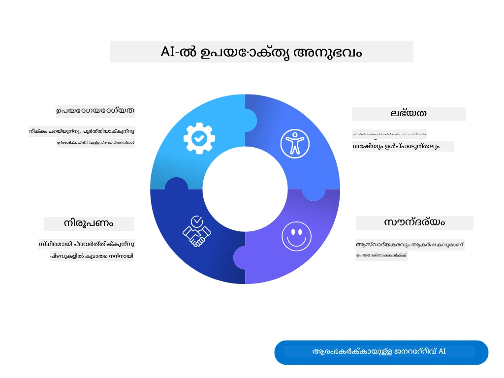
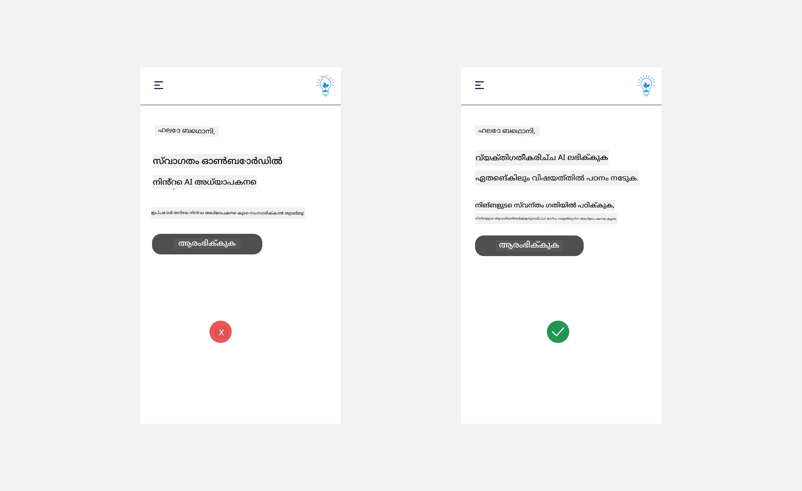
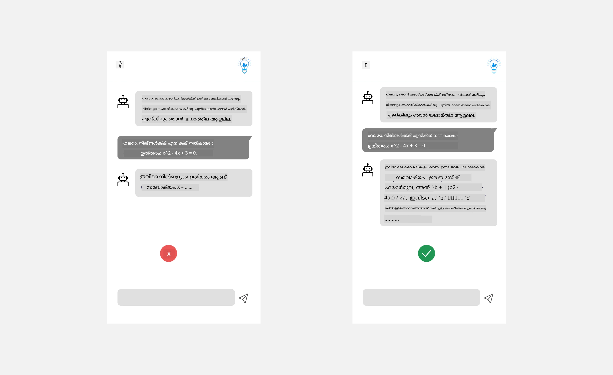
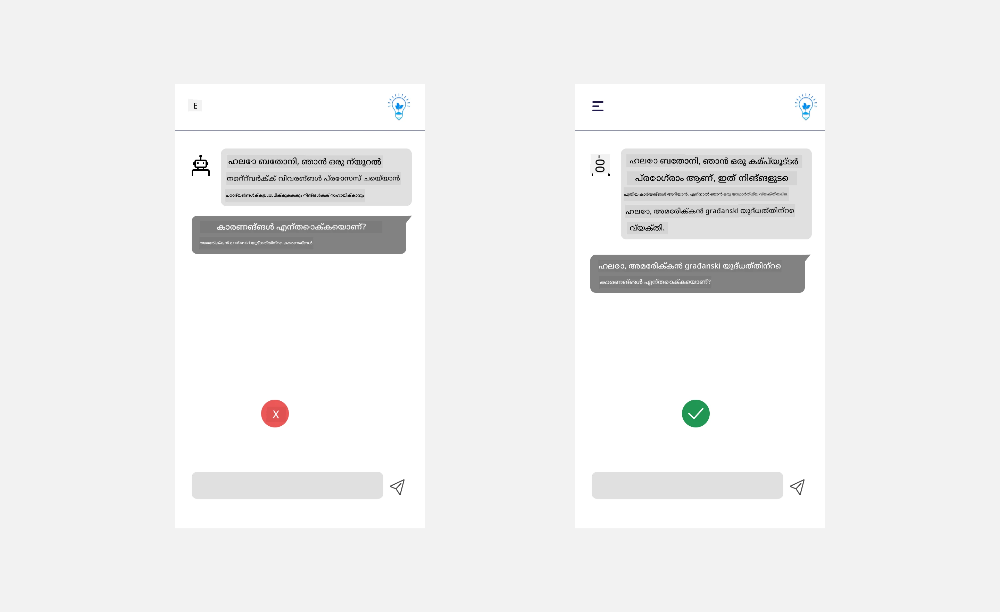
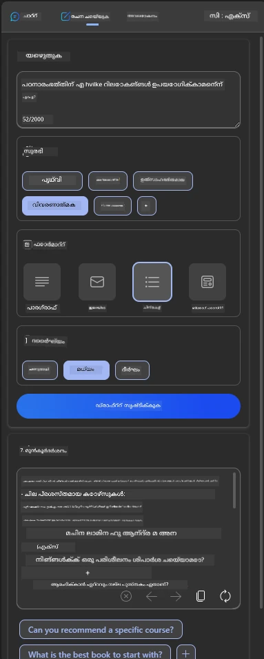
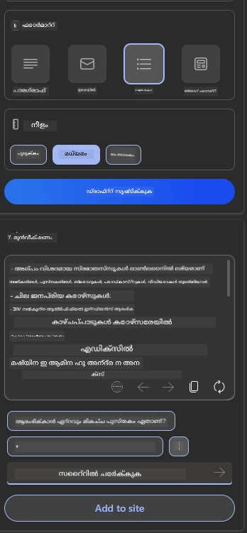
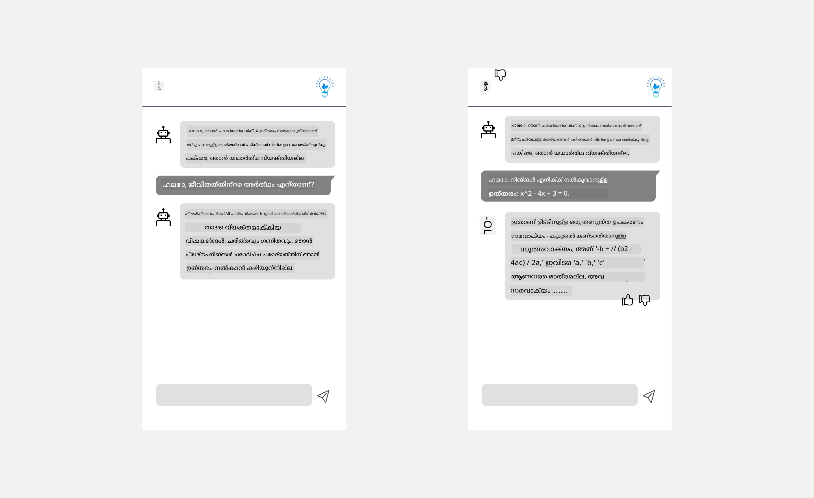

# AI പ്രയോഗങ്ങളിലേക്കുള്ള UX രൂപകൽപ്പന

> _(ഈ പാഠത്തിന്റെ വീഡിയോ കാണാൻ മുകളിൽ ഉള്ള ചിത്രത്തിൽ ക്ലിക്ക് ചെയ്യുക)_

അപ്ലിക്കേഷന്‍ നിർമ്മിക്കുന്നപ്പോൾ ഉപയോക്തൃ പരിചയം വളരെ പ്രധാനമാണ്. ഉപയോക്താക്കൾക്ക് നിങ്ങളുടെ ആപ്പ് കാര്യക്ഷമമായി ഉപയോഗിച്ച് ഈ പ്രവർത്തനങ്ങൾ നടത്താൻ കഴിയണം. കാര്യക്ഷമത ഒരു കാര്യമാണ്, പക്ഷേ ആപ്പുകൾ എല്ലാവർക്കും ഉപയോഗിക്കാൻ കഴിയുന്ന രീതിയിൽ, അതായത് _പ്രവേശനയോഗ്യമായ_ രീതിയിൽ രൂപകൽപ്പന ചെയ്യേണ്ടതും ഉണ്ട്. ഈ അധ്യായത്തിൽ ഈ മേഖലയ്ക്കാണ് ശ്രദ്ധ നൽകിയിരിക്കുന്നത്,‍ അതിലൂടെ നിങ്ങൾ ഒരുപാട് ആളുകൾക്ക് ഉപയോഗിക്കാനും ആഗ്രഹിക്ക്കാനും കഴിയുന്നൊരു ആപ്പ് രൂപകൽപ്പന ചെയ്യുമെന്ന് പ്രതീക്ഷിക്കുന്നു.

## പരിചയം

ഉപയോക്തൃ പരിചയം എന്നു വിശേഷിപ്പിക്കുന്നത് ഉപയോക്താവ് ഒരു ഉൽപ്പന്നത്തോടോ സേവനത്തോടോ എങ്ങനെ ഇടപെടുകയും ഉപയോഗിച്ചും ചെയ്യുന്നതും ആണു, അത് ഒരു സിസ്റ്റം ആകാമോ, ഉപകരണം ആകാമോ, രൂപകൽപ്പന ആകാമോ എങ്കിലുമല്ല. AI പ്രയോഗങ്ങൾ വികസിപ്പിക്കുമ്പോൾ, ഡെവലപ്പർമാർ ഉപയോക്തൃ പരിചയം ഫലപ്രദമായതും ധാർമ്മികമായതും ആകണമെന്നതാണ് ലക്ഷ്യം. ഈ പാഠത്തിൽ, ഉപയോക്തൃ ആവശ്യങ്ങൾ പരിഗണിക്കുന്ന കൃത്രിമ ബുദ്ധി (AI) ആപ്ലിക്കേഷനുകൾ എങ്ങനെ നിർമ്മിക്കാമെന്ന് നമ്മൾ കാണും.

ഈ പാഠത്തിൽ ഇതിങ്ങനെ വിഷയങ്ങൾ ഉൾപ്പെടുന്നു:

- ഉപയോക്തൃ പരിചയവും ഉപയോക്തൃ ആവശ്യങ്ങളുടെ മനസ്സിലാക്കലും
- വിശ്വാസവും ഉൾപ്പെട്ടതും ഉള്ള AI ആപ്ലിക്കേഷനുകളുടെ രൂപകൽപ്പന
- സഹകരണം ಮತ್ತು പ്രതികരണത്തിനായി AI ആപ്ലിക്കേഷനുകളുടെ രൂപകൽപ്പന

## പഠന ലക്ഷ്യങ്ങൾ

ഈ പാഠം പഠിച്ച ശേഷം, നിങ്ങൾക്ക് സാധിക്കും:

- ഉപയോക്തൃ ആവശ്യങ്ങൾ പാലിക്കുന്ന AI ആപ്ലിക്കേഷനുകൾ എങ്ങനെ നിർമ്മിക്കാമെന്നു മനസിലാക്കുക.
- വിശ്വാസവും സഹകരണവും പ്രോത്സാഹിപ്പിക്കുന്ന AI ആപ്ലിക്കേഷനുകൾ രൂപകൽപ്പന ചെയ്യുക.

### മുൻകൂട്ടി അറിവ്

ചില സമയം എടുത്ത് [ഉപയോക്തൃ പരിചയംക്കും ഡിസൈൻ ചിന്തനത്തിനും](https://learn.microsoft.com/training/modules/ux-design?WT.mc_id=academic-105485-koreyst)കുറിച്ച് കൂടുതൽ വായിക്കുക.

## ഉപയോക്തൃ പരിചയത്തിന്റെ പരിചയംവുമുള്ള ഉപയോക്തൃ ആവശ്യങ്ങളുടെ മനസ്സിലാക്കൽ

നമ്മുടെ കല്‍പ്പിച്ച വിദ്യാഭ്യാസ സ്റ്റാർട്ടപ്പിൽ, രണ്ട് പ്രധാന ഉപയോക്താക്കളാണ്, അധ്യാപകരും വിദ്യാർത്ഥികളും. ഓരോരുത്തർക്കും സ്വന്തം വ്യത്യസ്ത ആവശ്യങ്ങൾ ഉണ്ട്. ഉപയോക്തൃ കേന്ദ്രീകരിച്ച രൂപകൽപ്പന ഉപയോക്താവിന്റെ ഉത്പന്നങ്ങൾ പ്രസക്തവും അനുകൂലവുമാക്കാൻ മുൻതൂക്കം നൽകുന്നു.

മികച്ച ഉപയോക്തൃ പരിചയം നൽകുന്നതിനായി ആപ്പ് **പ്രയോജനകരവും വിശ്വാസയോഗ്യവുമധിക്യവും സുഖകരവുമായിരിക്കണം**.

### ഉപയോഗയോഗ്യത

ഉപയോഗപ്രദമായിരിക്കുക എന്നത് ആപ്പിന് അതിന്റെ ഉദ്ദേശിച്ച ലക്ഷ്യത്തിന് യോജിക്കുന്ന ഫംഗ്ഷനാലിറ്റി ഉണ്ടാകണം എന്നർത്ഥം, ഉദാഹരണത്തിന് ഗ്രേഡിംഗ് പ്രക്രിയ സ്വയംക്രമീകരിക്കൽ അല്ലെങ്കിൽ പുനഃപരിശോധനയ്ക്ക് ഫ്ലാഷ്കാർഡുകൾ സൃഷ്ടിക്കൽ. ഗ്രേഡിംഗ് സ്വയം ക്രമീകരിക്കുന്ന ആപ്പിന് നിശ്ചിത മാനദണ്ഡങ്ങളിൽ അടിസ്ഥാനപ്പെടുത്തിയുള്ള വിദ്യാർത്ഥികളുടെ പ്രവൃത്തി കൃത്യതയോടെ ഫലങ്ങൾ നൽകാൻ കഴിയണം. അതുപോലെ തന്നെ, പുനഃപരിശോധനയ്ക്കുള്ള ഫ്ലാഷ്കാർഡുകൾ സൃഷ്ടിക്കുന്ന ആപ്പിന് ബന്ധപ്പെട്ട വിവിധ ചോദ്യങ്ങൾ സൃഷ്ടിക്കാനും കഴിവ് ഉണ്ടാകണം.

### വിശ്വാസ്യത

വിശ്വസനീയമായിരിക്കണം എന്നത് ആപ്പ് തന്റെ ജോലി സംബന്ധിച്ച ദൗത്യം സ്ഥിരമായി പിശക് കൂടാതെ നിർവഹിക്കണം എന്നർത്ഥം. എങ്കിലും, മനുഷ്യരുടെ പോലെ AI പൂർണ്ണമായും പിശക് രഹിതമല്ല, ചിലപ്പോൾ പിശകുകൾ ഉണ്ടാകാം. ആപ്പ് പിശകുകൾ കണ്ടുമുട്ടുകയോ അപ്രതീക്ഷിത സാഹചര്യങ്ങളുണ്ടാകുകയോ ചെയ്യാം, അപ്പോൾ മനുഷ്യ ഇടപെടലോ ശരിയാക്കലോ ആവശ്യമാകും. പിശകുകൾ നിങ്ങൾ എങ്ങനെ കൈകാര്യം ചെയ്യുന്നു? ഈ പാഠത്തിന്റെ അവസാനഭാഗത്തിൽ, AI സംവിധാനങ്ങളും ആപ്പുകളും സഹകരണത്തെയും പ്രതികരണത്തെയും എങ്ങനെ രൂപകൽപ്പന ചെയ്യപ്പെടുന്നു എന്ന് കാണും.

### പ്രവേശനയോഗ്യത

പ്രവേശനയോഗ്യത ഉള്ളത് എന്നത് വ്യത്യസ്ത കഴിവുകളുള്ള ഉപയോക്താക്കൾക്ക്, അവശേഷിപ്പുകളുള്ളവരെയും ഉൾപ്പെടുത്തി, ഉപയോക്തൃ പരിചയം വ്യാപിപ്പിക്കുകയാണ്, ആരും പുറത്തുതള്ളപ്പെടാതെ ഉറപ്പാക്കുന്നു. പ്രവേശന യോഗ്യതയുടെ നിർദേശങ്ങൾ പാലിക്കുമ്പോൾ, AI പരിഹാരങ്ങൾ കൂടുതൽ ഉൾക്കൊള്ളുന്നതും ഉപയോഗ പ്രദവുമായും ഉപയോക്താക്കൾക്ക് അനുകൂലമായും മാറുന്നു.

### സുഖകരം

സുഖകരമായിരിക്കണം എന്നത് ആപ്പ് ഉപയോഗിക്കാൻ ആസ്വാദ്യകരമായിരിക്കണം എന്നർത്ഥം. ആകർഷകമായ ഉപയോക്തൃ പരിചയം ഉപയോക്താവിനെ ആപ്പ് ഉപയോഗിക്കാൻ തിരികെ വരാൻ പ്രോത്സാഹിപ്പിക്കുകയും ബിസിനസ് വരുമാനം വർധിപ്പിക്കുകയും ചെയ്യാം.

എല്ലാ പ്രശ്നങ്ങൾക്കും AI ആണ് সমാധാനം വെക്കാനാകുന്നത്. AI നിങ്ങളുടെ ഉപയോക്തൃ പരിചയം വർദ്ധിപ്പിക്കാൻ ഉപയോഗിക്കുന്നു, മെയ്നുവൽ ജോലികൾ സ്വയംക്രമീകരിക്കുകയോ ഉപയോക്തൃ പരിചയങ്ങൾ വ്യക്തിഗതമാക്കിക്കൊടുക്കുകയോ ചെയ്‌തു.

## വിശ്വാസവും തെളിവും ഉള്ള AI ആപ്ലിക്കേഷനുകളുടെ രൂപകൽപ്പന

AI ആപ്ലിക്കേഷനുകൾ രൂപകൽപ്പന ചെയ്യുമ്പോൾ വിശ്വാസം നിർണായകമാണ്. വിശ്വാസം ഉറപ്പാക്കുന്നു ഉപയോക്താവ് ആപ്പ് ജോലികൾ പൂർത്തിയാക്കും, ഫലങ്ങൾ സ്ഥിരമായി കൈമാറും, ആ ഫലങ്ങൾ ഉപയോക്താവിന്റെ ആവശ്യമാണെന്ന് ഉറപ്പുള്ളതായി. ഈ മേഖലയിൽ അപകടം നിലനിൽക്കുന്നത് വിശ്വാസഭേദവും അധിക വിശ്വാസവുമാണ്. വിശ്വാസഭേദം ഒരു ഉപയോക്താവിന് AI സിസ്റ്റത്തിലിങ്കിലും കുറഞ്ഞോ ജീർണ്ണ വിശ്വാസമില്ലാതായപ്പോഴാണ് സംഭവിക്കുന്നത്, ഇത് ആപ്പ് ഉപേക്ഷിക്കാൻ ഇടയാക്കും. അധിക വിശ്വാസം AI സിസ്റ്റത്തിന്റെ ശേഷികളെ വളരെപോറിവച്ച് വിലയിരുത്തുക ആണ്, ഇത് ഉപയോക്താക്കളെ AI സിസ്റ്റം വളരെ മേൽനോക്കും വിധം വിശ്വസിക്കാറുണ്ട്. ഉദാഹരണത്തിന്, സ്വയംക്രിയ ഗ്രേഡിംഗ് സിസ്റ്റത്തിൽ അധിക വിശ്വാസമുണ്ടായാൽ, അധ്യാപകൻ ചില പേപ്പറുകൾ പരിശോധിക്കാതെ ഗ്രേഡിംഗ് സിസ്റ്റം ശരിയാണെന്ന് കരുതാം. ഇതുവഴി വിദ്യാർത്ഥികൾക്ക് അസാധുതമായ അല്ലെങ്കിൽ തെറ്റായ ഗ്രേഡുകൾ ലഭിക്കാം, അല്ലെങ്കിൽ പ്രതികരണവും മെച്ചപ്പെടുത്തലും കാണാൻ അവസരം നഷ്ടപ്പെടാം.

വിശ്വാസം രൂപകൽപ്പനയുടെ കേന്ദ്രത്ത് നിർത്താൻ ഉള്ള രണ്ടാമത്തെ മാർഗ്ഗങ്ങൾ expainability (വിവരണം നൽകൽ) കൂടാതെ നിയന്ത്രണം ആണ്.

### വിശദീകരണക്ഷമത

AI ഭാവിയിലേക്ക് അറിവ് പകർച്ച പോലുള്ള തീരുമാനങ്ങൾ സഹായിക്കുമ്പോൾ, അധ്യാപകരും മാതാപിതാക്കളും AI എങ്ങനെ തീരുമാനങ്ങൾ എടുക്കുന്നു എന്ന് മനസിലാക്കുന്നത് നിർണായകമാണ്. ഇത് expainability ആണ് - AI ആപ്ലിക്കേഷനുകൾ എങ്ങനെ തീരുമാനങ്ങൾ എടുക്കുന്നു എന്ന് മനസ്സിലാക്കുക. expainability വേണ്ടി രൂപകൽപ്പന ചെയ്യുന്നത് ആ കണക്കുകൾ എങ്ങനെ എത്തിയെന്ന് വിശദീകരിക്കുന്ന വിവരങ്ങൾ ചേർക്കലും ഉൾപ്പെടുന്നു. പ്രേക്ഷകർക്ക് അറിയണം ഫലം AIൽ നിന്നാണ് ഉണ്ടാകുന്നത്, മനുഷ്യത്തില്‍ നിന്നല്ല. ഉദാഹരണത്തിന്, "താങ്കളുടെ ട്യൂട്ടറുമായി ഇപ്പോള്‍ സംവദനം ആരംഭിക്കുക" എന്ന് പറയാനുള്ള പകരം "താങ്കളുടെ ആവശ്യങ്ങൾക്കനുസരിച്ച് രൂപംകൊണ്ട AI ട്യൂട്ടർ ഉപയോഗിക്കുക, നിങ്ങളുടെ പാറ്റിയിൽ പഠിക്കാൻ സഹായിക്കുന്നു" എന്ന് പറയുക.

മറ്റൊരു ഉദാഹരണം, AI ഉപയോക്തൃ വ്യക്തിഗത ഡാറ്റ (user and personal data) എങ്ങനെ ഉപയോഗിക്കുന്നു എന്നതാണ്. ഉദാഹരണത്തിന്, വിദ്യാർ‍ത്ഥി എന്ന വ്യക്തിത്വമുള്ള ഉപയോക്താവിന് തന്റെ വ്യക്തിത്വത്തിന് അനുസരിച്ചുള്ള Some limitations ഉണ്ടാകാം. AI ചോദ്യങ്ങൾക്ക് ഉത്തരം നല്‍കാന്‍ കഴിയാതെ കാണാമെങ്കിലും, ഉപയോക്താവിന് ഉണ്ടാവാവുന്ന പ്രശ്‌നങ്ങളെ അവര്‍ എങ്ങനെ പരിഹരിക്കാമെന്ന് ആലോചിക്കാന്‍ സഹായിച്ചു.

expainabilityയുടെ മറ്റൊരു പ്രധാന ഭാഗം വിശദീകരണങ്ങളുടേയും ലളിതമായ രൂപഭേദവും ആണ്. വിദ്യാർത്ഥികളും അധ്യാപകരും AI വിദഗ്ധർ അല്ലാത്തതിനാൽ, ആപ്പിന്റെ കഴിവുകൾ എന്തൊക്കെയാണെന്നും ഇല്ലാത്തതെന്താണെന്നും ലളിതവും എളുപ്പമവുമായ രീതിയിലാണ് വിശദീകരണം നൽകേണ്ടത്.

### നിയന്ത്രണം

ജനറേറ്റീവ് AI ഉപയോക്താവിനും AIക്കും തമ്മിലുള്ള ഒരു സഹകരണ ബന്ധം സൃഷ്ടിക്കുന്നു, ഉദാഹരണത്തിനു, ഉപയോക്താവ് വ്യത്യസ്ത ഫലങ്ങൾക്കായി പ്രേംപ്റ്റുകൾ (prompts) മാറ്റിസ്ഥാപിക്കാം. അതും കൂടാതെ, ഫലം ഉണ്ടാകുമ്പോൾ, ഉപയോക്താക്കൾക്ക് ഫലങ്ങൾ മാറ്റിസ്ഥാപിക്കാൻ കഴിയും, ഇത് അവർക്കു നിയന്ത്രണബോധം നൽകുന്നു. ഉദാഹരണത്തിന്, Microsoft Copilot (മുന്‍ Bing Chat) ഉപയോഗിക്കുമ്പോൾ, ഫോർമാറ്റ്, ടോൺ, നീളം എന്നിവയുടെ അടിസ്ഥാനത്തിൽ പ്രേംപ്റ്റ് ഇച്ഛാനുസരണം ക്രമീകരിക്കാം. കൂടാതെ, താഴെ കാണിച്ച പോലെ ഫലം മാറ്റിസ്ഥാപിക്കാനും മാറ്റങ്ങൾ ചേർക്കാനും കഴിയും:

Microsoft Copilot-ലുള്ള മറ്റൊരു സവിശേഷത ഉപയോക്താവിന് ആപ്പിന്റെ ഡാറ്റ ഉപയോഗത്തിൽ പങ്കാളികളാകാനും ഒഴിവാക്കാനും സാധ്യമാകുന്നതാണ്. ഒരു സ്കൂൾ ആപ്പിൽ, ഒരു വിദ്യാർഥിക്ക് അവൻ്റെ കുറിപ്പുകളും അധ്യാപകന്റെ പഠന സാമഗ്രികളും പുനഃപരിശോധന സ്രോതസുകളായി ഉപയോഗിക്കാനാകാം.

> AI ആപ്ലിക്കേഷനുകൾ രൂപകൽപ്പന ചെയ്യുമ്പോൾ, ഉദ്ദേശബോധം അത്യന്തം പ്രധാനമാണ്, ഉപയോക്താക്കൾ AIന് വിരുദ്ധമായ പെട്ടെന്നുണ്ടാകുന്ന വിശ്വാസം ഒഴിവാക്കാൻ. ഇതിന് പ്രേംപ്റ്റുകളും ഫലങ്ങളും തമ്മിൽ ഒരു തടസം സൃഷ്ടിക്കുന്നതിനാണ് ഒരുവിധം വഴി. ഉപയോക്താവിന് ഇത് AI ആണെന്നുള്ളത്, ഒരു സാധാരണ മനുഷ്യൻ അല്ല എന്ന് ഓർമപ്പെടുത്തുക.

## സഹകരണം മറുപടികൾക്കായി AI ആപ്ലിക്കേഷനുകളുടെ രൂപകൽപ്പന

മുൻപ് പറഞ്ഞതുപോലെ, ജനറേറ്റീവ് AI ഉപയോക്താവിനും AIക്കും തമ്മിൽ സഹകരണം സൃഷ്ടിക്കുന്നു. സാധാരണയായി ഉപയോക്താവ് ഒരു പ്രേംപ്റ്റ് നൽകുകയും AI ഫലങ്ങൾ സൃഷ്ടിക്കുകയും ചെയ്യും. പക്ഷേ ഫലം തെറ്റായാൽ എന്താകും? പിശകുകൾ ഉണ്ടാകുമ്പോൾ ആപ്പ് എങ്ങനെ കൈകാര്യം ചെയ്യും? AI ഉപയോക്താവിനെ കുറ്റം പറയുകയോ പിശക് വിശദീകരിക്കാൻ സമയം എടുക്കുകയോ നടത്തുമോ?

AI ആപ്പുകൾ പ്രതികരണങ്ങൾ സ്വീകരിക്കുകയും നൽകുകയും ചെയ്യുന്നതിനായി രൂപകൽപ്പന ചെയ്യണം. ഇതിലൂടെ AI സിസ്റ്റം മെച്ചപ്പെടുത്താൻ സഹായിക്കും, കൂടാതെ ഉപയോക്താക്കളുമായുള്ള വിശ്വാസം വർധിപ്പിക്കും. രൂപകൽപ്പനയിൽ പ്രതികരണ ചക്രം ഉൾപ്പെടുത്തണം, ഉദാഹരണത്തിന്, വളരെ ലളിതമായ ഒരു തുമ്പ് അപ്പ് അല്ലെങ്കിൽ ഡൗൺ ഫീഡ്‌ബാക്ക്.

മറ്റൊരു മാർഗം ആണ് സിസ്റ്റത്തിന്റെ കഴിവുകളും പരിമിതികളും വ്യക്തമായി ബന്ധപ്പെടിക്കുക. ഉപയോക്താവ് AI കഴിവുകൾക്കു മീതെ ചിലത്തരം ആവശ്യങ്ങൾ ആവശ്യപ്പെടുമ്പോൾ അത് കൈകാര്യംചെയ്യാനുള്ള മാർഗ്ഗവും ഉണ്ടാകണം, താഴെ കാണിച്ചിരിക്കുന്നവിധം.

സിസ്റ്റം പിശകുകൾ AI പരിധിക്കു പുറത്തുള്ള വിവരങ്ങളിൽ സഹായം ആവശ്യമുണ്ടാകുമ്പോളോ അല്ലെങ്കിൽ ഒരു ഉപയോക്താവ് എത്ര ചോദ്യങ്ങൾ/വിഷയങ്ങൾ കുറിച്ച് സംഗ്രഹം ഉണ്ടാക്കാവുന്നതാണെന്ന് പരിധിയുണ്ടോ എന്നിങ്ങനെ സംഭവിക്കാം. ഉദാഹരണത്തിന്, ചരിത്രം, ഗണിതം തുടങ്ങിയവിഷയങ്ങളിൽ മാത്രം പരിശീലനം ലഭിച്ച AI ആപ്പ്ലിക്കേഷൻ ഭൂപടം സംബന്ധിച്ച ചോദ്യങ്ങൾ കൈകാര്യം ചെയ്യാൻ കഴിയാകില്ല. ഇത് ഒഴിവാക്കാനായി, AI സിസ്റ്റം മറുപടി തരാം: "ക്ഷമിക്കണം, നമ്മുടെ ഉൽപ്പന്നം താഴെ പറയുന്ന വിഷയങ്ങളിൽ മാത്രം ഡാറ്റയിൽ പരിശീലനം നേടിയിരിക്കുന്നു....പോലുള്ള ചോദ്യങ്ങൾക്ക് ഞാൻ മറുപടി നൽകാൻ കഴിയില്ല."

AI ആപ്പുകൾ പൂർണ്ണമായി പിശക് രഹിതമല്ല, അതുകൊണ്ട് പിശകുകൾ സംഭവിക്കാം. നിങ്ങളുടെ ആപ്പുകൾ രൂപകൽപ്പന ചെയ്യുമ്പോൾ, ഉപയോക്താക്കൾ നിന്നും ഫീഡ്‌ബാക്ക് സ്വീകരിക്കാനുള്ള സ്ഥലം അനുവദിക്കുകയും പിശകുകൾ കൈകാര്യം ചെയ്യാനുള്ള സുതാര്യവും സുഗമവുമായ രീതികൾ രൂപകൽപ്പന ചെയ്യുകയും ചെയ്യണം.

## അസൈൻമെൻറ്

നിങ്ങൾ ഇതുവരെ നിർമ്മിച്ച ഏതെങ്കിലും AI ആപ്പുകൾ എടുത്ത്, താഴെ പറയുന്നവ നിങ്ങളുടെ ആപ്ലിക്കേഷനിൽ എങ്ങനെ നടപ്പിലാക്കാമെന്ന് പരിഗണിക്കുക:

- **സുഖകരം:** നിങ്ങളുടെ ആപ്പ് എങ്ങനെ കൂടുതൽ സുഖകരമാക്കാമെന്ന് ചിന്തിക്കുക. നിങ്ങൾ എവിടെയെങ്കിലും വിശദീകരണങ്ങൾ ചേർക്കുന്നുണ്ടോ? ഉപയോക്താവിനെ അന്വേഷണത്തിന് പ്രോത്സാഹിപ്പിക്കുന്നുണ്ടോ? നിങ്ങളുടെ പിശക് സന്ദേശങ്ങൾ എങ്ങനെയാണ് രൂപപ്പെടുത്തുന്നത്?

- **ഉപയോക്തൃയോഗ്യത:** വെബ് ആപ്പ് നിർമ്മിക്കുമ്പോൾ, നിങ്ങളുടെ ആപ്പ് മൗസ് അയയും കീബോർഡ് ഉപയോഗിച്ചും നാവിഗേറ്റ് ചെയ്യാൻ കഴിയുന്ന തരത്തിൽ ഉറപ്പാക്കുക.

- **വിശ്വാസവും തെളിവും:** AI നെയും അതിന്റെ ഫലത്തെയും മുഴുവൻ വിശ്വസിക്കരുത്; ഫലം സാധുവാണെന്ന് പരിശോധിക്കാൻ മനുഷ്യരെ ഉൾപ്പെടുത്താൻ എങ്ങനെ ആർക്കും ചെയ്യും എന്ന് കൂടി ആശയവിനിമയം നടത്തുക. വിശ്വാസം ടെൽസുകാനും തെളിവും ഉറപ്പുവരുത്താനുള്ള മറ്റു മാർഗ്ഗങ്ങളും പ്രയോജനപ്പെടുത്തുക.

- **നിയന്ത്രണം:** ഉപയോക്താവിന് അവന്റെ ഡാറ്റ ആപ്പിന് നൽകുന്നതിൽ നിയന്ത്രണം നൽകുക. AI ആപ്പിൽ ഡാറ്റാ ശേഖരണത്തിൽ ഉപയോക്താവിന് ഓപ്റ്റ് ഇൻ, ഓപ്റ്റ് ഔട്ട് ചെയ്യാനുള്ള സംവിധാനം നടപ്പിലാക്കുക.

<!-- ## [Post-lecture quiz](../../../12-designing-ux-for-ai-applications/quiz-url) -->

## നിങ്ങളുടെ പഠനം തുടരുക!

ഈ പാഠം പൂർത്തിയാക്കിയതിന് ശേഷം, നമ്മുടെ [ജിനറേറ്റീവ് AI പഠന ശേഖരം](https://aka.ms/genai-collection?WT.mc_id=academic-105485-koreyst) കാണുക, നിങ്ങളുടെ ജനറേറ്റീവ് AI അറിവ് ഉയർത്താൻ!

പാഠം 13-ലേക്ക് പോകൂ, അവിടെ നാം [AI ആപ്ലിക്കേഷനുകൾ സുരക്ഷിതമാക്കുന്നത്](../13-securing-ai-applications/README.md?WT.mc_id=academic-105485-koreyst) എങ്ങനെയാണെന്ന് കാണും!

---

<!-- CO-OP TRANSLATOR DISCLAIMER START -->
**അറിയിപ്പ്**:
ഈ രേഖ AI പരിഭാഷാ സേവനം [Co-op Translator](https://github.com/Azure/co-op-translator) ഉപയോഗിച്ച് പരിഭാഷപ്പെടുത്തിയതാണ്. ഞങ്ങൾ കൃത്യതയ്ക്കായി ശ്രമിക്കുന്നുവെങ്കിലും, ഓട്ടോമേറ്റഡ് പരിഭാഷകളിൽ പിഴവുകൾ അല്ലെങ്കിൽ തെറ്റായ വിവരങ്ങൾ ഉണ്ടാകാൻ സാധ്യതയുണ്ട്. അതിന്റെ സ്വാഭാവിക ഭാഷയിലുള്ള അസൽ രേഖയാണ് പ്രാമാണികമായ ഉറവിടമായി പരിഗണിക്കേണ്ടത്. നിർണായകമായ വിവരങ്ങൾക്ക്, പ്രൊഫഷണൽ മനുഷ്യ പരിഭാഷ ശുപാർശ ചെയ്യുന്നു. ഈ പരിഭാഷ ഉപയോഗിച്ച് ഉണ്ടാകുന്ന തെറ്റിദ്ധാരണകൾ അല്ലെങ്കിൽ തെറ്റായ വ്യാഖ്യാനങ്ങൾക്കായി ഞങ്ങൾ ഉത്തരവാദികളല്ല.
<!-- CO-OP TRANSLATOR DISCLAIMER END -->