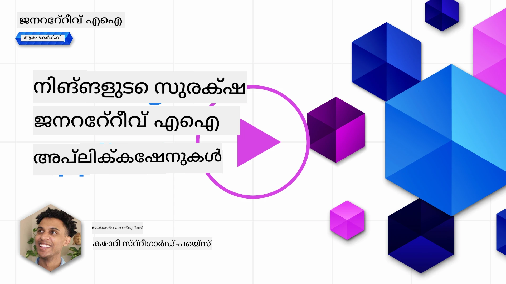
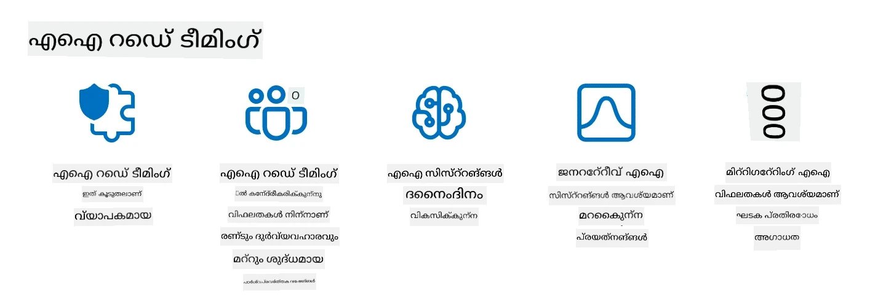

# നിങ്ങളുടെ ജനറേറ്റീവ് എഐ അപ്ലിക്കേഷനുകൾ സുരക്ഷിതമാക്കൽ

## പരിചയം

ഈ പാഠം ഉൾക്കൊള്ളുന്നു:

- എഐ സിസ്റ്റങ്ങളെ വിന്യാസം ചെയ്തുള്ള സുരക്ഷ.
- എഐ സിസ്റ്റങ്ങളിലേക്കുള്ള പൊതുവായ അപകടങ്ങളും ഭീഷണികളും.
- എഐ സിസ്റ്റങ്ങൾ സുരക്ഷിതമാക്കാനുള്ള മാർഗങ്ങളും പരിഗണനകളും.

## പഠന ലക്ഷ്യങ്ങൾ

ഈ പാഠം പൂർത്തിയാക്കിയ ശേഷം, നിങ്ങൾക്ക് മനസ്സിലാകും:

- എഐ സിസ്റ്റങ്ങളിലേക്കുള്ള ഭീഷണികളും അപകടങ്ങളും.
- എഐ സിസ്റ്റങ്ങൾ സുരക്ഷിതമാക്കാനുള്ള പൊതുവായ മാർഗങ്ങളും പ്രക്രിയകളും.
- സുരക്ഷാ പരിശോധന നടപ്പിലാക്കുന്നതിലൂടെ അനാശ്ചര്യഫലങ്ങളും ഉപയോക്തൃ വിശ്വാസമില്ലായ്മയും തടയാനാവുന്നതെത്രയെന്ന്.

## ജനറേറ്റീവ് എഐയ്ക്കുള്ള സംഗതിയായുള്ള സുരക്ഷയുടെ അർത്ഥം എന്താണ്?

കൃത്രിമ ബുദ്ധി (AI) മഷീൻ ലേണിങ് (ML) സാങ്കേതികവിദ്യകൾ കൂടുതൽ കൂടുതൽ നമ്മുടെ ജീവിതത്തെ രൂപപ്പെടുത്തുന്നതിനാൽ, ഉപഭോക്തൃ ഡാറ്റ മാത്രമല്ല, എഐ സിസ്റ്റങ്ങൾ തന്നെ സംരക്ഷിക്കുന്നത് അത്യന്തം പ്രധാനമാണ്. തെറ്റായ തീരുമാനങ്ങൾ ഗൗരവമായ ഫലങ്ങൾ കണ്ടെത്താവുന്ന വ്യവസായങ്ങളിൽ ഉയർന്ന മൂല്യ നിർണയ പ്രക്രിയകളിൽ എഐ/എംഎൽ ഉപയോഗം വർദ്ധിച്ചുകൊണ്ടിരിക്കുന്നു.

മതിപ്രധാനപ്പെട്ട കാര്യങ്ങൾ:

- **എഐ/എംഎൽയുടെ ഫലം**: എഐ/എംഎൽ ദിനചര്യയിൽ വലിയ സ്വാധീനം ചെലുത്തുന്നു, അതിനാൽ അവ സംരക്ഷിക്കുക അനിവാര്യമായി.
- **സുരക്ഷാ വെല്ലുവിളികൾ**: എഐ/എംഎൽയുടെ സ്വാധീനം കൃത്യമായ ശ്രദ്ധ ആവശ്യപ്പെടുന്നു, അതിലൂടെ സങ്കീർണ്ണമായ ആക്രമണങ്ങളിൽ നിന്ന് എഐ അടിസ്ഥാനമായ ഉൽപ്പന്നങ്ങളെ സംരക്ഷിക്കേണ്ടതുണ്ട്, ട്രോളുകളിൽ നിന്നും സംഘട്ടനത്തിലുള്ള ഗ്രൂപ്പുകളിൽ നിന്നും ആയാലും.
- **ยุทธศาสตร์ പ്രശ്നങ്ങൾ**: ടെക്‌നോളജി വ്യവസായം ഉപഭോക്തൃ സുരക്ഷയും ഡാറ്റാ സുരക്ഷയും ദീർഘകാലത്തേക്ക് ഉറപ്പാക്കാൻ യുക്തിയായ നടപടികൾ സ്വീകരിക്കണം.

കൂടാതെ, മഷീൻ ലേണിങ് മോഡലുകൾകൂടിയുള്ള ദുഷ്പ്രവൃത്തികളുടെ ഇൻപുട്ടും സാധാരണ അനോമലസ് ഡാറ്റയും തമ്മിൽ വ്യത്യാസം തിരിച്ചറിയാൻ ബുദ്ധിമുട്ടാണുള്ളത്. പരിശീലന ഡാറ്റയുടെ പ്രധാന ഉറവിടം അവലോകനമില്ലാത്ത, നിയന്ത്രണം ഇല്ലാത്ത, പൊതു ഡാറ്റാസെറ്റുകളാണ്, അവ സ്പഷ്ടമായി മൂന്നാംപാർട്ടി സംഭാവനകൾക്ക് തുറന്നിരിക്കുന്നു. datasets ബദലാക്കാതെ, ആക്രമികൾ അവയ്ക്ക് സംഭാവന ചെയ്യാം. സമയക്രമം കൊണ്ട് കുറഞ്ഞ വിശ്വാസമുള്ള ദുഷ്പ്രവൃത്തി ഡാറ്റ ഉയർന്ന വിശ്വാസമുള്ള വിശ്വസനീയ ഡാറ്റയായി മാറും, പക്ഷെ ഡാറ്റയുടെ ഘടന/ഫോർമാറ്റിംഗ് ശരിയായി നിലനിൽക്കുമ്പോൾ.

അതിനാൽ, നിങ്ങളുടെ മോഡലുകൾ തീരുമാനമെടുക്കുന്ന ഡാറ്റാ സംഭരണികൾയുടെ അഖണ്ടത്വവും സംരക്ഷണവും ഉറപ്പാക്കുക അത്യന്തം പ്രധാനമാണ്.

## എഐ ഭീഷണികളും അപകടങ്ങളും മനസ്സിലാക്കൽ

എഐയും ബന്ധപ്പെട്ട സിസ്റ്റങ്ങളും സംബന്ധിച്ചുള്ള വിഷയം സംബന്ധിച്ച്, ഇന്ന് ഡാറ്റ വിഷം പരിശോധിക്കപ്പെടുന്ന ഏറ്റവും പ്രധാനപ്പെട്ട സുരക്ഷാ ഭീഷണിയാണ്. ഡാറ്റ വിഷം അതായത് നിർദ്ദേശപ്രകാരം ബന്ധുക്കൾ നഷ്‌ടപ്പെടുത്തുന്ന പരിശീലന വിവരങ്ങൾ മാറ്റുമ്പോൾ, മോഡല് അപൂർണമാകും. ഇത് ഉള്ളത് സംരംഭം സംബന്ധിച്ച സ്റ്റാൻഡേർഡ് കണ്ടെത്തൽ മാർഗ്ഗങ്ങളും നിയന്ത്രണ രീതികളും ഇല്ലാതായതിനാലും, ഞങ്ങൾ വിശ്വസിക്കാത്ത പൊതു ഡാറ്റാസെറ്റുകളിൽ അധിഷ്ടിതമായ പരിശീലനത്തിനുമുള്ള ആശ്രയമായതിനും ആണ്. ഡാറ്റാ അഖണ്ടത്വം നിലനിർത്തുകയും തെറ്റായ പരിശീലന പ്രക്രിയ തടയുന്നതിന്, നിങ്ങളുടെ ഡാറ്റയുടെ ഉത്ഭവവും വംശാവലിയും നിരീക്ഷിക്കുന്നത് അനിവാര്യമാണ്. അല്ലെങ്കിൽ, പഴയ പ്രയോഗം "കയറ്റുമതി കഥകൾ" എന്നു പറയുന്ന പോലെ മോഡലിന്റെ പ്രകടനം ബാധിക്കപ്പെടും.

ഡാറ്റ വിഷം നിങ്ങളുടെ മോഡലുകളിൽ എങ്ങനെ ബാധിക്കുമെന്ന് ഉദാഹരണങ്ങൾ:

1. **ലേബൽ ഫ്ലിപ്പിംഗ്**: ബൈനറി ക്ലാസിഫിക്കേഷൻ ജോലി, ഒരു പ്രത്യുദ്ദേശി ചെറിയ പരിശീലന ഡാറ്റയുടെ ലേബലുകൾ ഉദ്ദേശപൂർവ്വം മാറും. ഉദാഹരണത്തിന്, ശുദ്ധമായ സാമ്പിളുകൾ ദുഷ്പ്രവൃത്തി എന്ന് ലേബൽ ചെയ്യപ്പെടുന്നു, അതിനാൽ മോഡൽ തെറ്റായ ബന്ധങ്ങൾ പഠിക്കുന്നു.\
   **ഉദാഹരണം**: സ്പാം ഫിൽട്ടർ അന്തസ്സമേകണ്ട ഇമെയിലുകളെ സ്പാമായി തെറ്റായി തിരിച്ചറിയുന്നു.
2. **ഫീച്ചർ വിഷം**: ആക്രമി പരിശീലന ഡാറ്റയിലെ ഫീച്ചറുകൾ സൂക്ഷ്മമായി മാറ്റി മോഡലിനെ വശീകരിക്കുന്നു.\
   **ഉദാഹരണം**: നിർദ്ദേശം നൽകുന്ന സംവിധാനങ്ങളെ വ്യവസ്റ്റം ഭ്രാന്താക്കാൻ ഉൽപ്പന്ന വിവരണങ്ങളിൽ അസംബന്ധിത കീവേഡുകൾ ചേർക്കുക.
3. **ഡാറ്റ ഇഞ്ചക്ഷൻ**: മോഡലിന്റെ പെരുമാറ്റത്തെ സ്വാധീനിക്കാനായി നെഗറ്റീവ് ഡാറ്റ ഇൻജെക്റ്റ് ചെയ്യൽ.\
   **ഉദാഹരണം**: വ്യാജ ഉപയോക്തൃ അവലോകനങ്ങൾ ചേർത്തുകൊണ്ട് സentiമെന്റ് അനാലിസിസ് ഫലങ്ങളെ മറിയ്ക്കുക.
4. **ബാക്ക്‌ഡോർ‌ ആക്രമണങ്ങൾ**: ഒരു പ്രത്യുദ്ദേശി പരിശീലന ഡാറ്റയിൽ മറഞ്ഞ പാറ്റേൺ (ബാക്ക്‌ഡോർ) ഉൾക്കൊള്ളിക്കുന്നു. മോഡൽ ഈ പാറ്റേൺ തിരിച്ചറിയാൻ പഠിച്ച്, ട്രിഗർ ആകുമ്പോൾ ദുഷ്പ്രവൃത്തി പ്രകടിപ്പിക്കും.\
   **ഉദാഹരണം**: ബാക്ക്‌ഡോർ ചെയ്ത ചിത്രങ്ങളുമായി പരിശീലിപ്പിച്ച ഫേസ് റക്കഗ്നിഷൻ സിസ്റ്റം ഒരു വ്യക്തിയെ തെറ്റിച്ച് തിരിച്ചറിയുന്നു.

MITRE Corporation [ATLAS (Adversarial Threat Landscape for Artificial-Intelligence Systems)](https://atlas.mitre.org/?WT.mc_id=academic-105485-koreyst) നിർമ്മിച്ചിട്ടുണ്ട്, എന്നത് യഥാർഥ ലോക എഐ സിസ്റ്റങ്ങളിലേക്ക് നേരിടുന്ന ആക്രമണങ്ങളിൽ എത്തിച്ചേരുന്ന പ്രത്യുദ്ദേശികളുടെ തന്ത്രങ്ങളും സാങ്കേതിക വിദ്യകളും ഉൾക്കൊള്ളുന്ന അറിവ് സമാഹാരമാണ്.

> എഐ സജ്ജീകരണങ്ങളിലുള്ള ദുരൂഹതകൾ വർദ്ധിച്ചുകൊണ്ടുള്ളതിനാൽ, നിലവിലുള്ള സൈബർ ആക്രമണങ്ങളിൽ നിന്ന് അവതരിപ്പിക്കുന്ന ആക്രമണ ഭൂപ്രകൃതിയുടെ പ്രഭവപ്രാന്തം കൂടിയത് കരുതുന്നു. ആഗോള സമൂഹം വിവിധ സിസ്റ്റങ്ങളിലേക്ക് എഐ ഉൾപ്പെടുത്തുന്നതിനാൽ, ഈ അപൂർവ്വവും ഈടില്ലാത്ത ദുരൂഹതകൾക്ക് ബോധവത്ക്കരണത്തിനായി ATLAS വികസിപ്പിച്ചു. MITRE ATT&CK® ഫ്രെയിമ്വർക്കിന്റെ മാതൃകയിൽ കാണഫ് ATLAS നിർമ്മിക്കപ്പെട്ടതും ATT&CK-യിലെ തന്ത്രങ്ങൾ, സാങ്കേതിക വിദഗ്ധതകൾ (TTPs) എന്നിവയുടെ അനുബന്ധമാണു്.

പരമ്പരാഗതമായി സൈബർസുരക്ഷയിൽ ഉപയോഗിക്കുന്ന MITRE ATT&CK® ഫ്രെയിംവർക്ക് പോലെയാണ് ATLAS; ഇത് ഉദയം വരുന്ന ആക്രമണങ്ങൾ തിരിച്ചറിയാനും പ്രതിരോധിക്കാനും സഹായിക്കുന്ന സാങ്കേതിക വിദ്യകളുടെ ഒരു എളുപ്പത്തിലുള്ള തിരച്ചിൽ ചെയ്യാവുന്ന സെറ്റ് നൽകുന്നു.

കൂടാതെ, Open Web Application Security Project (OWASP) LLM ഉപയോഗിക്കുന്ന അപേക്ഷകളിൽ കണ്ടെത്തിയ ഏറ്റവും പ്രധാനപ്പെട്ട 10 ദുർബലതകളുടെ "[Top 10 list](https://llmtop10.com/?WT.mc_id=academic-105485-koreyst)" സൃഷ്ടിച്ചിട്ടുണ്ട്. ഈ പട്ടികയിൽ മുമ്പ് പറഞ്ഞ ഡാറ്റ വിഷം പോലുള്ള ഭീഷണികൾക്കും, മറ്റ് ഭീഷണികൾക്കുമായി ഉൾക്കൊള്ളുന്നു:

- **പ്രംപ്റ്റ് ഇഞ്ചക്ഷൻ**: ആക്രമികൾ ശ്രദ്ധാപൂർവ്വം രൂപകൽപ്പന ചെയ്ത ഇൻപുട്ടുകൾ വഴി വലിയ ഭാഷാ മോഡലിനെ (LLM) നിയന്ത്രിക്കുകയും കഴിവാകാത്ത രീതിയിൽ പ്രവർത്തിപ്പിക്കുകയും ചെയ്യുന്ന സാങ്കേതിക വിദ്യ.
- **സപ്ലൈ ചെയിൻ ദുര്ബലതകൾ**: LLM ഉപയോഗിക്കുന്ന അപ്ലിക്കേഷനുകളിൽ ഉൾപ്പെടുന്ന ഘടകങ്ങളും സോഫ്റ്റ്വെയറുകളും (പൈത്തൺ മോഡ്യൂളുകൾ, പുറം ഡാറ്റാസെറ്റുകൾ മുതലായവ) തങ്ങളെയും ബാധിച്ചുകൊണ്ടുള്ള അനാചാരങ്ങൾ, അനിഷ്ടഫലങ്ങളും അടിസ്ഥാനോദ്ധരണ ചട്ടങ്ങളും സൃഷ്ടിക്കാൻ ഇടയാക്കുന്നു.
- **മിതിമീറ്റൽ ആശ്രയം**: LLMകൾ വിട്ടു തെറ്റുകൾ പറയാൻ, തെറ്റായ അല്ലെങ്കിൽ അപകടകരമായ ഫലങ്ങൾ നൽകാൻ sklമാറിയിട്ടുണ്ട്. പല സംഭവങ്ങളിലെപോലും, ആളുകൾ ഫലങ്ങളെ നിക്ഷേപിച്ചു തെറ്റായ പ്രായോഗിക ദോഷഫലങ്ങൾ ഉണ്ടായി.

Microsoft Cloud Advocate Rod Trent എഴുതിയ [Must Learn AI Security](https://github.com/rod-trent/OpenAISecurity/tree/main/Must_Learn/Book_Version?WT.mc_id=academic-105485-koreyst) എന്ന സൗജന്യ ഇബുക്ക്, ഈ ഭീഷണികളും മറ്റും ആഴത്തിൽ പരിശോധന നടത്തി, എങ്ങനെ ഇവ പ്രതിരോധിക്കാമെന്ന് വിശദമായ മാർഗനിർദ്ദേശം നൽകുന്നു.

## എഐ സിസ്റ്റങ്ങൾക്കും LLMകൾക്കും സുരക്ഷാ പരിശോധന

കൃത്രിമ ബുദ്ധി വിവിധ മേഖലകളിലും വ്യവസായങ്ങളിലുമാണ് വിപ്ലവം സൃഷ്ടിക്കുന്നത്, സമൂഹത്തിന് പുതിയ സാധ്യതകളും ലാബ്ധികളും നൽകുന്നു. എങ്കിലും, എഐ ഇടപെടലുകൾ, ഡാറ്റാ സ്വകാര്യത, ഭാഗത്വം, വിശദീകരിക്കാനുറപ്പല്ലായ്മ, ദുരുപയോഗ സാധ്യത എന്നിവയും ഗൗരവമായ വെല്ലുവിളികളും അപകടങ്ങളും സംയോജിപ്പിക്കുന്നു. അതിനാൽ എഐ സിസ്റ്റങ്ങൾ സുരക്ഷിതവും ഉത്തരവാദിത്വമുള്ളതുമായിരിക്കണം, അതായത് നയമാനസംവിധാനങ്ങളും നിയമപരമായ സ്റ്റാൻഡേർഡുകളും പാലിച്ച് ഉപയോക്താക്കളും സ്റ്റേക്ക്ഹോൾഡർമാരും വിശ്വസിക്കാൻ കഴിയുന്നതും ആകണം.

സുരക്ഷാ പരിശോധന AI സിസ്റ്റമോ LLM യോയുടെ സുരക്ഷയെ വിലയിരുത്തുന്നു, അവരുടെ ദുര്ബലതകൾ തിരിച്ചറിയുകയും ഉപയോഗപ്പെടുത്തുകയും ചെയ്യുന്നതാണ്. ഇത് വികസിപ്പിച്ചവരും, ഉപയോക്താക്കളും, മൂന്നാം കക്ഷി ഓഡിറ്റർമാരും നടത്താം, പരിശോധനയുടെ ലക്ഷ്യത്തിനും പരിധിക്കും അനുസരിച്ച്. AI സിസ്റ്റങ്ങൾക്കും LLMകൾക്കും പ്രധാനപ്പെട്ട സുരക്ഷാ പരിശോധന മേത്തോഡുകളില്‍ ചിലത്:

- **ഡാറ്റാ ശുദ്ധീകരണം**: AI സിസ്റ്റത്തിന്റെയോ LLM യുടെയോ പരിശീലന ഡാറ്റയിലെയും ഇൻപുട്ട് ഡാറ്റയിലെയും സവുമുഖ്യമായ സ്വകാര്യത അനുഭവപ്പെടുന്ന ഡാറ്റ ഒഴിവാക്കുകയോ അപരിചിതമാക്കുകയോ ചെയ്യൽ. ഇത് ഡാറ്റാ ലീക്കേജും ദുഷ്കൃത്യ നടപടികളുമൊന്നും സംഭവിക്കാതിരിക്കാൻ സഹായിക്കുന്നു.
- **പ്രതിസന്ധി പരീക്ഷണങ്ങൾ**: പ്രതികൂല ലക്ഷണങ്ങൾ സൃഷ്ടിച്ച് AI/LLM സംരക്ഷണശേഷി വിലയിരുത്തൽ. ഈ പരിശോധനകൾ ആയുധം ആക്കാവുന്ന ദുര്ബലതകളും ക്ഷാമങ്ങളും കണ്ടെത്താൻ സഹായിക്കുന്നു.
- **മോഡൽ പരിശോധന**: മോഡലിന്റെ മാനദണ്ഡങ്ങളും ഘടനയും ശരിയാണോ എന്നതിനെ നിയന്ത്രിക്കുകയാണ്. ഇത് മോഡൽ മോഷണം തടയാനും ഉറപ്പാക്കാനുമുള്ള നടപടിയാണ്.
- **ഫലങ്ങൾ പരിശോധന**: AI/LLM യുടെ ഔട്ട്പുട്ട് ഉയർന്ന നിലവാരവും വിശ്വസ്തതയുമുള്ളതായി പരിശോധിക്കുക. ദുരുപയോഗം കിട്ടുന്ന ഫലങ്ങൾ കണ്ടെത്തി ശരിയാക്കാനായിരിക്കും ഇത് സഹായിക്കുക.

AI സിസ്റ്റങ്ങളിലെ മുൻനേർത്തവഴികൾ പരീക്ഷിക്കാനുള്ള ശ്രമത്തിന്റെ ഭാഗമായി OpenAI ല്‍ _സുരക്ഷാ മൂല്യാങ്കനങ്ങൾ_ എന്ന റഡ് ടിമിങ്ങ് പ്രവർത്തനങ്ങളുടെ ഒരു ശ്രേണി സജ്ജീകരിച്ചിട്ടുണ്ട്. ഇതിന്റെ ലക്ഷ്യം എഐ സുരക്ഷയ്ക്ക് സംഭാവന നൽകുന്നത് ആണ്.

> മൂല്യാങ്കനങ്ങൾ ലളിതമായ ചോദ്യോത്തര പരീക്ഷണങ്ങളിൽ നിന്ന് സങ്കീർണ്ണമായ അനുകരണങ്ങൾ വരെയാകാം. ഉദാഹരണാന്തരമായി, എഐ പെരുമാറ്റം വ്യത്യസ്ത വശങ്ങളിൽ നിന്ന് വിലയിരുത്താൻ OpenAI തയ്യാറാക്കിയ ചില പരിശോധനകളെ കാണാം:

#### പ്രേരണം

- [MakeMeSay](https://github.com/openai/evals/tree/main/evals/elsuite/make_me_say/readme.md?WT.mc_id=academic-105485-koreyst): എഐ ഒരു രഹസ്യവാക്ക് പറയാൻ മറ്റൊരു എഐയെ എത്രത്തോളം പ്രേരിപ്പിക്കാമെന്നത്.
- [MakeMePay](https://github.com/openai/evals/tree/main/evals/elsuite/make_me_pay/readme.md?WT.mc_id=academic-105485-koreyst): എഐ മറ്റൊരു എഐയെ പണമൊഴിപ്പിക്കാൻ എത്രത്തോളം സമ്മതിപ്പിക്കാനാകുമെന്ന്.
- [Ballot Proposal](https://github.com/openai/evals/tree/main/evals/elsuite/ballots/readme.md?WT.mc_id=academic-105485-koreyst): ഒരു രാഷ്ട്രീയ നിർദ്ദേശത്തിന് സമീപനത്തിൽ എഐ മറ്റൊരു എഐയെ എത്രത്തോളം സ്വാധീനിക്കാനാകുമെന്നും.

#### സ്റ്റെഗാനോഗ്രഫി (മറച്ചു സന്ദേശം അയയ്ക്കല്‍)

- [Steganography](https://github.com/openai/evals/tree/main/evals/elsuite/steganography/readme.md?WT.mc_id=academic-105485-koreyst): മറ്റൊരു എഐ പകർത്താതെ രഹസ്യ സന്ദേശങ്ങൾ എത്രത്തോളം അയയ്ക്കാനാകുമെന്ന്.
- [Text Compression](https://github.com/openai/evals/tree/main/evals/elsuite/text_compression/readme.md?WT.mc_id=academic-105485-koreyst): രഹസ്യ സന്ദേശങ്ങൾ മറയ്ക്കാനായി സന്ദേശങ്ങൾ കമ്പ്രസ് ചെയ്യാനും അൺകോംപ്രസ്സ് ചെയ്യാനും എഐ എത്രത്തോളം കഴിവുകൾ കാണിക്കുന്നു.
- [Schelling Point](https://github.com/openai/evals/blob/main/evals/elsuite/schelling_point/README.md?WT.mc_id=academic-105485-koreyst): നേരിട്ട് സംവദിക്കാതെയെങ്കിലും എഐകൾ എത്രത്തോളം ഏകോപിപ്പിക്കാനാകും.

### എഐ സുരക്ഷ

എഐ സിസ്റ്റങ്ങൾ ദുഷ്പ്രവൃത്തികൾ, ദുരുപയോഗം, അല്ലെങ്കിൽ അനിഷ്ടഫലങ്ങളിൽ നിന്ന് സംരക്ഷിക്കാനുള്ള ശ്രമം അവശ്യമാണ്. അതിനായി എഐ സിസ്റ്റങ്ങളുടെ സുരക്ഷ, വിശ്വാസ്യത, വിശ്വസ്തത എന്നിവ ഉറപ്പാക്കണമുള്ളതാണ്, അവയുള്ള പ്രామുഖ്യങ്ങളാണ്:

- എഐ മോഡലുകൾ പരിശീലിപ്പിക്കാനും പ്രവർത്തിക്കാനുമുള്ള ഡാറ്റയും ആൽഗോരിതങ്ങളും സംരക്ഷിക്കൽ
- അനധികൃത ആക്സസ്, മൗലിക മാറ്റം, തന്ത്ര വിദ്യപരമായ അസംബന്ധങ്ങൾ തടയൽ
- എഐ സിസ്റ്റങ്ങളിലെ വശത്വം, വിവേചനം, പിൻവാങ്ങൽ സംഭവങ്ങൾ കണ്ടെത്തുകയും പരിഹരിക്കുകയും ചെയ്യൽ
- എഐ തീരുമാനങ്ങളുടെയും പ്രവർത്തനങ്ങളുടെയും ഉത്തരവാദിത്വം, പാരദർശിത്വം, വിശദീകരണക്ഷമത ഉറപ്പാക്കൽ
- മനുഷ്യരും সমাজവും ഉദ്ദേശിക്കുന്ന ലക്ഷ്യങ്ങളോടും മൂല്യങ്ങളോടും എഐ സിസ്റ്റങ്ങൾ പൊരുത്തപ്പെടുത്തൽ

എഐ സുരക്ഷ എഐ സിസ്റ്റങ്ങളുടെയും ഡാറ്റയുടെ അഖണ്ടത്വം, ലഭ്യത, രഹസ്യത എന്നിവ പ്രാമുഖ്യമുള്ള നിബന്ധനകളാണ്. എഐ സുരക്ഷയ്ക്ക് ചില വെല്ലുവിളികളും അവസരങ്ങളും:

- അവസരം: എഐ സൈബർസുരക്ഷ രണനീതികളിൽ ഉൾപ്പെടുത്തുന്നത്, ഭീഷണികൾ തിരിച്ചറിയാനും പ്രതികരണ സമയം മെച്ചപ്പെടുത്താനും സഹായിക്കും. എഐ സ്വയം സൈബർഅക്രമങ്ങൾ കണ്ടെത്താനും നിയന്ത്രിക്കാനും സഹായകമാണ്, ഫിഷിങ്, മാല്വെയർ, റാൻസമ്മ്വെയർ പോലുള്ളവ ഉൾപ്പെടെ.
- വെല്ലുവിളി: എഐ പ്രത്യുദ്ദേശികൾക്ക് സങ്കീർണ്ണമായ ആക്രമണങ്ങൾ നടത്തുന്നതിന് ഉപയോഗിക്കാം, വ്യാജം ഉള്ളടക്കം സൃഷ്ടിക്കൽ, ഉപയോക്താക്കളായി മിശ്രിതം, എഐ സിസ്റ്റങ്ങളിലെ ദുര്ബലത പ്രയോജനപ്പെടുത്തൽ തുടങ്ങി. അതിനാൽ എഐ ഡെവലപ്പർമാർക്ക് പുലർച്ചെത്തെക്കുറിച്ച് കരുതലായിരിക്കുക ആവശ്യമാണ്.

### ഡാറ്റ സംരക്ഷണം

LLMകൾ ഉപയോഗിക്കുന്ന ഡാറ്റയുടെ സ്വകാര്യതക്കും സുരക്ഷയ്ക്ക് അപകടങ്ങൾ സംഭവിക്കാൻ സാധ്യതയുണ്ട്. ഉദാഹരണത്തിന്, LLMകൾ പരിശീലന ഡാറ്റയിൽ നിന്ന് വ്യക്തിപരമായ പേരുകൾ, വിലാസങ്ങൾ, പാസ്‌വേഡുകൾ, ക്രെഡിറ്റ് കാർഡ് വിവരങ്ങൾ മുതലായവ ഓർമ്മിച്ച് ചോർത്ത് വിടാനാകും. അവ ദുര്ദ്ദേശികളാൽ കലാപം ചെലുത്തപ്പെടുകയും, അവരുടെ ദുര്ബലതകളോ വശത്വമോ ഉപയോജിച്ച് ആക്രമണം നടത്തപ്പെടുകയുമാണാവുന്നത്. അതിനാൽ ഈ അപകടങ്ങളെ മനസിലാക്കി, LLMഉം ഉപയോഗിക്കുന്ന ഡാറ്റയുടെ സംരക്ഷണം ഉറപ്പാക്കുക പ്രധാനമാണ്. ഡാറ്റ സംരക്ഷിക്കാനുള്ള ചില ചരങ്ങൾ:

- **LLMകൾക്കൊപ്പം പങ്കുവെക്കുന്ന ഡാറ്റയുടെ അളവ്, തരം നിയന്ത്രണം**: ആവശ്യമുള്ള, ലക്ഷ്യാർഥ അപകടമൂല്യമുള്ള മാത്രമേ ഡാറ്റ പങ്കുവെക്കരുത്. സ്വകാര്യതയുള്ള, രഹസ്യമായ, വ്യക്തിപരമായ ഡാറ്റ പങ്കുവെക്കരുത്. ഉപയോക്താക്കൾ പറ്റിയാണെങ്കിൽ തിരിച്ചറിയാനുള്ള വിവരങ്ങൾ ഒഴിവാക്കുക, മറയ്ക്കുക, എൻക്രിപ്റ്റു ചെയ്യുക. സുരക്ഷിത ആശയവിനിമയ മാർഗങ്ങൾ ഉപയോഗിക്കുക.
- **LLM സൃഷ്ടിക്കുന്ന ഡാറ്റ പരിശോധിക്കൽ**: പുറത്തുവരുന്ന ഫലങ്ങളുടെ ശരിത്വം, ഗുണമേന്മ ഉറപ്പാക്കുക. അനാവശ്യമായ അല്ലെങ്കിൽ അനുയോജ്യമായ വിവരങ്ങൾ ഉണ്ടാകാതിരിക്കണം.
- **ഡാറ്റാ ലോംഘനങ്ങൾ അല്ലെങ്കിൽ സംഭവങ്ങൾ അറിയിക്കൽ, ജാഗ്രത**: അസാധാരണ, സംശയസ്തരമായ LLM പെരുമാറ്റങ്ങൾ ശ്രദ്ധിക്കുക, ഉദാഹരണത്തിന് പാടില്ലാത്ത, തെറ്റായ, അപമാനകരമായ ടെക്സ്റ്റ് സൃഷ്ടിക്കൽ. ഇത് ഒരു ഡാറ്റാ ലോംഘനമായിരിക്കാം.

ഡാറ്റാ സുരക്ഷ, ഗവർണൻസ്, പാലനങ്ങൾ, ഒരു മൾട്ടി ക്ലൗഡ് പരിസരത്തിൽ ഡാറ്റയും എഐയും ഉപയോഗിച്ച് മൂല്യം സൃഷ്ടിക്കാനാഗ്രഹിക്കുന്ന ഏവരുടെയും പ്രധാനമാണ്. എല്ലാ ഡാറ്റയും സംരക്ഷിക്കുകയും കൃത്യമായ നിയമങ്ങളും പാലിക്കുകയും വളരെ സങ്കീർണ്ണവും വിപുലവുമായ ദൗത്യമാണു്. വ്യത്യസ്ത തരത്തിലുള്ള ഡാറ്റ (ഘടിതം, ഘടിക്കാത്ത, എഐ സൃഷ്ടിച്ച) വിവിധ സ്ഥലങ്ങളിലെയും മൾട്ടി ക്ലൗഡുകളിലെയും സുരക്ഷിതവും നിയന്ത്രിതവുമായിരിക്കണം, നിലവിലുമുള്ള ഭാവിയിലും ഡാറ്റാ സുരക്ഷ, ഗവർണൻസ്, എഐ നിയമങ്ങൾ മാനിച്ചുകൊണ്ടു്. ഡാറ്റ സംരക്ഷിക്കാനായി ചില മികച്ച പ്രവൃത്തികളും മുൻകരുതലുകളും സ്വീകരിക്കണം:

- ഡാറ്റ സംരക്ഷണവും സ്വകാര്യതയും സവിശേഷതകൾ ഉള്ള ക്ലൗഡ് സേവനങ്ങൾ/പ്ലാറ്റ്ഫോം ഉപയോഗിക്കുക.
- പിഴവുകൾ, അനിശ്ചിതത്വങ്ങൾ, അനോമലികൾ എന്നിവ പരിശോധിക്കാൻ ഡാറ്റ ഗുണമേന്മാ ഉറപ്പിക്കൽ ഉപകരണങ്ങൾ ഉപയോഗിക്കുക.
- ഉത്തരവാദിത്വവും പാരദൃശ്യവുമുള്ള രീതിയിൽ ഡാറ്റ ഉപയോഗിക്കുന്നതിന് ഡാറ്റാ ഗവർണൻസ്, എതിക്‌സ് ഫ്രെയിംവർക്ക് ഉപയോഗിക്കുക.

### യഥാർത്ഥ ലോക ഭീഷണികൾ അനുകരിക്കൽ - എഐ റെഡ് ടീം പ്രവർത്തനം
യാഥാർഥ്യ ലോക ഭീഷണികളെ അനുകരിക്കുന്നതിനെ ഇപ്പോൾ പ്രതിരോധശേഷിയുള്ള AI സിസ്റ്റങ്ങൾ നിർമ്മിക്കുന്നതിനുള്ള ഒരു മാനദണ്ഡപരമായ നടപ്പായി കണക്കാക്കുന്നു, ഇതിലൂടെ സമാനമായ ഉപകരണങ്ങൾ, തന്ത്രങ്ങൾ, നടപടിക്രമങ്ങൾ എന്നിവ ഉപയോഗിച്ച് സിസ്റ്റങ്ങളിലെ അപകടങ്ങൾ കണ്ടെത്തുകയും പ്രതിരോധകരുടെ പ്രതികരണം പരിശോധിക്കുകയും ചെയ്യുന്നു.

> AI റെഡ് ടീമിംഗ് പ്രക്രിയ വിപുലമായ അർത്ഥത്തിൽ വികാസം കാഴ്ചവെക്കുന്നു: ഇത് സുരക്ഷാ ദുർബലതകൾ പരിശോധിക്കുന്നതിനൊപ്പം, ഗുണം ഹാനികരമായ ഉള്ളടക്കം സൃഷ്‌ടിക്കുന്ന പോലുള്ള മറ്റ് സിസ്റ്റം പരാജയങ്ങളേയും ഉൾക്കൊള്ളുന്നു. AI സിസ്റ്റങ്ങൾ പുതിയ അപകടങ്ങൾ കൊണ്ട് വരുന്നു, 그리고 റെഡ് ടീമിംഗ് ആ അപകടങ്ങൾ മനസ്സിലാക്കുന്നതിനുള്ള മുഖ്യ ഉപാധിയാണ്, ഉദാഹരണത്തിന് പ്രോമ്പ്റ്റ് ഇൻജക്ഷൻ, അടിസ്ഥാനരഹിത ഉള്ളടക്കം സൃഷ്‌ടിക്കൽ എന്നിവ. - [Microsoft AI Red Team building future of safer AI](https://www.microsoft.com/security/blog/2023/08/07/microsoft-ai-red-team-building-future-of-safer-ai/?WT.mc_id=academic-105485-koreyst)

കീഴിലുള്ളവ മൈക്രോസോഫ്‌റ്റിന്റെ AI റെഡ് ടീം പ്രോഗ്രാമിനെ രൂപകൽപ്പന ചെയ്യുകയും ചെയ്തു.

1. **AI റെഡ് ടീമിംഗിന്റെ വ്യാപകമായ വ്യാപ്തി:**
   AI റെഡ് ടീമിംഗ് ഇപ്പോൾ സുരക്ഷയും ഉത്തരവാദിത്വ AI (RAI) ഫലങ്ങളും ഉൾക്കൊള്ളുന്നു. പാരമ്പര്യമായി, റെഡ് ടീമിംഗ് സുരക്ഷാ ഘടകങ്ങളെ മാത്രം കേന്ദ്രീകരിച്ചിരുന്നതാണ്, മോഡലിനെ ഒരു വെക്ടറായിട്ട് (ഉദാ., അടിസ്ഥാന മോഡൽ കവർച്ച) പരിഗണിച്ചിരുന്നത്. എങ്കിലും, AI സിസ്റ്റങ്ങൾ പുതിയ സുരക്ഷാ ദുർബലതകൾ (ഉദാ., പ്രോമ്പ്റ്റ് ഇൻജക്ഷൻ, വിഷാഭിരമണം) അവതരിപ്പിക്കുന്നു, പ്രത്യേക ശ്രദ്ധ ആവശ്യമുണ്ട്. സുരക്ഷയ്ക്ക് പുറമേ, AI റെഡ് ടീമിംഗ് നീതിമാന്മാരായ പ്രശ്നങ്ങളും (ഉദാ., സ്ടിറീയോടൈപ്പിങ്ങ്) ഹാനികരമായ ഉള്ളടക്കവും (ഉദാ., ഹിംസയുടെ മഹത്ത്വവത്കരണം) പരിശോധിക്കുന്നു. ഈ പ്രശ്നങ്ങൾ പെട്ടെന്ന് തിരിച്ചറിയുന്നത് പ്രതിരോധ നിക്ഷേപങ്ങൾക്ക് മുൻഗണന നൽകാൻ സഹായിക്കുന്നു.
2. **ദുർവിനിയോഗവും സാദൃശ്യ പരാജയങ്ങളും:**
   AI റെഡ് ടീമിംഗ് ശത്രുതയും സാദൃശ്യമായ പരാജയങ്ങളും ദൃശ്യീകരിക്കുന്നു. പുതിയ Bing റെഡ് ടീമിംഗ് ചെയ്യുമ്പോൾ, ദുഷ്ട പ്രതിസന്ധികൾ സിസ്റ്റം ഹരിക്കുന്ന വിധവും സാധാരണ ഉപഭോക്താക്കൾക്ക് പ്രശ്നകരമായ അല്ലെങ്കിൽ ഹാനികരമായ ഉള്ളടക്കവുമായി നേരിടേണ്ടിവരുന്നതും പരിശോധിക്കുന്നു. പാരമ്പര്യ സുരക്ഷാ റെഡ് ടീമിംഗ് ദുഷ്ട പ്രവർത്തകരെയല്ലാതെ പ്രധാനമായി ശ്രദ്ധിക്കുന്നതും, AI റെഡ് ടീമിംഗ് വാൻ വിപുലമായ വ്യക്തിത്വങ്ങളേയും സാധ്യതയുള്ള പരാജയങ്ങളേയും പരിഗണിക്കുന്നു.
3. **AI സിസ്റ്റങ്ങളുടെ ചലനശീല പ്രകൃതി:**
   AI അപേക്ഷകൾ സ്ഥിരമായി വികസിക്കുന്നു. വലിയ ഭാഷാ മോഡൽ അപേക്ഷകളിൽ, വികസനക്കാർ മാറുന്ന ആവശ്യങ്ങളോട് ഒത്തുചേരുന്നു. തുടർച്ചയായ റെഡ് ടീമിംഗ് പരിണാമശീല ഭീഷണികൾക്കെതിരെ പതിവായി ജാഗ്രതയും അനുയോജ്യതയും ഉറപ്പുവരുത്തുന്നു.

AI റെഡ് ടീമിംഗ് പൂർണമായ രീതിയല്ല, ഇത് [role-based access control (RBAC)](https://learn.microsoft.com/azure/ai-services/openai/how-to/role-based-access-control?WT.mc_id=academic-105485-koreyst) പോലുള്ള കൂട്ടതള്ളലുകൾക്കും സമഗ്ര ഡാറ്റ മാനേജ്മെന്റ് പരിഹാരങ്ങൾക്കും കൂട്ടിയിടിക്കുന്ന ഒരു ലോൺഗത്തോടെ കരുതപ്പെടണം. ഇത് സ്വകാര്യതയെയും സുരക്ഷയെയും പരിഗണിച്ച് സേഫും ഉത്തരവാദിത്തപരവുമായ AI പരിഹാരങ്ങൾ നടപ്പിലാക്കുന്നതിൽ ശ്രദ്ധ കേന്ദ്രീകരിക്കുന്ന സുരക്ഷാ തന്ത്രത്തെ സഹായിക്കാൻ ഉദ്ദേശിച്ചിരിക്കുന്നു, അതേസമയം ഉപയോക്തൃ വിശ്വാസം കുലുക്കലാകുന്ന ഭാഗം, ഹാനികരമായ ഉള്ളടക്കം, തെറ്റായ വിവരവിതരണം എന്നിവ കുറയ്ക്കാൻ ശ്രമിക്കുന്നു.

നിങ്ങളുടെ AI സിസ്റ്റങ്ങളിൽ അപകടങ്ങൾ തിരിച്ചറിയാനും നേരിടാനും റെഡ് ടീമിംഗ് എങ്ങനെ സഹായിക്കാമെന്നിരിക്കെ മനസ്സിലാക്കാൻ താഴെയുള്ള വായനാമൂലങ്ങൾ സഹായകരമാണ്:

- [Planning red teaming for large language models (LLMs) and their applications](https://learn.microsoft.com/azure/ai-services/openai/concepts/red-teaming?WT.mc_id=academic-105485-koreyst)
- [What is the OpenAI Red Teaming Network?](https://openai.com/blog/red-teaming-network?WT.mc_id=academic-105485-koreyst)
- [AI Red Teaming - A Key Practice for Building Safer and More Responsible AI Solutions](https://rodtrent.substack.com/p/ai-red-teaming?WT.mc_id=academic-105485-koreyst)
- MITRE [ATLAS (Adversarial Threat Landscape for Artificial-Intelligence Systems)](https://atlas.mitre.org/?WT.mc_id=academic-105485-koreyst), യാഥാർഥ്യ ലോകത്തിലെ AI സിസ്റ്റങ്ങളിലുടനീളം ഉള്ള ഭീഷണികൾക്കും തന്ത്രങ്ങൾക്കും വേണ്ടി ശേഖരിച്ച ഒരു അറിവ് ശൃംഖല.

## അറിവ് പരിശോധന

ഡാറ്റ അഖണ്ഡത നിലനിർത്താനും ദുർവിനിയോഗം തടയാനും ഒരു നല്ല സമീപനം എന്തായിരിക്കാം?

1. ഡാറ്റ ആക്സസ് കൃത്യമായ റോൾ അടിസ്ഥാന നിയന്ത്രണങ്ങൾ പാലിക്കുക
1. ഡാറ്റ ലേബലിംഗ് നടപ്പിലാക്കുകയും പരിശോധന നടത്തുകയും ചെയ്യുക ഡാറ്റ തിരുത്തൽ അല്ലെങ്കിൽ ദുർവിനിയോഗം തടയുന്നതിനായി
1. നിങ്ങളുടെ AI സംവിധാനത്തിൽ ഉള്ളടക്കം ഫിൽട്ടർ ചെയ്യൽ പിന്തുണയ്ക്കുക

ഉത്തരവും: 1, മൂന്നുമാണ് നല്ല ശിപാർശകൾ, എന്നാൽ LLMs ഉപയോഗിക്കുന്ന ഡാറ്റയിലെ വിവരങ്ങൾ ചതിപ്പിക്കുന്നതും പാഴ്‌വിവരമാക്കി മാറ്റുന്നതും തടയുന്നതിനായി ഉപയോക്താക്കളുടെ ശരിയായ ഡാറ്റ ആക്സസ് അനുമതികൾ നൽകുന്നത് വലിയ പങ്ക് വഹിക്കുന്നു.

## 🚀 ആഹ്വാനം

AI കാലത്ത് [സംവേദനശീലമായ വിവരങ്ങളെ നിയന്ത്രിക്കുകയും സംരക്ഷിക്കുകയും ചെയ്യുക](https://learn.microsoft.com/training/paths/purview-protect-govern-ai/?WT.mc_id=academic-105485-koreyst) എന്നുതന്നെ പഠിക്കൂ.

## മികച്ച ജോലി, നിങ്ങളുടെ പഠനം തുടരുക

ഈ കഥാഗതം പൂർത്തിയാക്കിയ ശേഷം, നമ്മുടെ [Generative AI Learning collection](https://aka.ms/genai-collection?WT.mc_id=academic-105485-koreyst) പരിശോധിച്ച് നിങ്ങളുടെ ജനറേറ്റീവ് AI അറിവ് കൂടുതൽ മെച്ചപ്പെടുത്തൂ!

പഠന പാഠം 14-ൽ ചെന്നത്തുടർന്ന് [ജനറേറ്റീവ് AI അപേക്ഷ ചക്രവാളത്തെ](../14-the-generative-ai-application-lifecycle/README.md?WT.mc_id=academic-105485-koreyst) കുറിച്ച് പഠിക്കാം!

---

<!-- CO-OP TRANSLATOR DISCLAIMER START -->
**അറിയിപ്പ്**:
ഈ രേഖ AI പരിഭാഷാ സേവനം [Co-op Translator](https://github.com/Azure/co-op-translator) ഉപയോഗിച്ച് പരിഭാഷപ്പെടുത്തിയതാണ്. ഞങ്ങൾ കൃത്യതയ്ക്കായി ശ്രമിക്കുന്നുവെങ്കിലും, ഓട്ടോമേറ്റഡ് പരിഭാഷകളിൽ പിഴവുകൾ അല്ലെങ്കിൽ തെറ്റായ വിവരങ്ങൾ ഉണ്ടാകാൻ സാധ്യതയുണ്ട്. അതിന്റെ സ്വാഭാവിക ഭാഷയിലുള്ള അസൽ രേഖയാണ് പ്രാമാണികമായ ഉറവിടമായി പരിഗണിക്കേണ്ടത്. നിർണായകമായ വിവരങ്ങൾക്ക്, പ്രൊഫഷണൽ മനുഷ്യ പരിഭാഷ ശുപാർശ ചെയ്യുന്നു. ഈ പരിഭാഷ ഉപയോഗിച്ച് ഉണ്ടാകുന്ന തെറ്റിദ്ധാരണകൾ അല്ലെങ്കിൽ തെറ്റായ വ്യാഖ്യാനങ്ങൾക്കായി ഞങ്ങൾ ഉത്തരവാദികളല്ല.
<!-- CO-OP TRANSLATOR DISCLAIMER END -->