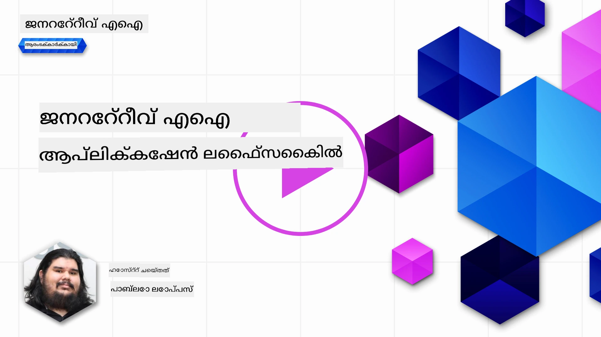
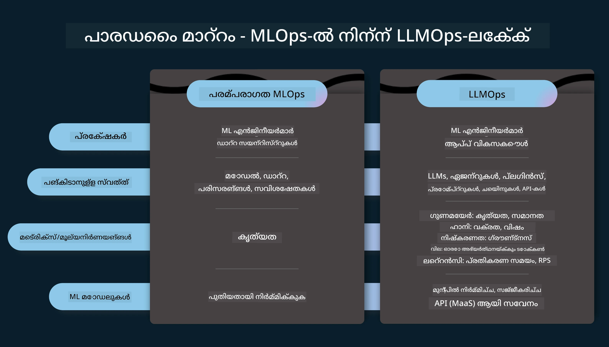
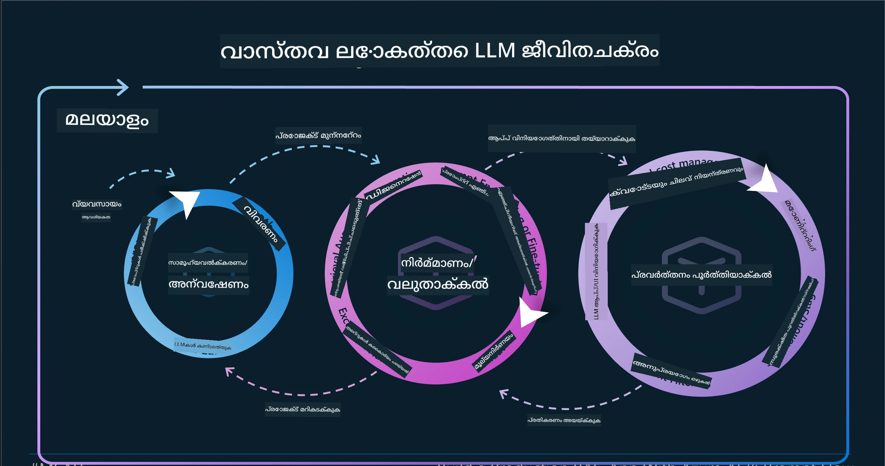
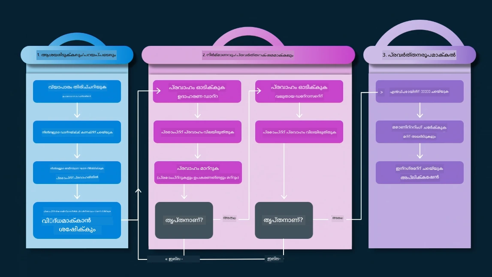
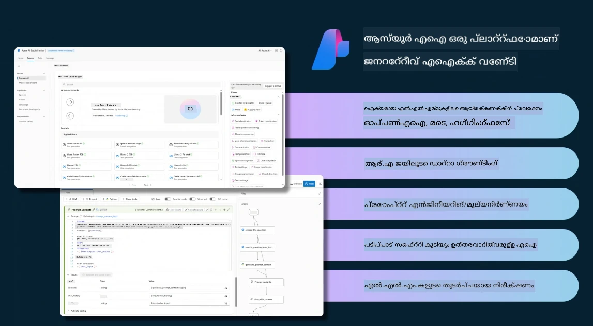
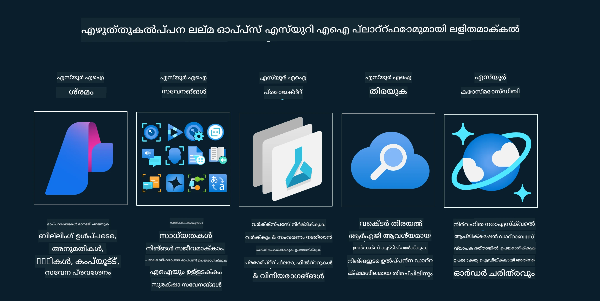
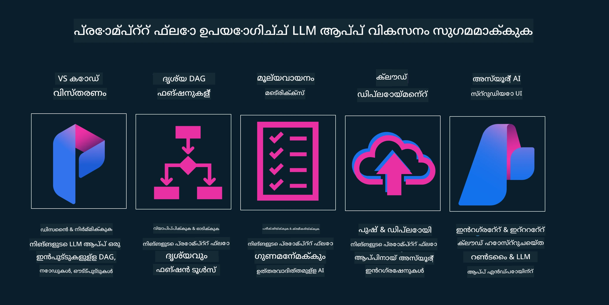

# ജനറേറ്റീവ് AI അപ്ലിക്കേഷൻ ലൈഫ്‌സൈക്കിൾ

എല്ലാ AI അപ്ലിക്കേഷനുകൾക്കും ഒരു പ്രധാന ചോദ്യമാണ് AI ഫീച്ചറുകളുടെ പ്രസക്തി, കാരണം AI ഒരു വേഗത്തിൽ വികസിക്കുന്ന മേഖലയാണ്, നിങ്ങളുടെ അപ്ലിക്കേഷൻ പ്രസക്തവും വിശ്വസനീയവും ശക്തവുമാകാൻ, നിങ്ങൾക്ക് അതിനെ തുടർച്ചയായി നിരീക്ഷിക്കാനും, വിലയിരുത്താനും, മെച്ചപ്പെടുത്താനും വേണം. ഇതാണ് ജനറേറ്റീവ് AI ലൈഫ്‌സൈക്കിൾ ആവശ്യമായത്.

ജനറേറ്റീവ് AI ലൈഫ്‌സൈക്കിൾ ഒരു ഫ്രെയിംവർക്ക് ആണ്, ഇത് ജനറേറ്റീവ് AI അപ്ലിക്കേഷൻ വികസിപ്പിക്കൽ, വിനിയോഗിക്കൽ, പരിപാലനം എന്നിവയുടെ ഘട്ടങ്ങളിലൂടെ നിങ്ങളെ നയിക്കുന്നു. ഇത് നിങ്ങളുടെ ലക്ഷ്യങ്ങൾ നിർവചിക്കാൻ, നിങ്ങളുടെ പ്രകടനം അളക്കാൻ, നിങ്ങളുടെ വെല്ലുവിളികൾ തിരിച്ചറിയാൻ, നിങ്ങളുടെ പരിഹാരങ്ങൾ നടപ്പിലാക്കാൻ സഹായിക്കുന്നു. കൂടാതെ, നിങ്ങളുടെ അപ്ലിക്കേഷൻ നിങ്ങളുടെ ഡൊമെയ്ൻ, സ്റ്റേക്ക്‌ഹോൾഡർമാർ എന്നിവരുടെ നൈതികവും നിയമപരവുമായ മാനദണ്ഡങ്ങളുമായി പൊരുത്തപ്പെടാൻ സഹായിക്കുന്നു. ജനറേറ്റീവ് AI ലൈഫ്‌സൈക്കിൾ പിന്തുടർന്ന്, നിങ്ങളുടെ അപ്ലിക്കേഷൻ എല്ലായ്പ്പോഴും മൂല്യം നൽകുകയും ഉപയോക്താക്കളെ സംതൃപ്തിപ്പെടുത്തുകയും ചെയ്യുമെന്ന് ഉറപ്പാക്കാം.

## പരിചയം

ഈ അധ്യായത്തിൽ, നിങ്ങൾ:

- MLOps-ൽ നിന്ന് LLMOps-ലേക്ക് പാരഡൈം മാറ്റം മനസ്സിലാക്കും
- LLM ലൈഫ്‌സൈക്കിൾ
- ലൈഫ്‌സൈക്കിൾ ടൂളിംഗ്
- ലൈഫ്‌സൈക്കിൾ മെട്രിഫിക്കേഷൻ, വിലയിരുത്തൽ

## MLOps-ൽ നിന്ന് LLMOps-ലേക്ക് പാരഡൈം മാറ്റം മനസ്സിലാക്കുക

LLMകൾ ആർട്ടിഫിഷ്യൽ ഇന്റലിജൻസ് ആയുധസമൂഹത്തിലെ പുതിയ ഉപകരണങ്ങളാണ്, അവ അപ്ലിക്കേഷനുകൾക്കായി വിശകലനവും സൃഷ്ടിയും ചെയ്യുന്ന കാര്യങ്ങളിൽ അത്യന്തം ശക്തവുമാണ്, എന്നാൽ ഈ ശക്തിക്ക് AIയും ക്ലാസിക് മെഷീൻ ലേണിങ്ങും streamline ചെയ്യുന്നതിൽ ചില ഫലങ്ങൾ ഉണ്ട്.

ഇതിനാൽ, ഈ ഉപകരണം ഡൈനാമിക് ആയി, ശരിയായ പ്രേരണകളോടെ അനുയോജ്യമായി ഉപയോഗിക്കാൻ ഒരു പുതിയ പാരഡൈം ആവശ്യമുണ്ട്. പഴയ AI അപ്ലിക്കേഷനുകൾ "ML Apps" എന്ന്, പുതിയ AI അപ്ലിക്കേഷനുകൾ "GenAI Apps" അല്ലെങ്കിൽ "AI Apps" എന്ന് വർഗ്ഗീകരിക്കാം, ആ സമയത്ത് ഉപയോഗിച്ചിരുന്ന പ്രധാന സാങ്കേതികവിദ്യകളും സാങ്കേതികങ്ങളും പ്രതിഫലിപ്പിക്കുന്നു. ഇത് നമ്മുടെ കഥ പറയൽ പലവിധത്തിൽ മാറ്റുന്നു, താഴെ കാണുന്ന താരതമ്യം നോക്കൂ.

LLMOps-ൽ, നാം അപ്ലിക്കേഷൻ ഡെവലപ്പർമാരിൽ കൂടുതൽ ശ്രദ്ധ കേന്ദ്രീകരിക്കുന്നു, ഇന്റഗ്രേഷനുകൾ പ്രധാനപ്പെട്ട പോയിന്റായി ഉപയോഗിക്കുന്നു, "Models-as-a-Service" ഉപയോഗിക്കുന്നു, മെട്രിക്‌സുകൾക്കായി താഴെ പറയുന്ന കാര്യങ്ങൾ ചിന്തിക്കുന്നു.

- ഗുണമേന്മ: പ്രതികരണ ഗുണമേന്മ
- ഹാനി: ഉത്തരവാദിത്വമുള്ള AI
- സത്യസന്ധത: പ്രതികരണത്തിന്റെ അടിസ്ഥാനസഹിതം (അർത്ഥമുണ്ടോ? ശരിയാണോ?)
- ചെലവ്: പരിഹാര ബജറ്റ്
- ലാറ്റൻസി: ടോക്കൺ പ്രതികരണത്തിന് ശരാശരി സമയം

## LLM ലൈഫ്‌സൈക്കിൾ

ആദ്യം, ലൈഫ്‌സൈക്കിൾയും മാറ്റങ്ങളും മനസ്സിലാക്കാൻ, അടുത്ത ഇൻഫോഗ്രാഫിക് ശ്രദ്ധിക്കുക.

നിങ്ങൾ ശ്രദ്ധിച്ചേക്കാം, ഇത് സാധാരണ MLOps ലൈഫ്‌സൈക്കിളുകളിൽ നിന്ന് വ്യത്യസ്തമാണ്. LLMകൾക്ക് പുതിയ ആവശ്യങ്ങൾ 많ുണ്ട്, ഉദാഹരണത്തിന് പ്രോംപ്റ്റിംഗ്, ഗുണമേന്മ മെച്ചപ്പെടുത്താനുള്ള വ്യത്യസ്ത സാങ്കേതികങ്ങൾ (ഫൈൻ-ട്യൂണിംഗ്, RAG, മെറ്റാ-പ്രോംപ്റ്റുകൾ), ഉത്തരവാദിത്വമുള്ള AI-യുമായി ബന്ധപ്പെട്ട വ്യത്യസ്ത വിലയിരുത്തലുകളും ഉത്തരവാദിത്വവും, ഒടുവിൽ പുതിയ വിലയിരുത്തൽ മെട്രിക്‌സുകൾ (ഗുണമേന്മ, ഹാനി, സത്യസന്ധത, ചെലവ്, ലാറ്റൻസി).

ഉദാഹരണത്തിന്, നാം എങ്ങനെ ആശയവിനിമയം നടത്തുന്നു എന്ന് നോക്കൂ. വിവിധ LLMകൾ ഉപയോഗിച്ച് പ്രോംപ്റ്റ് എഞ്ചിനീയറിംഗ് വഴി പരീക്ഷണങ്ങൾ നടത്തുന്നു, അവരുടെ ഹിപോത്തസിസ് ശരിയാകാമോ എന്ന് പരിശോധിക്കാൻ.

ഇത് ലീനിയർ അല്ല, എന്നാൽ സംയോജിത ലൂപ്പുകൾ, ആവർത്തനാത്മകവും ഒരു പൊതുവായ ചക്രവാളവുമാണ്.

ആ ഘട്ടങ്ങൾ എങ്ങനെ അന്വേഷിക്കാം? ഒരു ലൈഫ്‌സൈക്കിൾ എങ്ങനെ നിർമ്മിക്കാമെന്ന് വിശദമായി നോക്കാം.

ഇത് കുറച്ച് സങ്കീർണ്ണമായി തോന്നാം, ആദ്യം മൂന്ന് വലിയ ഘട്ടങ്ങളിൽ ശ്രദ്ധ കേന്ദ്രീകരിക്കാം.

1. ആശയവിനിമയം/അന്വേഷണം: ഇവിടെ നാം ബിസിനസ് ആവശ്യങ്ങൾ അനുസരിച്ച് അന്വേഷിക്കാം. പ്രോട്ടോടൈപ്പിംഗ്, [PromptFlow](https://microsoft.github.io/promptflow/index.html?WT.mc_id=academic-105485-koreyst) സൃഷ്ടിച്ച് നമ്മുടെ ഹിപോത്തസിസ് എഫിഷ്യന്റ് ആണോ എന്ന് പരീക്ഷിക്കുക.
1. നിർമ്മാണം/വികസനം: ഇപ്പോൾ, വലിയ ഡാറ്റാസെറ്റുകൾക്ക് വിലയിരുത്തൽ ആരംഭിച്ച് ഫൈൻ-ട്യൂണിംഗ്, RAG പോലുള്ള സാങ്കേതികങ്ങൾ നടപ്പിലാക്കി പരിഹാരത്തിന്റെ ശക്തി പരിശോധിക്കുക. ഇത് പര്യാപ്തമല്ലെങ്കിൽ, വീണ്ടും നടപ്പിലാക്കൽ, പുതിയ ഘട്ടങ്ങൾ ചേർക്കൽ, ഡാറ്റ പുനഃസംഘടിപ്പിക്കൽ എന്നിവ സഹായിക്കും. ഫ്ലോയും സ്കെയിലും പരീക്ഷിച്ച് മെട്രിക്‌സുകൾ പരിശോധിച്ച്, ഇത് പ്രവർത്തിക്കുന്നുവെങ്കിൽ അടുത്ത ഘട്ടത്തിന് തയ്യാറാണ്.
1. ഓപ്പറേഷനലൈസിംഗ്: ഇപ്പോൾ, മോണിറ്ററിംഗ്, അലർട്ട് സിസ്റ്റങ്ങൾ ചേർക്കൽ, വിനിയോഗം, അപ്ലിക്കേഷൻ ഇന്റഗ്രേഷൻ എന്നിവ നടത്തുക.

അതിനുശേഷം, സുരക്ഷ, അനുസരണം, ഗവർണൻസ് എന്നിവയിൽ ശ്രദ്ധ കേന്ദ്രീകരിച്ച് മാനേജ്മെന്റ് എന്ന പൊതുവായ ചക്രവാളം ഉണ്ട്.

അഭിനന്ദനങ്ങൾ, ഇപ്പോൾ നിങ്ങളുടെ AI അപ്ലിക്കേഷൻ പ്രവർത്തനക്ഷമമാണ്. പ്രായോഗിക അനുഭവത്തിനായി, [Contoso Chat ഡെമോ](https://nitya.github.io/contoso-chat/?WT.mc_id=academic-105485-koreys) നോക്കൂ.

ഇപ്പോൾ, ഏത് ടൂളുകൾ ഉപയോഗിക്കാം?

## ലൈഫ്‌സൈക്കിൾ ടൂളിംഗ്

ടൂളിംഗിനായി, Microsoft [Azure AI Platform](https://azure.microsoft.com/solutions/ai/?WT.mc_id=academic-105485-koreys)യും [PromptFlow](https://microsoft.github.io/promptflow/index.html?WT.mc_id=academic-105485-koreyst)യും നിങ്ങളുടെ ചക്രവാളം എളുപ്പത്തിൽ നടപ്പിലാക്കാനും തയ്യാറാക്കാനും സഹായിക്കുന്നു.

[Azure AI Platform](https://azure.microsoft.com/solutions/ai/?WT.mc_id=academic-105485-koreys) ഉപയോഗിച്ച് [AI Studio](https://ai.azure.com/?WT.mc_id=academic-105485-koreys) ഉപയോഗിക്കാം. AI Studio ഒരു വെബ് പോർട്ടലാണ്, മോഡലുകൾ, സാമ്പിളുകൾ, ടൂളുകൾ എന്നിവ അന്വേഷിക്കാൻ, നിങ്ങളുടെ റിസോഴ്‌സുകൾ മാനേജ് ചെയ്യാൻ, UI ഡെവലപ്പ്മെന്റ് ഫ്ലോകൾ, SDK/CLI ഓപ്ഷനുകൾ കോഡ്-ഫസ്റ്റ് ഡെവലപ്പ്മെന്റിനായി നൽകുന്നു.

Azure AI, നിങ്ങളുടെ ഓപ്പറേഷനുകൾ, സേവനങ്ങൾ, പ്രോജക്ടുകൾ, വെക്ടർ സെർച്ച്, ഡാറ്റാബേസ് ആവശ്യങ്ങൾ എന്നിവ മാനേജ് ചെയ്യാൻ നിരവധി റിസോഴ്‌സുകൾ ഉപയോഗിക്കാൻ അനുവദിക്കുന്നു.

Proof-of-Concept(POC) മുതൽ വലിയ സ്കെയിൽ അപ്ലിക്കേഷനുകൾ വരെ PromptFlow ഉപയോഗിച്ച് നിർമ്മിക്കുക:

- VS Code-ൽ നിന്ന് ആപ്ലിക്കേഷനുകൾ ഡിസൈൻ ചെയ്ത് നിർമ്മിക്കുക, ദൃശ്യവും പ്രവർത്തനപരവുമായ ടൂളുകൾ ഉപയോഗിച്ച്
- നിങ്ങളുടെ ആപ്ലിക്കേഷനുകൾ ഗുണമേന്മയുള്ള AI-ക്കായി എളുപ്പത്തിൽ പരീക്ഷിച്ച് ഫൈൻ-ട്യൂൺ ചെയ്യുക
- Azure AI Studio ഉപയോഗിച്ച് ക്ലൗഡുമായി ഇന്റഗ്രേറ്റ് ചെയ്ത് ആവർത്തിക്കുക, പുഷ് ചെയ്ത് വിനിയോഗിക്കുക

## മികച്ചത്! നിങ്ങളുടെ പഠനം തുടരുക!

അദ്ഭുതം, ഇപ്പോൾ [Contoso Chat App](https://nitya.github.io/contoso-chat/?WT.mc_id=academic-105485-koreyst) ഉപയോഗിച്ച് ആപ്ലിക്കേഷൻ ഘടന എങ്ങനെ ഉണ്ടാക്കാമെന്ന് പഠിക്കൂ, ക്ലൗഡ് അഡ്വക്കസി ആ ആശയങ്ങൾ പ്രദർശനങ്ങളിൽ എങ്ങനെ ചേർക്കുന്നു എന്ന് പരിശോധിക്കൂ. കൂടുതൽ ഉള്ളടക്കത്തിനായി, ഞങ്ങളുടെ [Ignite ബ്രേക്ക്ഔട്ട് സെഷൻ!](https://www.youtube.com/watch?v=DdOylyrTOWg) കാണുക.

ഇപ്പോൾ, പാഠം 15 നോക്കൂ, [Retrieval Augmented Generation and Vector Databases](../15-rag-and-vector-databases/README.md?WT.mc_id=academic-105485-koreyst) ജനറേറ്റീവ് AI-യെ എങ്ങനെ ബാധിക്കുന്നു എന്നും കൂടുതൽ ആകർഷകമായ അപ്ലിക്കേഷനുകൾ എങ്ങനെ ഉണ്ടാക്കാമെന്നും മനസ്സിലാക്കാൻ!

---

<!-- CO-OP TRANSLATOR DISCLAIMER START -->
**അസൂയാ**:  
ഈ രേഖ AI വിവർത്തന സേവനം [Co-op Translator](https://github.com/Azure/co-op-translator) ഉപയോഗിച്ച് വിവർത്തനം ചെയ്തതാണ്. നാം കൃത്യതയ്ക്ക് ശ്രമിച്ചിട്ടുണ്ടെങ്കിലും, സ്വയം പ്രവർത്തിക്കുന്ന വിവർത്തനങ്ങളിൽ പിശകുകൾ അല്ലെങ്കിൽ തെറ്റുകൾ ഉണ്ടാകാമെന്ന് ദയവായി ശ്രദ്ധിക്കുക. അതിന്റെ മാതൃഭാഷയിലുള്ള യഥാർത്ഥ രേഖയാണ് പ്രാമാണികമായ ഉറവിടം എന്ന് പരിഗണിക്കേണ്ടതാണ്. നിർണായകമായ വിവരങ്ങൾക്ക്, പ്രൊഫഷണൽ മനുഷ്യ വിവർത്തനം ശുപാർശ ചെയ്യപ്പെടുന്നു. ഈ വിവർത്തനം ഉപയോഗിക്കുന്നതിൽ നിന്നുണ്ടാകുന്ന ഏതെങ്കിലും തെറ്റിദ്ധാരണകൾക്കോ തെറ്റായ വ്യാഖ്യാനങ്ങൾക്കോ ഞങ്ങൾ ഉത്തരവാദികളല്ല.
<!-- CO-OP TRANSLATOR DISCLAIMER END -->