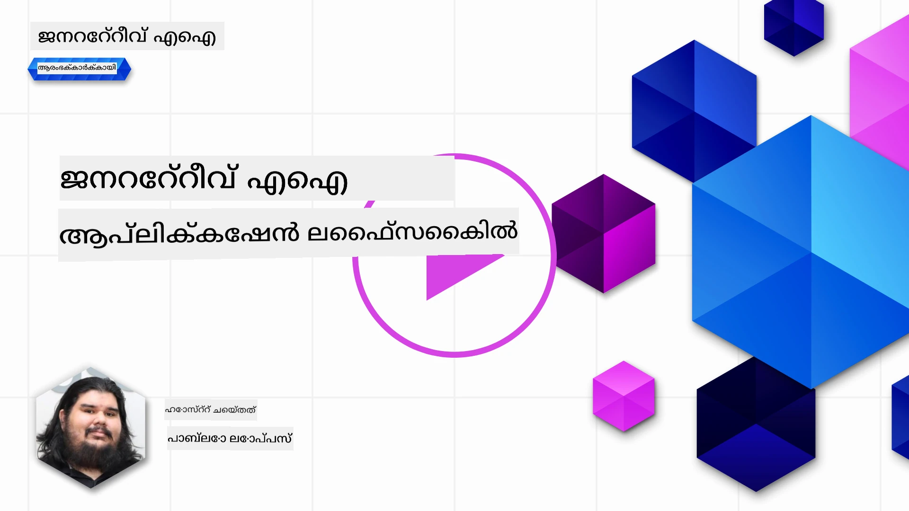
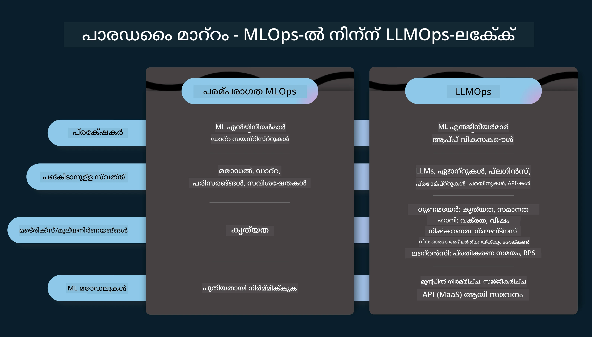
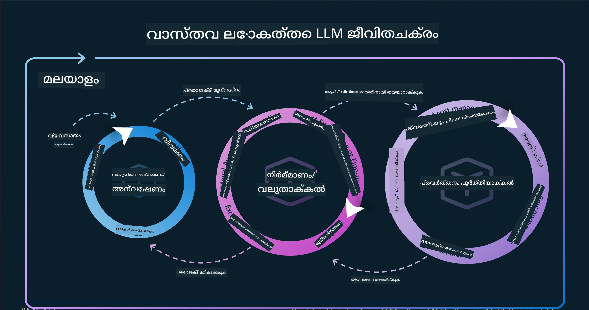
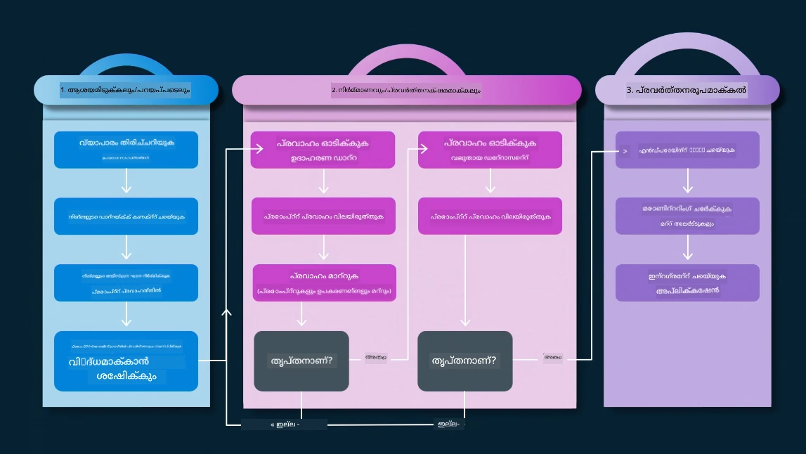
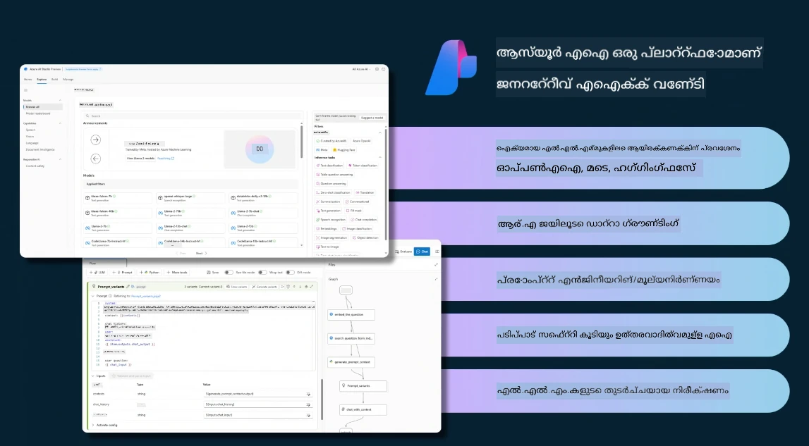
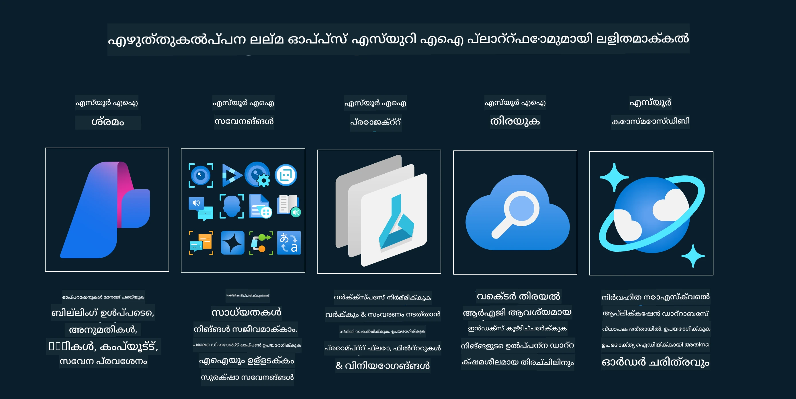
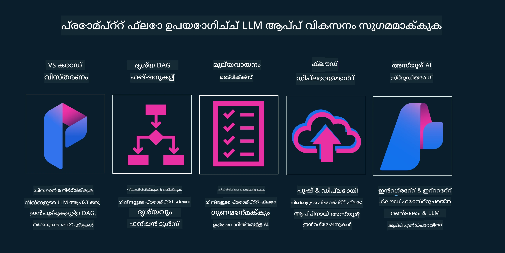

# ജനറേറ്റീവ് എഐ ആപ്ലിക്കേഷൻ ലൈഫ്സൈക്കിള്‍

എല്ലാ എഐ ആപ്ലിക്കേഷനുകൾക്കും പ്രധാനമായൊരു ചോദ്യം എഐ സവിശേഷതകളുടെ പ്രസക്തിയാണിത്, എഐ ഒരു വേഗത്തിൽ വളരുന്ന മേഖലയാണെന്നും, നിങ്ങളുടെ ആപ്ലിക്കേഷൻ പ്രസക്തവും വിശ്വസനീയവുമായിരിക്കാനുള്ള ഉറപ്പിനായി, തുടർച്ചയായി അതിനെ നിരീക്ഷിക്കുകയും, വിലയിരുത്തുകയും, മെച്ചപ്പെടുത്തുകയും ചെയ്യേണ്ടതുണ്ട്. ഇതാണ് ജനറേറ്റീവ് എഐ ലൈഫ്സൈക്കിള്‍ ഇതിന്റെ പ്രാധാന്യം.

ജനറേറ്റീവ് എഐ ലൈഫ്സൈക്കിള്‍ ഒരു ഫ്രെയിംവർക്ക് ആണ്, ജനറേറ്റീവ് എഐ ആപ്ലിക്കേഷൻ വികസിപ്പിക്കുന്നതിനും, ഉപയോഗത്തിലെടുക്കുന്നതിനും, പരിപാലിക്കുന്നതിനും വഴികാട്ടി. ഇത് നിങ്ങളുടെ ലക്ഷ്യങ്ങൾ നിർവചിക്കാനും, നടപ്പാക്കിയ പ്രകടനം അളക്കാനും, വെല്ലുവിളികൾ മനസിലാക്കാനും, പരിഹാരങ്ങൾ നടപ്പിലാക്കാനുമുള്ള സഹായം നൽകുന്നു. കൂടാതെ നിങ്ങളുടെ ആപ്ലിക്കേഷൻ ആഴ്ച്ചെന്തും, മേഖലയുടെയും സ്റ്റേക്ക്‌ഹോൾഡർമാരുടെയും ധാർമ്മികവും നിയമപരമായ നിലവാരങ്ങളുമായി അനുസരിച്ചു നടത്തുന്നതിനും ഇത് സഹായകമാണ്. ജനറേറ്റീവ് എഐ ലൈഫ്സൈക്കിള്‍ പിന്തുടർന്ന്, നിങ്ങളുടെ ആപ്ലിക്കേഷൻ എല്ലായ്പോഴും മൂല്യം നൽകുകയും ഉപയോക്താക്കളെ സംതൃപ്തിപ്പെടുത്തുകയും ചെയ്യുന്നുണ്ടെന്ന് ഉറപ്പാക്കാം.

## പരിചയം

ഈ അധ്യായത്തിൽ, നിങ്ങൾ:

- MLOps മുതൽ LLMOps ലേക്കുള്ള പാരഡൈം മാറ്റം മനസിലാക്കും
- LLM ലൈഫ്സൈക്കിള്‍
- ലൈഫ്സൈക്കിള്‍ ടൂളിംഗ്
- ലൈഫ്സൈക്കിള്‍ മെത്രിഫിക്കേഷൻ, അവലോകനം

## MLOps ൽ നിന്നു LLMOps ലേക്കുള്ള പാരഡൈം മാറ്റം മനസിലാക്കുക

LLMകൾ ആർട്ടിഫിഷ്യൽ ഇന്റലിജൻസ് ആയുധസമൂഹത്തിലെ പുതിയ ഒരു ഉപകരണമാണ്, അവ विश്ലേഷണത്തിനും സൃഷ്ടി പ്രവർത്തനങ്ങൾക്കും അതീവ ശക്തവുമായ ഉപകരണങ്ങളാണ്. എങ്കിലും ഈ ശക്തിക്ക് ചില സ്വാധീനങ്ങളുണ്ട് എഐയും പ്രാചീന മെഷീൻ ലേണിംഗും ഇനങ്ങൾ സുതാര്യമായി കൈകാര്യം ചെയ്യാൻ.

ഇതിന്, ഈ ഉപകരണത്തെ സജീവമാക്കുന്ന, ശരിയായ പ്രചോദനങ്ങളോടെയുള്ള പുതിയ ഒരു പാരഡൈം ആവശ്യമുണ്ട്. പഴയ എഐ ആപ്ലിക്കേഷനുകളെ നാം "ML ആപ്ലിക്ക്" എന്ന് അടയാളപ്പെടുത്തുകയും പുതിയവ "GenAI ആപ്ലിക്കേഷനുകൾ" അല്ലെങ്കിൽ "AI ആപ്ലിക്കേഷനുകൾ" എന്ന് വിളിക്കുകയും ചെയ്യും, ആ സമയത്തെ പ്രധാനം സാങ്കേതികവിദ്യകളെയും പદ્ધതികളെയും പ്രതിഫലിപ്പിക്കുന്നതാണ്. ഇതോടെ നാം പല തരത്തിലുള്ളപറമ്പര്യങ്ങളെ മാറ്റുന്നു, താഴെയുള്ള താരതമ്യം പരിശോധിക്കുക.

LLMOps-ൽ, ആപ്പ് ഡെവലപ്പർമാരിൽ നാം കൂടുതൽ ശ്രദ്ധ കോട്‌ക്കുന്നു, ഇന്റഗ്രേഷനുകൾ പ്രധാനമാക്കി "Models-as-a-Service" ഉപയോഗിക്കുന്നു, താഴെയുള്ള മെട്രിക്സുകൾ പരിഗണിക്കുന്നു.

- ഗുണമേന്മ: പ്രതികരണ ഗുണമേന്മ
- ഹാനി: ഉത്തരവാദിത്വമുള്ള എഐ
- സത്യസന്ധത: പ്രതികരണത്തെ അടിസ്ഥാനപ്പെടുത്തിയത് (അർത്ഥമാകുന്നോ? ശരിയോ?)
- ചെലവ്: പരിഹാര ബഡ്ജറ്റ്
- ലാറ്റൻസി: ടോക്കൺ പ്രതികരണത്തിനുള്ള ശരാശരി സമയം

## LLM ലൈഫ്സൈക്കിള്‍

ആദ്യം, ലൈഫ്സൈക്കിള്‍ കൂടുതലായി മനസ്സിലാക്കാൻ താഴെയുള്ള ഇൻഫോഗ്രാഫിക് ശ്രദ്ധിക്കുക.

നിങ്ങൾ ശ്രദ്ധിച്ചാൽ, ഇത് MLOps-ലെ സാധാരണ ലൈഫ്സൈക്കിള്‍ മോഡലുകളിൽനിന്ന് വേറിട്ടതാണ്. LLMകൾക്ക് പുതിയ നിരവധി ആവശ്യങ്ങൾ ഉണ്ട്, പ്രോംപ്റ്റിംഗ്, ഗുണമേന്മ വർദ്ധിപ്പിക്കുന്ന വിവിധ സാങ്കേതിക വിദ്യകൾ (ഫൈൻ-ട്യൂണിംഗ്, RAG, മെറ്റാ-പ്രോംപ്റ്റുകൾ), ഉത്തരവാദിത്വമുള്ള എഐയുടെ വിവിധ മൂല്യനിർണയങ്ങൾ, ഒടുവിൽ പുതിയ വിലയിരുത്തൽ മാനദണ്ഡങ്ങൾ (ഗുണമേന്മ, ഹാനി, സത്യസന്ധത, ചെലവ്, ലാറ്റൻസി) എന്നിവയുണ്ട്.

ഉദാഹരണത്തിന്, എങ്ങിനെ ആശയമുണ്ടാക്കുന്നുവെന്നു നോക്കൂ. പ്രോംപ്റ്റ് എഞ്ചിനീയറിംഗ് ഉപയോഗിച്ച് വിവിധ LLM-കളുമായി പരീക്ഷണം നടത്തുന്നു, അവയുടെ ഹ്യാപോത്തസിസുകൾ ശരിയാണോയെന്ന് പരിശോധിക്കാൻ.

ഇത് സരളരേഖയല്ല, പക്ഷേ ഏകീകൃത ലൂപുകളായി, സ്ഥിരതയുള്ളവയും പരമാവധി ചക്രവാളമുള്ളവയുമാണ്.

ഈ ഘട്ടങ്ങൾ എങ്ങനെ അന്വേഷിക്കാം? ലൈഫ്സൈക്കിള്‍ നിർമ്മാണം പരിഗണിച്ച് കൂടുതൽ വിശദമായി നോക്കാം.

ഇത് ചിലപ്പോൾ சങ്കീർണമായിരിക്കാം, ആദ്യം മൂന്ന് പ്രധാന ഘട്ടങ്ങളിൽ ശ്രദ്ധ കേന്ദ്രീകരിച്ചാൽ മതി.

1. ആശയമുണ്ടാക്കൽ/അന്വേഷണം: ഈ ഘട്ടത്തിൽ, ബിസിനസ്സ് ആവശ്യങ്ങൾ അനുസരിച്ച് പരീക്ഷണങ്ങൾ നടത്താം. പ്രോട്ടോടൈപ്പിംഗ്, [PromptFlow](https://microsoft.github.io/promptflow/index.html?WT.mc_id=academic-105485-koreyst) രൂപീകരിച്ച് ഹ്യാപോത്തസിസ് പ്രാപ്തമാണോ എന്ന് പരീക്ഷിക്കുക.
1. നിർമ്മാണം/സംവൃദ്ധി: ഇവിടെ, വലിയ ഡാറ്റാസെറ്റുകൾക്ക് വേണ്ടിയുള്ള സാങ്കേതിക വിദ്യകൾ ഫൈൻ-ട്യൂണിംഗ്, RAG മുതലായവ ഉപയോഗിച്ച് വിലയിരുത്തൽ നടത്തുന്നു. ടീകാക്കൽ കാരണം പ്രവർത്തിക്കുന്നില്ലെങ്കിൽ വീണ്ടും നടപ്പിലാക്കാം, പുതിയ ഘട്ടങ്ങൾ ചേർക്കാം, ഡാറ്റ വീണ്ടും പ്രാസസ്സ് ചെയ്യാം. ഫ്ലോയും സ്കേലും വിജയകരമെങ്കിൽ, മെട്രിക്സും പരിശോധിച്ച് അടുത്ത ഘട്ടത്തിന് സജ്ജമാണ്.
1. ഓപ്പറേഷൻ: എപ്പോൾ, ഓപ്പറേഷൻ, പരിധിയിൽ നിരീക്ഷണവും അലേർട്ടുകളും ഉൾപ്പെടുത്തിയേക്കാം, വ്യാപംഗതി, ആപ്ലിക്കേഷൻ സംവരണം എന്നിവയോടും.

അതിനുശേഷം, മാനേജ്‌മെന്റിന്റെ അത്യന്തം ഗിൽസിപാധികമായ പരിപാലനം, സുരക്ഷ, അനുകരണനിർദ്ദേശങ്ങൾ എന്നിവ.

സന്തോഷം, ഇപ്പോൾ നിങ്ങളുടെ എഐ ആപ്പ് പ്രവർത്തിക്കാനും സജ്ജമാണ്. ഹാൻഡ് ഓൺ അനുഭവത്തിന്, [Contoso Chat ഡെമോ](https://nitya.github.io/contoso-chat/?WT.mc_id=academic-105485-koreyst) നോക്കൂ.

ഇപ്പോൾ, ഉപകരണങ്ങൾ എന്തൊക്കെയാണ് വേണ്ടത്?

## ലൈഫ്സൈക്കിള്‍ ടൂളിംഗ്

ടൂളിംഗിനായി, മൈക്രോസോഫ്റ്റ് [Azure AI പ്ലാറ്റ്ഫോം](https://azure.microsoft.com/solutions/ai/?WT.mc_id=academic-105485-koreyst)യും [PromptFlow](https://microsoft.github.io/promptflow/index.html?WT.mc_id=academic-105485-koreyst)യും നിങ്ങളുടെ സൈക്കിള്‍ സുഗമമാക്കിയുകൊണ്ട് നിലവിലെടുക്കുവാൻ സഹായിക്കുന്നു.

[Azure AI പ്ലാറ്റ്ഫോം](https://azure.microsoft.com/solutions/ai/?WT.mc_id=academic-105485-koreyst) നിങ്ങളുടെ ആവശ്യങ്ങൾക്കായി [AI Studio](https://ai.azure.com/?WT.mc_id=academic-105485-koreyst) ഉപയോഗിക്കാൻ അനുവാദം നൽകുന്നു. AI സ്റ്റൂഡിയോ ഒന്ന് വെബ് പോർട്ടലാണ്, മോഡലുകളും ഉദാഹരണങ്ങളും ടൂള്‍സും അന്വേഷിക്കാൻ സഹായിക്കുന്നു. നിങ്ങളുടെ റിസോഴ്സുകൾ മാനേജ് ചെയ്യുകയും, UI ഡെവലപ്‌മെന്റ് ഫ്‌ളോകൾ ഉപയോഗിക്കുകയും, SDK/CLI വഴി കോഡ്-ഫസ്റ്റ് വികസനം നടത്തുകയും ചെയ്യാം.

Azure AI, നിരവധി റിസോഴ്സുകൾ ഉപയോഗിക്കാൻ സഹായിക്കുന്നു, നിങ്ങളുടെ ഓപ്പറേഷനുകൾ, സേവനങ്ങൾ, പ്രോജക്റ്റുകൾ, വെക്ടർ സെർച്ച്, ഡാറ്റാബേസുകൾ മുതലായവ കൈകാര്യം ചെയ്യാൻ.

പ്രൂഫ്-ഓഫ്-കൺസെപ്റ്റ് (POC) മുതൽ വലിയ ത.Servlet-ആപ്ലിക്കേഷനുകൾ വരെ PromptFlow ഉപയോഗിച്ച് നിർമ്മിക്കുക:

- VS കോഡ് ഉപയോഗിച്ച് ആപ്ലിക്കേഷനുകൾ ഡിസൈൻ ചെയ്യുകയും നിർമ്മിക്കുകയും ചെയ്യുക, ദൃശ്യവും പ്രവർത്തനപരവുമായ ടൂളുകൾ ഉപയോഗിച്ച്
- നിങ്ങളുടെ ആപ്പുകളുടെ ഗുണമേന്മയ്ക്കായി സൂക്ഷ്മതയോടെയുള്ള പരീക്ഷണങ്ങളും ഫൈൻ-ട്യൂണിംഗും നടത്തി
- Azure AI സ്റ്റുഡിയോ ഉപയോഗിച്ച് ക്ലൗഡുമായി ഇന്റഗ്രേറ്റ് ചെയ്ത് സാങ്കേതിക കാര്യങ്ങൾ പുഷ് ചെയ്ത് ഉടൻ ഡിപ്ലോയ് ചെയ്യുക

## അത്ഭുതം! നിങ്ങളുടെ പഠനം തുടരുക!

അദ്ഭുതം, ഇനി ഈ ആശയങ്ങൾ ഉപയോഗിച്ച് ഒരു ആപ്ലിക്കേഷൻ എങ്ങനെ ഘടിപ്പിക്കാമെന്നും പഠിക്കൂ [Contoso Chat ആപ്പ്](https://nitya.github.io/contoso-chat/?WT.mc_id=academic-105485-koreyst) പരിശോധിക്കുക, ക്ലൗഡ് അഡ്വക്കസി ഡെമോയിൽ ഈ ആശയങ്ങൾ എങ്ങനെ ചേർക്കുന്നു എന്നതു കാണുക. കൂടുതൽ ഉള്ളടക്കത്തിനായി, ഞങ്ങളുടെ [Ignite ബ്രേക്ഔട്ട് സെഷൻ!](https://www.youtube.com/watch?v=DdOylyrTOWg) കാണുക.

ഇപ്പോൾ, പാഠം 15 പരിശോധിച്ച് [Retrieval Augmented Generation and Vector Databases](../15-rag-and-vector-databases/README.md?WT.mc_id=academic-105485-koreyst) എങ്ങനെ ജനറേറ്റീവ് എഐയിൽ സ്വാധീനം ചെലുത്തുന്നു എന്നും കൂടുതൽ ആകർഷകമായ ആപ്ലിക്കേഷനുകൾ എങ്ങനെ ഉണ്ടാക്കാമെന്നും മനസ്സിലാക്കൂ!

---

<!-- CO-OP TRANSLATOR DISCLAIMER START -->
**വിവരണം**:
ഈ പ്രമാണം എഐ തർജുമാ സേവനം [Co-op Translator](https://github.com/Azure/co-op-translator) ഉപയോഗിച്ച് തർജുമ ചെയ്‌തതാണു. ഞങ്ങൾ കൃത്യതയ്ക്ക് ശ്രമിക്കുന്നുണ്ടെങ്കിലും, സ്വയം പ്രവർത്തിക്കുന്ന തർജുമകളിൽ പിശകുകളോ കൃത്യതക്കുറവുകളോ ഉണ്ടായിരിക്കാമെന്ന് ദയവായി ശ്രദ്ധിക്കുക. അതിൻറെ അന്യം ഭാഷയിലെ മൗലികപ്രമാണം ഉത്തരവാദിത്വമുള്ള ഉറവിടമായി കണക്കാക്കണം. പ്രധാന വിവരങ്ങൾക്ക്, പ്രൊഫഷണൽ മനുഷ്യ തർജുമ ആവശ്യമാണ്. ഈ തർജുമയുടെ ഉപയോഗത്തിൽ നിന്നുണ്ടായ ഏതെങ്കിലും തെറ്റിദ്ധാരണകൾക്കോ വ്യാഖ്യാനക്കേടുകൾക്കോ ഞങ്ങൾ ഉത്തരവാദികളല്ല.
<!-- CO-OP TRANSLATOR DISCLAIMER END -->