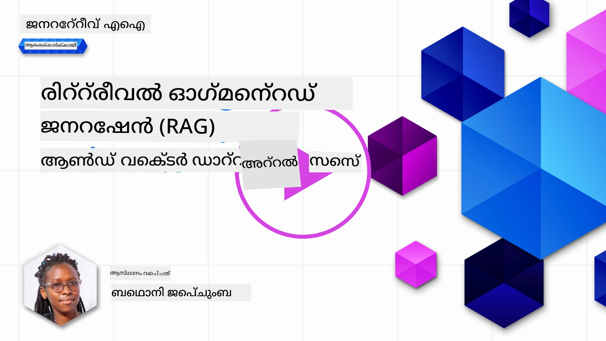
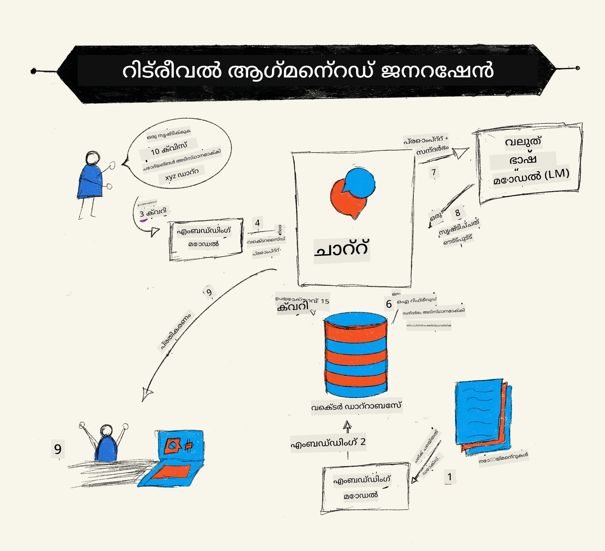
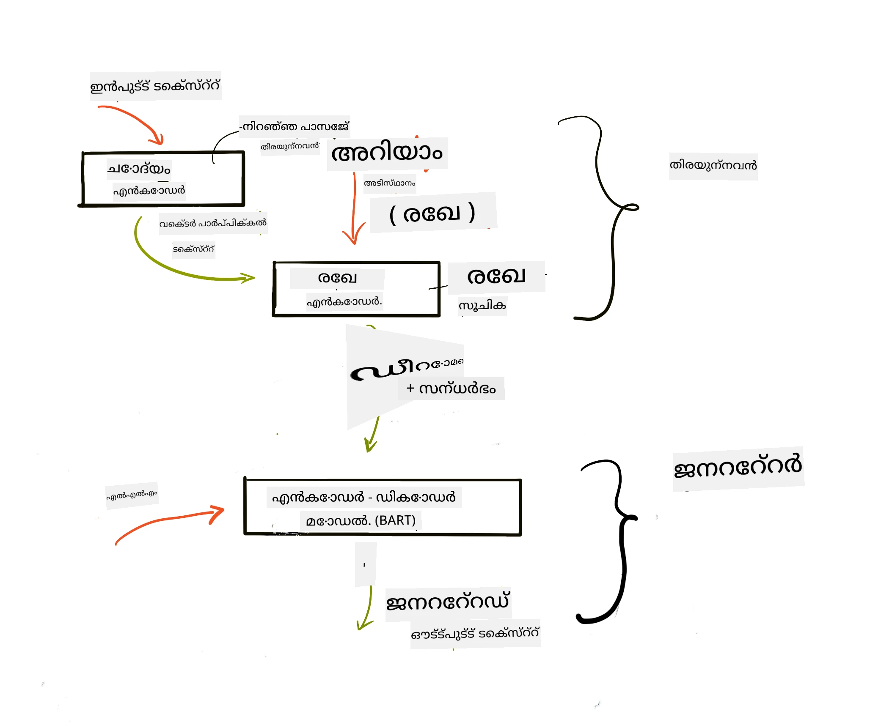

# Retrieval Augmented Generation (RAG) and Vector Databases

[](https://youtu.be/4l8zhHUBeyI?si=BmvDmL1fnHtgQYkL)

തിരയലിൽ അപ്ഗ്രേഡുചെയ്‌ത തലത്തിൽ വലിയ ഭാഷാ മോഡലുകളിലേക്ക് (LLMs) നിങ്ങളുടെ സ്വന്തം ഡാറ്റ എങ്ങനെ ഏകീകരിക്കാമെന്ന് നാം സൂക്ഷ്മമായി പഠിച്ചപ്പോൾ, ഈ പാഠത്തിൽ, നിങ്ങളുടെ LLM അപേക്ഷയിലുള്ള ഡാറ്റയെ അടിസ്ഥാനമാക്കിയുള്ളതെങ്കിലും, പ്രക്രിയയുടെ യാന്ത്രികതകളും ഡാറ്റ സംഭരിക്കുന്ന മാർഗങ്ങളും ഉൾപ്പെടെ കൂടുതൽ ആഴത്തിൽ മനസ്സിലാക്കും, അതിൽ എംബെഡിങ്സും ടെക്സ്റ്റും സാങ്കേതികമായി ഉൾപ്പെടുന്നു.

> **വീഡിയോ ഉടൻ വരുന്നു**

## പരിചയം

ഈ പാഠത്തിൽ നാം ആವರണങ്ങൾ പ്രാപിക്കും:

- RAG എന്നത് എന്താണെന്നും അവ人工 ബുദ്ധിയിൽ (AI) എന്തിനുവേണ്ടിയാണ് ഉപയോഗിക്കുന്നത് എന്നതിന്റെയും ഒരു പരിചയം.

- വക്ടർ ഡാറ്റാബേസുകൾ എന്താണെന്നു മനസ്സിലാക്കലും, നമ്മുടെ അപേക്ഷയ്ക്കായി അതിൽ ഒന്ന് സൃഷ്ടിക്കലും.

- ഒരു പ്രായോഗിക ഉദാഹരണത്തിലൂടെ RAG ആപ്ലിക്കേഷനിൽ എങ്ങനെ ഏകീകരിക്കാമെന്നും.

## പഠന ലക്ഷ്യങ്ങൾ

ഈ പാഠം പൂർത്തിയാക്കിയതിനു ശേഷം, നിങ്ങൾക്ക് സാധിക്കും:

- ഡാറ്റ റീട്രീവ് ചെയ്യുന്നതിലും പ്രോസസിംഗിലും RAGയുടെ പ്രാധാന്യം വിശദീകരിക്കുക.

- RAG ആപ്ലിക്കേഷൻ സജ്ജമാക്കുകയും നിങ്ങളുടെ ഡാറ്റ LLM-ലേക്ക് ഗ്രൗണ്ടുചെയ്യുകയും ചെയ്യുക.

- LLM ആപ്ലിക്കേഷൻകളിൽ RAGയും വക്ടർ ഡാറ്റാബേസുകളും ഫലപ്രദമായി ഏകീകരിക്കൽ.

## നമ്മുടെ ദൃശ്യപടം: നമ്മുടെ LLM-കളെ നമ്മുടെ സ്വന്തം ഡാറ്റയിലൂടെ മെച്ചപ്പെടുത്തൽ

ഈ പാഠത്തിനായി, വിദ്യാഭ്യാസ സ്റ്റാർട്ടപ്പിൽ ഞങ്ങളുടെ സ്വന്തം നോട്ടുകൾ ചേർക്കാനാണ് ഉദ്ദേശിക്കുന്നത്, ഇതുവഴി ചാറ്റ്ബോട്ട് വ്യത്യസ്ത വിഷയങ്ങളിലുള്ള കൂടുതൽ വിവരങ്ങൾ നേടും. നമുക്ക് ഉള്ള നോട്ടുകളുപയോഗിച്ച്, പഠിതാക്കൾക്ക് മികച്ച പഠനം സാധ്യമാക്കുകയും വ്യത്യസ്ത വിഷയങ്ങൾ മനസ്സിലാക്കുകയും ചെയ്യുന്നുവെന്നും, പരീക്ഷകളുടെ വിശകലനത്തിനായി ഇത് സഹായകരമാകും. നമ്മുടെ സജീവ ദൃശ്യപടം സൃഷ്ടിക്കാൻ ഞങ്ങൾ താഴെപ്പറയുന്നവ ഉപദേശിക്കുന്നു:

- `Azure OpenAI:` ഞങ്ങൾ ചാറ്റ്ബോട്ട് ഉണ്ടാക്കാനായി ഉപയോഗിക്കുന്ന LLM

- `AI for beginners' lesson on Neural Networks`: ഞങ്ങളുടെ LLM ഗ്രൗണ്ട് ചെയ്യുന്ന ഡാറ്റ

- `Azure AI Search`യും `Azure Cosmos DB:`യും, വക്ടർ ഡാറ്റാബേസും, ഡാറ്റ സംഭരിക്കുകയും തിരയൽ ഇൻഡക്സ് സൃഷ്ടിക്കുകയും ചെയ്യുന്നതിന്

ഉപയോക്താക്കൾക്ക് നോട്ടുകളിൽ നിന്നും പ്രാക്ടീസ് ക്വിസുകൾ സൃഷ്ടിക്കാനും, റിവിഷൻ ഫ്ലാഷ് കാർഡുകൾ തയ്യാറാക്കാനും, അവ ചുരുക്കി ഒരു സംക്ഷിപ്ത അവലോകനം ഉണ്ടാക്കാനും സാധിക്കും. തുടങ്ങാൻ, RAG എന്ത് ആണെന്നും അത് എങ്ങനെ പ്രവർത്തിക്കുന്നുവെന്നും നോക്കാം:

## Retrieval Augmented Generation (RAG)

ഒരു LLM ശക്തനായ ചാറ്റ്ബോട്ട് ഉപയോക്തൃ പ്രോമ്പ്റ്റുകൾ പ്രോസസ് ചെയ്ത് പ്രതികരണങ്ങൾ ഉൽപ്പാദിപ്പിക്കുന്നു. ഇത് ഇന്ററാക്ടീവ് ആയി രൂപകല്പന ചെയ്‌തിരിക്കുകയും, നിരവധി വിഷയങ്ങളിൽ ഉപയോക്താക്കളുമായി സംവദിക്കുകയും ചെയ്യുന്നു. എന്നാൽ, അതിന്റെ പ്രതികരണങ്ങൾ നൽകിയ കണ്ടക്സ്റ്റിനും അടിസ്ഥാന പരിശീലന ഡാറ്റക്കുമായാണ് പരിധിയാധിഷ്ഠിതം. ഉദാഹരണത്തിന്, GPT-4 ന്റെ അറിവ് സെപ്റ്റംബർ 2021 ലാണ് അവസാനിക്കുന്നത്, അതായത് ഈ കാലയളവിന് ശേഷം സംഭവിച്ച സംഭവങ്ങളെക്കുറിച്ചുള്ള അറിവ് ഇല്ല. കൂടാതെ, LLM-കൾക്ക് പരിശീലനം നൽകാൻ ഉപയോഗിച്ച ഡാറ്റയിൽ വ്യക്തിഗത നോട്ടുകൾ പോലുള്ള രഹസ്യ വിവരങ്ങൾ അല്ലെങ്കിൽ കമ്പനി ഉൽപ്പന്ന മാനുവലുകൾ ഉൾപ്പെടുന്നില്ല.

### RAGs (Retrieval Augmented Generation) എങ്ങനെ പ്രവർത്തിക്കുന്നു



നിങ്ങളുടെ നോട്ടുകളിൽ നിന്നുള്ള ക്വിസുകൾ ഉണ്ടാക്കുന്ന ഒരു ചാറ്റ്ബോട്ട് വിന്യസിക്കാൻ ആഗ്രഹിക്കുന്നുവെന്ന് നീക്കിയാൽ, അറിവ് അടിസ്ഥാനവുമായി ബന്ധപ്പെടേണ്ടതുണ്ട്. ഈ പ്രശ്നത്തിൽ RAG സഹായം ചെയ്യുന്നു. RAGs താഴെപ്പറയുന്ന വിധം പ്രവർത്തിക്കുന്നു:

- **അറിവ് അടിസ്ഥാനത്:** റീട്രീവലിനു മുമ്പ്, ഈ രേഖകൾ ശേഖരിക്കുകയും പ്രീപ്രോസസ് ചെയ്യുകയും ചെയ്യുന്നു, സാധാരണ വലിയ രേഖകൾ ചെറിയ ചങ്കുകളാക്കി ഭേദപ്പെടുത്തി, അവ ടекстിന്‍റെ എമ്പെഡിംഗായി മാറ്റി ഡാറ്റാബേസിൽ സേവ് ചെയ്യുന്നു.

- **ഉപയോക്തൃ ചോദ്യം:** ഉപയോക്താവ് ഒരു ചോദ്യം ചോദിക്കുന്നു

- **റീട്രീവൽ:** ഉപയോക്താവ് ചോദിച്ചപ്പോൾ, എമ്പെഡിംഗ് മോഡൽ അറിവ് അടിസ്ഥാനത്തിൽ നിന്നുള്ള പ്രസക്തമായ വിവരങ്ങൾ പിടിച്ച് പ്രതിപ്രശ്നത്തിലുള്ള സന്ദർഭം കൂട്ടുന്നു.

- **അപ്ഗ്രേഡുചെയ്‌ത ജനറേഷൻ:** LLM അതിന്റെ പ്രതികരണം, നേടി വരുന്ന ഡാറ്റയുടെ അടിസ്ഥാനത്തിൽ മെച്ചപ്പെടുത്തുന്നു. അതായത്, മുൻപ്രശിക്ഷിത ഡാറ്റ മാത്രമല്ല, ചേർത്തിരിക്കുന്ന സന്ദർഭത്തിൽ നിന്നുള്ള പ്രസക്തമായ വിവരങ്ങളും ഉൾപ്പെടുത്തുന്നു. തിരിച്ചെടുക്കപ്പെട്ട ഡാറ്റ LLM മൂല്യവത്താക്കാൻ ഉപയോഗിക്കുന്നു. തുടർന്ന് LLM ഉപയോക്താവിന്റെ ചോദ്യത്തിന് മറുപടി നൽകുന്നു.



RAG-കൾക്ക് രൂപകൽപ്പന ചെയ്ത ആർക്കിടെക്ചർ ട്രാൻസ്ഫോർമേഴ്സ് ഉപയോഗിച്ച് നടപ്പിലാക്കുന്നു, രണ്ട് ഭാഗങ്ങളായി: ഒരു എൻ‌കോഡറും ഒരു ഡീകോഡറും. ഉദാഹരണത്തിന്, ഉപയോക്താവ് ഒരു ചോദ്യം ചോദിച്ചപ്പോൾ, പ്രതിപാദ്യം ‘എൻകോഡ്’ ചെയ്ത് വൃത്തീയമായ അർത്ഥം പിടിച്ചെടുക്കുന്നു, പിന്നീട് ഡെകോഡർ ഡോക്യുമെന്റ് ഇൻഡക്‌സിലേക്ക് മാറി ഉപയോക്തൃ ചോദ്യം അടിസ്ഥാനമാക്കി പുതിയ പാഠ്യം ഉത്പാദിപ്പിക്കുന്നു. LLM ആഊട്ട്പുട്ട് സൃഷ്ടിക്കാൻ എൻകോഡർ-ഡീകോഡർ മോഡൽ ഉപയോഗിക്കുന്നു.

RAG നടപ്പാക്കുമ്പോൾ രണ്ട് സമീപനങ്ങളുണ്ട്, നിർദേശിച്ച പേപ്പർ: [Retrieval-Augmented Generation for Knowledge intensive NLP (natural language processing software) Tasks](https://arxiv.org/pdf/2005.11401.pdf?WT.mc_id=academic-105485-koreyst) പ്രകാരം:

- **_RAG-Sequence_** റീട്രീവ്ചെയ്ത രേഖകൾ ഉപയോക്തൃ ചോദ്യംക്കുള്ള ഏറ്റവും നല്ല ഉത്തരം പ്രവചിക്കാൻ ഉപയോഗിക്കുന്നു

- **RAG-Token** രേഖകൾ ഉപയോഗിച്ച് അടുത്ത ടോക്കൺ ജനറേറ്റ് ചെയ്ത്, ഉപയോക്താവിന്റെ ചോദ്യത്തിന് മറുപടി നൽകാൻ അവ വീണ്ടും റീട്രീവ് ചെയ്യുന്നുണ്ട്

### നിങ്ങൾക്ക് RAGs ഏതിനുവേണ്ടി ഉപയോഗിക്കണം?

- **വിവര സമൃദ്ധി:** ടെക്സ്റ്റ് മറുപടികൾ നവീനവും ഇപ്പോഴത്തെതുമായിരിക്കും ഉറപ്പ് ചെയ്യുന്നു. അതിലൂടെ, മേഖലാ പ്രത്യേക ജോലികളിൽ പ്രകടനം വർദ്ധിപ്പിക്കുന്നു അകത്തുള്ള അറിവ് അടിസ്ഥാനത്തിൽ ആക്‌സസ് ചെയ്യുന്നു.

- **സ്ഥാപന ഡാറ്റയിൽ** നിന്നുള്ള ഉറപ്പ് ആയ ഡാറ്റ ഉപയോഗിച്ച് ഉപയോക്തൃ ചോദ്യങ്ങൾക്ക് സന്ദർഭം നൽകുന്നതിലൂടെ തെറ്റ് പാടില്ലാത്ത മറുപടികൾ കുറക്കുന്നു.

- **ചെലവ് കുറഞ്ഞതാണ്**, LLM ഫൈൻ-ട്യൂണിംഗിനേക്കാൾ ഇതു സാമ്പത്തികമാണ്

## അറിവ് അടിസ്ഥലം നിർമ്മിക്കൽ

ഞങ്ങളുടെ അപേക്ഷ വ്യക്തിഗത ഡാറ്റ അടിസ്ഥാനമാക്കിയതാണ്, ഉദാഹരണത്തിന് Neural Network പാഠം AI For Beginners പാഠ്യപദ്ധതിയിൽ നിന്നുള്ളത്.

### വക്ടർ ഡാറ്റാബേസുകൾ

പരമ്പരാഗത ഡാറ്റാബേസുകൾക്കൊപ്പം താരതമ്യ 鄰യിച്ചാൽ, വക്ടർ ഡാറ്റാബേസ് ഒരു പ്രത്യേക ഡാറ്റാബേസ് ആണ്, എംബെഡഡ് വക്ടറുകൾ സംഭരിക്കാൻ, നിയന്ത്രിക്കാൻ, തിരയാൻ. ഇത് രേഖകളുടെ സംഖ്യാത്മക പ്രതിനിധാനങ്ങൾ സൂക്ഷിക്കുന്നു. ഡാറ്റ സംഖ്യാത്മക എംബെഡിങ്സായി പരിഭാഷപ്പെടുത്തുന്നത് ഞങ്ങളുടെ AI സിസ്റ്റം ഡാറ്റ ബുദ്ധിമുട്ടുകൂടാതെ മനസ്സിലാക്കാനും പ്രോസസ്സ് ചെയ്യാനും എളുപ്പമാക്കുന്നു.

ഞങ്ങൾ നമ്മുടെ എംബെഡിംഗ് വക്ടർ ഡാറ്റാബേസുകളിൽ സൂക്ഷിക്കുന്നു, കാരണം LLMs സ്വീകരിക്കുന്ന ടോക്കൺ പരിമിതി നിശ്ചിതമാണ്. മുഴുവൻ എംബെഡിംഗുകളും LLM-ന് നൽകാനാകാത്തതിനാൽ, അവ ചങ്കുകളായി ഭേദിച്ച്, ഉപയോക്താവ് ചോദ്യം ചോദിക്കുമ്പോൾ ഏറ്റവും ചേർന്ന എംബെഡിംഗ് ചേർന്ന് പ്രോംപ്റ്റിനൊപ്പം നൽകുന്നു. ചെങ്കിംഗ് ടോക്കണുകളുടെ എണ്ണം കുറക്കുകയും ചെലവുകുറയ്ക്കുകയും ചെയ്യുന്നു.

ചില പ്രശസ്ത വക്ടർ ഡാറ്റാബേസുകൾ Azure Cosmos DB, Clarifyai, Pinecone, Chromadb, ScaNN, Qdrant, DeepLake എന്നിവയാണ്. താഴെ കൊടുത്തിരിക്കുന്ന കമാൻഡ് ഉപയോഗിച്ച് Azure CLI വഴി Azure Cosmos DB മോഡൽ സൃഷ്ടിക്കാം:

```bash
az login
az group create -n <resource-group-name> -l <location>
az cosmosdb create -n <cosmos-db-name> -r <resource-group-name>
az cosmosdb list-keys -n <cosmos-db-name> -g <resource-group-name>
```

### ടെക്സ്റ്റിൽ നിന്ന് എംബെഡിംഗിലേക്ക്

ഡാറ്റ സംഭരിക്കുന്നതിന് മുമ്പ് അത് ഡാറ്റാബേസിൽ സൂക്ഷിക്കുന്നതിന് മുമ്പ് വക്ടർ എംബെഡിംഗ്സായി മാറ്റണം. വലിയ രേഖകൾ അല്ലെങ്കിൽ നെയ്തുനീളമുള്ള ടെക്സ്റ്റുകൾ ഉള്ളപ്പോൾ, നിങ്ങൾ പ്രതീക്ഷിക്കുന്ന ചോദനകൾ അടിസ്ഥാനമാക്കി അവ ചങ്കാക്കാം. ചങ്കിംഗ് വാച്യനിരയായി അല്ലെങ്കിൽ പാരഗ്രാഫ് തലത്തിൽ ചെയ്യാം. ചങ്കുകൾ പരിസര വാക്കുകളിൽ നിന്നുള്ള അർത്ഥങ്ങൾ പകാരുന്നു; നിങ്ങൾക്ക് ചങ്കിലേക്ക് മറ്റു സന്ദർഭങ്ങൾ ചേർക്കാം, ഉദാഹരണത്തിന് രേഖയുടെ ശീർഷകം ചേർക്കുക അല്ലെങ്കിൽ ചങ്കിന്റെ മുമ്പോ പിന്മോ കുറച്ച് ടെക്സ്റ്റ് ഉൾപ്പെടുത്തുക. താഴെ പറയുന്ന രീതിയിൽ ഡാറ്റ ചങ്കാക്കാം:

```python
def split_text(text, max_length, min_length):
    words = text.split()
    chunks = []
    current_chunk = []

    for word in words:
        current_chunk.append(word)
        if len(' '.join(current_chunk)) < max_length and len(' '.join(current_chunk)) > min_length:
            chunks.append(' '.join(current_chunk))
            current_chunk = []

    # അവസാന ഭാഗം കുറഞ്ഞ ദൈർഘ്യത്തിലിലേങ്കിലും, അത് ചേർക്കുക
    if current_chunk:
        chunks.append(' '.join(current_chunk))

    return chunks
```

ചങ്കാക്കിയശേഷം, ടെക്സ്റ്റ് വ്യത്യസ്ത എംബെഡിംഗ് മോഡലുകൾ ഉപയോഗിച്ച് എംബെഡ് ചെയ്യാം. ചില മോഡലുകൾ: word2vec, OpenAI-യുടെ ada-002, Azure കമ്പ്യൂട്ടർ വിചൻ, കൂടുതൽ. തിരഞ്ഞെടുക്കാനുള്ള മോഡൽ നിങ്ങൾ ഉപയോഗിക്കുന്ന ഭാഷകൾ, കോഡ് ചെയ്യേണ്ട ഉള്ളടക്കം (ടെക്സ്റ്റ്/ഇമേജ്/ഓഡിയോ), എൻപി‌ട് വലുപ്പം, മുടങ്ങിയ ഫല വലിപ്പം എന്നിവ അനുസരിച്ച് വ്യത്യസ്തമാകും.

OpenAI-യുടെ `text-embedding-ada-002` മോഡൽ ഉപയോഗിച്ചുള്ള ഒരു എംബെഡിംഗ് ഉദാഹരണം:


## റീട്രീവൽ және വക്ടർ സർച്ച്

ഉപയോക്താവ് ചോദ്യം ചോദിക്കുമ്പോൾ, റീട്രീവർ এটു വക്ടറായി മാറ്റുന്നു, തുടർന്ന് നമ്മുടെ രേഖ തിരയൽ ഇൻഡക്സിൽ പ്രസക്തമായ വക്ടറുകൾ തിരയുന്നു. കഴിഞ്ഞു, ഇന്ദ്ര, ഇൻപുട്ടും രേഖ വക്ടറുകളും ടക്സ്റ്റിലേക്ക് മാറ്റി LLM-ലേക്ക് നൽകുന്നു.

### റീട്രീവൽ

റീട്രീവൽ സംഭവിക്കുന്നത് സിസ്റ്റം സൂക്ഷ്മമായി തിരയൽ മാനദണ്ഡങ്ങൾ പാലിക്കുന്ന രേഖകൾ കണ്ടെത്താൻ ശ്രമിക്കുമ്പോൾ. റീട്രീവറിന്റെ ലക്ഷ്യം രേഖകൾ പിടികൂടීමയാണ്, അവ LLM ന്റെ സന്ദർഭത്തിനും ഡാറ്റ അടിസ്ഥാനത്തിലുമാകും.

നമ്മുടെ ഡാറ്റാബേസിൽ തിരയാൻ പല മാർഗ്ഗങ്ങളുണ്ട്:

- **കീവേഡ് സർച്ച്** - ടെക്സ്റ്റ് തിരച്ചിലിന് ഉപയോഗിക്കുന്നു

- **വക്ടർ സർച്ച്** - രേഖകൾ ടെക്സ്റ്റിൽ നിന്ന് എമ്പെഡിംഗ് മോഡലുകൾ ഉപയോഗിച്ച് വക്റ്റർ പ്രതിനിധാനങ്ങളായി മാറ്റുന്നു, വാക്കുകളുടെ അർത്ഥം ഉപയോഗിച്ച് **സെമാന്റിക് തിരച്ചിൽ** സാധ്യമാക്കുന്നു. റീട്രീവൽ ഉപയോക്തൃ ചോദ്യത്തോട് ഏറ്റവും അടുത്ത വക്ടറുകളുളള രേഖകളിൽ നിന്ന് നടക്കും.

- **ഹൈബ്രിഡ്** - കീവേഡ് സർച്ച്, വക്ടർ സർച്ച് എന്നിവയുടെ സംയോജനം

റീട്രീവലിൽ ഒരു വെല്ലുവിളി ഉപയോക്തൃ ചോദ്യത്തിനോട് സമാനമായ പ്രതികരണം ഡാറ്റാബേസിൽ ആവില്ലെങ്കിൽ, സിസ്റ്റം മികച്ച വിവരങ്ങൾ തിരിച്ചു നൽകും. എന്നാൽ, പ്രസക്തിക്ത്വത്തിനുള്ള പരമാവധി ദൂരം സജ്ജമാക്കുക, കൈമാറ്റ സെർച്ചിൻറെ സംയോജനം ഉപയോഗിക്കുക തുടങ്ങിയ രീതി സ്വീകരിക്കാം. ഈ പാഠത്തിൽ ഹൈബ്രിഡ് സെർച്ചിനെ ഉപയോഗിക്കുന്നു, വക്ടർ സർച്ച് അടക്കം. ഡാറ്റ നമ്മൾ ക്യൻക്ക്‌സ് നിറഞ്ഞ ഒരു ഡാറ്റാഫ്രെയിം ആയി സൂക്ഷിക്കും, ക്യൻക്സ് ഉൾപ്പെടെ എംബെഡിംഗ്സ്.

### വക്ടർ സാദൃശ്യത

റീട്രീവർ അറിവ് ഡാറ്റാബേസിൽ നിന്ന് അടുത്തു നിൽക്കുന്ന എംബെഡിംഗുകൾ തിരയുന്നു. ഉപയോക്താവ് അഡമെയ്ക്കുന്ന ക്വറി ആദ്യം എംബെഡ് ചെയ്തു സമാനമായ എംബെഡിംഗുമായി താരതമ്യം ചെയ്യും. ഞങ്ങൾ സാധാരണ ഉപയോഗിക്കുന്ന അളവാകുന്നു കോസൈൻ സാദൃശ്യത, ഇത് രണ്ട് വക്റ്ററിനുമിടയിലെ കോണിന്റെ അടിസ്ഥാനത്തിലാണ്.

സാദൃശ്യത അളക്കാൻ ഇuwur പകരം ഉപയോഗിക്കാം, യൂക്ലിഡിയൻ ദൂരം (വക്ടർ തലവരകൾക്കിടയിലെ നേരിട്ടുള്ള ദൂരം) അല്ലെങ്കിൽ ഡോട്ട് പ്രൊഡക്ട് (രണ്ടു വക്റ്ററുകളിലെ തത്സമയ ഘടകങ്ങളുടെ ഗുണിതങ്ങളുടെ ജോഡിചേർച്ച).

### തിരയൽ ഇൻഡക്സിയ്‌ക്കൽ

റീട്രീവൽ ചെയ്യുമ്പോൾ, അറിവ് അടിസ്ഥാനത്തിന് ഒരു തിരയൽ ഇൻഡക്‌സ് നിർമ്മിക്കേണ്ടതാണ്. ഒര ഇൻഡക്സ് നമ്മുടെ എംബെഡിംഗ്സ് സൂക്ഷിക്കുകയും വലിയ ഡാറ്റാബേസിലും സമാനമായ ചങ്കുകൾ വേഗത്തിൽ തിരിച്ചു കൊണ്ടുവന്നും ചെയ്യുകയും ചെയ്യുന്നു. നാം ഇൻഡക്സ് ലോക്കലി നിർമ്മിക്കാം:

```python
from sklearn.neighbors import NearestNeighbors

embeddings = flattened_df['embeddings'].to_list()

# തിരയൽ സൂചിക സൃഷ്ടിക്കുക
nbrs = NearestNeighbors(n_neighbors=5, algorithm='ball_tree').fit(embeddings)

# സൂചിക കുറിപ്പ് ചെയ്യുന്നതിനായി, നിങ്ങൾക്ക് kneighbors രീതിയിൽ ഉപയോഗിക്കാം
distances, indices = nbrs.kneighbors(embeddings)
```

### റീ-റാങ്കിംഗ്

ഡാറ്റാബേസ് ചോദിച്ചശേഷം, ഏറ്റവും പ്രസക്തമായ ഫലങ്ങൾ ആദ്യം കാട്ടേണ്ടതുണ്ട്. റങ്കിംഗ് മെഷീൻ ലേണിംഗ് ഉപയോഗിച്ച് മെച്ചപ്പെടുത്താം, സർച്ച് ഫലങ്ങൾ പ്രസക്തി യുക്തമായി ക്രമപ്പെടുത്തുന്നു. Azure AI Search പ്രയോഗിച്ച്, സെമാന്റിക് റീ-റാങ്കർ സ്വയം പ്രവർത്തിക്കുന്നു. അടുത്തെണ്ണുങ്ങളുടെ സഹായത്തോടെ റീ-റാങ്കിംഗ് പ്രവർത്തിക്കുന്ന ഉദാഹരണം:

```python
# ഏറ്റവും സമാനമായ രേഖകൾ കണ്ടെത്തുക
distances, indices = nbrs.kneighbors([query_vector])

index = []
# ഏറ്റവും സമാനമായ രേഖകൾ പ്രിന്റ് ചെയ്യുക
for i in range(3):
    index = indices[0][i]
    for index in indices[0]:
        print(flattened_df['chunks'].iloc[index])
        print(flattened_df['path'].iloc[index])
        print(flattened_df['distances'].iloc[index])
    else:
        print(f"Index {index} not found in DataFrame")
```

## എല്ലാം ചേർത്തുകൊണ്ട്

അവസാന ഘട്ടം നമ്മുടെ LLM ഉൾപ്പെടുത്താനുള്ളതാണ്, അത് ഡാറ്റയുടെ അടിസ്ഥാനപരമായ മറുപടികൾ നേടാൻ സഹായിക്കും. ഇതു നടപ്പിലാക്കുക:

```python
user_input = "what is a perceptron?"

def chatbot(user_input):
    # ചോദ്യത്തെ ഒരു ക്വറി വെക്ടറായി മാറ്റുക
    query_vector = create_embeddings(user_input)

    # ഏറ്റവും സാമ്യം ഉള്ള ഡോക്യുമെന്റുകൾ കണ്ടെത്തുക
    distances, indices = nbrs.kneighbors([query_vector])

    # സന്ദർഭം നൽകാൻ ക്വറിയിലേക്ക് ഡോക്യുമെന്റുകൾ ചേർക്കുക
    history = []
    for index in indices[0]:
        history.append(flattened_df['chunks'].iloc[index])

    # ചരിത്രവും ഉപയോക്തൃ ഇൻപുട്ടും സംയോജിപ്പിക്കുക
    history.append(user_input)

    # ഒരു സന്ദേശ объект് സൃഷ്ടിക്കുക
    messages=[
        {"role": "system", "content": "You are an AI assistant that helps with AI questions."},
        {"role": "user", "content": "\n\n".join(history) }
    ]

    # പ്രതികരണം സൃഷ്ടിക്കാൻ Responses API ഉപയോഗിക്കുക
    response = client.responses.create(
        model="gpt-5-mini",
        max_output_tokens=800,
        input=messages,
        store=False,
    )

    return response.output_text

chatbot(user_input)
```

## ഞങ്ങളുടെ ആപ്ലിക്കേഷൻ വിലയിരുത്തൽ

### വിലയിരുത്തൽ മാനദണ്ഡങ്ങൾ

- നൽകുന്ന മറുപടികളുടെ ഗുണം: സ്വാഭാവികവും സുഗമവുമുള്ള മനുഷ്യപോലുള്ള ഭാഷ

- ഡാറ്റയുടെ ആധാരിതത്വം: നൽകുന്ന മറുപടികൾ ശരിയായ രേഖകളിൽ നിന്നുള്ളതാണോയെന്ന് വിലയിരുത്തൽ

- പ്രസക്തിത്വം: മറുപടി ചോദ്യംക്കൊപ്പം യോജിക്കുന്നതും ബന്ധപ്പെട്ടതുമായിരിക്കണം

- ഭാഷാപരമായ ലയസുഖം (ഫ്ലുവൻസി): മറുപടി വായനാസുഖം ഉറപ്പുവരുത്തുക

## RAG (Retrieval Augmented Generation)യും വക്ടർ ഡാറ്റാബേസുകളും ഉപയോഗിക്കുന്ന ഉപയോഗങ്ങൾ

ആപ്ലിക്കേഷൻ മെച്ചപ്പെടുത്തുന്നതിന് ഫംഗ്ഷൻ കോൾസ് ഉപയോഗിക്കുന്ന പല വ്യത്യസ്ത ഉപയോഗപ്പാടുകൾ ഉണ്ട്:

- ചോദ്യോത്തരം: നിങ്ങളുടെ കമ്പനിയുടെ ഡാറ്റ ബ്രൗസ് ചെയ്ത് ജീവനക്കാർക്ക് ചോദ്യങ്ങൾ ചോദിക്കാൻ കഴിയുന്ന ഒരു ചാറ്റ് സൃഷ്ടിക്കുക.

- ശുപാർശാമന്ത്രങ്ങൾ നിർമ്മാണം: ഏറ്റവും സമാനമായ മൂല്യങ്ങൾ, ഉദാ: സിനിമകൾ, ഭക്ഷണശാലകൾ എന്നിവ തെളിയിക്കുന്ന സംവിധാനം.

- ചാറ്റ്ബോട് സേവനങ്ങൾ: ചാറ്റ് ചരിത്രം സൂക്ഷിക്കാനും, ഉപയോക്തൃ ഡാറ്റ അനുസരിച്ച് വ്യക്തിഗത സംഭാഷണം ആയി മാറ്റാനും.

- വക്ടർ എംബെഡിംഗുകളെ അടിസ്ഥാനമാക്കി ഇമേജ് തിരയൽ, ഇമേജ് തിരിച്ചറിയലും അനോമലി ഡിറ്റെക്ഷനും സഹായിക്കും.

## സംഗ്രഹം

RAGയുടെ അടിസ്ഥാന മേഖലകൾ, ഡാറ്റ ആപ്ലിക്കേഷനിലേക്ക് ചേർക്കൽ, ഉപയോക്തൃ ചോദ്യം, ഔട്ട്‌പുട്ട് എന്നിവ കൈകാര്യം ചെയ്തു. RAG സൃഷ്ടി ലളിതമാക്കാൻ Semanti Kernel, Langchain, Autogen പോലുള്ള ഫ്രെയിംവർക്ക് ഉപയോഗിക്കാം.

## അസൈൻമെന്റ്

Retrieval Augmented Generation (RAG) പഠനാനുഹരമായി, നിങ്ങൾ നിർമ്മിക്കാം:

- നിങ്ങളുടെ തിരഞ്ഞെടുപ്പിലുള്ള ഫ്രെയിംവർക്ക് ഉപയോഗിച്ച് ആപ്ലിക്കേഷന്റെ ഫ്രണ്ട്-എൻഡ് നിർമ്മിക്കുക

- LangChain അല്ലെങ്കിൽ Semantic Kernel പോലുള്ള ഒരു ഫ്രെയിംവർക്ക് ഉപയോഗിച്ച് നിങ്ങളുടെ ആപ്ലിക്കേഷൻ വീണ്ടും സജ്ജമാക്കുക.

പാഠം പൂർത്തിയാക്കിയതിൽ അഭിനന്ദനങ്ങൾ 👏.

## പഠനം ഇവിടെ അവസാനിക്കുന്നില്ല, യാത്ര തുടരുക

ഈ പാഠം പൂർത്തിയാക്കിയതിന് ശേഷം, കൂടുതൽ പഠനത്തിനായി നമ്മുടെ [Generative AI Learning collection](https://aka.ms/genai-collection?WT.mc_id=academic-105485-koreyst) സന്ദർശിക്കുക!

---

<!-- CO-OP TRANSLATOR DISCLAIMER START -->
**അറിയിപ്പ്**:
ഈ രേഖ AI പരിഭാഷാ സേവനം [Co-op Translator](https://github.com/Azure/co-op-translator) ഉപയോഗിച്ച് പരിഭാഷപ്പെടുത്തിയതാണ്. ഞങ്ങൾ കൃത്യതയ്ക്കായി ശ്രമിക്കുന്നുവെങ്കിലും, ഓട്ടോമേറ്റഡ് പരിഭാഷകളിൽ പിഴവുകൾ അല്ലെങ്കിൽ തെറ്റായ വിവരങ്ങൾ ഉണ്ടാകാൻ സാധ്യതയുണ്ട്. അതിന്റെ സ്വാഭാവിക ഭാഷയിലുള്ള അസൽ രേഖയാണ് പ്രാമാണികമായ ഉറവിടമായി പരിഗണിക്കേണ്ടത്. നിർണായകമായ വിവരങ്ങൾക്ക്, പ്രൊഫഷണൽ മനുഷ്യ പരിഭാഷ ശുപാർശ ചെയ്യുന്നു. ഈ പരിഭാഷ ഉപയോഗിച്ച് ഉണ്ടാകുന്ന തെറ്റിദ്ധാരണകൾ അല്ലെങ്കിൽ തെറ്റായ വ്യാഖ്യാനങ്ങൾക്കായി ഞങ്ങൾ ഉത്തരവാദികളല്ല.
<!-- CO-OP TRANSLATOR DISCLAIMER END -->